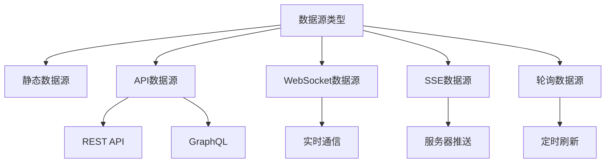
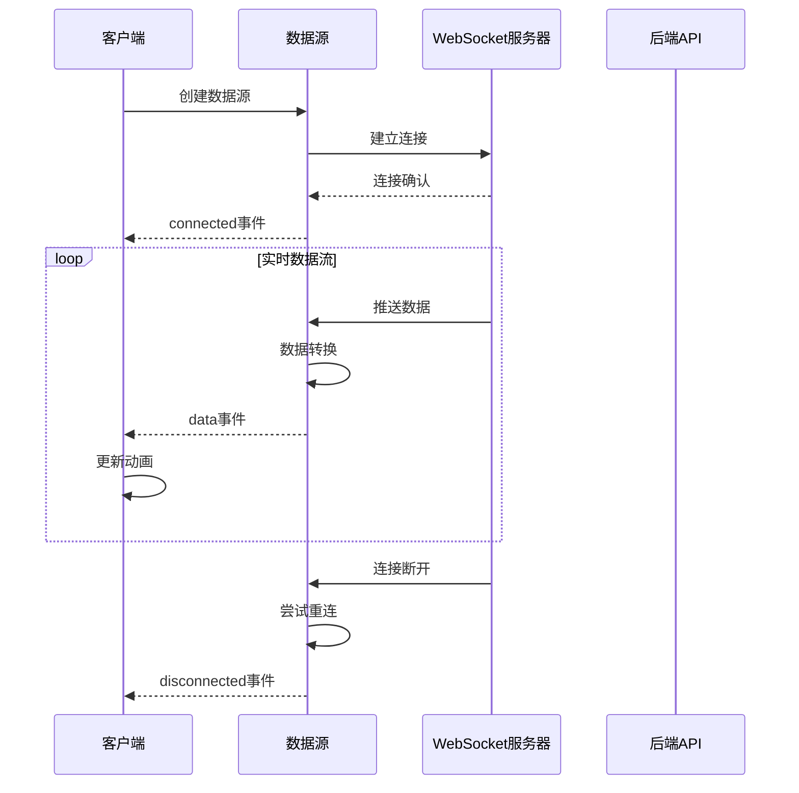
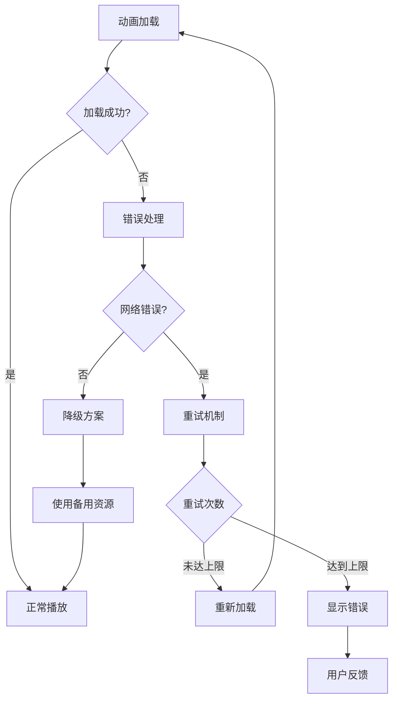

# API 参考

<cite>
**本文档中引用的文件**
- [README.md](file://README.md)
- [API_REFERENCE.md](file://API_REFERENCE.md)
- [packages/core/src/index.ts](file://packages/core/src/index.ts)
- [packages/core/src/types/index.ts](file://packages/core/src/types/index.ts)
- [packages/core/src/core/DataSource.ts](file://packages/core/src/core/DataSource.ts)
- [packages/core/src/core/PerformanceMonitor.ts](file://packages/core/src/core/PerformanceMonitor.ts)
- [packages/core/src/core/WorkerManager.ts](file://packages/core/src/core/WorkerManager.ts)
- [packages/core/src/core/AdaptiveFrameRate.ts](file://packages/core/src/core/AdaptiveFrameRate.ts)
- [packages/core/src/core/MemoryManager.ts](file://packages/core/src/core/MemoryManager.ts)
- [packages/react/src/index.ts](file://packages/react/src/index.ts)
- [packages/vue/src/index.ts](file://packages/vue/src/index.ts)
- [examples/react-demo/src/App.tsx](file://examples/react-demo/src/App.tsx)
- [examples/vue-demo/src/App.vue](file://examples/vue-demo/src/App.vue)
</cite>

## 目录
1. [简介](#简介)
2. [核心API](#核心api)
3. [框架特定API](#框架特定api)
4. [数据源API](#数据源api)
5. [性能优化API](#性能优化api)
6. [高级功能API](#高级功能api)
7. [错误处理与调试](#错误处理与调试)
8. [安全考虑](#安全考虑)
9. [版本控制与兼容性](#版本控制与兼容性)
10. [最佳实践](#最佳实践)

## 简介

Lottie 是一个功能最完整、性能最优异的 Lottie 动画库，支持多种框架集成和高级功能。本文档涵盖了核心API、框架特定API、数据源API以及各种高级功能的详细使用说明。

### 主要特性
- **跨框架支持**: Vue 3、React、Web Components、原生JavaScript
- **高性能**: 智能跳帧、OffscreenCanvas、Worker池、资源压缩
- **高级功能**: 时间线控制、拖拽交互、数据绑定、实时数据源
- **完整类型支持**: 100% TypeScript类型覆盖

## 核心API

### createLottie(config)

创建Lottie动画实例的简化函数。

```typescript
const instance = createLottie({
  container: '#lottie',
  path: 'animation.json',
  loop: true,
  autoplay: true,
  renderer: 'svg',
  advanced: {
    enableSmartFrameSkip: true,
    targetFPS: 60
  }
})
```

**参数:**
- `config: LottieConfig` - 动画配置对象

**返回:**
- `ILottieInstance` - 动画实例

**配置选项:**

| 属性 | 类型 | 默认值 | 描述 |
|------|------|--------|------|
| `container` | `HTMLElement \| string` | - | 容器元素或选择器 |
| `renderer` | `'svg' \| 'canvas' \| 'html'` | `'svg'` | 渲染器类型 |
| `loop` | `boolean \| number` | `false` | 循环播放设置 |
| `autoplay` | `boolean` | `false` | 自动播放 |
| `animationData` | `any` | - | 动画JSON数据 |
| `path` | `string` | - | 动画文件路径 |
| `speed` | `number` | `1` | 播放速度 |
| `quality` | `'low' \| 'medium' \| 'high' \| 'auto'` | `'auto'` | 动画质量 |
| `loadStrategy` | `'eager' \| 'lazy' \| 'intersection'` | `'eager'` | 加载策略 |

**节来源**
- [packages/core/src/index.ts](file://packages/core/src/index.ts#L113-L128)
- [packages/core/src/types/index.ts](file://packages/core/src/types/index.ts#L115-L146)

### LottieManager

全局动画管理器单例。

```typescript
import { lottieManager } from '@ldesign/lottie'

// 创建实例
const instance = lottieManager.create({ /* config */ })

// 全局控制
lottieManager.playAll()
lottieManager.pauseAll()
lottieManager.stopAll()

// 性能统计
const stats = lottieManager.getGlobalStats()
```

**方法:**

| 方法 | 参数 | 返回值 | 描述 |
|------|------|--------|------|
| `create(config)` | `LottieConfig` | `ILottieInstance` | 创建新实例 |
| `get(id)` | `string` | `ILottieInstance \| undefined` | 根据ID获取实例 |
| `destroy(id)` | `string` | `void` | 销毁实例 |
| `playAll()` | - | `void` | 播放所有实例 |
| `pauseAll()` | - | `void` | 暂停所有实例 |
| `stopAll()` | - | `void` | 停止所有实例 |
| `preload(path)` | `string` | `Promise<any>` | 预加载动画 |
| `getGlobalStats()` | - | `GlobalPerformanceStats` | 获取全局统计 |
| `optimize()` | - | `void` | 优化性能 |

**节来源**
- [packages/core/src/index.ts](file://packages/core/src/index.ts#L2-L4)
- [packages/angular/src/lottie.service.ts](file://packages/angular/src/lottie.service.ts#L45-L131)

## 框架特定API

### React Hooks API

#### useLottie(options)

React Hook，提供对Lottie动画的完整控制。

```typescript
import { useLottie } from '@ldesign/lottie/react'

const { 
  containerRef, 
  instance, 
  isReady, 
  isPlaying, 
  play, 
  pause, 
  stop, 
  setSpeed 
} = useLottie({
  animationData,
  loop: true,
  autoplay: false,
  renderer: 'canvas'
})
```

**返回值:**

| 属性/方法 | 类型 | 描述 |
|-----------|------|------|
| `containerRef` | `React.RefObject<HTMLElement>` | 容器引用 |
| `instance` | `ILottieInstance` | 动画实例 |
| `isReady` | `boolean` | 是否已加载 |
| `isPlaying` | `boolean` | 是否正在播放 |
| `play()` | `() => void` | 播放动画 |
| `pause()` | `() => void` | 暂停动画 |
| `stop()` | `() => void` | 停止动画 |
| `setSpeed(speed)` | `(speed: number) => void` | 设置播放速度 |

#### useLottieInteractive(options)

提供交互式控制的Hook。

```typescript
import { useLottieInteractive } from '@ldesign/lottie/react'

const { 
  drag, 
  gesture, 
  interactive 
} = useLottieInteractive({
  instance,
  enableClick: true,
  enableHover: true,
  enableDrag: true
})
```

**节来源**
- [packages/react/src/index.ts](file://packages/react/src/index.ts#L1-L8)
- [examples/react-demo/src/App.tsx](file://examples/react-demo/src/App.tsx#L56-L98)

### Vue Composables API

#### useLottie(options)

Vue 3组合式API，提供响应式动画控制。

```typescript
import { useLottie } from '@ldesign/lottie/vue'

const { 
  containerRef, 
  instance, 
  isReady, 
  isPlaying, 
  play, 
  pause, 
  stop 
} = useLottie({
  animationData,
  loop: true,
  autoplay: false
})
```

#### useLottieInteractive(options)

Vue 3交互式组合式API。

```typescript
import { useLottieInteractive } from '@ldesign/lottie/vue'

const { 
  drag, 
  gesture, 
  interactive 
} = useLottieInteractive({
  instance,
  enableClick: true,
  enableHover: true,
  enableDrag: true
})
```

**节来源**
- [packages/vue/src/index.ts](file://packages/vue/src/index.ts#L1-L21)
- [examples/vue-demo/src/App.vue](file://examples/vue-demo/src/App.vue#L40-L56)

### Angular Service API

#### LottieService

Angular服务提供完整的Lottie动画管理功能。

```typescript
import { LottieService } from '@ldesign/lottie-angular'

@Component({...})
export class MyComponent {
  constructor(private lottieService: LottieService) {}
  
  ngOnInit() {
    const instance = this.lottieService.create({
      container: this.container.nativeElement,
      animationData: this.animationData
    })
  }
}
```

**方法:**

| 方法 | 参数 | 返回值 | 描述 |
|------|------|--------|------|
| `create(config)` | `LottieConfig` | `ILottieInstance` | 创建动画实例 |
| `get(id)` | `string` | `ILottieInstance \| undefined` | 获取实例 |
| `destroy(id)` | `string` | `void` | 销毁实例 |
| `preload(path)` | `string` | `Promise<any>` | 预加载动画 |
| `getGlobalStats()` | - | `any` | 获取全局统计 |

**节来源**
- [packages/angular/src/lottie.service.ts](file://packages/angular/src/lottie.service.ts#L45-L131)

## 数据源API

### 数据源类型

Lottie支持多种数据源类型，实现实时数据更新：



**图表来源**
- [packages/core/src/core/DataSource.ts](file://packages/core/src/core/DataSource.ts#L6-L31)

### DataSourceFactory

数据源工厂类，用于创建不同类型的DataSource实例。

```typescript
import { DataSourceFactory } from '@ldesign/lottie'

// API 数据源
const apiSource = DataSourceFactory.create({
  type: 'api',
  url: 'https://api.example.com/data'
})

// WebSocket 数据源
const wsSource = DataSourceFactory.create({
  type: 'websocket',
  url: 'wss://api.example.com/ws',
  reconnect: {
    enabled: true,
    maxAttempts: 5,
    delay: 1000
  }
})
```

**支持的数据源类型:**

| 类型 | 描述 | 适用场景 |
|------|------|----------|
| `'api'` | REST API数据源 | 获取远程数据 |
| `'websocket'` | WebSocket连接 | 实时双向通信 |
| `'sse'` | Server-Sent Events | 服务器推送事件 |
| `'polling'` | 定时轮询 | 简单实时更新 |

### WebSocket API

#### 连接处理

```typescript
import { WebSocketDataSource } from '@ldesign/lottie'

const wsSource = new WebSocketDataSource({
  url: 'wss://api.example.com/ws',
  reconnect: {
    enabled: true,
    maxAttempts: 5,
    delay: 1000
  },
  transform: (data) => ({
    progress: data.percentage,
    status: data.state
  })
})

// 连接
await wsSource.connect()

// 发送数据
wsSource.send({ action: 'update', data: { value: 42 } })

// 监听事件
wsSource.on('data', (data) => {
  console.log('收到实时数据:', data)
})
```

**连接状态:**

| 状态 | 描述 | 触发时机 |
|------|------|----------|
| `'connected'` | 已连接 | WebSocket连接成功 |
| `'disconnected'` | 已断开 | 连接断开或关闭 |
| `'data'` | 数据更新 | 收到新数据 |
| `'error'` | 错误 | 连接或处理错误 |

### Server-Sent Events (SSE)

```typescript
import { SSEDataSource } from '@ldesign/lottie'

const sseSource = new SSEDataSource({
  url: 'https://api.example.com/events',
  reconnect: {
    enabled: true,
    maxAttempts: 10,
    delay: 2000
  }
})

sseSource.on('data', (event) => {
  // 处理服务器推送事件
  switch (event.type) {
    case 'progress':
      updateProgressBar(event.data.percentage)
      break
    case 'complete':
      showCompletionMessage()
      break
  }
})
```

### 实时数据更新流程



**图表来源**
- [packages/core/src/core/DataSource.ts](file://packages/core/src/core/DataSource.ts#L175-L265)

**节来源**
- [packages/core/src/core/DataSource.ts](file://packages/core/src/core/DataSource.ts#L1-L410)

## 性能优化API

### WorkerManager

Web Worker管理器，负责多线程处理任务。

```typescript
import { workerManager } from '@ldesign/lottie'

// 解析动画数据
const parsed = await workerManager.parseAnimation(data)

// 压缩动画数据
const compressed = await workerManager.compressAnimation(data)

// 获取统计信息
const stats = workerManager.getStats()
```

**配置选项:**

| 配置项 | 类型 | 默认值 | 描述 |
|--------|------|--------|------|
| `workerCount` | `number` | CPU核心数一半 | Worker数量 |
| `timeout` | `number` | 30000 | 任务超时时间(ms) |
| `enabled` | `boolean` | `true` | 是否启用Worker |
| `useSharedWorker` | `boolean` | `false` | 使用共享Worker |
| `maxRetries` | `number` | 3 | 最大重试次数 |
| `enablePriority` | `boolean` | `true` | 启用任务优先级 |

### ResourceCompressor

资源压缩和优化工具。

```typescript
import { resourceCompressor } from '@ldesign/lottie'

// 分析动画复杂度
const analysis = resourceCompressor.analyze(animationData)

// 压缩动画
const result = await resourceCompressor.compress(animationData, {
  compressPaths: true,
  removeRedundant: true,
  precision: 2
})

// 获取优化建议
const suggestions = resourceCompressor.getCompressionSuggestions(animationData)
```

**压缩选项:**

| 选项 | 类型 | 描述 |
|------|------|------|
| `compressPaths` | `boolean` | 压缩路径数据 |
| `removeRedundant` | `boolean` | 移除冗余数据 |
| `removeHiddenLayers` | `boolean` | 移除隐藏图层 |
| `precision` | `number` | 数值精度 |
| `simplifyPaths` | `boolean` | 简化路径 |

### AdaptiveFrameRate

自适应帧率管理器，根据设备性能动态调整帧率。

```typescript
import { AdaptiveFrameRate } from '@ldesign/lottie'

const adaptive = new AdaptiveFrameRate(instance, {
  targetFPS: 60,
  minFPS: 15,
  maxFPS: 60,
  adjustInterval: 1000
})

// 获取当前状态
const stats = adaptive.getStats()
console.log('当前FPS:', stats.currentFPS)
console.log('实际FPS:', stats.actualFPS)
console.log('状态:', stats.status)
```

**节来源**
- [packages/core/src/core/WorkerManager.ts](file://packages/core/src/core/WorkerManager.ts#L1-L612)
- [packages/core/src/core/PerformanceMonitor.ts](file://packages/core/src/core/PerformanceMonitor.ts#L1-L126)
- [packages/core/src/core/AdaptiveFrameRate.ts](file://packages/core/src/core/AdaptiveFrameRate.ts#L1-L310)

## 高级功能API

### TimelineController

时间线编辑和控制功能。

```typescript
import { TimelineController } from '@ldesign/lottie'

const timeline = new TimelineController(instance, {
  duration: 5,
  fps: 60
})

// 添加轨道
const track = timeline.addTrack('position')

// 添加关键帧
timeline.addKeyframe(track, {
  time: 0,
  value: { x: 0, y: 0 },
  easing: 'easeInOut'
})

// 播放控制
timeline.play()
timeline.pause()
timeline.seekTo(2.5)
```

**关键帧属性:**

| 属性 | 类型 | 描述 |
|------|------|------|
| `time` | `number` | 关键帧时间(秒) |
| `value` | `any` | 关键帧值 |
| `easing` | `string` | 缓动函数 |

### DragController

拖拽交互控制。

```typescript
import { DragController } from '@ldesign/lottie'

const drag = new DragController(instance, {
  axis: 'x',
  bounds: { left: 0, right: 500 },
  grid: 10,
  inertia: true,
  mapToProgress: true
})

drag.on('dragStart', (e) => {
  console.log('开始拖拽')
})

drag.on('drag', (e) => {
  console.log('拖拽进度:', e.progress)
})
```

**配置选项:**

| 选项 | 类型 | 描述 |
|------|------|------|
| `axis` | `'x' \| 'y' \| 'both'` | 拖拽轴向 |
| `bounds` | `{left: number, right: number, top: number, bottom: number}` | 边界约束 |
| `grid` | `number` | 网格大小 |
| `inertia` | `boolean` | 启用惯性效果 |
| `mapToProgress` | `boolean` | 映射到动画进度 |

### DataBinding

数据驱动动画绑定。

```typescript
import { DataBinding, Validators, Pipes } from '@ldesign/lottie'

const binding = new DataBinding(instance)

binding.bind({
  path: 'user.score',
  target: 'scoreText',
  property: 'text',
  validators: [
    Validators.required(),
    Validators.range(0, 100)
  ],
  pipes: [
    Pipes.round(0),
    Pipes.toString()
  ]
})

// 更新数据
binding.update('user.score', 85)
```

**验证器:**

| 验证器 | 参数 | 描述 |
|--------|------|------|
| `required()` | - | 必填验证 |
| `number()` | - | 数字验证 |
| `range(min, max)` | `min: number, max: number` | 范围验证 |
| `email()` | - | 邮箱验证 |
| `pattern(regex)` | `regex: RegExp` | 正则验证 |

**转换管道:**

| 管道 | 参数 | 描述 |
|------|------|------|
| `toNumber()` | - | 转数字 |
| `round(decimals)` | `decimals: number` | 四舍五入 |
| `clamp(min, max)` | `min: number, max: number` | 限制范围 |
| `percentage()` | - | 百分比格式 |
| `currency(currency)` | `currency: string` | 货币格式 |
| `uppercase()` | - | 大写转换 |
| `default(value)` | `value: any` | 默认值 |

**节来源**
- [packages/core/src/types/index.ts](file://packages/core/src/types/index.ts#L30-L268)

## 错误处理与调试

### 错误处理策略



### 性能监控

```typescript
import { PerformanceMonitor } from '@ldesign/lottie'

const monitor = new PerformanceMonitor(totalFrames, duration)

monitor.onMetrics((metrics) => {
  console.log('FPS:', metrics.fps)
  console.log('内存:', metrics.memory, 'MB')
  console.log('CPU:', metrics.cpuUsage, '%')
  
  if (metrics.fps < 30) {
    console.warn('性能警告: FPS过低')
  }
})

monitor.start()
```

### 调试工具

```typescript
import { DebugPanel } from '@ldesign/lottie'

const debug = new DebugPanel(instance, {
  position: 'top-right',
  showChart: true
})

debug.show()
debug.log('info', '动画已加载')
```

**节来源**
- [packages/core/src/core/PerformanceMonitor.ts](file://packages/core/src/core/PerformanceMonitor.ts#L101-L125)
- [packages/core/src/core/MemoryManager.ts](file://packages/core/src/core/MemoryManager.ts#L1-L52)

## 安全考虑

### 输入验证

```typescript
// 验证动画数据
function validateAnimationData(data: any): boolean {
  if (!data || typeof data !== 'object') return false
  
  // 检查必需字段
  const requiredFields = ['v', 'fr', 'ip', 'op', 'layers']
  return requiredFields.every(field => field in data)
}

// 安全加载
try {
  const safeData = validateAnimationData(rawData) ? rawData : getDefaultAnimation()
  const instance = createLottie({ animationData: safeData })
} catch (error) {
  console.error('无效的动画数据:', error)
}
```

### 资源限制

```typescript
// 内存限制
const memoryManager = new MemoryManager({
  memoryLimit: 100, // 100MB
  warningThreshold: 0.8,
  dangerThreshold: 0.9
})

memoryManager.onMemoryPressure((event) => {
  if (event.action === 'cleanup') {
    // 清理非活跃动画
    lottieManager.destroyOldest()
  }
})
```

### 网络安全

```typescript
// WebSocket安全连接
const secureWs = new WebSocketDataSource({
  url: 'wss://api.example.com/',
  headers: {
    'Authorization': `Bearer ${token}`,
    'Origin': window.location.origin
  },
  reconnect: {
    enabled: true,
    maxAttempts: 5
  }
})
```

## 版本控制与兼容性

### 语义化版本

本项目遵循 [语义化版本](https://semver.org/lang/zh-CN/) 规范：

| 版本类型 | 格式 | 示例 | 描述 |
|----------|------|------|------|
| 主版本号 | `X.0.0` | `2.0.0` | 不兼容的API修改 |
| 次版本号 | `X.Y.0` | `1.1.0` | 向下兼容的功能性新增 |
| 修订号 | `X.Y.Z` | `1.0.1` | 向下兼容的问题修正 |

### 向后兼容性

```typescript
// 兼容性检查
if (typeof createLottie === 'function') {
  // 使用新API
  const instance = createLottie(config)
} else {
  // 降级到旧版本
  const instance = oldCreateLottie(config)
}
```

### 迁移指南

#### 从v1.0.x迁移到v1.1.0

1. **新增功能导入**
```typescript
// 新增的高级功能
import { TimelineController, DragController } from '@ldesign/lottie'
```

2. **性能优化配置**
```typescript
// 新增性能监控配置
const instance = createLottie({
  advanced: {
    enablePerformanceMonitor: true,
    targetFPS: 60
  }
})
```

3. **数据源API更新**
```typescript
// 新增WebSocket和SSE支持
const wsSource = DataSourceFactory.create({
  type: 'websocket',
  url: 'wss://api.example.com/'
})
```

**节来源**
- [CHANGELOG.md](file://CHANGELOG.md#L220-L233)

## 最佳实践

### 高性能场景

```typescript
const instance = createLottie({
  container: '#lottie',
  path: 'animation.json',
  renderer: 'canvas',
  advanced: {
    useOffscreenCanvas: true,
    enablePerformanceMonitor: true,
    targetFPS: 60
  }
})
```

### 低性能/移动端场景

```typescript
const instance = createLottie({
  container: '#lottie',
  path: 'animation.json',
  renderer: 'canvas',
  quality: 'medium',
  advanced: {
    enableSmartFrameSkip: true,
    enableAutoDegradation: true,
    targetFPS: 30,
    maxMemory: 50
  }
})
```

### 内存敏感场景

```typescript
import { resourceCompressor } from '@ldesign/lottie'

// 压缩动画数据
const compressed = await resourceCompressor.compress(data, {
  compressPaths: true,
  removeRedundant: true,
  removeHiddenLayers: true
})

const instance = createLottie({
  animationData: compressed.data,
  advanced: {
    enableCache: true
  }
})
```

### 框架集成最佳实践

#### React最佳实践

```typescript
function OptimizedLottie() {
  const { containerRef, instance, isReady } = useLottie({
    animationData,
    loop: true,
    autoplay: false,
    renderer: 'canvas'
  })
  
  useEffect(() => {
    // 组件卸载时清理
    return () => {
      instance?.destroy()
    }
  }, [])
  
  return (
    <div ref={containerRef} className="lottie-container" />
  )
}
```

#### Vue最佳实践

```vue
<script setup>
import { ref, onUnmounted } from 'vue'
import { useLottie } from '@ldesign/lottie-vue'

const { containerRef, instance } = useLottie({
  animationData,
  loop: true,
  autoplay: false
})

onUnmounted(() => {
  instance?.destroy()
})
</script>

<template>
  <div ref="containerRef" class="lottie-container" />
</template>
```

### 性能优化技巧

1. **合理选择渲染器**
   - SVG: 矢量图形，适合简单动画
   - Canvas: 位图渲染，适合复杂动画
   - HTML: DOM操作，适合交互性强的动画

2. **优化加载策略**
   ```typescript
   const instance = createLottie({
     path: 'animation.json',
     loadStrategy: 'intersection', // 可见时加载
     advanced: {
       intersectionOptions: {
         threshold: 0.5 // 50%可见时加载
       }
     }
   })
   ```

3. **使用预加载**
   ```typescript
   // 预加载关键动画
   await lottieManager.preload('critical-animation.json')
   ```

4. **内存管理**
   ```typescript
   // 定期清理
   setInterval(() => {
     memoryManager.forceCleanup()
   }, 60000)
   ```

### 监控和调试

```typescript
// 性能监控
const monitor = new PerformanceMonitor(totalFrames, duration)
monitor.onMetrics((metrics) => {
  if (metrics.fps < 30) {
    console.warn('FPS下降到:', metrics.fps)
  }
})

// 内存监控
memoryManager.onMemoryPressure((event) => {
  console.log('内存状态:', event.stats.status)
  if (event.action === 'emergency') {
    // 紧急清理
    lottieManager.destroyAll()
  }
})
```

**节来源**
- [API_REFERENCE.md](file://API_REFERENCE.md#L430-L507)

## 结论

Lottie库提供了完整而强大的API体系，支持从基础动画播放到高级交互功能的各种需求。通过合理使用这些API，开发者可以构建高性能、用户体验优秀的动画应用。

### 关键要点

1. **选择合适的API**: 根据项目需求选择核心API或高级功能API
2. **性能优化**: 利用WorkerManager、ResourceCompressor等工具进行性能优化
3. **错误处理**: 实现完善的错误处理和降级机制
4. **框架集成**: 使用框架特定的API获得最佳开发体验
5. **监控调试**: 利用性能监控和调试工具确保应用稳定性

通过遵循本文档的指导和最佳实践，开发者可以充分发挥Lottie库的强大功能，创建出色的动画体验。