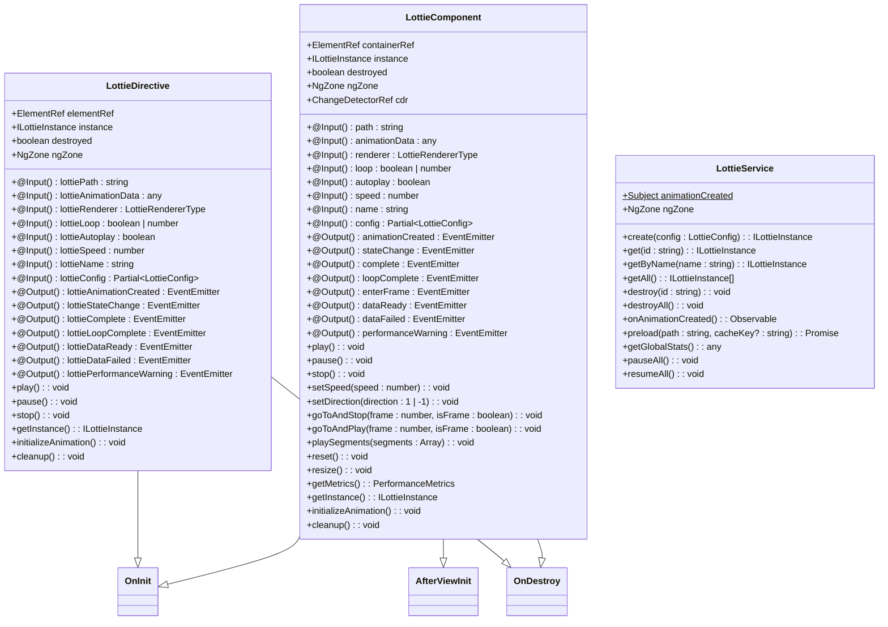

# Angular适配器API文档

<cite>
**本文档引用的文件**
- [lottie.component.ts](file://packages/angular/src/lottie.component.ts)
- [lottie.directive.ts](file://packages/angular/src/lottie.directive.ts)
- [lottie.service.ts](file://packages/angular/src/lottie.service.ts)
- [index.ts](file://packages/angular/src/index.ts)
- [package.json](file://packages/angular/package.json)
- [lottie.component.spec.ts](file://packages/angular/src/__tests__/lottie.component.spec.ts)
- [app.component.ts](file://examples/angular-demo/src/app/app.component.ts)
- [README.md](file://packages/angular/README.md)
</cite>

## 目录
1. [简介](#简介)
2. [项目结构](#项目结构)
3. [核心组件](#核心组件)
4. [架构概览](#架构概览)
5. [详细组件分析](#详细组件分析)
6. [依赖关系分析](#依赖关系分析)
7. [性能考虑](#性能考虑)
8. [故障排除指南](#故障排除指南)
9. [结论](#结论)

## 简介

Lottie Angular适配器是一个高性能的Angular组件库，为Web应用程序提供流畅的Lottie动画支持。该适配器采用现代化的Angular架构设计，支持standalone组件、指令和服务模式，提供了完整的TypeScript类型安全支持和优秀的性能表现。

### 主要特性

- 🎨 **独立组件支持** - 兼容Angular 14+独立API
- 🎯 **类型安全** - 完整的TypeScript支持和类型定义
- ⚡ **性能优化** - 在Angular区域外运行以获得更好性能
- 🎭 **多API模式** - 组件、指令和服务三种使用方式
- 🔧 **高度可配置** - 丰富的配置选项
- 📱 **响应式设计** - 自动设备检测和优化

## 项目结构

```mermaid
graph TB
subgraph "Angular适配器包结构"
A[lottie.component.ts] --> B[LottieComponent]
C[lottie.directive.ts] --> D[LottieDirective]
E[lottie.service.ts] --> F[LottieService]
G[index.ts] --> H[导出入口]
subgraph "核心功能"
B
D
F
end
subgraph "外部依赖"
I[@ldesign/lottie-core]
J[Angular Core]
K[RxJS]
end
B --> I
D --> I
F --> I
B --> J
D --> J
F --> J
F --> K
end
```

**图表来源**
- [lottie.component.ts](file://packages/angular/src/lottie.component.ts#L1-L261)
- [lottie.directive.ts](file://packages/angular/src/lottie.directive.ts#L1-L176)
- [lottie.service.ts](file://packages/angular/src/lottie.service.ts#L1-L132)

**章节来源**
- [package.json](file://packages/angular/package.json#L1-L72)
- [index.ts](file://packages/angular/src/index.ts#L1-L27)

## 核心组件

Lottie Angular适配器包含三个核心组件：LottieComponent、LottieDirective和LottieService，每个都针对不同的使用场景进行了优化。

### 组件层次结构



**图表来源**
- [lottie.component.ts](file://packages/angular/src/lottie.component.ts#L55-L261)
- [lottie.directive.ts](file://packages/angular/src/lottie.directive.ts#L37-L176)
- [lottie.service.ts](file://packages/angular/src/lottie.service.ts#L22-L132)

**章节来源**
- [lottie.component.ts](file://packages/angular/src/lottie.component.ts#L1-L261)
- [lottie.directive.ts](file://packages/angular/src/lottie.directive.ts#L1-L176)
- [lottie.service.ts](file://packages/angular/src/lottie.service.ts#L1-L132)

## 架构概览

Lottie Angular适配器采用了现代化的架构设计，通过三层分离确保了最佳的性能和可维护性。

```mermaid
graph TB
subgraph "用户界面层"
A[Angular组件模板]
B[指令绑定]
C[服务调用]
end
subgraph "适配器层"
D[LottieComponent]
E[LottieDirective]
F[LottieService]
end
subgraph "核心层"
G[LottieManager]
H[LottieInstance]
I[Core Engine]
end
subgraph "外部资源"
J[动画JSON文件]
K[本地资源]
L[CDN资源]
end
A --> D
B --> E
C --> F
D --> G
E --> G
F --> G
G --> H
H --> I
J --> G
K --> G
L --> G
```



**图表来源**
- [lottie.component.ts](file://packages/angular/src/lottie.component.ts#L102-L191)
- [lottie.directive.ts](file://packages/angular/src/lottie.directive.ts#L72-L144)
- [lottie.service.ts](file://packages/angular/src/lottie.service.ts#L33-L48)

## 详细组件分析

### LottieComponent - 组件API

LottieComponent是主要的动画组件，提供了最完整的功能集和最佳的开发体验。

#### 输入属性（@Input）

| 属性名 | 类型 | 默认值 | 描述 |
|--------|------|--------|------|
| `path` | `string` | - | 动画JSON文件的路径 |
| `animationData` | `any` | - | 直接传入的动画数据对象 |
| `renderer` | `'svg' \| 'canvas' \| 'html' \| 'webgl'` | `'svg'` | 渲染器类型选择 |
| `loop` | `boolean \| number` | `true` | 循环播放设置 |
| `autoplay` | `boolean` | `true` | 自动播放设置 |
| `speed` | `number` | `1` | 动画播放速度 |
| `name` | `string` | - | 动画名称标识 |
| `config` | `Partial<LottieConfig>` | - | 高级配置选项 |

#### 输出事件（@Output）

| 事件名 | 类型 | 描述 |
|--------|------|------|
| `animationCreated` | `EventEmitter<ILottieInstance>` | 动画创建完成时触发 |
| `stateChange` | `EventEmitter<AnimationState>` | 动画状态改变时触发 |
| `complete` | `EventEmitter<void>` | 动画播放完成时触发 |
| `loopComplete` | `EventEmitter<void>` | 每次循环完成时触发 |
| `enterFrame` | `EventEmitter<{currentTime: number; totalTime: number; direction: number}>` | 帧进入时触发 |
| `dataReady` | `EventEmitter<void>` | 数据加载完成时触发 |
| `dataFailed` | `EventEmitter<Error>` | 数据加载失败时触发 |
| `performanceWarning` | `EventEmitter<PerformanceMetrics>` | 性能问题警告时触发 |

#### 公共API方法

```mermaid
sequenceDiagram
participant User as 用户代码
participant Component as LottieComponent
participant Instance as ILottieInstance
participant Manager as LottieManager
User->>Component : 调用play()
Component->>Instance : instance.play()
Instance->>Manager : 执行播放逻辑
Manager-->>Instance : 返回执行结果
Instance-->>Component : 播放状态更新
Component-->>User : 方法执行完成
User->>Component : 调用setSpeed(2)
Component->>Instance : instance.setSpeed(2)
Instance->>Manager : 设置播放速度
Manager-->>Instance : 速度更新完成
Instance-->>Component : 速度设置成功
Component-->>User : 方法执行完成
```



**图表来源**
- [lottie.component.ts](file://packages/angular/src/lottie.component.ts#L198-L244)

**章节来源**
- [lottie.component.ts](file://packages/angular/src/lottie.component.ts#L58-L76)
- [lottie.component.ts](file://packages/angular/src/lottie.component.ts#L68-L76)

### LottieDirective - 指令API

LottieDirective提供了灵活的指令绑定方式，可以应用于任何HTML元素。

#### 指令属性

| 属性名 | 类型 | 默认值 | 描述 |
|--------|------|--------|------|
| `lottiePath` | `string` | - | 动画JSON文件路径 |
| `lottieAnimationData` | `any` | - | 动画数据对象 |
| `lottieRenderer` | `'svg' \| 'canvas' \| 'html' \| 'webgl'` | `'svg'` | 渲染器类型 |
| `lottieLoop` | `boolean \| number` | `true` | 循环设置 |
| `lottieAutoplay` | `boolean` | `true` | 自动播放设置 |
| `lottieSpeed` | `number` | `1` | 播放速度 |
| `lottieName` | `string` | - | 动画名称 |
| `lottieConfig` | `Partial<LottieConfig>` | - | 配置选项 |

#### 指令事件

| 事件名 | 类型 | 描述 |
|--------|------|------|
| `lottieAnimationCreated` | `EventEmitter<ILottieInstance>` | 动画创建完成 |
| `lottieStateChange` | `EventEmitter<AnimationState>` | 状态改变 |
| `lottieComplete` | `EventEmitter<void>` | 播放完成 |
| `lottieLoopComplete` | `EventEmitter<void>` | 循环完成 |
| `lottieDataReady` | `EventEmitter<void>` | 数据就绪 |
| `lottieDataFailed` | `EventEmitter<Error>` | 数据加载失败 |
| `lottiePerformanceWarning` | `EventEmitter<PerformanceMetrics>` | 性能警告 |

**章节来源**
- [lottie.directive.ts](file://packages/angular/src/lottie.directive.ts#L38-L53)
- [lottie.directive.ts](file://packages/angular/src/lottie.directive.ts#L47-L53)

### LottieService - 服务API

LottieService提供了程序化的动画管理能力，适合复杂的业务场景。

#### 服务注入和使用

```mermaid
flowchart TD
A[服务注入] --> B{注入方式}
B --> |根级别| C[全局可用]
B --> |模块级别| D[模块内可用]
B --> |组件级别| E[组件内可用]
C --> F[create方法]
D --> F
E --> F
F --> G[返回ILottieInstance]
G --> H[程序化控制]
H --> I[play/pause/stop]
H --> J[速度控制]
H --> K[帧定位]
H --> L[生命周期管理]
```



**图表来源**
- [lottie.service.ts](file://packages/angular/src/lottie.service.ts#L22-L25)

#### 服务方法详解

| 方法名 | 参数 | 返回值 | 描述 |
|--------|------|--------|------|
| `create` | `config: LottieConfig` | `ILottieInstance` | 创建新的动画实例 |
| `get` | `id: string` | `ILottieInstance \| undefined` | 通过ID获取实例 |
| `getByName` | `name: string` | `ILottieInstance \| undefined` | 通过名称获取实例 |
| `getAll` | - | `ILottieInstance[]` | 获取所有实例 |
| `destroy` | `id: string` | `void` | 销毁指定实例 |
| `destroyAll` | - | `void` | 销毁所有实例 |
| `onAnimationCreated` | - | `Observable<ILottieInstance>` | 监听动画创建事件 |
| `preload` | `path: string, cacheKey?: string` | `Promise<any>` | 预加载动画数据 |
| `getGlobalStats` | - | `any` | 获取全局统计信息 |
| `pauseAll` | - | `void` | 暂停所有动画 |
| `resumeAll` | - | `void` | 恢复所有动画 |

**章节来源**
- [lottie.service.ts](file://packages/angular/src/lottie.service.ts#L33-L131)

## 依赖关系分析

Lottie Angular适配器的依赖关系设计遵循了清晰的分层架构原则。

```mermaid
graph TB
subgraph "Angular生态系统"
A[Angular Core 14+]
B[Angular Common]
C[Zone.js]
D[RxJS]
end
subgraph "核心引擎"
E[@ldesign/lottie-core]
F[LottieManager]
G[LottieInstance]
end
subgraph "适配器层"
H[LottieComponent]
I[LottieDirective]
J[LottieService]
end
A --> H
B --> H
A --> I
B --> I
C --> H
C --> I
D --> J
E --> F
F --> G
G --> H
G --> I
G --> J
```

**图表来源**
- [package.json](file://packages/angular/package.json#L31-L33)
- [lottie.component.ts](file://packages/angular/src/lottie.component.ts#L1-L23)

### 核心依赖说明

| 依赖项 | 版本要求 | 用途 |
|--------|----------|------|
| `@ldesign/lottie-core` | `workspace:*` | 核心动画引擎 |
| `@angular/core` | `>=14.0.0` | Angular框架核心 |
| `@angular/common` | `>=14.0.0` | Angular通用功能 |
| `rxjs` | `^7.8.0` | 响应式编程支持 |
| `zone.js` | `^0.15.0` | Angular变更检测 |

**章节来源**
- [package.json](file://packages/angular/package.json#L31-L52)

## 性能考虑

### AOT编译兼容性

Lottie Angular适配器完全兼容Angular的AOT编译模式，无需特殊配置即可在生产环境中使用。

#### AOT优化特性

- ✅ Standalone组件支持
- ✅ 类型安全的模板绑定
- ✅ 编译时验证
- ✅ 减少运行时开销

### 变更检测策略

组件采用了`ChangeDetectionStrategy.OnPush`策略来优化性能：

```mermaid
flowchart LR
A[Angular变更检测] --> B{OnPush策略}
B --> |手动触发| C[cdr.markForCheck]
B --> |自动触发| D[事件发射]
B --> |默认行为| E[不触发]
C --> F[标记检查]
D --> F
F --> G[重新渲染]
E --> H[保持当前状态]
```



**图表来源**
- [lottie.component.ts](file://packages/angular/src/lottie.component.ts#L52-L53)

### 内存泄漏预防

适配器实现了完善的资源清理机制：

#### 生命周期管理

```mermaid
sequenceDiagram
participant Component as 组件/指令
participant Zone as NgZone
participant Instance as LottieInstance
participant Manager as LottieManager
Note over Component,Manager : 初始化阶段
Component->>Zone : runOutsideAngular()
Zone->>Instance : 创建实例
Instance->>Manager : 注册到管理器
Note over Component,Manager : 销毁阶段
Component->>Component : destroyed = true
Component->>Instance : cleanup()
Instance->>Instance : destroy()
Instance->>Manager : 从管理器移除
Manager-->>Instance : 清理完成
```



**图表来源**
- [lottie.component.ts](file://packages/angular/src/lottie.component.ts#L94-L97)
- [lottie.component.ts](file://packages/angular/src/lottie.component.ts#L248-L258)

#### 内存管理最佳实践

1. **及时销毁** - 组件销毁时自动清理资源
2. **区域隔离** - 在Angular区域外运行动画逻辑
3. **事件解绑** - 自动清理事件监听器
4. **引用清除** - 确保没有循环引用

**章节来源**
- [lottie.component.ts](file://packages/angular/src/lottie.component.ts#L78-L97)
- [lottie.directive.ts](file://packages/angular/src/lottie.directive.ts#L55-L68)

## 故障排除指南

### 常见问题及解决方案

#### 1. 动画无法加载

**症状**: 控制台显示加载错误或动画不显示

**可能原因**:
- JSON文件路径错误
- CORS跨域问题
- 文件格式不正确

**解决方案**:
```typescript
// 检查路径是否正确
[path]="'assets/animations/example.json'"

// 或使用相对路径
[path]="'./animations/example.json'"

// 对于远程文件，确保CORS配置正确
```

#### 2. 性能问题

**症状**: 动画卡顿或CPU使用率高

**解决方案**:
```typescript
// 使用合适的渲染器
[renderer]="'svg'" // 推荐用于大多数情况

// 启用性能监控
[config]="{
  advanced: {
    enablePerformanceMonitor: true,
    enableAutoDegradation: true
  }
}"
```

#### 3. 内存泄漏

**症状**: 应用内存持续增长

**解决方案**:
- 确保在组件销毁时正确清理
- 使用服务进行全局管理
- 避免在动画回调中创建闭包

**章节来源**
- [lottie.component.ts](file://packages/angular/src/lottie.component.ts#L178-L189)
- [lottie.directive.ts](file://packages/angular/src/lottie.directive.ts#L134-L143)

### 调试技巧

#### 性能监控

```typescript
// 启用性能警告
(performanceWarning)="handlePerformanceWarning($event)"
```

#### 状态跟踪

```typescript
// 监听状态变化
(stateChange)="logStateChange($event)"
```

## 结论

Lottie Angular适配器提供了一个完整、高性能且易于使用的Lottie动画解决方案。通过组件、指令和服务三种不同的API模式，开发者可以根据具体需求选择最适合的使用方式。

### 主要优势

1. **性能优化** - 通过区域隔离和OnPush策略实现最佳性能
2. **类型安全** - 完整的TypeScript支持和类型定义
3. **灵活配置** - 丰富的配置选项满足各种需求
4. **内存安全** - 完善的资源管理和清理机制
5. **AOT兼容** - 完全支持Angular的生产环境部署

### 最佳实践建议

1. **选择合适的API模式** - 根据使用场景选择组件、指令或服务
2. **合理配置渲染器** - 根据动画复杂度选择SVG或Canvas
3. **启用性能监控** - 在生产环境中启用性能警告
4. **及时清理资源** - 确保组件销毁时正确清理动画实例
5. **使用类型安全** - 充分利用TypeScript的类型系统

通过遵循这些指导原则，开发者可以充分发挥Lottie Angular适配器的强大功能，为用户提供流畅、美观的动画体验。