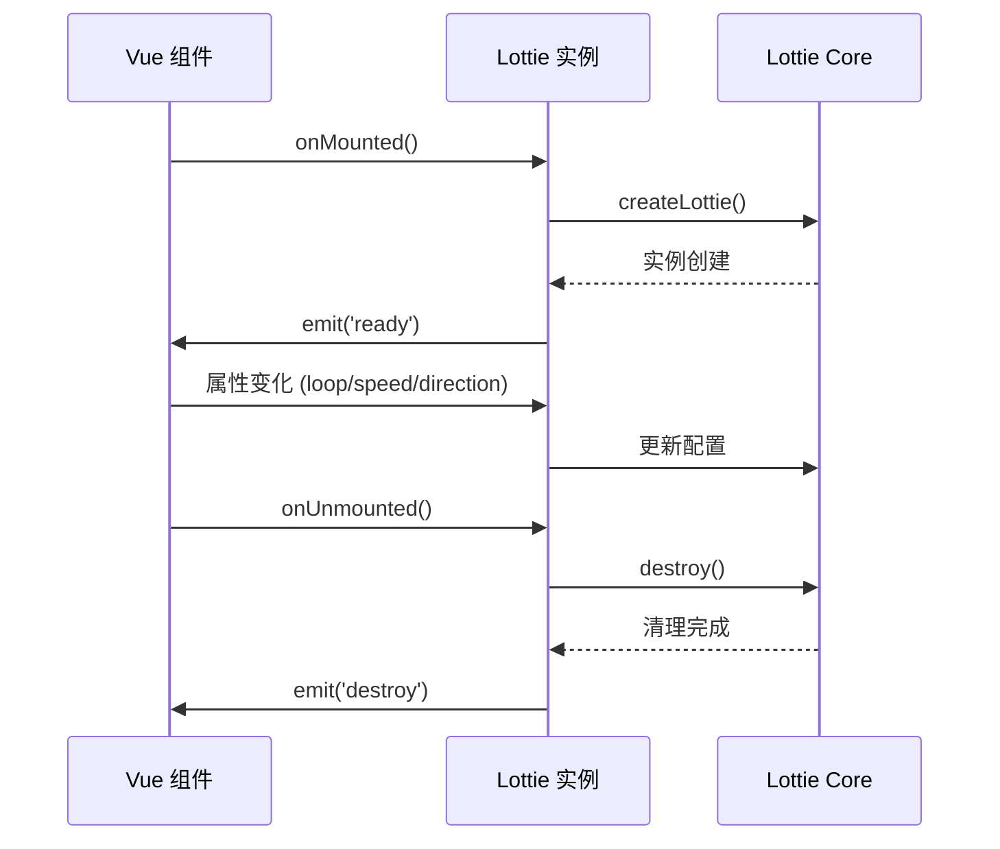

# Vue API

<cite>
**本文档中引用的文件**
- [packages/vue/src/index.ts](file://packages/vue/src/index.ts)
- [packages/vue/src/types.ts](file://packages/vue/src/types.ts)
- [packages/vue/src/components/Lottie.vue](file://packages/vue/src/components/Lottie.vue)
- [packages/vue/src/composables/useLottie.ts](file://packages/vue/src/composables/useLottie.ts)
- [packages/vue/src/composables/useLottieInteractive.ts](file://packages/vue/src/composables/useLottieInteractive.ts)
- [packages/vue/example/src/App.vue](file://packages/vue/example/src/App.vue)
- [packages/vue/package.json](file://packages/vue/package.json)
- [packages/vue/tsconfig.json](file://packages/vue/tsconfig.json)
- [packages/vue/vite.config.ts](file://packages/vue/vite.config.ts)
- [packages/vue/README.md](file://packages/vue/README.md)
</cite>

## 目录
1. [简介](#简介)
2. [安装与配置](#安装与配置)
3. [Lottie.vue 组件](#lottievue-组件)
4. [组合式API](#组合式api)
5. [类型定义](#类型定义)
6. [使用示例](#使用示例)
7. [生命周期集成](#生命周期集成)
8. [最佳实践](#最佳实践)
9. [故障排除](#故障排除)

## 简介

Vue 3 适配器为 Lottie 动画库提供了完整的 Vue 生态系统集成，包括一个功能丰富的组件和两个强大的组合式API。该适配器支持 Vue 3 的 Composition API 和 Options API，提供了响应式的状态管理和事件处理机制。

### 核心特性

- **响应式组件**：基于 Vue 3 的响应式系统构建
- **Composition API 支持**：提供 `useLottie` 和 `useLottieInteractive` 组合式函数
- **事件驱动**：完整的事件系统，支持所有 Lottie 原生事件
- **类型安全**：完整的 TypeScript 类型定义
- **灵活配置**：支持多种渲染器和配置选项

## 安装与配置

### 安装依赖

```bash
npm install @ldesign/lottie-vue
```

### 项目配置

#### 全局注册

```typescript
import { createApp } from 'vue'
import LottieVue from '@ldesign/lottie-vue'

const app = createApp({})
app.use(LottieVue)
```

#### 局部注册

```vue
<script setup>
import { Lottie } from '@ldesign/lottie-vue'
</script>

<template>
  <Lottie :path="animationUrl" />
</template>
</script>
```

#### 按需引入

```typescript
import { Lottie, useLottie, useLottieInteractive } from '@ldesign/lottie-vue'
```

**章节来源**
- [packages/vue/package.json](file://packages/vue/package.json#L1-L68)
- [packages/vue/src/index.ts](file://packages/vue/src/index.ts#L1-L21)

## Lottie.vue 组件

### Props 属性

Lottie.vue 组件继承了 Lottie Core 的所有配置选项，并添加了 Vue 专属的样式和类名支持。

| 属性名 | 类型 | 默认值 | 描述 |
|--------|------|--------|------|
| `animationData` | `any` | `undefined` | 直接传入的动画数据对象 |
| `path` | `string` | `undefined` | 动画文件的 URL 路径 |
| `loop` | `boolean` | `true` | 是否循环播放 |
| `autoplay` | `boolean` | `true` | 是否自动播放 |
| `renderer` | `'svg' \| 'canvas'` | `'svg'` | 渲染器类型 |
| `quality` | `'low' \| 'medium' \| 'high' \| 'auto'` | `'high'` | 动画质量设置 |
| `speed` | `number` | `1` | 播放速度 |
| `direction` | `1 \| -1` | `1` | 播放方向 |
| `className` | `string` | `undefined` | 自定义 CSS 类名 |
| `style` | `CSSProperties` | `undefined` | 自定义内联样式 |
| `config` | `Partial<LottieConfig>` | `undefined` | 其他 Lottie 配置选项 |

### 事件

组件 emits 所有 Lottie 原生事件，以及 Vue 生命周期事件：

| 事件名 | 参数 | 描述 |
|--------|------|------|
| `ready` | `(instance: ILottieInstance)` | 动画初始化完成 |
| `error` | `(error: Error)` | 加载或播放错误 |
| `complete` | `()` | 动画播放完成 |
| `loopComplete` | `()` | 单次循环完成 |
| `enterFrame` | `(event: any)` | 帧更新事件 |
| `segmentStart` | `(event: any)` | 片段开始事件 |
| `destroy` | `()` | 动画销毁 |

### 插槽用法

Lottie.vue 组件不支持插槽，但可以通过自定义容器结构实现类似功能：

```vue
<template>
  <div class="animation-container">
    <div class="overlay">
      <!-- 自定义覆盖层 -->
      <button @click="play">播放</button>
    </div>
    <Lottie :path="animationUrl" />
  </div>
</template>
```

### 方法暴露

通过 `defineExpose` 暴露以下方法：

| 方法名 | 参数 | 返回值 | 描述 |
|--------|------|--------|------|
| `play` | `()` | `void` | 开始播放动画 |
| `pause` | `()` | `void` | 暂停播放 |
| `stop` | `()` | `void` | 停止播放 |
| `goToAndPlay` | `(value: number, isFrame?: boolean)` | `void` | 跳转到指定帧并播放 |
| `goToAndStop` | `(value: number, isFrame?: boolean)` | `void` | 跳转到指定帧并停止 |
| `setSpeed` | `(speed: number)` | `void` | 设置播放速度 |
| `setDirection` | `(direction: 1 \| -1)` | `void` | 设置播放方向 |
| `destroy` | `()` | `void` | 销毁动画实例 |
| `getDuration` | `()` | `number \| undefined` | 获取动画总时长 |
| `getCurrentFrame` | `()` | `number` | 获取当前帧数 |
| `getTotalFrames` | `()` | `number` | 获取总帧数 |

**章节来源**
- [packages/vue/src/components/Lottie.vue](file://packages/vue/src/components/Lottie.vue#L1-L118)
- [packages/vue/src/types.ts](file://packages/vue/src/types.ts#L4-L8)

## 组合式API

### useLottie

`useLottie` 是一个强大的组合式函数，提供对 Lottie 动画的完全控制。

#### 函数签名

```typescript
function useLottie(options: UseLottieOptions): UseLottieReturn
```

#### 参数

| 参数名 | 类型 | 描述 |
|--------|------|------|
| `options` | `UseLottieOptions` | Lottie 配置选项 |

#### 返回值

| 属性名 | 类型 | 描述 |
|--------|------|------|
| `containerRef` | `Ref<HTMLDivElement \| undefined>` | 容器元素引用 |
| `instance` | `ComputedRef<ILottieInstance \| null>` | Lottie 实例 |
| `isReady` | `ComputedRef<boolean>` | 是否已就绪 |
| `isPlaying` | `ComputedRef<boolean>` | 是否正在播放 |
| `isPaused` | `ComputedRef<boolean>` | 是否已暂停 |
| `isStopped` | `ComputedRef<boolean>` | 是否已停止 |
| `error` | `ComputedRef<Error \| null>` | 错误信息 |
| `duration` | `ComputedRef<number \| undefined>` | 动画时长 |
| `currentFrame` | `ComputedRef<number>` | 当前帧数 |
| `totalFrames` | `ComputedRef<number>` | 总帧数 |
| `frameRate` | `ComputedRef<number>` | 帧率 |
| `play` | `() => void` | 开始播放 |
| `pause` | `() => void` | 暂停播放 |
| `stop` | `() => void` | 停止播放 |
| `goToAndPlay` | `(value: number, isFrame?: boolean) => void` | 跳转并播放 |
| `goToAndStop` | `(value: number, isFrame?: boolean) => void` | 跳转并停止 |
| `setSpeed` | `(speed: number) => void` | 设置速度 |
| `setDirection` | `(direction: 1 \| -1) => void` | 设置方向 |
| `destroy` | `() => void` | 销毁实例 |

#### 使用示例

```vue
<script setup>
import { useLottie } from '@ldesign/lottie-vue'
import animationData from './animation.json'

const { 
  containerRef, 
  play, 
  pause, 
  stop,
  isPlaying,
  currentFrame,
  totalFrames 
} = useLottie({
  animationData,
  autoplay: false,
  loop: true
})

// 控制方法
const handlePlay = () => {
  if (isPlaying.value) {
    pause()
  } else {
    play()
  }
}

// 帧导航
const goToSpecificFrame = (frame: number) => {
  if (frame >= 0 && frame <= totalFrames.value) {
    goToAndStop(frame, true)
  }
}
</script>

<template>
  <div>
    <div ref="containerRef" style="width: 400px; height: 400px;"></div>
    <button @click="handlePlay">{{ isPlaying ? '暂停' : '播放' }}</button>
    <button @click="stop">停止</button>
  </div>
</template>
```

**章节来源**
- [packages/vue/src/composables/useLottie.ts](file://packages/vue/src/composables/useLottie.ts#L1-L137)
- [packages/vue/src/types.ts](file://packages/vue/src/types.ts#L10-L40)

### useLottieInteractive

`useLottieInteractive` 在 `useLottie` 的基础上增加了交互功能，支持鼠标悬停和点击事件。

#### 函数签名

```typescript
function useLottieInteractive(options: UseLottieInteractiveOptions): UseLottieInteractiveReturn
```

#### 扩展参数

| 参数名 | 类型 | 描述 |
|--------|------|------|
| `playOnHover` | `boolean` | 鼠标悬停时是否自动播放 |
| `playOnClick` | `boolean` | 点击时是否切换播放状态 |
| `onMouseEnter` | `() => void` | 鼠标进入回调 |
| `onMouseLeave` | `() => void` | 鼠标离开回调 |
| `onClick` | `() => void` | 点击回调 |

#### 扩展返回值

| 属性名 | 类型 | 描述 |
|--------|------|------|
| `isHovering` | `Ref<boolean>` | 是否正在悬停 |

#### 使用示例

```vue
<script setup>
import { useLottieInteractive } from '@ldesign/lottie-vue'
import animationData from './animation.json'

const { 
  containerRef, 
  play, 
  pause, 
  isPlaying,
  isHovering 
} = useLottieInteractive({
  animationData,
  playOnHover: true,
  playOnClick: true,
  onMouseEnter: () => console.log('Mouse entered'),
  onMouseLeave: () => console.log('Mouse left'),
  onClick: () => console.log('Animation clicked')
})
</script>

<template>
  <div>
    <div ref="containerRef" style="width: 400px; height: 400px;"></div>
    <p>状态: {{ isPlaying ? '播放中' : '已停止' }}</p>
    <p>悬停: {{ isHovering ? '是' : '否' }}</p>
  </div>
</template>
```

**章节来源**
- [packages/vue/src/composables/useLottieInteractive.ts](file://packages/vue/src/composables/useLottieInteractive.ts#L1-L73)
- [packages/vue/src/types.ts](file://packages/vue/src/types.ts#L5-L9)

## 类型定义

### Vue 专属扩展

Vue 适配器在核心类型基础上添加了 Vue 特有的扩展选项：

#### LottieProps 扩展

```typescript
export interface LottieProps extends Omit<LottieConfig, 'container'> {
  className?: string
  style?: CSSProperties
  config?: Partial<LottieConfig>
}
```

#### UseLottieOptions 扩展

```typescript
export interface UseLottieOptions extends Omit<LottieConfig, 'container'> {
  onReady?: (instance: ILottieInstance) => void
  onError?: (error: Error) => void
  onComplete?: () => void
  onLoopComplete?: () => void
  onEnterFrame?: (event: any) => void
  onSegmentStart?: (event: any) => void
  onDestroy?: () => void
}
```

#### UseLottieInteractiveOptions 扩展

```typescript
export interface UseLottieInteractiveOptions extends UseLottieOptions {
  playOnHover?: boolean
  playOnClick?: boolean
  onMouseEnter?: () => void
  onMouseLeave?: () => void
  onClick?: () => void
}
```

### 响应式类型

Vue 适配器使用 Vue 的响应式系统来管理状态：

```typescript
export interface UseLottieReturn {
  containerRef: Ref<HTMLDivElement | undefined>
  instance: ComputedRef<ILottieInstance | null>
  isReady: ComputedRef<boolean>
  isPlaying: ComputedRef<boolean>
  isPaused: ComputedRef<boolean>
  isStopped: ComputedRef<boolean>
  error: ComputedRef<Error | null>
  duration: ComputedRef<number | undefined>
  currentFrame: ComputedRef<number>
  totalFrames: ComputedRef<number>
  frameRate: ComputedRef<number>
  // ... 其他方法
}
```

**章节来源**
- [packages/vue/src/types.ts](file://packages/vue/src/types.ts#L1-L43)

## 使用示例

### 基础组件使用

```vue
<template>
  <div class="animation-container">
    <!-- 基础动画 -->
    <Lottie
      :path="animationUrl"
      :autoplay="true"
      :loop="true"
      style="width: 300px; height: 300px;"
    />
    
    <!-- 带事件处理的动画 -->
    <Lottie
      :path="animationUrl"
      :autoplay="false"
      :loop="false"
      @complete="onComplete"
      @error="onError"
      @enter-frame="onEnterFrame"
    />
  </div>
</template>

<script setup>
import { ref } from 'vue'
import { Lottie } from '@ldesign/lottie-vue'

const animationUrl = '/animations/loading.json'

// 事件处理器
const onComplete = () => {
  console.log('动画播放完成')
}

const onError = (error) => {
  console.error('动画加载失败:', error)
}

const onEnterFrame = (event) => {
  console.log('当前帧:', event.currentTime)
}
</script>
```

### 组合式API使用

```vue
<script setup>
import { ref } from 'vue'
import { useLottie } from '@ldesign/lottie-vue'

const speed = ref(1)
const direction = ref(1)
const currentFrame = ref(0)

const { 
  containerRef, 
  play, 
  pause, 
  stop,
  goToAndPlay,
  goToAndStop,
  setSpeed,
  setDirection,
  currentFrame: animationFrame,
  totalFrames
} = useLottie({
  path: '/animations/heart.json',
  autoplay: false,
  loop: true
})

// 速度控制
const updateSpeed = (value) => {
  speed.value = parseFloat(value)
  setSpeed(speed.value)
}

// 方向控制
const toggleDirection = () => {
  direction.value = direction.value === 1 ? -1 : 1
  setDirection(direction.value)
}

// 帧导航
const navigateToFrame = () => {
  if (currentFrame.value >= 0 && currentFrame.value <= totalFrames.value) {
    goToAndStop(currentFrame.value, true)
  }
}
</script>

<template>
  <div class="controls">
    <div ref="containerRef" style="width: 300px; height: 300px;"></div>
    
    <div class="control-group">
      <button @click="play">播放</button>
      <button @click="pause">暂停</button>
      <button @click="stop">停止</button>
    </div>
    
    <div class="control-group">
      <label>
        速度: {{ speed.toFixed(1) }}
        <input 
          type="range" 
          min="0.1" 
          max="3" 
          step="0.1" 
          :value="speed" 
          @input="updateSpeed($event.target.value)"
        />
      </label>
      
      <label>
        方向: 
        <button @click="toggleDirection">
          {{ direction === 1 ? '正向' : '反向' }}
        </button>
      </label>
    </div>
    
    <div class="control-group">
      <label>
        帧数: {{ currentFrame }}
        <input 
          type="number" 
          v-model.number="currentFrame" 
          :min="0" 
          :max="totalFrames" 
        />
      </label>
      
      <button @click="navigateToFrame">跳转到帧</button>
      <button @click="goToAndPlay(currentFrame, true)">从当前帧播放</button>
    </div>
  </div>
</template>
```

### 交互式动画

```vue
<script setup>
import { useLottieInteractive } from '@ldesign/lottie-vue'

const { 
  containerRef, 
  play, 
  pause, 
  isPlaying,
  isHovering 
} = useLottieInteractive({
  path: '/animations/button.json',
  playOnHover: true,
  playOnClick: true,
  onMouseEnter: () => console.log('鼠标进入'),
  onMouseLeave: () => console.log('鼠标离开'),
  onClick: () => console.log('按钮被点击')
})
</script>

<template>
  <div class="interactive-container">
    <div ref="containerRef" style="width: 200px; height: 200px;"></div>
    
    <div class="status-info">
      <p>播放状态: {{ isPlaying ? '播放中' : '已停止' }}</p>
      <p>悬停状态: {{ isHovering ? '是' : '否' }}</p>
    </div>
    
    <div class="actions">
      <button @click="play">开始播放</button>
      <button @click="pause">暂停播放</button>
    </div>
  </div>
</template>

<style scoped>
.interactive-container {
  display: flex;
  flex-direction: column;
  align-items: center;
  gap: 1rem;
}

.status-info {
  font-size: 0.9rem;
  color: #666;
}

.actions {
  display: flex;
  gap: 0.5rem;
}
</style>
```

**章节来源**
- [packages/vue/example/src/App.vue](file://packages/vue/example/src/App.vue#L1-L518)

## 生命周期集成

### Vue 生命周期钩子

Vue 适配器与 Vue 的生命周期紧密集成：



**图表来源**
- [packages/vue/src/components/Lottie.vue](file://packages/vue/src/components/Lottie.vue#L52-L106)
- [packages/vue/src/composables/useLottie.ts](file://packages/vue/src/composables/useLottie.ts#L54-L111)

### 生命周期最佳实践

#### 1. 自动清理

```vue
<script setup>
import { useLottie } from '@ldesign/lottie-vue'

// 自动在组件卸载时清理资源
const { containerRef, play, pause } = useLottie({
  path: '/animations/data.json',
  autoplay: true
})

// 不需要手动调用 destroy()
// Vue 会在组件卸载时自动清理
</script>
```

#### 2. 条件渲染

```vue
<script setup>
import { ref } from 'vue'
import { useLottie } from '@ldesign/lottie-vue'

const isVisible = ref(true)
const { containerRef, play, pause } = useLottie({
  path: '/animations/modal.json',
  autoplay: false
})

// 只在可见时播放
const toggleVisibility = () => {
  isVisible.value = !isVisible.value
  if (isVisible.value) {
    play()
  } else {
    pause()
  }
}
</script>

<template>
  <div>
    <button @click="toggleVisibility">
      {{ isVisible ? '隐藏' : '显示' }} 动画
    </button>
    
    <transition name="fade">
      <div v-if="isVisible" ref="containerRef" style="width: 300px; height: 300px;"></div>
    </transition>
  </div>
</template>
```

#### 3. 异步数据加载

```vue
<script setup>
import { ref, watch } from 'vue'
import { useLottie } from '@ldesign/lottie-vue'

const animationUrl = ref('')
const { containerRef, play, pause } = useLottie({
  path: animationUrl.value,
  autoplay: false
})

// 模拟异步数据加载
const loadData = async () => {
  // 模拟 API 调用
  await new Promise(resolve => setTimeout(resolve, 1000))
  
  // 更新动画路径
  animationUrl.value = '/animations/final.json'
  
  // 加载完成后自动播放
  play()
}

// 监听路径变化
watch(animationUrl, (newPath) => {
  if (newPath) {
    // 路径变化后重新初始化
    // Vue 会自动处理重新渲染
  }
})
</script>

<template>
  <div>
    <button @click="loadData">加载动画</button>
    <div v-if="animationUrl" ref="containerRef" style="width: 300px; height: 300px;"></div>
  </div>
</template>
```

**章节来源**
- [packages/vue/src/components/Lottie.vue](file://packages/vue/src/components/Lottie.vue#L52-L106)
- [packages/vue/src/composables/useLottie.ts](file://packages/vue/src/composables/useLottie.ts#L54-L111)

## 最佳实践

### 性能优化

#### 1. 懒加载动画

```vue
<script setup>
import { ref } from 'vue'
import { useLottie } from '@ldesign/lottie-vue'

const isVisible = ref(false)
const { containerRef, play, pause } = useLottie({
  path: '/animations/heavy.json',
  autoplay: false
})

const showAnimation = () => {
  isVisible.value = true
  // 延迟播放以避免阻塞主线程
  setTimeout(play, 100)
}
</script>

<template>
  <div>
    <button @click="showAnimation">显示重型动画</button>
    
    <div v-if="isVisible" ref="containerRef" style="width: 400px; height: 400px;"></div>
  </div>
</template>
```

#### 2. 复用动画实例

```vue
<script setup>
import { ref } from 'vue'
import { useLottie } from '@ldesign/lottie-vue'

// 创建共享的动画实例
const sharedAnimation = useLottie({
  path: '/animations/shared.json',
  autoplay: false
})

// 在多个组件中复用
const playSharedAnimation = () => {
  sharedAnimation.play()
}

const pauseSharedAnimation = () => {
  sharedAnimation.pause()
}
</script>

<template>
  <div>
    <div ref="sharedAnimation.containerRef" style="width: 300px; height: 300px;"></div>
    <button @click="playSharedAnimation">播放共享动画</button>
    <button @click="pauseSharedAnimation">暂停共享动画</button>
  </div>
</template>
```

### 错误处理

```vue
<script setup>
import { ref } from 'vue'
import { useLottie } from '@ldesign/lottie-vue'

const error = ref(null)
const retryCount = ref(0)

const { containerRef, play, pause, error: lottieError } = useLottie({
  path: '/animations/critical.json',
  autoplay: false,
  onError: (err) => {
    error.value = err
    retryCount.value++
    console.error('动画加载失败:', err)
  }
})

// 错误恢复机制
const retryLoad = () => {
  if (retryCount.value < 3) {
    // 尝试重新加载
    error.value = null
    // 这里可以实现重试逻辑
  }
}
</script>

<template>
  <div>
    <div ref="containerRef" style="width: 300px; height: 300px;"></div>
    
    <div v-if="error" class="error-container">
      <p>动画加载失败: {{ error.message }}</p>
      <button @click="retryLoad">重试 ({{ retryCount }}/3)</button>
    </div>
    
    <div v-else>
      <button @click="play">播放</button>
      <button @click="pause">暂停</button>
    </div>
  </div>
</template>
```

### 状态管理

```vue
<script setup>
import { ref, computed } from 'vue'
import { useLottie } from '@ldesign/lottie-vue'

const speed = ref(1)
const loop = ref(true)
const autoplay = ref(true)

const { 
  containerRef, 
  play, 
  pause, 
  stop,
  setSpeed,
  setLoop,
  isPlaying,
  currentFrame,
  totalFrames
} = useLottie({
  path: '/animations/progress.json',
  autoplay: false,
  loop: loop.value
})

// 响应式状态绑定
const progress = computed(() => {
  return totalFrames.value > 0 
    ? (currentFrame.value / totalFrames.value) * 100 
    : 0
})

// 同步 Vue 状态到 Lottie
watch(speed, (newSpeed) => setSpeed(newSpeed))
watch(loop, (newLoop) => setLoop(newLoop))
watch(autoplay, (newAutoplay) => {
  if (newAutoplay) {
    play()
  } else {
    pause()
  }
})
</script>

<template>
  <div class="animation-controls">
    <div class="progress-bar">
      <div class="progress" :style="{ width: `${progress}%` }"></div>
    </div>
    
    <div class="controls">
      <button @click="isPlaying ? pause() : play()">
        {{ isPlaying ? '暂停' : '播放' }}
      </button>
      
      <button @click="stop">停止</button>
      
      <label>
        速度: {{ speed.toFixed(1) }}
        <input 
          type="range" 
          min="0.1" 
          max="3" 
          step="0.1" 
          v-model="speed" 
        />
      </label>
      
      <label>
        循环:
        <input type="checkbox" v-model="loop" />
      </label>
      
      <label>
        自动播放:
        <input type="checkbox" v-model="autoplay" />
      </label>
    </div>
  </div>
</template>
```

## 故障排除

### 常见问题

#### 1. 动画不显示

**可能原因:**
- 容器尺寸为 0
- 动画数据加载失败
- 渲染器不兼容

**解决方案:**
```vue
<!-- 确保容器有明确的尺寸 -->
<div ref="containerRef" style="width: 300px; height: 300px;"></div>

<!-- 或者使用 CSS -->
<div ref="containerRef" class="animation-container"></div>

<style>
.animation-container {
  width: 300px;
  height: 300px;
}
</style>
```

#### 2. 性能问题

**优化建议:**
```vue
<script setup>
import { useLottie } from '@ldesign/lottie-vue'

// 使用 canvas 渲染器提高性能
const { containerRef } = useLottie({
  path: '/animations/performance.json',
  renderer: 'canvas', // SVG vs canvas
  quality: 'medium',  // 降低质量提升性能
  autoplay: false     // 延迟播放
})
</script>
```

#### 3. 内存泄漏

**预防措施:**
```vue
<script setup>
import { onUnmounted } from 'vue'
import { useLottie } from '@ldesign/lottie-vue'

const { containerRef, play, pause, destroy } = useLottie({
  path: '/animations/temporary.json',
  autoplay: false
})

// 确保在组件卸载时清理
onUnmounted(() => {
  destroy()
})
</script>
```

### 调试技巧

#### 1. 状态监控

```vue
<script setup>
import { useLottie } from '@ldesign/lottie-vue'

const { 
  containerRef, 
  isReady,
  isPlaying,
  isPaused,
  isStopped,
  error,
  currentFrame,
  totalFrames,
  frameRate 
} = useLottie({
  path: '/animations/debug.json',
  autoplay: true
})

// 调试信息
console.log('动画状态:', {
  isReady: isReady.value,
  isPlaying: isPlaying.value,
  currentFrame: currentFrame.value,
  totalFrames: totalFrames.value,
  frameRate: frameRate.value,
  error: error.value
})
</script>
```

#### 2. 事件监听

```vue
<script setup>
import { useLottie } from '@ldesign/lottie-vue'

const { containerRef } = useLottie({
  path: '/animations/events.json',
  autoplay: true,
  onReady: (instance) => console.log('动画就绪', instance),
  onError: (error) => console.error('动画错误', error),
  onComplete: () => console.log('动画完成'),
  onLoopComplete: () => console.log('循环完成'),
  onEnterFrame: (event) => console.log('帧更新', event)
})
</script>
```

**章节来源**
- [packages/vue/src/components/Lottie.vue](file://packages/vue/src/components/Lottie.vue#L71-L78)
- [packages/vue/src/composables/useLottie.ts](file://packages/vue/src/composables/useLottie.ts#L66-L100)

## 结论

Vue 3 适配器为 Lottie 动画提供了强大而灵活的集成方案。通过 Lottie.vue 组件和两个组合式API，开发者可以在 Vue 应用中轻松实现各种复杂的动画需求。

### 主要优势

- **完整的 Vue 集成**：响应式状态、生命周期钩子、事件系统
- **灵活的使用方式**：组件方式和组合式API两种选择
- **强大的交互能力**：内置交互功能和自定义事件处理
- **优秀的性能表现**：智能的资源管理和优化策略
- **完善的类型支持**：完整的 TypeScript 类型定义

### 适用场景

- **用户界面动画**：按钮交互、页面过渡、状态指示
- **数据可视化**：图表动画、进度条、仪表盘
- **游戏开发**：角色动画、特效、UI 动画
- **营销页面**：产品展示、功能演示、品牌动画

通过合理使用这些 API，开发者可以创建出既美观又高性能的动画体验，为用户提供愉悦的交互感受。