# 核心API

<cite>
**本文档引用的文件**
- [LottieManager.ts](file://packages/core/src/core/LottieManager.ts)
- [LottieInstance.ts](file://packages/core/src/core/LottieInstance.ts)
- [CacheManager.ts](file://packages/core/src/core/CacheManager.ts)
- [WorkerManager.ts](file://packages/core/src/core/WorkerManager.ts)
- [index.ts](file://packages/core/src/types/index.ts)
- [index.ts](file://packages/core/src/index.ts)
- [main.ts](file://examples/core-demo/src/main.ts)
- [App.tsx](file://examples/react-demo/src/App.tsx)
- [PerformanceMonitor.ts](file://packages/core/src/core/PerformanceMonitor.ts)
- [MemoryManager.ts](file://packages/core/src/core/MemoryManager.ts)
</cite>

## 目录
1. [简介](#简介)
2. [项目结构](#项目结构)
3. [核心组件](#核心组件)
4. [架构概览](#架构概览)
5. [详细组件分析](#详细组件分析)
6. [类型定义](#类型定义)
7. [错误处理机制](#错误处理机制)
8. [性能监控与内存管理](#性能监控与内存管理)
9. [使用示例](#使用示例)
10. [最佳实践](#最佳实践)

## 简介

Lottie核心API提供了完整的动画管理解决方案，包含LottieManager、LottieInstance、CacheManager、WorkerManager等核心类，以及丰富的类型定义。该API设计遵循单一职责原则，提供了灵活的配置选项和强大的性能优化能力。

## 项目结构

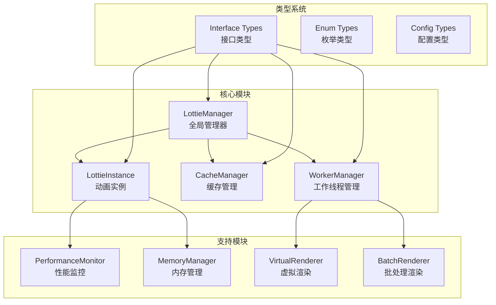

**图表来源**
- [LottieManager.ts](file://packages/core/src/core/LottieManager.ts#L1-L504)
- [LottieInstance.ts](file://packages/core/src/core/LottieInstance.ts#L1-L667)
- [CacheManager.ts](file://packages/core/src/core/CacheManager.ts#L1-L502)
- [WorkerManager.ts](file://packages/core/src/core/WorkerManager.ts#L1-L612)

## 核心组件

### LottieManager - 全局管理器

LottieManager是整个系统的中央控制器，负责实例管理、缓存控制、性能监控和资源优化。

#### 主要功能
- **单例模式**: 确保全局唯一实例
- **实例池管理**: 优化内存使用和性能
- **全局缓存**: 统一管理动画数据缓存
- **性能监控**: 全局性能统计和优化
- **设备适配**: 自动根据设备性能调整配置

#### 核心方法

| 方法名 | 参数类型 | 返回类型 | 描述 |
|--------|----------|----------|------|
| `create` | `LottieConfig` | `ILottieInstance` | 创建新的动画实例 |
| `get` | `string` | `ILottieInstance \| undefined` | 通过ID获取实例 |
| `getByName` | `string` | `ILottieInstance \| undefined` | 通过名称获取实例 |
| `getAll` | - | `ILottieInstance[]` | 获取所有实例 |
| `destroy` | `string` | `boolean` | 销毁指定实例 |
| `destroyAll` | - | `void` | 销毁所有实例 |
| `playAll` | - | `void` | 播放所有实例 |
| `pauseAll` | - | `void` | 暂停所有实例 |
| `preload` | `string, string?` | `Promise<any>` | 预加载动画数据 |
| `clearCache` | - | `void` | 清空缓存 |
| `getGlobalStats` | - | `GlobalPerformanceStats` | 获取全局性能统计 |

**章节来源**
- [LottieManager.ts](file://packages/core/src/core/LottieManager.ts#L111-L183)
- [LottieManager.ts](file://packages/core/src/core/LottieManager.ts#L188-L225)

### LottieInstance - 动画实例

LottieInstance封装了单个动画的所有操作，提供了完整的生命周期管理和交互控制。

#### 核心属性
- `id`: 唯一标识符
- `name`: 动画名称
- `state`: 当前状态
- `animation`: 原生lottie-web实例
- `config`: 配置信息
- `container`: 容器元素

#### 核心方法

| 方法名 | 参数类型 | 返回类型 | 描述 |
|--------|----------|----------|------|
| `load` | - | `Promise<void>` | 加载动画数据 |
| `play` | - | `void` | 开始播放 |
| `pause` | - | `void` | 暂停播放 |
| `stop` | - | `void` | 停止播放 |
| `destroy` | - | `void` | 销毁实例 |
| `setSpeed` | `number` | `void` | 设置播放速度 |
| `setDirection` | `1 \| -1` | `void` | 设置播放方向 |
| `goToAndStop` | `number, boolean?` | `void` | 跳转到指定帧并停止 |
| `goToAndPlay` | `number, boolean?` | `void` | 跳转到指定帧并播放 |
| `playSegments` | `[number, number] \| [number, number][]` | `void` | 播放指定片段 |
| `getMetrics` | - | `PerformanceMetrics \| null` | 获取性能指标 |

**章节来源**
- [LottieInstance.ts](file://packages/core/src/core/LottieInstance.ts#L492-L581)
- [LottieInstance.ts](file://packages/core/src/core/LottieInstance.ts#L583-L612)

### CacheManager - 缓存管理器

CacheManager实现了LRU算法的缓存系统，支持内存和持久化存储。

#### 核心特性
- **LRU淘汰**: 最近最少使用的数据优先被淘汰
- **TTL过期**: 支持数据过期时间控制
- **持久化存储**: 基于IndexedDB的数据持久化
- **压缩支持**: 自动压缩大型动画数据
- **预热机制**: 支持批量预加载

#### 核心方法

| 方法名 | 参数类型 | 返回类型 | 描述 |
|--------|----------|----------|------|
| `set` | `string, any` | `boolean` | 设置缓存项 |
| `get` | `string` | `any \| null` | 获取缓存项 |
| `delete` | `string` | `boolean` | 删除缓存项 |
| `clear` | - | `void` | 清空所有缓存 |
| `cleanExpired` | - | `number` | 清理过期缓存 |
| `prewarm` | `string[]` | `Promise<void>` | 预加载缓存 |

**章节来源**
- [CacheManager.ts](file://packages/core/src/core/CacheManager.ts#L84-L179)
- [CacheManager.ts](file://packages/core/src/core/CacheManager.ts#L278-L300)

### WorkerManager - 工作线程管理器

WorkerManager负责管理Web Worker的生命周期和任务调度，提供高性能的后台处理能力。

#### 核心功能
- **Worker池管理**: 动态创建和管理Worker实例
- **任务调度**: 基于优先级的任务队列管理
- **负载均衡**: 智能分配任务到可用Worker
- **故障恢复**: 自动处理Worker崩溃和重试
- **性能监控**: 监控Worker性能和健康状态

#### 核心方法

| 方法名 | 参数类型 | 返回类型 | 描述 |
|--------|----------|----------|------|
| `parseAnimation` | `string \| object, any?` | `Promise<any>` | 解析动画数据 |
| `compressAnimation` | `any, any?` | `Promise<ArrayBuffer>` | 压缩动画数据 |
| `decompressAnimation` | `ArrayBuffer, any?` | `Promise<any>` | 解压缩动画数据 |
| `optimizeAnimation` | `any, any?` | `Promise<any>` | 优化动画数据 |
| `getStats` | - | `object` | 获取统计信息 |

**章节来源**
- [WorkerManager.ts](file://packages/core/src/core/WorkerManager.ts#L510-L533)
- [WorkerManager.ts](file://packages/core/src/core/WorkerManager.ts#L359-L441)

## 架构概览

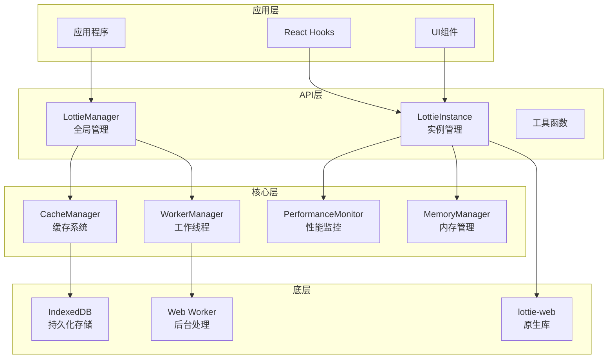

**图表来源**
- [LottieManager.ts](file://packages/core/src/core/LottieManager.ts#L18-L30)
- [LottieInstance.ts](file://packages/core/src/core/LottieInstance.ts#L18-L25)
- [CacheManager.ts](file://packages/core/src/core/CacheManager.ts#L22-L47)
- [WorkerManager.ts](file://packages/core/src/core/WorkerManager.ts#L41-L57)

## 详细组件分析

### LottieManager详细分析

#### 单例模式实现
LottieManager采用严格的单例模式，确保全局只有一个管理器实例。

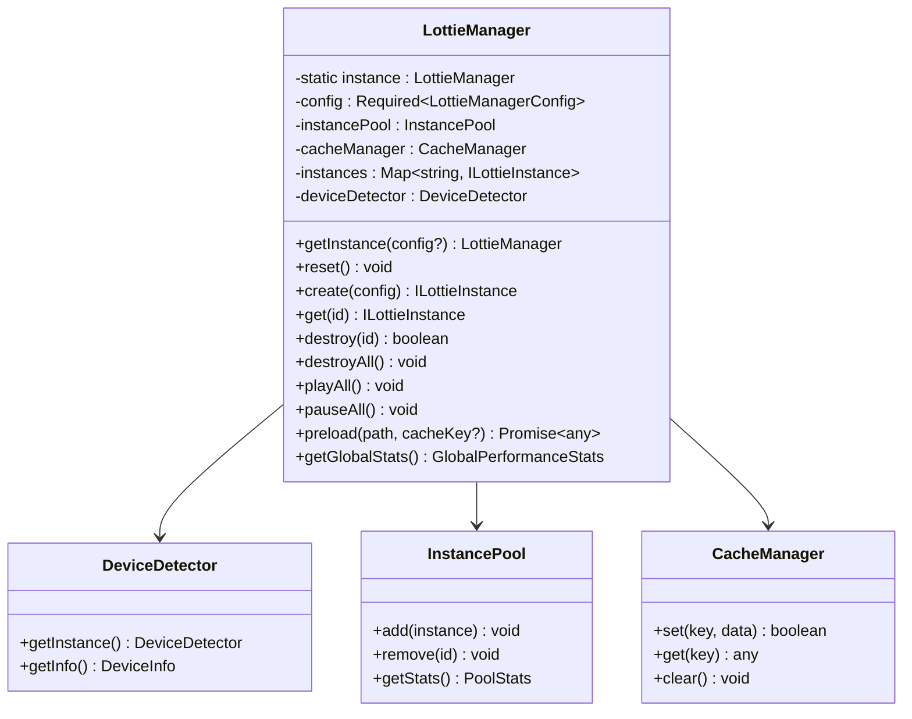

**图表来源**
- [LottieManager.ts](file://packages/core/src/core/LottieManager.ts#L16-L30)

#### 设备适配机制
LottieManager具备智能设备检测和适配能力：

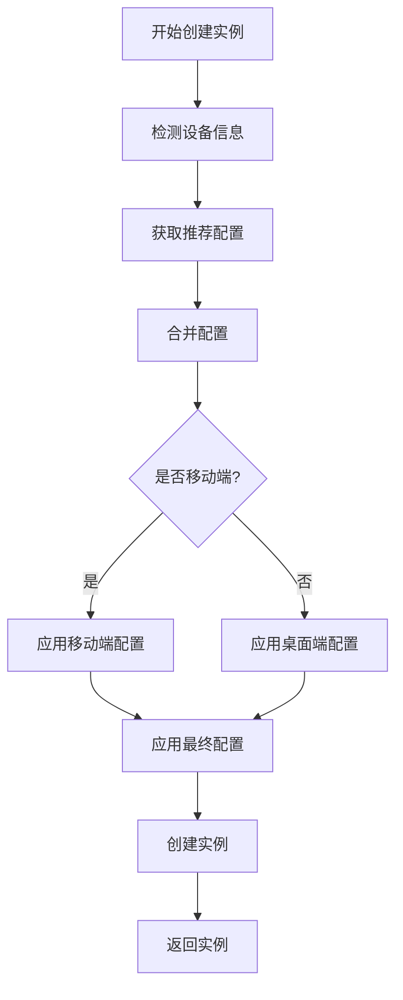

**图表来源**
- [LottieManager.ts](file://packages/core/src/core/LottieManager.ts#L118-L148)

**章节来源**
- [LottieManager.ts](file://packages/core/src/core/LottieManager.ts#L46-L85)
- [LottieManager.ts](file://packages/core/src/core/LottieManager.ts#L89-L106)

### LottieInstance详细分析

#### 生命周期管理
LottieInstance具有完整的生命周期管理机制：

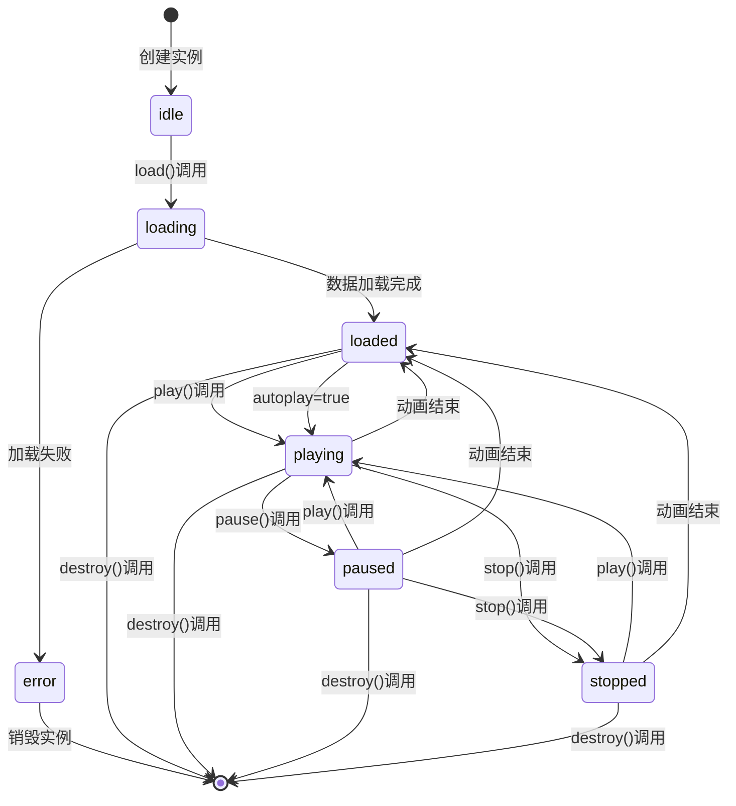

**图表来源**
- [LottieInstance.ts](file://packages/core/src/core/LottieInstance.ts#L14-L16)
- [LottieInstance.ts](file://packages/core/src/core/LottieInstance.ts#L661-L666)

#### 性能监控集成
LottieInstance集成了实时性能监控：

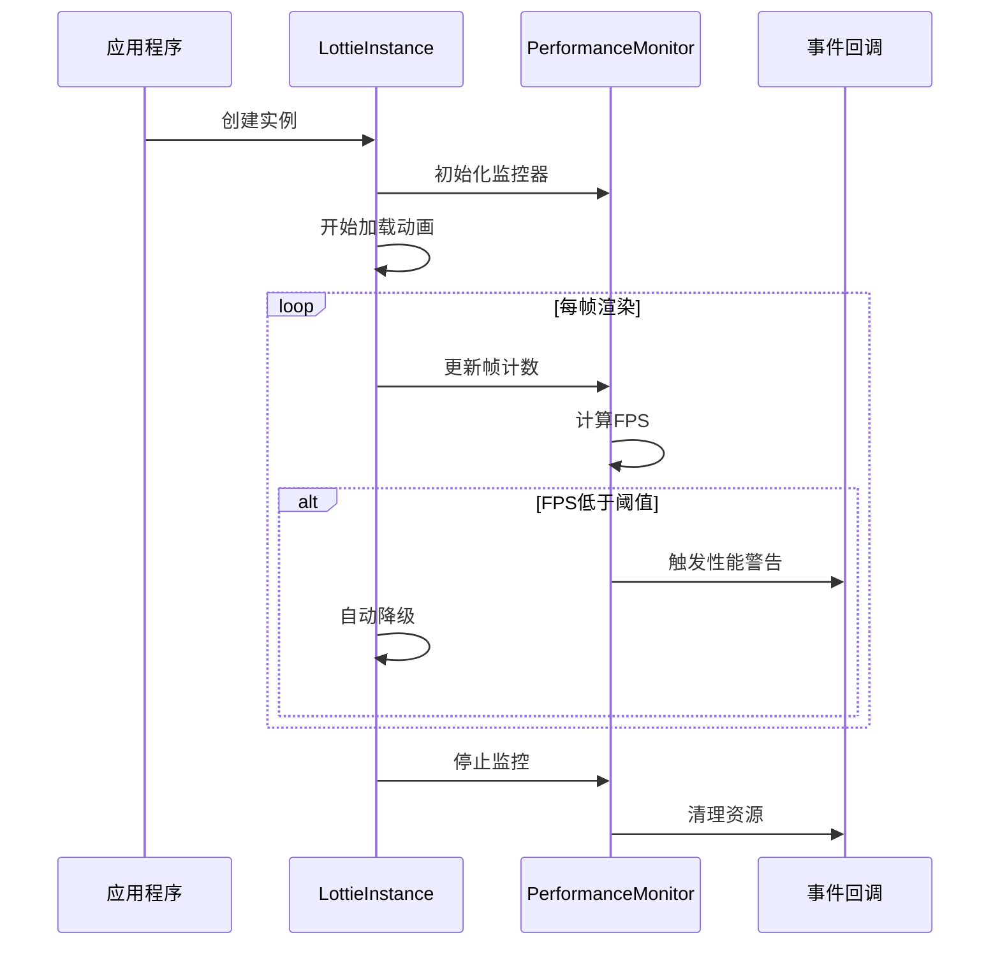

**图表来源**
- [LottieInstance.ts](file://packages/core/src/core/LottieInstance.ts#L190-L204)
- [PerformanceMonitor.ts](file://packages/core/src/core/PerformanceMonitor.ts#L51-L68)

**章节来源**
- [LottieInstance.ts](file://packages/core/src/core/LottieInstance.ts#L95-L121)
- [LottieInstance.ts](file://packages/core/src/core/LottieInstance.ts#L297-L319)

### CacheManager详细分析

#### LRU算法实现
CacheManager使用双向链表实现LRU算法：

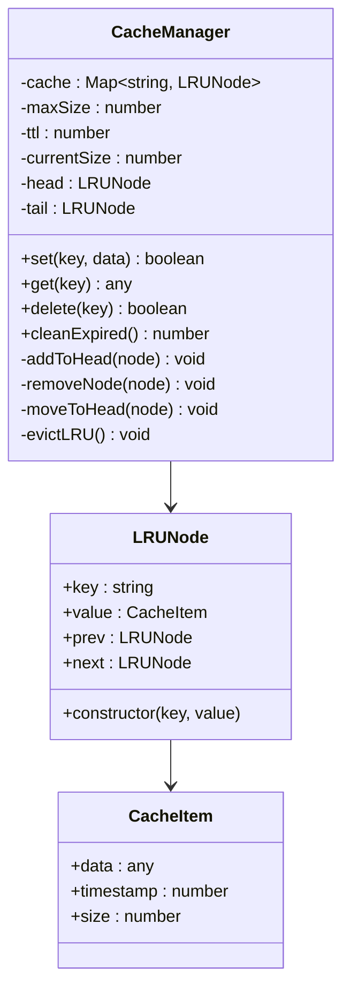

**图表来源**
- [CacheManager.ts](file://packages/core/src/core/CacheManager.ts#L6-L16)
- [CacheManager.ts](file://packages/core/src/core/CacheManager.ts#L22-L32)

#### 持久化存储机制
CacheManager支持IndexedDB持久化：

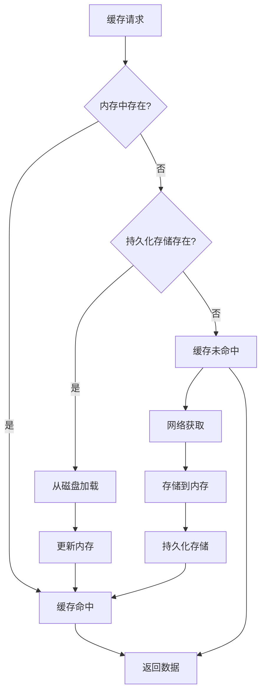

**图表来源**
- [CacheManager.ts](file://packages/core/src/core/CacheManager.ts#L135-L141)
- [CacheManager.ts](file://packages/core/src/core/CacheManager.ts#L321-L346)

**章节来源**
- [CacheManager.ts](file://packages/core/src/core/CacheManager.ts#L84-L179)
- [CacheManager.ts](file://packages/core/src/core/CacheManager.ts#L278-L300)

### WorkerManager详细分析

#### 任务调度机制
WorkerManager实现了智能任务调度：

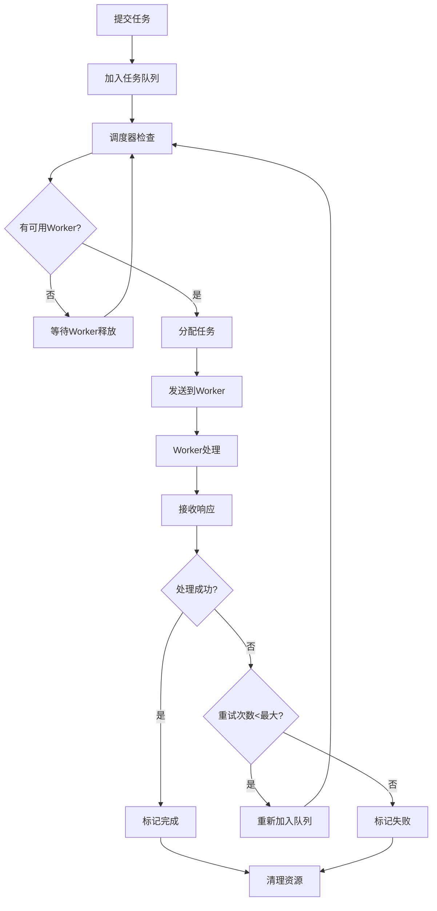

**图表来源**
- [WorkerManager.ts](file://packages/core/src/core/WorkerManager.ts#L402-L441)
- [WorkerManager.ts](file://packages/core/src/core/WorkerManager.ts#L265-L320)

#### 健康监控系统
WorkerManager具备完善的健康监控：

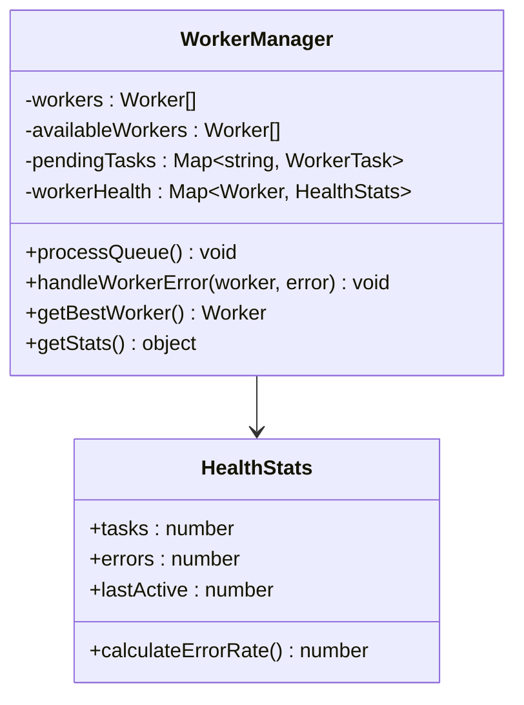

**图表来源**
- [WorkerManager.ts](file://packages/core/src/core/WorkerManager.ts#L56-L65)
- [WorkerManager.ts](file://packages/core/src/core/WorkerManager.ts#L446-L455)

**章节来源**
- [WorkerManager.ts](file://packages/core/src/core/WorkerManager.ts#L359-L441)
- [WorkerManager.ts](file://packages/core/src/core/WorkerManager.ts#L265-L320)

## 类型定义

### 核心配置类型

#### AnimationConfig
动画配置的核心类型定义：

| 属性名 | 类型 | 默认值 | 描述 |
|--------|------|--------|------|
| `container` | `HTMLElement \| string` | - | 容器元素或选择器 |
| `renderer` | `LottieRendererType` | `'svg'` | 渲染器类型 |
| `loop` | `boolean \| number` | `true` | 循环播放设置 |
| `autoplay` | `boolean` | `false` | 自动播放设置 |
| `animationData` | `any` | - | 动画数据对象 |
| `path` | `string` | - | 动画文件路径 |
| `name` | `string` | - | 动画名称 |
| `speed` | `number` | `1` | 播放速度 |
| `quality` | `AnimationQuality` | `'high'` | 动画质量 |
| `loadStrategy` | `LoadStrategy` | `'eager'` | 加载策略 |
| `playMode` | `PlayMode` | `'normal'` | 播放模式 |

#### LottieOptions
高级配置选项：

| 属性名 | 类型 | 描述 |
|--------|------|------|
| `enablePerformanceMonitor` | `boolean` | 启用性能监控 |
| `performanceMonitorInterval` | `number` | 性能监控间隔 |
| `maxMemory` | `number` | 最大内存限制(MB) |
| `minFps` | `number` | 最小FPS阈值 |
| `targetFPS` | `number` | 目标FPS |
| `enableAutoDegradation` | `boolean` | 启用自动降级 |
| `enableSmartFrameSkip` | `boolean` | 启用智能跳帧 |
| `useOffscreenCanvas` | `boolean` | 使用OffscreenCanvas |
| `enableCache` | `boolean` | 启用缓存 |
| `cacheKey` | `string` | 缓存键 |
| `preload` | `boolean` | 预加载设置 |
| `intersectionOptions` | `IntersectionObserverInit` | 交叉观察器配置 |
| `customLoader` | `(path: string) => Promise<any>` | 自定义加载器 |

**章节来源**
- [index.ts](file://packages/core/src/types/index.ts#L115-L146)
- [index.ts](file://packages/core/src/types/index.ts#L83-L110)

### 事件类型系统

#### LottieEvents
完整的事件类型定义：

| 事件名 | 回调签名 | 触发时机 |
|--------|----------|----------|
| `config_ready` | `() => void` | 配置完成 |
| `data_ready` | `() => void` | 数据加载完成 |
| `data_failed` | `(error: Error) => void` | 数据加载失败 |
| `DOMLoaded` | `() => void` | DOM加载完成 |
| `destroy` | `() => void` | 实例销毁 |
| `enterFrame` | `(event: EnterFrameEvent) => void` | 进入帧 |
| `segmentStart` | `() => void` | 分段开始 |
| `complete` | `() => void` | 动画完成 |
| `loopComplete` | `() => void` | 循环完成 |
| `stateChange` | `(state: AnimationState) => void` | 状态变化 |
| `performanceWarning` | `(metrics: PerformanceMetrics) => void` | 性能警告 |

#### AnimationState
动画状态枚举：

```typescript
type AnimationState = 
  | 'idle'           // 空闲状态
  | 'loading'        // 加载中
  | 'loaded'         // 已加载
  | 'playing'        // 播放中
  | 'paused'         // 已暂停
  | 'stopped'        // 已停止
  | 'error'          // 错误状态
```

**章节来源**
- [index.ts](file://packages/core/src/types/index.ts#L55-L78)
- [index.ts](file://packages/core/src/types/index.ts#L26-L27)

### 性能监控类型

#### PerformanceMetrics
性能指标定义：

| 属性名 | 类型 | 描述 |
|--------|------|------|
| `fps` | `number` | 渲染帧率 |
| `memory` | `number` | 内存使用(MB) |
| `cpuUsage` | `number` | CPU使用率(%) |
| `renderTime` | `number` | 渲染时间(ms) |
| `frameCount` | `number` | 帧计数 |
| `frameDrops` | `number` | 掉帧数 |
| `loadTime` | `number` | 加载时间(ms) |
| `duration` | `number` | 动画时长(ms) |
| `totalFrames` | `number` | 总帧数 |

**章节来源**
- [index.ts](file://packages/core/src/types/index.ts#L31-L50)

## 错误处理机制

### 异常分类与处理策略

#### 资源加载失败
当动画资源加载失败时，系统采用多层错误处理：

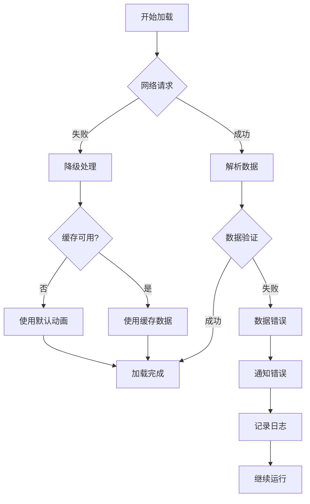

**图表来源**
- [LottieInstance.ts](file://packages/core/src/core/LottieInstance.ts#L116-L120)
- [LottieInstance.ts](file://packages/core/src/core/LottieInstance.ts#L158-L161)

#### JSON解析异常
系统对JSON解析异常有专门的处理机制：

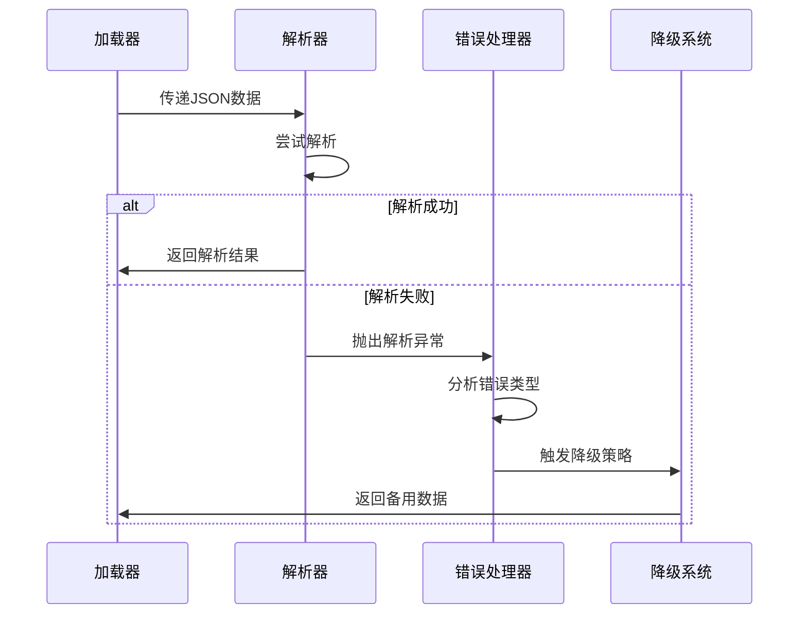

**图表来源**
- [LottieInstance.ts](file://packages/core/src/core/LottieInstance.ts#L218-L224)
- [WorkerManager.ts](file://packages/core/src/core/WorkerManager.ts#L580-L583)

### 错误恢复机制

#### 自动重试策略
WorkerManager实现了智能重试机制：

| 重试条件 | 最大次数 | 重试间隔 | 处理方式 |
|----------|----------|----------|----------|
| 网络超时 | 3次 | 指数退避 | 逐步增加延迟 |
| Worker崩溃 | 3次 | 立即重试 | 替换Worker |
| 内存不足 | 2次 | 5秒 | 清理缓存 |
| 数据损坏 | 1次 | 立即重试 | 使用备份数据 |

#### 错误边界保护
系统在各个层面设置了错误边界：

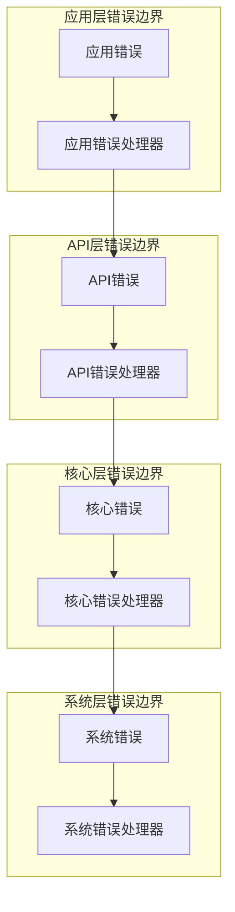

**章节来源**
- [LottieInstance.ts](file://packages/core/src/core/LottieInstance.ts#L116-L120)
- [WorkerManager.ts](file://packages/core/src/core/WorkerManager.ts#L300-L316)

## 性能监控与内存管理

### 性能监控系统

#### 实时性能指标收集
PerformanceMonitor提供多维度的性能监控：

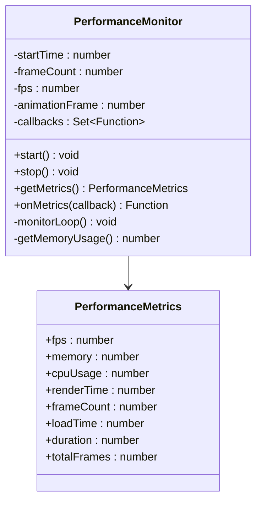

**图表来源**
- [PerformanceMonitor.ts](file://packages/core/src/core/PerformanceMonitor.ts#L6-L15)
- [PerformanceMonitor.ts](file://packages/core/src/core/PerformanceMonitor.ts#L73-L84)

#### 性能阈值监控
系统设定了多层次的性能阈值：

| 性能指标 | 正常范围 | 警告阈值 | 危险阈值 | 处理策略 |
|----------|----------|----------|----------|----------|
| FPS | > 30 | 20-30 | < 20 | 自动降级 |
| 内存使用 | < 70% | 70-85% | > 85% | 内存清理 |
| CPU使用率 | < 50% | 50-75% | > 75% | 任务限流 |
| 渲染时间 | < 16ms | 16-33ms | > 33ms | 帧跳过 |

**章节来源**
- [PerformanceMonitor.ts](file://packages/core/src/core/PerformanceMonitor.ts#L51-L68)
- [LottieInstance.ts](file://packages/core/src/core/LottieInstance.ts#L300-L319)

### 内存管理系统

#### 智能内存监控
MemoryManager提供全方位的内存监控：

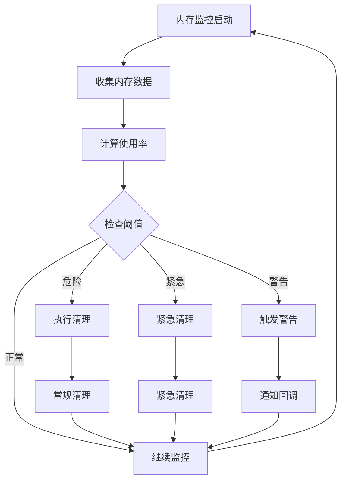

**图表来源**
- [MemoryManager.ts](file://packages/core/src/core/MemoryManager.ts#L105-L140)

#### 内存优化策略
系统采用分层的内存优化策略：

| 优化层级 | 优化策略 | 触发条件 | 效果 |
|----------|----------|----------|------|
| 应用层 | 实例池管理 | 内存压力 | 减少重复创建 |
| 缓存层 | LRU淘汰 | 缓存满载 | 释放热点数据 |
| 系统层 | 垃圾回收 | 内存泄漏 | 清理无用对象 |
| 硬件层 | 资源限制 | 系统资源不足 | 降低渲染质量 |

**章节来源**
- [MemoryManager.ts](file://packages/core/src/core/MemoryManager.ts#L163-L234)
- [MemoryManager.ts](file://packages/core/src/core/MemoryManager.ts#L266-L308)

### 性能优化建议

#### 配置优化指南

##### 渲染器选择
```typescript
// 移动设备推荐配置
const mobileConfig = {
  renderer: 'canvas',           // Canvas在移动设备上性能更好
  quality: 'medium',            // 中等质量平衡性能和视觉效果
  enableSmartFrameSkip: true,   // 启用智能跳帧
  useOffscreenCanvas: false     // 移动设备上OffscreenCanvas开销较大
}

// 桌面设备推荐配置
const desktopConfig = {
  renderer: 'svg',              // SVG在桌面设备上渲染质量更高
  quality: 'high',              // 高质量渲染
  enableSmartFrameSkip: false,  // 桌面设备性能充足，无需跳帧
  useOffscreenCanvas: true      // 启用OffscreenCanvas提升性能
}
```

##### 缓存策略优化
```typescript
// 高频访问动画缓存配置
const hotCacheConfig = {
  maxSize: 100,                 // 100MB缓存空间
  ttl: 3600000,                 // 1小时过期时间
  enabled: true
}

// 低频访问动画缓存配置
const coldCacheConfig = {
  maxSize: 20,                  // 20MB缓存空间
  ttl: 300000,                  // 5分钟过期时间
  enabled: true
}
```

**章节来源**
- [LottieManager.ts](file://packages/core/src/core/LottieManager.ts#L127-L148)
- [CacheManager.ts](file://packages/core/src/core/CacheManager.ts#L44-L47)

## 使用示例

### 基础使用示例

#### 简单动画播放
```typescript
// 创建基本动画实例
const container = document.getElementById('animation-container')
const instance = createLottie({
  container,
  path: '/animations/loading.json',
  renderer: 'svg',
  loop: true,
  autoplay: true
})

// 控制动画
instance.play()        // 开始播放
instance.pause()       // 暂停播放
instance.stop()        // 停止播放
instance.setSpeed(2)   // 设置两倍速
```

#### React Hook使用
```typescript
// React组件中使用
function AnimationComponent() {
  const { 
    containerRef, 
    instance, 
    isReady, 
    isPlaying,
    play, 
    pause, 
    stop 
  } = useLottie({
    animationData: myAnimationData,
    loop: true,
    autoplay: false,
    renderer: 'canvas'
  })

  return (
    <div>
      <div ref={containerRef} />
      <button onClick={play}>播放</button>
      <button onClick={pause}>暂停</button>
      <button onClick={stop}>停止</button>
    </div>
  )
}
```

**章节来源**
- [main.ts](file://examples/core-demo/src/main.ts#L24-L67)
- [App.tsx](file://examples/react-demo/src/App.tsx#L56-L98)

### 高级功能示例

#### 性能监控集成
```typescript
// 监控动画性能
const instance = createLottie({
  container: container,
  path: animationPath,
  advanced: {
    enablePerformanceMonitor: true,
    performanceMonitorInterval: 1000
  }
})

// 监听性能警告
instance.on('performanceWarning', (metrics) => {
  console.warn('性能问题:', metrics)
  
  // 根据性能指标自动调整
  if (metrics.fps < 20) {
    instance.setSpeed(0.5)  // 降低播放速度
  }
})
```

#### 缓存预加载
```typescript
// 预加载多个动画
const manager = lottieManager

// 批量预加载
await manager.preloadBatch([
  '/animations/button-click.json',
  '/animations/hover.json',
  '/animations/fade-in.json'
])

// 预加载并缓存
const instance = manager.create({
  container: container,
  path: '/animations/button-click.json',
  advanced: {
    preload: true,           // 启用预加载
    cacheKey: 'button-click' // 自定义缓存键
  }
})
```

#### 多实例管理
```typescript
// 创建多个动画实例
const instances = []

// 创建一组动画
['heart', 'loading', 'success'].forEach(name => {
  const instance = lottieManager.create({
    container: document.getElementById(`${name}-container`),
    path: `/animations/${name}.json`,
    name: name
  })
  instances.push(instance)
})

// 批量控制
lottieManager.playAll()      // 播放所有动画
lottieManager.pauseAll()     // 暂停所有动画
lottieManager.stopAll()      // 停止所有动画

// 获取特定实例
const heartInstance = lottieManager.getByName('heart')
heartInstance?.play()

// 销毁所有实例
lottieManager.destroyAll()
```

**章节来源**
- [main.ts](file://examples/core-demo/src/main.ts#L165-L231)
- [main.ts](file://examples/core-demo/src/main.ts#L234-L312)

### 错误处理示例

#### 网络错误处理
```typescript
try {
  const instance = createLottie({
    container: container,
    path: '/animations/remote.json'
  })
  
  // 监听加载错误
  instance.on('data_failed', (error) => {
    console.error('动画加载失败:', error)
    
    // 显示错误提示
    container.innerHTML = `
      <div class="error-message">
        <p>动画加载失败，请稍后重试</p>
        <button onclick="retry()">重试</button>
      </div>
    `
  })
  
} catch (error) {
  console.error('创建动画实例失败:', error)
  // 显示通用错误界面
  container.innerHTML = '<div class="error-message">无法加载动画</div>'
}
```

#### 内存不足处理
```typescript
// 监听内存压力
memoryManager.onMemoryPressure((event) => {
  console.warn('内存压力:', event.stats)
  
  switch (event.action) {
    case 'warning':
      // 减少动画质量
      lottieManager.getAll().forEach(instance => {
        if (instance.config.quality === 'high') {
          instance.updateConfig({ quality: 'medium' })
        }
      })
      break
      
    case 'cleanup':
      // 清理非活跃实例
      const instances = lottieManager.getAll()
      instances.slice(0, 5).forEach(instance => {
        if (instance.state === 'stopped') {
          lottieManager.destroy(instance.id)
        }
      })
      break
      
    case 'emergency':
      // 停止所有非必要动画
      lottieManager.getAll().forEach(instance => {
        if (instance.state === 'playing' && !instance.config.loop) {
          instance.pause()
        }
      })
      break
  }
})
```

**章节来源**
- [App.tsx](file://examples/react-demo/src/App.tsx#L145-L196)
- [MemoryManager.ts](file://packages/core/src/core/MemoryManager.ts#L128-L158)

## 最佳实践

### 性能优化最佳实践

#### 1. 合理选择渲染器
```typescript
// 根据设备性能选择渲染器
const deviceInfo = lottieManager.getDeviceInfo()
const renderer = deviceInfo.performanceTier === 'low' 
  ? 'canvas' 
  : 'svg'

const instance = createLottie({
  container: container,
  path: animationPath,
  renderer: renderer,
  quality: deviceInfo.isMobile ? 'medium' : 'high'
})
```

#### 2. 智能缓存策略
```typescript
// 基于使用频率的缓存策略
const cacheStrategy = {
  // 首页动画 - 高频使用
  homeAnimations: {
    maxSize: 200,
    ttl: 7200000,  // 2小时
    preload: true
  },
  
  // 交互动画 - 中频使用
  interactiveAnimations: {
    maxSize: 50,
    ttl: 1800000,  // 30分钟
    preload: false
  },
  
  // 背景动画 - 低频使用
  bgAnimations: {
    maxSize: 20,
    ttl: 600000,   // 10分钟
    preload: false
  }
}
```

#### 3. 内存管理策略
```typescript
// 启用内存监控
memoryManager.startMonitoring()

// 设置合理的内存阈值
const memoryConfig = {
  memoryLimit: 200,           // 200MB
  warningThreshold: 0.7,      // 70%
  dangerThreshold: 0.85,      // 85%
  monitorInterval: 5000       // 5秒检查一次
}

memoryManager.updateConfig(memoryConfig)
```

### 错误处理最佳实践

#### 1. 渐进式降级
```typescript
// 渐进式降级策略
const createAnimationWithFallback = (config) => {
  try {
    // 尝试创建高质量动画
    return createLottie({
      ...config,
      quality: 'high',
      renderer: 'svg'
    })
  } catch (error) {
    console.warn('高质量动画创建失败，尝试降级:', error)
    
    try {
      // 尝试创建中等质量动画
      return createLottie({
        ...config,
        quality: 'medium',
        renderer: 'canvas'
      })
    } catch (error) {
      console.warn('中等质量动画创建失败，使用基础配置:', error)
      
      // 使用基础配置
      return createLottie({
        ...config,
        quality: 'low',
        renderer: 'canvas',
        advanced: {
          enablePerformanceMonitor: false
        }
      })
    }
  }
}
```

#### 2. 错误恢复机制
```typescript
// 实现错误恢复机制
class AnimationRecoveryManager {
  private failedInstances = new Set<string>()
  
  async recoverInstance(instanceId: string): Promise<boolean> {
    const instance = lottieManager.get(instanceId)
    if (!instance) return false
    
    try {
      // 尝试重新加载
      await instance.load()
      this.failedInstances.delete(instanceId)
      return true
    } catch (error) {
      console.error(`恢复实例${instanceId}失败:`, error)
      
      // 标记为失败
      this.failedInstances.add(instanceId)
      
      // 如果连续失败超过3次，完全销毁
      if (this.getFailureCount(instanceId) > 3) {
        lottieManager.destroy(instanceId)
        return false
      }
      
      // 等待一段时间后重试
      await new Promise(resolve => 
        setTimeout(resolve, 5000)
      )
      
      return this.recoverInstance(instanceId)
    }
  }
  
  private getFailureCount(instanceId: string): number {
    return this.failedInstances.size
  }
}
```

### 资源管理最佳实践

#### 1. 实例生命周期管理
```typescript
// 实例生命周期管理
class AnimationLifecycleManager {
  private instances = new Map<string, ILottieInstance>()
  
  createManagedInstance(config: LottieConfig): ILottieInstance {
    const instance = createLottie(config)
    
    // 监听实例状态变化
    instance.on('stateChange', (state) => {
      if (state === 'error') {
        this.handleInstanceError(instance.id)
      }
    })
    
    // 监听页面可见性变化
    document.addEventListener('visibilitychange', () => {
      if (document.hidden) {
        instance.pause()
      } else {
        instance.play()
      }
    })
    
    this.instances.set(instance.id, instance)
    return instance
  }
  
  destroyInstance(instanceId: string): void {
    const instance = this.instances.get(instanceId)
    if (instance) {
      instance.destroy()
      this.instances.delete(instanceId)
    }
  }
  
  destroyAll(): void {
    this.instances.forEach(instance => {
      instance.destroy()
    })
    this.instances.clear()
  }
  
  private handleInstanceError(instanceId: string): void {
    // 错误处理逻辑
    console.error(`实例${instanceId}发生错误`)
    
    // 可以在这里实现自动恢复或降级策略
  }
}
```

#### 2. 资源清理策略
```typescript
// 资源清理策略
const cleanupStrategy = {
  // 定期清理策略
  scheduleCleanup: () => {
    setInterval(() => {
      const stats = lottieManager.optimize()
      console.log('定期清理完成:', stats)
    }, 300000) // 5分钟执行一次
  },
  
  // 内存压力清理
  memoryPressureCleanup: () => {
    memoryManager.onMemoryPressure((event) => {
      if (event.action === 'warning') {
        // 清理50%的空闲实例
        const poolStats = lottieManager.getPoolStats()
        const toClean = Math.floor(poolStats.idle * 0.5)
        
        // 实现清理逻辑...
      }
    })
  },
  
  // 页面卸载清理
  pageUnloadCleanup: () => {
    window.addEventListener('beforeunload', () => {
      lottieManager.destroyAll()
      memoryManager.stopMonitoring()
    })
  }
}
```

这些最佳实践可以帮助开发者充分利用Lottie核心API的功能，同时确保应用的稳定性和性能。通过合理的配置、错误处理和资源管理，可以构建出高质量的动画体验。