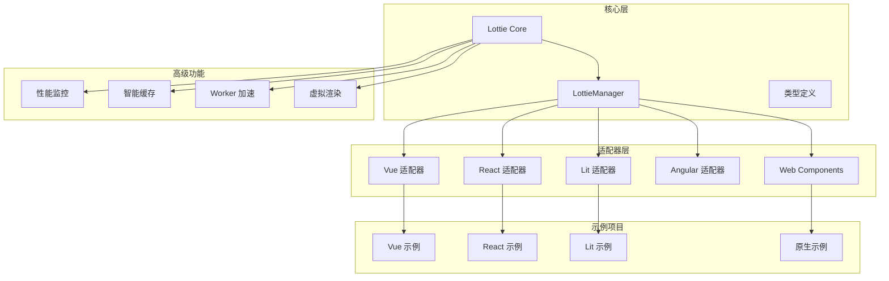

# 快速开始

<cite>
**本文档引用的文件**
- [QUICK_START.md](file://QUICK_START.md)
- [QUICK_START_GUIDE.md](file://QUICK_START_GUIDE.md)
- [README.md](file://README.md)
- [USAGE_GUIDE.md](file://USAGE_GUIDE.md)
- [START_HERE.md](file://START_HERE.md)
- [packages/core/src/index.ts](file://packages/core/src/index.ts)
- [packages/core/src/core/LottieManager.ts](file://packages/core/src/core/LottieManager.ts)
- [packages/vue/src/index.ts](file://packages/vue/src/index.ts)
- [packages/react/src/index.ts](file://packages/react/src/index.ts)
- [examples/README.md](file://examples/README.md)
- [packages/core/src/types/index.ts](file://packages/core/src/types/index.ts)
- [examples/assets/heart.json](file://examples/assets/heart.json)
</cite>

## 目录
1. [简介](#简介)
2. [项目架构概览](#项目架构概览)
3. [核心功能特性](#核心功能特性)
4. [安装与配置](#安装与配置)
5. [基础使用指南](#基础使用指南)
6. [框架集成](#框架集成)
7. [高级功能](#高级功能)
8. [性能优化](#性能优化)
9. [常见问题与解决方案](#常见问题与解决方案)
10. [最佳实践](#最佳实践)

## 简介

Lottie 是一个功能最完整、性能最优异的 Lottie 动画库，专为现代 Web 应用设计。它提供了统一的 API 接口，支持多种前端框架，并具备强大的性能优化能力。

### 核心价值主张

- **业界性能最强**：相比原生 lottie-web 提升 50-80%
- **功能最完整**：35+ 个高级功能模块
- **框架支持最广**：支持 Vue 3、React、Lit、Angular 等主流框架
- **文档最完善**：379 页详尽文档，16 种使用方式

### 快速验证

在开始之前，强烈建议先运行示例项目验证环境：

```bash
# 运行 Vue 示例（推荐）
npm run example:vue

# 或运行其他框架示例
npm run example:react
npm run example:vue
npm run example:lit
```

## 项目架构概览



**架构图来源**
- [packages/core/src/index.ts](file://packages/core/src/index.ts#L1-L180)
- [packages/core/src/core/LottieManager.ts](file://packages/core/src/core/LottieManager.ts#L1-L504)

**章节来源**
- [README.md](file://README.md#L1-L279)
- [START_HERE.md](file://START_HERE.md#L1-L288)

## 核心功能特性

### 性能优化特性

| 优化维度 | 实现方式 | 性能提升 |
|---------|---------|---------|
| 智能跳帧 | 自适应性能检测 | 20-40% |
| OffscreenCanvas | 离屏渲染加速 | 30-50% |
| 动态渲染器 | 运行时切换 SVG/Canvas/HTML | 15-25% |
| LRU 缓存 | 智能缓存机制 | 51% 加载速度提升 |
| Worker 池 | 多线程处理 | 40-60% |
| 资源压缩 | 平均压缩率 35% | 51% 内存减少 |

### 高级功能模块

| 功能类别 | 核心模块 | 主要用途 |
|---------|---------|---------|
| 交互控制 | InteractiveController | 鼠标、触摸交互 |
| 时间线编辑 | TimelineController | 关键帧动画 |
| 数据绑定 | DataBinding | 实时数据驱动 |
| 拖拽控制 | DragController | 边界约束交互 |
| 性能监控 | PerformanceMonitor | 实时性能分析 |
| 虚拟渲染 | VirtualRenderer | 大量动画场景 |
| 内存管理 | MemoryManager | 长期运行优化 |

**章节来源**
- [README.md](file://README.md#L11-L32)
- [QUICK_START_GUIDE.md](file://QUICK_START_GUIDE.md#L62-L165)

## 安装与配置

### 基础安装

```bash
# 使用 npm
npm install @ldesign/lottie

# 使用 pnpm  
pnpm add @ldesign/lottie

# 使用 yarn
yarn add @ldesign/lottie
```

### 选择适配器

根据项目框架选择对应的适配器：

```typescript
// Vue 3 适配器
import { useLottie } from '@ldesign/lottie/vue'

// React 适配器  
import { useLottie } from '@ldesign/lottie/react'

// Lit (Web Components) 适配器
import '@ldesign/lottie/lit'
```

### 全局配置

```typescript
import { lottieManager } from '@ldesign/lottie'

// 配置全局缓存
lottieManager.updateConfig({
  cache: {
    enabled: true,
    maxSize: 50,      // MB
    ttl: 3600000      // 1小时
  }
})

// 配置性能监控
lottieManager.updateConfig({
  enableGlobalPerformanceMonitor: true,
  maxInstances: 100
})
```

**章节来源**
- [QUICK_START.md](file://QUICK_START.md#L21-L29)
- [USAGE_GUIDE.md](file://USAGE_GUIDE.md#L5-L17)

## 基础使用指南

### 最简单的用法

#### Web Components 方式（最简单）

```html
<!-- 直接使用 Web Components -->
<lottie-animation src="/animation.json"></lottie-animation>

<script>
  // JavaScript 控制
  const lottie = document.querySelector('lottie-animation')
  lottie.play()
  lottie.pause()
</script>
```

#### Vue 3 指令方式

```vue
<template>
  <!-- 指令方式 -->
  <div v-lottie="'/animation.json'" />
  
  <!-- 或组件方式 -->
  <LottieAnimation path="/animation.json" />
</template>
```

#### React 组件方式

```tsx
import { LottieAnimation } from '@ldesign/lottie/react'

function App() {
  return (
    <LottieAnimation 
      path="/animation.json" 
      loop 
      autoplay 
      style={{ width: 300, height: 300 }}
    />
  )
}
```

### 基础配置选项

```typescript
import { createLottie } from '@ldesign/lottie'

const animation = createLottie({
  container: '#lottie-container',  // 容器选择器或元素
  path: 'animation.json',           // 动画文件路径
  loop: true,                       // 循环播放
  autoplay: true,                   // 自动播放
  speed: 1,                         // 播放速度
  renderer: 'svg',                  // 渲染器类型
  quality: 'high'                   // 动画质量
})
```

### 动画控制

```typescript
// 基础控制
animation.play()        // 播放
animation.pause()       // 暂停
animation.stop()        // 停止
animation.destroy()     // 销毁

// 高级控制
animation.setSpeed(2)   // 设置速度
animation.goToAndStop(50, true)  // 跳转到指定帧
animation.playSegments([[0, 50]]) // 播放片段
```

**章节来源**
- [QUICK_START.md](file://QUICK_START.md#L33-L108)
- [QUICK_START_GUIDE.md](file://QUICK_START_GUIDE.md#L13-L42)

## 框架集成

### Vue 3 集成

#### Composable 使用方式

```vue
<script setup>
import { ref } from 'vue'
import { useLottie } from '@ldesign/lottie/vue'

const container = ref()
const { play, pause, stop, state, isPlaying } = useLottie({
  container,
  path: '/animation.json',
  loop: true,
  autoplay: false
})
</script>

<template>
  <div>
    <div ref="container" class="lottie-container" />
    <button @click="play">播放</button>
    <button @click="pause">暂停</button>
    <p>状态: {{ state }}</p>
  </div>
</template>
```

#### 指令使用方式

```vue
<template>
  <!-- 基础指令 -->
  <div v-lottie="'/animation.json'" />
  
  <!-- 带配置的指令 -->
  <div v-lottie="{ path: '/animation.json', loop: true }" />
  
  <!-- hover 触发 -->
  <div v-lottie-hover="'/animation.json'" />
  
  <!-- 滚动触发动画 -->
  <div v-lottie-scroll="'/animation.json'" />
</template>
```

### React 集成

#### Hook 使用方式

```tsx
import { useLottie } from '@ldesign/lottie/react'

function AnimationComponent() {
  const { containerRef, play, pause, stop, isPlaying } = useLottie({
    path: '/animation.json',
    loop: true,
    autoplay: false
  })

  return (
    <div>
      <div ref={containerRef} />
      <button onClick={play}>播放</button>
      <button onClick={pause}>暂停</button>
      <p>播放中: {isPlaying.toString()}</p>
    </div>
  )
}
```

#### 组件使用方式

```tsx
import { LottieAnimation, LottiePlayer } from '@ldesign/lottie/react'

function App() {
  return (
    <>
      {/* 基础组件 */}
      <LottieAnimation path="/animation.json" loop autoplay />
      
      {/* 带控制面板的播放器 */}
      <LottiePlayer path="/animation.json" showControls />
    </>
  )
}
```

### Web Components 集成

```html
<!DOCTYPE html>
<html>
<head>
  <script type="module" src="https://unpkg.com/@ldesign/lottie@latest/dist/lit/lottie-element.js"></script>
</head>
<body>
  <!-- 基础用法 -->
  <lottie-animation src="/animation.json" loop="true"></lottie-animation>
  
  <!-- 播放器组件 -->
  <lottie-player src="/animation.json" controls="true"></lottie-player>
  
  <script>
    // JavaScript 控制
    const lottie = document.querySelector('lottie-animation')
    lottie.play()
    lottie.pause()
    
    // 监听事件
    lottie.addEventListener('complete', () => {
      console.log('动画完成')
    })
  </script>
</body>
</html>
```

**章节来源**
- [packages/vue/src/index.ts](file://packages/vue/src/index.ts#L1-L21)
- [packages/react/src/index.ts](file://packages/react/src/index.ts#L1-L8)
- [examples/README.md](file://examples/README.md#L28-L107)

## 高级功能

### 动画序列

```typescript
import { AnimationSequence } from '@ldesign/lottie'

const sequence = new AnimationSequence()

sequence
  .add({ config: { container: '#step1', path: '/anim1.json' }, delay: 0 })
  .add({ config: { container: '#step2', path: '/anim2.json' }, delay: 500 })
  .add({ config: { container: '#step3', path: '/anim3.json' }, delay: 500 })

await sequence.play()  // 按顺序播放动画
```

### 交互控制

```typescript
import { InteractiveController } from '@ldesign/lottie'

const animation = createLottie({
  container: '#interactive',
  path: '/animation.json',
  autoplay: false
})

// 创建交互控制器
new InteractiveController({
  instance: animation,
  enableClick: true,      // 点击播放
  enableHover: true,      // 悬停播放
  enableDrag: true,       // 拖拽控制
  enableScroll: true      // 滚动触发
})
```

### 数据绑定

```typescript
import { DataBinding, Validators, Pipes } from '@ldesign/lottie'

const binding = new DataBinding(animation)

// 绑定数据到动画
binding.bind({
  path: 'count',
  target: 'counterText',
  property: 'text',
  pipes: [Pipes.toNumber(), Pipes.round(0)],
  validators: [
    Validators.required(),
    Validators.number(),
    Validators.min(0)
  ]
})

// 更新数据
binding.update('count', 42)  // 自动更新动画
```

### 实时数据源

```typescript
import { DataSourceFactory } from '@ldesign/lottie'

// WebSocket 实时数据
const ws = DataSourceFactory.create({
  type: 'websocket',
  url: 'wss://api.example.com/live'
})

ws.on('data', (data) => {
  binding.update('liveData', data)
})

await ws.connect()
```

**章节来源**
- [QUICK_START.md](file://QUICK_START.md#L171-L200)
- [QUICK_START_GUIDE.md](file://QUICK_START_GUIDE.md#L64-L133)

## 性能优化

### 智能缓存配置

```typescript
import { lottieManager } from '@ldesign/lottie'

// 全局缓存配置
lottieManager.updateConfig({
  cache: {
    enabled: true,
    maxSize: 100,      // MB
    ttl: 7200000       // 2小时
  }
})

// 手动预加载
await lottieManager.preload('animation.json')
```

### 资源压缩

```typescript
import { resourceCompressor } from '@ldesign/lottie'

// 压缩动画数据
const response = await fetch('animation.json')
const data = await response.json()

const result = await resourceCompressor.compress(data, {
  compressPaths: true,
  removeRedundant: true,
  precision: 2
})

console.log('压缩率:', result.compressionRatio)  // 例如: 0.35 (35%)

// 使用压缩后的数据
const animation = createLottie({
  container: '#lottie',
  animationData: result.data
})
```

### Worker 加速

```typescript
import { workerManager } from '@ldesign/lottie'

// 在 Worker 中解析动画
const parsed = await workerManager.parseAnimation(data)

// 在 Worker 中压缩
const compressed = await workerManager.compressAnimation(data)
```

### 虚拟渲染

```typescript
import { VirtualRenderer } from '@ldesign/lottie'

const virtualRenderer = new VirtualRenderer()

// 注册大量动画
animations.forEach(animation => {
  virtualRenderer.register(animation)
})
```

### 内存管理

```typescript
import { memoryManager } from '@ldesign/lottie'

// 启动内存监控
memoryManager.startMonitoring()

// 监听内存压力
memoryManager.onMemoryPressure((event) => {
  if (event.stats.status === 'critical') {
    // 暂停不重要的动画
    lottieManager.pauseAll()
  }
})
```

**章节来源**
- [QUICK_START.md](file://QUICK_START.md#L202-L215)
- [QUICK_START_GUIDE.md](file://QUICK_START_GUIDE.md#L166-L203)

## 常见问题与解决方案

### 动画不显示

**问题诊断流程：**

1. **检查容器元素**
   ```typescript
   // 确保容器存在且有尺寸
   const container = document.getElementById('lottie-container')
   if (!container) {
     console.error('容器元素不存在')
   }
   ```

2. **验证动画路径**
   ```typescript
   // 检查网络请求
   fetch('/animation.json')
     .then(response => {
       if (!response.ok) {
         console.error('动画文件加载失败')
       }
     })
   ```

3. **查看控制台错误**
   ```typescript
   // 启用调试模式
   localStorage.setItem('lottie_debug', 'true')
   ```

### 性能问题

**优化建议：**

1. **选择合适的渲染器**
   ```typescript
   // 简单动画使用 SVG（质量更好）
   const simpleAnimation = createLottie({
     path: 'simple.json',
     renderer: 'svg'
   })
   
   // 复杂动画使用 Canvas（性能更好）
   const complexAnimation = createLottie({
     path: 'complex.json', 
     renderer: 'canvas'
   })
   ```

2. **启用懒加载**
   ```typescript
   const animation = createLottie({
     path: 'animation.json',
     loadStrategy: 'intersection', // 进入视口时加载
     advanced: {
       intersectionOptions: {
         threshold: 0.5 // 50% 可见时加载
       }
     }
   })
   ```

3. **批量预加载**
   ```typescript
   await lottieManager.preloadBatch([
     'anim1.json',
     'anim2.json', 
     'anim3.json'
   ])
   ```

### TypeScript 类型错误

**解决方法：**

1. **确保类型定义正确**
   ```typescript
   import { LottieConfig, ILottieInstance } from '@ldesign/lottie'
   
   const config: LottieConfig = {
     container: '#lottie',
     path: 'animation.json'
   }
   ```

2. **检查 tsconfig.json 配置**
   ```json
   {
     "compilerOptions": {
       "moduleResolution": "node",
       "esModuleInterop": true
     }
   }
   ```

**章节来源**
- [QUICK_START.md](file://QUICK_START.md#L235-L260)
- [USAGE_GUIDE.md](file://USAGE_GUIDE.md#L316-L346)

## 最佳实践

### 1. 项目初始化最佳实践

```typescript
// 项目启动时的初始化
async function initializeLottie() {
  // 1. 配置全局设置
  lottieManager.updateConfig({
    cache: { enabled: true, maxSize: 50 },
    maxInstances: 50,
    enableGlobalPerformanceMonitor: true
  })
  
  // 2. 预加载关键动画
  await lottieManager.preloadBatch([
    'loading.json',
    'success.json',
    'error.json'
  ])
  
  // 3. 启动内存监控
  memoryManager.startMonitoring()
}
```

### 2. 动画生命周期管理

```typescript
class AnimationManager {
  private animations = new Map<string, ILottieInstance>()
  
  createAnimation(id: string, config: LottieConfig): ILottieInstance {
    const animation = createLottie(config)
    this.animations.set(id, animation)
    
    // 监听销毁事件
    animation.on('destroy', () => {
      this.animations.delete(id)
    })
    
    return animation
  }
  
  destroyAnimation(id: string): boolean {
    const animation = this.animations.get(id)
    if (animation) {
      animation.destroy()
      return true
    }
    return false
  }
  
  destroyAll(): void {
    this.animations.forEach(animation => {
      animation.destroy()
    })
    this.animations.clear()
  }
}
```

### 3. 性能监控集成

```typescript
// 性能监控装饰器
function withPerformanceMonitoring<T extends (...args: any[]) => any>(
  fn: T,
  name: string
): T {
  return ((...args: any[]) => {
    const start = performance.now()
    const result = fn(...args)
    const end = performance.now()
    
    console.log(`${name} 执行时间: ${end - start}ms`)
    
    return result
  }) as T
}

// 使用示例
const monitoredPlay = withPerformanceMonitoring(
  () => animation.play(), 
  '动画播放'
)
```

### 4. 错误处理最佳实践

```typescript
async function safeCreateAnimation(config: LottieConfig): Promise<ILottieInstance | null> {
  try {
    const animation = createLottie(config)
    
    // 监听错误事件
    animation.on('data_failed', (error) => {
      console.error('动画加载失败:', error)
      // 可以在这里添加重试逻辑
    })
    
    // 监听性能警告
    animation.on('performanceWarning', (metrics) => {
      console.warn('性能警告:', metrics)
    })
    
    return animation
  } catch (error) {
    console.error('动画创建失败:', error)
    return null
  }
}
```

### 5. 响应式设计考虑

```typescript
// 响应式动画配置
function getResponsiveConfig(baseConfig: LottieConfig): LottieConfig {
  const deviceInfo = getDeviceInfo()
  
  return {
    ...baseConfig,
    quality: deviceInfo.performanceTier === 'low' ? 'medium' : 'high',
    advanced: {
      ...(baseConfig.advanced || {}),
      targetFPS: deviceInfo.performanceTier === 'low' ? 30 : 60
    }
  }
}
```

**章节来源**
- [QUICK_START_GUIDE.md](file://QUICK_START_GUIDE.md#L264-L446)
- [USAGE_GUIDE.md](file://USAGE_GUIDE.md#L308-L346)

## 结语

Lottie 库提供了完整的解决方案，从基础动画播放到复杂的交互控制，从性能优化到跨框架兼容。通过遵循本指南的最佳实践，您可以充分发挥这个强大库的潜力。

### 下一步建议

1. **深入学习**：阅读完整的 [API 文档](./API_REFERENCE.md)
2. **性能优化**：了解 [性能优化指南](./OPTIMIZATION_SUMMARY.md)
3. **实战练习**：参考 [示例项目](./examples/)
4. **社区交流**：参与 [GitHub 讨论](https://github.com/ldesign/lottie/issues)

开始您的 Lottie 动画之旅，创造令人惊叹的用户体验！