# Web Worker 优化

<cite>
**本文档引用的文件**
- [WorkerManager.ts](file://packages/core/src/core/WorkerManager.ts)
- [WorkerFactory.ts](file://packages/core/src/core/WorkerFactory.ts)
- [lottie.worker.ts](file://packages/core/src/workers/lottie.worker.ts)
- [compressor.ts](file://packages/core/src/workers/compressor.ts)
- [parser.ts](file://packages/core/src/workers/parser.ts)
- [ResourceCompressor.ts](file://packages/core/src/core/ResourceCompressor.ts)
- [index.ts](file://packages/core/src/index.ts)
- [performance.bench.ts](file://packages/core/src/__tests__/benchmarks/performance.bench.ts)
- [App.tsx](file://packages/react/example/src/App.tsx)
- [App.vue](file://packages/vue/example/src/App.vue)
</cite>

## 目录
1. [简介](#简介)
2. [架构概览](#架构概览)
3. [核心组件分析](#核心组件分析)
4. [Worker 管理机制](#worker-管理机制)
5. [任务调度与优化](#任务调度与优化)
6. [性能监控与统计](#性能监控与统计)
7. [配置选项详解](#配置选项详解)
8. [使用模式与最佳实践](#使用模式与最佳实践)
9. [故障排除指南](#故障排除指南)
10. [总结](#总结)

## 简介

Lottie Web Worker 优化是该库的核心性能增强功能，通过将CPU密集型任务（如动画数据解析、压缩、解压缩和优化）转移到后台线程来显著提升应用性能。这种设计不仅解放了主线程，还提供了更好的用户体验和更高的并发处理能力。

### 主要优势

- **主线程保护**：避免长时间运行的任务阻塞UI更新
- **并发处理**：支持多个Worker同时处理不同任务
- **智能降级**：在不支持Worker的环境中自动回退到主线程
- **任务优先级**：支持基于优先级的任务调度
- **健康监控**：实时监控Worker状态和性能指标

## 架构概览

Web Worker优化系统采用分层架构设计，包含以下核心层次：

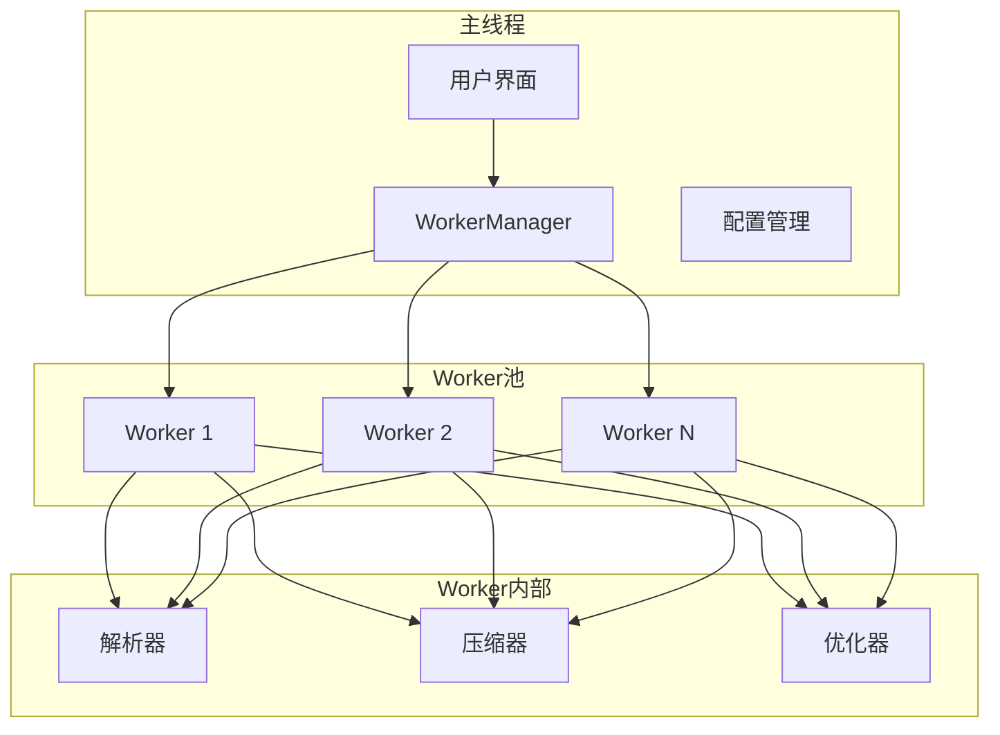

**图表来源**
- [WorkerManager.ts](file://packages/core/src/core/WorkerManager.ts#L40-L100)
- [lottie.worker.ts](file://packages/core/src/workers/lottie.worker.ts#L24-L79)

## 核心组件分析

### WorkerManager - Worker管理器

WorkerManager是整个系统的核心控制器，负责Worker的生命周期管理、任务调度和状态监控。

#### 主要职责

1. **Worker池管理**：创建、维护和销毁Worker实例
2. **任务队列管理**：处理任务的排队、调度和优先级控制
3. **健康监控**：跟踪Worker的性能和错误状态
4. **智能调度**：根据Worker状态动态分配任务

#### 核心接口定义

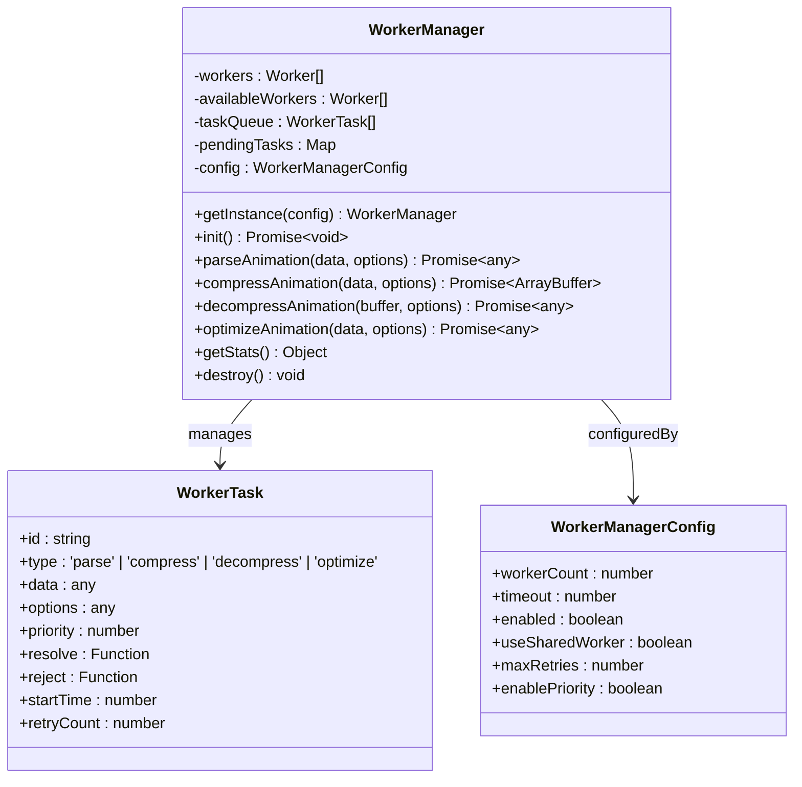

**图表来源**
- [WorkerManager.ts](file://packages/core/src/core/WorkerManager.ts#L9-L34)
- [WorkerManager.ts](file://packages/core/src/core/WorkerManager.ts#L40-L100)

**章节来源**
- [WorkerManager.ts](file://packages/core/src/core/WorkerManager.ts#L1-L612)

### WorkerFactory - Worker工厂

WorkerFactory负责创建和管理Worker实例，采用Blob URL方式确保跨平台兼容性。

#### 创建流程

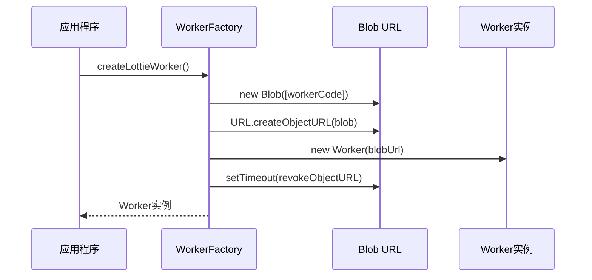

**图表来源**
- [WorkerFactory.ts](file://packages/core/src/core/WorkerFactory.ts#L134-L152)

**章节来源**
- [WorkerFactory.ts](file://packages/core/src/core/WorkerFactory.ts#L1-L161)

### Worker通信协议

Worker内部采用标准化的消息协议进行通信：

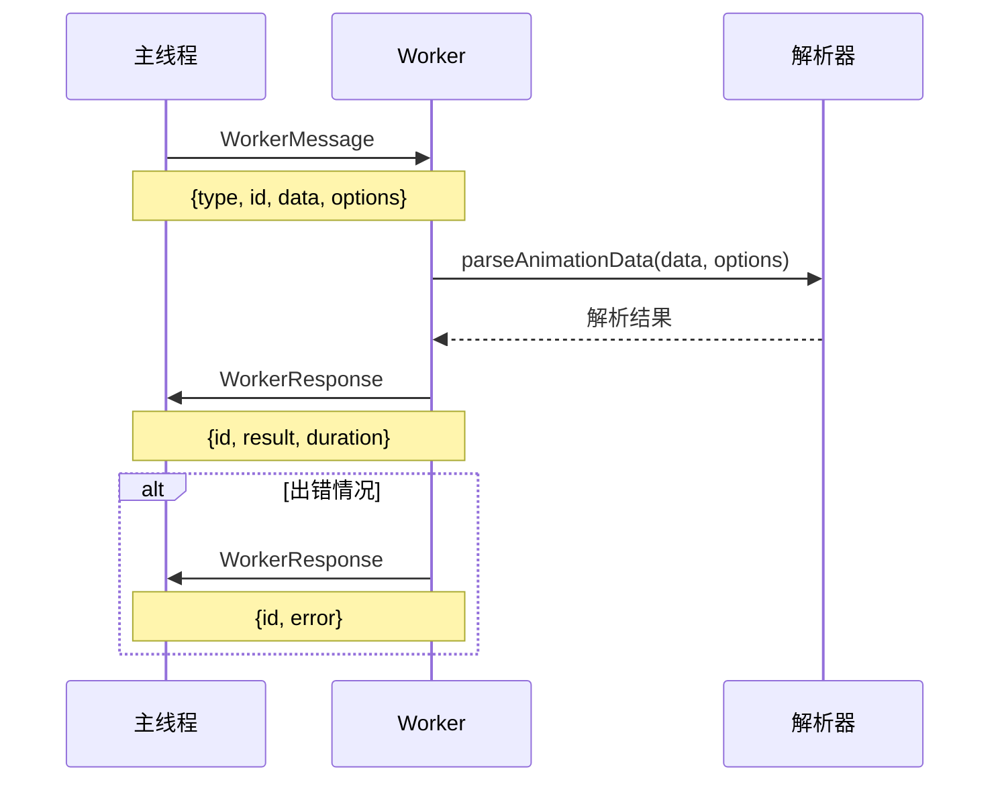

**图表来源**
- [lottie.worker.ts](file://packages/core/src/workers/lottie.worker.ts#L24-L79)

**章节来源**
- [lottie.worker.ts](file://packages/core/src/workers/lottie.worker.ts#L1-L79)

## Worker 管理机制

### 自动初始化与配置

WorkerManager采用单例模式，并提供智能配置：

#### 默认配置策略

| 配置项 | 默认值 | 说明 |
|--------|--------|------|
| workerCount | CPU核心数/2 | 基于硬件能力的Worker数量 |
| timeout | 30000ms | 任务超时时间 |
| enabled | true | 是否启用Worker |
| useSharedWorker | false | 是否使用共享Worker |
| maxRetries | 3 | 最大重试次数 |
| enablePriority | true | 是否启用优先级 |

#### 初始化流程

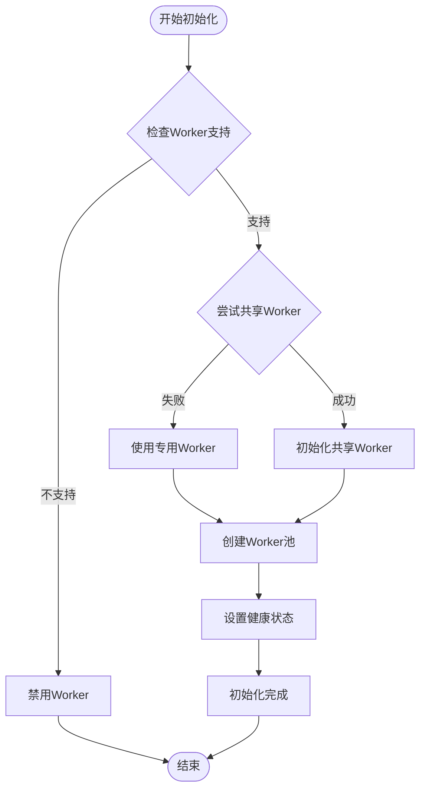

**图表来源**
- [WorkerManager.ts](file://packages/core/src/core/WorkerManager.ts#L98-L148)

**章节来源**
- [WorkerManager.ts](file://packages/core/src/core/WorkerManager.ts#L66-L148)

### Worker池管理策略

#### 负载均衡算法

WorkerManager采用简单而有效的负载均衡策略：

1. **可用性优先**：优先选择可用的Worker
2. **健康状态监控**：基于任务数量和错误率选择
3. **自动恢复**：Worker出错时自动移除并重新创建

#### 健康监控指标

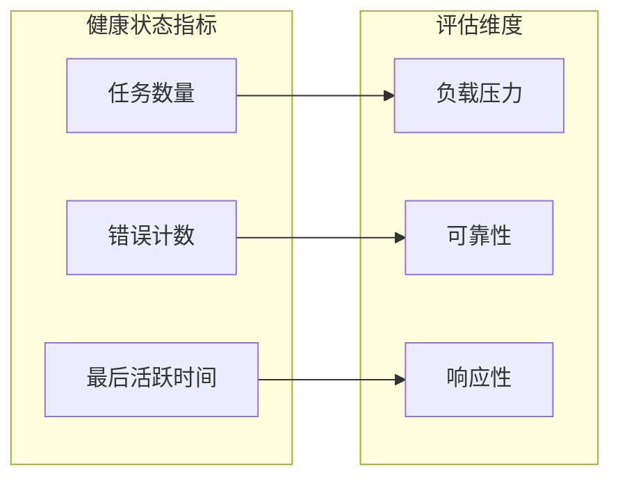

**图表来源**
- [WorkerManager.ts](file://packages/core/src/core/WorkerManager.ts#L56-L64)

**章节来源**
- [WorkerManager.ts](file://packages/core/src/core/WorkerManager.ts#L426-L440)

## 任务调度与优化

### 任务优先级系统

WorkerManager支持基于优先级的任务调度：

#### 优先级规则

| 优先级 | 场景 | 用途 |
|--------|------|------|
| 高 | 用户交互相关 | 如帧跳转、播放控制 |
| 中 | 渲染准备 | 如预加载、缓存 |
| 低 | 后台优化 | 如压缩、清理 |

#### 任务队列管理

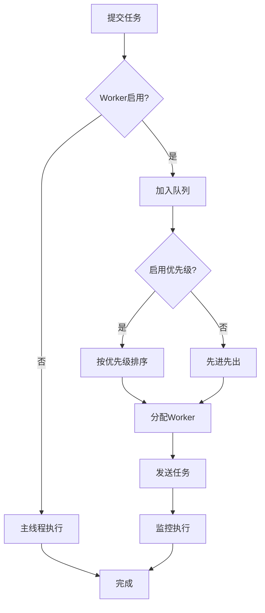

**图表来源**
- [WorkerManager.ts](file://packages/core/src/core/WorkerManager.ts#L402-L440)

**章节来源**
- [WorkerManager.ts](file://packages/core/src/core/WorkerManager.ts#L359-L440)

### 数据传输优化

#### Transferable Objects

为了最大化性能，WorkerManager支持Transferable Objects：

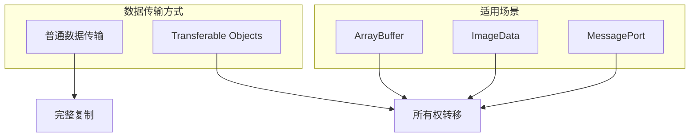

**图表来源**
- [WorkerManager.ts](file://packages/core/src/core/WorkerManager.ts#L459-L475)

**章节来源**
- [WorkerManager.ts](file://packages/core/src/core/WorkerManager.ts#L459-L475)

### 错误处理与重试机制

#### 重试策略

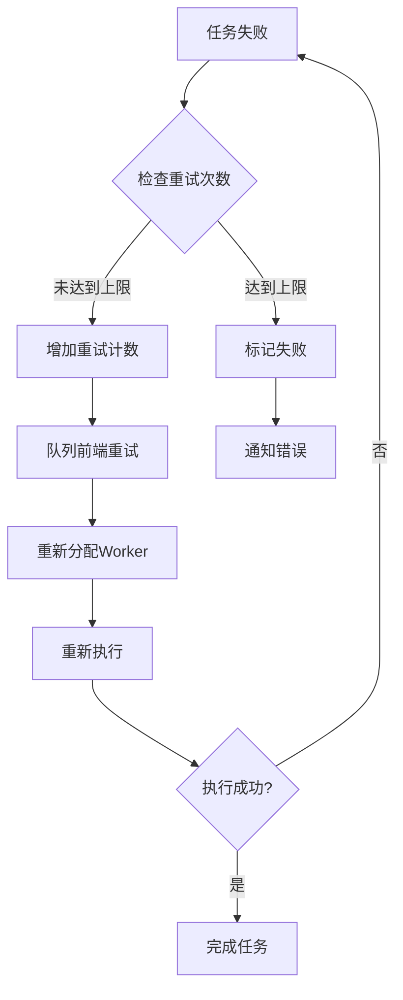

**图表来源**
- [WorkerManager.ts](file://packages/core/src/core/WorkerManager.ts#L299-L315)

**章节来源**
- [WorkerManager.ts](file://packages/core/src/core/WorkerManager.ts#L299-L350)

## 性能监控与统计

### 实时性能指标

WorkerManager提供全面的性能监控：

#### 核心统计指标

| 指标类别 | 具体指标 | 说明 |
|----------|----------|------|
| Worker状态 | totalWorkers | 总Worker数量 |
| Worker状态 | availableWorkers | 可用Worker数量 |
| 任务状态 | pendingTasks | 待处理任务数 |
| 任务状态 | queuedTasks | 队列中任务数 |
| 执行统计 | tasksCompleted | 完成任务数 |
| 执行统计 | tasksFailed | 失败任务数 |
| 执行统计 | tasksRetried | 重试任务数 |
| 性能指标 | averageDuration | 平均执行时间 |
| 健康状态 | workerHealth | Worker健康状态 |

#### 性能分析报告

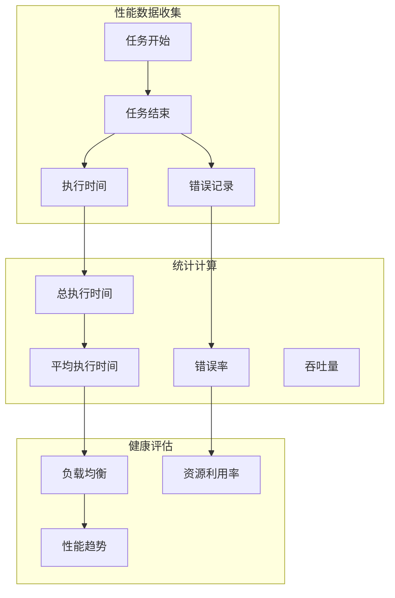

**图表来源**
- [WorkerManager.ts](file://packages/core/src/core/WorkerManager.ts#L538-L569)

**章节来源**
- [WorkerManager.ts](file://packages/core/src/core/WorkerManager.ts#L538-L569)

### 资源压缩器集成

ResourceCompressor与WorkerManager深度集成，提供额外的性能优化：

#### 压缩流程

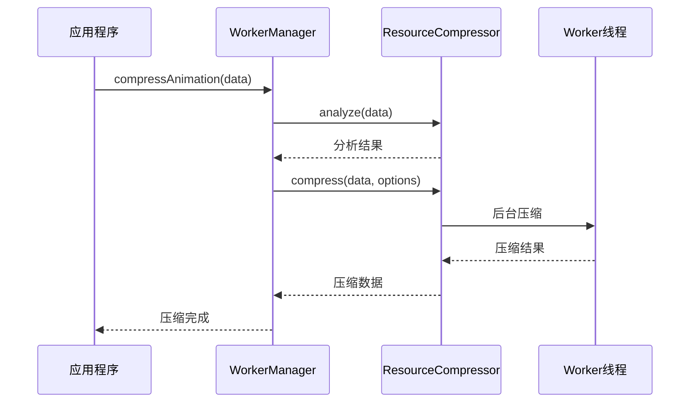

**图表来源**
- [ResourceCompressor.ts](file://packages/core/src/core/ResourceCompressor.ts#L49-L103)

**章节来源**
- [ResourceCompressor.ts](file://packages/core/src/core/ResourceCompressor.ts#L1-L448)

## 配置选项详解

### WorkerManager配置

#### 完整配置接口

```typescript
interface WorkerManagerConfig {
  /** Worker数量（默认为CPU核心数的一半） */
  workerCount?: number;
  /** 任务超时时间（ms） */
  timeout?: number;
  /** 是否启用Worker（可以禁用用于调试） */
  enabled?: boolean;
  /** 是否使用共享Worker */
  useSharedWorker?: boolean;
  /** 最大任务重试次数 */
  maxRetries?: number;
  /** 是否启用任务优先级 */
  enablePriority?: boolean;
}
```

#### 配置示例

```typescript
// 高性能配置
const highPerfConfig = {
  workerCount: 4,
  timeout: 15000,
  enabled: true,
  useSharedWorker: false,
  maxRetries: 2,
  enablePriority: true
};

// 节能配置
const powerSavingConfig = {
  workerCount: 1,
  timeout: 30000,
  enabled: true,
  useSharedWorker: false,
  maxRetries: 5,
  enablePriority: false
};
```

### 压缩器配置

#### 压缩选项详解

```typescript
interface CompressionOptions {
  /** 是否压缩路径数据 */
  compressPaths?: boolean;
  /** 是否移除冗余数据 */
  removeRedundant?: boolean;
  /** 是否优化图片资源 */
  optimizeImages?: boolean;
  /** 精度（小数点位数） */
  precision?: number;
  /** 是否压缩颜色 */
  compressColors?: boolean;
  /** 是否移除隐藏图层 */
  removeHiddenLayers?: boolean;
}
```

**章节来源**
- [WorkerManager.ts](file://packages/core/src/core/WorkerManager.ts#L21-L34)
- [ResourceCompressor.ts](file://packages/core/src/core/ResourceCompressor.ts#L6-L19)

## 使用模式与最佳实践

### 基础使用模式

#### 单例管理模式

```typescript
import { workerManager } from '@ldesign/lottie';

// 获取单例实例
const manager = workerManager;

// 解析动画数据
const animationData = await manager.parseAnimation(jsonString, {
  validate: true,
  removeHiddenLayers: true,
  roundValues: true
});
```

#### 配置化使用

```typescript
import { WorkerManager } from '@ldesign/lottie';

// 自定义配置
const customManager = WorkerManager.getInstance({
  workerCount: 2,
  timeout: 20000,
  enabled: true
});

// 使用自定义实例
await customManager.parseAnimation(data);
```

**章节来源**
- [index.ts](file://packages/core/src/index.ts#L53-L61)
- [WorkerManager.ts](file://packages/core/src/core/WorkerManager.ts#L608)

### 高级使用模式

#### 批量任务处理

```typescript
// 并行处理多个动画
const animations = [
  { id: 'anim1', data: jsonData1 },
  { id: 'anim2', data: jsonData2 },
  { id: 'anim3', data: jsonData3 }
];

const results = await Promise.all(
  animations.map(async ({ id, data }) => {
    try {
      const result = await workerManager.parseAnimation(data);
      return { id, result, success: true };
    } catch (error) {
      return { id, error, success: false };
    }
  })
);
```

#### 任务优先级控制

```typescript
// 高优先级任务（用户交互）
const highPriorityTask = {
  type: 'parse',
  data: urgentData,
  options: { validate: true },
  priority: 10
};

// 低优先级任务（后台优化）
const lowPriorityTask = {
  type: 'optimize',
  data: backgroundData,
  options: { removeHiddenLayers: true },
  priority: 1
};

// Worker会自动按优先级排序
```

### 框架集成模式

#### React Hook集成

```typescript
import { useEffect, useRef } from 'react';
import { useLottie } from '@ldesign/lottie-react';

function AnimationComponent() {
  const { containerRef, play, pause } = useLottie({
    path: animationUrl,
    autoplay: false,
    loop: true
  });

  // 使用Worker进行预处理
  useEffect(() => {
    const processAnimation = async () => {
      const compressed = await workerManager.compressAnimation(animationData);
      // 存储压缩后的数据
    };
    
    processAnimation();
  }, []);

  return <div ref={containerRef} />;
}
```

#### Vue Composables集成

```typescript
import { ref, onMounted } from 'vue';
import { useLottie } from '@ldesign/lottie-vue';

export default defineComponent({
  setup() {
    const { containerRef, play, pause } = useLottie({
      path: animationUrl,
      autoplay: false
    });

    onMounted(async () => {
      // 在Worker中分析动画复杂度
      const analysis = await workerManager.optimizeAnimation(animationData);
      console.log('Animation complexity:', analysis);
    });

    return { containerRef, play, pause };
  }
});
```

**章节来源**
- [App.tsx](file://packages/react/example/src/App.tsx#L25-L30)
- [App.vue](file://packages/vue/example/src/App.vue#L16-L24)

## 故障排除指南

### 常见问题与解决方案

#### Worker不支持问题

**问题描述**：在某些环境中Worker不可用

**解决方案**：
```typescript
import { WorkerManager, isWorkerSupported } from '@ldesign/lottie';

// 检查支持性
if (!isWorkerSupported()) {
  console.warn('Web Workers not supported, falling back to main thread');
}

// 配置降级策略
const manager = WorkerManager.getInstance({
  enabled: isWorkerSupported(),
  // 其他配置...
});
```

#### 性能问题诊断

**问题症状**：Worker任务执行缓慢

**诊断步骤**：
1. 检查Worker数量配置
2. 监控任务队列长度
3. 分析任务复杂度
4. 检查网络延迟

**优化建议**：
```typescript
// 监控性能指标
const stats = workerManager.getStats();
console.log('Worker Stats:', stats);

// 根据负载调整配置
const optimalConfig = {
  workerCount: Math.min(navigator.hardwareConcurrency || 4, 4),
  timeout: stats.averageDuration * 2
};
```

#### 内存泄漏问题

**预防措施**：
1. 正确调用`destroy()`方法
2. 避免循环引用
3. 及时清理事件监听器

**清理代码**：
```typescript
// 组件卸载时清理
useEffect(() => {
  return () => {
    workerManager.destroy();
  };
}, []);
```

### 调试技巧

#### 启用详细日志

```typescript
// 开发环境启用详细日志
if (process.env.NODE_ENV === 'development') {
  const stats = workerManager.getStats();
  console.log('Worker Performance:', stats);
}
```

#### 性能基准测试

```typescript
// 性能测试
const startTime = performance.now();
await workerManager.parseAnimation(testData);
const endTime = performance.now();
console.log(`Worker took ${endTime - startTime}ms`);
```

**章节来源**
- [WorkerFactory.ts](file://packages/core/src/core/WorkerFactory.ts#L158-L160)
- [WorkerManager.ts](file://packages/core/src/core/WorkerManager.ts#L575-L594)

## 总结

Lottie Web Worker优化系统通过精心设计的架构和完善的机制，为高性能动画应用提供了强大的性能保障。其主要特点包括：

### 核心优势

1. **智能调度**：基于硬件能力和任务特性的动态调度
2. **容错机制**：完善的错误处理和重试策略
3. **性能监控**：实时的性能指标和健康状态监控
4. **灵活配置**：支持多种配置模式适应不同需求
5. **框架友好**：与主流前端框架无缝集成

### 技术创新

- **Blob URL Worker**：解决外部文件依赖问题
- **Transferable Objects**：最大化数据传输效率
- **优先级队列**：智能的任务调度算法
- **健康监控**：Worker状态的实时跟踪

### 应用价值

通过Web Worker优化，Lottie动画库实现了：
- **主线程解放**：提升UI响应性和用户体验
- **并发处理**：支持多动画同时运行
- **资源节约**：降低CPU和内存消耗
- **稳定性提升**：减少卡顿和崩溃风险

这套Web Worker优化方案不仅解决了技术挑战，更为现代Web应用的高性能动画实现提供了可靠的技术基础。