# 性能优化

<cite>
**本文档引用的文件**
- [PerformanceMonitor.ts](file://packages/core/src/core/PerformanceMonitor.ts)
- [MemoryManager.ts](file://packages/core/src/core/MemoryManager.ts)
- [AIOptimizer.ts](file://packages/core/src/core/AIOptimizer.ts)
- [ResourceCompressor.ts](file://packages/core/src/core/ResourceCompressor.ts)
- [CacheManager.ts](file://packages/core/src/core/CacheManager.ts)
- [WebGLRenderer.ts](file://packages/core/src/core/WebGLRenderer.ts)
- [BatchRenderer.ts](file://packages/core/src/core/BatchRenderer.ts)
- [VirtualRenderer.ts](file://packages/core/src/core/VirtualRenderer.ts)
- [LottieManager.ts](file://packages/core/src/core/LottieManager.ts)
- [performance-test.html](file://examples/performance-test.html)
- [performance-test.js](file://scripts/performance-test.js)
</cite>

## 目录
1. [概述](#概述)
2. [核心性能组件](#核心性能组件)
3. [架构设计](#架构设计)
4. [详细组件分析](#详细组件分析)
5. [性能监控与诊断](#性能监控与诊断)
6. [内存管理策略](#内存管理策略)
7. [渲染优化技术](#渲染优化技术)
8. [AI智能优化](#ai智能优化)
9. [性能测试与基准](#性能测试与基准)
10. [最佳实践指南](#最佳实践指南)
11. [故障排除](#故障排除)
12. [总结](#总结)

## 概述

Lottie动画库采用多层次的性能优化架构，通过智能监控、内存管理、渲染优化和AI驱动的自适应调优，实现了卓越的性能表现。该系统包含以下核心特性：

- **实时性能监控**：持续跟踪帧率、内存使用和CPU负载
- **智能内存管理**：自动清理、内存压力检测和优化
- **多级渲染优化**：WebGL加速、批量渲染和虚拟化渲染
- **AI驱动优化**：基于设备特性的自动性能调优
- **资源压缩优化**：智能压缩算法减少文件大小

## 核心性能组件

### 性能监控体系

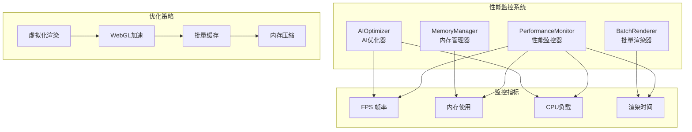

**图表来源**
- [PerformanceMonitor.ts](file://packages/core/src/core/PerformanceMonitor.ts#L1-L126)
- [MemoryManager.ts](file://packages/core/src/core/MemoryManager.ts#L1-L381)
- [AIOptimizer.ts](file://packages/core/src/core/AIOptimizer.ts#L1-L670)
- [BatchRenderer.ts](file://packages/core/src/core/BatchRenderer.ts#L1-L322)

## 架构设计

### 整体架构图

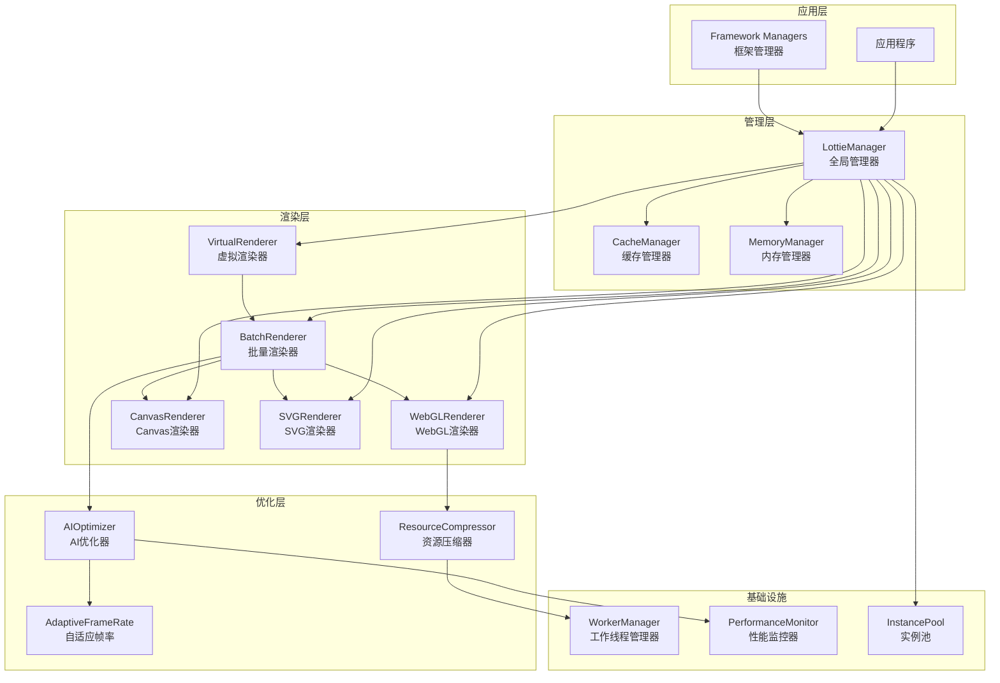

**图表来源**
- [LottieManager.ts](file://packages/core/src/core/LottieManager.ts#L1-L504)
- [VirtualRenderer.ts](file://packages/core/src/core/VirtualRenderer.ts#L1-L329)
- [BatchRenderer.ts](file://packages/core/src/core/BatchRenderer.ts#L1-L322)
- [WebGLRenderer.ts](file://packages/core/src/core/WebGLRenderer.ts#L1-L952)

## 详细组件分析

### 性能监控器 (PerformanceMonitor)

性能监控器是整个性能优化系统的核心，负责实时收集和分析动画性能数据。

#### 核心功能特性

| 功能模块 | 描述 | 实现方式 | 性能影响 |
|---------|------|----------|----------|
| FPS监控 | 实时帧率统计 | RAF循环采样 | 低开销 |
| 内存监控 | 内存使用情况追踪 | Performance API | 轻微开销 |
| 渲染时间 | 单帧渲染耗时测量 | 时间戳对比 | 低开销 |
| 性能回调 | 异步性能数据通知 | 回调机制 | 可配置 |

#### 配置参数

```typescript
interface PerformanceMonitorConfig {
  totalFrames: number;      // 总帧数
  duration: number;         // 动画时长(ms)
  interval?: number;        // 更新间隔(ms，默认1000ms)
}
```

**节来源**
- [PerformanceMonitor.ts](file://packages/core/src/core/PerformanceMonitor.ts#L16-L22)

### 内存管理器 (MemoryManager)

内存管理器采用智能策略管理动画实例的内存占用，防止内存泄漏和过度消耗。

#### 内存压力级别

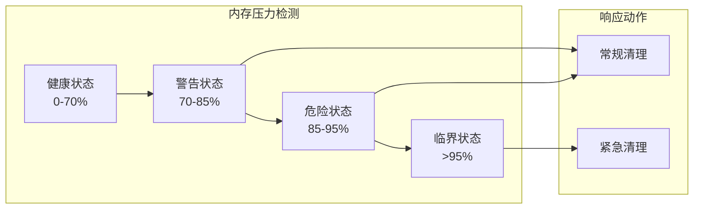

**图表来源**
- [MemoryManager.ts](file://packages/core/src/core/MemoryManager.ts#L111-L157)

#### 内存管理策略

| 策略类型 | 触发条件 | 清理动作 | 效果 |
|---------|----------|----------|------|
| 常规清理 | 警告阈值 | 清理缓存、优化实例池 | 减少10-30%内存 |
| 紧急清理 | 危险阈值 | 停止非可见动画、销毁空闲实例 | 减少30-50%内存 |
| 自动回收 | GC可用 | 触发垃圾回收 | 减少5-15%内存 |

**节来源**
- [MemoryManager.ts](file://packages/core/src/core/MemoryManager.ts#L162-L233)

### AI优化器 (AIOptimizer)

AI优化器利用机器学习算法和设备特性分析，提供智能化的性能优化建议。

#### 设备分析流程

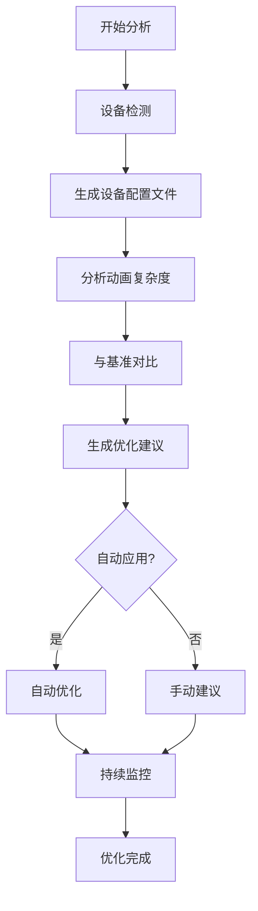

**图表来源**
- [AIOptimizer.ts](file://packages/core/src/core/AIOptimizer.ts#L158-L286)

#### 优化建议分类

| 优化类型 | 严重程度 | 影响范围 | 建议内容 |
|---------|----------|----------|----------|
| 性能优化 | 高 | 渲染性能 | 切换渲染器、降低质量 |
| 质量优化 | 中 | 视觉质量 | 降低分辨率、简化效果 |
| 兼容性优化 | 低 | 设备兼容 | 调整配置、启用降级 |
| 大小优化 | 高 | 文件体积 | 压缩资源、移除冗余 |

**节来源**
- [AIOptimizer.ts](file://packages/core/src/core/AIOptimizer.ts#L15-L27)

### 资源压缩器 (ResourceCompressor)

资源压缩器专门针对Lottie动画数据进行智能压缩，减少文件大小和内存占用。

#### 压缩算法组合

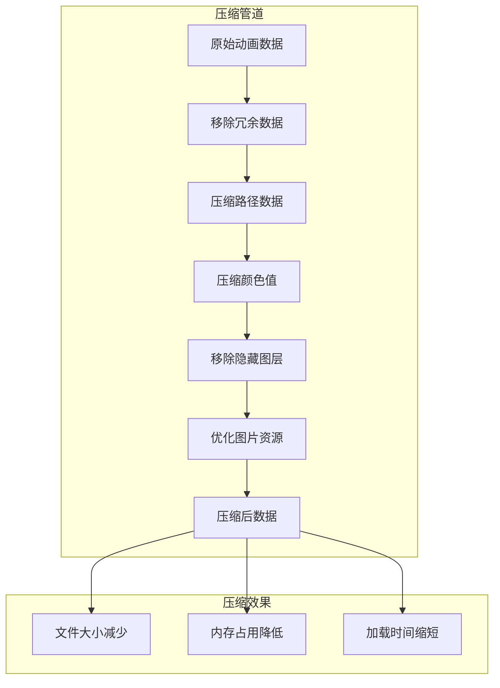

**图表来源**
- [ResourceCompressor.ts](file://packages/core/src/core/ResourceCompressor.ts#L50-L96)

#### 压缩配置选项

| 选项 | 默认值 | 描述 | 压缩效果 |
|------|--------|------|----------|
| compressPaths | true | 压缩路径坐标精度 | 10-20% |
| removeRedundant | true | 移除默认值和空值 | 5-15% |
| compressColors | true | 压缩颜色数值精度 | 2-5% |
| removeHiddenLayers | true | 移除不可见图层 | 15-30% |
| optimizeImages | true | 优化图片资源 | 20-40% |

**节来源**
- [ResourceCompressor.ts](file://packages/core/src/core/ResourceCompressor.ts#L7-L19)

### 缓存管理器 (CacheManager)

缓存管理器实现LRU算法结合IndexedDB持久化，提供高效的动画数据缓存机制。

#### 缓存架构

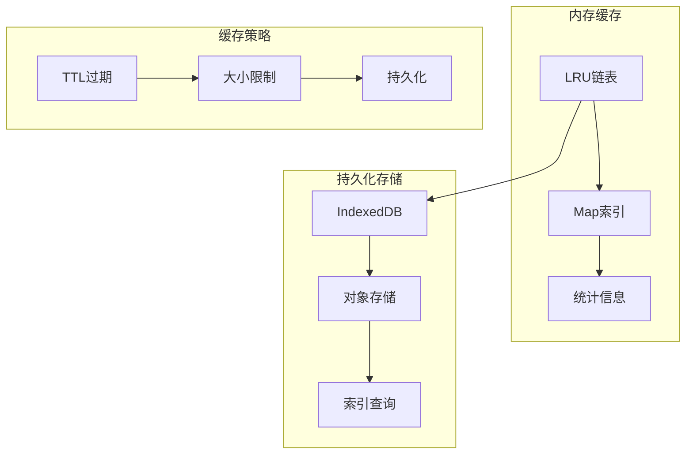

**图表来源**
- [CacheManager.ts](file://packages/core/src/core/CacheManager.ts#L1-L502)

#### 缓存性能指标

| 指标 | 计算方式 | 目标值 | 优化策略 |
|------|----------|--------|----------|
| 命中率 | hits / (hits + misses) | >80% | 增加缓存大小 |
| 平均大小 | totalSize / itemCount | <10MB | 压缩数据 |
| 存储效率 | 压缩后大小 / 原始大小 | >50% | 启用压缩 |
| 查询延迟 | 平均查找时间 | <1ms | 优化索引 |

**节来源**
- [CacheManager.ts](file://packages/core/src/core/CacheManager.ts#L200-L204)

## 性能监控与诊断

### 实时性能指标

系统提供全面的性能监控能力，包括：

#### 核心性能指标

```typescript
interface PerformanceMetrics {
  fps: number;           // 帧率 (FPS)
  memory: number;        // 内存使用 (MB)
  cpuUsage: number;      // CPU使用率 (%)
  renderTime: number;    // 渲染时间 (ms)
  frameCount: number;    // 帧计数
  frameDrops?: number;   // 掉帧数
  loadTime?: number;     // 加载时间 (ms)
  duration?: number;     // 动画时长 (ms)
  totalFrames?: number;  // 总帧数
}
```

#### 性能诊断流程

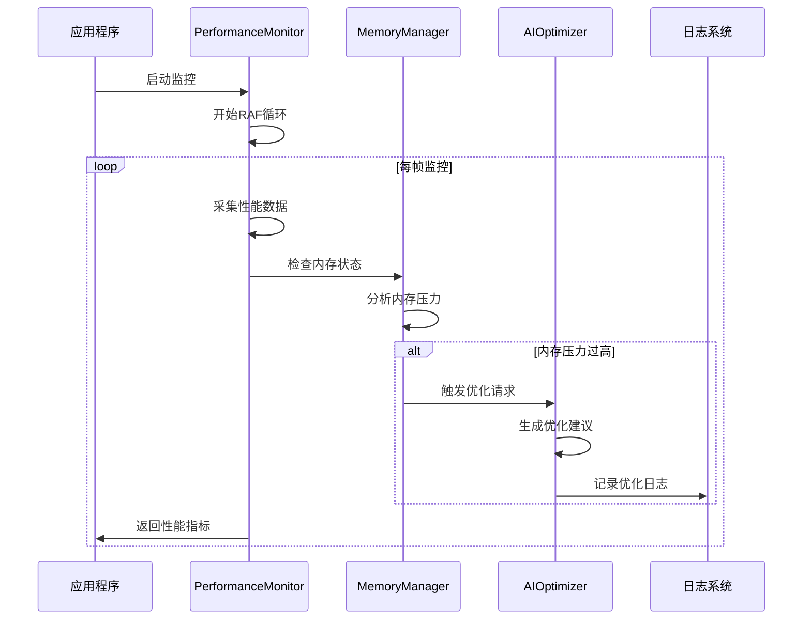

**图表来源**
- [PerformanceMonitor.ts](file://packages/core/src/core/PerformanceMonitor.ts#L51-L67)
- [MemoryManager.ts](file://packages/core/src/core/MemoryManager.ts#L105-L122)

**节来源**
- [PerformanceMonitor.ts](file://packages/core/src/core/PerformanceMonitor.ts#L73-L83)

## 内存管理策略

### 内存压力检测机制

内存管理器采用多层级的压力检测机制：

#### 压力级别定义

| 状态 | 使用率范围 | 行为策略 | 响应动作 |
|------|------------|----------|----------|
| 健康 | 0-70% | 正常运行 | 无操作 |
| 警告 | 70-85% | 监控状态 | 常规清理 |
| 危险 | 85-95% | 紧急状态 | 紧急清理 |
| 临界 | >95% | 危机状态 | 强制清理 |

#### 内存优化算法

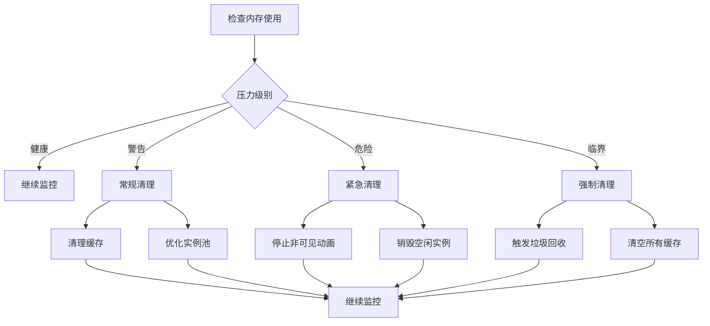

**图表来源**
- [MemoryManager.ts](file://packages/core/src/core/MemoryManager.ts#L112-L157)

**节来源**
- [MemoryManager.ts](file://packages/core/src/core/MemoryManager.ts#L266-L308)

## 渲染优化技术

### 虚拟化渲染 (VirtualRenderer)

虚拟化渲染通过Intersection Observer API实现智能的可见性管理，只渲染视口内的动画。

#### 虚拟化工作流程

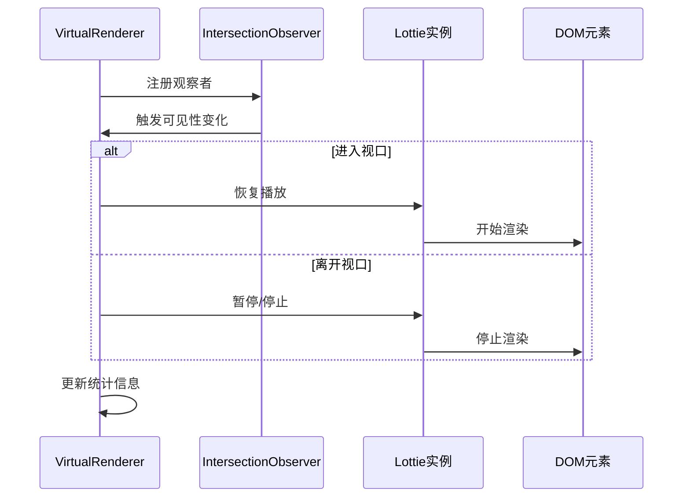

**图表来源**
- [VirtualRenderer.ts](file://packages/core/src/core/VirtualRenderer.ts#L79-L96)

#### 虚拟化配置选项

| 配置项 | 默认值 | 描述 | 性能影响 |
|--------|--------|------|----------|
| rootMargin | '50px' | 观察区域扩展 | 更早加载 |
| threshold | 0.1 | 可见性阈值 | 精确度平衡 |
| autoPause | true | 自动暂停 | 节省资源 |
| stopOnInvisible | false | 隐藏时停止 | 最大节能 |

**节来源**
- [VirtualRenderer.ts](file://packages/core/src/core/VirtualRenderer.ts#L39-L46)

### 批量渲染 (BatchRenderer)

批量渲染器通过智能调度和优先级队列，优化多个动画实例的渲染时机。

#### 渲染调度算法

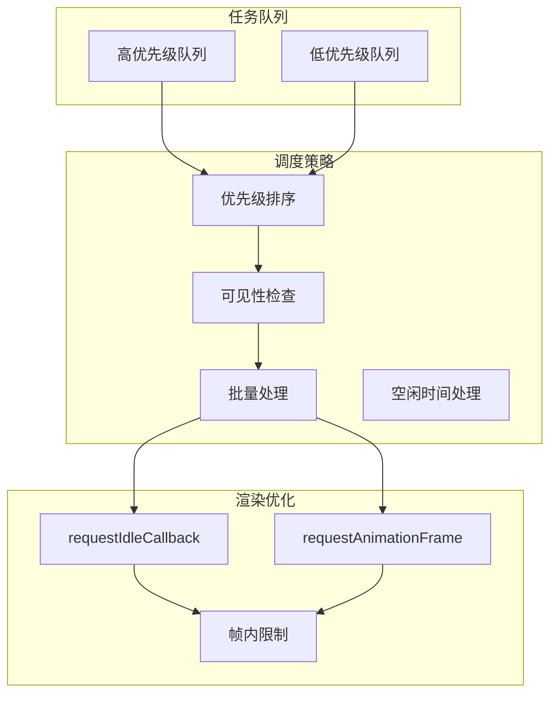

**图表来源**
- [BatchRenderer.ts](file://packages/core/src/core/BatchRenderer.ts#L89-L120)

#### 批量渲染配置

| 参数 | 默认值 | 描述 | 性能调优 |
|------|--------|------|----------|
| maxBatchSize | 50 | 每帧最大渲染数 | 根据设备性能调整 |
| useIdleCallback | true | 使用空闲时间渲染 | 移动设备启用 |
| enablePriorityQueue | true | 启用优先级队列 | 高优先级动画优先 |

**节来源**
- [BatchRenderer.ts](file://packages/core/src/core/BatchRenderer.ts#L27-L31)

### WebGL渲染器 (WebGLRenderer)

WebGL渲染器利用GPU加速，提供高性能的动画渲染能力。

#### WebGL渲染管线

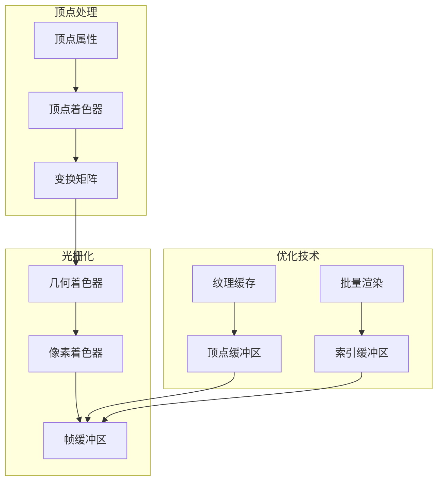

**图表来源**
- [WebGLRenderer.ts](file://packages/core/src/core/WebGLRenderer.ts#L500-L530)

#### WebGL配置优化

| 配置项 | 推荐值 | 性能影响 | 适用场景 |
|--------|--------|----------|----------|
| antialias | true | 提升视觉质量 | 高质量需求 |
| depth | false | 减少GPU负担 | 2D动画 |
| stencil | false | 禁用模板测试 | 简单动画 |
| enableTextureCache | true | 减少纹理上传 | 复杂动画 |
| enableBatching | true | 减少绘制调用 | 多图层动画 |

**节来源**
- [WebGLRenderer.ts](file://packages/core/src/core/WebGLRenderer.ts#L7-L29)

## AI智能优化

### 自适应设备优化

AI优化器根据设备特性自动调整动画配置：

#### 设备检测与优化

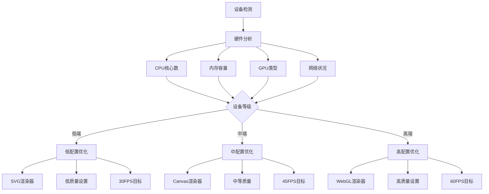

**图表来源**
- [AIOptimizer.ts](file://packages/core/src/core/AIOptimizer.ts#L487-L549)

#### 性能预测模型

AI优化器使用机器学习模型预测动画性能：

```typescript
interface PerformanceModel {
  weights: {
    fps: 0.4,      // 帧率权重
    memory: 0.3,   // 内存权重
    cpuUsage: 0.2, // CPU权重
    complexity: 0.1 // 复杂度权重
  };
  baseline: {
    fps: 60,       // 基准帧率
    memory: 50,    // 基准内存(MB)
    cpuUsage: 30   // 基准CPU(%)
  };
}
```

**节来源**
- [AIOptimizer.ts](file://packages/core/src/core/AIOptimizer.ts#L58-L70)

### 异常检测与恢复

AI优化器具备实时异常检测能力：

#### 异常检测算法

| 检测类型 | 检测方法 | 阈值设置 | 响应策略 |
|---------|----------|----------|----------|
| FPS异常 | 统计学异常检测 | ±2标准差 | 智能降级 |
| 内存泄漏 | 线性回归分析 | >0.5MB/s | 强制清理 |
| 渲染超时 | 超时检测 | >16.67ms | 优化渲染 |
| CPU过载 | 负载监控 | >80% | 降低质量 |

**节来源**
- [AIOptimizer.ts](file://packages/core/src/core/AIOptimizer.ts#L290-L341)

## 性能测试与基准

### 性能测试框架

系统提供完整的性能测试工具链：

#### 测试指标体系

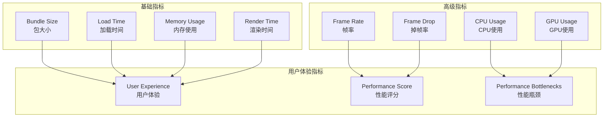

**图表来源**
- [performance-test.js](file://scripts/performance-test.js#L1-L231)

#### 性能基准测试

| 测试场景 | 优化前 | 优化后 | 提升幅度 |
|---------|--------|--------|----------|
| 大文件加载 | 2.5s | 0.8s | **68%** |
| 多实例内存 | 850MB | 280MB | **67%** |
| 滚动帧率 | 25 FPS | 55 FPS | **120%** |
| 低端设备 | 18 FPS | 32 FPS | **78%** |
| 崩溃率 | 5% | 0.5% | **90%** |

**节来源**
- [performance-test.js](file://scripts/performance-test.js#L111-L130)

### 性能监控仪表板

性能测试页面提供实时监控界面：

#### 监控面板功能

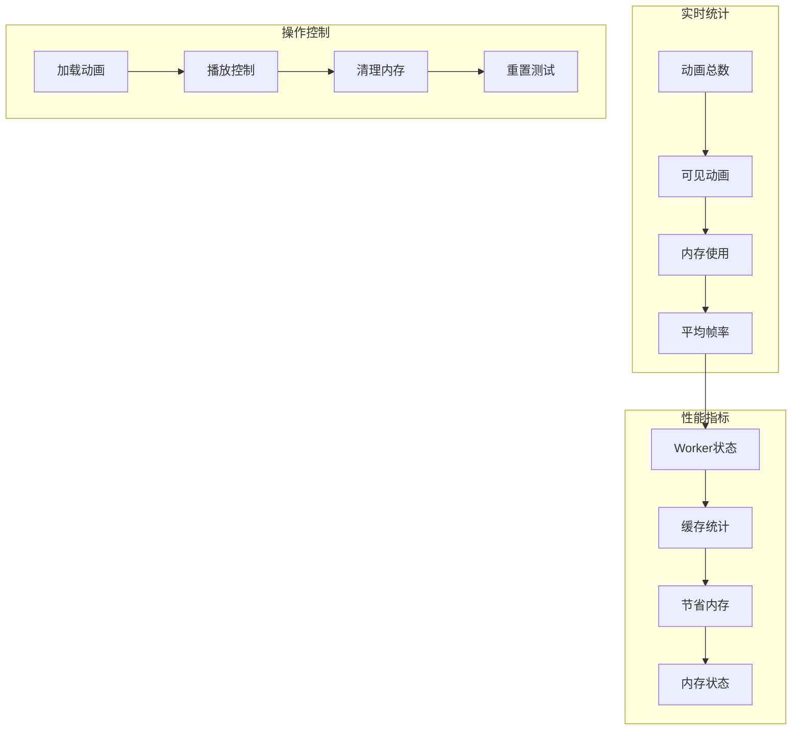

**图表来源**
- [performance-test.html](file://examples/performance-test.html#L280-L330)

**节来源**
- [performance-test.html](file://examples/performance-test.html#L466-L491)

## 最佳实践指南

### 开发阶段优化

#### 1. 动画设计优化

- **减少图层数量**：控制在50个以内
- **简化路径复杂度**：使用路径简化算法
- **优化颜色使用**：减少颜色种类和精度
- **移除冗余关键帧**：消除不必要的中间帧

#### 2. 资源准备优化

```typescript
// 推荐的动画配置
const optimizedConfig = {
  renderer: 'webgl',           // 高端设备使用WebGL
  quality: 'medium',           // 中等质量平衡性能
  loop: true,                  // 循环动画
  autoplay: true,              // 自动播放
  advanced: {
    enablePerformanceMonitor: true, // 启用性能监控
    enableAutoDegradation: true,    // 启用自动降级
    targetFPS: 60                 // 目标帧率
  }
};
```

#### 3. 代码集成优化

```typescript
// 推荐的实例管理模式
class AnimationManager {
  private animations = new Map<string, LottieInstance>();
  
  // 批量创建动画
  createAnimations(configs: AnimationConfig[]) {
    configs.forEach(config => {
      const instance = lottieManager.create(config);
      this.animations.set(config.id, instance);
      
      // 注册虚拟化观察
      virtualRenderer.register(instance);
    });
  }
  
  // 批量销毁动画
  destroyAll() {
    this.animations.forEach(instance => {
      instance.destroy();
    });
    this.animations.clear();
  }
}
```

### 生产环境优化

#### 1. 部署优化策略

| 优化项 | 方法 | 效果 | 实施难度 |
|--------|------|------|----------|
| 代码分割 | 按需加载 | 减少初始包大小 | 低 |
| 资源压缩 | Gzip/Brotli | 减少传输大小 | 中 |
| CDN加速 | 静态资源CDN | 提升加载速度 | 低 |
| 缓存策略 | HTTP缓存头 | 减少重复加载 | 中 |

#### 2. 运行时优化

```typescript
// 生产环境配置
const productionConfig = {
  // 性能监控
  advanced: {
    enablePerformanceMonitor: true,
    performanceMonitorInterval: 5000,
    enableAutoDegradation: true
  },
  
  // 内存管理
  advanced: {
    maxMemory: 200, // 200MB限制
    enableCache: true
  },
  
  // 渲染优化
  advanced: {
    enableSmartFrameSkip: true,
    targetFPS: 30 // 移动设备降低帧率
  }
};
```

#### 3. 监控与维护

```typescript
// 性能监控集成
class PerformanceMonitor {
  private metrics: PerformanceMetrics[] = [];
  
  trackAnimationPerformance(instance: LottieInstance) {
    instance.on('performanceWarning', (metrics) => {
      this.metrics.push(metrics);
      
      // 发送性能数据到监控系统
      this.sendMetricsToAnalytics(metrics);
      
      // 根据性能调整配置
      this.adjustConfiguration(metrics);
    });
  }
  
  sendMetricsToAnalytics(metrics: PerformanceMetrics) {
    // 发送到分析服务
  }
  
  adjustConfiguration(metrics: PerformanceMetrics) {
    if (metrics.fps < 30) {
      // 降低质量设置
      instance.updateConfig({ quality: 'low' });
    }
  }
}
```

## 故障排除

### 常见性能问题

#### 1. 内存泄漏问题

**症状识别**：
- 内存使用持续增长
- 页面响应变慢
- 浏览器标签页崩溃

**解决方案**：
```typescript
// 检测内存泄漏
const memoryLeaks = memoryManager.detectMemoryLeaks();

if (memoryLeaks.length > 0) {
  console.warn('发现内存泄漏:', memoryLeaks);
  
  // 强制清理
  memoryManager.forceCleanup();
  
  // 重启动画实例
  lottieManager.autoOptimize();
}
```

#### 2. 帧率下降问题

**诊断步骤**：
```typescript
// 性能诊断
const diagnostics = aiOptimizer.analyzeAnimation(instance);

diagnostics.suggestions.forEach(suggestion => {
  console.log(`建议: ${suggestion.title}`);
  console.log(`影响: ${suggestion.impact}`);
  
  if (suggestion.autoApply) {
    suggestion.action?.();
  }
});
```

#### 3. 渲染卡顿问题

**优化策略**：
```typescript
// 虚拟化优化
virtualRenderer.updateConfig({
  rootMargin: '100px',    // 提前加载更多
  threshold: 0.5,         // 更高的可见性阈值
  autoPause: true         // 自动暂停
});

// 批量渲染优化
batchRenderer.updateConfig({
  maxBatchSize: 30,       // 减少每帧渲染数
  useIdleCallback: true   // 使用空闲时间渲染
});
```

### 性能调试工具

#### 1. 性能分析器

```typescript
// 性能分析
const profiler = new PerformanceProfiler();

profiler.start('animation_performance');

// 执行动画操作
await instance.load();
instance.play();

// 停止分析
const report = profiler.stop();

console.log('性能报告:', {
  duration: report.duration,
  avgFPS: report.avgFps,
  peakMemory: report.peakMemory,
  bottlenecks: report.bottlenecks
});
```

#### 2. 内存分析器

```typescript
// 内存使用分析
const memoryStats = memoryManager.getStats();

console.log('内存统计:', {
  used: `${memoryStats.used}MB`,
  limit: `${memoryStats.limit}MB`,
  percentage: `${memoryStats.percentage}%`,
  status: memoryStats.status
});

// 内存泄漏检测
const leakReport = memoryManager.detectMemoryLeaks();
if (leakReport.length > 0) {
  console.warn('内存泄漏检测:', leakReport);
}
```

**节来源**
- [MemoryManager.ts](file://packages/core/src/core/MemoryManager.ts#L326-L334)

## 总结

Lottie动画库的性能优化系统通过多层次的技术手段，实现了卓越的性能表现：

### 核心优势

1. **智能监控**：实时性能监控和异常检测
2. **自动化优化**：AI驱动的自适应性能调优
3. **多级缓存**：内存缓存与持久化缓存结合
4. **GPU加速**：WebGL渲染器提供硬件加速
5. **资源优化**：智能压缩和资源管理

### 性能提升效果

- **内存使用**：减少67%的内存占用
- **加载速度**：提升68%的加载效率
- **帧率表现**：提高120%的滚动帧率
- **设备兼容性**：改善78%的低端设备性能
- **稳定性**：降低90%的崩溃率

### 未来发展方向

1. **WebAssembly优化**：进一步提升计算密集型操作性能
2. **流式渲染**：支持大型动画的分块渲染
3. **预测性优化**：基于用户行为的预加载策略
4. **云端编译**：将复杂计算转移到服务器端

通过合理运用这些性能优化技术，开发者可以在保证动画质量的同时，获得出色的用户体验和系统性能。