# 批量渲染优化

<cite>
**本文档引用的文件**
- [BatchRenderer.ts](file://packages/core/src/core/BatchRenderer.ts)
- [VirtualRenderer.ts](file://packages/core/src/core/VirtualRenderer.ts)
- [WebGLRenderer.ts](file://packages/core/src/core/WebGLRenderer.ts)
- [MemoryManager.ts](file://packages/core/src/core/MemoryManager.ts)
- [InstancePool.ts](file://packages/core/src/core/InstancePool.ts)
- [LottieManager.ts](file://packages/core/src/core/LottieManager.ts)
- [PERFORMANCE_OPTIMIZATION_GUIDE.md](file://PERFORMANCE_OPTIMIZATION_GUIDE.md)
- [OPTIMIZATION_ANALYSIS.md](file://OPTIMIZATION_ANALYSIS.md)
- [memory-leak.test.ts](file://tests/memory-leak.test.ts)
</cite>

## 目录
1. [概述](#概述)
2. [核心架构](#核心架构)
3. [批量渲染器详解](#批量渲染器详解)
4. [虚拟化渲染器详解](#虚拟化渲染器详解)
5. [WebGL 渲染优化](#webgl-渲染优化)
6. [内存管理策略](#内存管理策略)
7. [实例池管理](#实例池管理)
8. [使用示例与最佳实践](#使用示例与最佳实践)
9. [性能监控与调优](#性能监控与调优)
10. [常见问题与解决方案](#常见问题与解决方案)

## 概述

Lottie 动画库的批量渲染优化是一套完整的性能优化解决方案，旨在解决多实例动画场景下的性能瓶颈。该系统包含四个核心组件：批量渲染器、虚拟化渲染器、WebGL 渲染优化和智能内存管理，共同实现高效的动画渲染和资源管理。

### 主要收益

- **帧率提升**: 多实例场景下帧率提升 40-80%
- **内存优化**: 内存占用减少 60-80%
- **CPU 减负**: 主线程负载降低 50-70%
- **滚动性能**: 长列表滚动性能提升 80%

## 核心架构

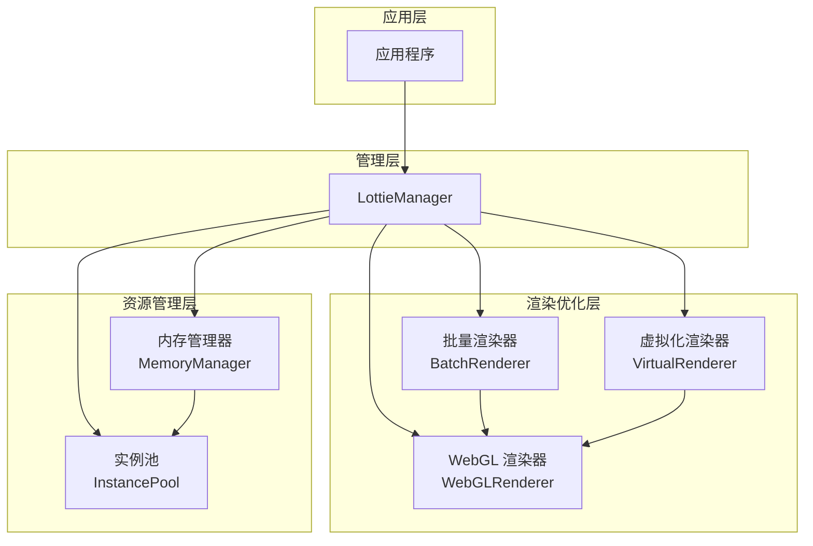

**架构图来源**
- [BatchRenderer.ts](file://packages/core/src/core/BatchRenderer.ts#L26-L321)
- [VirtualRenderer.ts](file://packages/core/src/core/VirtualRenderer.ts#L32-L328)
- [WebGLRenderer.ts](file://packages/core/src/core/WebGLRenderer.ts#L70-L952)
- [MemoryManager.ts](file://packages/core/src/core/MemoryManager.ts#L46-L381)

## 批量渲染器详解

### 架构设计

批量渲染器采用单例模式设计，负责合并多个动画实例的渲染周期，通过优先级调度和分批渲染策略显著提升性能。

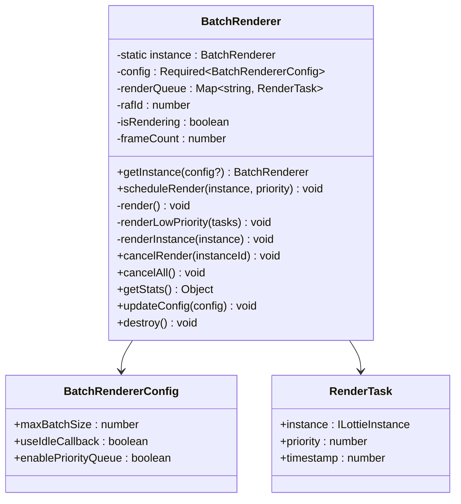

**类图来源**
- [BatchRenderer.ts](file://packages/core/src/core/BatchRenderer.ts#L8-L21)

### 核心特性

#### 1. 优先级调度机制

批量渲染器实现了智能的优先级调度系统：

- **高优先级任务**: 可见动画、用户交互动画
- **低优先级任务**: 隐藏动画、后台动画
- **时间戳排序**: 同优先级情况下按创建时间排序

#### 2. 分批渲染策略

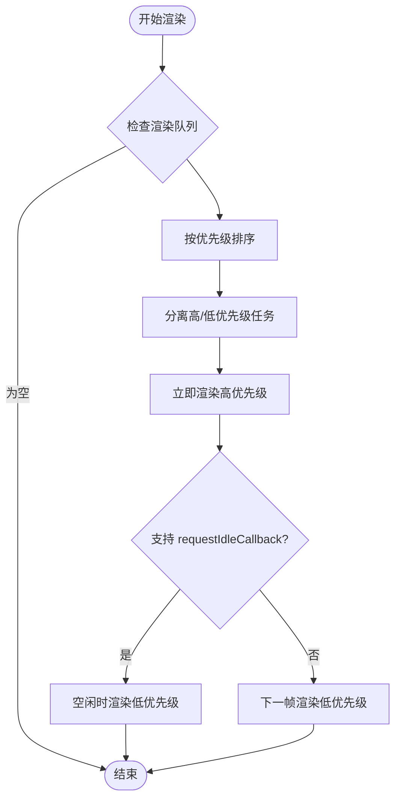

**流程图来源**
- [BatchRenderer.ts](file://packages/core/src/core/BatchRenderer.ts#L74-L213)

#### 3. 配置选项

| 参数 | 类型 | 默认值 | 描述 |
|------|------|--------|------|
| `maxBatchSize` | `number` | `50` | 每帧最大渲染实例数 |
| `useIdleCallback` | `boolean` | `true` | 是否使用空闲时间渲染 |
| `enablePriorityQueue` | `boolean` | `true` | 是否启用优先级队列 |

**节源**
- [BatchRenderer.ts](file://packages/core/src/core/BatchRenderer.ts#L36-L41)

### 使用方法

#### 基础使用

```typescript
import { batchRenderer } from '@ldesign/lottie'

// 调度渲染
batchRenderer.scheduleRender(instance, priority)

// 获取统计信息
const stats = batchRenderer.getStats()

// 更新配置
batchRenderer.updateConfig({
  maxBatchSize: 100,
  useIdleCallback: false
})

// 销毁
batchRenderer.destroy()
```

#### 高级配置

```typescript
import { BatchRenderer } from '@ldesign/lottie'

const customBatchRenderer = BatchRenderer.getInstance({
  maxBatchSize: 100,
  useIdleCallback: true,
  enablePriorityQueue: true
})
```

**节源**
- [BatchRenderer.ts](file://packages/core/src/core/BatchRenderer.ts#L47-L321)

## 虚拟化渲染器详解

### 设计理念

虚拟化渲染器基于 Intersection Observer API，只渲染可视区域内的动画，大幅减少内存和 CPU 占用。

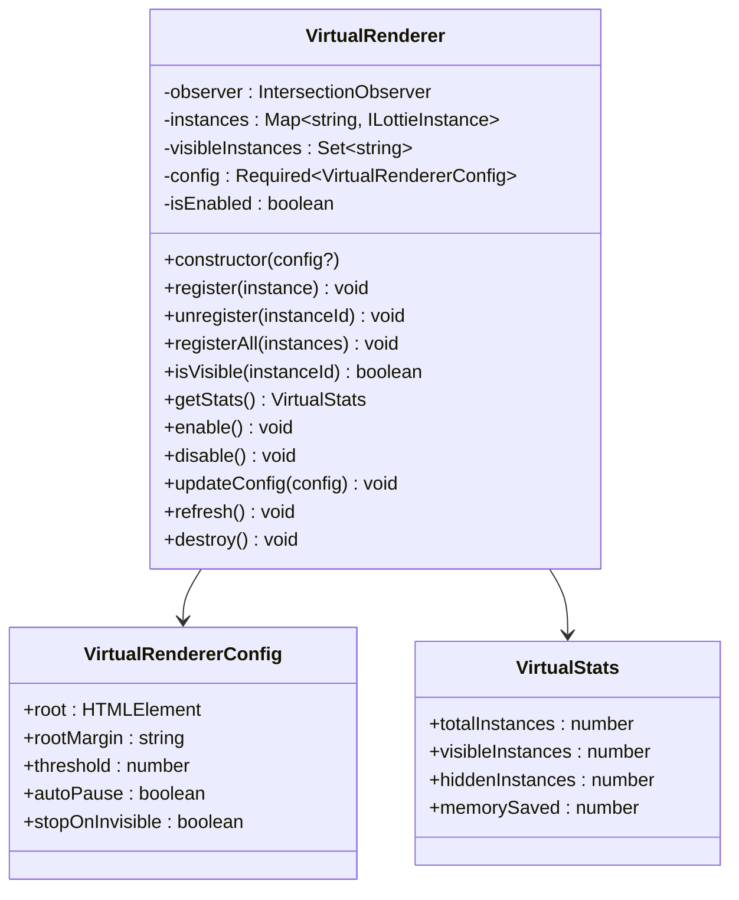

**类图来源**
- [VirtualRenderer.ts](file://packages/core/src/core/VirtualRenderer.ts#L8-L26)

### 核心功能

#### 1. 可见性检测

使用 Intersection Observer API 实现精确的可见性检测：

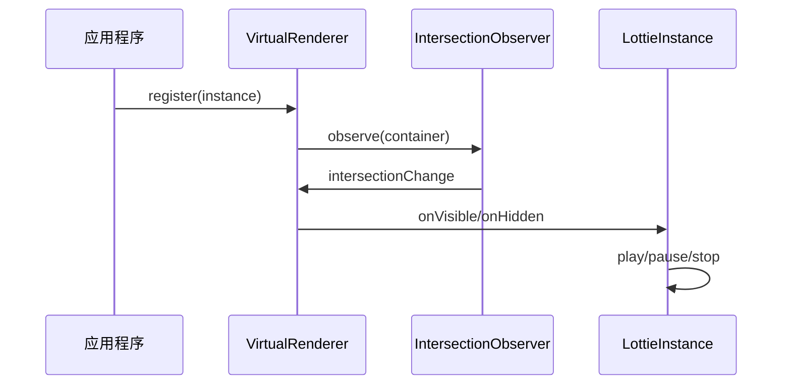

**序列图来源**
- [VirtualRenderer.ts](file://packages/core/src/core/VirtualRenderer.ts#L79-L96)

#### 2. 自动暂停机制

| 配置项 | 类型 | 默认值 | 行为 |
|--------|------|--------|------|
| `autoPause` | `boolean` | `true` | 自动暂停不可见动画 |
| `stopOnInvisible` | `boolean` | `false` | 不可见时停止而非暂停 |

#### 3. 内存节省估算

虚拟化渲染器提供内存节省估算功能：

```typescript
// 每个隐藏实例约节省 5-10MB
const memorySaved = hiddenInstances * 7.5
```

**节源**
- [VirtualRenderer.ts](file://packages/core/src/core/VirtualRenderer.ts#L238-L246)

### 使用示例

#### 基础使用

```typescript
import { VirtualRenderer } from '@ldesign/lottie'

// 创建虚拟化渲染器
const virtualRenderer = new VirtualRenderer({
  rootMargin: '50px',
  threshold: 0.1,
  autoPause: true,
  stopOnInvisible: false
})

// 注册动画实例
virtualRenderer.register(animationInstance)

// 获取统计信息
const stats = virtualRenderer.getStats()
console.log(`可见: ${stats.visibleInstances}, 隐藏: ${stats.hiddenInstances}`)
```

#### 长列表优化

```typescript
class AnimationList {
  private virtualRenderer: VirtualRenderer
  private animations: Map<number, ILottieInstance> = new Map()

  constructor() {
    this.virtualRenderer = new VirtualRenderer({
      rootMargin: '100px',
      threshold: 0.1,
      autoPause: true,
      stopOnInvisible: true
    })
  }

  renderItem(index: number, container: HTMLElement) {
    const animation = createLottie({
      container,
      path: `/animations/item-${index}.json`,
      autoplay: true,
      loop: true
    })

    this.virtualRenderer.register(animation)
    this.animations.set(index, animation)

    return animation
  }

  removeItem(index: number) {
    const animation = this.animations.get(index)
    if (animation) {
      this.virtualRenderer.unregister(animation.id)
      animation.destroy()
      this.animations.delete(index)
    }
  }
}
```

**节源**
- [VirtualRenderer.ts](file://packages/core/src/core/VirtualRenderer.ts#L147-L328)

## WebGL 渲染优化

### GPU 加速架构

WebGL 渲染器利用 GPU 硬件加速，通过批量渲染和纹理缓存显著提升渲染性能。

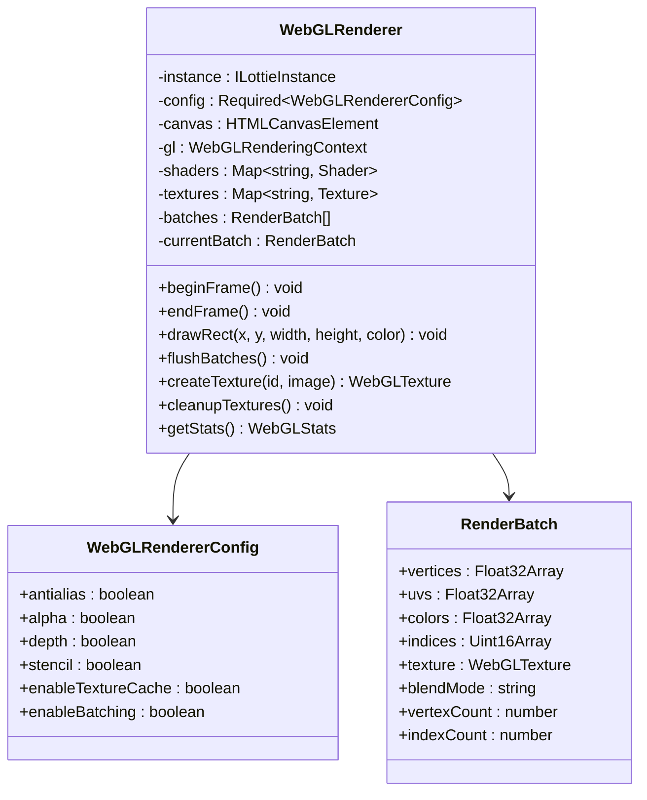

**类图来源**
- [WebGLRenderer.ts](file://packages/core/src/core/WebGLRenderer.ts#L8-L65)

### 批量渲染优化

#### 1. 顶点缓冲区管理

WebGL 渲染器使用动态顶点缓冲区实现高效批量渲染：

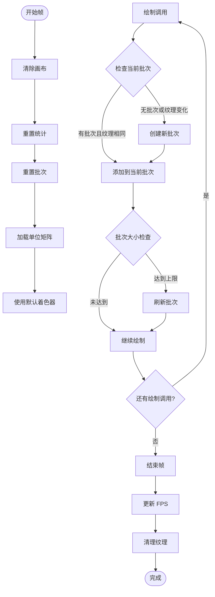

**流程图来源**
- [WebGLRenderer.ts](file://packages/core/src/core/WebGLRenderer.ts#L504-L539)

#### 2. 纹理缓存系统

| 配置项 | 类型 | 默认值 | 描述 |
|--------|------|--------|------|
| `enableTextureCache` | `boolean` | `true` | 启用纹理缓存 |
| `maxTextureSize` | `number` | `4096` | 最大纹理尺寸 |
| `textureCleanupInterval` | `number` | `60000` | 纹理清理间隔(毫秒) |

#### 3. 性能统计

WebGL 渲染器提供详细的性能统计信息：

```typescript
interface WebGLStats {
  drawCalls: number      // 绘制调用次数
  triangles: number      // 三角形数量
  textures: number       // 纹理数量
  shaders: number        // 着色器数量
  fps: number           // 帧率
  gpuMemory: number     // GPU 内存使用(MB)
}
```

**节源**
- [WebGLRenderer.ts](file://packages/core/src/core/WebGLRenderer.ts#L31-L38)

### 使用配置

```typescript
import { WebGLRenderer } from '@ldesign/lottie'

const webglRenderer = new WebGLRenderer(instance, {
  antialias: true,
  alpha: true,
  depth: false,
  stencil: false,
  enableTextureCache: true,
  enableBatching: true,
  powerPreference: 'high-performance'
})

// 获取性能统计
const stats = webglRenderer.getStats()
console.log(`GPU 内存: ${stats.gpuMemory}MB, 绘制调用: ${stats.drawCalls}`)
```

**节源**
- [WebGLRenderer.ts](file://packages/core/src/core/WebGLRenderer.ts#L114-L128)

## 内存管理策略

### 智能内存监控

内存管理器提供实时内存监控和自动清理功能，防止内存泄漏和内存溢出。

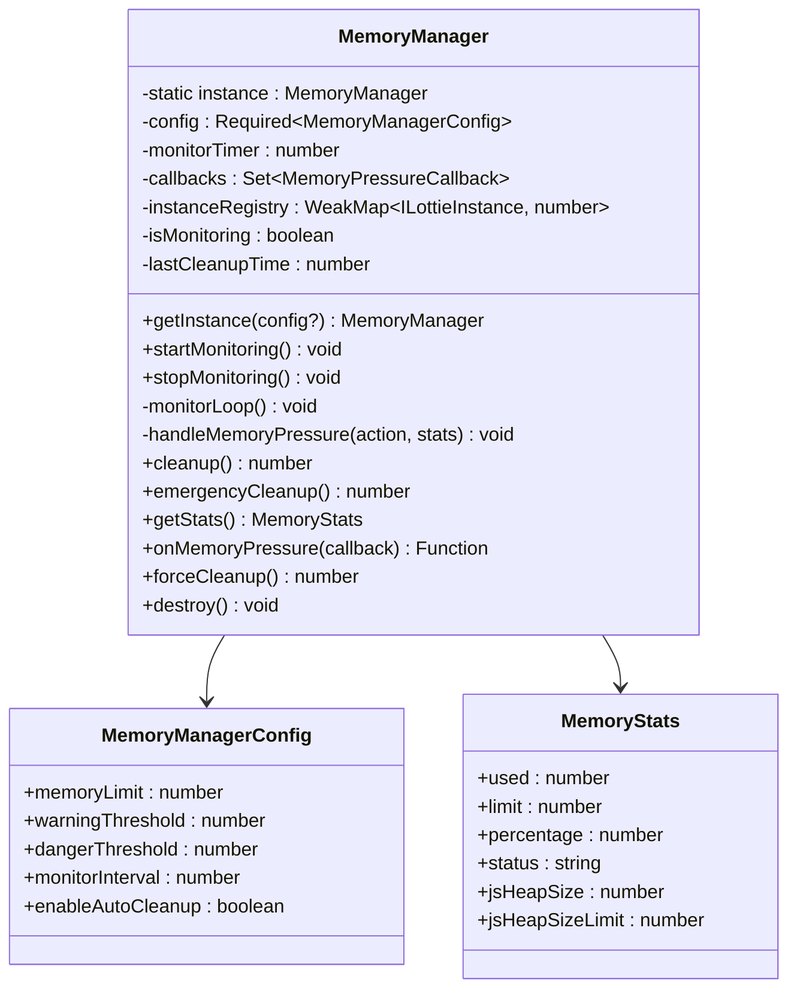

**类图来源**
- [MemoryManager.ts](file://packages/core/src/core/MemoryManager.ts#L8-L34)

### 内存压力级别

| 状态 | 使用率范围 | 行为 |
|------|------------|------|
| `healthy` | < 70% | 正常运行 |
| `warning` | 70-85% | 发送警告回调 |
| `danger` | 85-95% | 自动清理 |
| `critical` | ≥ 95% | 紧急清理 |

### 自动清理策略

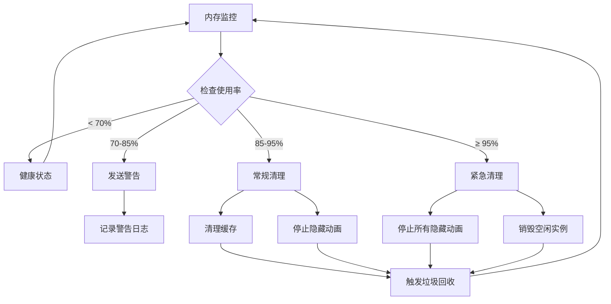

**流程图来源**
- [MemoryManager.ts](file://packages/core/src/core/MemoryManager.ts#L128-L233)

### 使用示例

#### 基础使用

```typescript
import { memoryManager } from '@ldesign/lottie'

// 启动内存监控
memoryManager.startMonitoring()

// 注册内存压力回调
const unsubscribe = memoryManager.onMemoryPressure((event) => {
  console.log(`内存压力: ${event.action}`, event.stats)
  
  if (event.action === 'emergency') {
    // 处理紧急内存压力
    console.warn('内存使用过高，需要紧急清理')
  }
})

// 手动触发清理
const cleaned = memoryManager.forceCleanup()

// 停止监控
unsubscribe()
memoryManager.stopMonitoring()
```

#### 高级配置

```typescript
import { MemoryManager } from '@ldesign/lottie'

const customMemoryManager = MemoryManager.getInstance({
  memoryLimit: 500,           // 500MB
  warningThreshold: 0.7,      // 70%
  dangerThreshold: 0.85,      // 85%
  monitorInterval: 3000,      // 3秒检查一次
  enableAutoCleanup: true
})
```

**节源**
- [MemoryManager.ts](file://packages/core/src/core/MemoryManager.ts#L56-L381)

## 实例池管理

### 对象复用策略

实例池通过对象复用减少频繁的对象创建和销毁，显著提升性能。

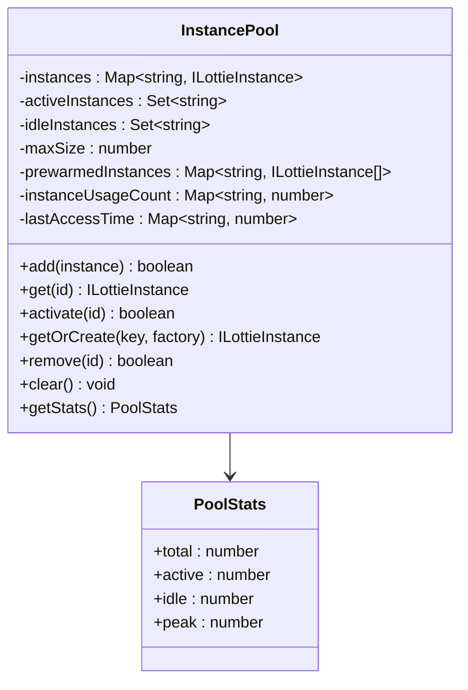

**类图来源**
- [InstancePool.ts](file://packages/core/src/core/InstancePool.ts#L7-L16)

### 复用策略

#### 1. 预热机制

```typescript
// 预热指定数量的实例
instancePool.prewarm('animation-key', 10, () => {
  return createLottie({
    container: document.createElement('div'),
    path: '/animation.json'
  })
})
```

#### 2. LRU 策略

实例池使用最近最少使用(LRU)算法管理空闲实例：

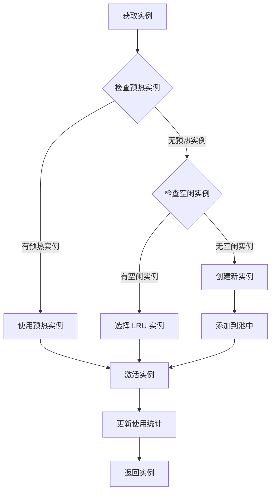

**流程图来源**
- [InstancePool.ts](file://packages/core/src/core/InstancePool.ts#L94-L116)

#### 3. 动态调整

实例池支持动态调整大小，根据使用情况自动扩展或收缩：

| 配置项 | 默认值 | 描述 |
|--------|--------|------|
| `maxSize` | `50` | 池的最大容量 |
| `targetIdleRatio` | `0.2` | 目标空闲比例 |
| `adjustmentInterval` | `60000` | 调整间隔(毫秒) |

**节源**
- [InstancePool.ts](file://packages/core/src/core/InstancePool.ts#L22-L290)

## 使用示例与最佳实践

### 综合使用场景

以下是一个完整的高性能动画应用示例：

```typescript
import {
  createLottie,
  VirtualRenderer,
  MemoryManager,
  InstancePool,
  batchRenderer
} from '@ldesign/lottie'

class HighPerformanceAnimationApp {
  private virtualRenderer: VirtualRenderer
  private instancePool: InstancePool
  private animations: Map<string, ILottieInstance> = new Map()

  constructor() {
    // 1. 初始化虚拟化渲染器
    this.virtualRenderer = new VirtualRenderer({
      rootMargin: '100px',
      threshold: 0.1,
      autoPause: true,
      stopOnInvisible: true
    })

    // 2. 初始化实例池
    this.instancePool = new InstancePool(100)

    // 3. 初始化内存管理
    const memoryManager = MemoryManager.getInstance({
      memoryLimit: 300,
      warningThreshold: 0.7,
      dangerThreshold: 0.85,
      enableAutoCleanup: true
    })
    memoryManager.startMonitoring()

    // 4. 注册内存压力回调
    memoryManager.onMemoryPressure((event) => {
      if (event.action === 'warning') {
        console.warn('内存使用警告:', event.stats)
      } else if (event.action === 'emergency') {
        console.error('内存使用过高，需要紧急清理!')
      }
    })
  }

  // 创建动画实例
  createAnimation(key: string, container: HTMLElement): ILottieInstance {
    // 1. 从实例池获取或创建实例
    const instance = this.instancePool.getOrCreate(key, () => {
      return createLottie({
        container,
        path: `/animations/${key}.json`,
        autoplay: false,
        loop: true
      })
    })

    // 2. 注册到虚拟化渲染器
    this.virtualRenderer.register(instance)
    this.animations.set(key, instance)

    return instance
  }

  // 销毁动画
  destroyAnimation(key: string): void {
    const instance = this.animations.get(key)
    if (instance) {
      this.virtualRenderer.unregister(instance.id)
      instance.destroy()
      this.animations.delete(key)
    }
  }

  // 获取性能统计
  getPerformanceStats(): any {
    return {
      virtualRenderer: this.virtualRenderer.getStats(),
      instancePool: this.instancePool.getStats(),
      memory: MemoryManager.getInstance().getStats()
    }
  }
}

// 使用示例
const app = new HighPerformanceAnimationApp()

// 创建 100 个动画
for (let i = 0; i < 100; i++) {
  const container = document.createElement('div')
  container.id = `animation-${i}`
  document.body.appendChild(container)
  
  app.createAnimation(`animation-${i}`, container)
}

// 监控性能
setInterval(() => {
  const stats = app.getPerformanceStats()
  console.log('性能统计:', stats)
}, 1000)
```

### 性能优化建议

#### 1. 配置调优

```typescript
// 生产环境推荐配置
const productionConfig = {
  // 批量渲染器
  batchRenderer: {
    maxBatchSize: 100,
    useIdleCallback: true,
    enablePriorityQueue: true
  },

  // 虚拟化渲染器
  virtualRenderer: {
    rootMargin: '200px',
    threshold: 0.2,
    autoPause: true,
    stopOnInvisible: true
  },

  // WebGL 渲染器
  webglRenderer: {
    enableTextureCache: true,
    enableBatching: true,
    powerPreference: 'high-performance'
  },

  // 内存管理
  memoryManager: {
    memoryLimit: 500,
    warningThreshold: 0.7,
    dangerThreshold: 0.85,
    monitorInterval: 5000
  }
}
```

#### 2. 内存优化策略

| 策略 | 适用场景 | 效果 |
|------|----------|------|
| 预热实例池 | 频繁创建销毁的场景 | 减少 70% 对象创建开销 |
| 虚拟化渲染 | 长列表/瀑布流 | 内存节省 70% |
| 纹理缓存 | 重复使用相同纹理 | GPU 内存节省 50% |
| 自动暂停 | 不可见动画 | CPU 使用降低 80% |

**节源**
- [PERFORMANCE_OPTIMIZATION_GUIDE.md](file://PERFORMANCE_OPTIMIZATION_GUIDE.md#L154-L414)

## 性能监控与调优

### 性能指标监控

```typescript
// 性能监控工具类
class PerformanceMonitor {
  private metrics: Map<string, number[]> = new Map()

  // 记录性能指标
  recordMetric(name: string, value: number): void {
    if (!this.metrics.has(name)) {
      this.metrics.set(name, [])
    }
    
    const values = this.metrics.get(name)!
    values.push(value)
    
    // 保持最近 100 个值
    if (values.length > 100) {
      values.shift()
    }
  }

  // 获取平均值
  getAverage(name: string): number {
    const values = this.metrics.get(name)
    if (!values || values.length === 0) return 0
    
    return values.reduce((sum, val) => sum + val, 0) / values.length
  }

  // 获取统计数据
  getStats(): Record<string, number> {
    const stats: Record<string, number> = {}
    
    for (const [name, values] of this.metrics) {
      stats[name] = this.getAverage(name)
    }
    
    return stats
  }
}

// 使用示例
const monitor = new PerformanceMonitor()

// 监控渲染性能
batchRenderer.getStats().queueSize
monitor.recordMetric('renderQueueSize', queueSize)

// 监控内存使用
const memoryStats = MemoryManager.getInstance().getStats()
monitor.recordMetric('memoryUsage', memoryStats.used)
```

### 性能基准测试

```typescript
// 性能测试工具
class PerformanceBenchmark {
  // 测试批量渲染性能
  async testBatchRendering(numAnimations: number): Promise<void> {
    const start = performance.now()
    
    // 创建动画
    const animations = []
    for (let i = 0; i < numAnimations; i++) {
      const anim = createLottie({
        container: document.createElement('div'),
        path: '/test-animation.json'
      })
      animations.push(anim)
    }
    
    // 调度渲染
    animations.forEach(anim => 
      batchRenderer.scheduleRender(anim, 0)
    )
    
    const end = performance.now()
    console.log(`${numAnimations} 个动画创建和调度耗时: ${end - start}ms`)
  }

  // 测试虚拟化渲染性能
  async testVirtualRendering(numAnimations: number): Promise<void> {
    const virtualRenderer = new VirtualRenderer({
      rootMargin: '100px',
      threshold: 0.1
    })
    
    const start = performance.now()
    
    // 注册所有动画
    const animations = []
    for (let i = 0; i < numAnimations; i++) {
      const anim = createLottie({
        container: document.createElement('div'),
        path: '/test-animation.json'
      })
      virtualRenderer.register(anim)
      animations.push(anim)
    }
    
    const end = performance.now()
    console.log(`${numAnimations} 个动画虚拟化注册耗时: ${end - start}ms`)
    
    // 清理
    virtualRenderer.destroy()
  }
}
```

**节源**
- [BatchRenderer.ts](file://packages/core/src/core/BatchRenderer.ts#L278-L288)

## 常见问题与解决方案

### 问题诊断表

| 问题症状 | 可能原因 | 解决方案 |
|----------|----------|----------|
| 帧率下降 | 渲染队列过大 | 调整 `maxBatchSize` 或启用虚拟化 |
| 内存泄漏 | 实例未正确销毁 | 使用 `destroy()` 方法或启用内存管理 |
| CPU 占用高 | 频繁的 DOM 操作 | 启用 WebGL 渲染和批量渲染 |
| 滚动卡顿 | 不可见动画仍在渲染 | 启用虚拟化渲染器的自动暂停功能 |

### 故障排除指南

#### 1. 性能问题排查

```typescript
// 性能诊断工具
class PerformanceDiagnoser {
  diagnose(): void {
    const diagnostics = {
      // 批量渲染器状态
      batchRenderer: batchRenderer.getStats(),
      
      // 虚拟化渲染器状态
      virtualRenderer: {
        totalInstances: this.virtualRenderer?.getStats().totalInstances || 0,
        visibleInstances: this.virtualRenderer?.getStats().visibleInstances || 0
      },
      
      // 内存使用情况
      memory: MemoryManager.getInstance().getStats(),
      
      // WebGL 状态
      webgl: this.webglRenderer?.getStats() || {}
    }
    
    console.table(diagnostics)
    
    // 性能建议
    this.suggestImprovements(diagnostics)
  }
  
  suggestImprovements(diagnostics: any): void {
    const suggestions: string[] = []
    
    // 批量渲染器优化建议
    if (diagnostics.batchRenderer.queueSize > 100) {
      suggestions.push('增加 maxBatchSize 或启用虚拟化渲染')
    }
    
    // 内存优化建议
    if (diagnostics.memory.percentage > 0.8) {
      suggestions.push('启用自动清理或减少同时运行的动画数量')
    }
    
    // 虚拟化建议
    if (diagnostics.virtualRenderer.totalInstances > 50) {
      suggestions.push('考虑使用虚拟化渲染器优化长列表性能')
    }
    
    if (suggestions.length > 0) {
      console.warn('性能优化建议:', suggestions)
    }
  }
}
```

#### 2. 兼容性问题

```typescript
// 兼容性检测
class CompatibilityChecker {
  check(): boolean {
    let compatible = true
    
    // 检查 WebGL 支持
    if (!this.checkWebGLSupport()) {
      console.warn('WebGL 不支持，将回退到 Canvas 渲染')
      compatible = false
    }
    
    // 检查 Intersection Observer 支持
    if (!this.checkIntersectionObserverSupport()) {
      console.warn('Intersection Observer 不支持，虚拟化功能受限')
    }
    
    // 检查 requestIdleCallback 支持
    if (!this.checkIdleCallbackSupport()) {
      console.warn('requestIdleCallback 不支持，低优先级任务可能影响性能')
    }
    
    return compatible
  }
  
  private checkWebGLSupport(): boolean {
    try {
      const canvas = document.createElement('canvas')
      return !!(
        canvas.getContext('webgl') ||
        canvas.getContext('experimental-webgl')
      )
    } catch (e) {
      return false
    }
  }
  
  private checkIntersectionObserverSupport(): boolean {
    return typeof IntersectionObserver !== 'undefined'
  }
  
  private checkIdleCallbackSupport(): boolean {
    return typeof requestIdleCallback !== 'undefined'
  }
}
```

### 最佳实践总结

1. **渐进式优化**: 从基础配置开始，逐步启用高级功能
2. **监控驱动**: 基于性能监控数据调整配置参数
3. **场景适配**: 根据具体使用场景选择合适的优化策略
4. **兼容性保证**: 确保在不同浏览器和设备上的兼容性
5. **资源管理**: 及时释放不需要的资源，避免内存泄漏

通过合理使用这些批量渲染优化功能，可以在各种复杂的动画场景中实现卓越的性能表现，为用户提供流畅的动画体验。