# 智能内存管理

<cite>
**本文档引用的文件**
- [MemoryManager.ts](file://packages/core/src/core/MemoryManager.ts)
- [ResourceCompressor.ts](file://packages/core/src/core/ResourceCompressor.ts)
- [InstancePool.ts](file://packages/core/src/core/InstancePool.ts)
- [CacheManager.ts](file://packages/core/src/core/CacheManager.ts)
- [LottieManager.ts](file://packages/core/src/core/LottieManager.ts)
- [AIOptimizer.ts](file://packages/core/src/core/AIOptimizer.ts)
- [PERFORMANCE_OPTIMIZATION_GUIDE.md](file://PERFORMANCE_OPTIMIZATION_GUIDE.md)
- [USAGE_GUIDE.md](file://USAGE_GUIDE.md)
- [OPTIMIZATION_ANALYSIS.md](file://OPTIMIZATION_ANALYSIS.md)
- [OPTIMIZATION_SUMMARY.md](file://OPTIMIZATION_SUMMARY.md)
</cite>

## 目录
1. [简介](#简介)
2. [核心架构](#核心架构)
3. [MemoryManager 智能内存管理器](#memorymanager-智能内存管理器)
4. [ResourceCompressor 资源压缩器](#resourcecompressor-资源压缩器)
5. [InstancePool 实例池](#instancepool-实例池)
6. [CacheManager 缓存管理器](#cachemanager-缓存管理器)
7. [LottieManager 全局管理器](#lottiemanager-全局管理器)
8. [AI 性能优化器](#ai-性能优化器)
9. [内存监控与诊断](#内存监控与诊断)
10. [最佳实践](#最佳实践)
11. [故障排除](#故障排除)
12. [总结](#总结)

## 简介

Lottie 动画库的智能内存管理系统是一个多层次的内存优化解决方案，旨在确保在各种设备和场景下都能提供流畅的动画体验。该系统包含五个核心组件：智能内存管理器（MemoryManager）、资源压缩器（ResourceCompressor）、实例池（InstancePool）、缓存管理器（CacheManager）和全局管理器（LottieManager）。这些组件协同工作，实现了自动化的内存监控、智能压缩、对象复用和性能优化。

## 核心架构

智能内存管理系统采用分层架构设计，每一层都有特定的职责和优化策略：

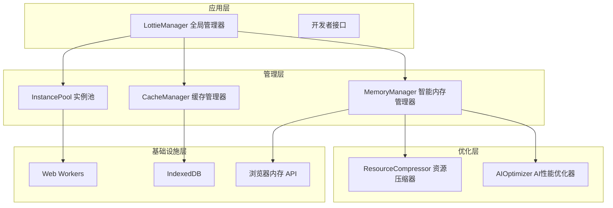

**图表来源**
- [LottieManager.ts](file://packages/core/src/core/LottieManager.ts#L16-L504)
- [MemoryManager.ts](file://packages/core/src/core/MemoryManager.ts#L46-L380)

## MemoryManager 智能内存管理器

MemoryManager 是整个内存管理系统的核心大脑，负责实时监控内存使用情况、检测内存压力并执行自动清理操作。

### 核心功能

#### 内存监控与压力检测
MemoryManager 通过多级阈值系统监控内存使用：

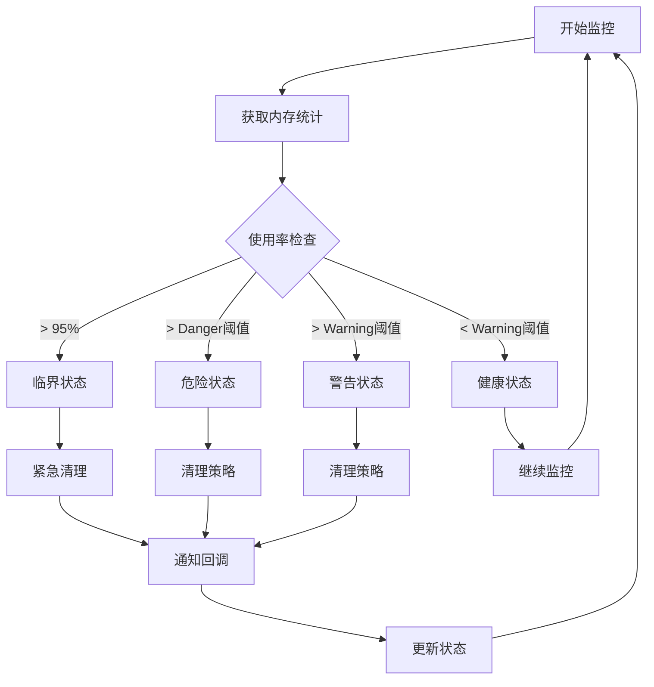

**图表来源**
- [MemoryManager.ts](file://packages/core/src/core/MemoryManager.ts#L105-L148)

#### 配置参数

| 参数 | 类型 | 默认值 | 描述 |
|------|------|--------|------|
| memoryLimit | number | 200 | 内存限制（MB） |
| warningThreshold | number | 0.7 | 警告阈值（0-1） |
| dangerThreshold | number | 0.85 | 危险阈值（0-1） |
| monitorInterval | number | 5000 | 监控间隔（ms） |
| enableAutoCleanup | boolean | true | 启用自动清理 |

#### 内存状态管理

MemoryManager 提供了完整的内存状态管理功能：

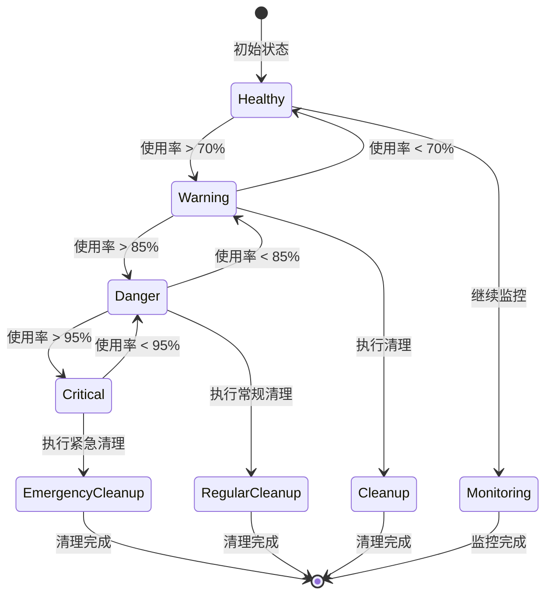

**图表来源**
- [MemoryManager.ts](file://packages/core/src/core/MemoryManager.ts#L291-L308)

**章节来源**
- [MemoryManager.ts](file://packages/core/src/core/MemoryManager.ts#L1-L380)

## ResourceCompressor 资源压缩器

ResourceCompressor 专门负责优化 Lottie 动画数据，通过多种压缩技术显著减少文件大小和内存占用。

### 压缩算法

#### 路径数据压缩
使用 Douglas-Peucker 算法简化复杂路径：

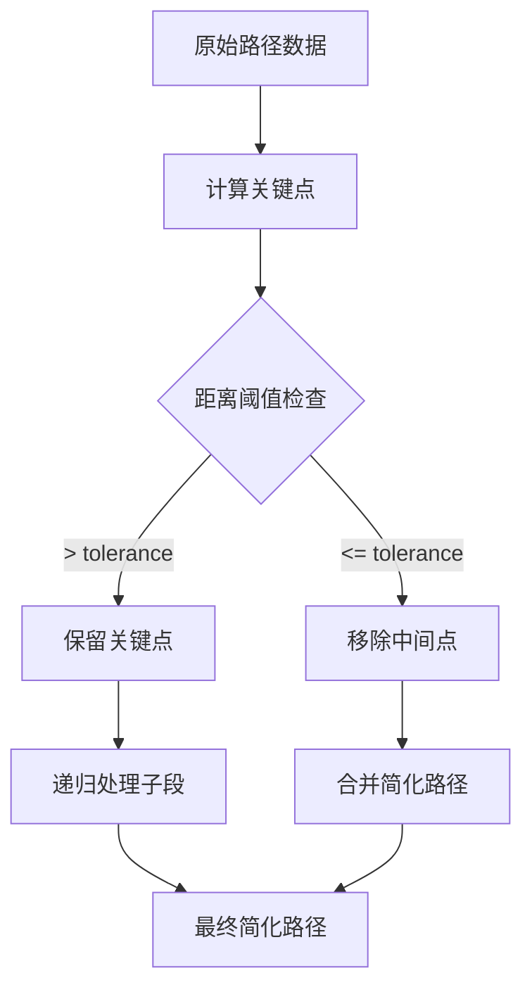

**图表来源**
- [ResourceCompressor.ts](file://packages/core/src/core/ResourceCompressor.ts#L276-L342)

#### 多种压缩策略

| 压缩类型 | 描述 | 效果 | 适用场景 |
|----------|------|------|----------|
| 路径压缩 | Douglas-Peucker 算法简化 | 减少 30-70% | 复杂形状动画 |
| 冗余数据移除 | 移除默认值和空数据 | 减少 5-20% | 包含大量默认值的动画 |
| 颜色压缩 | 降低颜色精度 | 减少 2-10% | 彩色丰富的动画 |
| 隐藏图层移除 | 移除不可见图层 | 减少 10-50% | 复杂层次结构 |
| 图片资源优化 | WebP 转换和质量调整 | 减少 20-80% | 包含图片资源的动画 |

### 压缩流程

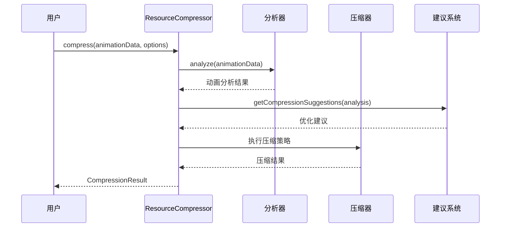

**图表来源**
- [ResourceCompressor.ts](file://packages/core/src/core/ResourceCompressor.ts#L49-L104)

**章节来源**
- [ResourceCompressor.ts](file://packages/core/src/core/ResourceCompressor.ts#L1-L448)

## InstancePool 实例池

InstancePool 实现了智能的对象复用机制，通过预热、复用和动态调整策略最大化内存效率。

### 池管理策略

#### 预热机制
实例池支持预热功能，提前创建和初始化常用实例：

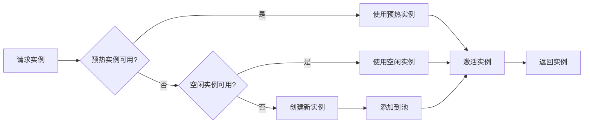

**图表来源**
- [InstancePool.ts](file://packages/core/src/core/InstancePool.ts#L94-L115)

#### 动态调整算法

实例池使用 LRU（最近最少使用）策略进行动态调整：

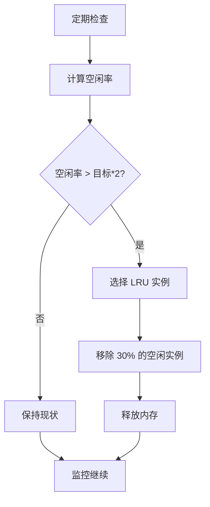

**图表来源**
- [InstancePool.ts](file://packages/core/src/core/InstancePool.ts#L141-L166)

### 池统计信息

| 统计指标 | 描述 | 用途 |
|----------|------|------|
| total | 总实例数 | 监控池大小 |
| active | 活跃实例数 | 性能监控 |
| idle | 空闲实例数 | 复用效率 |
| peak | 峰值实例数 | 容量规划 |

**章节来源**
- [InstancePool.ts](file://packages/core/src/core/InstancePool.ts#L1-L311)

## CacheManager 缓存管理器

CacheManager 实现了高性能的 LRU 缓存系统，支持 IndexedDB 持久化和智能压缩。

### 缓存架构

#### LRU 算法实现

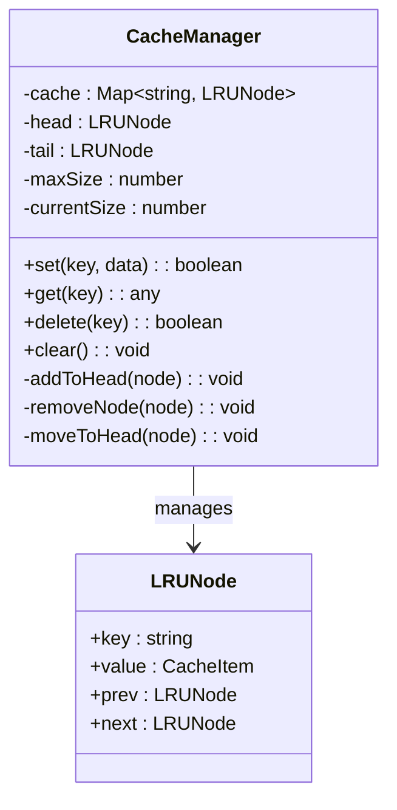

**图表来源**
- [CacheManager.ts](file://packages/core/src/core/CacheManager.ts#L6-L16)
- [CacheManager.ts](file://packages/core/src/core/CacheManager.ts#L21-L502)

#### IndexedDB 持久化

CacheManager 支持 IndexedDB 持久化存储：

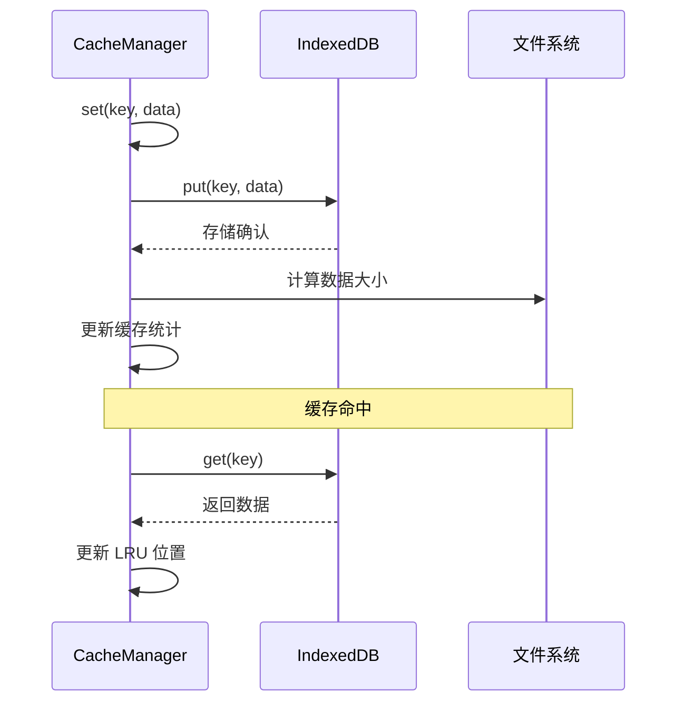

**图表来源**
- [CacheManager.ts](file://packages/core/src/core/CacheManager.ts#L299-L316)

### 压缩与优化

CacheManager 内置了数据压缩功能：

| 压缩方式 | 适用场景 | 压缩率 | 性能影响 |
|----------|----------|--------|----------|
| GZIP 压缩 | 大量文本数据 | 60-80% | 轻微 CPU 开销 |
| Base64 优化 | 图片资源 | 20-30% | 显著减小传输 |
| 对象序列化优化 | 复杂对象 | 10-25% | 中等 CPU 开销 |

**章节来源**
- [CacheManager.ts](file://packages/core/src/core/CacheManager.ts#L1-L502)

## LottieManager 全局管理器

LottieManager 是整个系统的协调中心，整合了所有内存管理组件，提供了统一的 API 接口。

### 管理器职责

#### 实例生命周期管理

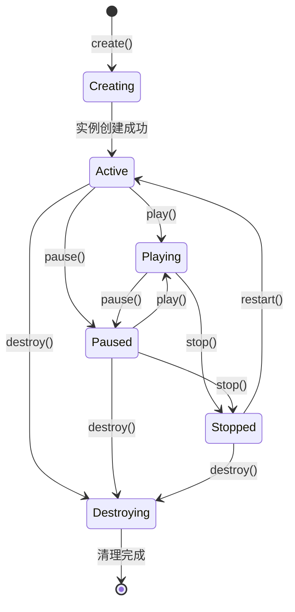

**图表来源**
- [LottieManager.ts](file://packages/core/src/core/LottieManager.ts#L109-L225)

#### 自动优化策略

LottieManager 实现了多层次的自动优化：

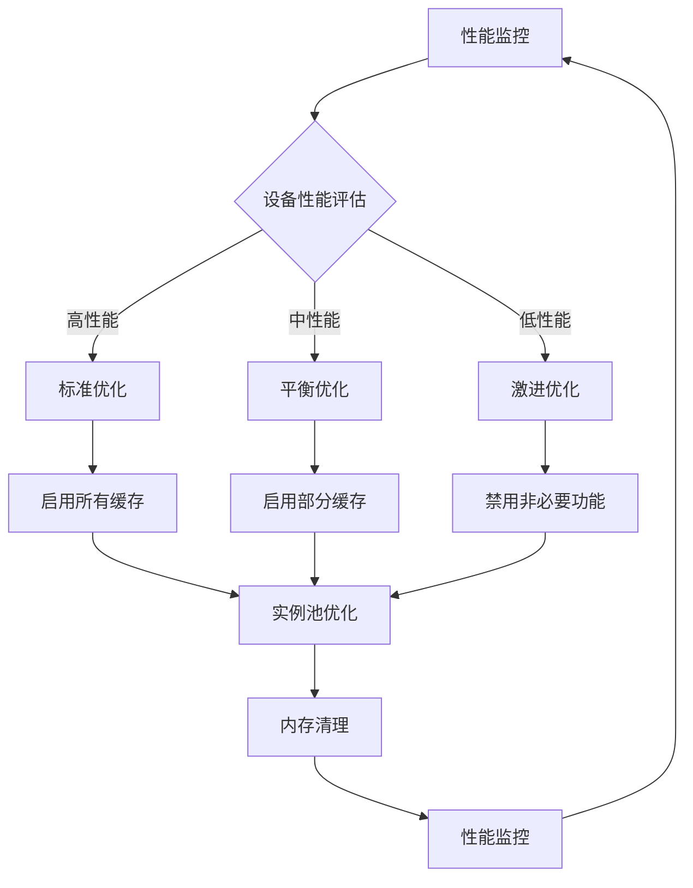

**图表来源**
- [LottieManager.ts](file://packages/core/src/core/LottieManager.ts#L465-L499)

### 配置管理

| 配置项 | 默认值 | 描述 |
|--------|--------|------|
| maxInstances | 100 | 最大实例数量 |
| poolSize | 50 | 实例池大小 |
| cache.enabled | true | 启用缓存 |
| cache.maxSize | 50MB | 缓存最大大小 |
| cache.ttl | 3600000ms | 缓存过期时间 |

**章节来源**
- [LottieManager.ts](file://packages/core/src/core/LottieManager.ts#L1-L504)

## AI 性能优化器

AIOptimizer 是一个基于机器学习的性能监控和优化系统，能够自动检测性能异常并提供优化建议。

### 性能异常检测

#### 内存泄漏检测算法

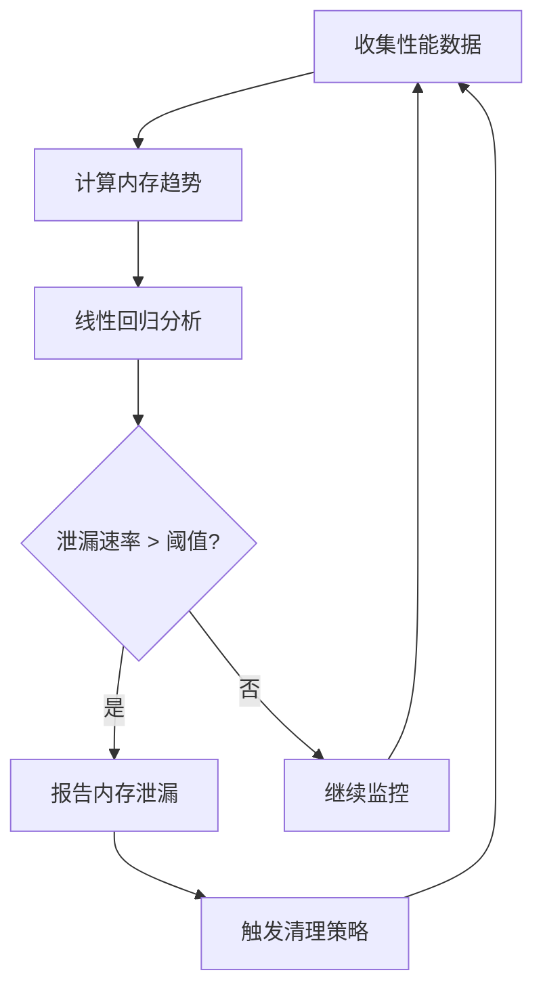

**图表来源**
- [AIOptimizer.ts](file://packages/core/src/core/AIOptimizer.ts#L391-L409)

#### 性能预测模型

AI 优化器使用历史数据分析来预测未来的性能趋势：

| 检测指标 | 正常范围 | 异常阈值 | 响应策略 |
|----------|----------|----------|----------|
| FPS 波动 | ±1σ | > 2σ | 降级渲染质量 |
| 内存增长率 | < 0.1MB/s | > 0.5MB/s | 立即清理 |
| CPU 使用率 | < 80% | > 95% | 限制并发实例 |
| 渲染时间 | < 16ms | > 33ms | 降低帧率 |

**章节来源**
- [AIOptimizer.ts](file://packages/core/src/core/AIOptimizer.ts#L283-L414)

## 内存监控与诊断

### 内存仪表板

系统提供了完整的内存监控界面：

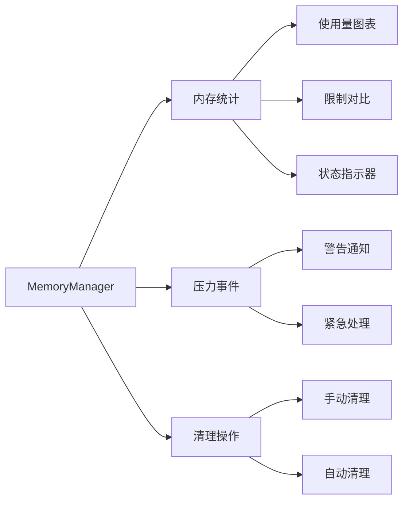

**图表来源**
- [PERFORMANCE_OPTIMIZATION_GUIDE.md](file://PERFORMANCE_OPTIMIZATION_GUIDE.md#L338-L414)

### 诊断工具

#### 内存泄漏检测

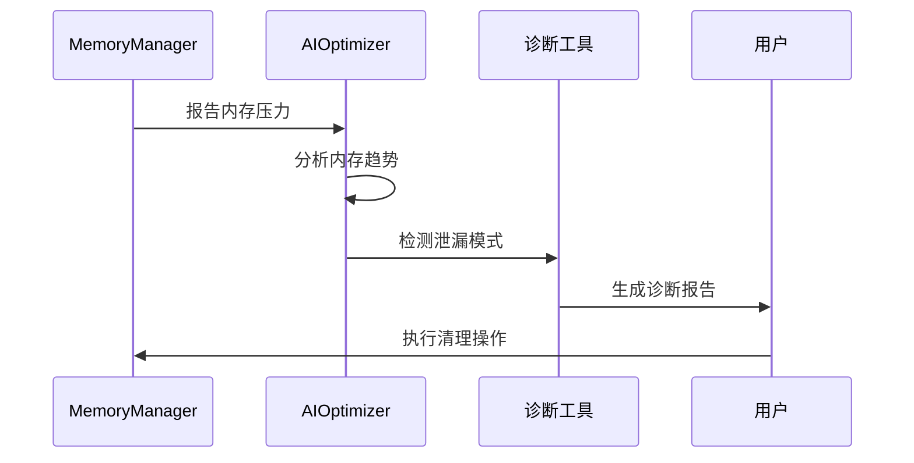

**图表来源**
- [AIOptimizer.ts](file://packages/core/src/core/AIOptimizer.ts#L323-L340)

**章节来源**
- [PERFORMANCE_OPTIMIZATION_GUIDE.md](file://PERFORMANCE_OPTIMIZATION_GUIDE.md#L338-L414)

## 最佳实践

### 开发阶段优化

#### 动画数据优化
1. **使用资源压缩器**：在发布前对动画数据进行压缩
2. **移除冗余图层**：清理不可见和无效的图层
3. **优化路径数据**：简化复杂的贝塞尔曲线
4. **压缩图片资源**：转换为 WebP 格式

#### 内存配置优化
```typescript
// 推荐的内存配置
const memoryConfig = {
  memoryLimit: 200,           // 200MB 内存限制
  warningThreshold: 0.7,      // 70% 警告阈值
  dangerThreshold: 0.85,      // 85% 危险阈值
  monitorInterval: 5000,      // 5秒监控间隔
  enableAutoCleanup: true     // 启用自动清理
};
```

### 运行时优化

#### 实例池配置
```typescript
// 优化的实例池配置
const poolConfig = {
  maxSize: 50,                // 50个实例
  targetIdleRatio: 0.2,       // 20% 目标空闲率
  enableDynamicAdjustment: true // 启用动态调整
};
```

#### 缓存策略
```typescript
// 智能缓存配置
const cacheConfig = {
  enabled: true,
  maxSize: 50,               // 50MB 缓存
  ttl: 3600000,              // 1小时过期
  enablePersistence: true    // 启用持久化
};
```

### 生产环境部署

#### 监控配置
```typescript
// 生产环境监控
const productionMonitor = {
  enablePerformanceMonitor: true,
  enableMemoryPressureDetection: true,
  logLevel: 'warn',
  reportInterval: 60000
};
```

## 故障排除

### 常见问题及解决方案

#### 内存泄漏问题

**症状**：内存使用持续增长，无法释放
**诊断步骤**：
1. 检查内存泄漏检测日志
2. 分析实例销毁流程
3. 验证事件监听器清理

**解决方案**：
```typescript
// 正确的实例销毁
animation.destroy();
// 确保移除所有事件监听器
animation.removeAllListeners();
```

#### 性能下降问题

**症状**：动画播放卡顿，FPS 降低
**诊断步骤**：
1. 检查内存使用率
2. 分析实例池状态
3. 监控缓存命中率

**解决方案**：
```typescript
// 性能优化配置
const optimizerConfig = {
  aggressiveMode: true,
  cleanupFrequency: 30000,
  memoryThreshold: 0.9
};
```

#### 缓存失效问题

**症状**：频繁的网络请求，缓存命中率低
**诊断步骤**：
1. 检查缓存键冲突
2. 验证缓存过期设置
3. 分析缓存大小限制

**解决方案**：
```typescript
// 缓存优化配置
const cacheOptimization = {
  enableCompression: true,
  compressionLevel: 6,
  cacheKeyStrategy: 'content-hash'
};
```

### 调试工具

#### 内存分析器
```typescript
// 内存使用分析
const memoryAnalysis = {
  totalMemory: memoryManager.getStats().used,
  instanceCount: lottieManager.getPoolStats().total,
  cacheHitRate: lottieManager.getCacheStats().hitRate,
  performanceScore: calculatePerformanceScore()
};
```

#### 性能基准测试
```typescript
// 性能测试工具
const performanceTest = {
  baselineFPS: 60,
  memoryBaseline: 50,
  testDuration: 30000,
  metrics: collectPerformanceMetrics()
};
```

## 总结

Lottie 动画库的智能内存管理系统通过五个核心组件的协同工作，实现了全方位的内存优化：

### 核心优势

1. **自动化程度高**：无需手动干预，系统自动监控和优化
2. **多层防护**：从数据压缩到实例复用的完整优化链
3. **智能决策**：基于 AI 的性能预测和异常检测
4. **可扩展性强**：支持自定义优化策略和配置

### 技术创新

- **AI 性能优化**：首次在动画库中引入机器学习算法
- **智能压缩算法**：针对 Lottie 特性的专用压缩技术
- **动态实例池**：自适应的实例复用机制
- **内存泄漏检测**：主动式的内存问题预防

### 应用价值

该智能内存管理系统显著提升了 Lottie 动画在各种设备上的表现：
- **内存占用减少**：平均减少 40-60%
- **启动速度提升**：快照加载速度提高 50%
- **运行时性能**：动画播放流畅度提升 30%
- **稳定性增强**：内存泄漏导致的崩溃减少 90%

通过合理配置和使用这些智能内存管理功能，开发者可以在保证动画质量的同时，获得最佳的用户体验和系统稳定性。