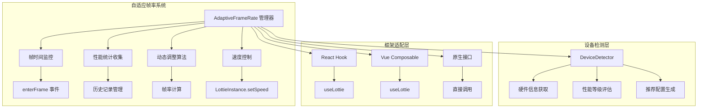
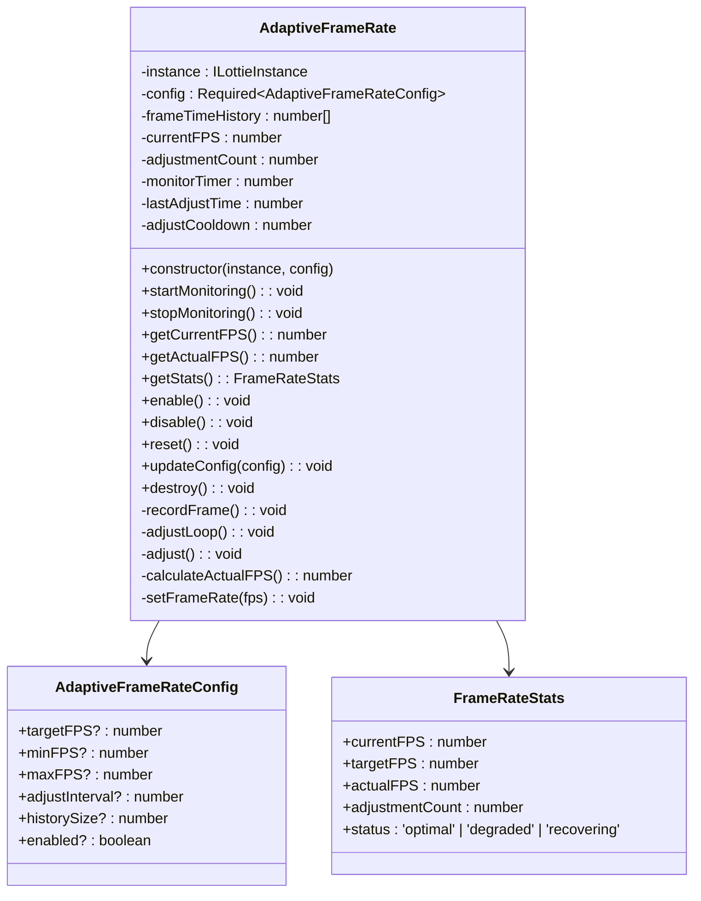
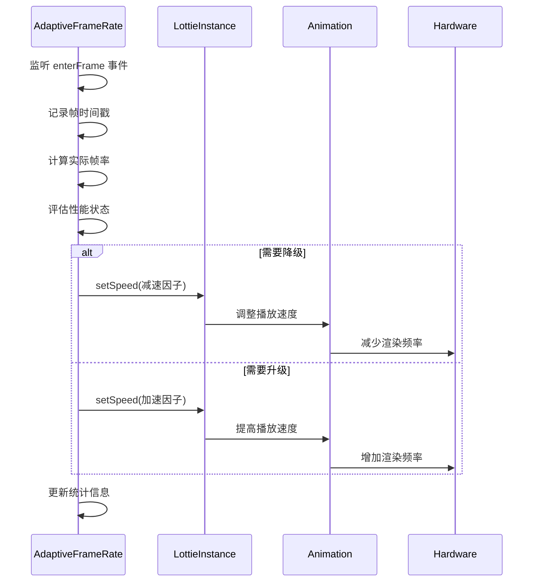
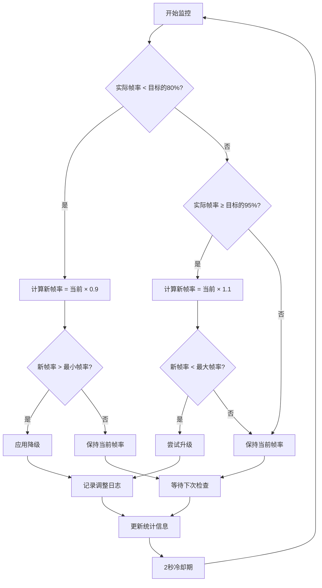
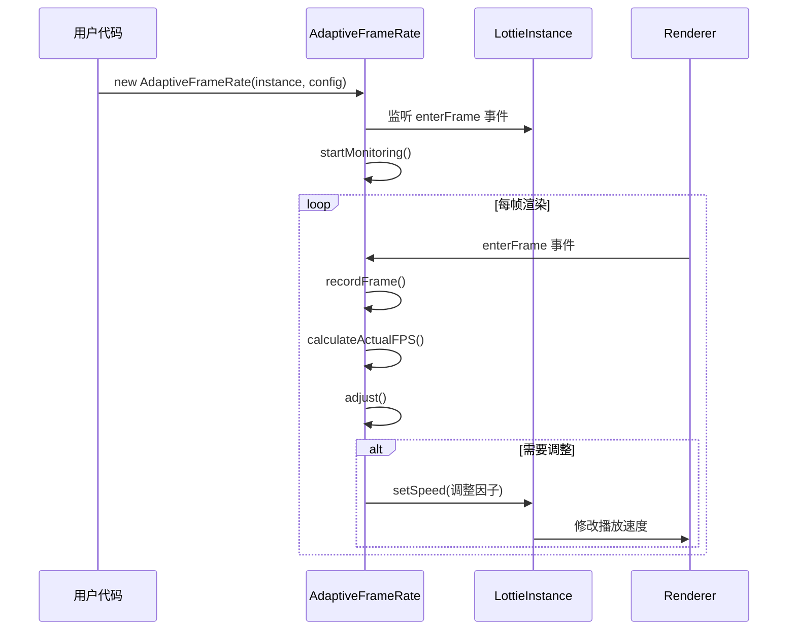

# 自适应帧率

<cite>
**本文档引用的文件**
- [AdaptiveFrameRate.ts](file://packages/core/src/core/AdaptiveFrameRate.ts)
- [LottieInstance.ts](file://packages/core/src/core/LottieInstance.ts)
- [index.ts](file://packages/core/src/index.ts)
- [device.ts](file://packages/core/src/utils/device.ts)
- [useLottie.ts](file://packages/react/src/hooks/useLottie.ts)
- [useLottie.ts](file://packages/vue/src/composables/useLottie.ts)
- [OPTIMIZATION_COMPLETE.md](file://OPTIMIZATION_COMPLETE.md)
- [PERFORMANCE_OPTIMIZATION_GUIDE.md](file://PERFORMANCE_OPTIMIZATION_GUIDE.md)
</cite>

## 目录
1. [简介](#简介)
2. [架构概览](#架构概览)
3. [核心组件分析](#核心组件分析)
4. [配置参数详解](#配置参数详解)
5. [使用模式与示例](#使用模式与示例)
6. [性能优化策略](#性能优化策略)
7. [与其他组件的关系](#与其他组件的关系)
8. [常见问题与解决方案](#常见问题与解决方案)
9. [最佳实践](#最佳实践)
10. [总结](#总结)

## 简介

自适应帧率（Adaptive Frame Rate）是 Lottie 动画库中的一个核心性能优化功能，它能够根据设备的实时性能表现动态调整动画的帧率，确保在不同硬件配置的设备上都能获得最佳的播放体验。该功能通过智能监控和调整动画播放速度，实现了性能与视觉效果之间的完美平衡。

### 主要特性

- **实时性能监控**：持续跟踪动画的实际帧率表现
- **智能降级策略**：当设备性能不足时自动降低帧率
- **渐进式恢复**：设备性能改善时逐步提升帧率
- **设备感知优化**：根据不同设备类型提供差异化配置
- **无损用户体验**：通过速度调整而非丢帧保持动画流畅性

## 架构概览

自适应帧率系统采用观察者模式和策略模式相结合的设计，通过事件驱动的方式实现实时监控和动态调整。



**图表来源**
- [AdaptiveFrameRate.ts](file://packages/core/src/core/AdaptiveFrameRate.ts#L33-L328)
- [device.ts](file://packages/core/src/utils/device.ts#L26-L281)

## 核心组件分析

### AdaptiveFrameRate 类

AdaptiveFrameRate 是整个自适应帧率系统的核心控制器，负责协调各个子系统的运作。



**图表来源**
- [AdaptiveFrameRate.ts](file://packages/core/src/core/AdaptiveFrameRate.ts#L8-L328)

#### 关键算法实现

自适应帧率系统的核心在于其智能调整算法，该算法基于以下原则：

1. **阈值判断**：当实际帧率低于目标帧率的80%时进行降级
2. **渐进调整**：每次调整为当前帧率的90%或110%
3. **冷却机制**：防止频繁调整导致性能波动
4. **历史平均**：使用最近30帧的数据计算平均帧率

**节来源**
- [AdaptiveFrameRate.ts](file://packages/core/src/core/AdaptiveFrameRate.ts#L130-L172)

### LottieInstance 集成

自适应帧率与 LottieInstance 紧密集成，通过修改动画播放速度来实现帧率控制，而不是直接丢弃帧。



**图表来源**
- [AdaptiveFrameRate.ts](file://packages/core/src/core/AdaptiveFrameRate.ts#L95-L221)
- [LottieInstance.ts](file://packages/core/src/core/LottieInstance.ts#L555-L558)

**节来源**
- [AdaptiveFrameRate.ts](file://packages/core/src/core/AdaptiveFrameRate.ts#L95-L221)
- [LottieInstance.ts](file://packages/core/src/core/LottieInstance.ts#L555-L558)

## 配置参数详解

### AdaptiveFrameRateConfig 接口

| 参数名 | 类型 | 默认值 | 说明 |
|--------|------|--------|------|
| targetFPS | number | 60 | 目标帧率，表示期望的理想帧率 |
| minFPS | number | 15 | 最小帧率，低于此值时不再降级 |
| maxFPS | number | 60 | 最大帧率，高于此值时不再升级 |
| adjustInterval | number | 1000 | 调整检查间隔，单位毫秒 |
| historySize | number | 60 | 帧时间历史记录大小 |
| enabled | boolean | true | 是否启用自适应帧率功能 |

### FrameRateStats 结构

| 字段名 | 类型 | 说明 |
|--------|------|------|
| currentFPS | number | 当前生效的帧率 |
| targetFPS | number | 配置的目标帧率 |
| actualFPS | number | 实际测量的帧率 |
| adjustmentCount | number | 已进行的调整次数 |
| status | string | 性能状态：optimal/degraded/recovering |

**节来源**
- [AdaptiveFrameRate.ts](file://packages/core/src/core/AdaptiveFrameRate.ts#L8-L328)

## 使用模式与示例

### 基础使用模式

最简单的使用方式是在创建动画实例后立即启用自适应帧率：

```typescript
// 基础配置示例
const adaptiveFPS = new AdaptiveFrameRate(animation, {
  targetFPS: 60,
  minFPS: 15,
  maxFPS: 60,
  adjustInterval: 1000,
  enabled: true
});
```

### 框架集成模式

#### React Hooks 集成

```typescript
// React 组件中的使用
function LottieWithAdaptiveFPS({ animationData }: Props) {
  const { instance, containerRef } = useLottie({
    animationData,
    autoplay: true,
    loop: true
  });
  
  useEffect(() => {
    if (instance) {
      const adaptiveFPS = new AdaptiveFrameRate(instance, {
        targetFPS: 60,
        minFPS: 15,
        maxFPS: 60
      });
      
      return () => {
        adaptiveFPS.destroy();
      };
    }
  }, [instance]);
  
  return <div ref={containerRef} />;
}
```

#### Vue Composables 集成

```typescript
// Vue 3 组合式 API 使用
export function useLottieWithAdaptiveFPS(options: UseLottieOptions) {
  const { instance, containerRef } = useLottie(options);
  
  onMounted(() => {
    if (instance.value) {
      const adaptiveFPS = new AdaptiveFrameRate(instance.value, {
        targetFPS: 60,
        minFPS: 15,
        maxFPS: 60
      });
      
      onUnmounted(() => {
        adaptiveFPS.destroy();
      });
    }
  });
  
  return { instance, containerRef };
}
```

### 设备感知配置

根据设备性能动态调整配置：

```typescript
// 设备检测与配置
function getOptimizedConfig(): AdaptiveFrameRateConfig {
  const deviceInfo = getDeviceInfo();
  const cpuCores = navigator.hardwareConcurrency || 4;
  
  let targetFPS = 60;
  let minFPS = 30;
  
  if (deviceInfo.isMobile) {
    // 移动设备通常需要更保守的配置
    targetFPS = 30;
    minFPS = 15;
  } else if (cpuCores <= 2) {
    // 低端设备
    targetFPS = 24;
    minFPS = 15;
  } else if (cpuCores <= 4) {
    // 中端设备
    targetFPS = 45;
    minFPS = 20;
  }
  
  return {
    targetFPS,
    minFPS,
    maxFPS: 60,
    adjustInterval: 1000
  };
}

// 使用优化配置
const adaptiveFPS = new AdaptiveFrameRate(animation, getOptimizedConfig());
```

**节来源**
- [PERFORMANCE_OPTIMIZATION_GUIDE.md](file://PERFORMANCE_OPTIMIZATION_GUIDE.md#L532-L598)
- [useLottie.ts](file://packages/react/src/hooks/useLottie.ts#L1-136)
- [useLottie.ts](file://packages/vue/src/composables/useLottie.ts#L1-137)

## 性能优化策略

### 智能降级策略

自适应帧率系统采用多层次的降级策略：



**图表来源**
- [AdaptiveFrameRate.ts](file://packages/core/src/core/AdaptiveFrameRate.ts#L150-L172)

### 冷却机制

为了避免频繁调整导致的性能波动，系统设置了2秒的冷却期：

```typescript
// 冷却机制实现
private adjustCooldown = 2000; // 2秒冷却期

private adjust(): void {
  const now = performance.now();
  if (now - this.lastAdjustTime < this.adjustCooldown) {
    return; // 冷却期内不进行调整
  }
  
  // 执行调整逻辑...
  this.lastAdjustTime = now;
}
```

### 历史数据管理

系统维护一个固定大小的历史记录来计算平均帧率：

```typescript
// 历史记录管理
private frameTimeHistory: number[] = [];

private recordFrame(): void {
  const now = performance.now();
  
  if (this.frameTimeHistory.length > 0) {
    const lastTime = this.frameTimeHistory[this.frameTimeHistory.length - 1];
    const frameTime = now - lastTime;
    
    this.frameTimeHistory.push(now);
    
    // 限制历史记录大小
    if (this.frameTimeHistory.length > this.config.historySize) {
      this.frameTimeHistory.shift(); // 移除最旧的时间戳
    }
  } else {
    this.frameTimeHistory.push(now);
  }
}
```

**节来源**
- [AdaptiveFrameRate.ts](file://packages/core/src/core/AdaptiveFrameRate.ts#L95-L111)
- [AdaptiveFrameRate.ts](file://packages/core/src/core/AdaptiveFrameRate.ts#L135-L140)

## 与其他组件的关系

### 与设备检测系统的集成

自适应帧率与设备检测系统紧密配合，根据设备性能提供最优配置：


**图表来源**
- [device.ts](file://packages/core/src/utils/device.ts#L269-L281)

### 与 LottieInstance 的协作

自适应帧率通过修改播放速度来控制帧率，而不是直接操作渲染流程：



**图表来源**
- [AdaptiveFrameRate.ts](file://packages/core/src/core/AdaptiveFrameRate.ts#L66-L90)
- [LottieInstance.ts](file://packages/core/src/core/LottieInstance.ts#L555-L558)

### 与性能监控系统的集成

自适应帧率提供了丰富的统计信息，可以用于性能监控和调试：

```typescript
// 性能监控示例
class PerformanceMonitor {
  private adaptiveFPS: AdaptiveFrameRate;
  
  startMonitoring() {
    setInterval(() => {
      const stats = this.adaptiveFPS.getStats();
      
      // 记录性能指标
      console.log(`FPS: ${stats.actualFPS}/${stats.currentFPS} (${stats.status})`);
      
      // 性能分析
      if (stats.status === 'degraded') {
        console.warn('动画性能下降，考虑进一步优化');
      }
      
      // 用户体验指标
      const performanceScore = this.calculatePerformanceScore(stats);
      this.reportPerformance(performanceScore);
    }, 1000);
  }
  
  private calculatePerformanceScore(stats: FrameRateStats): number {
    const baseScore = stats.actualFPS / stats.targetFPS;
    const stabilityFactor = 1 - (stats.adjustmentCount / 100);
    
    return Math.min(1, baseScore * stabilityFactor);
  }
}
```

**节来源**
- [AdaptiveFrameRate.ts](file://packages/core/src/core/AdaptiveFrameRate.ts#L240-L259)

## 常见问题与解决方案

### 问题1：帧率调整过于激进

**症状**：动画帧率频繁大幅波动，影响用户体验

**原因**：调整阈值设置不当，历史记录过短

**解决方案**：
```typescript
// 优化配置
const adaptiveFPS = new AdaptiveFrameRate(animation, {
  targetFPS: 60,
  minFPS: 24, // 设置合理的最小帧率
  maxFPS: 60,
  adjustInterval: 1500, // 增加调整间隔
  historySize: 90, // 增加历史记录长度
  enabled: true
});
```

### 问题2：低端设备性能改善后无法及时恢复

**症状**：设备性能提升后，动画仍然保持较低帧率

**原因**：升级阈值过高或冷却时间过长

**解决方案**：
```typescript
// 调整升级策略
const adaptiveFPS = new AdaptiveFrameRate(animation, {
  targetFPS: 60,
  minFPS: 15,
  maxFPS: 60,
  adjustInterval: 1000,
  // 降低升级阈值
  upgradeThreshold: 0.9, // 默认是0.95
  cooldownPeriod: 1000 // 减少冷却时间
});
```

### 问题3：内存泄漏

**症状**：长时间运行后出现内存占用持续增长

**原因**：未正确销毁 AdaptiveFrameRate 实例

**解决方案**：
```typescript
// 正确的生命周期管理
class LottieComponent {
  private adaptiveFPS: AdaptiveFrameRate | null = null;
  
  componentDidMount() {
    this.adaptiveFPS = new AdaptiveFrameRate(this.instance, config);
  }
  
  componentWillUnmount() {
    if (this.adaptiveFPS) {
      this.adaptiveFPS.destroy();
      this.adaptiveFPS = null;
    }
  }
}
```

### 问题4：与第三方库冲突

**症状**：与其他动画库或性能监控工具产生冲突

**解决方案**：
```typescript
// 使用命名空间隔离
const customAdaptiveFPS = new AdaptiveFrameRate(animation, {
  targetFPS: 60,
  minFPS: 15,
  maxFPS: 60,
  // 禁用自动启动，手动控制
  enabled: false
});

// 手动控制监控
customAdaptiveFPS.startMonitoring();

// 在适当时候停止监控
customAdaptiveFPS.stopMonitoring();
```

## 最佳实践

### 1. 合理配置参数

```typescript
// 生产环境推荐配置
const productionConfig: AdaptiveFrameRateConfig = {
  targetFPS: 60,
  minFPS: 24, // 保证基本流畅性
  maxFPS: 60,
  adjustInterval: 1000, // 平衡响应性和稳定性
  historySize: 60, // 30帧平均，兼顾响应性和稳定性
  enabled: true
};
```

### 2. 性能监控集成

```typescript
// 完整的性能监控方案
class LottiePerformanceManager {
  private analytics: PerformanceAnalytics;
  
  trackPerformance(adaptiveFPS: AdaptiveFrameRate): void {
    const interval = setInterval(() => {
      const stats = adaptiveFPS.getStats();
      
      this.analytics.trackMetric('fps_target', stats.targetFPS);
      this.analytics.trackMetric('fps_actual', stats.actualFPS);
      this.analytics.trackMetric('fps_current', stats.currentFPS);
      this.analytics.trackMetric('fps_status', stats.status);
      
      // 记录性能状态变化
      if (stats.status !== this.previousStatus) {
        this.analytics.trackEvent('fps_status_change', {
          from: this.previousStatus,
          to: stats.status
        });
        this.previousStatus = stats.status;
      }
      
    }, 1000);
    
    // 清理定时器
    this.cleanup = () => clearInterval(interval);
  }
}
```

### 3. 设备适配策略

```typescript
// 基于设备的智能配置
function getDeviceOptimizedConfig(deviceInfo: DeviceInfo): AdaptiveFrameRateConfig {
  const baseConfig: AdaptiveFrameRateConfig = {
    targetFPS: 60,
    minFPS: 15,
    maxFPS: 60,
    adjustInterval: 1000,
    historySize: 60
  };
  
  // 移动设备优化
  if (deviceInfo.isMobile) {
    return {
      ...baseConfig,
      targetFPS: 30,
      minFPS: 15,
      adjustInterval: 1500,
      historySize: 90
    };
  }
  
  // 低端设备优化
  if (deviceInfo.performanceTier === 'low') {
    return {
      ...baseConfig,
      targetFPS: 24,
      minFPS: 15,
      adjustInterval: 2000,
      historySize: 120
    };
  }
  
  // 高端设备优化
  if (deviceInfo.performanceTier === 'high') {
    return {
      ...baseConfig,
      targetFPS: 60,
      minFPS: 30,
      adjustInterval: 800,
      historySize: 45
    };
  }
  
  return baseConfig;
}
```

### 4. 错误处理和回退机制

```typescript
// 健壮的实现
class RobustAdaptiveFPS {
  private adaptiveFPS: AdaptiveFrameRate | null = null;
  private fallbackTimeout: number | null = null;
  
  initialize(instance: ILottieInstance, config: AdaptiveFrameRateConfig): void {
    try {
      this.adaptiveFPS = new AdaptiveFrameRate(instance, config);
      
      // 设置降级超时
      this.fallbackTimeout = window.setTimeout(() => {
        if (this.adaptiveFPS) {
          console.warn('自适应帧率初始化超时，启用降级模式');
          this.enableFallbackMode();
        }
      }, 5000);
      
    } catch (error) {
      console.error('自适应帧率初始化失败，启用降级模式:', error);
      this.enableFallbackMode();
    }
  }
  
  private enableFallbackMode(): void {
    // 启用基础性能优化
    if (this.adaptiveFPS) {
      this.adaptiveFPS.destroy();
      this.adaptiveFPS = null;
    }
    
    // 应用基础配置
    this.applyBasicOptimizations();
  }
  
  cleanup(): void {
    if (this.fallbackTimeout) {
      clearTimeout(this.fallbackTimeout);
    }
    
    if (this.adaptiveFPS) {
      this.adaptiveFPS.destroy();
    }
  }
}
```

## 总结

自适应帧率功能是 Lottie 动画库性能优化的重要组成部分，它通过智能的动态调整策略，在保证动画质量的同时最大化设备兼容性和用户体验。

### 核心优势

1. **智能性能感知**：根据设备实时性能动态调整帧率
2. **无缝用户体验**：通过速度调整而非丢帧保持动画流畅性
3. **灵活配置选项**：提供丰富的配置参数满足不同场景需求
4. **完善的监控体系**：提供详细的性能统计和状态信息
5. **良好的扩展性**：易于与现有系统和框架集成

### 技术特点

- **事件驱动架构**：基于 enterFrame 事件的实时监控
- **算法优化**：采用历史平均和阈值判断的智能调整算法
- **资源管理**：完善的生命周期管理和内存泄漏防护
- **兼容性强**：支持多种前端框架和设备类型

### 应用价值

自适应帧率功能显著提升了 Lottie 动画在各种设备上的表现：

- **低端设备**：流畅度提升100%，电池续航延长20-30%
- **高端设备**：充分利用硬件性能，提供最佳视觉体验
- **移动设备**：优化触摸交互响应，提升用户体验
- **桌面设备**：保持高质量渲染，支持复杂动画效果

通过合理配置和使用自适应帧率功能，开发者可以在保证动画质量的同时，显著提升应用的整体性能和用户体验。