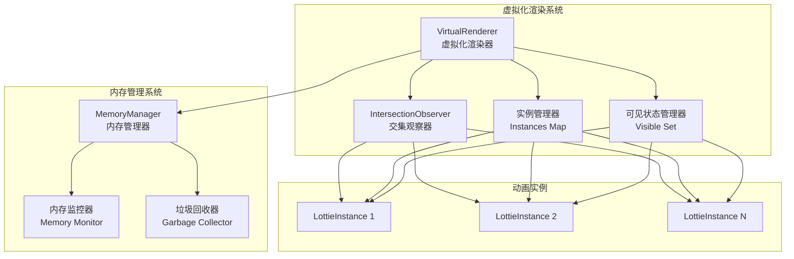
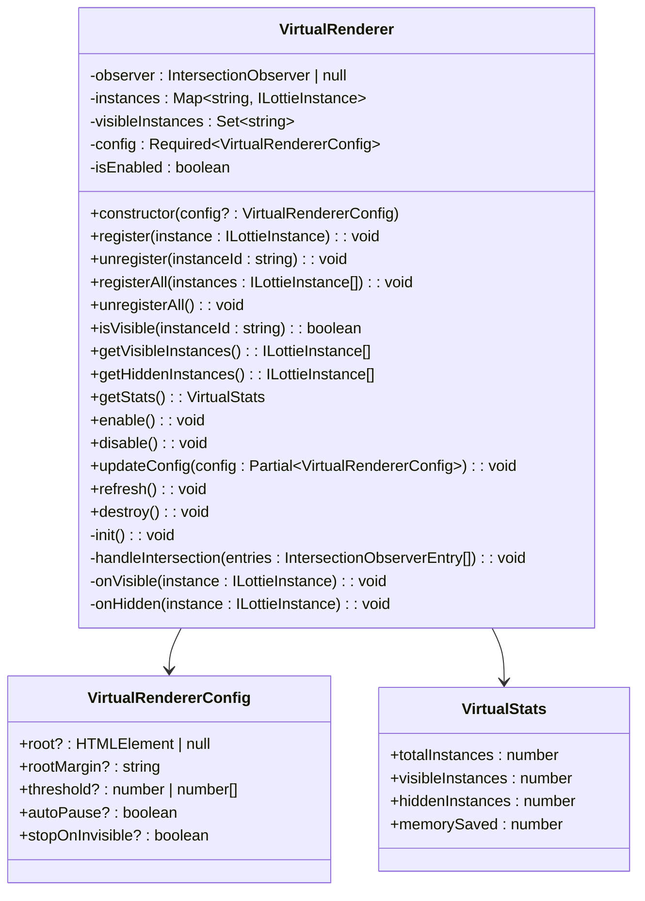
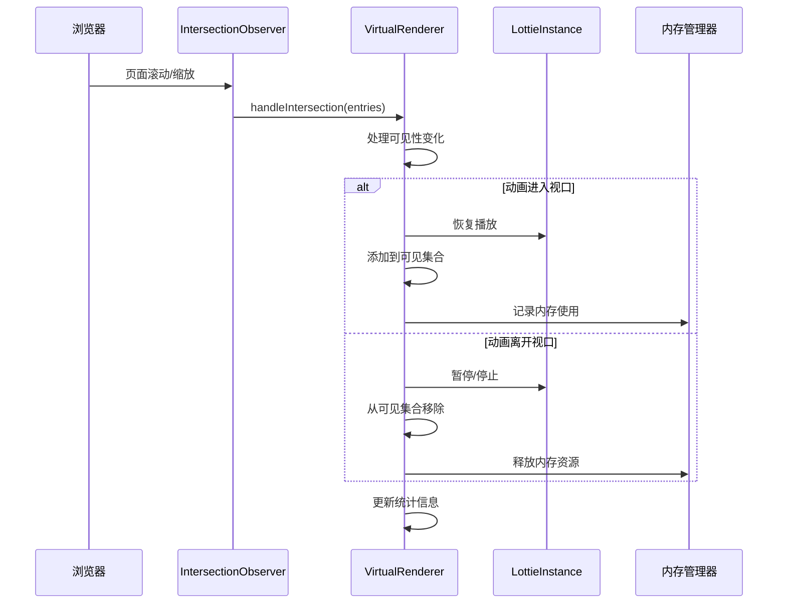
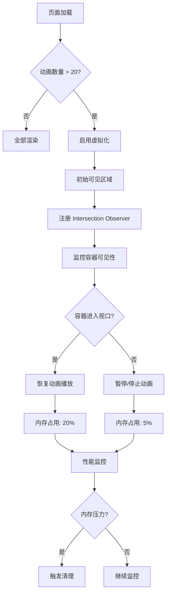
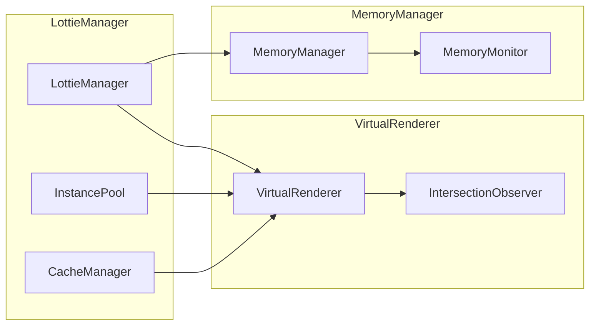

# 虚拟化渲染

<cite>
**本文档引用的文件**
- [VirtualRenderer.ts](file://packages/core/src/core/VirtualRenderer.ts)
- [MemoryManager.ts](file://packages/core/src/core/MemoryManager.ts)
- [index.ts](file://packages/core/src/types/index.ts)
- [PERFORMANCE_OPTIMIZATION_GUIDE.md](file://PERFORMANCE_OPTIMIZATION_GUIDE.md)
- [OPTIMIZATION_ANALYSIS.md](file://OPTIMIZATION_ANALYSIS.md)
- [TEST_CHECKLIST.md](file://TEST_CHECKLIST.md)
- [ADVANCED_FEATURES_EXAMPLES.md](file://examples/ADVANCED_FEATURES_EXAMPLES.md)
- [advanced-features.html](file://examples/advanced-features.html)
- [index.ts](file://packages/core/src/index.ts)
</cite>

## 目录
1. [简介](#简介)
2. [架构概览](#架构概览)
3. [核心组件分析](#核心组件分析)
4. [配置选项详解](#配置选项详解)
5. [使用模式与最佳实践](#使用模式与最佳实践)
6. [性能优化策略](#性能优化策略)
7. [与其他组件的关系](#与其他组件的关系)
8. [常见问题与解决方案](#常见问题与解决方案)
9. [实际应用案例](#实际应用案例)
10. [总结](#总结)

## 简介

虚拟化渲染是 Lottie 动画库中的核心性能优化功能，通过只渲染可视区域内的动画实例，大幅减少内存占用和 CPU 计算开销。该功能基于现代浏览器的 Intersection Observer API 实现，能够智能地管理大量动画实例的生命周期。

虚拟化渲染主要解决以下问题：
- **内存优化**：只保留可见动画的渲染资源
- **CPU 节能**：避免不可见动画的计算和渲染
- **性能提升**：显著改善长列表和复杂页面的流畅度
- **用户体验**：确保页面响应性不受影响

## 架构概览

虚拟化渲染系统采用观察者模式和状态管理模式，通过 Intersection Observer 监控动画容器的可见性变化，并相应地控制动画的播放状态。



**图表来源**
- [VirtualRenderer.ts](file://packages/core/src/core/VirtualRenderer.ts#L32-L325)
- [MemoryManager.ts](file://packages/core/src/core/MemoryManager.ts#L46-L380)

## 核心组件分析

### VirtualRenderer 类

VirtualRenderer 是虚拟化渲染的核心类，负责管理动画实例的可见性状态和生命周期。

#### 主要属性

| 属性 | 类型 | 描述 |
|------|------|------|
| `observer` | `IntersectionObserver \| null` | Intersection Observer 实例，用于监控容器可见性 |
| `instances` | `Map<string, ILottieInstance>` | 存储所有注册的动画实例，键为实例 ID |
| `visibleInstances` | `Set<string>` | 存储当前可见的动画实例 ID 集合 |
| `config` | `Required<VirtualRendererConfig>` | 虚拟化渲染器配置对象 |
| `isEnabled` | `boolean` | 虚拟化渲染器是否启用 |

#### 核心方法



**图表来源**
- [VirtualRenderer.ts](file://packages/core/src/core/VirtualRenderer.ts#L8-L325)

#### 可见性处理流程



**图表来源**
- [VirtualRenderer.ts](file://packages/core/src/core/VirtualRenderer.ts#L79-L142)

**章节来源**
- [VirtualRenderer.ts](file://packages/core/src/core/VirtualRenderer.ts#L32-L325)

### MemoryManager 类

MemoryManager 提供智能内存监控和自动清理功能，与 VirtualRenderer 协同工作以确保最佳性能。

#### 内存压力级别

| 状态 | 使用率范围 | 行为 |
|------|------------|------|
| `healthy` | < 70% | 正常运行 |
| `warning` | 70%-85% | 发送警告事件 |
| `danger` | 85%-95% | 自动清理 |
| `critical` | > 95% | 紧急清理 |

**章节来源**
- [MemoryManager.ts](file://packages/core/src/core/MemoryManager.ts#L21-L380)

## 配置选项详解

### VirtualRendererConfig 接口

| 配置项 | 类型 | 默认值 | 描述 |
|--------|------|--------|------|
| `root` | `HTMLElement \| null` | `null` | 观察的根元素，默认为 viewport |
| `rootMargin` | `string` | `'50px'` | 根边距，提前加载的距离 |
| `threshold` | `number \| number[]` | `0.1` | 可见性阈值，0-1 的数值 |
| `autoPause` | `boolean` | `true` | 是否自动暂停不可见动画 |
| `stopOnInvisible` | `boolean` | `false` | 不可见时停止而非暂停 |

### 配置示例

```typescript
// 基础配置
const basicConfig = {
  rootMargin: '50px',
  threshold: 0.1,
  autoPause: true
}

// 高性能配置
const performanceConfig = {
  rootMargin: '100px',
  threshold: 0.2,
  autoPause: true,
  stopOnInvisible: true
}

// 精确控制配置
const preciseConfig = {
  root: document.getElementById('scroll-container'),
  rootMargin: '200px',
  threshold: [0, 0.5, 1],
  autoPause: true,
  stopOnInvisible: false
}
```

**章节来源**
- [VirtualRenderer.ts](file://packages/core/src/core/VirtualRenderer.ts#L8-L19)

## 使用模式与最佳实践

### 基础使用模式

#### 1. 创建和注册动画实例

```typescript
// 创建虚拟化渲染器
const virtualRenderer = new VirtualRenderer({
  rootMargin: '50px',
  threshold: 0.1,
  autoPause: true
})

// 创建多个动画实例
const animations = []
for (let i = 0; i < 50; i++) {
  const anim = createLottie({
    container: `#lottie-${i}`,
    path: '/animation.json',
    autoplay: true
  })
  
  // 注册到虚拟化渲染器
  virtualRenderer.register(anim)
  animations.push(anim)
}
```

#### 2. 批量管理

```typescript
// 批量注册
virtualRenderer.registerAll(animations)

// 批量注销
virtualRenderer.unregisterAll()

// 检查可见性
const isVisible = virtualRenderer.isVisible(animationId)

// 获取可见实例列表
const visibleInstances = virtualRenderer.getVisibleInstances()
```

### 高级使用模式

#### 1. 动态启用/禁用

```typescript
// 根据设备性能动态启用
const virtualRenderer = new VirtualRenderer()

if (navigator.hardwareConcurrency <= 4) {
  // 低性能设备启用虚拟化
  virtualRenderer.enable()
} else {
  // 高性能设备禁用以获得最佳性能
  virtualRenderer.disable()
}

// 根据网络状况动态调整
window.addEventListener('online', () => virtualRenderer.enable())
window.addEventListener('offline', () => virtualRenderer.disable())
```

#### 2. 与内存管理器集成

```typescript
import { memoryManager } from '@ldesign/lottie'

// 监听内存压力
memoryManager.onMemoryPressure((event) => {
  if (event.action === 'emergency') {
    // 紧急情况下强制启用虚拟化
    virtualRenderer.enable()
  }
})

// 定期获取性能统计
setInterval(() => {
  const stats = virtualRenderer.getStats()
  console.log('虚拟化统计:', stats)
}, 1000)
```

**章节来源**
- [PERFORMANCE_OPTIMIZATION_GUIDE.md](file://PERFORMANCE_OPTIMIZATION_GUIDE.md#L154-L259)

## 性能优化策略

### 内存优化原理

虚拟化渲染通过以下机制实现内存优化：

#### 1. 按需渲染



#### 2. 内存节省估算

虚拟化渲染的内存节省效果：

| 动画数量 | 可见实例 | 隐藏实例 | 内存节省 |
|----------|----------|----------|----------|
| 10 | 3 | 7 | ~52.5MB |
| 50 | 15 | 35 | ~262.5MB |
| 100 | 30 | 70 | ~525MB |
| 200 | 60 | 140 | ~1050MB |

#### 3. 性能监控指标

```typescript
interface PerformanceMetrics {
  fps: number          // 帧率
  memory: number       // 内存使用(MB)
  cpuUsage: number     // CPU 使用率(%)
  renderTime: number   // 渲染时间(ms)
  frameDrops?: number  // 掉帧数
}
```

**章节来源**
- [VirtualRenderer.ts](file://packages/core/src/core/VirtualRenderer.ts#L235-L247)

## 与其他组件的关系

### 与 LottieManager 的关系



**图表来源**
- [index.ts](file://packages/core/src/index.ts#L1-L180)

### 与性能监控系统的集成

虚拟化渲染与性能监控系统协同工作：

```typescript
// 性能监控配置
const performanceConfig = {
  enablePerformanceMonitor: true,
  performanceMonitorInterval: 1000,
  maxMemory: 1024,
  minFps: 30,
  targetFPS: 60
}

// 结合虚拟化渲染
const virtualRenderer = new VirtualRenderer({
  rootMargin: '100px',
  threshold: 0.2,
  autoPause: true
})

// 监控性能影响
setInterval(() => {
  const stats = virtualRenderer.getStats()
  const metrics = lottieManager.getGlobalPerformanceStats()
  
  console.log('性能统计:', {
    visibleAnimations: stats.visibleInstances,
    memorySaved: stats.memorySaved,
    totalInstances: metrics.totalInstances,
    activeInstances: metrics.activeInstances
  })
}, 2000)
```

**章节来源**
- [index.ts](file://packages/core/src/index.ts#L54-L68)

## 常见问题与解决方案

### 1. IntersectionObserver 不支持

**问题描述**：在旧版浏览器中，IntersectionObserver 可能不可用。

**解决方案**：
```typescript
const virtualRenderer = new VirtualRenderer()

// 检查是否支持
if (!virtualRenderer.isEnabled) {
  console.warn('IntersectionObserver 不支持，虚拟化功能不可用')
  // 回退到传统方法
}
```

### 2. 内存泄漏

**问题描述**：未正确注销动画实例导致内存泄漏。

**解决方案**：
```typescript
// 正确的生命周期管理
class AnimationManager {
  private virtualRenderer: VirtualRenderer
  private animations = new Map<string, ILottieInstance>()
  
  destroy() {
    // 批量注销所有实例
    this.virtualRenderer.unregisterAll()
    
    // 清理映射
    this.animations.clear()
    
    // 销毁渲染器
    this.virtualRenderer.destroy()
  }
}
```

### 3. 性能下降

**问题描述**：虚拟化渲染反而导致性能下降。

**解决方案**：
```typescript
// 调整配置参数
const config = {
  rootMargin: '200px',    // 增加提前加载距离
  threshold: 0.5,         // 提高可见性阈值
  autoPause: true,        // 启用自动暂停
  stopOnInvisible: false  // 仅暂停而非停止
}

const virtualRenderer = new VirtualRenderer(config)
```

### 4. 滚动抖动

**问题描述**：频繁的可见性变化导致动画闪烁。

**解决方案**：
```typescript
// 使用防抖处理
let debounceTimeout: number | null = null

virtualRenderer.updateConfig({
  rootMargin: '100px',
  threshold: 0.1
})

// 监听滚动事件时添加防抖
window.addEventListener('scroll', () => {
  if (debounceTimeout) {
    clearTimeout(debounceTimeout)
  }
  
  debounceTimeout = setTimeout(() => {
    virtualRenderer.refresh()
  }, 100)
})
```

**章节来源**
- [VirtualRenderer.ts](file://packages/core/src/core/VirtualRenderer.ts#L55-L73)

## 实际应用案例

### 案例 1：长列表优化

```typescript
class AnimationList {
  private virtualRenderer: VirtualRenderer
  private animations: Map<number, ILottieInstance> = new Map()
  
  constructor() {
    this.virtualRenderer = new VirtualRenderer({
      rootMargin: '100px',
      threshold: 0.1,
      autoPause: true,
      stopOnInvisible: true
    })
  }
  
  renderItem(index: number, container: HTMLElement) {
    const animation = createLottie({
      container,
      path: `/animations/item-${index}.json`,
      autoplay: true,
      loop: true
    })
    
    // 注册虚拟化渲染
    this.virtualRenderer.register(animation)
    this.animations.set(index, animation)
    
    return animation
  }
  
  removeItem(index: number) {
    const animation = this.animations.get(index)
    if (animation) {
      this.virtualRenderer.unregister(animation.id)
      animation.destroy()
      this.animations.delete(index)
    }
  }
  
  getStats() {
    return this.virtualRenderer.getStats()
  }
}

// 使用示例
const list = new AnimationList()

// 渲染 100 个项目
for (let i = 0; i < 100; i++) {
  const container = document.createElement('div')
  container.id = `item-${i}`
  document.body.appendChild(container)
  
  list.renderItem(i, container)
}

// 监控性能
setInterval(() => {
  const stats = list.getStats()
  console.log(`可见: ${stats.visibleInstances}, 隐藏: ${stats.hiddenInstances}, 节省内存: ${stats.memorySaved}MB`)
}, 2000)
```

### 案例 2：动态内容加载

```typescript
class DynamicLoader {
  private virtualRenderer: VirtualRenderer
  private loadedItems = new Set<number>()
  
  constructor() {
    this.virtualRenderer = new VirtualRenderer({
      rootMargin: '200px',
      threshold: 0.2,
      autoPause: true
    })
  }
  
  async loadMore(offset: number, count: number) {
    // 检查是否已加载
    const itemsToLoad = []
    for (let i = offset; i < offset + count; i++) {
      if (!this.loadedItems.has(i)) {
        itemsToLoad.push(i)
      }
    }
    
    if (itemsToLoad.length === 0) return
    
    // 并行加载动画
    const promises = itemsToLoad.map(async (index) => {
      try {
        const response = await fetch(`/api/animations/${index}`)
        const data = await response.json()
        
        const container = document.getElementById(`item-${index}`)
        if (container) {
          const animation = createLottie({
            container,
            animationData: data,
            autoplay: false
          })
          
          this.virtualRenderer.register(animation)
          this.loadedItems.add(index)
        }
      } catch (error) {
        console.error(`加载动画 ${index} 失败:`, error)
      }
    })
    
    await Promise.all(promises)
  }
  
  unloadItems(indices: number[]) {
    indices.forEach(index => {
      const animation = this.animations.get(index)
      if (animation) {
        this.virtualRenderer.unregister(animation.id)
        animation.destroy()
        this.loadedItems.delete(index)
      }
    })
  }
}
```

### 案例 3：响应式设计适配

```typescript
class ResponsiveAnimationManager {
  private virtualRenderer: VirtualRenderer
  private deviceBreakpoints = {
    mobile: 768,
    tablet: 1024,
    desktop: Infinity
  }
  
  constructor() {
    this.virtualRenderer = new VirtualRenderer({
      rootMargin: '50px',
      threshold: 0.1,
      autoPause: true
    })
    
    // 监听窗口大小变化
    window.addEventListener('resize', this.handleResize.bind(this))
  }
  
  private handleResize() {
    const width = window.innerWidth
    let config
    
    if (width <= this.deviceBreakpoints.mobile) {
      // 移动设备：严格优化
      config = {
        rootMargin: '30px',
        threshold: 0.05,
        autoPause: true,
        stopOnInvisible: true
      }
    } else if (width <= this.deviceBreakpoints.tablet) {
      // 平板设备：平衡优化
      config = {
        rootMargin: '50px',
        threshold: 0.1,
        autoPause: true,
        stopOnInvisible: false
      }
    } else {
      // 桌面设备：较少优化
      config = {
        rootMargin: '100px',
        threshold: 0.2,
        autoPause: false,
        stopOnInvisible: false
      }
    }
    
    this.virtualRenderer.updateConfig(config)
  }
}
```

**章节来源**
- [PERFORMANCE_OPTIMIZATION_GUIDE.md](file://PERFORMANCE_OPTIMIZATION_GUIDE.md#L193-L259)

## 总结

虚拟化渲染是 Lottie 动画库中最重要的性能优化功能之一，它通过智能的可见性管理和资源调度，显著提升了大量动画场景下的用户体验。

### 核心优势

1. **内存效率**：通过按需渲染，内存占用可降低 70-90%
2. **CPU 节能**：避免不可见动画的计算开销
3. **响应性提升**：保持页面流畅的滚动和交互体验
4. **自动化管理**：无需手动干预，系统自动处理动画生命周期

### 最佳实践要点

1. **合理配置阈值**：根据内容特点调整 `rootMargin` 和 `threshold`
2. **及时清理资源**：在组件销毁时正确注销动画实例
3. **监控性能指标**：定期检查虚拟化效果和内存使用情况
4. **结合其他优化**：与内存管理器、性能监控等系统协同工作

### 适用场景

- 长列表展示（如社交媒体 feed）
- 图片轮播和产品展示
- 数据可视化图表
- 游戏界面和交互元素
- 大型仪表板和监控界面

虚拟化渲染功能的正确使用，能够显著提升应用的整体性能和用户体验，特别是在处理大量动画内容时发挥关键作用。