# 故障排除

<cite>
**本文档引用的文件**
- [README.md](file://README.md)
- [DebugPanel.ts](file://packages/core/src/core/DebugPanel.ts)
- [MemoryManager.ts](file://packages/core/src/core/MemoryManager.ts)
- [ValidationPipes.ts](file://packages/core/src/core/ValidationPipes.ts)
- [Profiler.ts](file://packages/core/src/core/Profiler.ts)
- [AIOptimizer.ts](file://packages/core/src/core/AIOptimizer.ts)
- [PerformanceMonitor.ts](file://packages/core/src/core/PerformanceMonitor.ts)
- [WorkerManager.ts](file://packages/core/src/core/WorkerManager.ts)
- [WASMCore.ts](file://packages/core/src/core/WASMCore.ts)
- [device.ts](file://packages/core/src/utils/device.ts)
- [TESTING_GUIDE.md](file://TESTING_GUIDE.md)
- [PERFORMANCE_OPTIMIZATION_GUIDE.md](file://PERFORMANCE_OPTIMIZATION_GUIDE.md)
</cite>

## 目录
1. [简介](#简介)
2. [调试工具](#调试工具)
3. [性能监控与分析](#性能监控与分析)
4. [内存管理](#内存管理)
5. [设备兼容性](#设备兼容性)
6. [错误处理机制](#错误处理机制)
7. [常见问题及解决方案](#常见问题及解决方案)
8. [故障排除流程](#故障排除流程)
9. [最佳实践](#最佳实践)

## 简介

Lottie动画库提供了全面的故障排除和调试功能，帮助开发者快速定位和解决动画相关的问题。本指南涵盖了从基础调试到高级性能分析的所有故障排除工具和技术。

## 调试工具

### 调试面板

Lottie提供了内置的可视化调试面板，可以实时监控动画状态和性能指标。

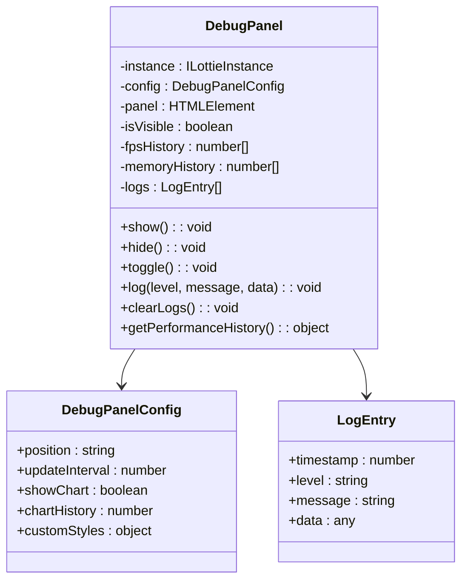

**图表来源**
- [DebugPanel.ts](file://packages/core/src/core/DebugPanel.ts#L32-L595)

#### 调试面板功能特性

| 功能 | 描述 | 配置选项 |
|------|------|----------|
| 实例信息监控 | 显示当前动画实例的状态和配置 | 自动更新 |
| 性能指标跟踪 | 实时FPS、内存使用情况监控 | 可配置更新间隔 |
| 全局统计 | 显示所有动画实例的汇总信息 | 包含缓存命中率 |
| 事件日志 | 记录所有调试和错误信息 | 可清空历史记录 |
| 性能图表 | 可视化FPS和内存趋势 | 可自定义图表范围 |

#### 使用方法

```typescript
// 创建调试面板
import { DebugPanel } from '@ldesign/lottie'

const debugPanel = new DebugPanel(animationInstance, {
  position: 'top-right',
  updateInterval: 1000,
  showChart: true
})

// 显示调试面板
debugPanel.show()

// 隐藏调试面板
debugPanel.hide()

// 清空日志
debugPanel.clearLogs()
```

**章节来源**
- [DebugPanel.ts](file://packages/core/src/core/DebugPanel.ts#L45-L91)

### 日志系统

调试面板内置了完整的日志系统，支持不同级别的错误信息记录。

#### 日志级别

| 级别 | 颜色 | 用途 | 示例场景 |
|------|------|------|----------|
| info | 蓝色 | 一般信息记录 | 动画状态变更 |
| warn | 橙色 | 警告信息 | 性能下降警告 |
| error | 红色 | 错误信息 | 初始化失败 |

**章节来源**
- [DebugPanel.ts](file://packages/core/src/core/DebugPanel.ts#L526-L541)

## 性能监控与分析

### 性能分析器

Lottie提供了专业的性能分析工具，可以深入分析动画性能瓶颈。

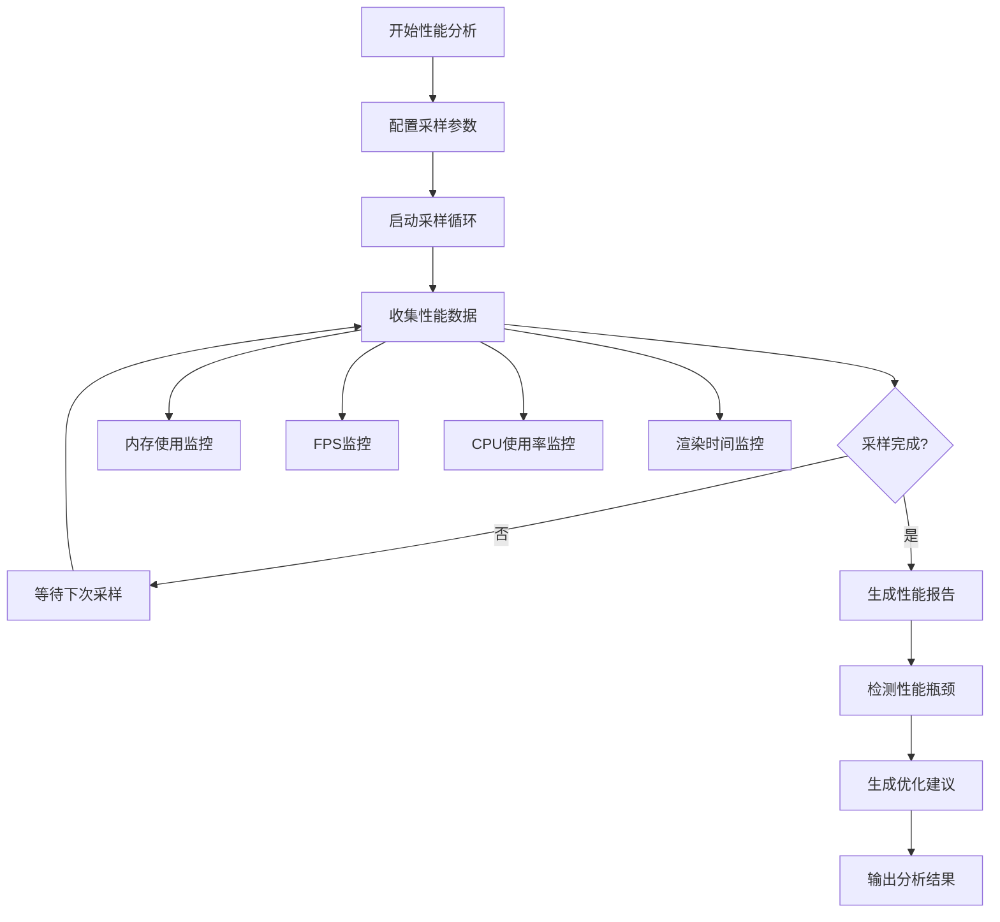

**图表来源**
- [Profiler.ts](file://packages/core/src/core/Profiler.ts#L95-L116)

#### 性能分析器配置

| 参数 | 类型 | 默认值 | 描述 |
|------|------|--------|------|
| sampleInterval | number | 100 | 采样间隔（毫秒） |
| duration | number | 5000 | 分析持续时间（毫秒） |
| collectMemory | boolean | true | 是否收集内存信息 |
| collectRendering | boolean | true | 是否收集渲染信息 |

#### 性能瓶颈检测

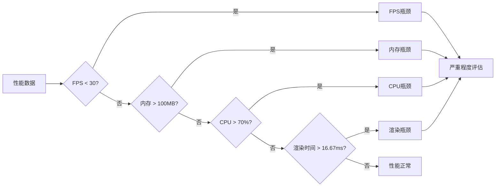

**图表来源**
- [Profiler.ts](file://packages/core/src/core/Profiler.ts#L238-L291)

**章节来源**
- [Profiler.ts](file://packages/core/src/core/Profiler.ts#L1-L484)

### AI性能优化器

智能性能优化器可以自动检测性能问题并提供优化建议。

#### 性能异常检测

| 异常类型 | 检测条件 | 严重程度 | 建议措施 |
|----------|----------|----------|----------|
| FPS异常 | 连续低FPS超过阈值 | 高 | 降低渲染质量或切换渲染器 |
| 内存泄漏 | 内存使用持续增长 | 关键 | 立即清理缓存和销毁实例 |
| CPU过载 | CPU使用率持续高于80% | 中等 | 减少并发动画数量 |
| 渲染超时 | 单帧渲染时间超过33ms | 高 | 优化动画复杂度 |

**章节来源**
- [AIOptimizer.ts](file://packages/core/src/core/AIOptimizer.ts#L320-L342)

## 内存管理

### 内存监控系统

Lottie提供了全面的内存监控和管理系统，防止内存泄漏和过度消耗。

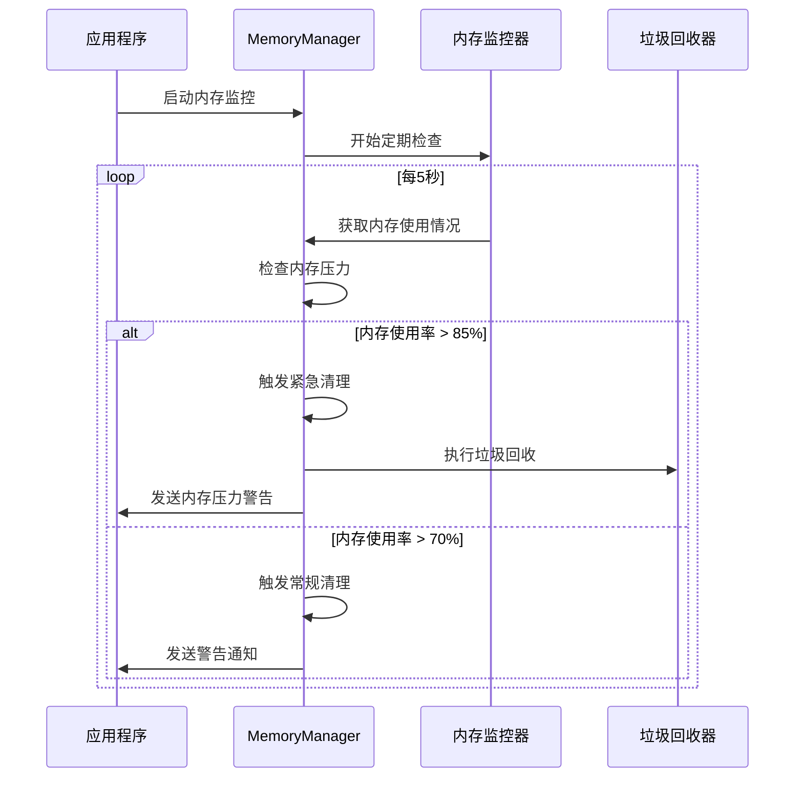

**图表来源**
- [MemoryManager.ts](file://packages/core/src/core/MemoryManager.ts#L105-L123)

#### 内存压力级别

| 状态 | 使用率范围 | 行动级别 | 建议操作 |
|------|------------|----------|----------|
| healthy | < 70% | 正常 | 继续监控 |
| warning | 70%-85% | 警告 | 开始清理缓存 |
| danger | 85%-95% | 危险 | 紧急清理 |
| critical | > 95% | 紧急 | 立即清理并通知 |

#### 内存清理策略

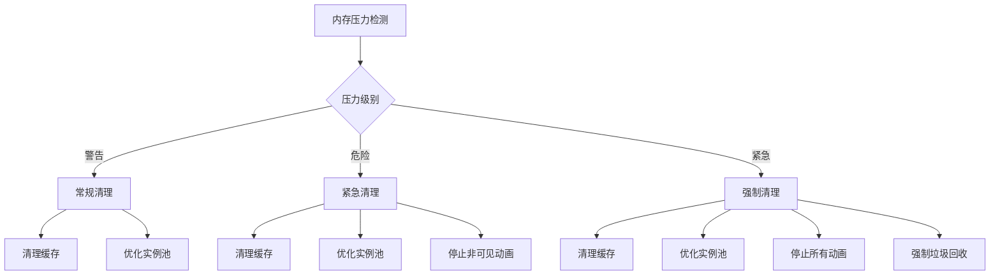

**图表来源**
- [MemoryManager.ts](file://packages/core/src/core/MemoryManager.ts#L163-L233)

**章节来源**
- [MemoryManager.ts](file://packages/core/src/core/MemoryManager.ts#L1-L381)

## 设备兼容性

### 设备检测系统

Lottie内置了强大的设备检测和兼容性系统，自动适配不同设备的性能特征。

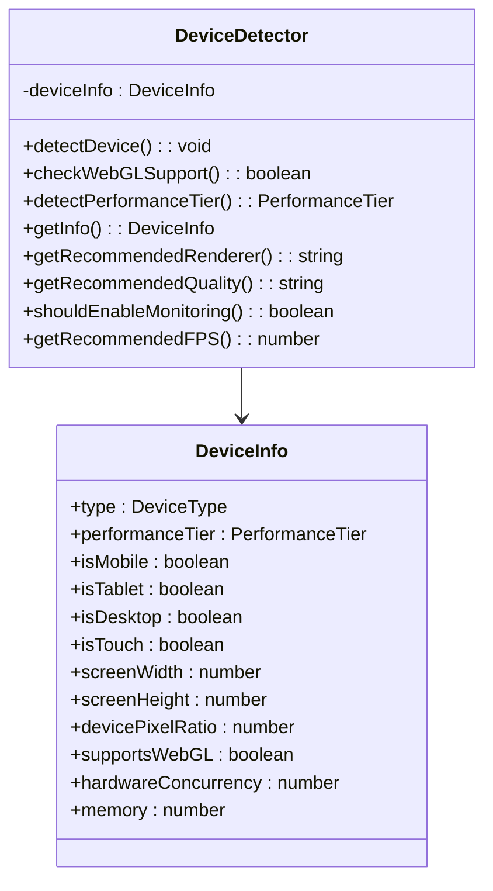

**图表来源**
- [device.ts](file://packages/core/src/utils/device.ts#L26-L282)

#### 设备类型分类

| 设备类型 | 屏幕尺寸 | 性能等级 | 推荐渲染器 | 帧率建议 |
|----------|----------|----------|------------|----------|
| Desktop | ≥1024px | 高/中 | SVG | 60fps |
| Tablet | ≥600px | 高/中/低 | Canvas/SVG | 45-60fps |
| Mobile | <600px | 中/低 | Canvas/HTML | 30-45fps |

#### 性能等级评估

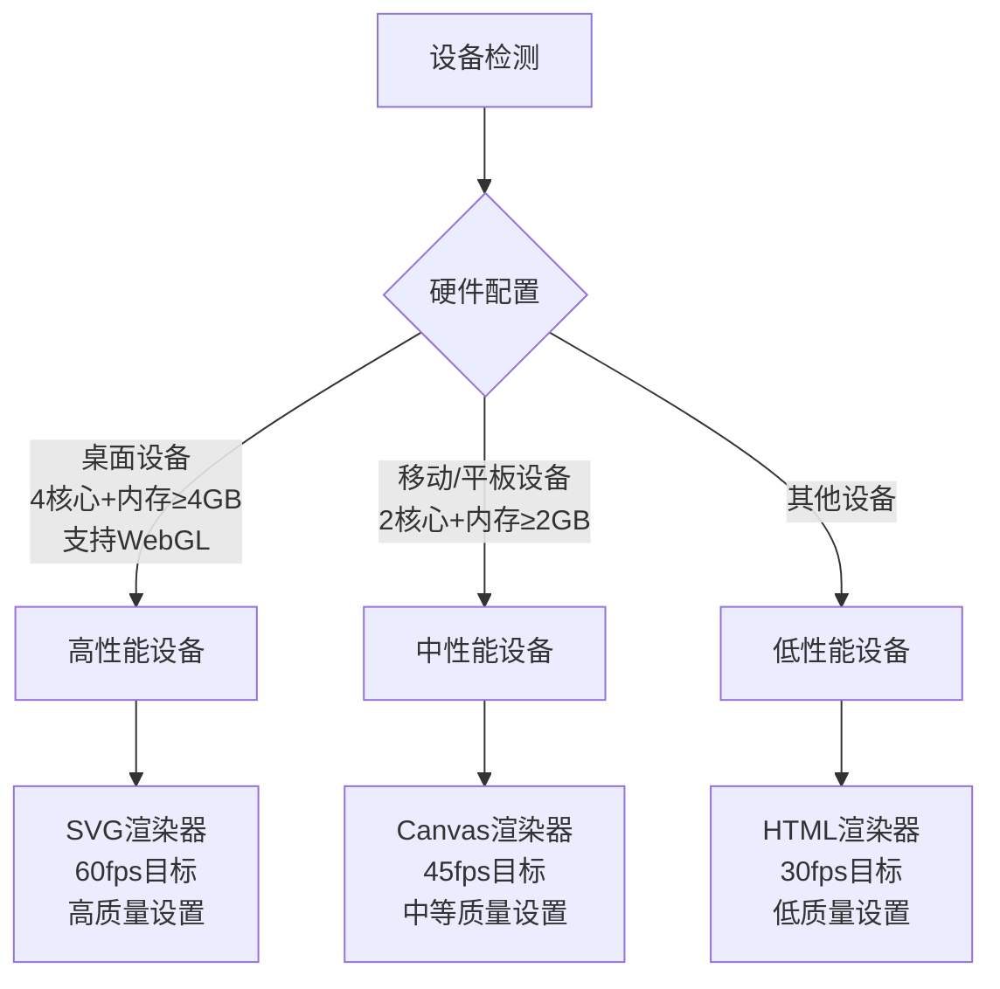

**图表来源**
- [device.ts](file://packages/core/src/utils/device.ts#L116-L142)

**章节来源**
- [device.ts](file://packages/core/src/utils/device.ts#L1-L282)

## 错误处理机制

### Worker错误处理

Lottie使用多层错误处理机制确保系统的稳定性和可靠性。

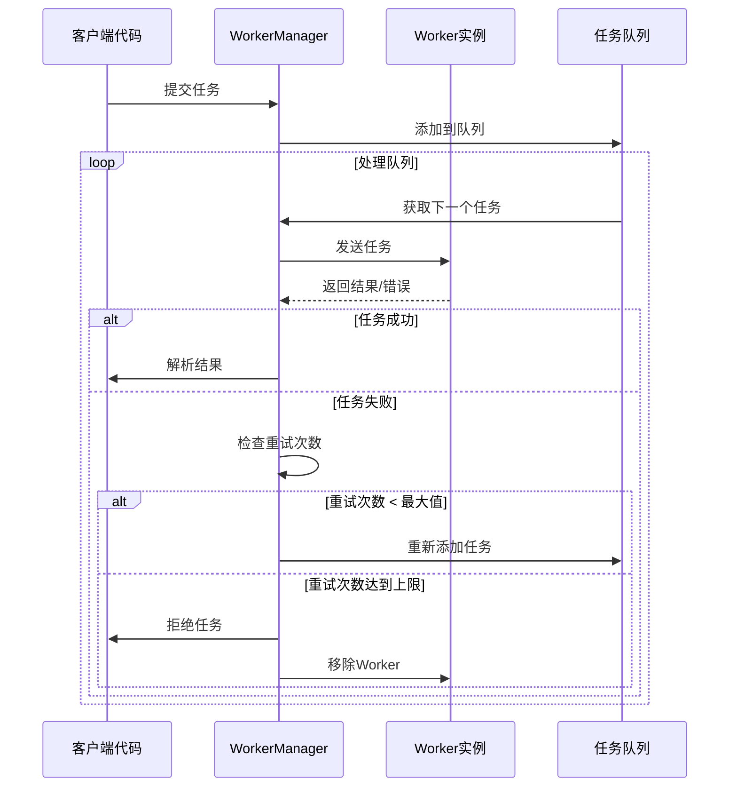

**图表来源**
- [WorkerManager.ts](file://packages/core/src/core/WorkerManager.ts#L299-L342)

#### 错误恢复策略

| 错误类型 | 检测方式 | 恢复策略 | 最大重试次数 |
|----------|----------|----------|--------------|
| Worker崩溃 | Worker消息丢失 | 创建新Worker | 3次 |
| 任务超时 | 超时检测 | 重新调度任务 | 2次 |
| 内存不足 | 内存使用监控 | 清理缓存 | 无限制 |
| 数据损坏 | 结果验证 | 重新计算 | 1次 |

**章节来源**
- [WorkerManager.ts](file://packages/core/src/core/WorkerManager.ts#L164-L342)

### WASM模块错误处理

WebAssembly模块的初始化和使用也包含了完善的错误处理机制。

#### WASM初始化流程

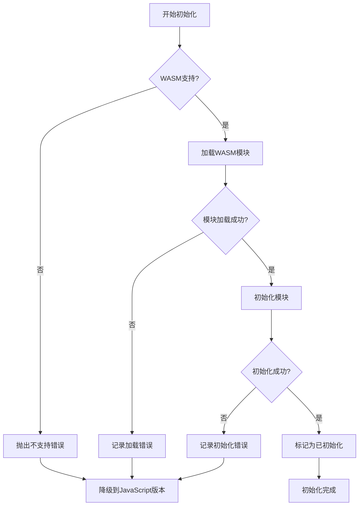

**图表来源**
- [WASMCore.ts](file://packages/core/src/core/WASMCore.ts#L16-L32)

**章节来源**
- [WASMCore.ts](file://packages/core/src/core/WASMCore.ts#L1-L426)

## 常见问题及解决方案

### 动画加载问题

#### 问题：动画无法加载
**症状**：控制台显示404错误或网络请求失败

**排查步骤**：
1. 检查文件路径是否正确
2. 确认文件是否存在且可访问
3. 验证CORS设置（如果是跨域请求）

**解决方案**：
```typescript
// 使用相对路径
const animation = createLottie({
  path: './animations/loading.json'
})

// 或使用绝对路径
const animation = createLottie({
  path: '/assets/animations/loading.json'
})
```

#### 问题：动画显示异常
**症状**：动画显示不完整或出现空白区域

**排查步骤**：
1. 检查容器元素的尺寸设置
2. 验证动画文件的宽高比例
3. 确认CSS样式冲突

**解决方案**：
```css
/* 确保容器有明确的尺寸 */
.lottie-container {
  width: 100%;
  height: 300px;
  overflow: hidden;
}

/* 防止样式冲突 */
.lottie-container > * {
  max-width: 100%;
  max-height: 100%;
}
```

### 性能问题

#### 问题：动画卡顿或掉帧
**症状**：FPS低于预期，动画不流畅

**诊断工具**：
```typescript
// 启用性能监控
const animation = createLottie({
  advanced: {
    enablePerformanceMonitor: true,
    performanceMonitorInterval: 1000
  },
  events: {
    performanceWarning: (metrics) => {
      console.warn('性能警告:', metrics)
    }
  }
})
```

**优化建议**：
1. 降低动画复杂度
2. 减少同时播放的动画数量
3. 使用合适的渲染器
4. 启用智能跳帧

#### 问题：内存使用过高
**症状**：页面内存占用持续增长

**监控和清理**：
```typescript
// 监控内存使用
import { memoryManager } from '@ldesign/lottie'

memoryManager.onMemoryPressure((event) => {
  console.warn('内存压力:', event)
  
  if (event.action === 'emergency') {
    // 执行紧急清理
    memoryManager.forceCleanup()
  }
})
```

### 兼容性问题

#### 问题：某些设备上动画不显示
**排查步骤**：
1. 检查设备的WebGL支持
2. 验证硬件性能是否达标
3. 确认浏览器兼容性

**解决方案**：
```typescript
// 自动检测设备能力
import { getRecommendedConfig } from '@ldesign/lottie'

const config = getRecommendedConfig()
const animation = createLottie({
  renderer: config.renderer,
  quality: config.quality,
  enablePerformanceMonitor: config.enableMonitoring
})
```

## 故障排除流程

### 1. 问题识别阶段

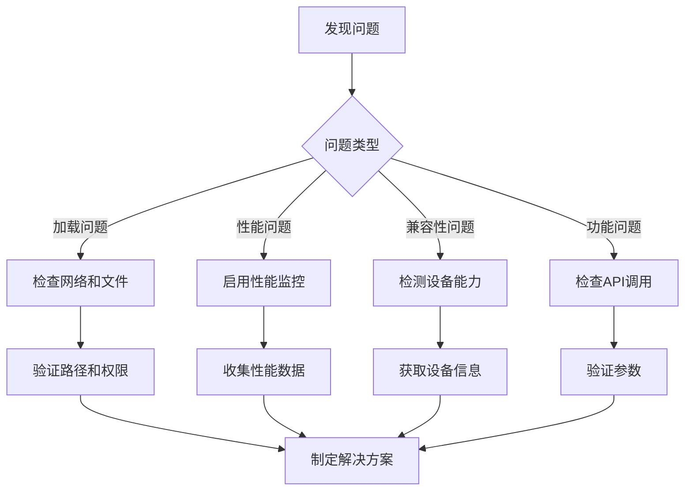

### 2. 诊断工具使用

| 问题类型 | 主要工具 | 辅助工具 | 输出格式 |
|----------|----------|----------|----------|
| 加载问题 | 控制台错误信息 | 网络面板 | 文本日志 |
| 性能问题 | 性能分析器 | 调试面板 | 数值报告 |
| 兼容性问题 | 设备检测器 | 浏览器兼容性表 | JSON配置 |
| 功能问题 | 日志系统 | 断点调试 | 结构化数据 |

### 3. 解决方案实施

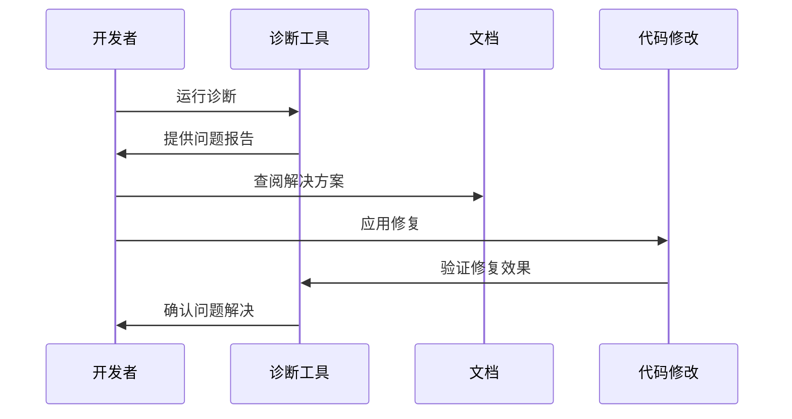

### 4. 验证和测试

**测试清单**：
- [ ] 动画正常加载和播放
- [ ] 性能指标恢复正常
- [ ] 内存使用稳定
- [ ] 设备兼容性良好
- [ ] 错误不再重现

## 最佳实践

### 开发阶段

1. **启用调试工具**
   ```typescript
   // 开发环境启用完整调试功能
   const debugPanel = new DebugPanel(animation, {
     showChart: true,
     updateInterval: 500
   })
   ```

2. **设置性能监控**
   ```typescript
   const animation = createLottie({
     advanced: {
       enablePerformanceMonitor: true,
       performanceMonitorInterval: 1000
     }
   })
   ```

3. **添加错误处理**
   ```typescript
   try {
     const animation = createLottie(config)
   } catch (error) {
     console.error('动画初始化失败:', error)
     // 提供降级方案
   }
   ```

### 生产环境

1. **监控和告警**
   ```typescript
   // 生产环境监控配置
   import { memoryManager, lottieManager } from '@ldesign/lottie'
   
   memoryManager.onMemoryPressure((event) => {
     if (event.action === 'emergency') {
       // 发送告警通知
       sendAlert('内存压力过大')
     }
   })
   ```

2. **优雅降级**
   ```typescript
   // 根据设备能力选择配置
   const deviceInfo = getDeviceInfo()
   const config = {
     ...(deviceInfo.performanceTier === 'low' && {
       renderer: 'html',
       quality: 'low',
       targetFPS: 30
     }),
     ...(deviceInfo.performanceTier === 'medium' && {
       renderer: 'canvas',
       quality: 'medium',
       targetFPS: 45
     }),
     ...(deviceInfo.performanceTier === 'high' && {
       renderer: 'svg',
       quality: 'high',
       targetFPS: 60
     })
   }
   ```

3. **资源清理**
   ```typescript
   // 组件卸载时清理资源
   useEffect(() => {
     return () => {
       if (animation) {
         animation.destroy()
       }
     }
   }, [])
   ```

### 性能优化建议

1. **合理使用缓存**
   ```typescript
   // 预加载常用动画
   await lottieManager.preload('common-animation.json')
   ```

2. **控制并发数量**
   ```typescript
   // 限制同时播放的动画数量
   const MAX_CONCURRENT_ANIMATIONS = 3
   
   function playAnimationWithLimit(animation) {
     if (activeAnimations.length >= MAX_CONCURRENT_ANIMATIONS) {
       return
     }
     
     activeAnimations.push(animation)
     animation.play()
     
     animation.on('complete', () => {
       const index = activeAnimations.indexOf(animation)
       if (index > -1) {
         activeAnimations.splice(index, 1)
       }
     })
   }
   ```

3. **智能暂停机制**
   ```typescript
   // 页面不可见时暂停动画
   document.addEventListener('visibilitychange', () => {
     if (document.hidden) {
       lottieManager.pauseAll()
     } else {
       lottieManager.resumeAll()
     }
   })
   ```

通过遵循这些故障排除指南和最佳实践，开发者可以有效地识别、诊断和解决Lottie动画库使用过程中遇到的各种问题，确保应用程序的稳定性和用户体验。