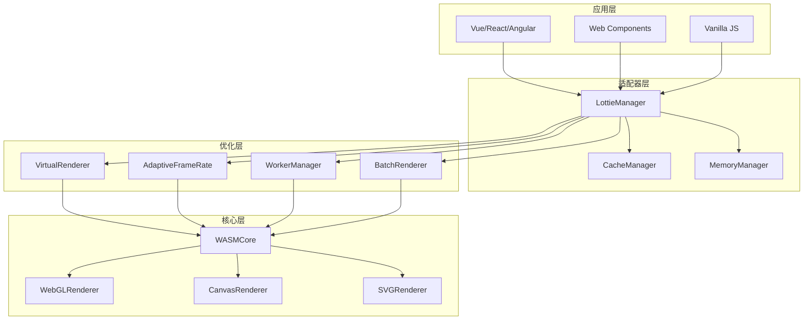
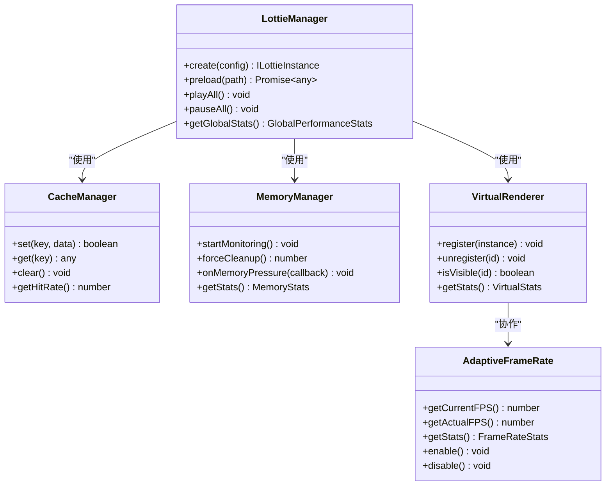

# 最佳实践

<cite>
**本文档引用的文件**
- [README.md](file://README.md)
- [USAGE_GUIDE.md](file://USAGE_GUIDE.md)
- [QUICK_START.md](file://QUICK_START.md)
- [PERFORMANCE_OPTIMIZATION_GUIDE.md](file://PERFORMANCE_OPTIMIZATION_GUIDE.md)
- [FRAMEWORK_ADAPTERS_GUIDE.md](file://FRAMEWORK_ADAPTERS_GUIDE.md)
- [packages/core/src/core/LottieManager.ts](file://packages/core/src/core/LottieManager.ts)
- [packages/core/src/core/CacheManager.ts](file://packages/core/src/core/CacheManager.ts)
- [packages/core/src/core/MemoryManager.ts](file://packages/core/src/core/MemoryManager.ts)
- [packages/core/src/core/VirtualRenderer.ts](file://packages/core/src/core/VirtualRenderer.ts)
- [packages/core/src/core/AdaptiveFrameRate.ts](file://packages/core/src/core/AdaptiveFrameRate.ts)
- [packages/core/src/core/WorkerManager.ts](file://packages/core/src/core/WorkerManager.ts)
- [packages/core/src/core/BatchRenderer.ts](file://packages/core/src/core/BatchRenderer.ts)
- [packages/core/src/utils/device.ts](file://packages/core/src/utils/device.ts)
- [packages/core/src/types/index.ts](file://packages/core/src/types/index.ts)
- [examples/vue-demo/src/App.vue](file://examples/vue-demo/src/App.vue)
- [examples/react-demo/src/App.tsx](file://examples/react-demo/src/App.tsx)
- [examples/angular-demo/src/app/app.component.ts](file://examples/angular-demo/src/app/app.component.ts)
</cite>

## 目录
1. [概述](#概述)
2. [核心架构设计](#核心架构设计)
3. [性能优化最佳实践](#性能优化最佳实践)
4. [框架集成最佳实践](#框架集成最佳实践)
5. [内存管理最佳实践](#内存管理最佳实践)
6. [缓存策略最佳实践](#缓存策略最佳实践)
7. [设备适配最佳实践](#设备适配最佳实践)
8. [错误处理与调试](#错误处理与调试)
9. [生产环境部署](#生产环境部署)
10. [常见问题解决方案](#常见问题解决方案)

## 概述

Lottie库提供了完整的动画解决方案，支持多种框架和平台。本最佳实践指南涵盖了从基础使用到高级优化的完整开发流程，帮助开发者构建高性能、可维护的动画应用。

### 核心特性概览

- **多框架支持**: Vue 3、React、Angular、Web Components、Vanilla JS
- **性能优化**: Web Worker加速、虚拟化渲染、智能内存管理
- **缓存系统**: LRU缓存、持久化存储、压缩算法
- **设备适配**: 自动检测、性能分级、响应式配置
- **开发体验**: TypeScript支持、完整API、丰富的示例

## 核心架构设计

### 整体架构图



**架构图来源**
- [packages/core/src/core/LottieManager.ts](file://packages/core/src/core/LottieManager.ts#L1-L504)
- [packages/core/src/core/CacheManager.ts](file://packages/core/src/core/CacheManager.ts#L1-L502)

### 核心组件关系



**类图来源**
- [packages/core/src/core/LottieManager.ts](file://packages/core/src/core/LottieManager.ts#L16-L504)
- [packages/core/src/core/CacheManager.ts](file://packages/core/src/core/CacheManager.ts#L21-L502)
- [packages/core/src/core/MemoryManager.ts](file://packages/core/src/core/MemoryManager.ts#L46-L381)

**章节来源**
- [packages/core/src/core/LottieManager.ts](file://packages/core/src/core/LottieManager.ts#L1-L504)
- [packages/core/src/core/CacheManager.ts](file://packages/core/src/core/CacheManager.ts#L1-L502)
- [packages/core/src/core/MemoryManager.ts](file://packages/core/src/core/MemoryManager.ts#L1-L381)

## 性能优化最佳实践

### Web Worker加速

Web Worker是提升动画性能的关键技术，特别适用于大型动画文件的解析和处理。

#### 基础配置

```typescript
import { workerManager } from '@ldesign/lottie'

// 初始化 Worker 池
await workerManager.init()

// 解析动画数据
const animationData = await workerManager.parseAnimation(jsonString, {
  validate: true,
  removeHiddenLayers: true,
  roundValues: true,
  precision: 2
})

// 压缩动画数据
const compressed = await workerManager.compressAnimation(animationData)
```

#### 高级配置

```typescript
import { WorkerManager } from '@ldesign/lottie'

const customWorkerManager = WorkerManager.getInstance({
  workerCount: 4,        // Worker 数量（默认为 CPU 核心数的一半）
  timeout: 30000,        // 任务超时时间（ms）
  enabled: true,         // 是否启用
  useSharedWorker: false, // 是否使用共享 Worker
  maxRetries: 3,         // 最大重试次数
  enablePriority: true   // 启用任务优先级
})
```

#### 性能监控

```typescript
// 获取 Worker 统计信息
const stats = workerManager.getStats()
console.log('总 Worker 数:', stats.totalWorkers)
console.log('可用 Worker 数:', stats.availableWorkers)
console.log('待处理任务:', stats.pendingTasks)
console.log('队列中的任务:', stats.queuedTasks)
console.log('平均处理时间:', stats.averageDuration.toFixed(2), 'ms')
```

### 虚拟化渲染

虚拟化渲染只渲染可视区域内的动画，大幅减少内存和CPU占用。

#### 基础使用

```typescript
import { createLottie, VirtualRenderer } from '@ldesign/lottie'

// 创建虚拟化渲染器
const virtualRenderer = new VirtualRenderer({
  rootMargin: '50px',     // 提前 50px 开始加载
  threshold: 0.1,         // 10% 可见时触发
  autoPause: true,        // 自动暂停不可见动画
  stopOnInvisible: false  // 暂停而非停止
})

// 创建动画实例并注册到虚拟化渲染器
const animations = []
for (let i = 0; i < 50; i++) {
  const anim = createLottie({
    container: `#lottie-${i}`,
    path: '/animation.json',
    autoplay: true
  })
  
  virtualRenderer.register(anim)
  animations.push(anim)
}

// 获取统计信息
setInterval(() => {
  const stats = virtualRenderer.getStats()
  console.log('可见:', stats.visibleInstances)
  console.log('隐藏:', stats.hiddenInstances)
  console.log('节省内存:', stats.memorySaved, 'MB')
}, 1000)
```

#### 实际应用场景

```typescript
import { createLottie, VirtualRenderer } from '@ldesign/lottie'

class AnimationList {
  private virtualRenderer: VirtualRenderer
  private animations: Map<number, ILottieInstance> = new Map()

  constructor() {
    this.virtualRenderer = new VirtualRenderer({
      rootMargin: '100px',  // 提前 100px 加载
      threshold: 0.1,
      autoPause: true,
      stopOnInvisible: true  // 完全停止节省更多资源
    })
  }

  renderItem(index: number, container: HTMLElement) {
    const animation = createLottie({
      container,
      path: `/animations/item-${index}.json`,
      autoplay: true,
      loop: true
    })

    // 注册虚拟化渲染
    this.virtualRenderer.register(animation)
    this.animations.set(index, animation)

    return animation
  }

  removeItem(index: number) {
    const animation = this.animations.get(index)
    if (animation) {
      this.virtualRenderer.unregister(animation.id)
      animation.destroy()
      this.animations.delete(index)
    }
  }

  getStats() {
    return this.virtualRenderer.getStats()
  }
}
```

### 智能内存管理

内存管理器监控内存使用情况，在内存压力大时自动清理和优化。

#### 基础配置

```typescript
import { memoryManager } from '@ldesign/lottie'

// 开始监控（自动启动）
memoryManager.startMonitoring()

// 监听内存压力事件
memoryManager.onMemoryPressure((event) => {
  console.log('内存压力:', event.action)
  console.log('内存使用:', event.stats.used, 'MB')
  console.log('状态:', event.stats.status)
  
  if (event.action === 'emergency') {
    // 紧急情况，可以采取额外措施
    console.warn('Critical memory situation!')
  }
})

// 获取内存统计
const stats = memoryManager.getStats()
console.log('已使用:', stats.used, 'MB')
console.log('限制:', stats.limit, 'MB')
console.log('百分比:', stats.percentage * 100, '%')
console.log('状态:', stats.status)
```

#### 高级配置

```typescript
import { MemoryManager } from '@ldesign/lottie'

const customMemoryManager = MemoryManager.getInstance({
  memoryLimit: 300,          // 内存限制 300MB
  warningThreshold: 0.7,     // 70% 时警告
  dangerThreshold: 0.85,     // 85% 时危险
  monitorInterval: 5000,     // 每 5 秒检查
  enableAutoCleanup: true    // 启用自动清理
})
```

### 批量渲染优化

合并多个动画的渲染周期，减少重复计算。

#### 基础使用

```typescript
import { batchRenderer } from '@ldesign/lottie'

// BatchRenderer 会自动处理，无需手动调用

// 获取统计信息
setInterval(() => {
  const stats = batchRenderer.getStats()
  console.log('队列大小:', stats.queueSize)
  console.log('帧数:', stats.frameCount)
  console.log('正在渲染:', stats.isRendering)
}, 1000)
```

#### 高级配置

```typescript
import { BatchRenderer } from '@ldesign/lottie'

const customBatchRenderer = BatchRenderer.getInstance({
  maxBatchSize: 50,          // 每帧最多渲染 50 个实例
  useIdleCallback: true,     // 使用 requestIdleCallback
  enablePriorityQueue: true  // 启用优先级队列
})
```

### 自适应帧率

根据设备性能动态调整动画帧率。

#### 基础使用

```typescript
import { createLottie, AdaptiveFrameRate } from '@ldesign/lottie'

// 创建动画实例
const animation = createLottie({
  container: '#lottie',
  path: '/animation.json',
  autoplay: true
})

// 启用自适应帧率
const adaptiveFPS = new AdaptiveFrameRate(animation, {
  targetFPS: 60,
  minFPS: 15,
  maxFPS: 60,
  adjustInterval: 1000
})

// 获取统计信息
setInterval(() => {
  const stats = adaptiveFPS.getStats()
  console.log('当前 FPS:', stats.currentFPS)
  console.log('实际 FPS:', stats.actualFPS)
  console.log('状态:', stats.status)
}, 1000)
```

**章节来源**
- [PERFORMANCE_OPTIMIZATION_GUIDE.md](file://PERFORMANCE_OPTIMIZATION_GUIDE.md#L1-L800)
- [packages/core/src/core/WorkerManager.ts](file://packages/core/src/core/WorkerManager.ts#L1-L612)
- [packages/core/src/core/VirtualRenderer.ts](file://packages/core/src/core/VirtualRenderer.ts#L1-L329)
- [packages/core/src/core/MemoryManager.ts](file://packages/core/src/core/MemoryManager.ts#L1-L381)
- [packages/core/src/core/BatchRenderer.ts](file://packages/core/src/core/BatchRenderer.ts#L1-L322)
- [packages/core/src/core/AdaptiveFrameRate.ts](file://packages/core/src/core/AdaptiveFrameRate.ts#L1-L329)

## 框架集成最佳实践

### Vue 3 集成

Vue 3提供了9种不同的使用方式，满足不同场景需求。

#### 方式1：基础组件

```vue
<template>
  <div>
    <LottieAnimation
      path="/animation.json"
      :loop="true"
      :autoplay="true"
      :speed="1.5"
      width="400px"
      height="400px"
      renderer="svg"
      @ready="onReady"
      @complete="onComplete"
      ref="animRef"
    />
  </div>
</template>

<script setup lang="ts">
import { ref } from 'vue'
import { LottieAnimation } from '@ldesign/lottie/vue'

const animRef = ref(null)

const onReady = () => console.log('动画加载完成')
const onComplete = () => console.log('动画播放完成')

// 通过 ref 调用方法
const playAnimation = () => {
  animRef.value?.play()
}
</script>
```

#### 方式2：useLottie Hook

```vue
<template>
  <div>
    <div ref="containerRef" class="animation" />
    <button @click="play">播放</button>
    <button @click="pause">暂停</button>
    <div>状态: {{ state }}</div>
    <div>播放中: {{ isPlaying }}</div>
  </div>
</template>

<script setup lang="ts">
import { ref } from 'vue'
import { useLottie } from '@ldesign/lottie/vue'

const containerRef = ref(null)

const {
  instance,
  state,
  isPlaying,
  isLoaded,
  play,
  pause,
  stop,
  reset,
  setSpeed,
  setDirection,
  goToFrame,
  destroy
} = useLottie({
  container: containerRef,
  path: '/animation.json',
  loop: true,
  autoplay: true
})

// 控制速度
const handleSpeedChange = (speed: number) => {
  setSpeed(speed)
}

// 跳转到指定帧
const jumpTo = (frame: number) => {
  goToFrame(frame, true) // true 表示跳转后播放
}
</script>
```

#### 方式3：指令使用

```vue
<template>
  <!-- 直接传路径 -->
  <div v-lottie="'/animation.json'" style="width: 300px; height: 300px;" />
  
  <!-- 传配置对象 -->
  <div 
    v-lottie="{ path: '/animation.json', loop: true, speed: 2 }"
    style="width: 300px; height: 300px;"
  />
</template>
```

### React 集成

React提供了5种不同的使用方式。

#### 方式1：基础组件

```tsx
import { Lottie } from '@ldesign/lottie/react'

function App() {
  const animRef = useRef(null)

  return (
    <>
      <Lottie
        ref={animRef}
        path="/animation.json"
        loop={true}
        autoplay={true}
        speed={1.5}
        style={{ width: 400, height: 400 }}
        onReady={() => console.log('Ready')}
        onComplete={() => console.log('Complete')}
      />
      
      <button onClick={() => animRef.current?.play()}>
        播放
      </button>
    </>
  )
}
```

#### 方式2：useLottie Hook

```tsx
import { useLottie } from '@ldesign/lottie/react'

function MyComponent() {
  const {
    containerRef,
    instance,
    state,
    isPlaying,
    play,
    pause,
    stop,
    setSpeed
  } = useLottie({
    path: '/animation.json',
    loop: true,
    autoplay: true
  })

  return (
    <div>
      <div ref={containerRef} style={{ width: 400, height: 400 }} />
      <button onClick={play}>播放</button>
      <button onClick={pause}>暂停</button>
      <div>状态: {state}</div>
    </div>
  )
}
```

### Angular 集成

Angular提供了简洁的组件使用方式。

```typescript
import { Component } from '@angular/core';
import { LottieComponent } from '@ldesign/lottie-angular';

@Component({
  selector: 'app-root',
  standalone: true,
  imports: [LottieComponent],
  template: `
    <div class="container">
      <h1>Angular Lottie Demo</h1>
      
      <div class="demo-section">
        <h2>Controlled Animation</h2>
        <lottie
          #lottieAnimation
          path="https://lottie.host/4db68bbd-31f6-4cd8-84eb-189de081159a/IGmMCqhzpt.json"
          [autoplay]="false"
          [loop]="true"
          [style.width.px]="300"
          [style.height.px]="300"
          (complete)="onComplete()"
        />
        <div class="controls">
          <button (click)="lottieAnimation.play()">Play</button>
          <button (click)="lottieAnimation.pause()">Pause</button>
          <button (click)="lottieAnimation.stop()">Stop</button>
        </div>
      </div>
    </div>
  `
})
export class AppComponent {
  onComplete() {
    console.log('Animation completed!');
  }
}
```

### Web Components 最佳实践

Web Components提供框架无关的使用方式。

```html
<!-- 基础用法 -->
<lottie-animation 
  src="/animation.json"
  loop="true"
  autoplay="true"
  renderer="svg"
  speed="1.5"
></lottie-animation>

<!-- JavaScript 控制 -->
<script>
  const lottie = document.querySelector('lottie-animation')
  
  lottie.play()
  lottie.pause()
  lottie.stop()
  lottie.setSpeed(2)
  
  lottie.addEventListener('ready', () => {
    console.log('动画加载完成')
  })
  
  lottie.addEventListener('complete', () => {
    console.log('动画播放完成')
  })
</script>
```

**章节来源**
- [FRAMEWORK_ADAPTERS_GUIDE.md](file://FRAMEWORK_ADAPTERS_GUIDE.md#L1-L800)
- [examples/vue-demo/src/App.vue](file://examples/vue-demo/src/App.vue#L1-L123)
- [examples/react-demo/src/App.tsx](file://examples/react-demo/src/App.tsx#L1-L196)
- [examples/angular-demo/src/app/app.component.ts](file://examples/angular-demo/src/app/app.component.ts#L1-L144)

## 内存管理最佳实践

### 内存监控仪表盘

```typescript
import { memoryManager } from '@ldesign/lottie'

class MemoryDashboard {
  private updateInterval: number

  constructor(containerEl: HTMLElement) {
    this.render(containerEl)
    this.startUpdating()
    
    // 监听内存压力
    memoryManager.onMemoryPressure((event) => {
      this.showAlert(event)
    })
  }

  private render(container: HTMLElement) {
    container.innerHTML = `
      <div class="memory-dashboard">
        <div class="stat">
          <span class="label">已使用:</span>
          <span class="value" id="memory-used">0 MB</span>
        </div>
        <div class="stat">
          <span class="label">限制:</span>
          <span class="value" id="memory-limit">0 MB</span>
        </div>
        <div class="stat">
          <span class="label">状态:</span>
          <span class="value" id="memory-status">healthy</span>
        </div>
        <div class="progress">
          <div class="bar" id="memory-bar" style="width: 0%"></div>
        </div>
        <button id="cleanup-btn">强制清理</button>
      </div>
    `

    // 绑定清理按钮
    container.querySelector('#cleanup-btn')?.addEventListener('click', () => {
      const cleaned = memoryManager.forceCleanup()
      alert(`清理了 ${cleaned} 项`)
    })
  }

  private startUpdating() {
    this.updateInterval = window.setInterval(() => {
      const stats = memoryManager.getStats()
      
      document.getElementById('memory-used')!.textContent = `${stats.used} MB`
      document.getElementById('memory-limit')!.textContent = `${stats.limit} MB`
      document.getElementById('memory-status')!.textContent = stats.status
      
      const bar = document.getElementById('memory-bar')!
      bar.style.width = `${stats.percentage * 100}%`
      bar.className = `bar ${stats.status}`
    }, 1000)
  }

  private showAlert(event: MemoryPressureEvent) {
    const message = `内存 ${event.action}: ${event.stats.used}MB / ${event.stats.limit}MB`
    console.warn(message)
    
    // 显示通知
    if ('Notification' in window && Notification.permission === 'granted') {
      new Notification('内存警告', { body: message })
    }
  }

  destroy() {
    clearInterval(this.updateInterval)
  }
}

// 使用
const dashboard = new MemoryDashboard(document.getElementById('dashboard')!)
```

### 自动降级策略

```typescript
import { memoryManager, lottieManager } from '@ldesign/lottie'

// 根据内存状况自动调整质量
memoryManager.onMemoryPressure((event) => {
  const { status } = event.stats

  switch (status) {
    case 'warning':
      // 降低质量
      lottieManager.getAll().forEach(instance => {
        if (instance.config.quality !== 'low') {
          instance.updateConfig({ quality: 'medium' })
        }
      })
      break

    case 'danger':
      // 进一步降低
      lottieManager.getAll().forEach(instance => {
        instance.updateConfig({ quality: 'low' })
      })
      break

    case 'critical':
      // 停止非关键动画
      lottieManager.getAll().forEach(instance => {
        if (!instance.container?.classList.contains('critical')) {
          instance.stop()
        }
      })
      break
  }
})
```

### 内存泄漏预防

```typescript
// 正确的组件销毁模式
class AnimationComponent {
  private animation: ILottieInstance | null = null
  private memoryManager: MemoryManager

  constructor(container: HTMLElement) {
    this.memoryManager = MemoryManager.getInstance()
    
    // 创建动画
    this.animation = createLottie({
      container,
      path: '/animation.json',
      autoplay: true
    })

    // 注册内存监控
    this.memoryManager.registerInstance(this.animation, 5) // 估计 5MB
  }

  destroy() {
    if (this.animation) {
      // 清理内存
      this.memoryManager.unregisterInstance(this.animation)
      this.animation.destroy()
      this.animation = null
    }
  }
}
```

**章节来源**
- [packages/core/src/core/MemoryManager.ts](file://packages/core/src/core/MemoryManager.ts#L1-L381)

## 缓存策略最佳实践

### 智能缓存配置

```typescript
import { LottieManager } from '@ldesign/lottie'

const manager = LottieManager.getInstance({
  cache: {
    enabled: true,
    maxSize: 100, // MB
    ttl: 3600000 // 1小时
  }
})

// 动画数据会自动缓存
const animation = manager.create({
  path: 'animation.json',
  advanced: {
    enableCache: true,
    cacheKey: 'my-animation' // 自定义缓存键
  }
})

// 获取缓存统计
const cacheStats = manager.getCacheStats()
console.log('缓存大小:', cacheStats.size, 'MB')
console.log('命中率:', cacheStats.hitRate)
```

### 缓存预热策略

```typescript
import { lottieManager } from '@ldesign/lottie'

// 预加载关键动画
await lottieManager.preloadBatch([
  'hero-animation.json',
  'loading-spinner.json',
  'success-animation.json'
])

// 批量预加载
const animations = [
  { path: 'anim1.json', key: 'anim1' },
  { path: 'anim2.json', key: 'anim2' },
  { path: 'anim3.json', key: 'anim3' }
]

for (const anim of animations) {
  await lottieManager.preload(anim.path, anim.key)
}
```

### 缓存清理策略

```typescript
// 定期清理过期缓存
setInterval(() => {
  const cleaned = lottieManager.cacheManager.cleanExpired()
  if (cleaned > 0) {
    console.log(`清理了 ${cleaned} 个过期缓存项`)
  }
}, 60000) // 每分钟清理一次

// 手动清空缓存
const handleClearCache = async () => {
  lottieManager.clearCache()
  console.log('缓存已清空')
}
```

### 缓存命中率监控

```typescript
// 监控缓存性能
const monitorCachePerformance = () => {
  const stats = lottieManager.getCacheStats()
  
  if (stats.hitRate < 0.8) {
    console.warn('缓存命中率较低，考虑增加缓存大小或预加载更多动画')
  }
  
  if (stats.size > stats.maxSize * 0.9) {
    console.warn('缓存接近上限，考虑清理旧数据')
  }
}

// 每5秒检查一次
setInterval(monitorCachePerformance, 5000)
```

**章节来源**
- [packages/core/src/core/CacheManager.ts](file://packages/core/src/core/CacheManager.ts#L1-L502)
- [packages/core/src/core/LottieManager.ts](file://packages/core/src/core/LottieManager.ts#L310-L350)

## 设备适配最佳实践

### 自动设备检测

```typescript
import { getDeviceInfo, getRecommendedConfig } from '@ldesign/lottie'

// 获取设备信息
const deviceInfo = getDeviceInfo()
console.log('设备类型:', deviceInfo.type)
console.log('性能等级:', deviceInfo.performanceTier)
console.log('是否移动端:', deviceInfo.isMobile)
console.log('硬件并发数:', deviceInfo.hardwareConcurrency)

// 获取推荐配置
const recommended = getRecommendedConfig()
console.log('推荐渲染器:', recommended.renderer)
console.log('推荐质量:', recommended.quality)
console.log('是否启用监控:', recommended.enableMonitoring)
console.log('推荐帧率:', recommended.targetFPS)
```

### 响应式配置

```typescript
import { DeviceDetector, getRecommendedConfig } from '@ldesign/lottie'

class ResponsiveLottieConfig {
  private deviceDetector: DeviceDetector
  
  constructor() {
    this.deviceDetector = DeviceDetector.getInstance()
  }

  getResponsiveConfig(baseConfig: LottieConfig): LottieConfig {
    const deviceInfo = this.deviceDetector.getInfo()
    const recommended = getRecommendedConfig()
    
    // 基于设备性能调整配置
    const config: LottieConfig = {
      ...baseConfig,
      renderer: baseConfig.renderer || recommended.renderer,
      quality: baseConfig.quality || recommended.quality,
      advanced: {
        ...baseConfig.advanced,
        enablePerformanceMonitor: baseConfig.advanced?.enablePerformanceMonitor || recommended.enableMonitoring,
        targetFPS: baseConfig.advanced?.targetFPS || recommended.targetFPS
      }
    }

    // 移动设备特殊处理
    if (deviceInfo.isMobile) {
      // 降低质量以提升性能
      if (config.quality === 'high') {
        config.quality = 'medium'
      }
      
      // 使用 Canvas 渲染器
      config.renderer = 'canvas'
      
      // 启用性能监控
      config.advanced = {
        ...config.advanced,
        enablePerformanceMonitor: true
      }
    }

    // 低性能设备进一步优化
    if (deviceInfo.performanceTier === 'low') {
      // 禁用复杂特效
      config.advanced = {
        ...config.advanced,
        enableSmartFrameSkip: true,
        useOffscreenCanvas: false
      }
    }

    return config
  }
}
```

### 设备特定优化

```typescript
import { DeviceDetector, AdaptiveFrameRate } from '@ldesign/lottie'

class DeviceOptimization {
  private deviceDetector: DeviceDetector
  private adaptiveFPSMap: Map<string, AdaptiveFrameRate> = new Map()

  constructor() {
    this.deviceDetector = DeviceDetector.getInstance()
  }

  optimizeForDevice(animation: ILottieInstance, id: string) {
    const deviceInfo = this.deviceDetector.getInfo()
    
    // 根据设备性能设置不同的帧率目标
    let targetFPS = 60
    let minFPS = 30

    if (deviceInfo.hardwareConcurrency <= 2) {
      // 低端设备
      targetFPS = 30
      minFPS = 15
    } else if (deviceInfo.hardwareConcurrency <= 4) {
      // 中端设备
      targetFPS = 45
      minFPS = 20
    }

    // 启用自适应帧率
    const adaptiveFPS = new AdaptiveFrameRate(animation, {
      targetFPS,
      minFPS,
      maxFPS: 60,
      adjustInterval: 1000
    })

    this.adaptiveFPSMap.set(id, adaptiveFPS)
  }

  cleanup() {
    this.adaptiveFPSMap.forEach(fps => fps.destroy())
    this.adaptiveFPSMap.clear()
  }
}
```

### 渲染器选择策略

```typescript
import { DeviceDetector } from '@ldesign/lottie'

const selectRenderer = (animationData: any): 'svg' | 'canvas' | 'html' => {
  const deviceInfo = DeviceDetector.getInstance().getInfo()
  
  // 移动设备优先使用 Canvas（性能更好）
  if (deviceInfo.isMobile) {
    return deviceInfo.performanceTier === 'low' ? 'html' : 'canvas'
  }
  
  // 平板根据性能选择
  if (deviceInfo.isTablet) {
    return deviceInfo.performanceTier === 'high' ? 'svg' : 'canvas'
  }
  
  // 桌面设备默认 SVG（质量最好）
  return 'svg'
}
```

**章节来源**
- [packages/core/src/utils/device.ts](file://packages/core/src/utils/device.ts#L1-L282)

## 错误处理与调试

### 性能监控与警告

```typescript
import { createLottie } from '@ldesign/lottie'

const animation = createLottie({
  container: '#lottie',
  path: 'animation.json',
  advanced: {
    enablePerformanceMonitor: true,
    performanceMonitorInterval: 1000
  },
  events: {
    performanceWarning: (metrics) => {
      console.log('FPS:', metrics.fps)
      console.log('内存:', metrics.memory, 'MB')
      console.log('帧数:', metrics.totalFrames)
      
      // 根据性能指标采取行动
      if (metrics.fps < 30) {
        console.warn('FPS 低于 30，考虑降低质量')
        animation.updateConfig({ quality: 'medium' })
      }
      
      if (metrics.memory > 200) {
        console.warn('内存使用过高，考虑清理缓存')
        // 手动清理缓存
        animation.cacheManager?.clear()
      }
    }
  }
})
```

### 错误边界处理

```typescript
import { createLottie } from '@ldesign/lottie'

class SafeLottieManager {
  private animations: Map<string, ILottieInstance> = new Map()
  
  createSafeAnimation(id: string, config: LottieConfig): ILottieInstance | null {
    try {
      const animation = createLottie({
        ...config,
        events: {
          ...config.events,
          data_failed: (error) => {
            console.error(`动画加载失败 ${id}:`, error)
            this.handleError(id, error)
          },
          error: (error) => {
            console.error(`动画运行错误 ${id}:`, error)
            this.handleError(id, error)
          }
        }
      })
      
      this.animations.set(id, animation)
      return animation
    } catch (error) {
      console.error(`创建动画失败 ${id}:`, error)
      return null
    }
  }
  
  private handleError(id: string, error: Error) {
    // 错误恢复策略
    const animation = this.animations.get(id)
    if (animation) {
      // 尝试重新加载
      animation.load().catch(() => {
        // 如果重新加载也失败，降级到简单动画
        this.fallbackToSimple(id)
      })
    }
  }
  
  private fallbackToSimple(id: string) {
    // 提供备用方案
    console.warn(`动画 ${id} 降级到简单版本`)
  }
}
```

### 调试工具集成

```typescript
// 调试面板
class LottieDebugPanel {
  private panel: HTMLElement
  
  constructor() {
    this.panel = this.createPanel()
  }
  
  private createPanel(): HTMLElement {
    const panel = document.createElement('div')
    panel.style.cssText = `
      position: fixed;
      bottom: 0;
      left: 0;
      right: 0;
      background: rgba(0, 0, 0, 0.8);
      color: white;
      padding: 10px;
      font-family: monospace;
      z-index: 1000;
      overflow-y: auto;
      max-height: 30vh;
    `
    
    document.body.appendChild(panel)
    return panel
  }
  
  log(message: string, type: 'info' | 'warn' | 'error' = 'info') {
    const timestamp = new Date().toISOString()
    const formattedMessage = `[${timestamp}] ${message}`
    
    const logEntry = document.createElement('div')
    logEntry.textContent = formattedMessage
    
    switch (type) {
      case 'warn':
        logEntry.style.color = 'yellow'
        break
      case 'error':
        logEntry.style.color = 'red'
        break
    }
    
    this.panel.appendChild(logEntry)
    this.panel.scrollTop = this.panel.scrollHeight
  }
  
  destroy() {
    this.panel.remove()
  }
}

// 使用调试面板
const debugPanel = new LottieDebugPanel()

// 在动画事件中使用
const animation = createLottie({
  container: '#lottie',
  path: 'animation.json',
  events: {
    ready: () => debugPanel.log('动画就绪'),
    complete: () => debugPanel.log('动画完成'),
    error: (error) => debugPanel.log(`错误: ${error.message}`, 'error')
  }
})
```

## 生产环境部署

### 构建优化

```typescript
// webpack 配置示例
module.exports = {
  optimization: {
    splitChunks: {
      chunks: 'all',
      cacheGroups: {
        lottie: {
          test: /[\\/]node_modules[\\/]@ldesign[\\/]/,
          name: 'lottie',
          chunks: 'all',
          priority: 10
        }
      }
    }
  },
  
  // 生产环境代码分割
  experiments: {
    lazyCompilation: true
  }
}
```

### CDN 部署策略

```typescript
// CDN 加载策略
const loadLottieFromCDN = async () => {
  // 检查本地缓存
  if (localStorage.getItem('lottie-version') === '1.1.0') {
    return import('@ldesign/lottie')
  }
  
  // 从 CDN 加载
  const script = document.createElement('script')
  script.src = 'https://cdn.jsdelivr.net/npm/@ldesign/lottie@1.1.0/dist/index.min.js'
  document.head.appendChild(script)
  
  // 等待加载完成
  return new Promise<typeof import('@ldesign/lottie')>((resolve) => {
    script.onload = () => {
      localStorage.setItem('lottie-version', '1.1.0')
      resolve(window.ldesignLottie)
    }
  })
}
```

### 服务端渲染优化

```typescript
// Next.js 示例
import dynamic from 'next/dynamic'

const LottieAnimation = dynamic(
  () => import('@ldesign/lottie-react').then(mod => mod.Lottie),
  { 
    ssr: false,
    loading: () => <div>Loading animation...</div>
  }
)

export default function Page() {
  return (
    <div>
      <LottieAnimation
        path="/animation.json"
        loop={true}
        autoplay={true}
      />
    </div>
  )
}
```

### 性能监控集成

```typescript
// 性能监控埋点
class PerformanceMonitor {
  private metrics: PerformanceEntry[] = []
  
  start() {
    if ('performance' in window) {
      this.metrics = performance.getEntriesByType('navigation') as PerformanceEntry[]
    }
  }
  
  captureAnimationMetrics(animation: ILottieInstance) {
    if ('performance' in window) {
      const navigationMetrics = performance.getEntriesByType('navigation') as PerformanceEntry[]
      const paintMetrics = performance.getEntriesByType('paint') as PerformanceEntry[]
      
      const metrics = {
        navigation: navigationMetrics,
        paint: paintMetrics,
        animation: animation.getMetrics(),
        timestamp: Date.now()
      }
      
      // 发送到分析服务
      this.sendMetrics(metrics)
    }
  }
  
  private sendMetrics(metrics: any) {
    // 发送到分析服务
    console.log('Performance Metrics:', metrics)
  }
}
```

## 常见问题解决方案

### 动画不显示

```typescript
// 诊断步骤
const diagnoseAnimationIssue = (container: HTMLElement, path: string) => {
  // 1. 检查容器
  if (!container) {
    console.error('容器元素不存在')
    return false
  }
  
  // 2. 检查尺寸
  const rect = container.getBoundingClientRect()
  if (rect.width === 0 || rect.height === 0) {
    console.error('容器没有尺寸，请设置宽度和高度')
    return false
  }
  
  // 3. 检查路径
  if (!path) {
    console.error('缺少动画路径')
    return false
  }
  
  // 4. 检查网络
  fetch(path)
    .then(response => {
      if (!response.ok) {
        console.error('动画文件加载失败:', response.status)
      }
    })
    .catch(error => {
      console.error('网络错误:', error)
    })
  
  return true
}
```

### 性能问题

```typescript
// 性能诊断
const diagnosePerformance = () => {
  const stats = lottieManager.getGlobalStats()
  
  console.log('性能诊断:')
  console.log('- 总实例数:', stats.totalInstances)
  console.log('- 活跃实例:', stats.activeInstances)
  console.log('- 平均 FPS:', stats.averageFps)
  console.log('- 总内存:', stats.totalMemory, 'MB')
  console.log('- 缓存命中率:', stats.cacheHitRate)
  
  // 性能优化建议
  const suggestions = []
  
  if (stats.activeInstances > 10) {
    suggestions.push('考虑使用虚拟化渲染减少同时播放的动画数量')
  }
  
  if (stats.averageFps < 30) {
    suggestions.push('启用自适应帧率或降低动画质量')
  }
  
  if (stats.cacheHitRate < 0.8) {
    suggestions.push('增加缓存预热或扩大缓存大小')
  }
  
  if (suggestions.length > 0) {
    console.log('\n优化建议:')
    suggestions.forEach((suggestion, index) => {
      console.log(`${index + 1}. ${suggestion}`)
    })
  }
}
```

### TypeScript 类型错误

```typescript
// 类型安全的最佳实践
interface TypedLottieProps {
  path: string
  loop?: boolean
  autoplay?: boolean
  speed?: number
  className?: string
  style?: React.CSSProperties
  onComplete?: () => void
  onError?: (error: Error) => void
}

const SafeLottie: React.FC<TypedLottieProps> = ({
  path,
  loop = true,
  autoplay = true,
  speed = 1,
  className,
  style,
  onComplete,
  onError
}) => {
  const { containerRef, instance, isPlaying } = useLottie({
    path,
    loop,
    autoplay,
    speed,
    events: {
      complete: onComplete,
      error: onError
    }
  })

  return (
    <div
      ref={containerRef}
      className={className}
      style={{
        width: '100%',
        height: '100%',
        ...style
      }}
    />
  )
}
```

### 内存泄漏预防

```typescript
// React 组件中的内存泄漏预防
import { useEffect, useRef } from 'react'
import { useLottie } from '@ldesign/lottie-react'

export function AnimatedComponent() {
  const { containerRef, instance, destroy } = useLottie({
    path: '/animation.json',
    autoplay: true
  })
  
  // 确保组件卸载时清理资源
  useEffect(() => {
    return () => {
      destroy()
    }
  }, [destroy])
  
  return <div ref={containerRef} />
}
```

**章节来源**
- [USAGE_GUIDE.md](file://USAGE_GUIDE.md#L316-L346)
- [QUICK_START.md](file://QUICK_START.md#L235-L274)

## 结论

Lottie库提供了完整的动画解决方案，通过合理运用本指南中的最佳实践，可以构建高性能、可维护的动画应用。关键要点包括：

1. **性能优化**: 充分利用Web Worker、虚拟化渲染、智能内存管理等技术
2. **设备适配**: 根据设备性能自动调整配置和渲染策略
3. **缓存策略**: 实施智能缓存和预热策略提升用户体验
4. **错误处理**: 建立完善的错误处理和恢复机制
5. **监控调试**: 集成性能监控和调试工具

遵循这些最佳实践，可以确保动画应用在各种环境下都能提供优秀的用户体验。