# CacheManager 缓存管理器

<cite>
**本文档引用的文件**
- [CacheManager.ts](file://packages/core/src/core/CacheManager.ts)
- [LottieManager.ts](file://packages/core/src/core/LottieManager.ts)
- [CacheManager.test.ts](file://packages/core/src/__tests__/CacheManager.test.ts)
- [index.ts](file://packages/core/src/types/index.ts)
- [performance.bench.ts](file://packages/core/src/__tests__/benchmarks/performance.bench.ts)
- [device.ts](file://packages/core/src/utils/device.ts)
- [App.tsx](file://examples/react-demo/src/App.tsx)
- [App.vue](file://examples/vue-demo/src/App.vue)
</cite>

## 目录
1. [简介](#简介)
2. [架构概览](#架构概览)
3. [核心组件分析](#核心组件分析)
4. [LRU算法实现](#lru算法实现)
5. [缓存策略与配置](#缓存策略与配置)
6. [与LottieManager集成](#与lottiemanager集成)
7. [性能监控与统计](#性能监控与统计)
8. [高级功能](#高级功能)
9. [使用示例](#使用示例)
10. [故障排除](#故障排除)
11. [最佳实践](#最佳实践)
12. [总结](#总结)

## 简介

CacheManager是Lottie库中基于LRU（最近最少使用）算法的智能缓存系统，专门设计用于缓存动画JSON数据、解析后的动画对象以及渲染资源，以显著提升重复播放的性能。该缓存系统不仅实现了高效的内存管理，还提供了持久化存储、压缩支持和详细的性能监控功能。

### 主要特性

- **LRU缓存算法**：智能淘汰策略，确保最常用的数据保留在内存中
- **IndexedDB持久化**：支持跨会话缓存持久化，提升用户体验
- **内存大小控制**：可配置的最大缓存大小，防止内存溢出
- **TTL过期机制**：基于时间的缓存过期策略
- **压缩支持**：使用CompressionStreams API进行数据压缩
- **命中率监控**：实时统计缓存命中率和性能指标
- **预热功能**：支持批量预加载常用动画数据

## 架构概览

CacheManager采用分层架构设计，结合了内存缓存和持久化存储的优势：

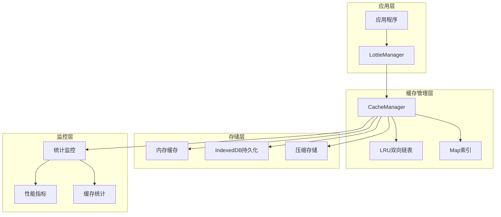

**图表来源**
- [CacheManager.ts](file://packages/core/src/core/CacheManager.ts#L20-L502)
- [LottieManager.ts](file://packages/core/src/core/LottieManager.ts#L18-L31)

## 核心组件分析

### LRUNode节点结构

CacheManager的核心是一个自定义的LRU节点类，它维护了缓存项的关键信息：

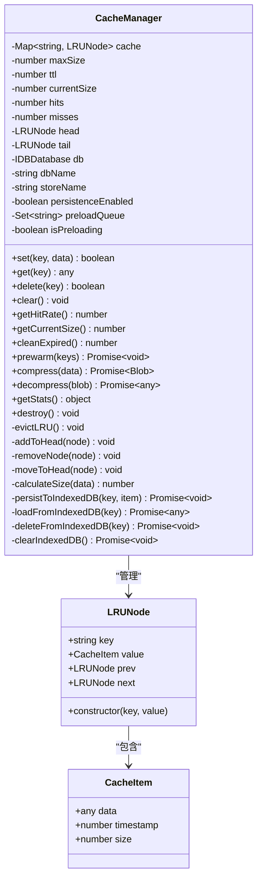

**图表来源**
- [CacheManager.ts](file://packages/core/src/core/CacheManager.ts#L6-L16)
- [CacheManager.ts](file://packages/core/src/core/CacheManager.ts#L21-L502)
- [index.ts](file://packages/core/src/types/index.ts#L240-L246)

### 缓存配置参数

CacheManager提供了灵活的配置选项：

| 参数 | 类型 | 默认值 | 描述 |
|------|------|--------|------|
| maxSize | number | 50 | 最大缓存大小（MB） |
| ttl | number | 3600000 | 缓存过期时间（毫秒，默认1小时） |
| enablePersistence | boolean | false | 是否启用IndexedDB持久化 |

**节来源**
- [CacheManager.ts](file://packages/core/src/core/CacheManager.ts#L43-L47)
- [LottieManager.ts](file://packages/core/src/core/LottieManager.ts#L79-L83)

## LRU算法实现

### 算法原理

LRU（Least Recently Used）算法通过维护一个双向链表来实现缓存淘汰策略：

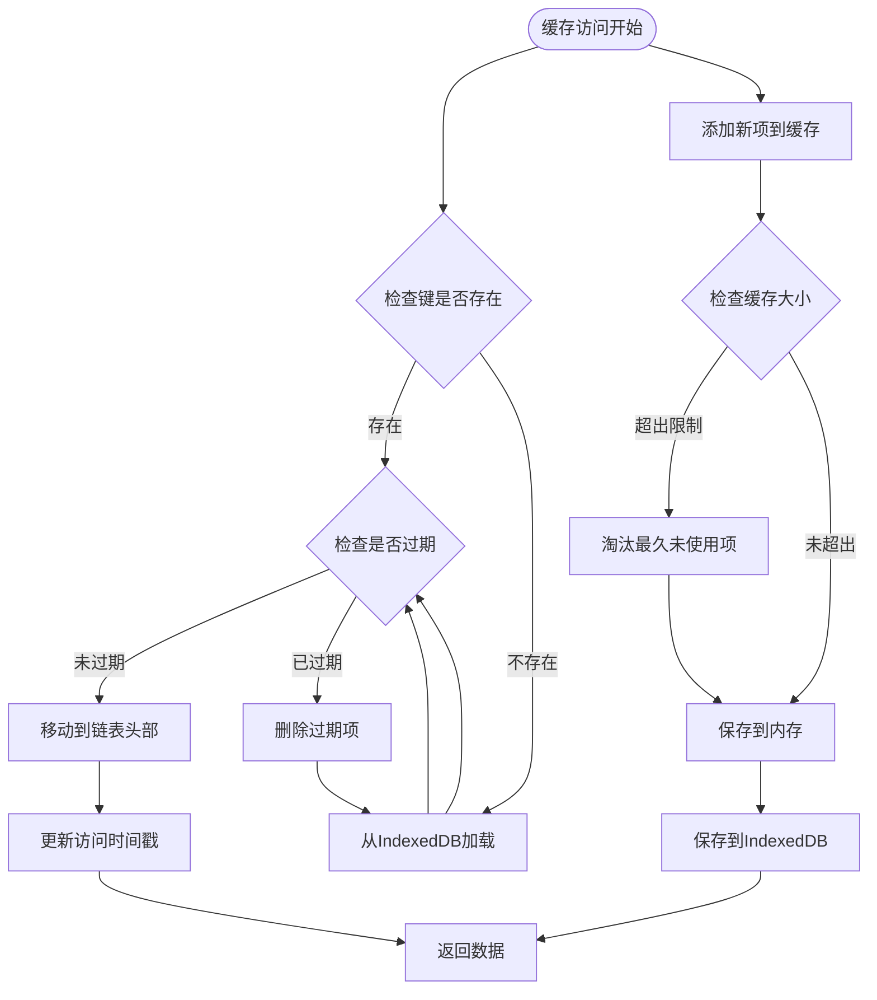

**图表来源**
- [CacheManager.ts](file://packages/core/src/core/CacheManager.ts#L129-L159)
- [CacheManager.ts](file://packages/core/src/core/CacheManager.ts#L84-L123)

### 核心操作流程

#### 1. 设置缓存（set方法）

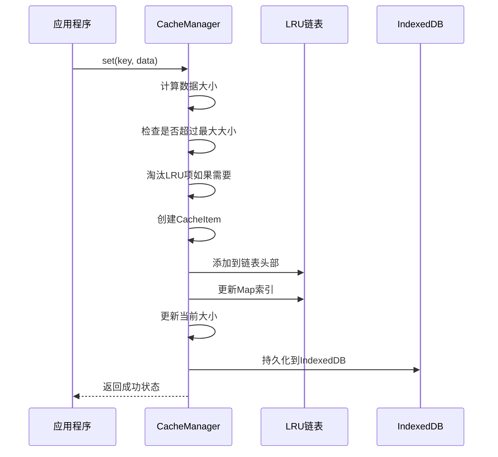

**图表来源**
- [CacheManager.ts](file://packages/core/src/core/CacheManager.ts#L84-L123)

#### 2. 获取缓存（get方法）

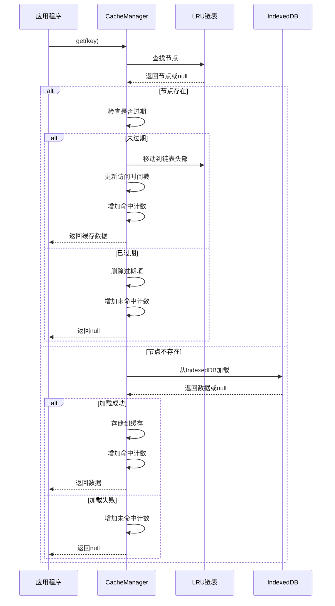

**图表来源**
- [CacheManager.ts](file://packages/core/src/core/CacheManager.ts#L129-L159)

**节来源**
- [CacheManager.ts](file://packages/core/src/core/CacheManager.ts#L84-L159)

## 缓存策略与配置

### 缓存容量管理

CacheManager实现了精确的内存大小控制机制：

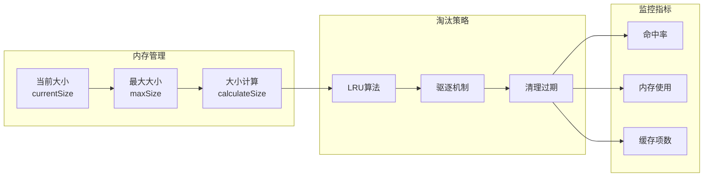

**图表来源**
- [CacheManager.ts](file://packages/core/src/core/CacheManager.ts#L23-L25)
- [CacheManager.ts](file://packages/core/src/core/CacheManager.ts#L86-L123)

### 过期策略

CacheManager支持基于时间的缓存过期机制：

| 过期类型 | 触发条件 | 处理方式 |
|----------|----------|----------|
| TTL过期 | 时间戳超过TTL阈值 | 自动删除并清理 |
| 手动清理 | cleanExpired()调用 | 批量删除过期项 |
| 缓存满载 | 新增数据导致超限 | LRU算法淘汰最久未使用项 |

**节来源**
- [CacheManager.ts](file://packages/core/src/core/CacheManager.ts#L145-L150)
- [CacheManager.ts](file://packages/core/src/core/CacheManager.ts#L278-L294)

## 与LottieManager集成

### 协同工作机制

CacheManager与LottieManager紧密协作，共同提升动画播放性能：

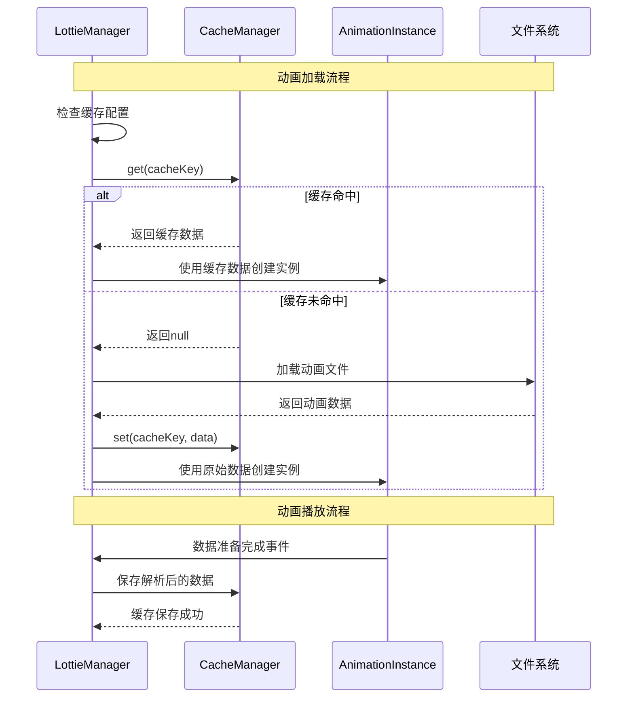

**图表来源**
- [LottieManager.ts](file://packages/core/src/core/LottieManager.ts#L150-L178)
- [LottieManager.ts](file://packages/core/src/core/LottieManager.ts#L170-L180)

### 配置集成

LottieManager通过配置对象控制CacheManager的行为：

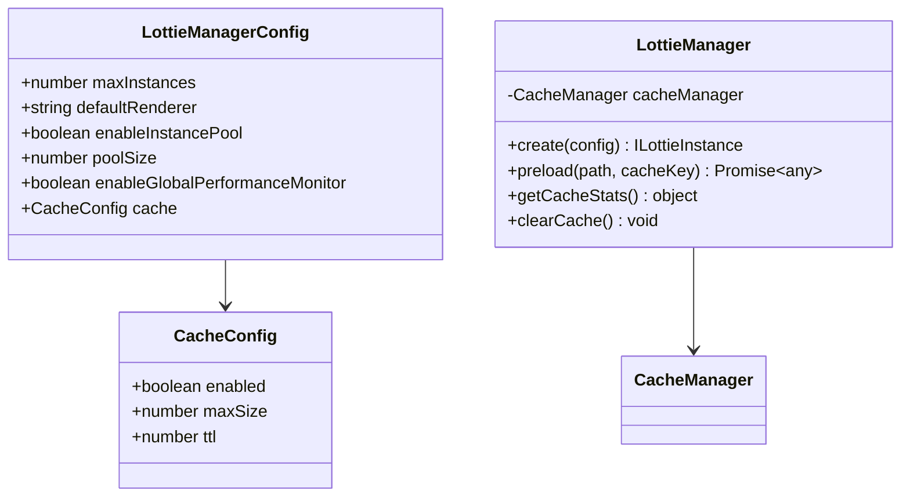

**图表来源**
- [index.ts](file://packages/core/src/types/index.ts#L220-L236)
- [LottieManager.ts](file://packages/core/src/core/LottieManager.ts#L18-L31)

**节来源**
- [LottieManager.ts](file://packages/core/src/core/LottieManager.ts#L18-L31)
- [LottieManager.ts](file://packages/core/src/core/LottieManager.ts#L150-L180)

## 性能监控与统计

### 缓存统计指标

CacheManager提供了全面的性能监控功能：

| 指标名称 | 类型 | 描述 | 计算方式 |
|----------|------|------|----------|
| 命中率 | number | 缓存命中百分比 | hits / (hits + misses) × 100 |
| 当前大小 | number | 当前缓存占用空间（MB） | currentSize / 1024 / 1024 |
| 缓存项数 | number | 当前缓存中的项目数量 | cache.size |
| 总命中次数 | number | 累计命中次数 | hits |
| 总未命中次数 | number | 累计未命中次数 | misses |
| 最老项目 | string | 最早添加的缓存键 | tail.key |
| 最新项目 | string | 最近访问的缓存键 | head.key |

### 性能基准测试

CacheManager经过严格的性能测试验证：

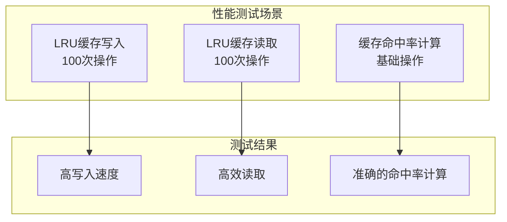

**图表来源**
- [performance.bench.ts](file://packages/core/src/__tests__/benchmarks/performance.bench.ts#L65-L100)

**节来源**
- [CacheManager.ts](file://packages/core/src/core/CacheManager.ts#L198-L204)
- [CacheManager.ts](file://packages/core/src/core/CacheManager.ts#L467-L489)

## 高级功能

### IndexedDB持久化

CacheManager支持IndexedDB持久化存储，实现跨会话缓存：

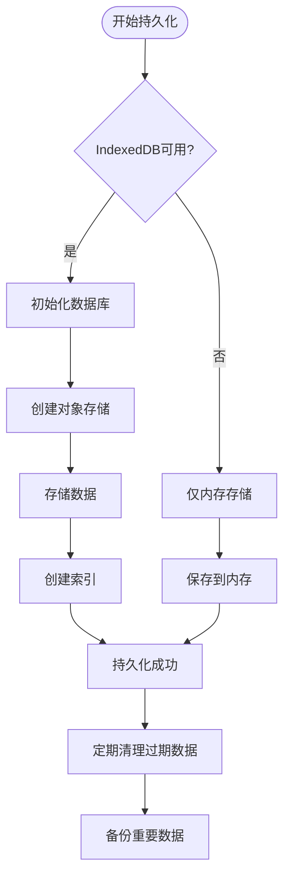

**图表来源**
- [CacheManager.ts](file://packages/core/src/core/CacheManager.ts#L56-L78)
- [CacheManager.ts](file://packages/core/src/core/CacheManager.ts#L297-L377)

### 数据压缩

CacheManager支持使用CompressionStreams API进行数据压缩：

| 压缩类型 | API支持 | 压缩效果 | 性能影响 |
|----------|---------|----------|----------|
| GZIP压缩 | CompressionStream | 显著减小存储空间 | 轻微CPU开销 |
| 无压缩 | fallback | 原始大小 | 最佳性能 |
| 自动检测 | 浏览器兼容性 | 智能选择方案 | 最优平衡 |

### 缓存预热

CacheManager提供预热功能，支持批量加载常用动画数据：

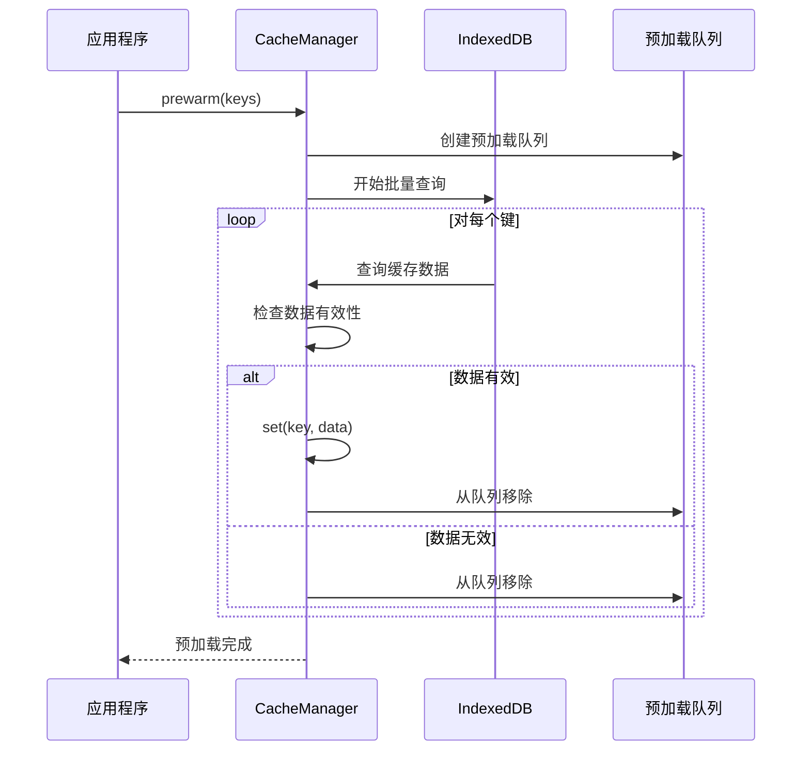

**图表来源**
- [CacheManager.ts](file://packages/core/src/core/CacheManager.ts#L380-L426)

**节来源**
- [CacheManager.ts](file://packages/core/src/core/CacheManager.ts#L380-L426)
- [CacheManager.ts](file://packages/core/src/core/CacheManager.ts#L428-L467)

## 使用示例

### 基础缓存使用

```typescript
// 创建缓存管理器
const cache = new CacheManager(50, 3600000); // 50MB, 1小时TTL

// 设置缓存
cache.set('animation1', animationData);

// 获取缓存
const data = cache.get('animation1');
console.log(data); // 输出缓存的动画数据

// 清理过期缓存
const cleaned = cache.cleanExpired();
console.log(`清理了 ${cleaned} 个过期项`);
```

### 与LottieManager集成

```typescript
// 配置全局缓存
import { lottieManager } from '@ldesign/lottie';

lottieManager.updateConfig({
  cache: {
    enabled: true,
    maxSize: 100, // 100MB
    ttl: 7200000, // 2小时
  }
});

// 预加载常用动画
async function preloadAnimations() {
  await lottieManager.preload('/animations/success.json');
  await lottieManager.preload('/animations/error.json');
  await lottieManager.preload('/animations/loading.json');
}

// 获取缓存统计
const stats = lottieManager.getCacheStats();
console.log(`缓存大小: ${stats.size}MB, 命中率: ${stats.hitRate}%`);
```

### 高级配置示例

```typescript
// 创建支持持久化的缓存管理器
const persistentCache = new CacheManager(200, 86400000, true); // 200MB, 24小时, 启用持久化

// 使用压缩功能
const compressedData = await persistentCache.compress(largeAnimationData);
persistentCache.set('large-animation', compressedData);

// 缓存预热
await persistentCache.prewarm([
  'animation1.json',
  'animation2.json',
  'animation3.json'
]);

// 获取详细统计
const detailedStats = persistentCache.getStats();
console.log({
  size: `${detailedStats.size}MB`,
  count: detailedStats.count,
  hitRate: `${detailedStats.hitRate}%`,
  oldest: detailedStats.oldestItem,
  newest: detailedStats.newestItem
});
```

**节来源**
- [CacheManager.test.ts](file://packages/core/src/__tests__/CacheManager.test.ts#L20-L44)
- [LottieManager.ts](file://packages/core/src/core/LottieManager.ts#L310-L350)

## 故障排除

### 常见问题与解决方案

#### 1. 内存占用过高

**问题描述**：缓存占用过多内存，可能导致浏览器卡顿或崩溃。

**解决方案**：
```typescript
// 调整缓存大小限制
const cache = new CacheManager(20, 3600000); // 减少到20MB

// 定期清理过期缓存
setInterval(() => {
  const cleaned = cache.cleanExpired();
  console.log(`清理了 ${cleaned} 个过期项`);
}, 60000);

// 监控缓存使用情况
function monitorCache() {
  const stats = cache.getStats();
  if (stats.size > 15) { // 超过15MB时警告
    console.warn(`缓存使用量较高: ${stats.size}MB`);
  }
}
```

#### 2. 缓存命中率低

**问题描述**：缓存命中率低于预期，频繁的缓存未命中。

**诊断步骤**：
```typescript
// 检查缓存统计
const stats = cache.getStats();
console.log(`命中率: ${(stats.hitRate * 100).toFixed(2)}%`);
console.log(`总请求数: ${stats.hits + stats.misses}`);
console.log(`命中次数: ${stats.hits}`);
console.log(`未命中次数: ${stats.misses}`);

// 分析缓存键分布
const keys = Array.from(cache.cache.keys());
console.log('缓存键分布:', keys);
```

**优化建议**：
- 增加缓存大小
- 延长TTL时间
- 优化缓存键命名策略
- 实施缓存预热

#### 3. IndexedDB存储失败

**问题描述**：在不支持IndexedDB的环境中出现错误。

**解决方案**：
```typescript
// 检查IndexedDB支持
const supportsIndexedDB = typeof indexedDB !== 'undefined';

// 条件性启用持久化
const cache = new CacheManager(
  50, 
  3600000, 
  supportsIndexedDB // 仅在支持的环境中启用
);

// 提供回退机制
if (!supportsIndexedDB) {
  console.warn('IndexedDB不可用，缓存将仅限于内存');
}
```

#### 4. 压缩功能异常

**问题描述**：数据压缩或解压失败。

**解决方案**：
```typescript
// 检查压缩API支持
const supportsCompression = typeof CompressionStream !== 'undefined';

// 使用安全的压缩方法
async function safeCompress(data) {
  if (!supportsCompression) {
    console.warn('压缩API不可用，使用原始数据');
    return new Blob([JSON.stringify(data)]);
  }
  
  try {
    const blob = new Blob([JSON.stringify(data)]);
    const stream = blob.stream()
      .pipeThrough(new CompressionStream('gzip'));
    return await new Response(stream).blob();
  } catch (error) {
    console.error('压缩失败，使用未压缩数据:', error);
    return new Blob([JSON.stringify(data)]);
  }
}
```

**节来源**
- [CacheManager.ts](file://packages/core/src/core/CacheManager.ts#L435-L467)
- [CacheManager.test.ts](file://packages/core/src/__tests__/CacheManager.test.ts#L114-L128)

## 最佳实践

### 缓存配置优化

#### 1. 根据应用场景调整配置

```typescript
// 高频动画场景
const highFreqCache = new CacheManager(100, 1800000); // 100MB, 30分钟TTL

// 低频动画场景  
const lowFreqCache = new CacheManager(20, 86400000); // 20MB, 24小时TTL

// 移动端优化
const mobileCache = new CacheManager(50, 3600000, true); // 50MB, 1小时, 启用持久化
```

#### 2. 动态配置调整

```typescript
class DynamicCacheManager {
  private cache: CacheManager;
  
  constructor(initialConfig: CacheConfig) {
    this.cache = new CacheManager(
      initialConfig.maxSize,
      initialConfig.ttl,
      initialConfig.enablePersistence
    );
  }
  
  adjustForDevice(deviceInfo: DeviceInfo) {
    let newSize = 50;
    let newTTL = 3600000;
    
    if (deviceInfo.performanceTier === 'low') {
      newSize = 20; // 低性能设备减少缓存
      newTTL = 1800000; // 缩短TTL
    } else if (deviceInfo.isMobile) {
      newSize = 30; // 移动设备适中缓存
    }
    
    this.cache = new CacheManager(newSize, newTTL);
  }
}
```

#### 3. 缓存预热策略

```typescript
class CacheWarmupManager {
  private cache: CacheManager;
  private warmupQueue: string[] = [];
  
  constructor(cache: CacheManager) {
    this.cache = cache;
  }
  
  async warmupCriticalAnimations() {
    const criticalAnimations = [
      'success.json',
      'error.json', 
      'loading.json',
      'progress.json'
    ];
    
    try {
      await this.cache.prewarm(criticalAnimations);
      console.log('关键动画预热完成');
    } catch (error) {
      console.error('预热失败:', error);
    }
  }
  
  schedulePeriodicWarmup() {
    // 每小时执行一次预热
    setInterval(async () => {
      await this.warmupCriticalAnimations();
    }, 3600000);
  }
}
```

### 性能监控最佳实践

#### 1. 实时监控仪表板

```typescript
class CacheMonitor {
  private cache: CacheManager;
  
  constructor(cache: CacheManager) {
    this.cache = cache;
  }
  
  createDashboard() {
    const stats = this.cache.getStats();
    
    return {
      memoryUsage: `${stats.size}MB`,
      hitRate: `${(stats.hitRate * 100).toFixed(1)}%`,
      itemCount: stats.count,
      healthStatus: this.getHealthStatus(stats),
      recommendations: this.getRecommendations(stats)
    };
  }
  
  private getHealthStatus(stats: any): string {
    if (stats.hitRate < 0.3) return 'low';
    if (stats.hitRate < 0.7) return 'medium';
    return 'high';
  }
  
  private getRecommendations(stats: any): string[] {
    const recs: string[] = [];
    
    if (stats.size > 80) {
      recs.push('缓存使用率过高，考虑增加淘汰频率');
    }
    
    if (stats.hitRate < 0.5) {
      recs.push('缓存命中率较低，可能需要优化缓存键策略');
    }
    
    return recs;
  }
}
```

#### 2. 性能告警机制

```typescript
class PerformanceAlertManager {
  private thresholds = {
    memoryHigh: 90, // MB
    hitRateLow: 0.3, // 30%
    cacheFull: 95 // %
  };
  
  checkPerformance(cache: CacheManager) {
    const stats = cache.getStats();
    
    if (stats.size > this.thresholds.memoryHigh) {
      this.alert('缓存内存使用过高', {
        current: stats.size,
        threshold: this.thresholds.memoryHigh
      });
    }
    
    if (stats.hitRate < this.thresholds.hitRateLow) {
      this.alert('缓存命中率过低', {
        rate: stats.hitRate,
        threshold: this.thresholds.hitRateLow
      });
    }
    
    const utilization = (stats.size / 100) * 100; // 假设最大100MB
    if (utilization > this.thresholds.cacheFull) {
      this.alert('缓存接近满载', {
        utilization: `${utilization.toFixed(1)}%`
      });
    }
  }
  
  private alert(message: string, details: any) {
    console.warn(`缓存告警: ${message}`, details);
    // 可以扩展为发送通知、记录日志等功能
  }
}
```

### 错误处理与恢复

#### 1. 渐进式降级策略

```typescript
class RobustCacheManager {
  private primaryCache: CacheManager;
  private fallbackCache: CacheManager;
  
  constructor() {
    // 主缓存：启用持久化
    this.primaryCache = new CacheManager(100, 3600000, true);
    
    // 备用缓存：仅内存存储
    this.fallbackCache = new CacheManager(50, 1800000, false);
  }
  
  async set(key: string, data: any): Promise<boolean> {
    try {
      // 优先使用主缓存
      const success = this.primaryCache.set(key, data);
      if (success) return true;
    } catch (error) {
      console.warn('主缓存写入失败，尝试备用缓存:', error);
    }
    
    // 备用缓存写入
    return this.fallbackCache.set(key, data);
  }
  
  get(key: string): any {
    // 优先从主缓存读取
    let result = this.primaryCache.get(key);
    if (result !== null) return result;
    
    // 从备用缓存读取
    return this.fallbackCache.get(key);
  }
  
  async recoverFromFailure() {
    // 清理损坏的缓存
    this.primaryCache.clear();
    this.fallbackCache.clear();
    
    console.log('缓存恢复完成');
  }
}
```

#### 2. 数据完整性验证

```typescript
class ValidatingCacheManager {
  private cache: CacheManager;
  
  constructor(cache: CacheManager) {
    this.cache = cache;
  }
  
  set(key: string, data: any): boolean {
    // 数据验证
    if (!this.validateData(data)) {
      console.error('无效数据，拒绝缓存:', data);
      return false;
    }
    
    return this.cache.set(key, data);
  }
  
  get(key: string): any {
    const data = this.cache.get(key);
    
    if (data !== null && !this.validateData(data)) {
      console.warn('发现损坏数据，清除缓存:', key);
      this.cache.delete(key);
      return null;
    }
    
    return data;
  }
  
  private validateData(data: any): boolean {
    // 基本数据结构验证
    if (!data || typeof data !== 'object') return false;
    
    // 必需字段验证
    if (!data.v || !data.layers || !data.assets) return false;
    
    // 数据大小验证
    const size = this.cache['calculateSize'](data);
    return size > 0 && size < 100 * 1024 * 1024; // 小于100MB
    
    // 可以添加更多验证规则
  }
}
```

## 总结

CacheManager作为Lottie库的核心组件，通过精心设计的LRU算法和多重缓存策略，为动画播放提供了卓越的性能优化。其主要优势包括：

### 技术优势

1. **高效的LRU算法**：通过双向链表实现O(1)的插入、删除和查找操作
2. **智能内存管理**：精确控制缓存大小，防止内存溢出
3. **持久化支持**：IndexedDB持久化确保跨会话缓存可用性
4. **压缩优化**：内置数据压缩功能，显著减少存储空间
5. **全面监控**：提供详细的性能指标和统计信息

### 应用价值

- **性能提升**：显著减少重复动画的加载时间和解析开销
- **用户体验**：平滑的动画播放体验，减少卡顿和延迟
- **资源优化**：降低网络请求频率，节省带宽和服务器资源
- **开发便利**：简化动画管理，提供统一的缓存接口

### 发展前景

随着Web技术的不断发展，CacheManager将继续演进，可能的发展方向包括：

- **分布式缓存**：支持跨设备的缓存同步
- **智能预测**：基于用户行为的智能缓存预取
- **压缩算法优化**：采用更先进的压缩算法
- **云原生支持**：与CDN和边缘计算的深度集成

CacheManager的设计理念体现了现代Web应用对性能和用户体验的极致追求，为Lottie动画库的整体性能奠定了坚实的基础。通过合理的配置和使用，开发者可以充分发挥其潜力，构建出高性能、流畅的动画应用。