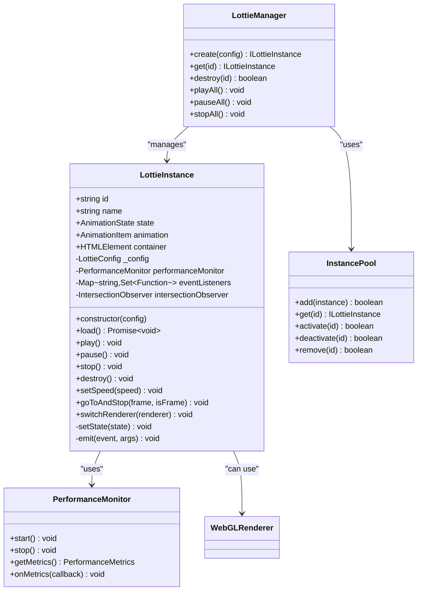
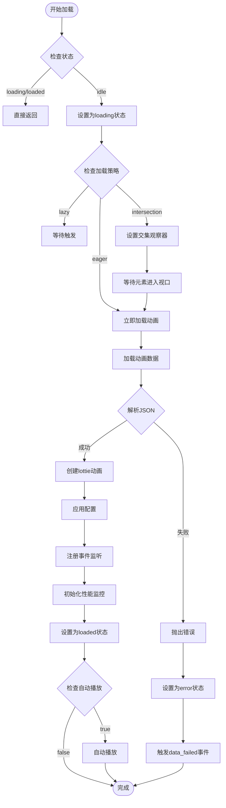
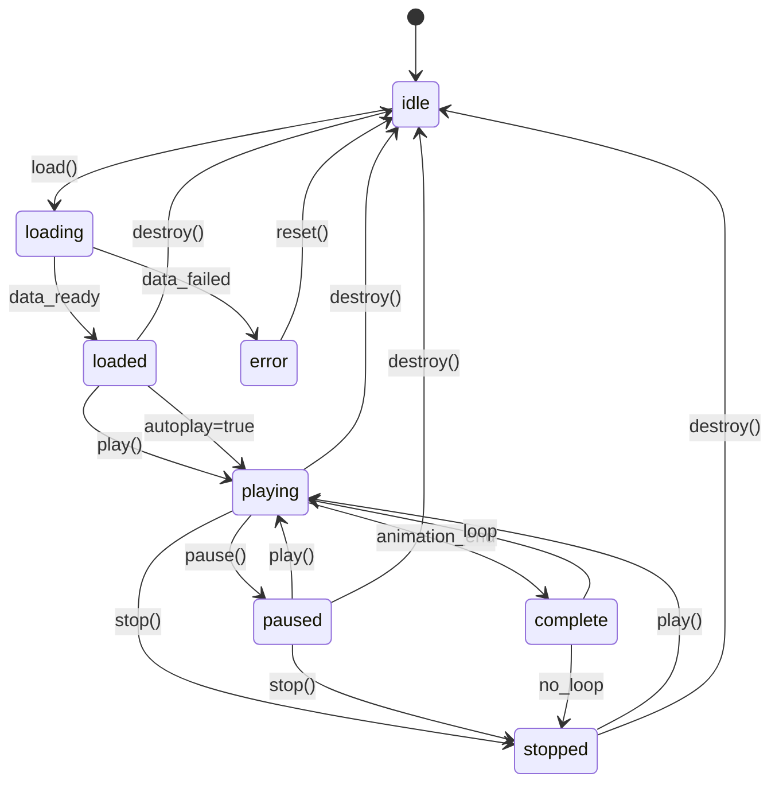
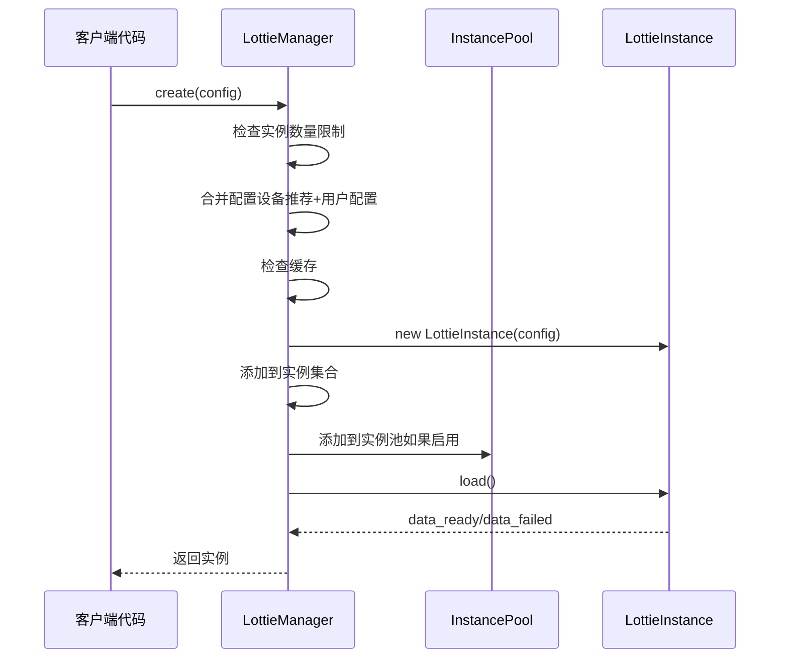
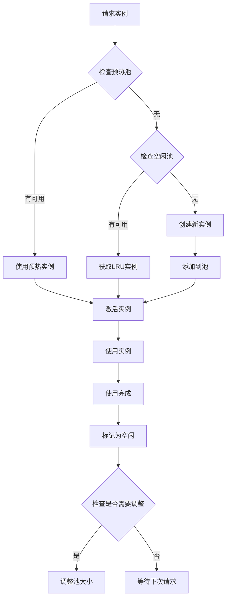
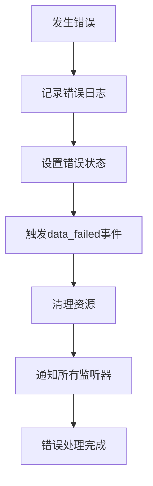

# LottieInstance 详细文档

<cite>
**本文档引用的文件**
- [LottieInstance.ts](file://packages/core/src/core/LottieInstance.ts)
- [LottieManager.ts](file://packages/core/src/core/LottieManager.ts)
- [InstancePool.ts](file://packages/core/src/core/InstancePool.ts)
- [WebGLRenderer.ts](file://packages/core/src/core/WebGLRenderer.ts)
- [index.ts](file://packages/core/src/types/index.ts)
- [main.ts](file://examples/core-demo/src/main.ts)
- [App.tsx](file://examples/react-demo/src/App.tsx)
- [index.ts](file://packages/core/src/index.ts)
</cite>

## 目录
1. [简介](#简介)
2. [核心架构](#核心架构)
3. [实例化过程](#实例化过程)
4. [动画数据加载与解析](#动画数据加载与解析)
5. [播放控制接口](#播放控制接口)
6. [DOM元素绑定](#dom元素绑定)
7. [配置系统](#配置系统)
8. [事件回调机制](#事件回调机制)
9. [状态管理](#状态管理)
10. [与LottieManager的关系](#与lottiemanager的关系)
11. [实例池管理](#实例池管理)
12. [高级功能](#高级功能)
13. [错误处理机制](#错误处理机制)
14. [性能优化](#性能优化)
15. [使用示例](#使用示例)
16. [最佳实践](#最佳实践)

## 简介

LottieInstance 是 Lottie 动画库的核心类，负责管理单个动画实例的完整生命周期。它提供了完整的动画播放控制、状态管理、性能监控和资源管理功能，是整个动画系统的基础组件。

### 主要特性

- **完整的动画生命周期管理**：从创建到销毁的全过程控制
- **多种渲染器支持**：SVG、Canvas、HTML 和 WebGL 渲染器
- **智能性能优化**：自动降级、智能跳帧、内存管理
- **丰富的交互控制**：播放、暂停、跳转、变速等
- **事件驱动架构**：完整的事件回调系统
- **跨框架兼容**：支持 React、Vue、Angular 等主流框架

## 核心架构

LottieInstance 采用模块化设计，主要包含以下核心组件：



**图表来源**
- [LottieInstance.ts](file://packages/core/src/core/LottieInstance.ts#L11-L667)
- [LottieManager.ts](file://packages/core/src/core/LottieManager.ts#L16-L504)
- [InstancePool.ts](file://packages/core/src/core/InstancePool.ts#L6-L311)

## 实例化过程

### 构造函数参数

LottieInstance 的构造函数接受一个 LottieConfig 配置对象：

```typescript
constructor(config: LottieConfig)
```

### 初始化流程

1. **唯一标识生成**：为每个实例生成唯一的 ID
2. **配置标准化**：合并默认配置和用户配置
3. **容器初始化**：解析并设置 DOM 容器
4. **状态初始化**：设置初始状态为 'idle'

### 配置标准化

系统会自动合并和标准化配置：

```typescript
private normalizeConfig(config: LottieConfig): LottieConfig {
    return {
        renderer: 'svg',
        loop: true,
        autoplay: false,
        speed: 1,
        quality: 'high',
        loadStrategy: 'eager',
        playMode: 'normal',
        ...config,
        advanced: {
            enablePerformanceMonitor: true,
            performanceMonitorInterval: 1000,
            enableCache: true,
            enableAutoDegradation: false,
            preload: false,
            ...config.advanced,
        },
    }
}
```

**节来源**
- [LottieInstance.ts](file://packages/core/src/core/LottieInstance.ts#L39-L90)

## 动画数据加载与解析

### 加载策略

LottieInstance 支持三种加载策略：

1. **eager（立即加载）**：页面加载时立即开始加载
2. **lazy（延迟加载）**：需要时才开始加载
3. **intersection（交集观察器）**：当元素进入视口时加载

### 加载流程



**图表来源**
- [LottieInstance.ts](file://packages/core/src/core/LottieInstance.ts#L95-L213)

### 数据源支持

LottieInstance 支持多种动画数据源：

- **path**: 从远程 URL 加载 JSON 文件
- **animationData**: 直接传入解析后的动画数据
- **customLoader**: 自定义加载器

### 默认加载器实现

```typescript
private async defaultLoader(path: string): Promise<any> {
    const response = await fetch(path)
    if (!response.ok) {
        throw new Error(`Failed to load animation: ${response.statusText}`)
    }
    return response.json()
}
```

**节来源**
- [LottieInstance.ts](file://packages/core/src/core/LottieInstance.ts#L218-L224)

## 播放控制接口

### 基本播放控制

LottieInstance 提供了完整的播放控制接口：

| 方法 | 参数 | 描述 |
|------|------|------|
| `play()` | 无 | 开始播放动画 |
| `pause()` | 无 | 暂停动画播放 |
| `stop()` | 无 | 停止动画并重置到起始帧 |
| `reset()` | 无 | 停止并重置到第0帧 |

### 高级播放控制

| 方法 | 参数 | 描述 |
|------|------|------|
| `setSpeed(speed)` | `number` | 设置播放速度（1.0 = 正常速度） |
| `setDirection(direction)` | `1 \| -1` | 设置播放方向（1 = 正向，-1 = 反向） |
| `goToAndStop(frame, isFrame?)` | `number, boolean` | 跳转到指定帧并停止 |
| `goToAndPlay(frame, isFrame?)` | `number, boolean` | 跳转到指定帧并播放 |
| `playSegments(segments, forceFlag?)` | `[number, number][] \| boolean` | 播放指定片段 |

### 播放模式

系统支持三种播放模式：

- **normal**: 正常播放（默认）
- **bounce**: 弹性播放（到达终点时反向播放）
- **reverse**: 反向播放（从终点开始反向播放）

**节来源**
- [LottieInstance.ts](file://packages/core/src/core/LottieInstance.ts#L490-L598)

## DOM元素绑定

### 容器设置

LottieInstance 支持多种容器设置方式：

```typescript
// 字符串选择器
const instance = new LottieInstance({
    container: '.animation-container'
})

// HTMLElement 对象
const container = document.getElementById('my-container')
const instance = new LottieInstance({
    container
})
```

### 样式应用

系统会自动应用配置中的样式：

```typescript
// 应用自定义样式
if (this._config.style) {
    Object.assign(this._container.style, this._config.style)
}
```

### 响应式调整

容器尺寸变化时会自动调整：

```typescript
resize(): void {
    this._animation?.resize()
}
```

**节来源**
- [LottieInstance.ts](file://packages/core/src/core/LottieInstance.ts#L177-L179)
- [LottieInstance.ts](file://packages/core/src/core/LottieInstance.ts#L601-L605)

## 配置系统

### 配置结构

LottieInstance 的配置系统非常灵活，支持多层次的配置：

```typescript
export interface LottieConfig {
    container?: HTMLElement | string
    renderer?: LottieRendererType
    loop?: boolean | number
    autoplay?: boolean
    animationData?: any
    path?: string
    name?: string
    speed?: number
    quality?: AnimationQuality
    loadStrategy?: LoadStrategy
    playMode?: PlayMode
    initialSegment?: [number, number]
    events?: LottieEvents
    advanced?: AdvancedOptions
    style?: Partial<CSSStyleDeclaration>
}
```

### 高级配置选项

| 配置项 | 类型 | 默认值 | 描述 |
|--------|------|--------|------|
| `enablePerformanceMonitor` | `boolean` | `true` | 启用性能监控 |
| `enableAutoDegradation` | `boolean` | `false` | 启用自动降级 |
| `enableSmartFrameSkip` | `boolean` | `false` | 启用智能跳帧 |
| `useOffscreenCanvas` | `boolean` | `false` | 使用 OffscreenCanvas |
| `enableCache` | `boolean` | `true` | 启用缓存 |
| `preload` | `boolean` | `false` | 预加载动画 |

### 设备适配配置

系统会根据设备性能自动调整配置：

```typescript
// 移动设备自动优化
if (deviceInfo.isMobile && !finalConfig.advanced?.enablePerformanceMonitor) {
    finalConfig.advanced = {
        ...finalConfig.advanced,
        enablePerformanceMonitor: true,
        targetFPS: recommended.targetFPS,
    }
}
```

**节来源**
- [index.ts](file://packages/core/src/types/index.ts#L115-L146)
- [index.ts](file://packages/core/src/types/index.ts#L83-L109)

## 事件回调机制

### 事件类型

LottieInstance 支持丰富的事件回调：

| 事件名 | 触发时机 | 参数 |
|--------|----------|------|
| `config_ready` | 配置完成 | 无 |
| `data_ready` | 数据加载完成 | 无 |
| `data_failed` | 数据加载失败 | `Error` |
| `DOMLoaded` | DOM 加载完成 | 无 |
| `destroy` | 实例销毁 | 无 |
| `enterFrame` | 进入新帧 | `{currentTime, totalTime, direction}` |
| `segmentStart` | 片段开始 | 无 |
| `complete` | 动画完成 | 无 |
| `loopComplete` | 循环完成 | 无 |
| `stateChange` | 状态变化 | `AnimationState` |
| `performanceWarning` | 性能警告 | `PerformanceMetrics` |

### 事件监听器

```typescript
// 添加事件监听器
instance.on('complete', () => {
    console.log('动画播放完成')
})

// 移除事件监听器
instance.off('complete')

// 移除特定回调
instance.off('complete', callback)
```

### 事件传播机制

事件系统采用两级传播：

1. **本地事件监听器**：通过 `on/off` 方法注册
2. **配置事件回调**：在配置中直接指定的回调

```typescript
private emit<K extends keyof LottieEvents>(event: K, ...args: any[]): void {
    // 触发本地事件监听器
    this.eventListeners.get(event)?.forEach(callback => {
        try {
            callback(...args)
        } catch (error) {
            console.error(`[LottieInstance] Error in ${event} callback:`, error)
        }
    })

    // 触发配置中的事件
    const configCallback = this._config.events?.[event]
    if (configCallback) {
        try {
            ; (configCallback as any)(...args)
        } catch (error) {
            console.error(`[LottieInstance] Error in config ${event} callback:`, error)
        }
    }
}
```

**节来源**
- [index.ts](file://packages/core/src/types/index.ts#L55-L78)
- [LottieInstance.ts](file://packages/core/src/core/LottieInstance.ts#L638-L656)

## 状态管理

### 动画状态

LottieInstance 维护以下动画状态：

```typescript
export type AnimationState = 'idle' | 'loading' | 'loaded' | 'playing' | 'paused' | 'stopped' | 'error'
```

### 状态转换图



### 状态管理实现

```typescript
private setState(state: AnimationState): void {
    if (this._state === state) return
    this._state = state
    this.emit('stateChange', state)
}
```

**节来源**
- [index.ts](file://packages/core/src/types/index.ts#L26-L26)
- [LottieInstance.ts](file://packages/core/src/core/LottieInstance.ts#L661-L665)

## 与LottieManager的关系

### 管理器职责

LottieManager 是全局单例，负责：

1. **实例创建**：统一创建和配置 LottieInstance
2. **实例管理**：维护所有活动实例的集合
3. **资源共享**：管理缓存、池化等共享资源
4. **全局控制**：提供全局播放控制功能

### 创建流程



**图表来源**
- [LottieManager.ts](file://packages/core/src/core/LottieManager.ts#L111-L182)

### 全局控制方法

LottieManager 提供全局控制功能：

```typescript
// 全局播放控制
playAll(): void
pauseAll(): void
stopAll(): void
resumeAll(): void

// 全局配置
setGlobalSpeed(speed: number): void
```

**节来源**
- [LottieManager.ts](file://packages/core/src/core/LottieManager.ts#L247-L282)

## 实例池管理

### InstancePool 职责

InstancePool 负责实例的复用和管理：

1. **实例复用**：通过预热和 LRU 策略复用实例
2. **生命周期管理**：跟踪实例的激活和空闲状态
3. **动态调整**：根据使用情况动态调整池大小
4. **内存优化**：定期清理空闲实例

### 池管理流程



**图表来源**
- [InstancePool.ts](file://packages/core/src/core/InstancePool.ts#L93-L116)

### 复用策略

1. **预热策略**：预先创建并保持实例
2. **LRU 策略**：优先使用最少使用的实例
3. **动态调整**：根据使用频率和时间调整池大小

**节来源**
- [InstancePool.ts](file://packages/core/src/core/InstancePool.ts#L73-L116)

## 高级功能

### 渲染器切换

LottieInstance 支持运行时切换渲染器：

```typescript
switchRenderer(renderer: 'svg' | 'canvas' | 'html' | 'webgl'): void
```

### WebGL 渲染器

对于支持 WebGL 的环境，可以使用高性能的 WebGL 渲染器：

```typescript
// 初始化 WebGL 渲染器
private initWebGLRenderer(): void {
    if (this.webglRenderer) return
    
    try {
        this.webglRenderer = new WebGLRenderer(this, {
            antialias: true,
            alpha: true,
            powerPreference: 'high-performance',
            enableTextureCache: true,
            enableBatching: true
        })
        this.webglRenderer.attachToContainer()
    } catch (error) {
        console.error('[LottieInstance] Failed to initialize WebGL renderer:', error)
        this.webglRenderer = null
    }
}
```

### 性能监控

内置性能监控系统：

```typescript
interface PerformanceMetrics {
    fps: number          // 帧率
    memory: number       // 内存使用(MB)
    cpuUsage: number     // CPU使用率(%)
    renderTime: number   // 渲染时间(ms)
    frameCount: number   // 帧计数
    frameDrops?: number  // 掉帧数
}
```

### 智能降级

当性能不足时自动降级：

```typescript
private checkPerformance(metrics: PerformanceMetrics): void {
    const { minFps, maxMemory, enableAutoDegradation } = this._config.advanced || {}
    
    // 检查 FPS
    if (minFps && metrics.fps < minFps) {
        if (enableAutoDegradation) {
            this.degradeQuality()
            this.enableSmartFrameSkip(metrics.fps)
        }
    }
    
    // 检查内存
    if (maxMemory && metrics.memory > maxMemory) {
        if (enableAutoDegradation) {
            this.degradeQuality()
        }
    }
}
```

**节来源**
- [LottieInstance.ts](file://packages/core/src/core/LottieInstance.ts#L396-L448)
- [WebGLRenderer.ts](file://packages/core/src/core/WebGLRenderer.ts#L449-L470)
- [LottieInstance.ts](file://packages/core/src/core/LottieInstance.ts#L297-L318)

## 错误处理机制

### 错误类型

LottieInstance 处理以下类型的错误：

1. **数据加载错误**：JSON 解析失败、网络错误
2. **渲染错误**：渲染器初始化失败
3. **配置错误**：无效的配置参数
4. **运行时错误**：播放过程中的异常

### 错误处理流程



### 错误恢复机制

```typescript
// 错误状态管理
private setState(state: AnimationState): void {
    if (this._state === state) return
    this._state = state
    this.emit('stateChange', state)
}

// 错误事件触发
this.emit('data_failed', error as Error)
```

### 错误预防措施

1. **输入验证**：验证配置参数的有效性
2. **优雅降级**：渲染器不支持时自动回退
3. **资源清理**：确保错误情况下正确清理资源

**节来源**
- [LottieInstance.ts](file://packages/core/src/core/LottieInstance.ts#L116-L120)
- [LottieInstance.ts](file://packages/core/src/core/LottieInstance.ts#L661-L665)

## 性能优化

### 内存管理

1. **实例池化**：复用 LottieInstance 实例
2. **缓存管理**：智能缓存动画数据
3. **资源清理**：及时释放不再使用的资源

### 渲染优化

1. **智能跳帧**：根据性能动态调整帧率
2. **批量渲染**：合并多个渲染操作
3. **GPU 加速**：使用 WebGL 和 OffscreenCanvas

### 性能监控

```typescript
// 性能监控配置
advanced: {
    enablePerformanceMonitor: true,
    performanceMonitorInterval: 1000,
    enableAutoDegradation: true,
    minFps: 30,
    maxMemory: 100
}
```

### 自动优化策略

```typescript
// 设备性能优化
if (deviceInfo.performanceTier === 'low') {
    // 降低播放速度
    instance.setSpeed(0.8)
    
    // 切换到更高效的渲染器
    if (instance.config.renderer === 'svg') {
        instance.switchRenderer('canvas')
    }
}
```

**节来源**
- [LottieManager.ts](file://packages/core/src/core/LottieManager.ts#L465-L499)
- [LottieInstance.ts](file://packages/core/src/core/LottieInstance.ts#L297-L318)

## 使用示例

### 基础使用

```typescript
// 创建基本动画
const instance = new LottieInstance({
    container: '#animation-container',
    path: '/path/to/animation.json',
    renderer: 'svg',
    loop: true,
    autoplay: true
})

// 加载动画
await instance.load()

// 控制播放
instance.play()
instance.pause()
instance.stop()
```

### React Hooks 使用

```typescript
import { useLottie } from '@ldesign/lottie-react'

function AnimationComponent() {
    const { instance, play, pause, stop } = useLottie({
        animationData: animationData,
        loop: true,
        autoplay: false
    })

    return (
        <div>
            <button onClick={play}>播放</button>
            <button onClick={pause}>暂停</button>
            <button onClick={stop}>停止</button>
        </div>
    )
}
```

### Vue 组合式 API 使用

```vue
<script setup>
import { useLottie } from '@ldesign/lottie-vue'

const { instance, play, pause, stop } = useLottie({
    animationData: animationData,
    loop: true,
    autoplay: false
})
</script>

<template>
    <div>
        <button @click="play">播放</button>
        <button @click="pause">暂停</button>
        <button @click="stop">停止</button>
    </div>
</template>
```

### 高级配置示例

```typescript
const instance = new LottieInstance({
    container: '#advanced-animation',
    path: '/path/to/animation.json',
    renderer: 'webgl',
    loop: true,
    autoplay: true,
    speed: 1.5,
    quality: 'high',
    advanced: {
        enablePerformanceMonitor: true,
        enableAutoDegradation: true,
        enableSmartFrameSkip: true,
        targetFPS: 30,
        maxMemory: 200
    }
})
```

**节来源**
- [main.ts](file://examples/core-demo/src/main.ts#L28-L34)
- [App.tsx](file://examples/react-demo/src/App.tsx#L58-L73)

## 最佳实践

### 性能最佳实践

1. **合理使用实例池**：对于大量相似动画，启用实例池
2. **选择合适的渲染器**：根据设备性能选择渲染器
3. **启用性能监控**：在生产环境中启用性能监控
4. **及时清理资源**：不再使用的实例要及时销毁

### 开发最佳实践

1. **配置验证**：确保配置参数的有效性
2. **错误处理**：妥善处理各种错误情况
3. **事件管理**：合理使用事件回调系统
4. **状态同步**：保持 UI 状态与动画状态同步

### 移动端优化

1. **自动降级**：移动端自动启用性能监控和降级
2. **触摸优化**：优化触摸交互体验
3. **电池优化**：减少不必要的计算和渲染

### 跨框架集成

1. **封装适配器**：为不同框架创建适配器
2. **状态管理**：与框架的状态管理系统集成
3. **生命周期管理**：正确处理组件生命周期

### 测试策略

1. **单元测试**：测试各个方法的功能
2. **集成测试**：测试与其他组件的集成
3. **性能测试**：测试性能表现
4. **兼容性测试**：测试不同浏览器和设备的兼容性

通过遵循这些最佳实践，可以充分发挥 LottieInstance 的性能优势，构建高质量的动画应用。