# LottieManager 详细技术文档

<cite>
**本文档引用的文件**
- [LottieManager.ts](file://packages/core/src/core/LottieManager.ts)
- [index.ts](file://packages/core/src/index.ts)
- [CacheManager.ts](file://packages/core/src/core/CacheManager.ts)
- [InstancePool.ts](file://packages/core/src/InstancePool.ts)
- [types/index.ts](file://packages/core/src/types/index.ts)
- [LottieManager.test.ts](file://packages/core/src/__tests__/LottieManager.test.ts)
- [memory-leak.test.ts](file://tests/memory-leak.test.ts)
- [performance.bench.ts](file://packages/core/src/__tests__/benchmarks/performance.bench.ts)
- [App.tsx](file://examples/react-demo/src/App.tsx)
- [HookDemo.vue](file://examples/vue-demo/src/components/HookDemo.vue)
- [lottie.service.ts](file://packages/angular/src/lottie.service.ts)
- [USAGE_GUIDE.md](file://USAGE_GUIDE.md)
</cite>

## 目录
1. [简介](#简介)
2. [项目结构](#项目结构)
3. [核心组件](#核心组件)
4. [架构概览](#架构概览)
5. [详细组件分析](#详细组件分析)
6. [依赖关系分析](#依赖关系分析)
7. [性能考虑](#性能考虑)
8. [故障排除指南](#故障排除指南)
9. [结论](#结论)

## 简介

LottieManager 是 Lottie 库的核心全局动画管理器，采用单例模式设计，负责统一管理所有的 Lottie 动画实例。它提供了完整的动画生命周期管理、资源优化、性能监控和错误处理机制，是整个 Lottie 生态系统的基础组件。

该管理器不仅管理动画实例的创建和销毁，还集成了缓存系统、实例池、内存管理和性能优化等高级功能，为开发者提供了一个强大而易用的动画管理平台。

## 项目结构

LottieManager 的项目结构体现了清晰的模块化设计理念：

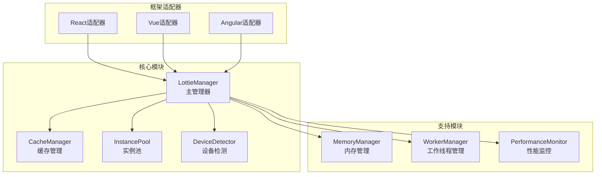

**图表来源**
- [LottieManager.ts](file://packages/core/src/core/LottieManager.ts#L1-L504)
- [index.ts](file://packages/core/src/index.ts#L1-L180)

**章节来源**
- [LottieManager.ts](file://packages/core/src/core/LottieManager.ts#L1-L504)
- [index.ts](file://packages/core/src/index.ts#L1-L180)

## 核心组件

### 单例模式实现

LottieManager 采用了经典的单例模式实现，确保在整个应用程序中只有一个全局实例：

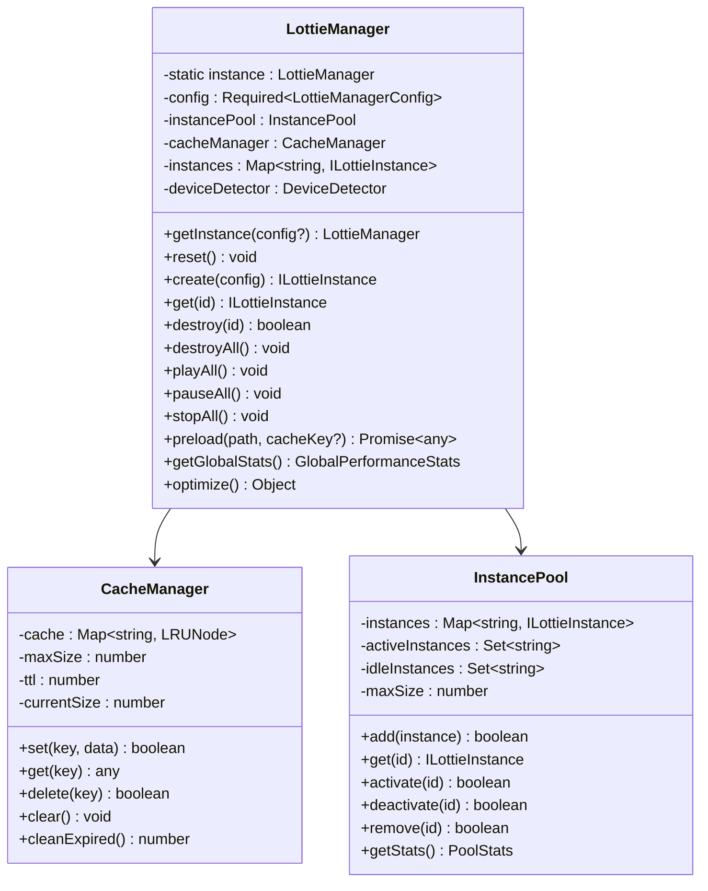

**图表来源**
- [LottieManager.ts](file://packages/core/src/core/LottieManager.ts#L16-L504)
- [CacheManager.ts](file://packages/core/src/core/CacheManager.ts#L21-L502)
- [InstancePool.ts](file://packages/core/src/InstancePool.ts#L6-L311)

### 核心功能特性

LottieManager 提供了以下核心功能：

1. **全局实例管理** - 统一管理所有动画实例
2. **智能缓存系统** - LRU 缓存和持久化存储
3. **对象池管理** - 实例复用和内存优化
4. **性能监控** - 实时性能指标收集
5. **设备自适应** - 自动优化不同设备性能
6. **批量操作** - 支持批量播放、暂停、停止等操作

**章节来源**
- [LottieManager.ts](file://packages/core/src/core/LottieManager.ts#L110-L182)
- [CacheManager.ts](file://packages/core/src/core/CacheManager.ts#L21-L100)
- [InstancePool.ts](file://packages/core/src/InstancePool.ts#L6-L50)

## 架构概览

LottieManager 采用分层架构设计，各层职责明确，相互协作：

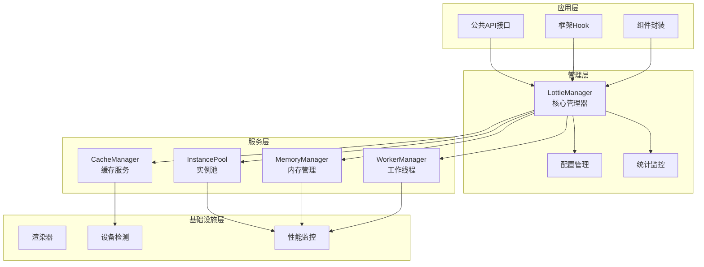

**图表来源**
- [LottieManager.ts](file://packages/core/src/core/LottieManager.ts#L16-L504)
- [index.ts](file://packages/core/src/index.ts#L1-L180)

## 详细组件分析

### LottieManager 核心实现

#### 单例模式与初始化

LottieManager 的单例模式实现确保了全局唯一性：

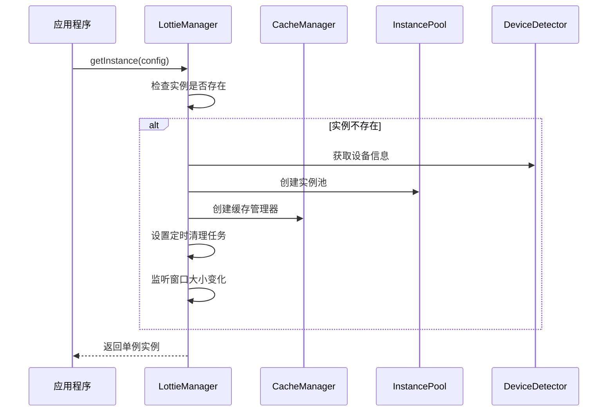

**图表来源**
- [LottieManager.ts](file://packages/core/src/core/LottieManager.ts#L49-L64)

#### 动画实例创建流程

动画实例的创建过程涉及多个步骤的协调：

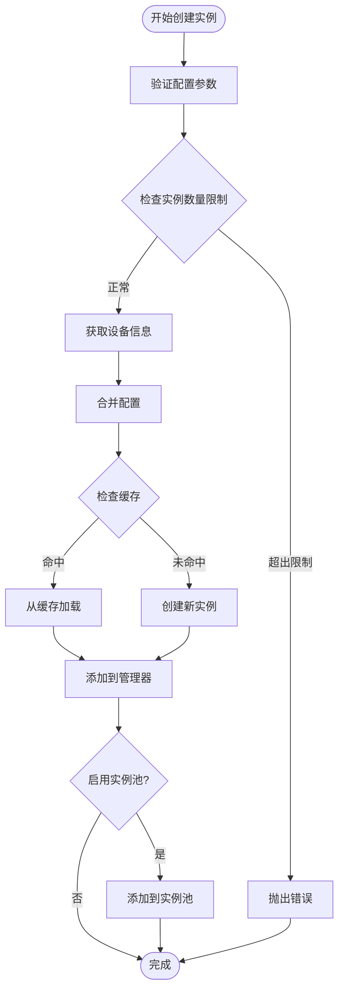

**图表来源**
- [LottieManager.ts](file://packages/core/src/core/LottieManager.ts#L111-L182)

#### 生命周期管理

LottieManager 提供了完整的动画生命周期管理：

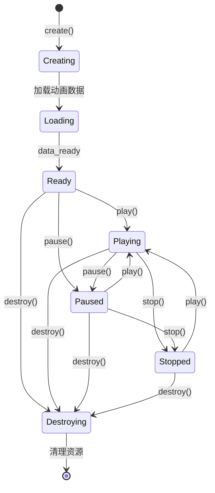

**图表来源**
- [LottieManager.ts](file://packages/core/src/core/LottieManager.ts#L209-L225)
- [LottieManager.ts](file://packages/core/src/core/LottieManager.ts#L230-L243)

**章节来源**
- [LottieManager.ts](file://packages/core/src/core/LottieManager.ts#L49-L243)

### CacheManager 缓存管理

#### LRU 缓存算法实现

CacheManager 实现了高效的 LRU（Least Recently Used）缓存算法：

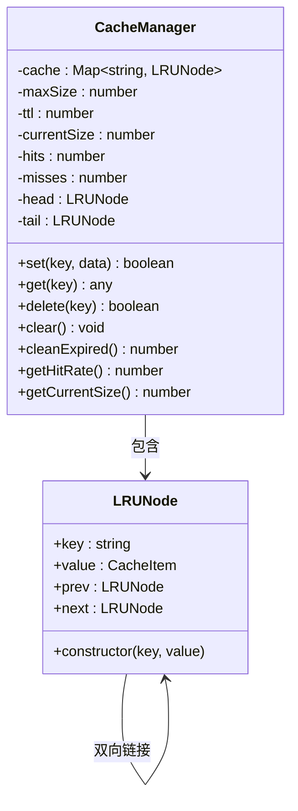

**图表来源**
- [CacheManager.ts](file://packages/core/src/core/CacheManager.ts#L6-L16)
- [CacheManager.ts](file://packages/core/src/core/CacheManager.ts#L21-L502)

#### 缓存策略与优化

CacheManager 支持多种缓存策略：

| 策略类型 | 描述 | 适用场景 |
|---------|------|----------|
| LRU淘汰 | 最近最少使用算法 | 通用场景，平衡性能和内存 |
| TTL过期 | 时间戳过期机制 | 临时数据缓存 |
| 大小限制 | 基于内存大小的限制 | 防止内存溢出 |
| 持久化存储 | IndexedDB持久化 | 浏览器重启后保留缓存 |

**章节来源**
- [CacheManager.ts](file://packages/core/src/core/CacheManager.ts#L21-L502)

### InstancePool 实例池

#### 对象复用机制

InstancePool 实现了高效的对象复用机制：

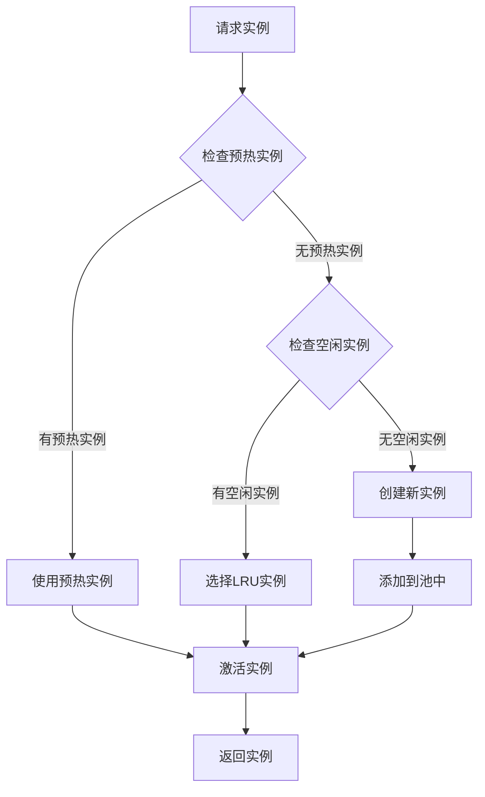

**图表来源**
- [InstancePool.ts](file://packages/core/src/InstancePool.ts#L93-L116)

#### 动态调整策略

InstancePool 具备智能的动态调整能力：

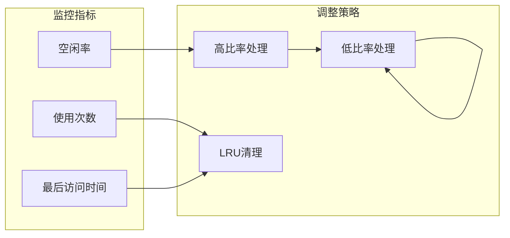

**图表来源**
- [InstancePool.ts](file://packages/core/src/InstancePool.ts#L141-L166)

**章节来源**
- [InstancePool.ts](file://packages/core/src/InstancePool.ts#L6-L311)

### 配置系统

#### LottieManagerConfig 配置选项

LottieManager 提供了丰富的配置选项：

| 配置项 | 类型 | 默认值 | 描述 |
|--------|------|--------|------|
| maxInstances | number | 100 | 最大动画实例数 |
| defaultRenderer | LottieRendererType | auto | 默认渲染器类型 |
| enableInstancePool | boolean | true | 是否启用实例池 |
| poolSize | number | 50 | 实例池大小 |
| enableGlobalPerformanceMonitor | boolean | true | 启用全局性能监控 |
| cache.enabled | boolean | true | 启用缓存 |
| cache.maxSize | number | 50 | 缓存最大大小(MB) |
| cache.ttl | number | 3600000 | 缓存过期时间(ms) |

**章节来源**
- [types/index.ts](file://packages/core/src/types/index.ts#L218-L237)

## 依赖关系分析

### 核心依赖图

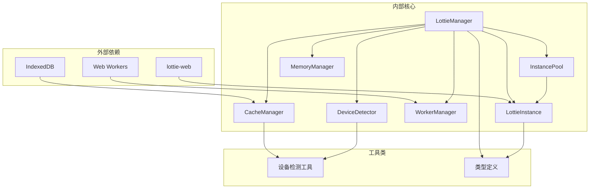

**图表来源**
- [LottieManager.ts](file://packages/core/src/core/LottieManager.ts#L1-L12)
- [index.ts](file://packages/core/src/index.ts#L1-L180)

### 模块间交互

LottieManager 与其他核心模块的交互关系：

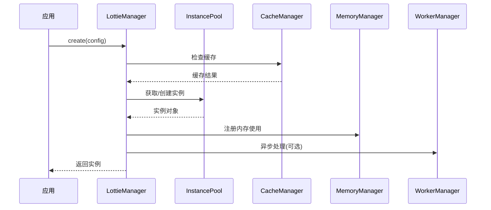

**图表来源**
- [LottieManager.ts](file://packages/core/src/core/LottieManager.ts#L111-L182)

**章节来源**
- [LottieManager.ts](file://packages/core/src/core/LottieManager.ts#L1-L504)
- [index.ts](file://packages/core/src/index.ts#L1-L180)

## 性能考虑

### 高并发场景下的性能优化

在高并发场景下，LottieManager 采用了多种优化策略：

#### 内存管理优化

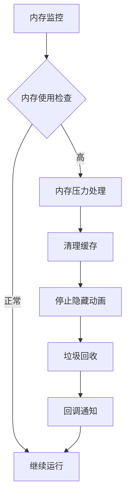

**图表来源**
- [MemoryManager.ts](file://packages/core/src/core/MemoryManager.ts#L51-L104)

#### 并发安全机制

LottieManager 通过以下机制确保并发安全性：

1. **实例隔离** - 每个动画实例独立管理
2. **配置合并** - 智能合并用户配置和设备推荐配置
3. **错误边界** - 操作失败时的优雅降级
4. **资源清理** - 及时释放不再使用的资源

### 性能监控指标

LottieManager 提供了全面的性能监控：

| 指标类别 | 监控项目 | 描述 |
|----------|----------|------|
| 实例管理 | 总实例数、活跃实例数 | 动画实例数量统计 |
| 性能指标 | 平均FPS、总内存使用 | 实时性能监控 |
| 缓存效率 | 命中率、缓存大小 | 缓存系统效果 |
| 内存使用 | 当前内存、峰值内存 | 内存占用情况 |

**章节来源**
- [LottieManager.ts](file://packages/core/src/core/LottieManager.ts#L370-L407)
- [MemoryManager.ts](file://packages/core/src/core/MemoryManager.ts#L51-L104)

## 故障排除指南

### 常见问题及解决方案

#### 资源竞争问题

**问题描述**: 多个动画同时播放导致性能下降

**解决方案**:
1. 启用实例池进行对象复用
2. 使用 `lottieManager.autoOptimize()` 自动优化
3. 实现懒加载策略
4. 监控内存使用情况

#### 内存泄漏预防

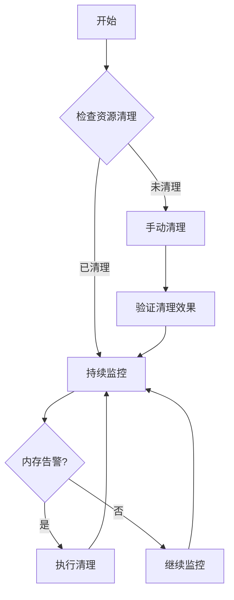

**图表来源**
- [memory-leak.test.ts](file://tests/memory-leak.test.ts#L1-L214)

#### 配置优化建议

针对不同使用场景的最佳配置：

| 场景 | 推荐配置 | 说明 |
|------|----------|------|
| 移动端 | `poolSize: 20, cache.maxSize: 20` | 降低内存占用 |
| 桌面端 | `poolSize: 50, cache.maxSize: 100` | 提升性能体验 |
| 高并发 | `enableInstancePool: true, cache.enabled: true` | 优化资源利用 |
| 低性能设备 | `renderer: 'canvas', enableAutoDegradation: true` | 自动降级 |

**章节来源**
- [LottieManager.ts](file://packages/core/src/core/LottieManager.ts#L69-L85)
- [memory-leak.test.ts](file://tests/memory-leak.test.ts#L1-L214)

### 最佳实践

#### 开发阶段

1. **合理配置实例池大小**
2. **启用性能监控**
3. **实现错误边界处理**
4. **定期清理无用资源**

#### 生产环境

1. **监控内存使用趋势**
2. **设置合理的缓存策略**
3. **实现优雅降级机制**
4. **定期进行性能测试**

**章节来源**
- [USAGE_GUIDE.md](file://USAGE_GUIDE.md#L1-L200)
- [performance.bench.ts](file://packages/core/src/__tests__/benchmarks/performance.bench.ts#L1-L55)

## 结论

LottieManager 作为一个成熟的全局动画管理器，成功地解决了大型应用中动画管理的复杂性问题。其单例模式设计确保了全局一致性，而丰富的功能模块则提供了强大的扩展能力。

### 技术优势

1. **单例模式保证** - 全局唯一性，避免重复创建
2. **智能缓存系统** - LRU算法+持久化存储
3. **对象池优化** - 显著减少内存分配开销
4. **性能监控** - 实时性能指标收集
5. **设备自适应** - 自动优化不同设备性能

### 应用价值

LottieManager 不仅是一个技术实现，更是现代前端动画管理的最佳实践。它为开发者提供了一个稳定、高效、易用的动画管理平台，大大简化了复杂动画应用的开发难度。

通过深入理解和正确使用 LottieManager，开发者可以构建出性能优异、用户体验良好的动画应用，同时避免常见的性能陷阱和内存问题。