# Web Worker管理

<cite>
**本文档引用文件**  
- [WorkerManager.ts](file://packages/core/src/core/WorkerManager.ts)
- [parser.ts](file://packages/core/src/workers/parser.ts)
- [lottie.worker.ts](file://packages/core/src/workers/lottie.worker.ts)
- [WorkerFactory.ts](file://packages/core/src/core/WorkerFactory.ts)
- [LottieInstance.ts](file://packages/core/src/core/LottieInstance.ts)
</cite>

## 目录
1. [简介](#简介)
2. [架构概览](#架构概览)
3. [核心组件分析](#核心组件分析)
4. [Worker生命周期管理](#worker生命周期管理)
5. [任务分发与通信机制](#任务分发与通信机制)
6. [数据解析实现](#数据解析实现)
7. [使用示例](#使用示例)
8. [错误处理与兼容性](#错误处理与兼容性)
9. [性能监控与调试](#性能监控与调试)
10. [总结](#总结)

## 简介

Web Worker管理是Lottie动画库的核心优化机制，通过将动画解析和计算任务移出主线程，有效避免UI阻塞，提升应用性能。本系统采用多线程架构，利用Web Worker处理CPU密集型任务，确保主线程流畅响应用户交互。

该机制主要解决大型动画文件解析时导致的页面卡顿问题，通过后台线程执行JSON解析、数据验证、压缩解压等耗时操作，实现主线程与计算任务的完全解耦。系统支持动态Worker池管理、优先级任务队列、健康监控等高级特性，为开发者提供稳定高效的多线程解决方案。

**Section sources**
- [WorkerManager.ts](file://packages/core/src/core/WorkerManager.ts#L1-L612)
- [lottie.worker.ts](file://packages/core/src/workers/lottie.worker.ts#L1-L79)

## 架构概览

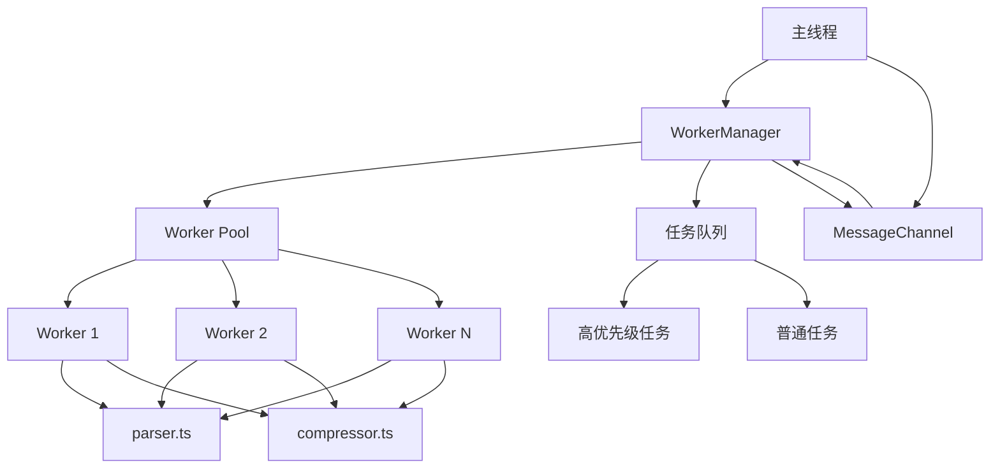

**Diagram sources**
- [WorkerManager.ts](file://packages/core/src/core/WorkerManager.ts#L40-L606)
- [lottie.worker.ts](file://packages/core/src/workers/lottie.worker.ts#L23-L76)

**Section sources**
- [WorkerManager.ts](file://packages/core/src/core/WorkerManager.ts#L1-L612)
- [lottie.worker.ts](file://packages/core/src/workers/lottie.worker.ts#L1-L79)

## 核心组件分析

### WorkerManager组件

WorkerManager是Web Worker系统的核心管理器，负责Worker池的创建、任务调度和生命周期管理。作为单例模式实现，确保全局唯一的Worker资源管理。

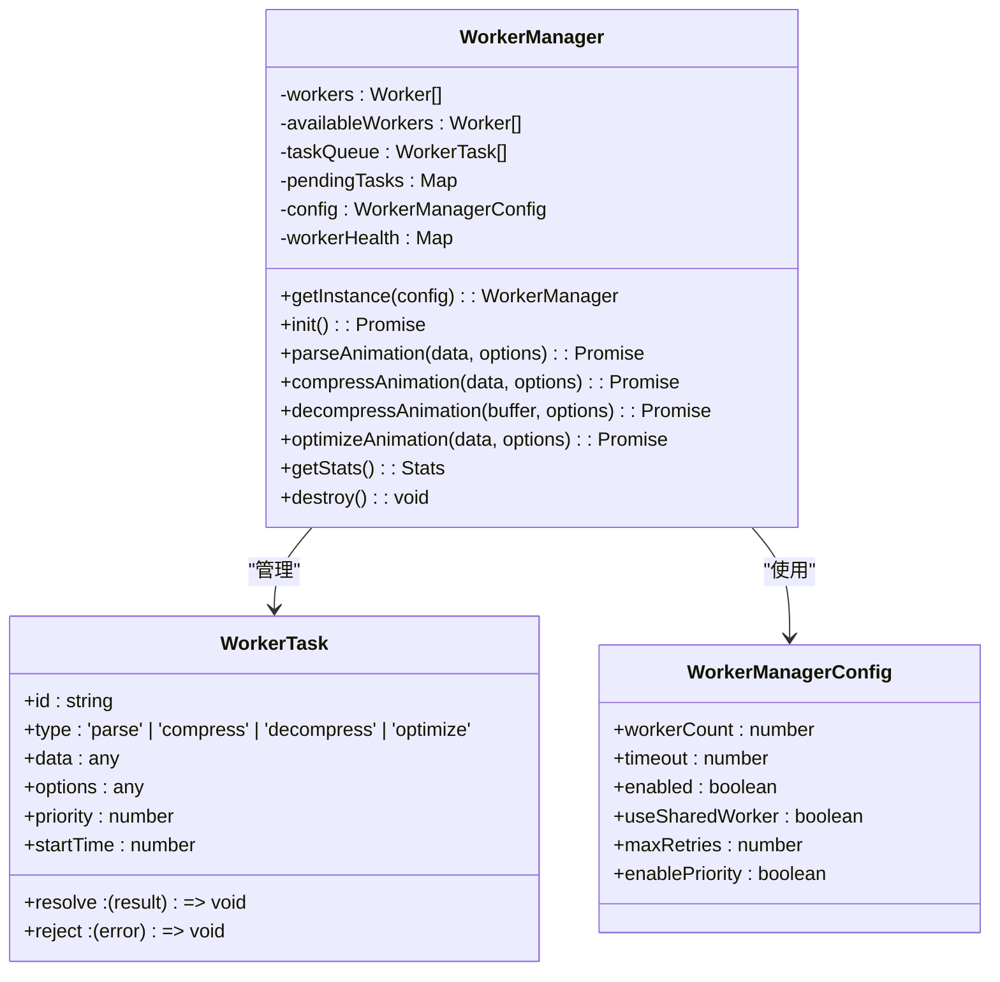

**Diagram sources**
- [WorkerManager.ts](file://packages/core/src/core/WorkerManager.ts#L40-L606)

**Section sources**
- [WorkerManager.ts](file://packages/core/src/core/WorkerManager.ts#L1-L612)

### 数据解析组件

数据解析组件负责在Worker线程中处理动画数据的解析和优化，确保主线程不被繁重的计算任务阻塞。

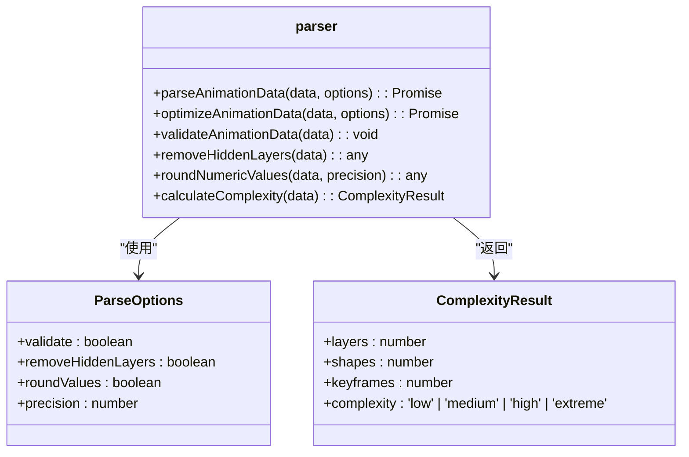

**Diagram sources**
- [parser.ts](file://packages/core/src/workers/parser.ts#L1-L210)

**Section sources**
- [parser.ts](file://packages/core/src/workers/parser.ts#L1-L210)

## Worker生命周期管理

WorkerManager通过智能的生命周期管理机制，确保Worker资源的高效利用和稳定运行。

### Worker创建流程

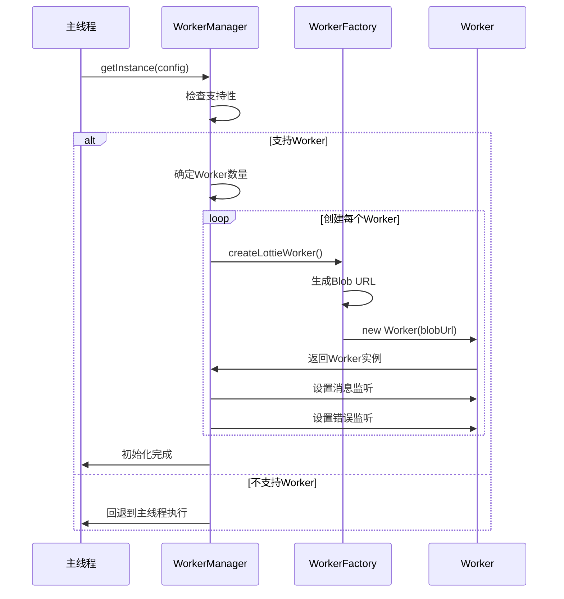

**Diagram sources**
- [WorkerManager.ts](file://packages/core/src/core/WorkerManager.ts#L98-L148)
- [WorkerFactory.ts](file://packages/core/src/core/WorkerFactory.ts#L134-L148)

### Worker销毁流程

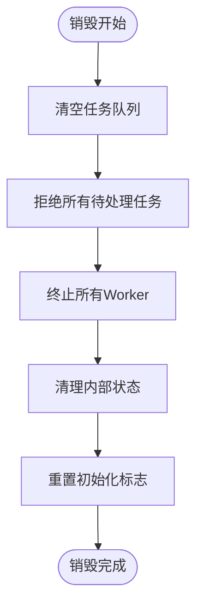

**Diagram sources**
- [WorkerManager.ts](file://packages/core/src/core/WorkerManager.ts#L575-L595)

**Section sources**
- [WorkerManager.ts](file://packages/core/src/core/WorkerManager.ts#L98-L148)
- [WorkerFactory.ts](file://packages/core/src/core/WorkerFactory.ts#L134-L153)

## 任务分发与通信机制

### 任务提交与处理流程

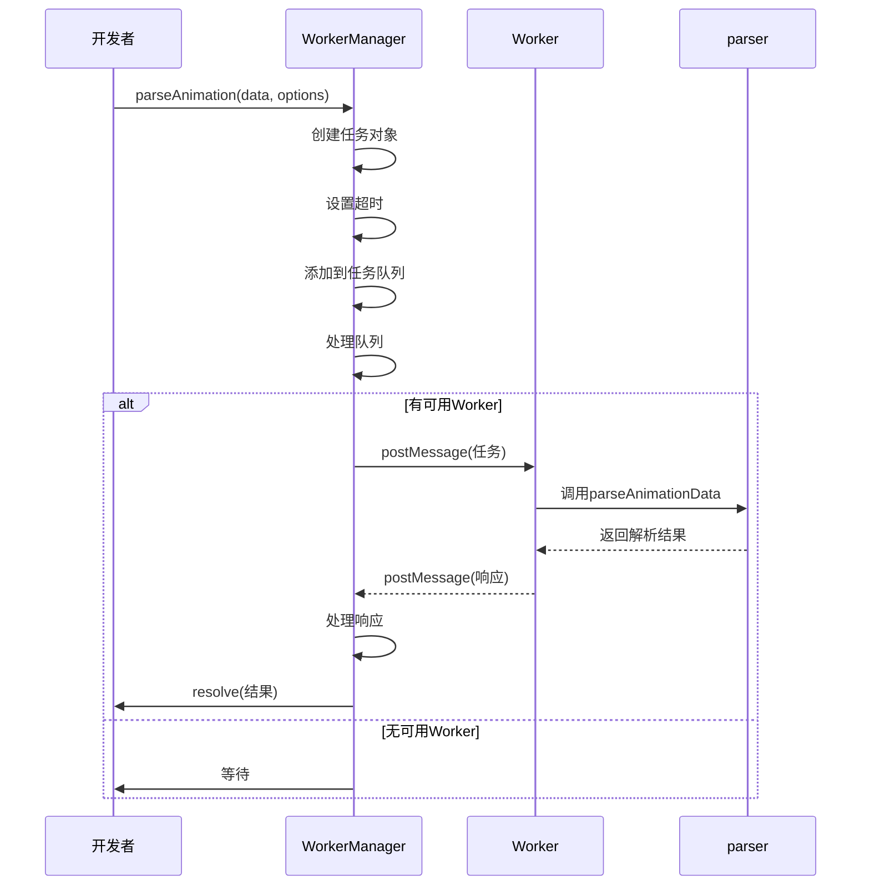

**Diagram sources**
- [WorkerManager.ts](file://packages/core/src/core/WorkerManager.ts#L359-L397)
- [lottie.worker.ts](file://packages/core/src/workers/lottie.worker.ts#L23-L76)

### 通信协议设计

系统采用标准化的消息协议进行主线程与Worker线程之间的通信，确保数据传输的可靠性和一致性。

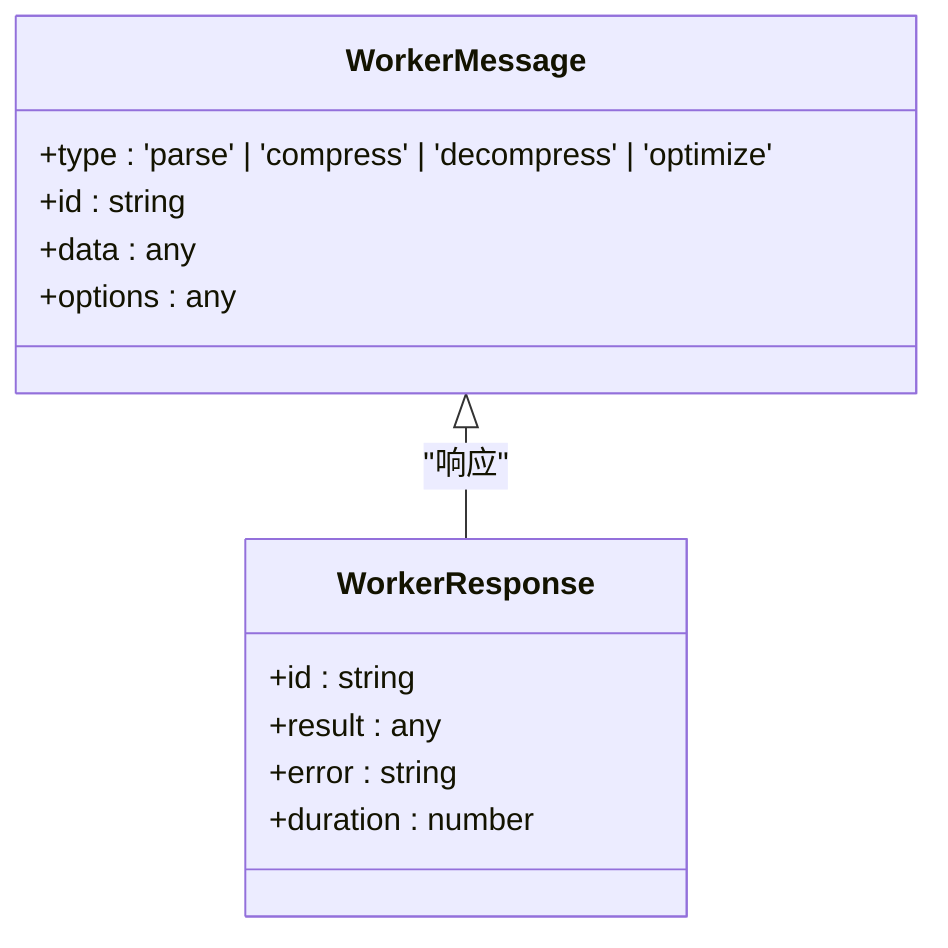

**Diagram sources**
- [lottie.worker.ts](file://packages/core/src/workers/lottie.worker.ts#L9-L21)

**Section sources**
- [WorkerManager.ts](file://packages/core/src/core/WorkerManager.ts#L359-L397)
- [lottie.worker.ts](file://packages/core/src/workers/lottie.worker.ts#L9-L79)

## 数据解析实现

### 动画数据解析流程

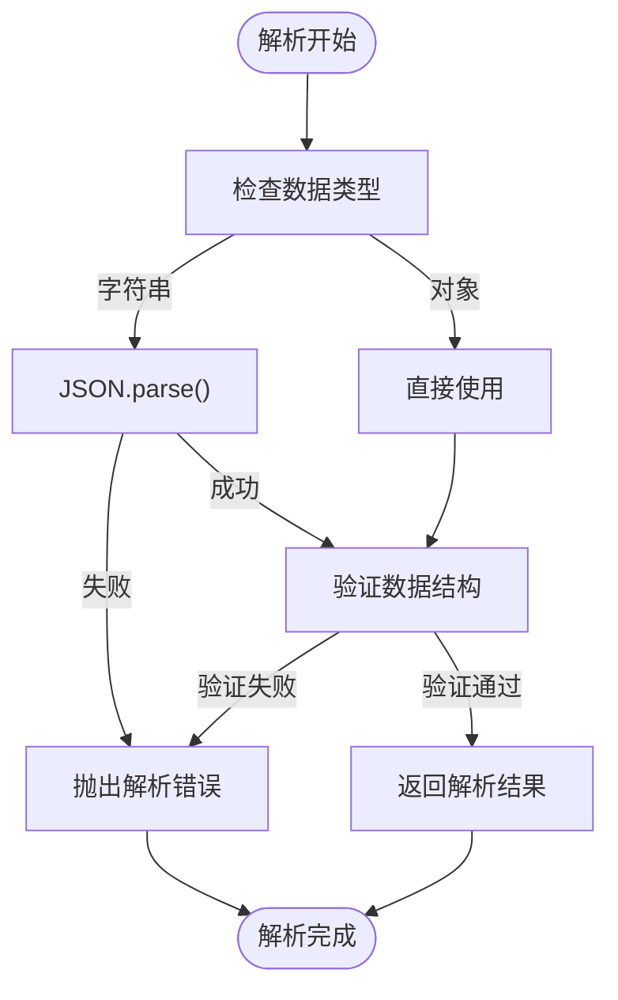

**Diagram sources**
- [parser.ts](file://packages/core/src/workers/parser.ts#L16-L40)

### 数据优化流程

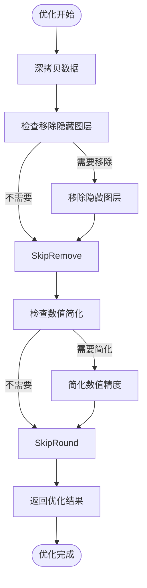

**Diagram sources**
- [parser.ts](file://packages/core/src/workers/parser.ts#L45-L63)

**Section sources**
- [parser.ts](file://packages/core/src/workers/parser.ts#L16-L63)

## 使用示例

### 基本配置与使用

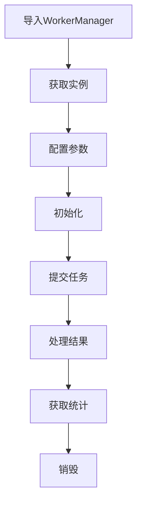

**Section sources**
- [WorkerManager.ts](file://packages/core/src/core/WorkerManager.ts#L88-L93)
- [OPTIMIZATION_SUMMARY.md](file://OPTIMIZATION_SUMMARY.md#L67-L73)

### 高级配置示例

```typescript
// Worker 配置
const workerManager = WorkerManager.getInstance({
  workerCount: 4,
  useSharedWorker: true,
  maxRetries: 3,
  enablePriority: true
})

// 高优先级任务
await workerManager.parseAnimation(data, { priority: 10 })

// 查看统计
const stats = workerManager.getStats()
console.log('Worker 健康状态:', stats.workerHealth)
```

**Section sources**
- [OPTIMIZATION_SUMMARY.md](file://OPTIMIZATION_SUMMARY.md#L67-L81)

## 错误处理与兼容性

### 错误处理机制

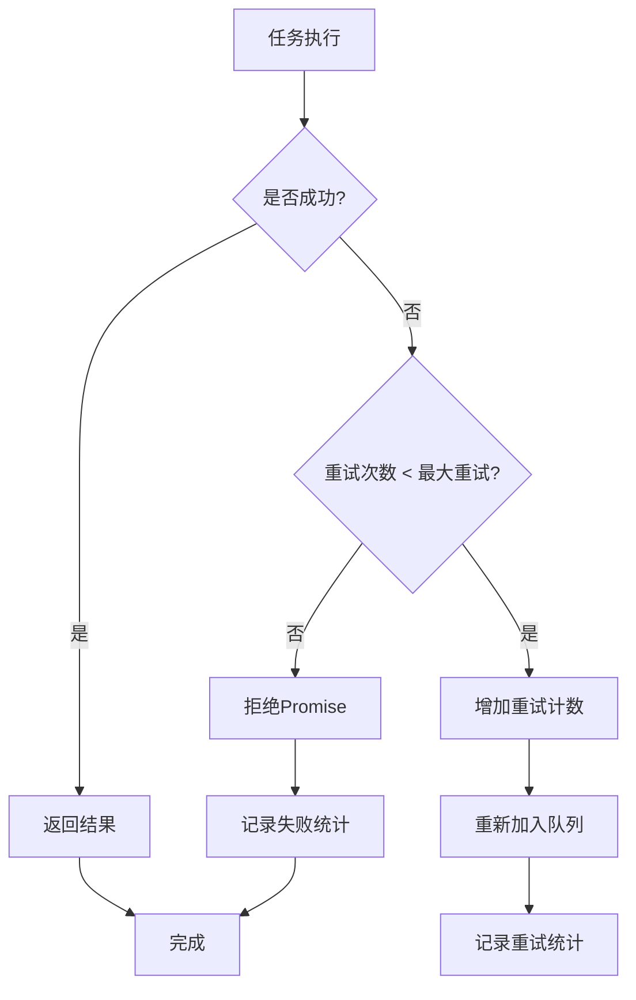

**Diagram sources**
- [WorkerManager.ts](file://packages/core/src/core/WorkerManager.ts#L298-L315)

### 兼容性处理

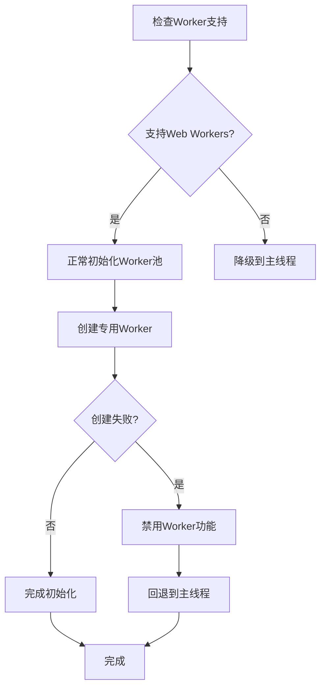

**Diagram sources**
- [WorkerManager.ts](file://packages/core/src/core/WorkerManager.ts#L103-L105)
- [WorkerFactory.ts](file://packages/core/src/core/WorkerFactory.ts#L158-L160)

**Section sources**
- [WorkerManager.ts](file://packages/core/src/core/WorkerManager.ts#L103-L105)
- [WorkerFactory.ts](file://packages/core/src/core/WorkerFactory.ts#L158-L160)

## 性能监控与调试

### 性能统计信息

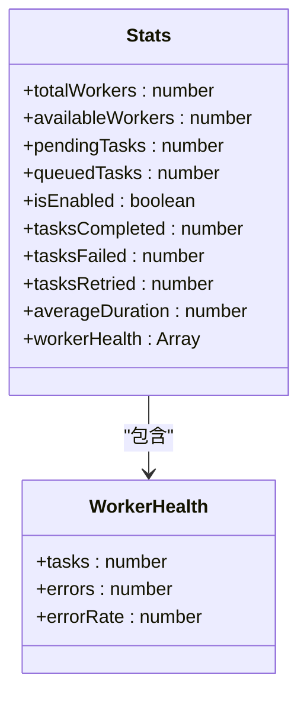

**Diagram sources**
- [WorkerManager.ts](file://packages/core/src/core/WorkerManager.ts#L538-L569)

### 调试技巧

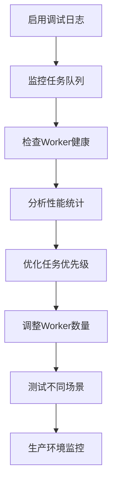

**Section sources**
- [WorkerManager.ts](file://packages/core/src/core/WorkerManager.ts#L538-L569)

## 总结

Web Worker管理系统通过多线程架构有效解决了Lottie动画解析过程中的性能瓶颈问题。系统采用Worker池管理、优先级任务队列、健康监控等先进机制，确保了高并发场景下的稳定性和可靠性。

核心优势包括：
- **性能优化**：将耗时的解析任务移出主线程，避免UI阻塞
- **资源管理**：智能的Worker池管理，合理利用系统资源
- **容错机制**：完善的错误处理和重试策略，提高系统稳定性
- **可扩展性**：支持多种任务类型，便于功能扩展
- **兼容性**：提供降级方案，确保在不支持Worker的环境中正常运行

开发者可以通过简单的API调用即可享受多线程带来的性能提升，同时系统提供的统计信息和调试工具帮助开发者更好地监控和优化应用性能。

**Section sources**
- [WorkerManager.ts](file://packages/core/src/core/WorkerManager.ts#L1-L612)
- [parser.ts](file://packages/core/src/workers/parser.ts#L1-L210)
- [lottie.worker.ts](file://packages/core/src/workers/lottie.worker.ts#L1-L79)