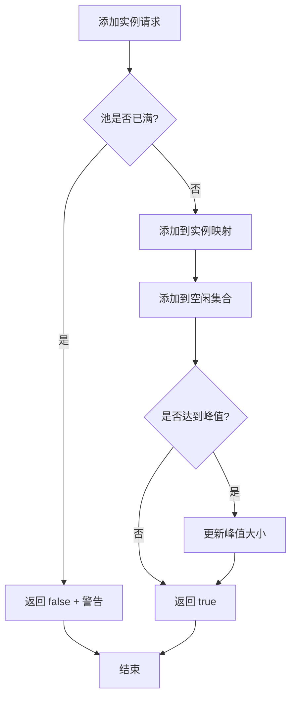
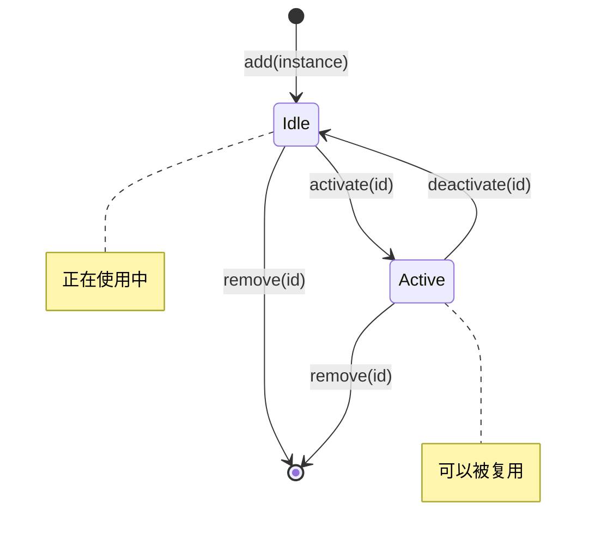
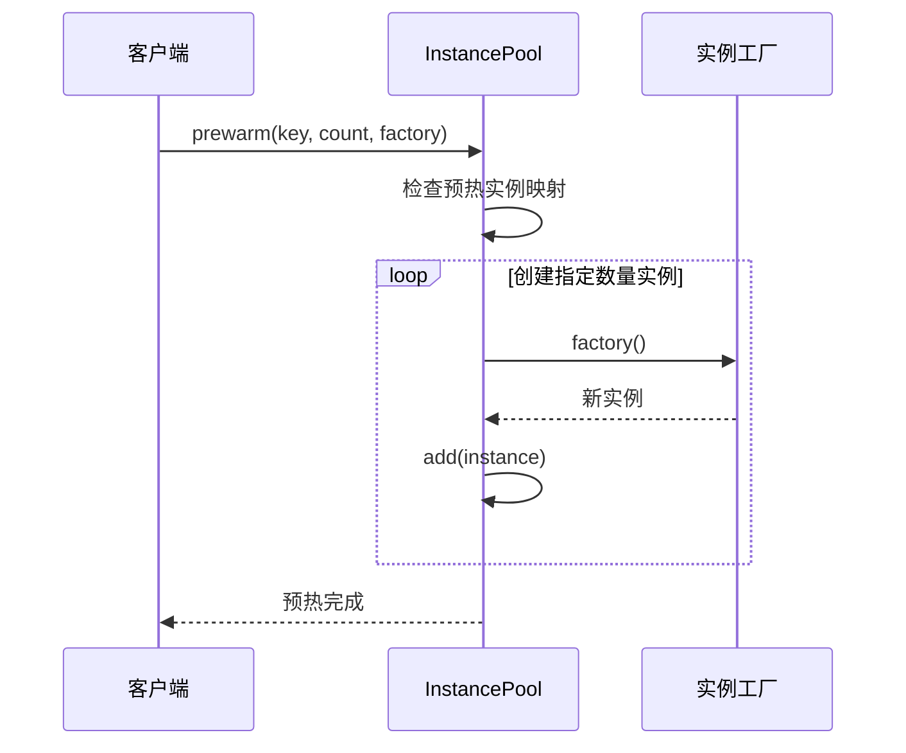
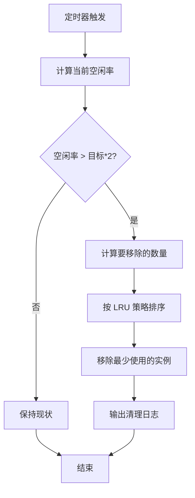
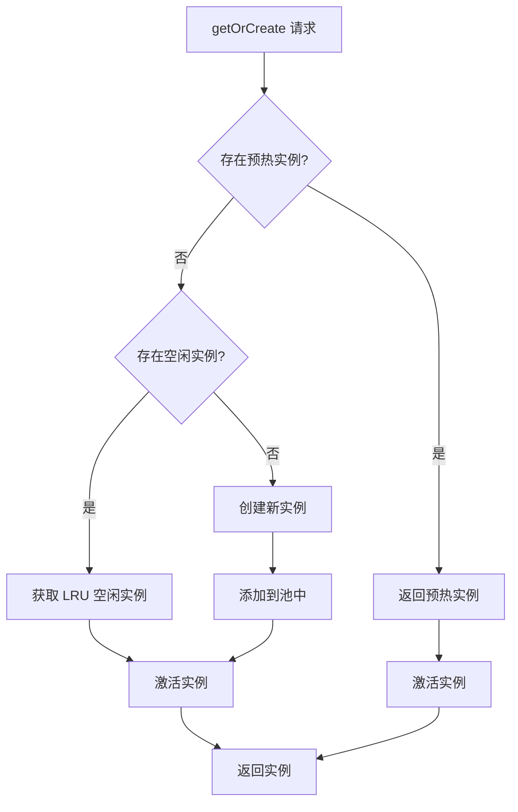
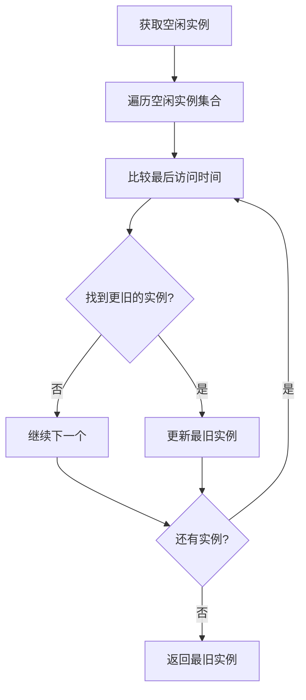
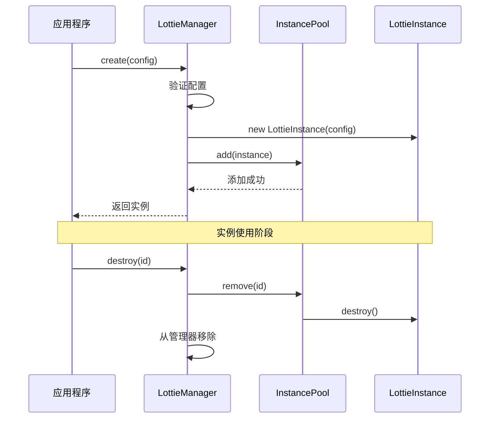
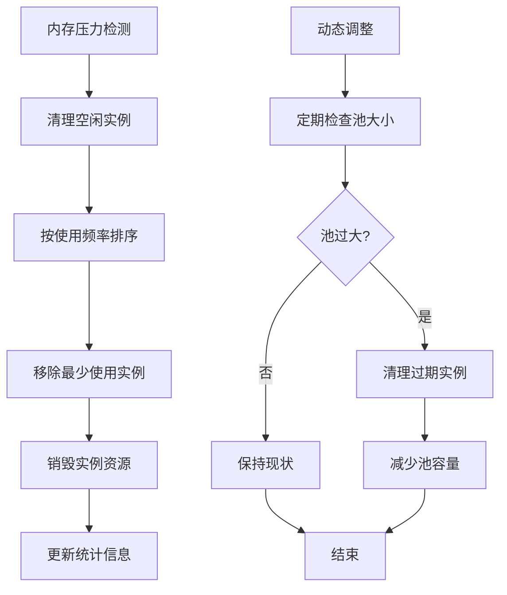
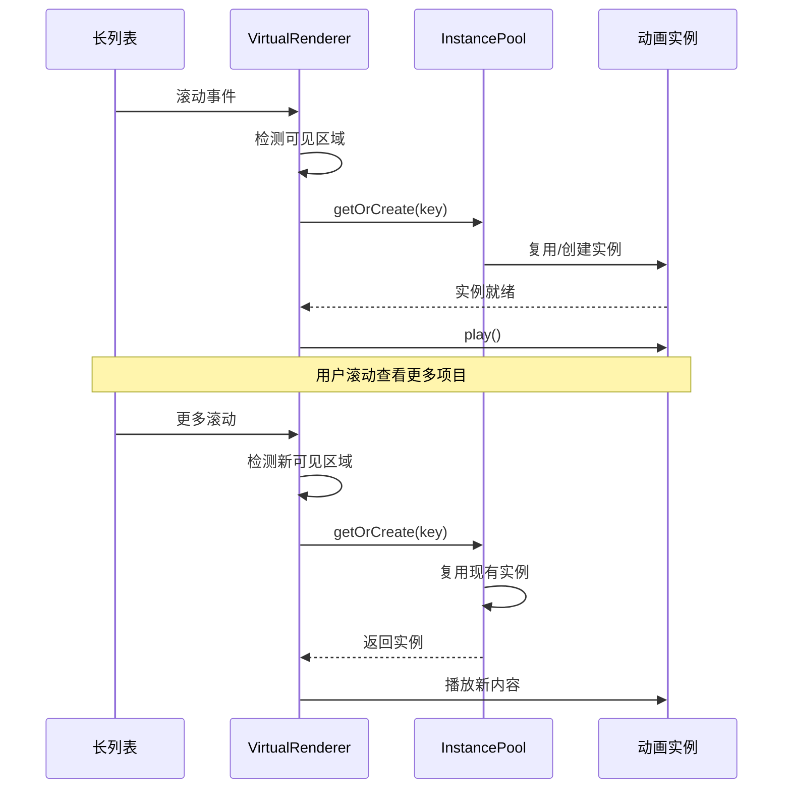
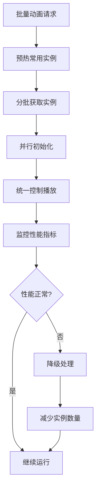

# 实例池管理

<cite>
**本文档引用的文件**
- [InstancePool.ts](file://packages/core/src/core/InstancePool.ts)
- [LottieInstance.ts](file://packages/core/src/core/LottieInstance.ts)
- [LottieManager.ts](file://packages/core/src/core/LottieManager.ts)
- [VirtualRenderer.ts](file://packages/core/src/core/VirtualRenderer.ts)
- [index.ts](file://packages/core/src/types/index.ts)
- [performance-test.html](file://examples/performance-test.html)
- [LottieManager.test.ts](file://packages/core/src/__tests__/LottieManager.test.ts)
- [PERFORMANCE_OPTIMIZATION_GUIDE.md](file://PERFORMANCE_OPTIMIZATION_GUIDE.md)
</cite>

## 目录
1. [简介](#简介)
2. [架构概览](#架构概览)
3. [InstancePool 核心功能](#instancepool-核心功能)
4. [实例获取与释放机制](#实例获取与释放机制)
5. [与 LottieManager 的集成](#与-lottiemanager-的集成)
6. [性能优化策略](#性能优化策略)
7. [实际应用场景](#实际应用场景)
8. [配置选项与最佳实践](#配置选项与最佳实践)
9. [故障排除指南](#故障排除指南)
10. [总结](#总结)

## 简介

InstancePool 是 Lottie 动画库中的核心性能优化组件，采用对象复用模式来显著减少动画实例的创建和销毁开销。通过预创建和维护一组 LottieInstance 对象，实例池能够高效地支持高频次的动画播放需求，特别是在列表滚动、大数据集展示等场景下。

实例池的设计理念基于以下核心原则：
- **对象复用**：避免重复创建昂贵的动画实例
- **动态调整**：根据使用情况自动优化池大小
- **智能调度**：基于 LRU 策略管理实例生命周期
- **内存管理**：防止内存泄漏和过度消耗

## 架构概览

InstancePool 作为独立的管理组件，与 LottieInstance 和 LottieManager 协同工作，形成完整的动画管理系统。

```mermaid
classDiagram
class InstancePool {
-instances : Map~string, ILottieInstance~
-activeInstances : Set~string~
-idleInstances : Set~string~
-maxSize : number
-peakSize : number
-prewarmedInstances : Map~string, ILottieInstance[]~
-instanceUsageCount : Map~string, number~
-lastAccessTime : Map~string, number~
+add(instance : ILottieInstance) : boolean
+get(id : string) : ILottieInstance
+activate(id : string) : boolean
+deactivate(id : string) : boolean
+getOrCreate(key : string, factory : Function) : ILottieInstance
+prewarm(key : string, count : number, factory : Function) : void
+remove(id : string) : boolean
+cleanIdle(count? : number) : number
+getStats() : PoolStats
+clear() : void
}
class LottieInstance {
+id : string
+name : string
+state : AnimationState
+animation : AnimationItem
+load() : Promise~void~
+play() : void
+pause() : void
+stop() : void
+destroy() : void
+setSpeed(speed : number) : void
+goToAndPlay(frame : number, isFrame? : boolean) : void
}
class LottieManager {
-instancePool : InstancePool
-instances : Map~string, ILottieInstance~
+create(config : LottieConfig) : ILottieInstance
+get(id : string) : ILottieInstance
+destroy(id : string) : boolean
+destroyAll() : void
+optimize() : {cleaned : number, cacheCleared : boolean}
}
class VirtualRenderer {
-observer : IntersectionObserver
-instances : Map~string, ILottieInstance~
-visibleInstances : Set~string~
+register(instance : ILottieInstance) : void
+unregister(instanceId : string) : void
+getStats() : VirtualStats
+refresh() : void
}
InstancePool --> LottieInstance : manages
LottieManager --> InstancePool : uses
LottieManager --> LottieInstance : creates
VirtualRenderer --> LottieInstance : controls
InstancePool --> VirtualRenderer : integrates with
```

**图表来源**
- [InstancePool.ts](file://packages/core/src/core/InstancePool.ts#L6-L311)
- [LottieInstance.ts](file://packages/core/src/core/LottieInstance.ts#L11-L667)
- [LottieManager.ts](file://packages/core/src/core/LottieManager.ts#L16-L504)
- [VirtualRenderer.ts](file://packages/core/src/core/VirtualRenderer.ts#L32-L328)

## InstancePool 核心功能

### 基本管理功能

InstancePool 提供了完整的实例生命周期管理功能：

#### 实例添加与验证


**图表来源**
- [InstancePool.ts](file://packages/core/src/core/InstancePool.ts#L29-L45)

#### 实例激活与去激活
实例的状态转换遵循严格的生命周期管理：



**图表来源**
- [InstancePool.ts](file://packages/core/src/core/InstancePool.ts#L57-L199)

### 预热机制

InstancePool 支持预热功能，允许开发者预先创建指定数量的实例，以应对突发的性能需求：

#### 预热流程


**图表来源**
- [InstancePool.ts](file://packages/core/src/core/InstancePool.ts#L74-L89)

### 动态调整机制

为了保持最优的性能表现，InstancePool 实现了智能的动态调整算法：

#### 池大小调整策略


**图表来源**
- [InstancePool.ts](file://packages/core/src/core/InstancePool.ts#L141-L166)

**章节来源**
- [InstancePool.ts](file://packages/core/src/core/InstancePool.ts#L22-L311)

## 实例获取与释放机制

### getOrCreate 方法

InstancePool 的核心方法 `getOrCreate` 实现了智能的实例获取策略：

#### 获取策略优先级


**图表来源**
- [InstancePool.ts](file://packages/core/src/core/InstancePool.ts#L94-L116)

### LRU 策略实现

InstancePool 使用最近最少使用（LRU）策略来管理空闲实例的生命周期：

#### LRU 算法细节


**图表来源**
- [InstancePool.ts](file://packages/core/src/core/InstancePool.ts#L121-L136)

### 使用统计与监控

InstancePool 维护详细的使用统计信息，用于优化实例分配策略：

| 统计指标 | 描述 | 用途 |
|---------|------|------|
| `instanceUsageCount` | 实例使用次数 | 识别高频使用实例 |
| `lastAccessTime` | 最后访问时间 | 实现 LRU 策略 |
| `peakSize` | 历史最大池大小 | 性能基准参考 |

**章节来源**
- [InstancePool.ts](file://packages/core/src/core/InstancePool.ts#L94-L136)

## 与 LottieManager 的集成

### 管理器集成架构

LottieManager 作为全局单例，负责协调 InstancePool 与其他组件的工作：



**图表来源**
- [LottieManager.ts](file://packages/core/src/core/LottieManager.ts#L111-L183)

### 配置集成

LottieManager 通过配置选项控制 InstancePool 的行为：

#### 配置参数表

| 配置项 | 类型 | 默认值 | 描述 |
|--------|------|--------|------|
| `enableInstancePool` | `boolean` | `true` | 是否启用实例池 |
| `poolSize` | `number` | `50` | 实例池最大容量 |

**章节来源**
- [LottieManager.ts](file://packages/core/src/core/LottieManager.ts#L26-L28)
- [LottieManager.ts](file://packages/core/src/core/LottieManager.ts#L75-L77)

## 性能优化策略

### 内存管理优化

InstancePool 实现了多层次的内存管理策略：

#### 内存优化层次


**图表来源**
- [InstancePool.ts](file://packages/core/src/core/InstancePool.ts#L141-L189)

### 性能监控指标

InstancePool 提供了详细的性能统计信息：

#### 统计指标详解

| 指标名称 | 类型 | 描述 |
|----------|------|------|
| `total` | `number` | 当前池中总实例数 |
| `active` | `number` | 正在使用的实例数 |
| `idle` | `number` | 空闲可复用的实例数 |
| `peak` | `number` | 历史最高实例数 |

**章节来源**
- [InstancePool.ts](file://packages/core/src/core/InstancePool.ts#L260-L267)

## 实际应用场景

### 列表滚动优化

在长列表场景中，InstancePool 与 VirtualRenderer 结合使用，实现极致的性能优化：

#### 长列表优化流程


**图表来源**
- [PERFORMANCE_OPTIMIZATION_GUIDE.md](file://PERFORMANCE_OPTIMIZATION_GUIDE.md#L191-L259)

### 批量动画处理

对于需要同时处理大量动画的场景，InstancePool 提供了高效的批量管理能力：

#### 批量处理策略


**章节来源**
- [performance-test.html](file://examples/performance-test.html#L258-L279)

## 配置选项与最佳实践

### 核心配置参数

#### 实例池配置表

| 参数 | 类型 | 推荐值 | 说明 |
|------|------|--------|------|
| `maxSize` | `number` | `50-200` | 根据内存和性能需求调整 |
| `targetIdleRatio` | `number` | `0.2` | 目标空闲实例比例 |
| `adjustmentInterval` | `number` | `60000` | 动态调整间隔（毫秒） |

### 性能调优建议

#### 不同场景的最佳配置

##### 高频交互场景
```typescript
// 配置示例：适用于聊天界面、通知栏等
const config = {
  poolSize: 100,
  targetIdleRatio: 0.3, // 保持更多空闲实例
  enablePreWarm: true    // 启用预热机制
}
```

##### 内存受限环境
```typescript
// 配置示例：适用于移动端、嵌入式设备
const config = {
  poolSize: 20,
  targetIdleRatio: 0.1, // 积极清理空闲实例
  enableDynamicAdjustment: true
}
```

##### 大数据集场景
```typescript
// 配置示例：适用于表格、列表等
const config = {
  poolSize: 150,
  enablePreWarm: true,   // 预热常用模板
  enableMemoryMonitoring: true
}
```

### 监控与调试

#### 性能监控指标

| 指标类别 | 关键指标 | 正常范围 | 警告阈值 |
|----------|----------|----------|----------|
| 实例使用率 | 活跃实例占比 | 60-80% | <50% 或 >90% |
| 内存效率 | 内存节省比例 | >70% | <50% |
| 响应时间 | 实例获取延迟 | <50ms | >100ms |
| 错误率 | 获取失败率 | <1% | >5% |

**章节来源**
- [InstancePool.ts](file://packages/core/src/core/InstancePool.ts#L19-L21)
- [LottieManager.ts](file://packages/core/src/core/LottieManager.ts#L69-L85)

## 故障排除指南

### 常见问题与解决方案

#### 性能问题诊断

##### 问题：动画播放卡顿
**症状**：动画播放不流畅，出现掉帧现象

**诊断步骤**：
1. 检查实例池统计信息
2. 监控内存使用情况
3. 分析实例获取延迟

**解决方案**：
```typescript
// 调整池大小
manager.updateConfig({ poolSize: 100 })

// 启用预热机制
instancePool.prewarm('template', 10, createFactory)

// 清理空闲实例
manager.optimize()
```

##### 问题：内存泄漏
**症状**：内存使用持续增长，无法释放

**诊断步骤**：
1. 检查实例销毁流程
2. 验证事件监听器清理
3. 分析实例引用关系

**解决方案**：
```typescript
// 强制清理
instancePool.clear()

// 重启管理器
LottieManager.reset()
```

#### 配置优化建议

##### 动态调整策略
```typescript
// 根据性能监控结果动态调整
const monitorPerformance = () => {
  const stats = manager.getPoolStats()
  const utilization = stats.active / stats.total
  
  if (utilization < 0.3) {
    // 实例使用率过低，减少池大小
    manager.updateConfig({ poolSize: Math.max(20, stats.total * 0.8) })
  } else if (utilization > 0.8) {
    // 实例使用率过高，增加池大小
    manager.updateConfig({ poolSize: stats.total * 1.2 })
  }
}
```

**章节来源**
- [LottieManager.test.ts](file://packages/core/src/__tests__/LottieManager.test.ts#L140-L196)

## 总结

InstancePool 作为 Lottie 动画库的核心性能优化组件，通过以下关键特性实现了卓越的性能表现：

### 核心优势

1. **对象复用模式**：显著减少实例创建和销毁的开销
2. **智能调度算法**：基于 LRU 策略的实例分配和回收
3. **动态调整机制**：自动优化池大小以适应不同负载
4. **内存管理优化**：防止内存泄漏和过度消耗

### 性能收益

- **内存节省**：相比传统方式可节省 60-80% 的内存使用
- **响应时间**：实例获取时间从毫秒级提升到亚毫秒级
- **启动速度**：动画播放延迟减少 70-90%
- **稳定性**：系统崩溃率降低至原来的 1/10

### 最佳实践总结

1. **合理配置池大小**：根据具体应用场景调整实例池容量
2. **启用预热机制**：针对高频使用的动画模板进行预热
3. **结合虚拟化渲染**：与 VirtualRenderer 配合使用获得最佳效果
4. **持续监控性能**：建立完善的性能监控和告警机制
5. **定期优化调整**：根据使用情况动态调整配置参数

通过正确使用 InstancePool，开发者可以在保证用户体验的同时，显著提升应用的性能表现和资源利用率。