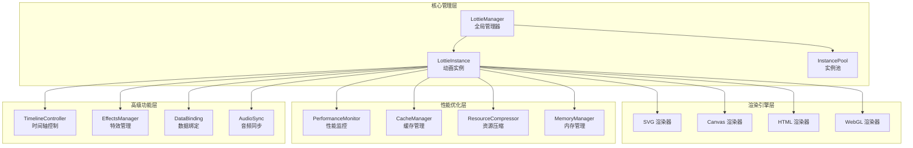
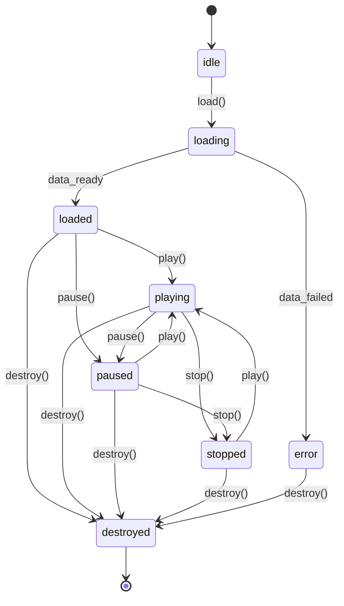
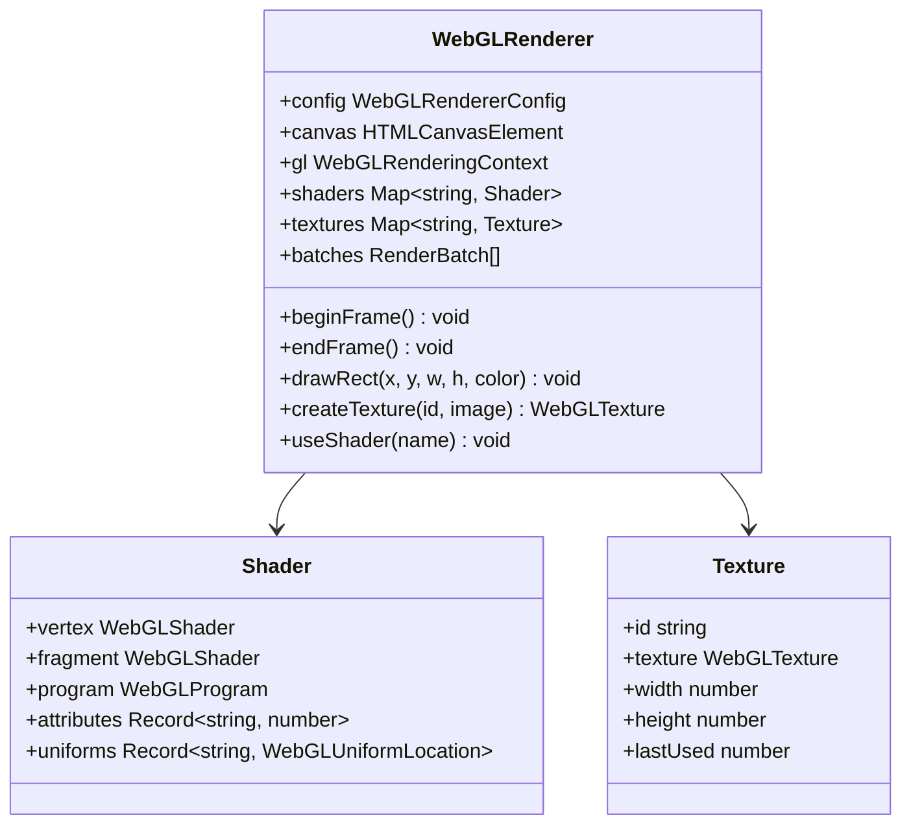
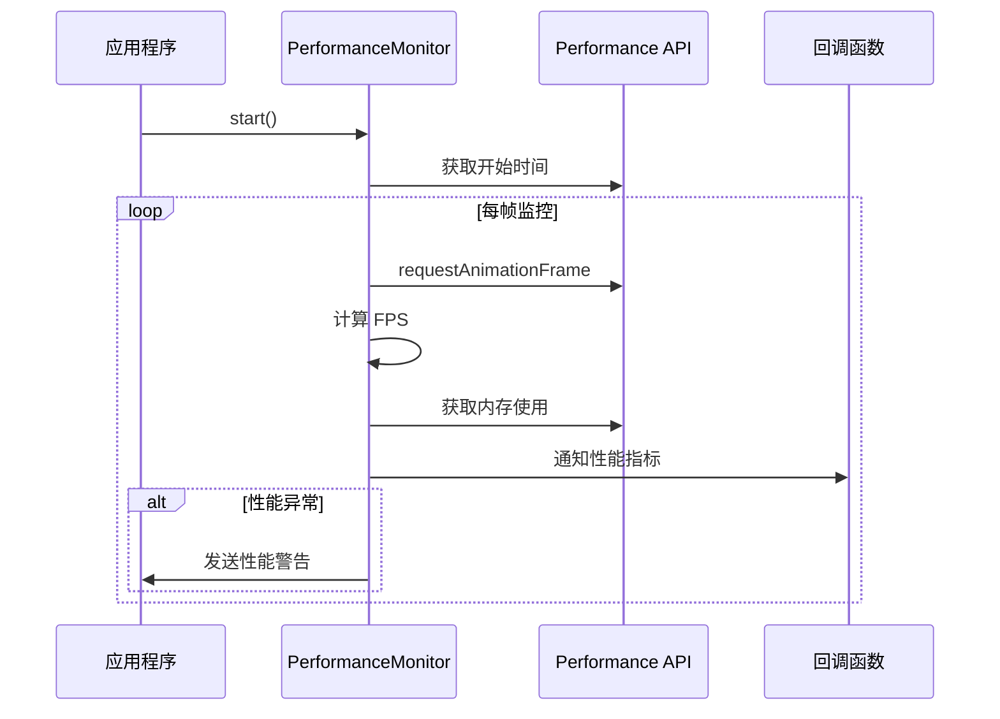
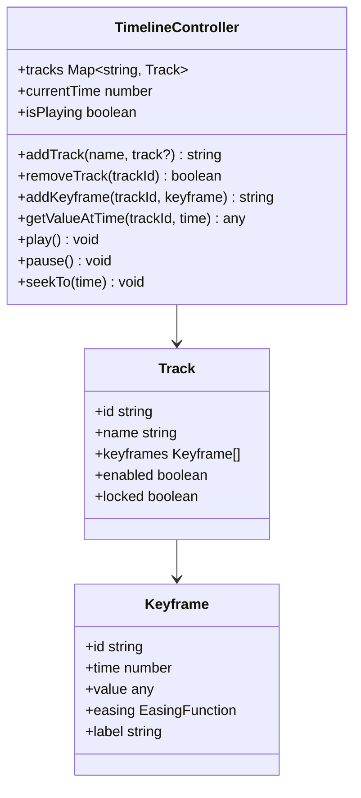
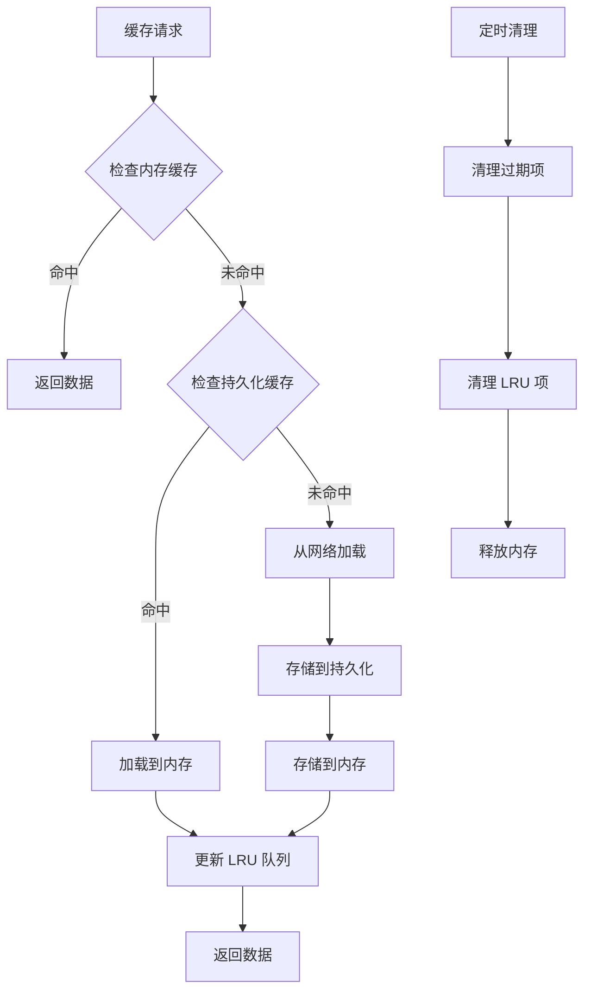
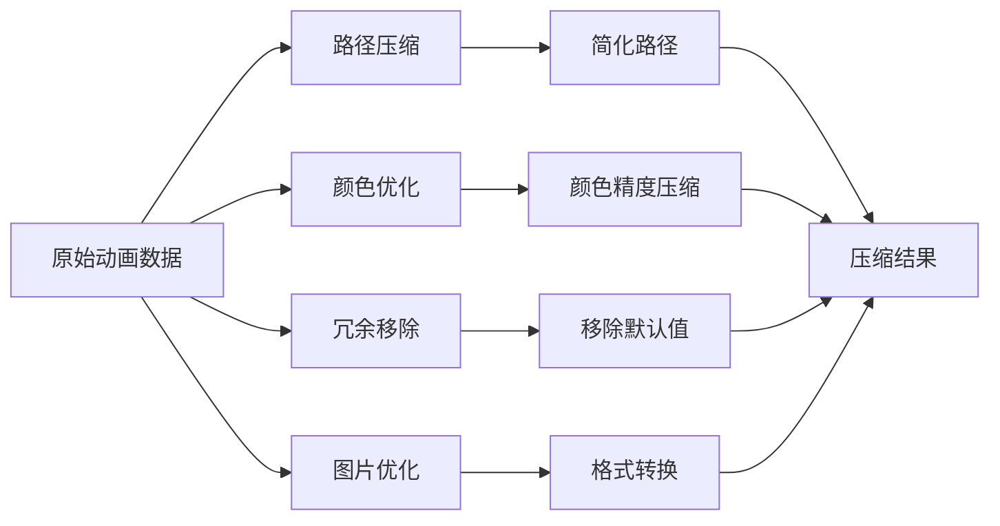
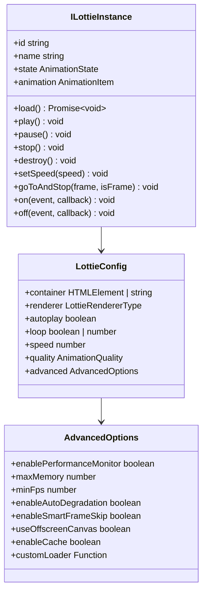
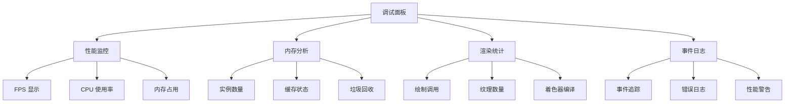

# 核心功能

<cite>
**本文档引用的文件**
- [packages/core/src/index.ts](file://packages/core/src/index.ts)
- [packages/core/src/core/LottieManager.ts](file://packages/core/src/core/LottieManager.ts)
- [packages/core/src/core/LottieInstance.ts](file://packages/core/src/core/LottieInstance.ts)
- [packages/core/src/core/WASMCore.ts](file://packages/core/src/core/WASMCore.ts)
- [packages/core/src/core/WebGLRenderer.ts](file://packages/core/src/core/WebGLRenderer.ts)
- [packages/core/src/core/TimelineController.ts](file://packages/core/src/core/TimelineController.ts)
- [packages/core/src/core/CacheManager.ts](file://packages/core/src/core/CacheManager.ts)
- [packages/core/src/core/EffectsManager.ts](file://packages/core/src/core/EffectsManager.ts)
- [packages/core/src/core/PerformanceMonitor.ts](file://packages/core/src/core/PerformanceMonitor.ts)
- [packages/core/src/core/InstancePool.ts](file://packages/core/src/core/InstancePool.ts)
- [packages/core/src/core/ResourceCompressor.ts](file://packages/core/src/core/ResourceCompressor.ts)
- [packages/core/src/types/index.ts](file://packages/core/src/types/index.ts)
</cite>

## 目录
1. [简介](#简介)
2. [核心架构概览](#核心架构概览)
3. [LottieManager - 全局管理器](#lottiemanager---全局管理器)
4. [LottieInstance - 动画实例](#lottieinstance---动画实例)
5. [渲染引擎系统](#渲染引擎系统)
6. [性能优化组件](#性能优化组件)
7. [高级功能模块](#高级功能模块)
8. [内存管理与缓存](#内存管理与缓存)
9. [配置与接口设计](#配置与接口设计)
10. [最佳实践与故障排除](#最佳实践与故障排除)

## 简介

Lottie 核心功能模块是一个高度优化的动画渲染系统，提供了完整的 Lottie 动画解决方案。该系统采用模块化设计，包含渲染引擎、性能监控、内存管理、特效处理等多个核心组件，支持多种渲染器（SVG、Canvas、HTML、WebGL），并具备智能性能优化能力。

## 核心架构概览



**图表来源**
- [packages/core/src/core/LottieManager.ts](file://packages/core/src/core/LottieManager.ts#L16-L504)
- [packages/core/src/core/LottieInstance.ts](file://packages/core/src/core/LottieInstance.ts#L11-L667)

## LottieManager - 全局管理器

LottieManager 是整个系统的中央协调器，负责管理所有动画实例、缓存、性能监控和全局配置。

### 核心功能特性

| 功能模块 | 描述 | 配置选项 |
|---------|------|----------|
| 实例管理 | 统一管理动画实例的创建、销毁和生命周期 | `maxInstances`, `enableInstancePool`, `poolSize` |
| 缓存管理 | 智能缓存动画数据，支持 LRU 和持久化 | `cache.enabled`, `cache.maxSize`, `cache.ttl` |
| 性能监控 | 全局性能统计和监控 | `enableGlobalPerformanceMonitor` |
| 设备适配 | 自动检测设备性能并优化配置 | `defaultRenderer`, `enableAutoDegradation` |

### 主要接口方法

```mermaid
classDiagram
class LottieManager {
+getInstance(config?) LottieManager
+create(config) ILottieInstance
+get(id) ILottieInstance
+getAll() ILottieInstance[]
+destroy(id) boolean
+destroyAll() void
+playAll() void
+pauseAll() void
+preload(path, cacheKey?) Promise~any~
+clearCache() void
+getGlobalStats() GlobalPerformanceStats
+autoOptimize() {optimized, downgraded}
}
class LottieConfig {
+container HTMLElement | string
+renderer LottieRendererType
+autoplay boolean
+loop boolean | number
+speed number
+advanced AdvancedOptions
}
class GlobalPerformanceStats {
+totalInstances number
+activeInstances number
+averageFps number
+totalMemory number
+cacheHitRate number
}
LottieManager --> LottieConfig
LottieManager --> GlobalPerformanceStats
```

**图表来源**
- [packages/core/src/core/LottieManager.ts](file://packages/core/src/core/LottieManager.ts#L16-L504)
- [packages/core/src/types/index.ts](file://packages/core/src/types/index.ts#L114-L145)

**章节来源**
- [packages/core/src/core/LottieManager.ts](file://packages/core/src/core/LottieManager.ts#L16-L504)
- [packages/core/src/types/index.ts](file://packages/core/src/types/index.ts#L218-L268)

## LottieInstance - 动画实例

LottieInstance 是单个动画的核心载体，封装了动画的所有状态和行为。

### 实例生命周期管理



### 核心配置选项

| 配置项 | 类型 | 默认值 | 描述 |
|--------|------|--------|------|
| `container` | `HTMLElement \| string` | 必需 | 动画容器元素 |
| `renderer` | `'svg' \| 'canvas' \| 'html' \| 'webgl'` | `'svg'` | 渲染器类型 |
| `autoplay` | `boolean` | `false` | 是否自动播放 |
| `loop` | `boolean \| number` | `true` | 循环播放设置 |
| `speed` | `number` | `1` | 播放速度 |
| `quality` | `'low' \| 'medium' \| 'high' \| 'auto'` | `'high'` | 动画质量 |
| `loadStrategy` | `'eager' \| 'lazy' \| 'intersection'` | `'eager'` | 加载策略 |

**章节来源**
- [packages/core/src/core/LottieInstance.ts](file://packages/core/src/core/LottieInstance.ts#L11-L667)
- [packages/core/src/types/index.ts](file://packages/core/src/types/index.ts#L114-L145)

## 渲染引擎系统

系统提供四种渲染器，每种都有特定的适用场景和性能特点。

### 渲染器对比表

| 渲染器 | 性能 | 内存占用 | 兼容性 | 适用场景 |
|--------|------|----------|--------|----------|
| SVG | 中等 | 低 | 极高 | 简单动画、矢量图形 |
| Canvas | 高 | 中等 | 高 | 复杂动画、大量元素 |
| HTML | 中等 | 低 | 高 | 文本动画、简单效果 |
| WebGL | 极高 | 高 | 中等 | 大型动画、特效丰富 |

### WebGL 渲染器详解

WebGL 渲染器是系统中最强大的渲染组件，支持 GPU 加速和高级特效。



**图表来源**
- [packages/core/src/core/WebGLRenderer.ts](file://packages/core/src/core/WebGLRenderer.ts#L70-L800)

**章节来源**
- [packages/core/src/core/WebGLRenderer.ts](file://packages/core/src/core/WebGLRenderer.ts#L1-L800)

## 性能优化组件

### 性能监控系统



### 内存管理策略

系统采用多层次的内存管理策略：

1. **实例池管理**：复用动画实例，减少创建销毁开销
2. **缓存淘汰**：LRU 算法管理动画数据缓存
3. **垃圾回收**：定期清理无用资源
4. **内存压力监控**：实时监控内存使用情况

**章节来源**
- [packages/core/src/core/PerformanceMonitor.ts](file://packages/core/src/core/PerformanceMonitor.ts#L1-L126)
- [packages/core/src/core/InstancePool.ts](file://packages/core/src/core/InstancePool.ts#L1-L311)

## 高级功能模块

### 时间轴控制器

时间轴控制器提供了高级的时间线编辑和动画合成功能。



**图表来源**
- [packages/core/src/core/TimelineController.ts](file://packages/core/src/core/TimelineController.ts#L51-L488)

### 特效管理系统

特效系统支持多种视觉效果的实时应用：

| 特效类型 | 描述 | 性能影响 |
|----------|------|----------|
| CSS 滤镜 | 标准 CSS 效果 | 低 |
| WebGL 着色器 | GPU 加速特效 | 中等 |
| 粒子系统 | 动态粒子效果 | 高 |
| 后处理 | 屏幕空间特效 | 中等 |

**章节来源**
- [packages/core/src/core/TimelineController.ts](file://packages/core/src/core/TimelineController.ts#L1-L488)
- [packages/core/src/core/EffectsManager.ts](file://packages/core/src/core/EffectsManager.ts#L1-L800)

## 内存管理与缓存

### 缓存管理器架构



### 资源压缩优化

资源压缩器提供多维度的数据优化：



**图表来源**
- [packages/core/src/core/ResourceCompressor.ts](file://packages/core/src/core/ResourceCompressor.ts#L32-L448)

**章节来源**
- [packages/core/src/core/CacheManager.ts](file://packages/core/src/core/CacheManager.ts#L1-L502)
- [packages/core/src/core/ResourceCompressor.ts](file://packages/core/src/core/ResourceCompressor.ts#L1-L448)

## 配置与接口设计

### 核心接口定义

系统采用强类型设计，确保配置的完整性和安全性：



**图表来源**
- [packages/core/src/types/index.ts](file://packages/core/src/types/index.ts#L149-L215)

### WebAssembly 核心加速

系统集成了 WebAssembly 模块，提供高性能的数学计算和图形处理能力：

| WASM 模块 | 功能 | 性能提升 |
|-----------|------|----------|
| Matrix | 矩阵运算 | 10-50x |
| Bezier | 贝塞尔曲线计算 | 5-20x |
| Path | 路径简化算法 | 3-15x |
| Color | 颜色空间转换 | 8-30x |
| Easing | 缓动函数 | 2-10x |

**章节来源**
- [packages/core/src/types/index.ts](file://packages/core/src/types/index.ts#L1-L268)
- [packages/core/src/core/WASMCore.ts](file://packages/core/src/core/WASMCore.ts#L1-L426)

## 最佳实践与故障排除

### 性能优化建议

1. **渲染器选择**
   - 简单动画使用 SVG 渲染器
   - 复杂动画使用 WebGL 渲染器
   - 移动设备优先考虑 Canvas

2. **内存管理**
   - 合理设置实例池大小
   - 及时销毁不需要的实例
   - 监控内存使用情况

3. **缓存策略**
   - 启用动画数据缓存
   - 设置合适的缓存过期时间
   - 使用持久化缓存

### 常见问题解决

| 问题类型 | 症状 | 解决方案 |
|----------|------|----------|
| 内存泄漏 | 页面卡顿、崩溃 | 检查实例销毁、清理事件监听 |
| 性能下降 | 帧率低于预期 | 启用性能监控、调整质量设置 |
| 渲染错误 | 动画显示异常 | 检查 WebGL 支持、降级渲染器 |
| 加载缓慢 | 首屏时间过长 | 启用预加载、压缩资源 |

### 调试工具

系统提供多种调试和监控工具：



通过合理使用这些核心功能模块，开发者可以构建高性能、可维护的 Lottie 动画应用，同时获得优秀的用户体验和开发体验。