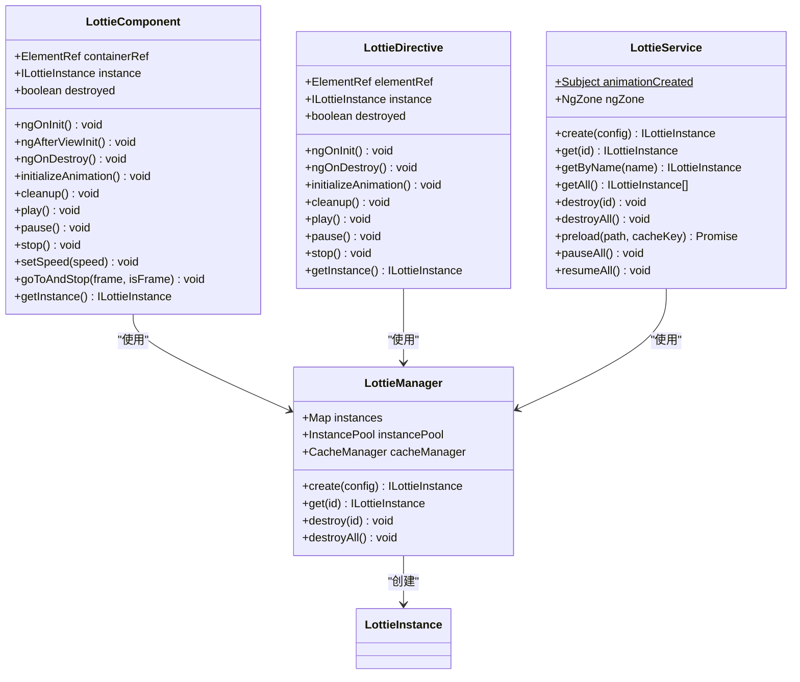
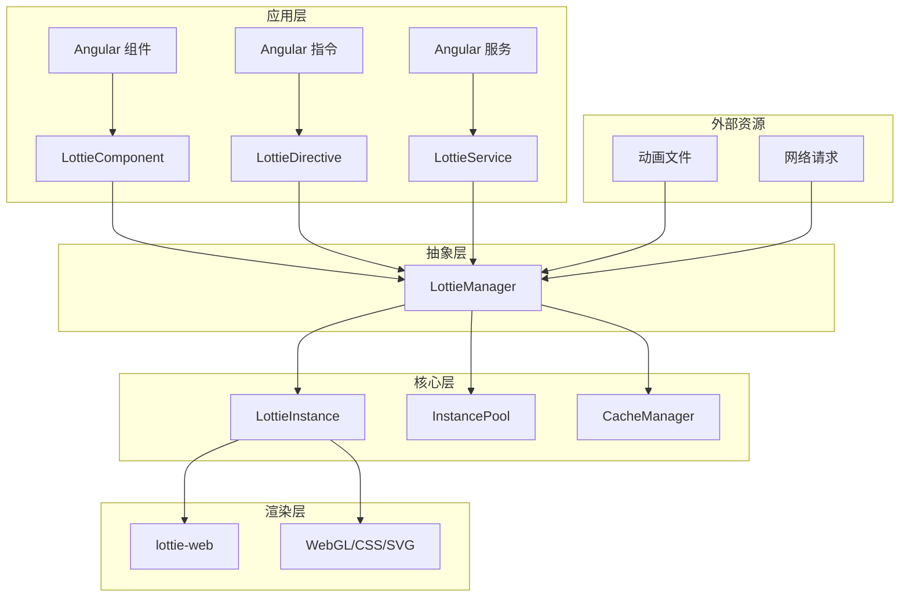
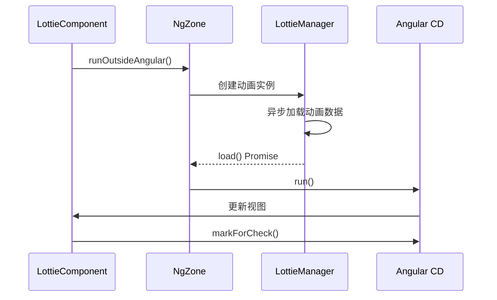
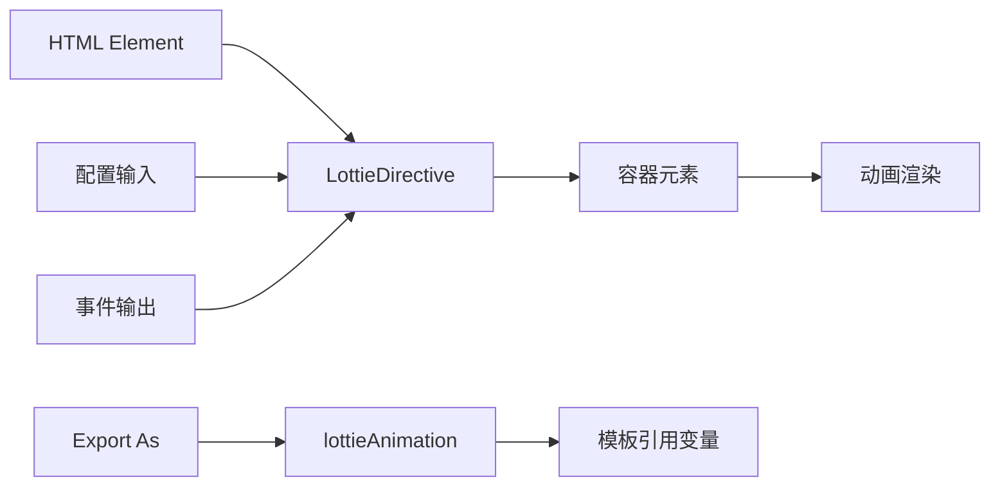
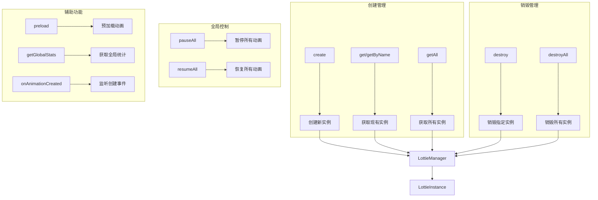
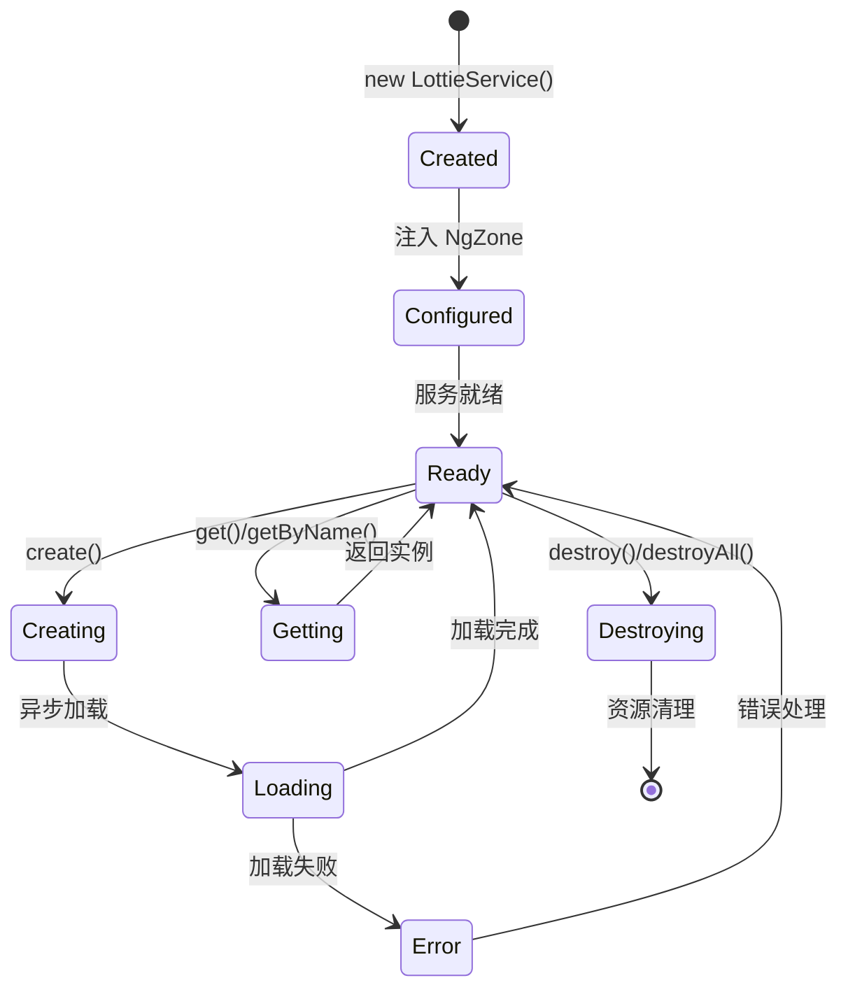
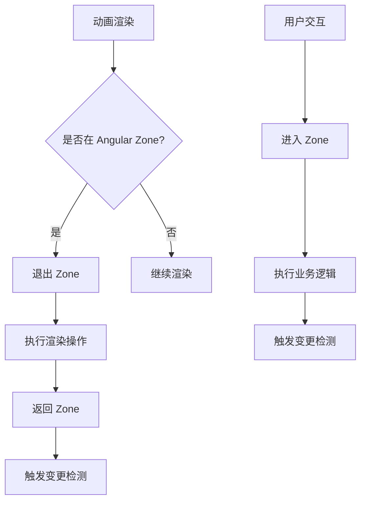
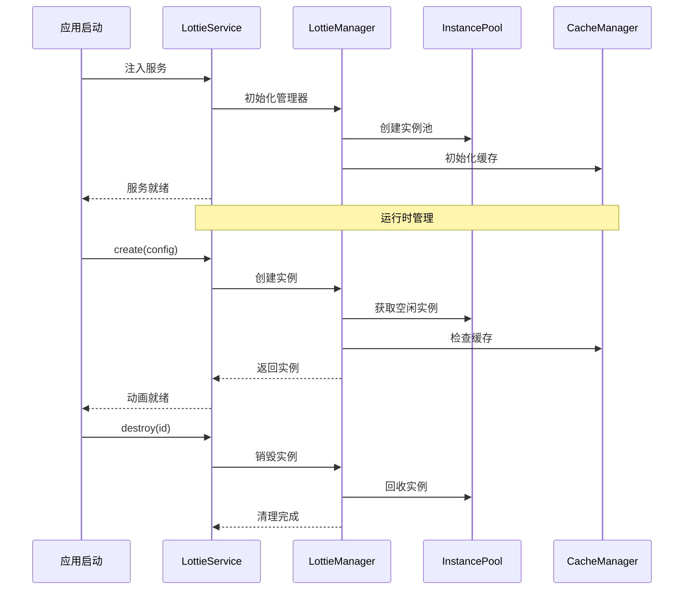

# Angular 集成

<cite>
**本文档中引用的文件**
- [lottie.component.ts](file://packages/angular/src/lottie.component.ts)
- [lottie.directive.ts](file://packages/angular/src/lottie.directive.ts)
- [lottie.service.ts](file://packages/angular/src/lottie.service.ts)
- [index.ts](file://packages/angular/src/index.ts)
- [package.json](file://packages/angular/package.json)
- [app.component.ts](file://examples/angular-demo/src/app/app.component.ts)
- [lottie.component.spec.ts](file://packages/angular/src/__tests__/lottie.component.spec.ts)
- [LottieManager.ts](file://packages/core/src/core/LottieManager.ts)
- [index.ts](file://packages/core/src/types/index.ts)
</cite>

## 目录
1. [简介](#简介)
2. [项目结构](#项目结构)
3. [核心组件](#核心组件)
4. [架构概览](#架构概览)
5. [详细组件分析](#详细组件分析)
6. [依赖关系分析](#依赖关系分析)
7. [性能考虑](#性能考虑)
8. [故障排除指南](#故障排除指南)
9. [结论](#结论)

## 简介

Lottie Angular 集成提供了完整的 Angular 生态系统支持，包含三个主要的抽象层：LottieComponent（组件）、LottieDirective（指令）和 LottieService（服务）。这些抽象层为开发者提供了灵活的方式来在 Angular 应用中集成和管理 Lottie 动画，同时充分利用了 Angular 的依赖注入、变更检测和模块系统。

该集成特别注重性能优化，通过 NgZone.runOutsideAngular 来避免不必要的变更检测，以及 ChangeDetectionStrategy.OnPush 策略来最小化渲染开销。同时，它还提供了完整的生命周期管理和错误处理机制。

## 项目结构

Angular 包采用标准的 Angular 工作区结构，专注于提供三个核心抽象：

```mermaid
graph TB
subgraph "Angular 包结构"
A[src/] --> B[lottie.component.ts]
A --> C[lottie.directive.ts]
A --> D[lottie.service.ts]
A --> E[index.ts]
F[examples/angular-demo/] --> G[src/app/app.component.ts]
F --> H[vite.config.ts]
I[packages/core/] --> J[LottieManager.ts]
I --> K[LottieInstance.ts]
end
subgraph "核心依赖"
L[@ldesign/lottie-core] --> M[LottieManager]
N[Angular Core] --> O[NgZone]
N --> P[ChangeDetectorRef]
Q[RxJS] --> R[Observable]
end
B --> L
C --> L
D --> L
B --> N
C --> N
D --> N
```

**图表来源**
- [lottie.component.ts](file://packages/angular/src/lottie.component.ts#L1-L261)
- [lottie.directive.ts](file://packages/angular/src/lottie.directive.ts#L1-L176)
- [lottie.service.ts](file://packages/angular/src/lottie.service.ts#L1-L132)

**章节来源**
- [package.json](file://packages/angular/package.json#L1-L72)
- [index.ts](file://packages/angular/src/index.ts#L1-L27)

## 核心组件

Angular 集成包含三个核心组件，每个都针对不同的使用场景进行了优化：

### 组件层次结构



**图表来源**
- [lottie.component.ts](file://packages/angular/src/lottie.component.ts#L55-L261)
- [lottie.directive.ts](file://packages/angular/src/lottie.directive.ts#L37-L176)
- [lottie.service.ts](file://packages/angular/src/lottie.service.ts#L25-L132)
- [LottieManager.ts](file://packages/core/src/core/LottieManager.ts#L16-L200)

**章节来源**
- [lottie.component.ts](file://packages/angular/src/lottie.component.ts#L1-L261)
- [lottie.directive.ts](file://packages/angular/src/lottie.directive.ts#L1-L176)
- [lottie.service.ts](file://packages/angular/src/lottie.service.ts#L1-L132)

## 架构概览

Angular 集成采用了分层架构设计，确保了良好的关注点分离和可维护性：



**图表来源**
- [lottie.component.ts](file://packages/angular/src/lottie.component.ts#L1-L50)
- [lottie.directive.ts](file://packages/angular/src/lottie.directive.ts#L1-L50)
- [lottie.service.ts](file://packages/angular/src/lottie/service.ts#L1-L50)
- [LottieManager.ts](file://packages/core/src/core/LottieManager.ts#L16-L50)

## 详细组件分析

### LottieComponent - Angular 组件

LottieComponent 是最常用的抽象，提供了完整的 Angular 组件功能，包括模板、样式和生命周期管理。

#### 核心特性

| 特性 | 描述 | 默认值 |
|------|------|--------|
| 选择器 | `lottie-animation` | - |
| 立即执行 | `standalone: true` | - |
| 变更检测 | `ChangeDetectionStrategy.OnPush` | - |
| 渲染器 | 支持 SVG、Canvas、HTML、WebGL | `'svg'` |
| 循环播放 | 支持布尔值或数字 | `true` |
| 自动播放 | 控制初始播放行为 | `true` |
| 播放速度 | 动画播放倍速 | `1` |

#### 输入属性配置

```mermaid
flowchart TD
A[LottieComponent 输入] --> B[path: string]
A --> C[animationData: any]
A --> D[renderer: LottieRendererType]
A --> E[loop: boolean | number]
A --> F[autoplay: boolean]
A --> G[speed: number]
A --> H[name: string]
A --> I[config: Partial<LottieConfig>]
B --> J[动画文件路径]
C --> K[预解析动画数据]
D --> L[渲染器类型选择]
E --> M[循环控制]
F --> N[自动播放控制]
G --> O[播放速度调节]
H --> P[实例命名]
I --> Q[完整配置覆盖]
```

**图表来源**
- [lottie.component.ts](file://packages/angular/src/lottie.component.ts#L58-L67)

#### 输出事件系统

组件提供了丰富的事件输出，支持完整的动画生命周期监控：

| 事件 | 触发时机 | 回调参数 |
|------|----------|----------|
| `animationCreated` | 动画实例创建完成 | `ILottieInstance` |
| `stateChange` | 动画状态改变 | `AnimationState` |
| `complete` | 动画播放完成 | `void` |
| `loopComplete` | 单次循环完成 | `void` |
| `enterFrame` | 每帧渲染时触发 | `{currentTime, totalTime, direction}` |
| `dataReady` | 动画数据加载完成 | `void` |
| `dataFailed` | 动画数据加载失败 | `Error` |
| `performanceWarning` | 性能问题警告 | `PerformanceMetrics` |

#### Zone.js 优化策略

组件实现了智能的 Zone.js 集成，避免不必要的变更检测：



**图表来源**
- [lottie.component.ts](file://packages/angular/src/lottie.component.ts#L108-L191)

**章节来源**
- [lottie.component.ts](file://packages/angular/src/lottie.component.ts#L1-L261)

### LottieDirective - Angular 指令

LottieDirective 提供了更灵活的动画添加方式，可以直接应用于任何 HTML 元素。

#### 指令特性

| 特性 | 前缀 | 描述 |
|------|------|------|
| 路径绑定 | `[lottiePath]` | 动画文件路径 |
| 数据绑定 | `[lottieAnimationData]` | 预解析动画数据 |
| 渲染器 | `[lottieRenderer]` | 渲染器类型选择 |
| 循环控制 | `[lottieLoop]` | 循环播放设置 |
| 自动播放 | `[lottieAutoplay]` | 自动播放开关 |
| 播放速度 | `[lottieSpeed]` | 播放速度调节 |
| 名称设置 | `[lottieName]` | 实例名称 |
| 配置对象 | `[lottieConfig]` | 完整配置对象 |

#### 指令使用模式



**图表来源**
- [lottie.directive.ts](file://packages/angular/src/lottie.directive.ts#L32-L54)

**章节来源**
- [lottie.directive.ts](file://packages/angular/src/lottie.directive.ts#L1-L176)

### LottieService - Angular 服务

LottieService 提供了程序化的动画管理能力，适合需要动态创建和控制动画的场景。

#### 服务方法分类



**图表来源**
- [lottie.service.ts](file://packages/angular/src/lottie.service.ts#L33-L131)

#### 服务生命周期管理

服务采用了完整的生命周期管理模式，确保资源的正确分配和释放：



**图表来源**
- [lottie.service.ts](file://packages/angular/src/lottie.service.ts#L33-L131)

**章节来源**
- [lottie.service.ts](file://packages/angular/src/lottie.service.ts#L1-L132)

## 依赖关系分析

Angular 集成与核心包之间存在清晰的依赖关系，形成了稳定的分层架构：

```mermaid
graph TB
subgraph "Angular 层"
A[LottieComponent] --> B[Angular Core]
C[LottieDirective] --> B
D[LottieService] --> B
B --> E[NgZone]
B --> F[ChangeDetectorRef]
B --> G[ElementRef]
B --> H[Component/Directive/Injectable]
end
subgraph "核心层"
I[LottieManager] --> J[@ldesign/lottie-core]
K[LottieInstance] --> J
L[InstancePool] --> J
M[CacheManager] --> J
J --> N[lottie-web]
J --> O[DeviceDetector]
end
subgraph "外部依赖"
P[RxJS] --> Q[Observable/Subject]
R[TypeScript] --> S[类型定义]
end
A --> I
C --> I
D --> I
A --> P
D --> P
```

**图表来源**
- [lottie.component.ts](file://packages/angular/src/lottie.component.ts#L1-L23)
- [lottie.directive.ts](file://packages/angular/src/lottie.directive.ts#L1-L18)
- [lottie.service.ts](file://packages/angular/src/lottie.service.ts#L1-L5)
- [package.json](file://packages/angular/package.json#L35-L38)

### 模块系统集成

Angular 包支持多种模块系统：

| 集成方式 | 配置 | 用途 |
|----------|------|------|
| Standalone | `standalone: true` | 独立组件 |
| NgModule | 导入声明 | 传统模块 |
| ES Modules | `import` | 现代构建工具 |
| CommonJS | `require` | 传统 Node.js |

**章节来源**
- [package.json](file://packages/angular/package.json#L1-L72)
- [index.ts](file://packages/angular/src/index.ts#L1-L27)

## 性能考虑

Angular 集成在多个层面实现了性能优化，确保在复杂应用中的高效运行。

### Zone.js 交互优化

核心优化策略是使用 `NgZone.runOutsideAngular()` 来避免不必要的变更检测：



**图表来源**
- [lottie.component.ts](file://packages/angular/src/lottie.component.ts#L108-L191)
- [lottie.directive.ts](file://packages/angular/src/lottie.directive.ts#L72-L144)

### AOT 编译兼容性

包完全兼容 Angular 的 AOT 编译器，通过以下方式实现：

| 特性 | 实现方式 | 优势 |
|------|----------|------|
| 声明文件 | `.d.ts` 文件 | TypeScript 类型检查 |
| 静态导入 | 直接导入声明 | 编译时优化 |
| 稳定 API | 明确的接口定义 | AOT 安全性 |
| 类型导出 | re-export 核心类型 | 类型一致性 |

### 服务生命周期管理

服务采用了智能的生命周期管理策略：



**图表来源**
- [lottie.service.ts](file://packages/angular/src/lottie.service.ts#L33-L131)
- [LottieManager.ts](file://packages/core/src/core/LottieManager.ts#L16-L200)

## 故障排除指南

### 常见问题及解决方案

#### 1. 动画不显示问题

**症状**: 动画容器为空白，没有动画显示

**可能原因**:
- 容器元素不存在或未正确初始化
- 动画数据加载失败
- 渲染器不支持当前环境

**解决方案**:
```typescript
// 检查容器是否存在
ngAfterViewInit() {
  if (!this.containerRef?.nativeElement) {
    console.error('容器元素未找到');
    return;
  }
}

// 检查动画加载状态
(animationCreated)="onAnimationCreated($event)"
(dataFailed)="onDataFailed($event)"
```

#### 2. 性能问题

**症状**: 动画播放卡顿或内存占用过高

**诊断步骤**:
```typescript
// 获取性能指标
const metrics = lottieComponent.getMetrics();
console.log('FPS:', metrics?.fps);
console.log('内存:', metrics?.memory);
console.log('渲染时间:', metrics?.renderTime);
```

**优化建议**:
- 使用 `ChangeDetectionStrategy.OnPush`
- 启用实例池
- 选择合适的渲染器
- 实施懒加载策略

#### 3. Zone.js 相关问题

**症状**: 变更检测过于频繁或不触发

**解决方案**:
```typescript
// 在 NgZone 外部执行耗时操作
this.ngZone.runOutsideAngular(() => {
  // 执行动画创建和加载
});

// 在 Angular Zone 中更新视图
this.ngZone.run(() => {
  // 更新组件状态
});
```

#### 4. AOT 编译问题

**症状**: AOT 编译时报错或运行时错误

**解决方法**:
- 确保导入正确的类型定义
- 使用静态分析友好的 API
- 避免动态导入
- 检查装饰器语法

**章节来源**
- [lottie.component.ts](file://packages/angular/src/lottie.component.ts#L103-L191)
- [lottie.service.ts](file://packages/angular/src/lottie.service.ts#L36-L49)

## 结论

Lottie Angular 集成提供了一个完整、高性能且易于使用的解决方案，用于在 Angular 应用中集成 Lottie 动画。通过三个不同层次的抽象（组件、指令和服务），开发者可以根据具体需求选择最适合的集成方式。

### 主要优势

1. **性能优化**: 通过 Zone.js 集成和变更检测策略优化，确保最佳性能
2. **灵活性**: 支持多种使用模式，适应不同的开发场景
3. **类型安全**: 完整的 TypeScript 类型定义，提供编译时检查
4. **生命周期管理**: 完善的资源管理和清理机制
5. **AOT 兼容**: 完全兼容 Angular 的 AOT 编译器

### 最佳实践建议

1. **选择合适的抽象**: 根据使用场景选择组件、指令或服务
2. **性能监控**: 定期检查动画性能指标
3. **资源管理**: 及时销毁不需要的动画实例
4. **错误处理**: 实施完善的错误处理和降级策略
5. **测试覆盖**: 编写充分的单元测试和集成测试

该集成不仅为 Angular 开发者提供了强大的动画能力，还展示了如何在现代前端框架中实现高性能的第三方库集成。通过深入理解其架构和实现细节，开发者可以更好地利用这一工具来创建出色的用户体验。