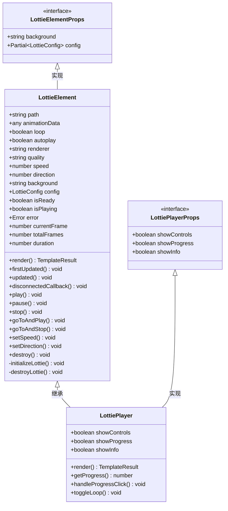
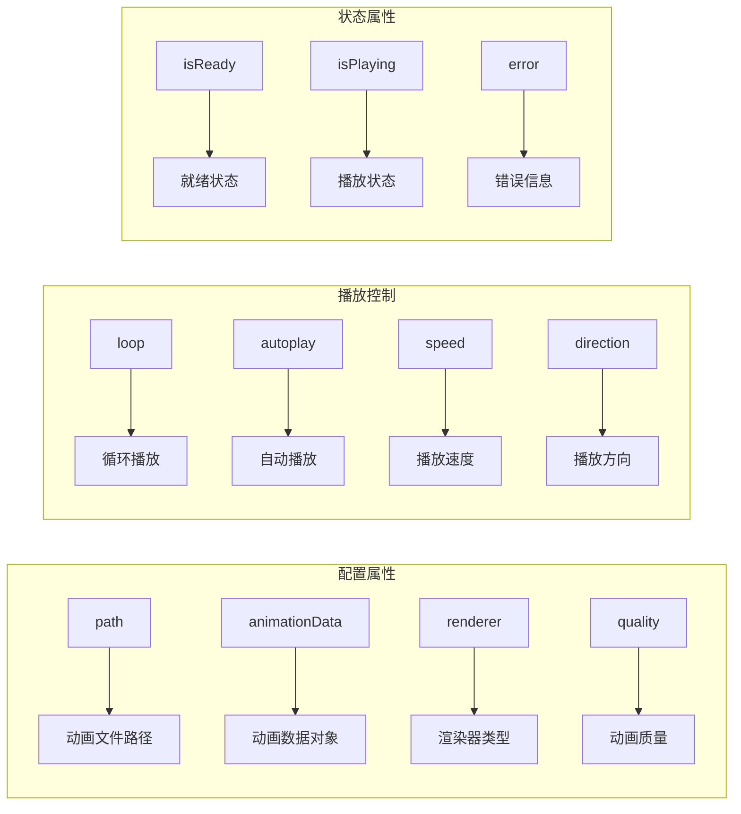
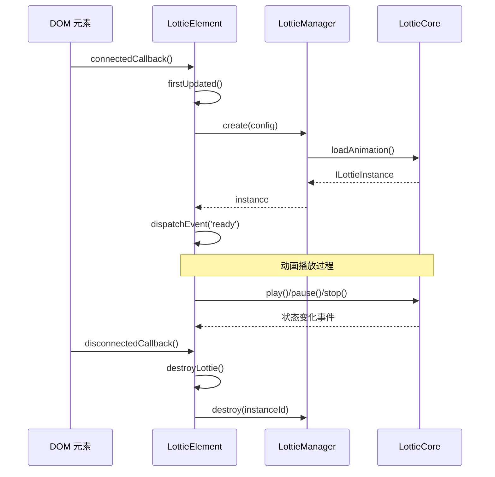
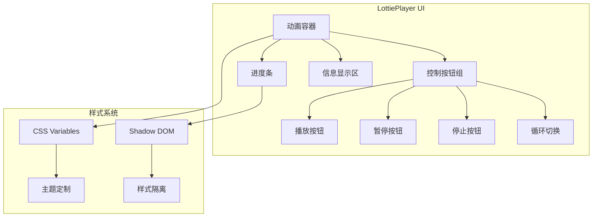
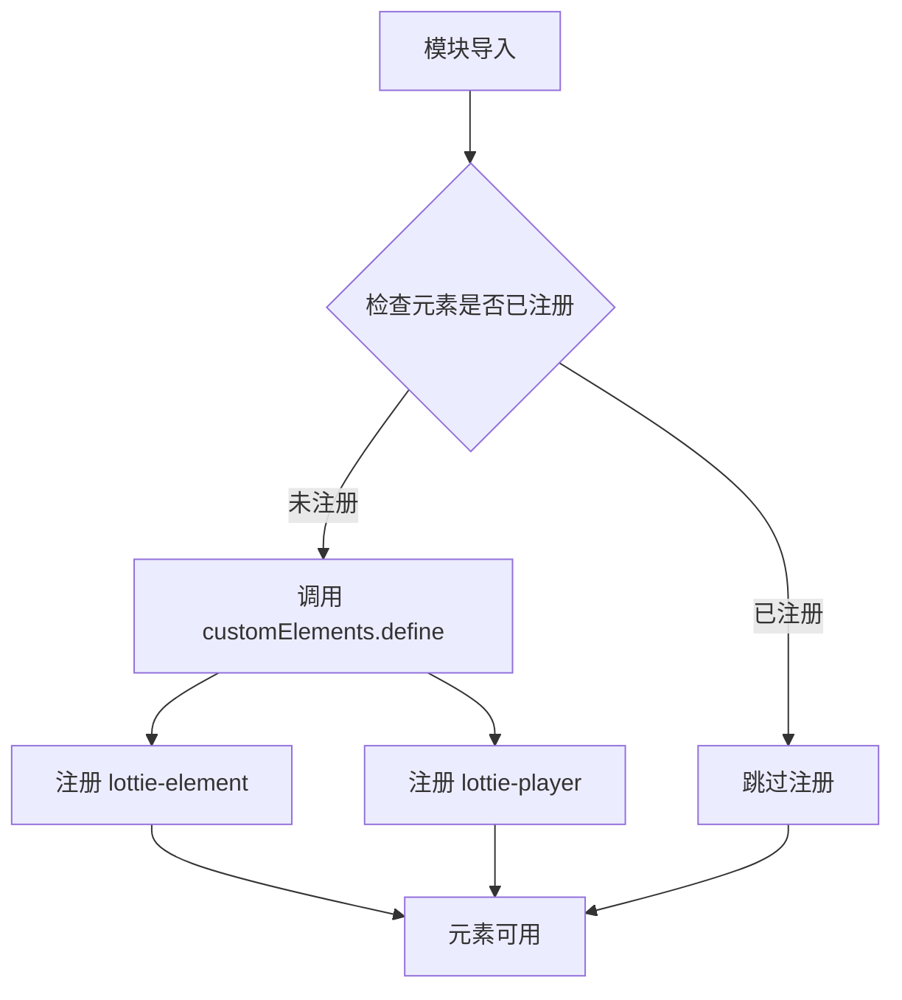
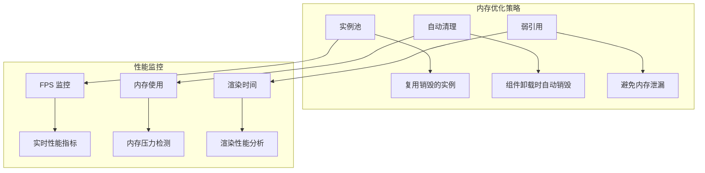
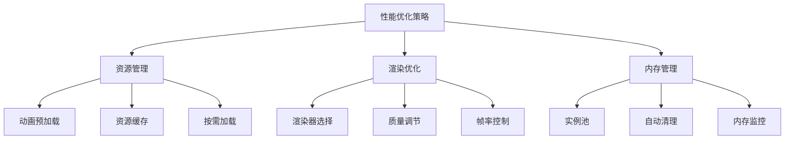

# Lit 集成

<cite>
**本文档中引用的文件**
- [packages/lit/src/index.ts](file://packages/lit/src/index.ts)
- [packages/lit/src/lottie-element.ts](file://packages/lit/src/lottie-element.ts)
- [packages/lit/src/lottie-player.ts](file://packages/lit/src/lottie-player.ts)
- [packages/lit/src/types.ts](file://packages/lit/src/types.ts)
- [packages/lit/package.json](file://packages/lit/package.json)
- [packages/core/src/index.ts](file://packages/core/src/index.ts)
- [packages/core/src/types/index.ts](file://packages/core/src/types/index.ts)
- [examples/lit-demo/src/main.ts](file://examples/lit-demo/src/main.ts)
- [examples/lit-demo/index.html](file://examples/lit-demo/index.html)
- [packages/lit/README.md](file://packages/lit/README.md)
</cite>

## 目录
1. [简介](#简介)
2. [项目结构](#项目结构)
3. [核心组件](#核心组件)
4. [架构概览](#架构概览)
5. [详细组件分析](#详细组件分析)
6. [自定义元素注册](#自定义元素注册)
7. [属性绑定与事件处理](#属性绑定与事件处理)
8. [跨框架集成](#跨框架集成)
9. [性能特性](#性能特性)
10. [常见问题与解决方案](#常见问题与解决方案)
11. [最佳实践](#最佳实践)
12. [总结](#总结)

## 简介

Lottie Lit 是一个基于 Lit 框架的 Web Components 封装库，为 Lottie 动画提供了现代化的 Web Component 接口。该库通过自定义元素的形式，将复杂的 Lottie 动画功能封装成易于使用的 Web Components，支持 Shadow DOM、属性绑定、事件发射等现代 Web 标准特性。

### 主要特性

- **标准 Web Components**: 基于原生 Web Components API 构建
- **Shadow DOM 支持**: 提供封装的样式和 DOM 结构
- **属性绑定**: 支持双向数据绑定和响应式更新
- **事件系统**: 完整的事件发射和监听机制
- **多渲染器支持**: SVG、Canvas、HTML 渲染器
- **跨框架兼容**: 可在任何前端框架中使用
- **性能优化**: 内置内存管理和实例池

## 项目结构

```mermaid
graph TB
subgraph "Lit 包结构"
A[lottie-element.ts] --> B[LottieElement 类]
C[lottie-player.ts] --> D[LottiePlayer 类]
E[index.ts] --> F[自定义元素注册]
G[types.ts] --> H[类型定义]
end
subgraph "核心依赖"
I[@ldesign/lottie-core] --> J[LottieManager]
K[Lit 3.x] --> L[Web Components 基础]
end
subgraph "示例项目"
M[lit-demo/] --> N[HTML 示例]
M --> O[TypeScript 示例]
end
A --> I
C --> A
F --> A
F --> C
```

**图表来源**
- [packages/lit/src/lottie-element.ts](file://packages/lit/src/lottie-element.ts#L1-L222)
- [packages/lit/src/lottie-player.ts](file://packages/lit/src/lottie-player.ts#L1-L119)
- [packages/lit/src/index.ts](file://packages/lit/src/index.ts#L1-L18)

**章节来源**
- [packages/lit/package.json](file://packages/lit/package.json#L1-L66)
- [packages/lit/src/index.ts](file://packages/lit/src/index.ts#L1-L18)

## 核心组件

Lit 集成包含两个主要的 Web Components：

### LottieElement
基础的 Lottie 动画 Web Component，提供核心的动画播放功能。

### LottiePlayer
增强版的 Lottie 播放器，包含内置的控制界面和进度条。

**章节来源**
- [packages/lit/src/lottie-element.ts](file://packages/lit/src/lottie-element.ts#L10-L222)
- [packages/lit/src/lottie-player.ts](file://packages/lit/src/lottie-player.ts#L9-L119)

## 架构概览



**图表来源**
- [packages/lit/src/lottie-element.ts](file://packages/lit/src/lottie-element.ts#L10-L222)
- [packages/lit/src/lottie-player.ts](file://packages/lit/src/lottie-player.ts#L9-L119)
- [packages/lit/src/types.ts](file://packages/lit/src/types.ts#L3-L13)

## 详细组件分析

### LottieElement 组件

LottieElement 是核心的基础组件，继承自 LitElement，提供了完整的 Lottie 动画功能。

#### 关键属性定义



**图表来源**
- [packages/lit/src/lottie-element.ts](file://packages/lit/src/lottie-element.ts#L24-L33)

#### 生命周期管理

组件实现了完整的生命周期管理，包括初始化、更新和销毁：



**图表来源**
- [packages/lit/src/lottie-element.ts](file://packages/lit/src/lottie-element.ts#L49-L82)
- [packages/lit/src/lottie-element.ts](file://packages/lit/src/lottie-element.ts#L152-L159)

**章节来源**
- [packages/lit/src/lottie-element.ts](file://packages/lit/src/lottie-element.ts#L49-L82)
- [packages/lit/src/lottie-element.ts](file://packages/lit/src/lottie-element.ts#L152-L159)

### LottiePlayer 组件

LottiePlayer 扩展了 LottieElement，添加了用户友好的控制界面。

#### 控制界面结构



**图表来源**
- [packages/lit/src/lottie-player.ts](file://packages/lit/src/lottie-player.ts#L10-L66)
- [packages/lit/src/lottie-player.ts](file://packages/lit/src/lottie-player.ts#L72-L97)

**章节来源**
- [packages/lit/src/lottie-player.ts](file://packages/lit/src/lottie-player.ts#L72-L97)

## 自定义元素注册

Lit 集成通过模块导入自动注册自定义元素，确保浏览器能够识别和处理这些新的 HTML 标签。

### 注册流程



**图表来源**
- [packages/lit/src/index.ts](file://packages/lit/src/index.ts#L9-L15)

### 浏览器兼容性

自定义元素注册需要现代浏览器支持，确保以下条件：
- 支持 ES6 模块语法
- 支持 Custom Elements v1 API
- 支持 Shadow DOM v1 API
- 支持 Lit 3.x 框架

**章节来源**
- [packages/lit/src/index.ts](file://packages/lit/src/index.ts#L9-L15)

## 属性绑定与事件处理

### 属性绑定机制

Lit 集成使用装饰器实现响应式属性绑定：

```mermaid
graph LR
subgraph "属性装饰器"
A[@property] --> B[配置属性]
C[@state] --> D[内部状态]
E[@query] --> F[DOM 查询]
end
subgraph "数据流"
G[外部属性] --> H[属性变更检测]
H --> I[updated 生命周期]
I --> J[重新渲染]
end
A --> G
C --> G
E --> G
```

**图表来源**
- [packages/lit/src/lottie-element.ts](file://packages/lit/src/lottie-element.ts#L24-L39)

### 事件发射模式

组件实现了完整的事件发射系统：

| 事件类型 | 触发时机 | 事件详情 |
|---------|---------|---------|
| ready | 动画加载完成 | `{instance: ILottieInstance}` |
| error | 加载或播放错误 | `{error: Error}` |
| play | 开始播放 | 无额外数据 |
| pause | 暂停播放 | 无额外数据 |
| stop | 停止播放 | 无额外数据 |
| complete | 动画完成 | 无额外数据 |
| loopComplete | 循环完成 | 无额外数据 |

**章节来源**
- [packages/lit/src/lottie-element.ts](file://packages/lit/src/lottie-element.ts#L104-L144)

## 跨框架集成

### 在不同框架中的使用方式

#### React 集成
```jsx
// React 中使用 Lottie Lit 组件
import '@ldesign/lottie-lit'

function LottieComponent() {
  const ref = useRef(null)
  
  useEffect(() => {
    const element = ref.current
    if (element) {
      element.addEventListener('ready', () => {
        console.log('动画已加载')
      })
      
      element.addEventListener('play', () => {
        console.log('开始播放')
      })
    }
  }, [])
  
  return (
    <lottie-element
      ref={ref}
      path="/animation.json"
      loop
      autoplay
    />
  )
}
```

#### Vue 集成
```vue
<template>
  <lottie-element
    ref="lottieRef"
    :path="animationPath"
    :loop="true"
    :autoplay="true"
    @ready="onReady"
    @play="onPlay"
  />
</template>

<script setup>
import { ref, onMounted } from 'vue'

const lottieRef = ref(null)
const animationPath = '/animation.json'

const onReady = () => {
  console.log('动画已准备就绪')
}

const onPlay = () => {
  console.log('动画开始播放')
}
</script>
```

#### Angular 集成
```typescript
@Component({
  selector: 'app-lottie',
  template: `
    <lottie-element
      #lottieElement
      [path]="animationPath"
      [loop]="true"
      [autoplay]="true"
      (ready)="onReady($event)"
      (play)="onPlay()"
    ></lottie-element>
  `
})
export class LottieComponent {
  @ViewChild('lottieElement') lottieElement: ElementRef<LottieElement>
  animationPath = '/animation.json'
  
  ngAfterViewInit() {
    this.lottieElement.nativeElement.addEventListener('ready', this.onReady.bind(this))
  }
  
  onReady(event: CustomEvent) {
    console.log('动画已加载', event.detail)
  }
  
  onPlay() {
    console.log('动画开始播放')
  }
}
```

### 框架无关的使用方式

```html
<!-- 原生 JavaScript 使用 -->
<lottie-element id="my-animation" path="/animation.json"></lottie-element>

<script>
  const animation = document.getElementById('my-animation')
  
  animation.addEventListener('ready', () => {
    console.log('动画已加载')
  })
  
  animation.addEventListener('play', () => {
    console.log('开始播放')
  })
  
  // 通过 JavaScript API 控制
  animation.play()
  animation.setSpeed(2)
  animation.goToAndStop(50, true)
</script>
```

## 性能特性

### 内存管理



### 渲染优化

- **虚拟化渲染**: 大量动画时的性能优化
- **智能降级**: 根据设备性能自动调整质量
- **批量渲染**: 合并多个渲染操作
- **Web Workers**: 复杂计算任务的异步处理

**章节来源**
- [packages/core/src/core/LottieManager.ts](file://packages/core/src/core/LottieManager.ts#L1-L50)

## 常见问题与解决方案

### Shadow DOM 样式问题

**问题**: 自定义样式无法影响组件内部

**解决方案**:
```css
/* 使用 CSS 变量进行主题定制 */
lottie-element {
  --lottie-background-color: #ffffff;
  --lottie-border-radius: 8px;
}

/* 或者使用 ::part 伪元素 */
lottie-element::part(container) {
  border-radius: var(--lottie-border-radius);
  background-color: var(--lottie-background-color);
}
```

### 动态实例化问题

**问题**: 运行时动态创建组件时的兼容性

**解决方案**:
```javascript
// 确保自定义元素已注册
if (!customElements.get('lottie-element')) {
  import('@ldesign/lottie-lit').then(() => {
    // 现在可以安全地创建组件
    const element = document.createElement('lottie-element')
    document.body.appendChild(element)
  })
}
```

### 浏览器兼容性

**问题**: 老旧浏览器的支持

**解决方案**:
- 使用 polyfill 支持 Custom Elements 和 Shadow DOM
- 提供降级方案（如使用 iframe）
- 检测浏览器能力后动态加载

### 性能优化建议

1. **合理使用渲染器**: SVG 适合矢量动画，Canvas 适合复杂动画
2. **控制并发实例**: 避免同时创建过多动画实例
3. **及时清理资源**: 组件卸载时确保正确销毁
4. **预加载重要资源**: 关键动画提前加载

## 最佳实践

### 组件设计原则

1. **单一职责**: 每个组件只负责一种类型的动画展示
2. **响应式设计**: 支持动态属性更新
3. **错误处理**: 完善的错误边界和恢复机制
4. **可访问性**: 支持屏幕阅读器和键盘导航

### 性能优化指南



### 代码组织建议

1. **模块化导入**: 按需导入特定组件
2. **类型安全**: 使用 TypeScript 提供完整类型支持
3. **测试覆盖**: 编写单元测试和集成测试
4. **文档完善**: 提供详细的 API 文档和使用示例

**章节来源**
- [examples/lit-demo/src/main.ts](file://examples/lit-demo/src/main.ts#L1-L42)
- [examples/lit-demo/index.html](file://examples/lit-demo/index.html#L1-L132)

## 总结

Lottie Lit 集成为现代 Web 应用提供了一个强大而灵活的 Lottie 动画解决方案。通过标准化的 Web Components 接口，它成功地将复杂的动画功能封装成易于使用的组件，同时保持了良好的性能和跨框架兼容性。

### 主要优势

- **标准化**: 基于 Web Components 标准，符合现代 Web 开发规范
- **易用性**: 简单的 HTML 标签即可使用复杂的动画功能
- **性能**: 内置多种优化策略，确保良好的运行性能
- **扩展性**: 支持自定义样式和行为扩展
- **生态**: 与主流前端框架无缝集成

### 适用场景

- 需要在多个项目中重复使用动画的团队
- 需要跨框架兼容性的大型应用
- 对性能有较高要求的动画密集型应用
- 需要标准化动画解决方案的企业项目

通过本文档的详细介绍，开发者可以深入理解 Lottie Lit 的实现原理和使用方法，从而在实际项目中充分发挥其优势。