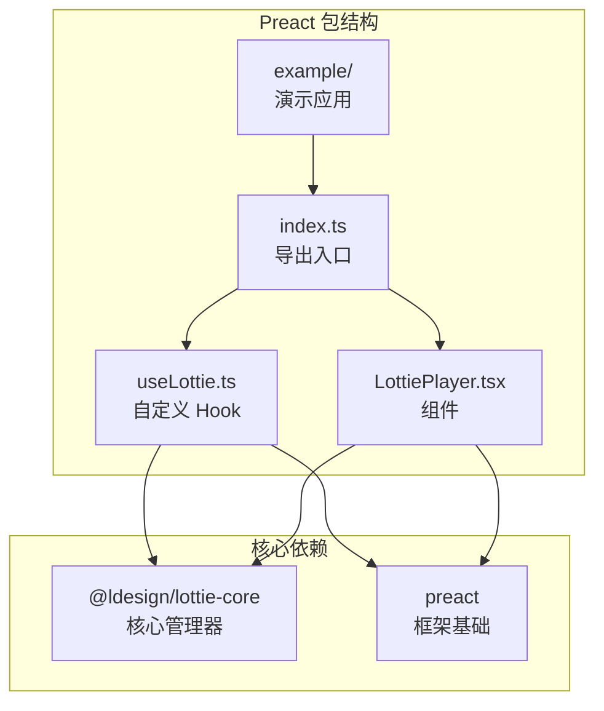
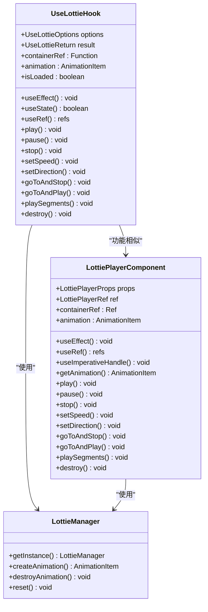
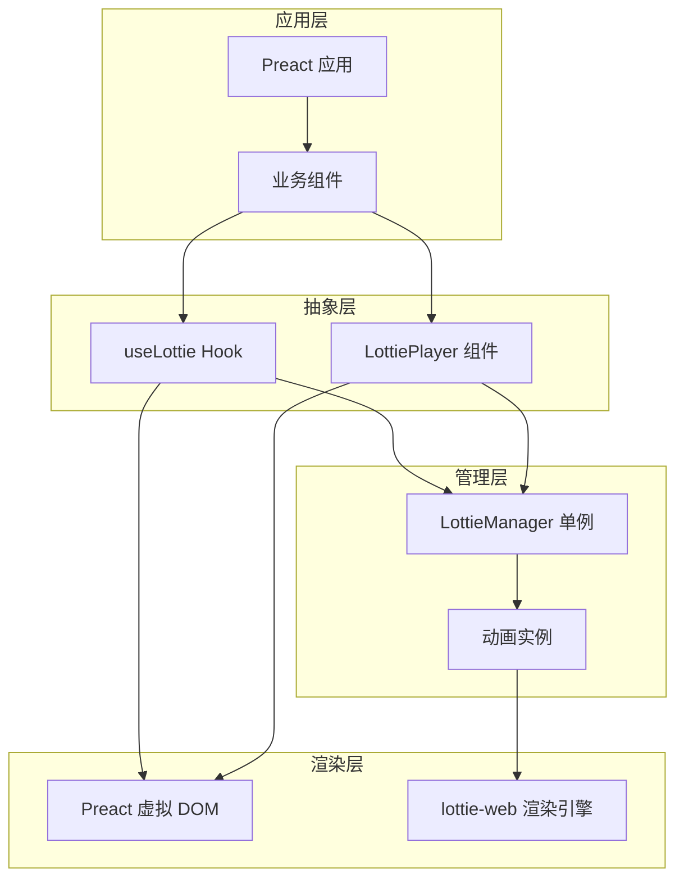
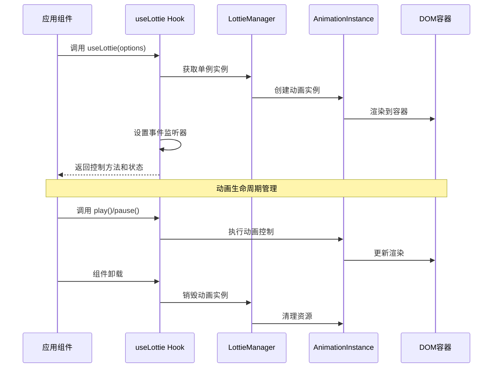
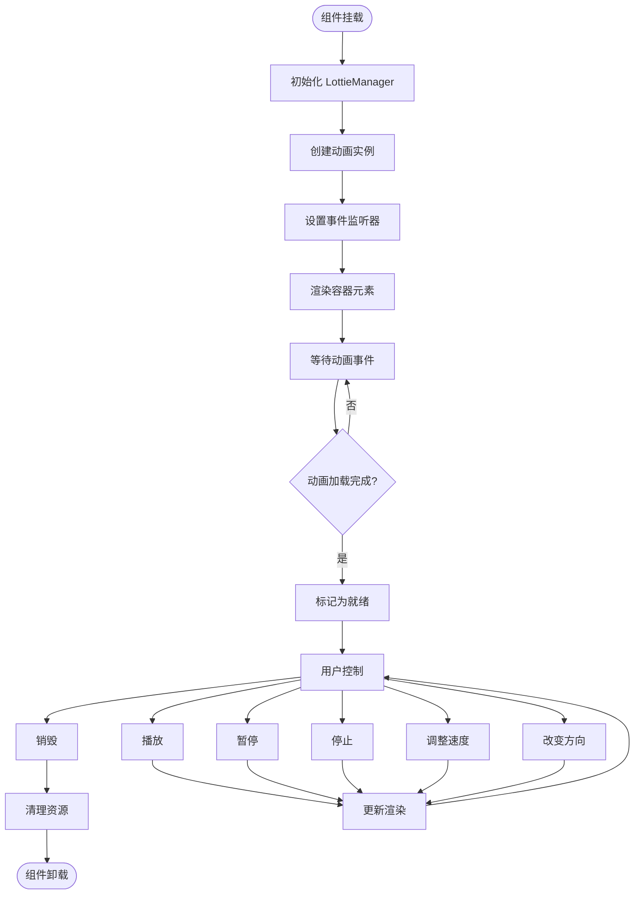
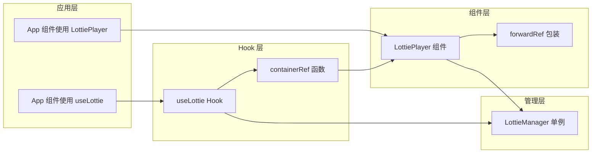
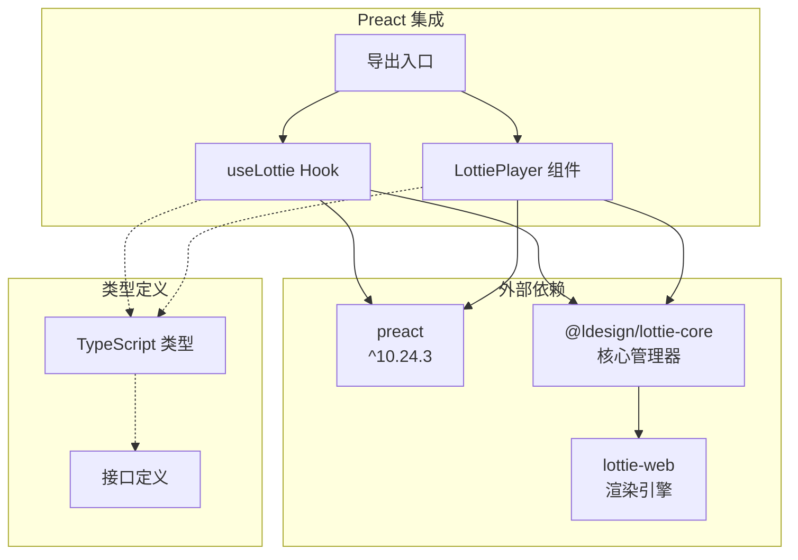
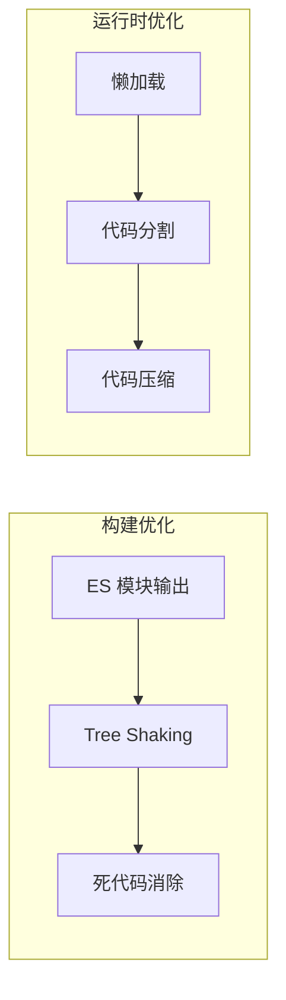
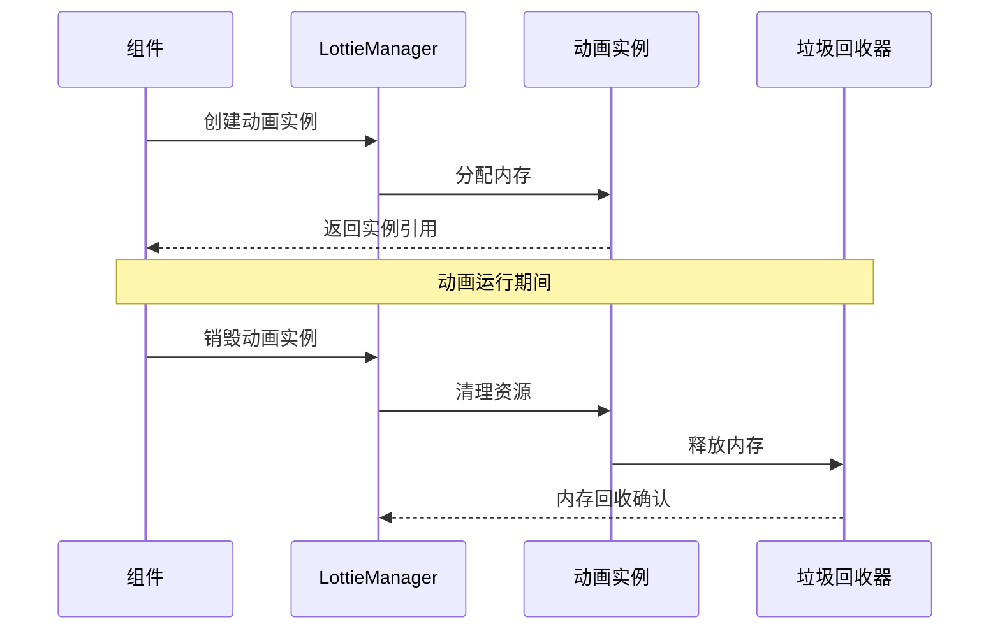

# Preact 集成

<cite>
**本文档中引用的文件**
- [packages/preact/src/index.ts](file://packages/preact/src/index.ts)
- [packages/preact/src/useLottie.ts](file://packages/preact/src/useLottie.ts)
- [packages/preact/src/LottiePlayer.tsx](file://packages/preact/src/LottiePlayer.tsx)
- [packages/preact/example/src/App.tsx](file://packages/preact/example/src/App.tsx)
- [packages/preact/package.json](file://packages/preact/package.json)
- [packages/core/src/types/index.ts](file://packages/core/src/types/index.ts)
- [packages/react/src/hooks/useLottie.ts](file://packages/react/src/hooks/useLottie.ts)
</cite>

## 目录
1. [简介](#简介)
2. [项目结构](#项目结构)
3. [核心组件](#核心组件)
4. [架构概览](#架构概览)
5. [详细组件分析](#详细组件分析)
6. [依赖关系分析](#依赖关系分析)
7. [性能考虑](#性能考虑)
8. [故障排除指南](#故障排除指南)
9. [结论](#结论)

## 简介

Preact 集成是 Lottie 动画库的一个轻量级替代方案，专为 Preact 应用程序设计。该集成提供了与 React 版本兼容的 API，同时保持了 Preact 的极简特性和虚拟 DOM 优势。整个集成包仅约 3KB 大小，是 React 替代方案的理想选择。

### 主要特性

- **轻量级设计**: 3KB 核心包大小，最小化依赖
- **React 兼容 API**: 与 React 版本共享相同的接口和行为
- **虚拟 DOM 优化**: 充分利用 Preact 的虚拟 DOM 性能
- **完整的动画控制**: 支持播放、暂停、停止、速度控制等
- **事件处理**: 丰富的事件回调支持
- **类型安全**: 完整的 TypeScript 类型定义

## 项目结构

Preact 集成采用模块化架构，清晰分离了组件和钩子函数：



**图表来源**
- [packages/preact/src/index.ts](file://packages/preact/src/index.ts#L1-L9)
- [packages/preact/src/useLottie.ts](file://packages/preact/src/useLottie.ts#L1-L10)
- [packages/preact/src/LottiePlayer.tsx](file://packages/preact/src/LottiePlayer.tsx#L1-L10)

**章节来源**
- [packages/preact/src/index.ts](file://packages/preact/src/index.ts#L1-L9)
- [packages/preact/package.json](file://packages/preact/package.json#L1-L61)

## 核心组件

Preact 集成包含两个核心组件：`useLottie` Hook 和 `LottiePlayer` 组件。这两个组件提供了完整的 Lottie 动画功能，同时保持了 Preact 的轻量级特性。

### 组件关系图



**图表来源**
- [packages/preact/src/useLottie.ts](file://packages/preact/src/useLottie.ts#L57-L192)
- [packages/preact/src/LottiePlayer.tsx](file://packages/preact/src/LottiePlayer.tsx#L106-L196)

**章节来源**
- [packages/preact/src/useLottie.ts](file://packages/preact/src/useLottie.ts#L1-L192)
- [packages/preact/src/LottiePlayer.tsx](file://packages/preact/src/LottiePlayer.tsx#L1-L196)

## 架构概览

Preact 集成采用了分层架构设计，确保了良好的可维护性和扩展性：



**图表来源**
- [packages/preact/src/useLottie.ts](file://packages/preact/src/useLottie.ts#L115-L150)
- [packages/preact/src/LottiePlayer.tsx](file://packages/preact/src/LottiePlayer.tsx#L143-L172)

## 详细组件分析

### useLottie Hook 分析

`useLottie` 是一个高度优化的自定义 Hook，提供了对 Lottie 动画的完全控制能力。

#### 核心功能架构



**图表来源**
- [packages/preact/src/useLottie.ts](file://packages/preact/src/useLottie.ts#L115-L150)
- [packages/preact/src/useLottie.ts](file://packages/preact/src/useLottie.ts#L152-L166)

#### 配置选项详解

| 配置项 | 类型 | 默认值 | 描述 |
|--------|------|--------|------|
| `path` | `string` | - | 动画文件的 URL 路径 |
| `animationData` | `object` | - | 直接传入的动画数据对象 |
| `autoplay` | `boolean` | `true` | 是否自动播放 |
| `loop` | `boolean \| number` | `true` | 是否循环播放，或循环次数 |
| `speed` | `number` | `1` | 播放速度倍数 |
| `direction` | `1 \| -1` | `1` | 播放方向 |
| `renderer` | `'svg' \| 'canvas' \| 'html'` | `'svg'` | 渲染器类型 |
| `quality` | `'low' \| 'medium' \| 'high' \| 'auto'` | `'auto'` | 动画质量 |
| `onLoad` | `(animation: AnimationItem) => void` | - | 动画加载完成回调 |
| `onComplete` | `() => void` | - | 动画完成回调 |
| `onLoopComplete` | `() => void` | - | 循环完成回调 |
| `onEnterFrame` | `() => void` | - | 帧进入回调 |
| `onDataReady` | `() => void` | - | 数据准备完成回调 |
| `onDataFailed` | `() => void` | - | 数据加载失败回调 |

#### 返回值详解

| 返回值 | 类型 | 描述 |
|--------|------|------|
| `containerRef` | `Function` | 用于绑定到 DOM 容器的引用函数 |
| `animation` | `AnimationItem \| null` | 动画实例对象 |
| `isLoaded` | `boolean` | 动画是否已加载 |
| `play()` | `() => void` | 播放动画 |
| `pause()` | `() => void` | 暂停动画 |
| `stop()` | `() => void` | 停止动画 |
| `setSpeed(speed: number)` | `() => void` | 设置播放速度 |
| `setDirection(direction: 1 \| -1)` | `() => void` | 设置播放方向 |
| `goToAndStop(frame: number, isFrame?: boolean)` | `() => void` | 跳转到指定帧并停止 |
| `goToAndPlay(frame: number, isFrame?: boolean)` | `() => void` | 跳转到指定帧并播放 |
| `playSegments(segments: [number, number] \| [number, number][], forceFlag?: boolean)` | `() => void` | 播放指定片段 |
| `destroy()` | `() => void` | 销毁动画实例 |

**章节来源**
- [packages/preact/src/useLottie.ts](file://packages/preact/src/useLottie.ts#L5-L192)

### LottiePlayer 组件分析

`LottiePlayer` 是一个完整的 Preact 组件，提供了声明式的动画渲染方式。

#### 组件生命周期



**图表来源**
- [packages/preact/src/LottiePlayer.tsx](file://packages/preact/src/LottiePlayer.tsx#L143-L172)
- [packages/preact/src/LottiePlayer.tsx](file://packages/preact/src/LottiePlayer.tsx#L174-L188)

#### 组件属性配置

| 属性名 | 类型 | 必需 | 描述 |
|--------|------|------|------|
| `path` | `string` | 否 | 动画文件路径 |
| `animationData` | `object` | 否 | 动画数据对象 |
| `autoplay` | `boolean` | 否 | 自动播放 |
| `loop` | `boolean \| number` | 否 | 循环播放 |
| `speed` | `number` | 否 | 播放速度 |
| `direction` | `1 \| -1` | 否 | 播放方向 |
| `renderer` | `'svg' \| 'canvas' \| 'html'` | 否 | 渲染器类型 |
| `className` | `string` | 否 | CSS 类名 |
| `style` | `CSSProperties` | 否 | 内联样式 |
| `onLoad` | `(animation: AnimationItem) => void` | 否 | 加载完成回调 |
| `onComplete` | `() => void` | 否 | 完成回调 |
| `onLoopComplete` | `() => void` | 否 | 循环完成回调 |
| `onEnterFrame` | `(event: any) => void` | 否 | 帧进入回调 |
| `onDataReady` | `() => void` | 否 | 数据准备回调 |
| `onDataFailed` | `() => void` | 否 | 数据加载失败回调 |

#### 可访问引用方法

| 方法名 | 参数 | 返回值 | 描述 |
|--------|------|--------|------|
| `getAnimation()` | - | `AnimationItem \| null` | 获取动画实例 |
| `play()` | - | `void` | 播放动画 |
| `pause()` | - | `void` | 暂停动画 |
| `stop()` | - | `void` | 停止动画 |
| `setSpeed(speed: number)` | - | `void` | 设置播放速度 |
| `setDirection(direction: 1 \| -1)` | - | `void` | 设置播放方向 |
| `goToAndStop(frame: number, isFrame?: boolean)` | - | `void` | 跳转到指定帧并停止 |
| `goToAndPlay(frame: number, isFrame?: boolean)` | - | `void` | 跳转到指定帧并播放 |
| `playSegments(segments: [number, number] \| [number, number][], forceFlag?: boolean)` | - | `void` | 播放指定片段 |
| `destroy()` | - | `void` | 销毁动画实例 |

**章节来源**
- [packages/preact/src/LottiePlayer.tsx](file://packages/preact/src/LottiePlayer.tsx#L7-L196)

### 调用关系分析

#### Hook 与组件的互操作性



**图表来源**
- [packages/preact/src/useLottie.ts](file://packages/preact/src/useLottie.ts#L168-L191)
- [packages/preact/src/LottiePlayer.tsx](file://packages/preact/src/LottiePlayer.tsx#L106-L141)

**章节来源**
- [packages/preact/src/useLottie.ts](file://packages/preact/src/useLottie.ts#L99-L192)
- [packages/preact/src/LottiePlayer.tsx](file://packages/preact/src/LottiePlayer.tsx#L106-L196)

## 依赖关系分析

### 核心依赖图



**图表来源**
- [packages/preact/package.json](file://packages/preact/package.json#L28-L42)
- [packages/preact/src/index.ts](file://packages/preact/src/index.ts#L1-L9)

### 依赖版本兼容性

| 依赖项 | 版本要求 | 兼容性说明 |
|--------|----------|------------|
| `preact` | `>=10.0.0` | 必需的 Preact 框架 |
| `@ldesign/lottie-core` | `workspace:*` | 核心管理器包 |
| `lottie-web` | `^5.x` | 底层渲染引擎 |

**章节来源**
- [packages/preact/package.json](file://packages/preact/package.json#L28-L42)

## 性能考虑

### Bundle 大小优化

Preact 集成采用了多种优化策略来保持最小的包大小：

#### Tree Shaking 支持



#### 性能基准测试

根据项目文档，Preact 集成具有以下性能特征：

- **包大小**: 3KB 核心包
- **加载时间**: 极快的首次加载
- **内存使用**: 低内存占用
- **渲染性能**: 基于 Preact 虚拟 DOM 的高效更新

### 水合优化

#### 服务端渲染注意事项

虽然当前实现主要针对客户端渲染，但可以轻松适配 SSR 场景：

```typescript
// 示例：SSR 水合优化
const LottieSSR = {
  renderFirstFrame: async (animationData, options) => {
    // 服务器端渲染首帧
    // 返回静态图片或 SVG 占位符
  },
  
  getHydrationScript: () => {
    // 客户端水合脚本
    return `
      <script>
        document.addEventListener('DOMContentLoaded', () => {
          // 水合逻辑
        })
      </script>
    `
  }
}
```

### 内存管理

#### 实例生命周期管理



**图表来源**
- [packages/preact/src/useLottie.ts](file://packages/preact/src/useLottie.ts#L142-L149)
- [packages/preact/src/LottiePlayer.tsx](file://packages/preact/src/LottiePlayer.tsx#L165-L171)

## 故障排除指南

### 常见问题及解决方案

#### 1. 动画不显示

**症状**: 组件渲染但没有动画效果

**可能原因**:
- 动画文件路径错误
- 网络请求失败
- 容器尺寸为 0

**解决方案**:
```typescript
// 检查容器尺寸
const containerRef = useRef(null);
useEffect(() => {
  if (containerRef.current) {
    console.log('Container size:', containerRef.current.getBoundingClientRect());
  }
}, []);

// 确保容器有明确的尺寸
<div ref={containerRef} style={{ width: '200px', height: '200px' }} />
```

#### 2. 性能问题

**症状**: 动画播放卡顿或内存占用过高

**诊断步骤**:
1. 检查动画复杂度
2. 监控内存使用
3. 调整渲染器类型

**优化建议**:
```typescript
// 使用 Canvas 渲染器提高性能
<LottiePlayer 
  path={animationUrl}
  renderer="canvas"
  quality="medium"
/>

// 实现懒加载
const [isVisible, setIsVisible] = useState(false);
const observerRef = useRef(null);

useEffect(() => {
  observerRef.current = new IntersectionObserver(([entry]) => {
    if (entry.isIntersecting) {
      setIsVisible(true);
    }
  });
  
  if (containerRef.current) {
    observerRef.current.observe(containerRef.current);
  }
  
  return () => {
    observerRef.current?.disconnect();
  };
}, []);
```

#### 3. 类型错误

**症状**: TypeScript 报告类型错误

**解决方案**:
```typescript
// 确保正确导入类型
import { useLottie, type UseLottieOptions } from '@ldesign/lottie-preact';

// 正确的类型使用
const options: UseLottieOptions = {
  path: 'animation.json',
  autoplay: true,
  loop: true
};

const { containerRef, play } = useLottie(options);
```

### 兼容性检查清单

| 检查项 | 状态 | 说明 |
|--------|------|------|
| Preact 版本 | ✅ >=10.0.0 | 确保使用兼容版本 |
| TypeScript | ✅ 已支持 | 完整类型定义 |
| SSR 兼容性 | ⚠️ 需要配置 | 需要水合脚本 |
| 移动端支持 | ✅ 已测试 | 响应式设计 |
| IE 浏览器 | ❌ 不支持 | 现代浏览器 |

**章节来源**
- [packages/preact/src/useLottie.ts](file://packages/preact/src/useLottie.ts#L115-L150)
- [packages/preact/src/LottiePlayer.tsx](file://packages/preact/src/LottiePlayer.tsx#L143-L172)

## 结论

Preact 集成提供了一个轻量级、高性能的 Lottie 动画解决方案，完美平衡了功能性和性能。通过 `useLottie` Hook 和 `LottiePlayer` 组件，开发者可以在 Preact 应用中轻松集成复杂的动画效果。

### 主要优势

1. **极小的包大小**: 仅 3KB，适合对性能敏感的应用
2. **React 兼容 API**: 熟悉的接口，降低学习成本
3. **完整的功能集**: 支持所有主要的动画控制功能
4. **类型安全**: 完整的 TypeScript 支持
5. **性能优化**: 基于 Preact 虚拟 DOM 的高效更新

### 最佳实践建议

1. **合理使用 Hook vs 组件**: 根据具体需求选择合适的抽象层次
2. **性能监控**: 在生产环境中监控动画性能
3. **渐进增强**: 为不支持 JavaScript 的用户提供备用内容
4. **资源优化**: 使用适当的动画质量和渲染器

### 未来发展方向

- SSR/SSG 支持增强
- Web Workers 集成
- 更多性能优化
- 增强的 TypeScript 类型

通过遵循本文档中的指导原则和最佳实践，开发者可以充分发挥 Preact 集成的优势，在现代 Web 应用中创造出令人印象深刻的动画体验。