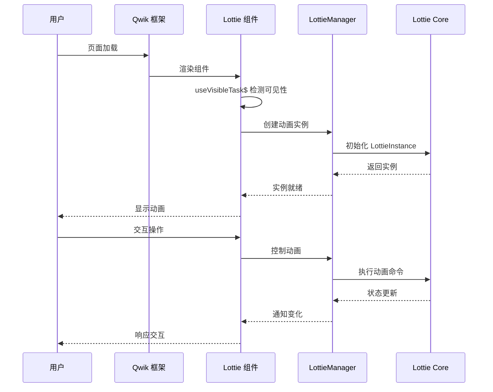
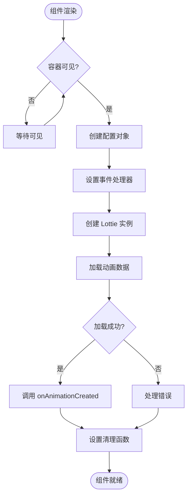
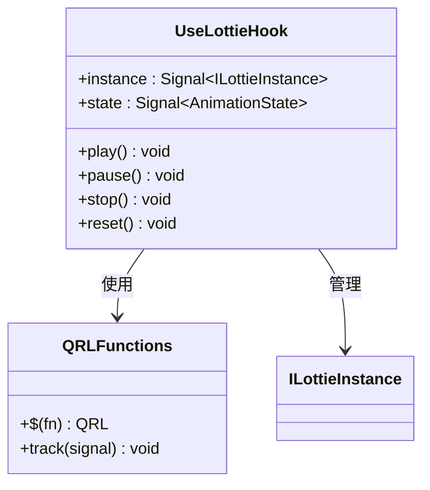
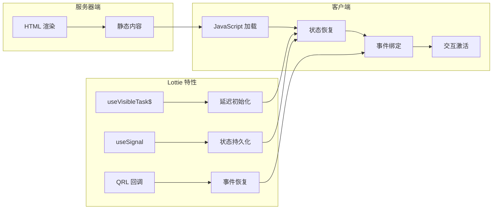
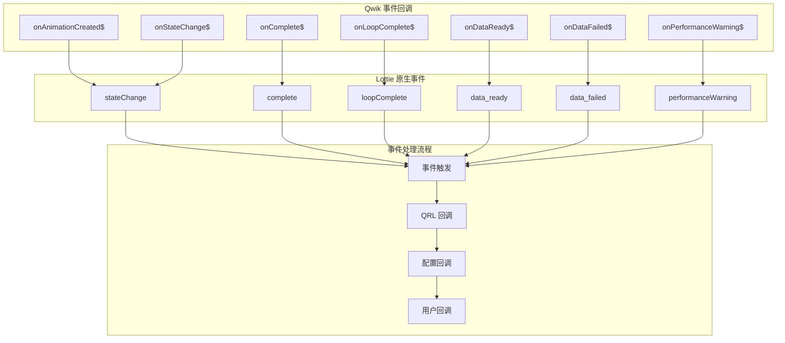
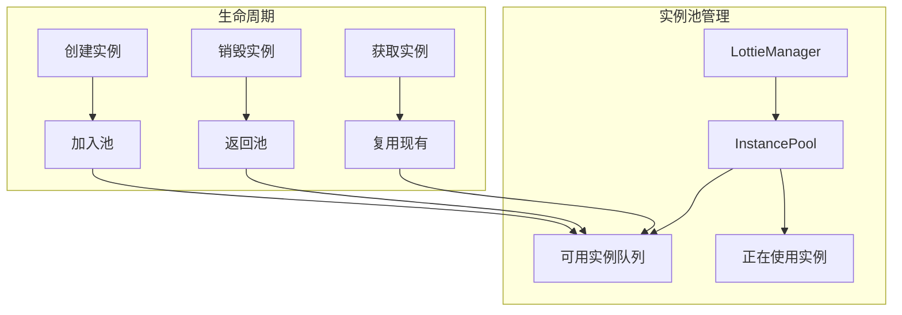

# Qwik 集成

<cite>
**本文档中引用的文件**
- [packages/qwik/src/lottie.tsx](file://packages/qwik/src/lottie.tsx)
- [packages/qwik/src/index.ts](file://packages/qwik/src/index.ts)
- [packages/qwik/src/lottie.test.tsx](file://packages/qwik/src/lottie.test.tsx)
- [packages/qwik/example/src/App.tsx](file://packages/qwik/example/src/App.tsx)
- [packages/qwik/package.json](file://packages/qwik/package.json)
- [packages/qwik/README.md](file://packages/qwik/README.md)
- [packages/core/src/core/LottieManager.ts](file://packages/core/src/core/LottieManager.ts)
- [packages/core/src/types/index.ts](file://packages/core/src/types/index.ts)
</cite>

## 目录
1. [简介](#简介)
2. [项目结构](#项目结构)
3. [核心组件](#核心组件)
4. [架构概览](#架构概览)
5. [详细组件分析](#详细组件分析)
6. [Qwik Resumability 模型](#qwik-resumability-模型)
7. [配置选项与参数](#配置选项与参数)
8. [事件处理机制](#事件处理机制)
9. [性能优化特性](#性能优化特性)
10. [常见问题与解决方案](#常见问题与解决方案)
11. [最佳实践指南](#最佳实践指南)
12. [结论](#结论)

## 简介

@ldesign/lottie-qwik 是专门为 Qwik 框架设计的 Lottie 动画组件，充分利用了 Qwik 的 resumability（可恢复性）特性和零水合（zero hydration）优势。该组件提供了高性能、可交互的 Lottie 动画支持，同时保持了 Qwik 架构的轻量级和响应式特性。

### 主要特性

- **⚡ 可恢复性**: 完全遵循 Qwik 的 resumability 原则
- **🚀 零水合**: 仅在用户交互时才加载 JavaScript
- **🎨 懒加载**: 使用 `useVisibleTask$` 实现最优性能
- **🎯 类型安全**: 完整的 TypeScript 支持
- **🔧 灵活配置**: 丰富的配置选项和事件回调
- **🌐 响应式**: 与 Qwik 生态系统无缝集成

## 项目结构

```mermaid
graph TB
subgraph "Qwik 包结构"
A[lottie.tsx] --> B[Lottie 组件]
A --> C[useLottie Hook]
D[index.ts] --> E[导出接口]
F[example/] --> G[演示应用]
H[test/] --> I[单元测试]
end
subgraph "核心依赖"
J[@ldesign/lottie-core] --> K[LottieManager]
J --> L[LottieInstance]
M[@builder.io/qwik] --> N[Qwik 核心 API]
end
A --> J
A --> M
```

**图表来源**
- [packages/qwik/src/lottie.tsx](file://packages/qwik/src/lottie.tsx#L1-L184)
- [packages/qwik/src/index.ts](file://packages/qwik/src/index.ts#L1-L21)

**章节来源**
- [packages/qwik/package.json](file://packages/qwik/package.json#L1-L66)
- [packages/qwik/README.md](file://packages/qwik/README.md#L1-L65)

## 核心组件

### Lottie 组件

Lottie 组件是整个 Qwik 集成的核心，它封装了 Lottie 动画的所有功能，并与 Qwik 的响应式系统深度集成。

#### 主要功能特性

1. **延迟初始化**: 使用 `useVisibleTask$` 实现懒加载
2. **状态管理**: 通过信号（signals）管理动画状态
3. **事件代理**: 将原生事件转换为 Qwik 回调
4. **资源清理**: 自动处理组件销毁时的资源释放

#### 组件签名

```typescript
export const Lottie = component$<LottieProps>((props) => {
  // 组件实现细节
})
```

**章节来源**
- [packages/qwik/src/lottie.tsx](file://packages/qwik/src/lottie.tsx#L52-L146)

### useLottie Hook

useLottie 提供了程序化的动画控制能力，允许开发者在 Qwik 应用中完全控制 Lottie 动画。

#### 返回值结构

```typescript
export const useLottie = (options: UseLottieOptions) => {
  return {
    instance,    // 动画实例信号
    state,       // 动画状态信号  
    play,        // 播放函数
    pause,       // 暂停函数
    stop,        // 停止函数
    reset,       // 重置函数
  }
}
```

**章节来源**
- [packages/qwik/src/lottie.tsx](file://packages/qwik/src/lottie.tsx#L155-L183)

## 架构概览



**图表来源**
- [packages/qwik/src/lottie.tsx](file://packages/qwik/src/lottie.tsx#L65-L137)
- [packages/core/src/core/LottieManager.ts](file://packages/core/src/core/LottieManager.ts#L111-L183)

## 详细组件分析

### Lottie 组件实现

#### 初始化流程



**图表来源**
- [packages/qwik/src/lottie.tsx](file://packages/qwik/src/lottie.tsx#L65-L137)

#### 关键实现细节

1. **容器引用管理**
   - 使用 `useSignal<HTMLDivElement>()` 管理 DOM 容器
   - 确保动画容器的正确绑定

2. **配置合并策略**
   - 优先使用用户提供的配置
   - 回退到默认配置和设备推荐配置
   - 处理不同渲染器的特殊需求

3. **事件委托机制**
   - 将原生事件映射到 Qwik 回调
   - 支持链式事件处理（用户回调 + 配置回调）

**章节来源**
- [packages/qwik/src/lottie.tsx](file://packages/qwik/src/lottie.tsx#L65-L137)

### useLottie Hook 实现

#### 函数式编程模式



**图表来源**
- [packages/qwik/src/lottie.tsx](file://packages/qwik/src/lottie.tsx#L155-L183)

#### 性能优化特性

1. **QRL 函数**: 使用 `$()` 包装函数，确保延迟执行
2. **信号驱动**: 基于 Qwik 信号的状态管理
3. **内存安全**: 自动清理动画实例

**章节来源**
- [packages/qwik/src/lottie.tsx](file://packages/qwik/src/lottie.tsx#L155-L183)

## Qwik Resumability 模型

### 可恢复性原理

Qwik 的 resumability 模型允许服务器端渲染页面，然后在客户端恢复交互能力。Lottie 组件完全遵循这一原则：

#### 序列化与反序列化



**图表来源**
- [packages/qwik/src/lottie.tsx](file://packages/qwik/src/lottie.tsx#L65-L70)

### 水合策略

#### 零水合实现

Lottie 组件采用以下策略实现零水合：

1. **条件加载**: 仅在动画进入视口时加载
2. **延迟初始化**: 使用 `useVisibleTask$` 延迟动画创建
3. **事件分离**: 事件处理逻辑与动画创建分离

#### 性能收益

- **首屏加载时间减少**: 无需立即加载动画资源
- **内存占用降低**: 仅在需要时分配动画内存
- **网络带宽优化**: 按需加载动画数据

**章节来源**
- [packages/qwik/src/lottie.tsx](file://packages/qwik/src/lottie.tsx#L65-L70)

## 配置选项与参数

### LottieProps 接口

| 属性 | 类型 | 默认值 | 描述 |
|------|------|--------|------|
| `path` | `string` | - | 动画 JSON 文件路径 |
| `animationData` | `any` | - | 直接传入的动画数据 |
| `renderer` | `'svg' \| 'canvas' \| 'html' \| 'webgl'` | `'svg'` | 渲染器类型 |
| `loop` | `boolean \| number` | `true` | 循环播放设置 |
| `autoplay` | `boolean` | `true` | 自动播放设置 |
| `speed` | `number` | `1` | 播放速度 |
| `name` | `string` | - | 动画名称 |
| `config` | `Partial<LottieConfig>` | `{}` | 高级配置选项 |
| `class` | `string` | - | CSS 类名 |
| `style` | `Record<string, string>` | `{}` | 内联样式 |

### 高级配置选项

#### 性能相关配置

```typescript
interface AdvancedOptions {
  enablePerformanceMonitor?: boolean;    // 启用性能监控
  maxMemory?: number;                    // 最大内存限制(MB)
  minFps?: number;                       // 最小 FPS 阈值
  targetFPS?: number;                    // 目标 FPS
  enableAutoDegradation?: boolean;       // 启用自动降级
  enableSmartFrameSkip?: boolean;        // 启用智能跳帧
  useOffscreenCanvas?: boolean;          // 使用 OffscreenCanvas
}
```

#### 加载策略配置

```typescript
interface LoadStrategyOptions {
  preload?: boolean;                     // 预加载动画
  intersectionOptions?: IntersectionObserverInit;  // 交叉观察器配置
  customLoader?: (path: string) => Promise<any>;  // 自定义加载器
}
```

**章节来源**
- [packages/qwik/src/lottie.tsx](file://packages/qwik/src/lottie.tsx#L19-L37)
- [packages/core/src/types/index.ts](file://packages/core/src/types/index.ts#L83-L110)

## 事件处理机制

### 事件类型映射



**图表来源**
- [packages/qwik/src/lottie.tsx](file://packages/qwik/src/lottie.tsx#L83-L107)

### 事件处理最佳实践

#### 1. 事件优先级

```typescript
// 事件处理顺序：用户回调 → 配置回调 → 内部处理
events: {
  stateChange: (state) => {
    // 用户自定义逻辑
    updateUserInterface(state)
    
    // 配置中的回调
    props.config?.events?.stateChange?.(state)
    
    // 内部状态更新
    stateRef.value = state
  }
}
```

#### 2. 错误处理策略

```typescript
// 统一错误处理
const handleError = (error: Error) => {
  console.error('[Lottie Qwik] Animation error:', error)
  props.onDataFailed$?.(error)
  props.config?.events?.data_failed?.(error)
}
```

**章节来源**
- [packages/qwik/src/lottie.tsx](file://packages/qwik/src/lottie.tsx#L83-L107)

## 性能优化特性

### 内存管理

#### 实例池化



**图表来源**
- [packages/core/src/core/LottieManager.ts](file://packages/core/src/core/LottieManager.ts#L18-L28)

#### 缓存机制

1. **动画数据缓存**: 避免重复下载相同动画
2. **配置缓存**: 缓存解析后的动画配置
3. **TTL 过期**: 自动清理过期缓存项

### 设备适配

#### 自动性能降级

```typescript
// 基于设备性能的自动优化
const deviceInfo = this.deviceDetector.getInfo()

if (deviceInfo.performanceTier === 'low' || deviceInfo.isMobile) {
  // 启用性能监控
  finalConfig.advanced = {
    enablePerformanceMonitor: true,
    targetFPS: recommended.targetFPS,
    enableAutoDegradation: true,
  }
  
  // 移动设备特殊优化
  if (deviceInfo.isMobile) {
    finalConfig.rendererSettings = {
      progressiveLoad: false,
    }
  }
}
```

**章节来源**
- [packages/core/src/core/LottieManager.ts](file://packages/core/src/core/LottieManager.ts#L127-L147)

## 常见问题与解决方案

### 初始渲染问题

#### 问题描述
动画在首次渲染时显示异常或不显示

#### 解决方案
```typescript
// 确保容器尺寸正确
<div 
  ref={containerRef} 
  class="lottie-container"
  style={{ width: '100%', height: '100%' }}
/>

// 或者使用固定尺寸
<div style={{ width: '400px', height: '400px' }}>
  <Lottie path="/animation.json" />
</div>
```

### 事件绑定问题

#### 问题描述
事件回调无法正常触发

#### 解决方案
```typescript
// 正确的事件处理方式
<Lottie
  path="/animation.json"
  onComplete$={() => console.log('动画完成')}
  onStateChange$={(state) => console.log('状态变化:', state)}
/>
```

### 内存泄漏问题

#### 问题描述
组件卸载后内存未正确释放

#### 解决方案
```typescript
// useLottie Hook 自动处理清理
const lottie = useLottie({
  container: containerRef,
  path: '/animation.json'
})

// 组件卸载时自动清理
// cleanup(() => {
//   if (instanceRef.value) {
//     instanceRef.value.destroy()
//   }
// })
```

### 性能问题

#### 问题描述
动画播放卡顿或内存占用过高

#### 解决方案
```typescript
// 启用性能监控和自动降级
const config: LottieConfig = {
  advanced: {
    enablePerformanceMonitor: true,
    minFps: 24,
    maxMemory: 100,
    enableAutoDegradation: true,
  }
}

<Lottie path="/animation.json" config={config} />
```

**章节来源**
- [packages/qwik/src/lottie.tsx](file://packages/qwik/src/lottie.tsx#L122-L131)
- [packages/core/src/core/LottieManager.ts](file://packages/core/src/core/LottieManager.ts#L90-L105)

## 最佳实践指南

### 1. 组件设计原则

#### 单一职责
```typescript
// 推荐：专注于动画展示
export default component$(() => {
  return <Lottie path="/animation.json" autoplay loop />
})

// 避免：混合业务逻辑
export default component$(() => {
  const [animationState, setAnimationState] = useState()
  
  // 不要在组件中处理复杂的业务逻辑
  return <Lottie path="/animation.json" />
})
```

#### 响应式设计
```typescript
// 推荐：响应式配置
const speed = useSignal(1)
const loop = useSignal(true)

return (
  <div>
    <Lottie 
      path="/animation.json" 
      speed={speed.value} 
      loop={loop.value}
    />
    <Controls 
      speed={speed} 
      loop={loop}
    />
  </div>
)
```

### 2. 性能优化建议

#### 懒加载策略
```typescript
// 使用 IntersectionObserver 实现精确的懒加载
const config: LottieConfig = {
  advanced: {
    intersectionOptions: {
      root: null,
      rootMargin: '200px',
      threshold: 0.1
    }
  }
}
```

#### 资源预加载
```typescript
// 在页面加载时预加载关键动画
useVisibleTask$(() => {
  // 预加载重要动画
  const preloadAnimation = async () => {
    const response = await fetch('/critical-animation.json')
    return response.json()
  }
  
  preloadAnimation()
})
```

### 3. 错误处理策略

#### 渐进式增强
```typescript
export default component$(() => {
  const hasAnimation = useSignal<boolean>(false)
  
  return (
    <div>
      {!hasAnimation.value && (
        <div class="fallback-animation">
          {/* 静态 fallback 内容 */}
        </div>
      )}
      
      <Lottie
        path="/animation.json"
        onDataFailed$={() => {
          hasAnimation.value = false
        }}
        onDataReady$={() => {
          hasAnimation.value = true
        }}
      />
    </div>
  )
})
```

### 4. 测试策略

#### 单元测试
```typescript
import { describe, it, expect } from 'vitest'
import { createDOM } from '@builder.io/qwik/testing'
import { Lottie } from './lottie'

describe('Lottie Component', () => {
  it('renders with basic props', async () => {
    const { screen, render } = await createDOM()
    
    await render(<Lottie path="/test.json" />)
    
    const container = screen.querySelector('.lottie-container')
    expect(container).toBeTruthy()
  })
})
```

**章节来源**
- [packages/qwik/src/lottie.test.tsx](file://packages/qwik/src/lottie.test.tsx#L1-L100)

## 结论

@ldesign/lottie-qwik 为 Qwik 应用提供了一个强大而灵活的 Lottie 动画解决方案。通过充分利用 Qwik 的 resumability 特性，该组件实现了：

### 核心优势

1. **卓越的性能**: 零水合和懒加载策略显著提升首屏性能
2. **无缝集成**: 与 Qwik 生态系统完美兼容
3. **类型安全**: 完整的 TypeScript 支持和类型推导
4. **灵活配置**: 丰富的配置选项满足各种使用场景
5. **易于维护**: 清晰的代码结构和完善的错误处理

### 技术创新

- **智能资源管理**: 基于设备性能的自动优化
- **事件系统**: 完整的事件委托和回调机制
- **内存优化**: 实例池化和缓存策略
- **响应式设计**: 与 Qwik 信号系统的深度集成

### 发展前景

随着 Qwik 生态系统的不断发展，@ldesign/lottie-qwik 将继续演进，为开发者提供更加优秀的 Lottie 动画体验。其基于 resumability 的设计理念也为其他第三方组件库提供了宝贵的参考价值。

对于希望在 Qwik 应用中集成高质量动画效果的开发者来说，@ldesign/lottie-qwik 是一个值得信赖的选择。