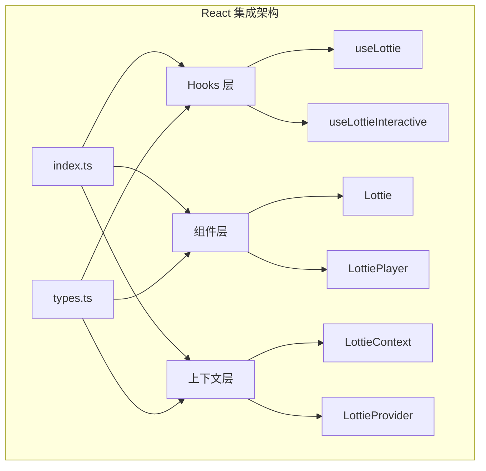
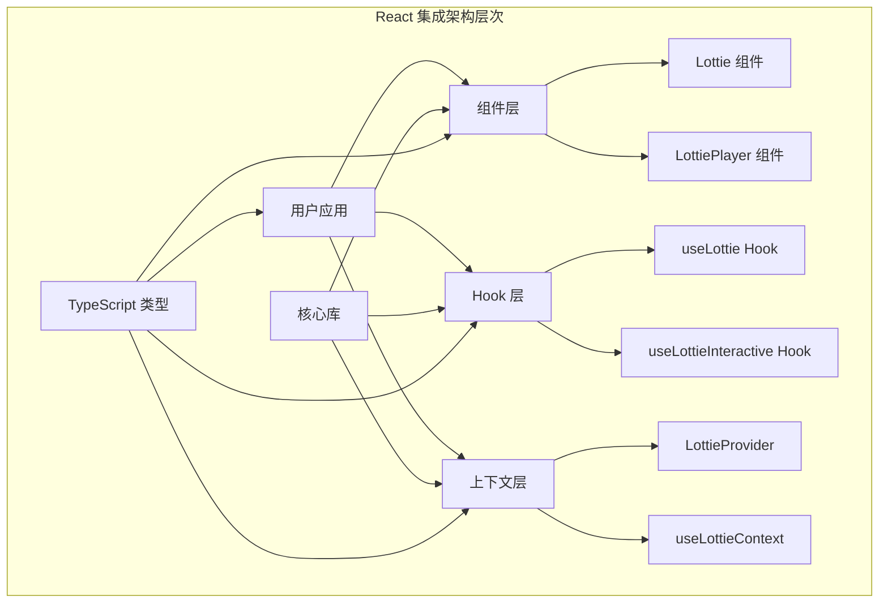
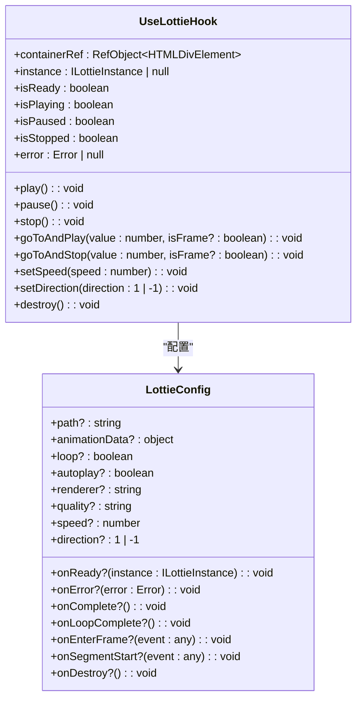
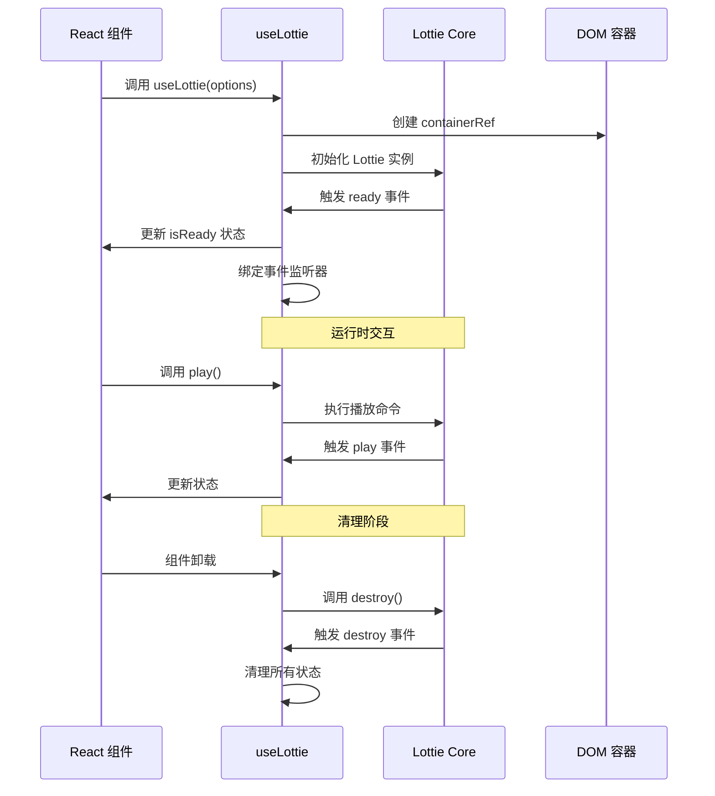
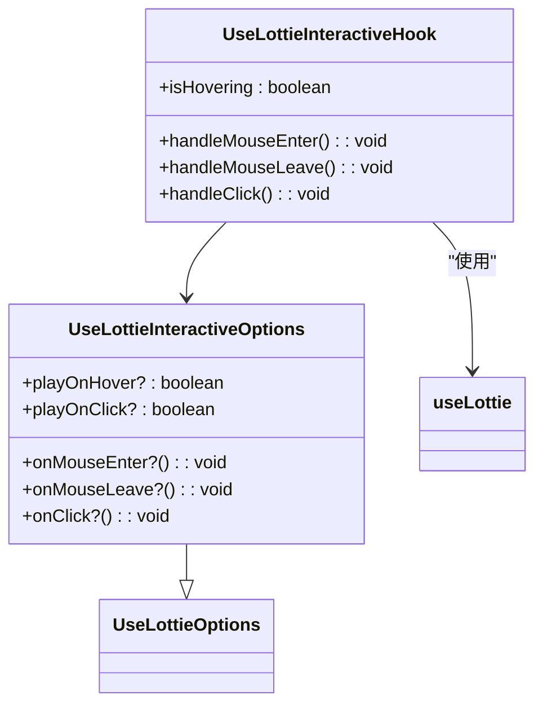
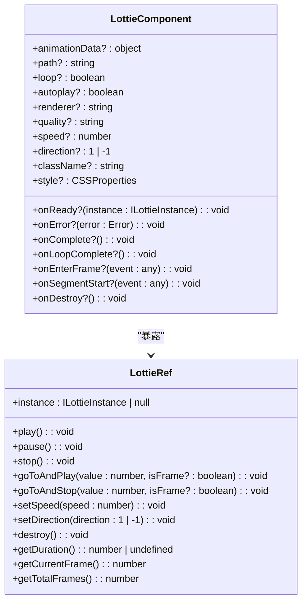
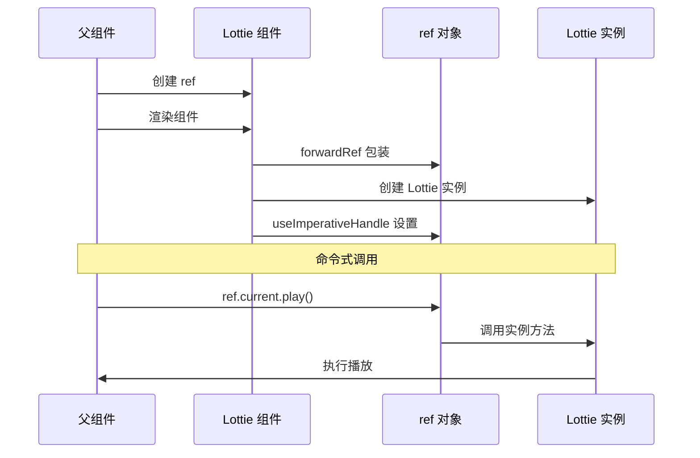
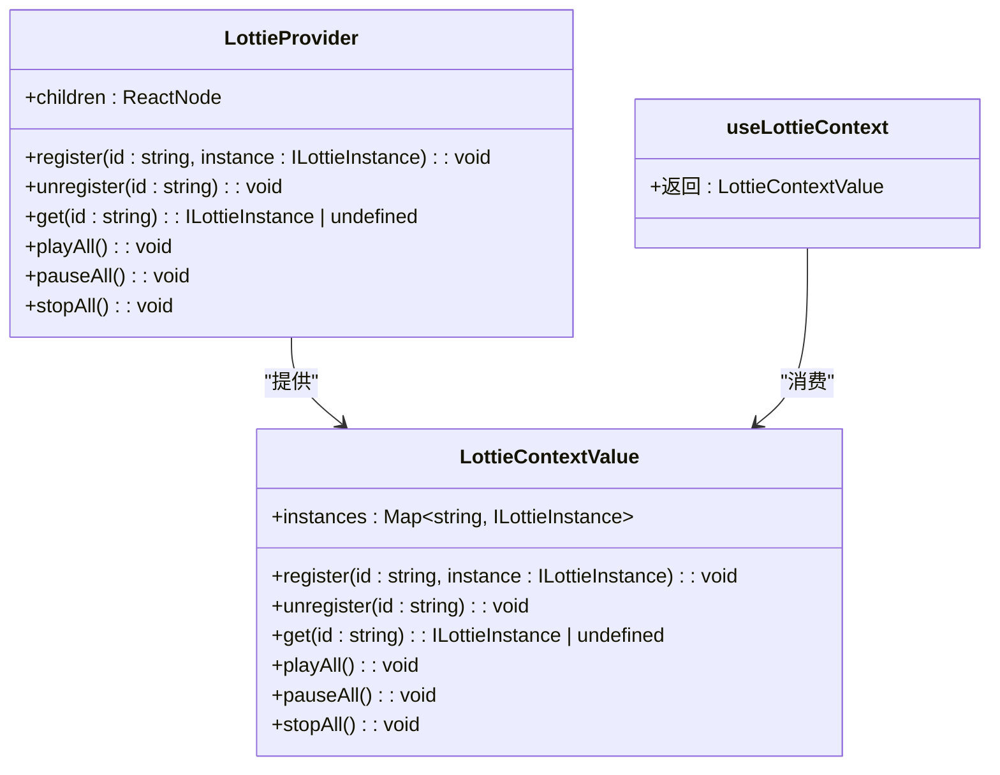
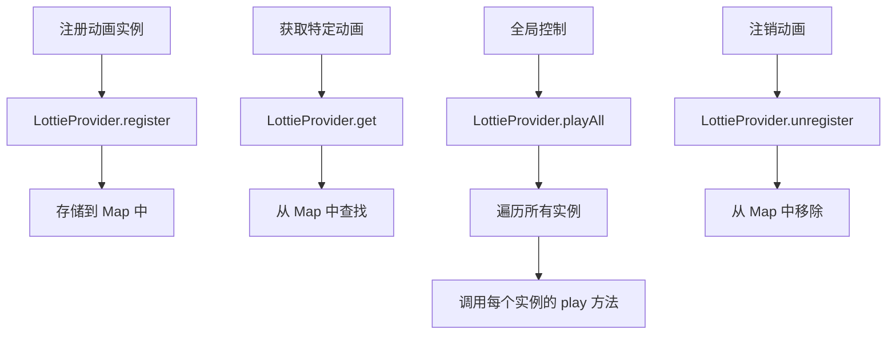

# React 集成

<cite>
**本文档中引用的文件**
- [useLottie.ts](file://packages/react/src/hooks/useLottie.ts)
- [useLottieInteractive.ts](file://packages/react/src/hooks/useLottieInteractive.ts)
- [Lottie.tsx](file://packages/react/src/components/Lottie.tsx)
- [LottieContext.tsx](file://packages/react/src/context/LottieContext.tsx)
- [types.ts](file://packages/react/src/types.ts)
- [index.ts](file://packages/react/src/index.ts)
- [App.tsx](file://packages/react/example/src/App.tsx)
</cite>

## 目录
1. [简介](#简介)
2. [项目结构](#项目结构)
3. [核心组件](#核心组件)
4. [架构概览](#架构概览)
5. [详细组件分析](#详细组件分析)
6. [依赖关系分析](#依赖关系分析)
7. [性能考虑](#性能考虑)
8. [故障排除指南](#故障排除指南)
9. [结论](#结论)

## 简介

Lottie React 集成提供了一套完整的 React Hooks 和组件，用于在 React 应用程序中高效地渲染和控制 Lottie 动画。该集成支持多种使用模式，从简单的静态展示到复杂的交互式动画控制，同时提供了 TypeScript 类型安全和现代 React 特性支持。

## 项目结构

React 集成模块采用清晰的分层架构，将功能分为 Hooks、组件和上下文管理三个主要层次：



**图表来源**
- [index.ts](file://packages/react/src/index.ts#L1-L8)
- [types.ts](file://packages/react/src/types.ts#L1-L76)

**章节来源**
- [index.ts](file://packages/react/src/index.ts#L1-L8)
- [types.ts](file://packages/react/src/types.ts#L1-L76)

## 核心组件

### 导出接口

React 集成提供了以下核心导出：

| 导出项 | 类型 | 描述 |
|--------|------|------|
| `Lottie` | 组件 | 主要的 Lottie React 组件 |
| `LottiePlayer` | 组件别名 | `Lottie` 的别名 |
| `useLottie` | Hook | 基础动画控制 Hook |
| `useLottieInteractive` | Hook | 交互式动画控制 Hook |
| `LottieProvider` | 上下文提供者 | 全局动画控制上下文 |
| `useLottieContext` | 上下文 Hook | 获取全局上下文 |

**章节来源**
- [index.ts](file://packages/react/src/index.ts#L1-L8)

## 架构概览

React 集成采用了组合式架构设计，通过不同的抽象层次满足不同使用场景的需求：



**图表来源**
- [Lottie.tsx](file://packages/react/src/components/Lottie.tsx#L1-L142)
- [useLottie.ts](file://packages/react/src/hooks/useLottie.ts#L1-L136)
- [useLottieInteractive.ts](file://packages/react/src/hooks/useLottieInteractive.ts#L1-L69)
- [LottieContext.tsx](file://packages/react/src/context/LottieContext.tsx#L1-L63)

## 详细组件分析

### useLottie Hook

`useLottie` 是 React 集成的基础 Hook，提供了完整的动画控制能力。

#### 核心功能特性



**图表来源**
- [useLottie.ts](file://packages/react/src/hooks/useLottie.ts#L8-L136)
- [types.ts](file://packages/react/src/types.ts#L34-L63)

#### 生命周期管理

`useLottie` 通过 React 的 `useEffect` 钩子实现了完整的生命周期管理：



**图表来源**
- [useLottie.ts](file://packages/react/src/hooks/useLottie.ts#L56-L114)

#### 配置选项详解

| 配置项 | 类型 | 默认值 | 描述 |
|--------|------|--------|------|
| `path` | `string` | - | 动画文件的 URL 路径 |
| `animationData` | `object` | - | 直接传入的动画数据对象 |
| `loop` | `boolean` | `true` | 是否循环播放 |
| `autoplay` | `boolean` | `true` | 是否自动播放 |
| `renderer` | `string` | `'svg'` | 渲染器类型 ('svg' \| 'canvas') |
| `quality` | `string` | `'high'` | 渲染质量 ('low' \| 'medium' \| 'high') |
| `speed` | `number` | `1` | 播放速度 |
| `direction` | `1 \| -1` | `1` | 播放方向 |

**章节来源**
- [useLottie.ts](file://packages/react/src/hooks/useLottie.ts#L59-L62)
- [types.ts](file://packages/react/src/types.ts#L4-L17)

### useLottieInteractive Hook

`useLottieInteractive` 在基础 `useLottie` 的基础上增加了内置的交互事件处理。

#### 交互功能扩展



**图表来源**
- [useLottieInteractive.ts](file://packages/react/src/hooks/useLottieInteractive.ts#L5-L11)
- [useLottieInteractive.ts](file://packages/react/src/hooks/useLottieInteractive.ts#L16-L68)

#### 事件处理流程

```mermaid
flowchart TD
A[鼠标进入容器] --> B{playOnHover?}
B --> |是| C[调用 lottie.play()]
B --> |否| D[仅更新状态]
C --> E[触发 onMouseEnter 回调]
D --> E
F[鼠标离开容器] --> G{playOnHover?}
G --> |是| H[调用 lottie.pause()]
G --> |否| I[仅更新状态]
H --> J[触发 onMouseLeave 回调]
I --> J
K[点击容器] --> L{playOnClick?}
L --> |是| M{当前是否正在播放?}
M --> |是| N[调用 lottie.pause()]
M --> |否| O[调用 lottie.play()]
L --> |否| P[仅触发 onClick 回调]
N --> P
O --> P
```

**图表来源**
- [useLottieInteractive.ts](file://packages/react/src/hooks/useLottieInteractive.ts#L20-L45)

**章节来源**
- [useLottieInteractive.ts](file://packages/react/src/hooks/useLottieInteractive.ts#L16-L68)

### Lottie 组件

`Lottie` 组件是一个完全封装的 React 组件，提供了声明式的动画渲染方式。

#### 组件特性



**图表来源**
- [Lottie.tsx](file://packages/react/src/components/Lottie.tsx#L8-L142)
- [types.ts](file://packages/react/src/types.ts#L19-L32)

#### Ref 转发机制

`Lottie` 组件使用 `forwardRef` 实现了完整的 ref 转发，支持命令式操作：



**图表来源**
- [Lottie.tsx](file://packages/react/src/components/Lottie.tsx#L7-L50)

**章节来源**
- [Lottie.tsx](file://packages/react/src/components/Lottie.tsx#L8-L142)

### LottieContext 上下文

`LottieContext` 提供了全局的动画控制能力，适用于需要统一管理多个动画的场景。

#### 上下文功能



**图表来源**
- [LottieContext.tsx](file://packages/react/src/context/LottieContext.tsx#L7-L62)
- [types.ts](file://packages/react/src/types.ts#L65-L75)

#### 全局控制流程



**图表来源**
- [LottieContext.tsx](file://packages/react/src/context/LottieContext.tsx#L10-L36)

**章节来源**
- [LottieContext.tsx](file://packages/react/src/context/LottieContext.tsx#L7-L62)

## 依赖关系分析

React 集成的依赖关系体现了清晰的分层架构：

```mermaid
graph TD
subgraph "外部依赖"
A[@ldesign/lottie-core]
end
subgraph "内部模块"
B[types.ts] --> C[useLottie.ts]
B --> D[useLottieInteractive.ts]
B --> E[Lottie.tsx]
B --> F[LottieContext.tsx]
G[index.ts] --> C
G --> D
G --> E
G --> F
H[App.tsx] --> G
end
A --> C
A --> D
A --> E
```

**图表来源**
- [useLottie.ts](file://packages/react/src/hooks/useLottie.ts#L1-L3)
- [useLottieInteractive.ts](file://packages/react/src/hooks/useLottieInteractive.ts#L1-L2)
- [Lottie.tsx](file://packages/react/src/components/Lottie.tsx#L1-L3)
- [LottieContext.tsx](file://packages/react/src/context/LottieContext.tsx#L1-L3)

### 模块间关系

| 模块 | 依赖项 | 关系 |
|------|--------|------|
| `useLottie` | `@ldesign/lottie-core` | 核心功能依赖 |
| `useLottieInteractive` | `useLottie` | 基于基础 Hook 扩展 |
| `Lottie` | `@ldesign/lottie-core` | 核心功能依赖 |
| `LottieContext` | `@ldesign/lottie-core` | 实例管理依赖 |
| `types.ts` | 所有模块 | 类型定义共享 |

**章节来源**
- [useLottie.ts](file://packages/react/src/hooks/useLottie.ts#L1-L3)
- [useLottieInteractive.ts](file://packages/react/src/hooks/useLottieInteractive.ts#L1-L2)
- [Lottie.tsx](file://packages/react/src/components/Lottie.tsx#L1-L3)
- [LottieContext.tsx](file://packages/react/src/context/LottieContext.tsx#L1-L3)

## 性能考虑

### 内存管理

React 集成实现了完善的内存管理机制：

1. **自动清理**: 所有 Hook 和组件都实现了正确的清理逻辑
2. **事件监听器管理**: 自动添加和移除 DOM 事件监听器
3. **实例销毁**: 组件卸载时自动销毁 Lottie 实例
4. **状态重置**: 清理函数会重置所有相关的 React 状态

### 并发模式兼容性

1. **Ref 转发**: 使用 `forwardRef` 支持 React 18 的并发特性
2. **useImperativeHandle**: 正确暴露命令式 API
3. **状态更新**: 使用 React 的状态更新机制确保一致性

### 性能优化策略

1. **回调函数缓存**: 使用 `useCallback` 缓存事件处理器
2. **依赖数组优化**: 精确控制副作用的执行时机
3. **条件渲染**: 支持按需加载和渲染

## 故障排除指南

### 常见问题及解决方案

#### 1. 动画无法显示

**可能原因**:
- 容器元素不存在或未正确引用
- 动画数据加载失败
- 渲染器不支持

**解决方案**:
```typescript
// 检查容器引用
const { containerRef } = useLottie(options);
console.log(containerRef.current); // 应该是非空的 HTMLDivElement

// 检查错误状态
const { error } = useLottie(options);
if (error) {
  console.error('Lottie 加载错误:', error);
}
```

#### 2. 交互功能不工作

**可能原因**:
- `useLottieInteractive` 的交互选项未正确设置
- 事件监听器被意外移除

**解决方案**:
```typescript
const interactiveOptions = {
  path: animationUrl,
  playOnHover: true,
  playOnClick: true,
  onMouseEnter: () => console.log('鼠标进入'),
  onMouseLeave: () => console.log('鼠标离开'),
  onClick: () => console.log('点击事件')
};

const { isHovering } = useLottieInteractive(interactiveOptions);
```

#### 3. 内存泄漏

**检查点**:
- 确保正确使用清理函数
- 检查事件监听器是否正确移除
- 验证组件是否正确卸载

**预防措施**:
```typescript
// 使用 useEffect 清理
useEffect(() => {
  const cleanup = () => {
    // 清理逻辑
  };
  
  return cleanup;
}, []);
```

#### 4. TypeScript 类型错误

**常见类型问题**:
- `LottieProps` 类型不匹配
- 回调函数参数类型不正确
- Ref 类型不匹配

**解决方案**:
```typescript
// 明确指定类型
const lottieRef = useRef<LottieRef>(null);

// 正确的回调函数类型
const onReady = useCallback((instance: ILottieInstance) => {
  console.log('动画已准备');
}, []);

// 类型安全的配置
const options: UseLottieOptions = {
  path: animationUrl,
  autoplay: true,
  loop: true
};
```

**章节来源**
- [useLottie.ts](file://packages/react/src/hooks/useLottie.ts#L105-L114)
- [Lottie.tsx](file://packages/react/src/components/Lottie.tsx#L90-L99)

## 结论

Lottie React 集成提供了一个完整、类型安全且高性能的解决方案，用于在 React 应用中集成 Lottie 动画。通过合理的架构设计和丰富的功能特性，它能够满足从简单展示到复杂交互的各种需求。

### 主要优势

1. **多层级抽象**: 从基础 Hook 到高级组件，满足不同复杂度需求
2. **类型安全**: 完整的 TypeScript 支持
3. **性能优化**: 合理的状态管理和内存清理
4. **现代 React**: 支持并发模式和最新 React 特性
5. **灵活配置**: 丰富的配置选项和事件处理

### 最佳实践建议

1. **选择合适的抽象层级**: 根据需求选择 Hook 或组件
2. **正确处理生命周期**: 确保资源正确清理
3. **类型安全**: 充分利用 TypeScript 类型系统
4. **性能监控**: 监控动画性能和内存使用
5. **错误处理**: 实现适当的错误边界和降级方案

这套 React 集成不仅提供了强大的功能，还保持了良好的开发体验，是构建现代化 React 应用中 Lottie 动画集成的理想选择。