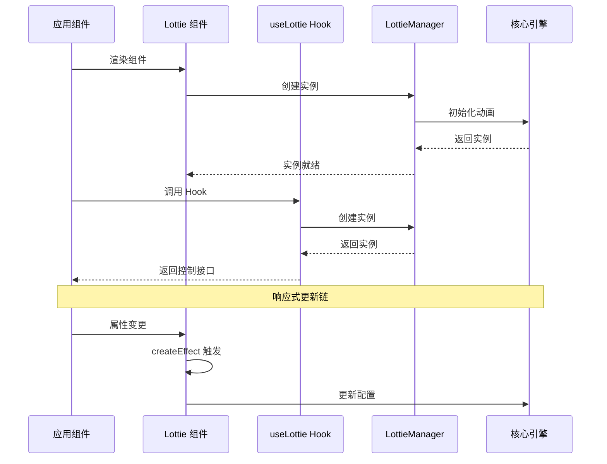
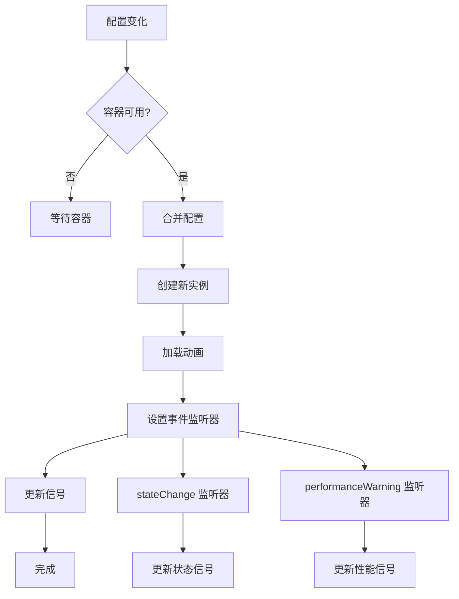
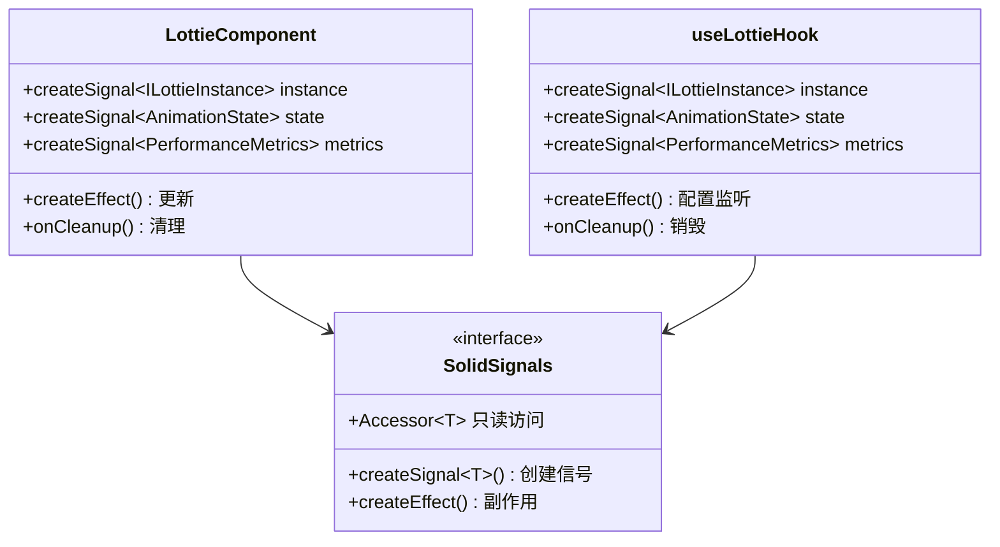
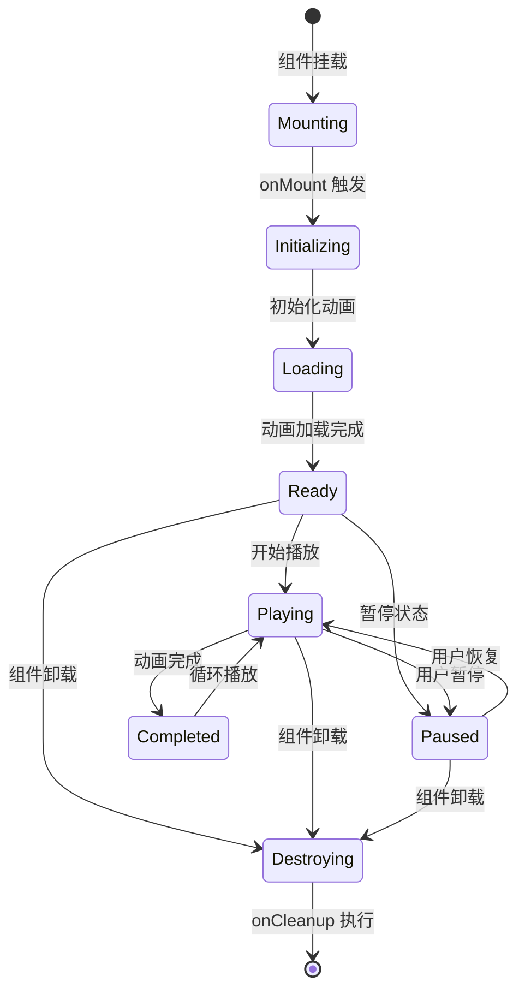
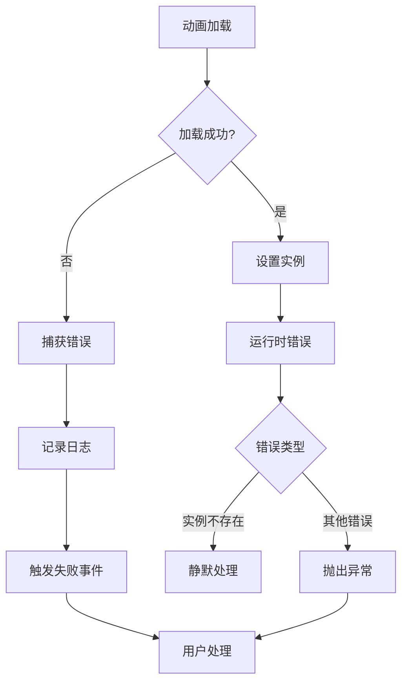

# Solid 集成

<cite>
**本文档中引用的文件**
- [packages/solid/src/useLottie.ts](file://packages/solid/src/useLottie.ts)
- [packages/solid/src/Lottie.tsx](file://packages/solid/src/Lottie.tsx)
- [packages/solid/src/index.ts](file://packages/solid/src/index.ts)
- [packages/solid/src/__tests__/Lottie.test.tsx](file://packages/solid/src/__tests__/Lottie.test.tsx)
- [examples/solid-demo/src/App.tsx](file://examples/solid-demo/src/App.tsx)
- [packages/solid/package.json](file://packages/solid/package.json)
- [packages/core/src/types/index.ts](file://packages/core/src/types/index.ts)
</cite>

## 目录
1. [简介](#简介)
2. [项目结构](#项目结构)
3. [核心组件](#核心组件)
4. [架构概览](#架构概览)
5. [详细组件分析](#详细组件分析)
6. [响应式集成](#响应式集成)
7. [生命周期管理](#生命周期管理)
8. [性能特性](#性能特性)
9. [最佳实践](#最佳实践)
10. [故障排除](#故障排除)
11. [总结](#总结)

## 简介

Solid.js 集成为 Lottie 动画提供了完整的响应式解决方案，充分利用了 Solid 的细粒度响应式系统。该集成包含两个主要部分：`Lottie` 组件用于声明式渲染动画，以及 `useLottie` 组合式函数用于程序化控制动画。

Solid 集成的核心优势在于其与 Solid.js 响应式系统的深度集成，提供细粒度的更新机制、优秀的性能表现和简洁的 API 设计。

## 项目结构

Solid 集成采用模块化设计，清晰分离了组件和组合式函数的功能：

```mermaid
graph TB
subgraph "Solid 包结构"
A[index.ts] --> B[Lottie.tsx]
A --> C[useLottie.ts]
B --> D[LottieProps 接口]
C --> E[UseLottieOptions 接口]
C --> F[UseLottieReturn 接口]
end
subgraph "核心依赖"
G[@ldesign/lottie-core] --> H[LottieManager]
G --> I[ILottieInstance]
G --> J[LottieConfig]
end
subgraph "示例应用"
K[App.tsx] --> B
K --> C
end
```

**图表来源**
- [packages/solid/src/index.ts](file://packages/solid/src/index.ts#L1-L25)
- [packages/solid/src/Lottie.tsx](file://packages/solid/src/Lottie.tsx#L1-L156)
- [packages/solid/src/useLottie.ts](file://packages/solid/src/useLottie.ts#L1-L108)

**章节来源**
- [packages/solid/src/index.ts](file://packages/solid/src/index.ts#L1-L25)
- [packages/solid/package.json](file://packages/solid/package.json#L1-L68)

## 核心组件

Solid 集成提供了两个核心 API：声明式的 `Lottie` 组件和程序化的 `useLottie` 组合式函数。

### Lottie 组件

`Lottie` 组件是一个完整的 Solid.js 组件，支持所有标准的 Solid.js 特性，包括响应式属性、事件处理和生命周期管理。

### useLottie Hook

`useLottie` 是一个组合式函数，提供程序化的动画控制能力，返回可访问的动画实例和控制方法。

**章节来源**
- [packages/solid/src/Lottie.tsx](file://packages/solid/src/Lottie.tsx#L32-L44)
- [packages/solid/src/useLottie.ts](file://packages/solid/src/useLottie.ts#L23-L44)

## 架构概览

Solid 集成采用了分层架构设计，确保了良好的关注点分离和可维护性：



**图表来源**
- [packages/solid/src/Lottie.tsx](file://packages/solid/src/Lottie.tsx#L117-L132)
- [packages/solid/src/useLottie.ts](file://packages/solid/src/useLottie.ts#L50-L80)

## 详细组件分析

### Lottie 组件详细分析

`Lottie` 组件是 Solid.js 中最完整的动画解决方案，提供了丰富的配置选项和事件处理能力。

#### 核心特性

1. **响应式属性系统**：组件自动响应所有配置属性的变化
2. **事件处理机制**：完整的事件回调系统
3. **生命周期管理**：自动的挂载和清理
4. **样式支持**：灵活的 CSS 样式配置

#### 配置选项

| 属性 | 类型 | 默认值 | 描述 |
|------|------|--------|------|
| `path` | `string` | - | 动画文件路径 |
| `animationData` | `any` | - | 内联动画数据 |
| `renderer` | `'svg' \| 'canvas' \| 'html' \| 'webgl'` | `'svg'` | 渲染器类型 |
| `loop` | `boolean \| number` | `true` | 循环设置 |
| `autoplay` | `boolean` | `true` | 自动播放 |
| `speed` | `number` | `1` | 播放速度 |
| `name` | `string` | - | 动画名称 |

#### 事件回调

| 事件 | 参数 | 描述 |
|------|------|------|
| `onAnimationCreated` | `(instance: ILottieInstance) => void` | 动画创建完成 |
| `onStateChange` | `(state: AnimationState) => void` | 状态变化 |
| `onComplete` | `() => void` | 动画完成 |
| `onLoopComplete` | `() => void` | 循环完成 |
| `onDataReady` | `() => void` | 数据加载完成 |
| `onDataFailed` | `(error: Error) => void` | 数据加载失败 |
| `onPerformanceWarning` | `(metrics: PerformanceMetrics) => void` | 性能警告 |

**章节来源**
- [packages/solid/src/Lottie.tsx](file://packages/solid/src/Lottie.tsx#L12-L30)
- [packages/solid/src/Lottie.tsx](file://packages/solid/src/Lottie.tsx#L45-L156)

### useLottie Hook 详细分析

`useLottie` 提供了程序化的动画控制能力，特别适合需要精确控制动画场景的应用。

#### 返回值接口

```typescript
interface UseLottieReturn {
  instance: Accessor<ILottieInstance | null>
  state: Accessor<AnimationState>
  metrics: Accessor<PerformanceMetrics | null>
  play: () => void
  pause: () => void
  stop: () => void
  reset: () => void
  setSpeed: (speed: number) => void
  setDirection: (direction: 1 | -1) => void
  goToAndStop: (frame: number, isFrame?: boolean) => void
  goToAndPlay: (frame: number, isFrame?: boolean) => void
}
```

#### 响应式配置

`useLottie` 支持动态配置更新，当配置对象发生变化时会自动重新初始化动画：



**图表来源**
- [packages/solid/src/useLottie.ts](file://packages/solid/src/useLottie.ts#L50-L80)

**章节来源**
- [packages/solid/src/useLottie.ts](file://packages/solid/src/useLottie.ts#L9-L22)
- [packages/solid/src/useLottie.ts](file://packages/solid/src/useLottie.ts#L45-L108)

## 响应式集成

Solid 集成的核心优势在于与 Solid.js 响应式系统的深度集成，实现了细粒度的更新机制。

### 信号系统

Solid 集成使用 Solid.js 的信号系统来管理动画状态：



**图表来源**
- [packages/solid/src/Lottie.tsx](file://packages/solid/src/Lottie.tsx#L53-L56)
- [packages/solid/src/useLottie.ts](file://packages/solid/src/useLottie.ts#L46-L48)

### 细粒度更新

Solid.js 的细粒度更新机制确保了只有真正需要更新的部分才会重新渲染：

1. **状态信号**：独立的状态信号允许精确的响应式更新
2. **配置监听**：createEffect 监听配置变化
3. **事件代理**：事件监听器直接更新信号
4. **副作用管理**：onCleanup 确保资源正确释放

### 与 JSX 的集成

Solid 集成完美地与 JSX 语法结合：

```typescript
// 声明式使用
<Lottie path="/animation.json" autoplay loop />

// 程序化控制
const { play, pause, stop } = useLottie({
  path: '/animation.json',
  autoplay: false
})
```

**章节来源**
- [packages/solid/src/Lottie.tsx](file://packages/solid/src/Lottie.tsx#L134-L142)
- [packages/solid/src/useLottie.ts](file://packages/solid/src/useLottie.ts#L50-L80)

## 生命周期管理

Solid 集成提供了完善的生命周期管理机制，确保资源的正确分配和释放。

### 组件生命周期



### 清理机制

Solid 集成使用 `onCleanup` 钩子确保资源的正确清理：

1. **实例销毁**：调用 `instance.destroy()` 清理动画实例
2. **事件移除**：自动移除所有事件监听器
3. **内存释放**：确保没有内存泄漏
4. **错误处理**：优雅处理清理过程中的异常

### 错误处理

集成提供了多层次的错误处理机制：



**图表来源**
- [packages/solid/src/Lottie.tsx](file://packages/solid/src/Lottie.tsx#L105-L115)
- [packages/solid/src/useLottie.ts](file://packages/solid/src/useLottie.ts#L77-L80)

**章节来源**
- [packages/solid/src/Lottie.tsx](file://packages/solid/src/Lottie.tsx#L117-L132)
- [packages/solid/src/useLottie.ts](file://packages/solid/src/useLottie.ts#L82-L92)

## 性能特性

Solid 集成在性能方面表现出色，得益于 Solid.js 的响应式系统和优化的资源管理。

### 性能优势

1. **细粒度更新**：只更新必要的部分
2. **最小化重渲染**：避免不必要的组件重渲染
3. **高效的内存管理**：自动的资源清理
4. **优化的事件处理**：直接的事件代理机制

### 性能监控

集成提供了内置的性能监控功能：

| 指标 | 描述 | 单位 |
|------|------|------|
| FPS | 帧率 | 帧/秒 |
| 内存使用 | 内存占用 | MB |
| CPU 使用率 | 处理器占用 | % |
| 渲染时间 | 单帧渲染耗时 | ms |
| 加载时间 | 动画加载耗时 | ms |

### 优化策略

1. **懒加载**：按需加载动画资源
2. **实例池**：重用动画实例减少创建开销
3. **智能更新**：基于信号变化的智能更新
4. **资源预热**：提前准备常用动画

**章节来源**
- [packages/core/src/types/index.ts](file://packages/core/src/types/index.ts#L29-L50)

## 最佳实践

### 组件使用建议

1. **优先使用 Lottie 组件**：对于大多数场景，声明式组件更简洁
2. **使用 useLottie 进行复杂控制**：需要精确控制时使用 Hook
3. **合理使用事件回调**：避免在事件处理中执行重操作
4. **注意内存管理**：确保在不需要时正确清理资源

### 性能优化建议

1. **预加载关键动画**：在应用启动时预加载重要动画
2. **使用适当的渲染器**：根据需求选择 SVG 或 Canvas
3. **控制并发数量**：避免同时加载过多动画
4. **监控性能指标**：定期检查性能数据

### 错误处理建议

1. **提供备用方案**：为动画加载失败提供替代内容
2. **记录详细日志**：捕获并记录所有错误信息
3. **优雅降级**：在性能不佳时自动降低质量
4. **用户反馈**：向用户提供清晰的错误信息

**章节来源**
- [examples/solid-demo/src/App.tsx](file://examples/solid-demo/src/App.tsx#L1-L77)

## 故障排除

### 常见问题及解决方案

#### 动画无法显示

**问题描述**：动画组件渲染但看不到效果

**可能原因**：
1. 容器尺寸为 0
2. 动画路径错误
3. 渲染器不兼容

**解决方案**：
```typescript
// 确保容器有明确尺寸
<div style={{ width: '300px', height: '300px' }}>
  <Lottie path="/animation.json" />
</div>

// 或使用 useLottie 时设置容器
const { containerRef } = useLottie({
  container: () => containerElement,
  path: '/animation.json'
})
```

#### 性能问题

**问题描述**：动画播放卡顿或内存占用过高

**解决方案**：
1. 启用性能监控
2. 降低动画质量
3. 使用 Canvas 渲染器
4. 控制并发动画数量

#### 事件不触发

**问题描述**：事件回调没有被调用

**解决方案**：
1. 检查事件名称拼写
2. 确保事件处理器不是异步函数
3. 验证动画是否正确加载

### 调试技巧

1. **启用调试模式**：查看详细的日志信息
2. **使用性能分析工具**：监控内存和 CPU 使用
3. **检查网络请求**：确认动画文件正确加载
4. **验证配置参数**：确保所有配置都符合预期

**章节来源**
- [packages/solid/src/Lottie.tsx](file://packages/solid/src/Lottie.tsx#L105-L115)
- [packages/solid/src/useLottie.ts](file://packages/solid/src/useLottie.ts#L77-L80)

## 总结

Solid.js 集成为 Lottie 动画提供了强大而灵活的解决方案。通过深度集成 Solid.js 的响应式系统，该集成实现了：

1. **优秀的性能表现**：细粒度更新和高效的资源管理
2. **简洁的 API 设计**：声明式和程序化两种使用方式
3. **完整的生命周期管理**：自动的资源清理和错误处理
4. **强大的扩展能力**：丰富的配置选项和事件系统

对于 Solid.js 开发者来说，这个集成不仅提供了完整的 Lottie 动画解决方案，更重要的是展示了如何充分利用现代前端框架的响应式特性来构建高性能的用户界面组件。

无论是简单的动画展示还是复杂的交互场景，Solid 集成都能提供合适的解决方案，让开发者能够专注于业务逻辑而非底层实现细节。