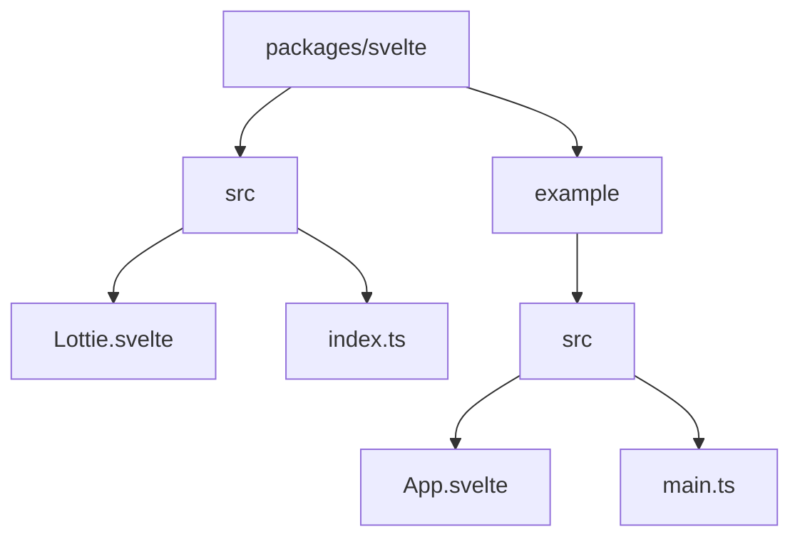
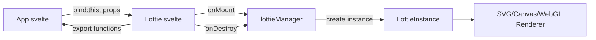
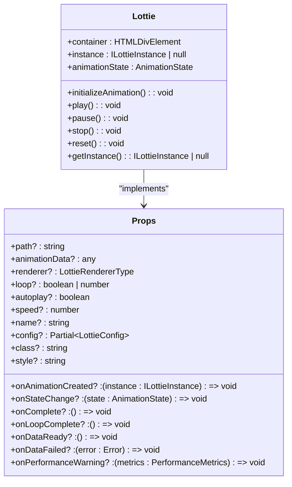
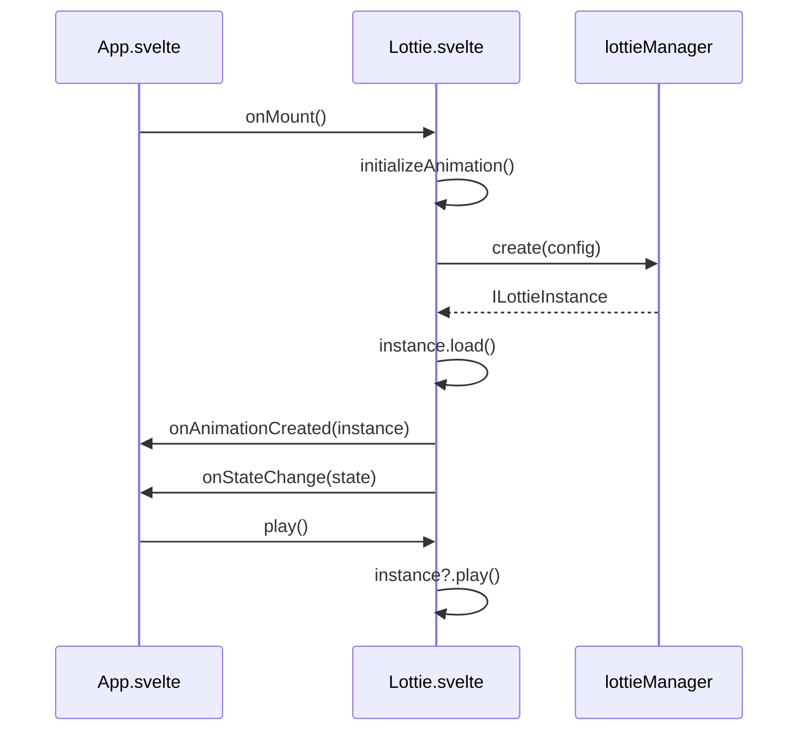
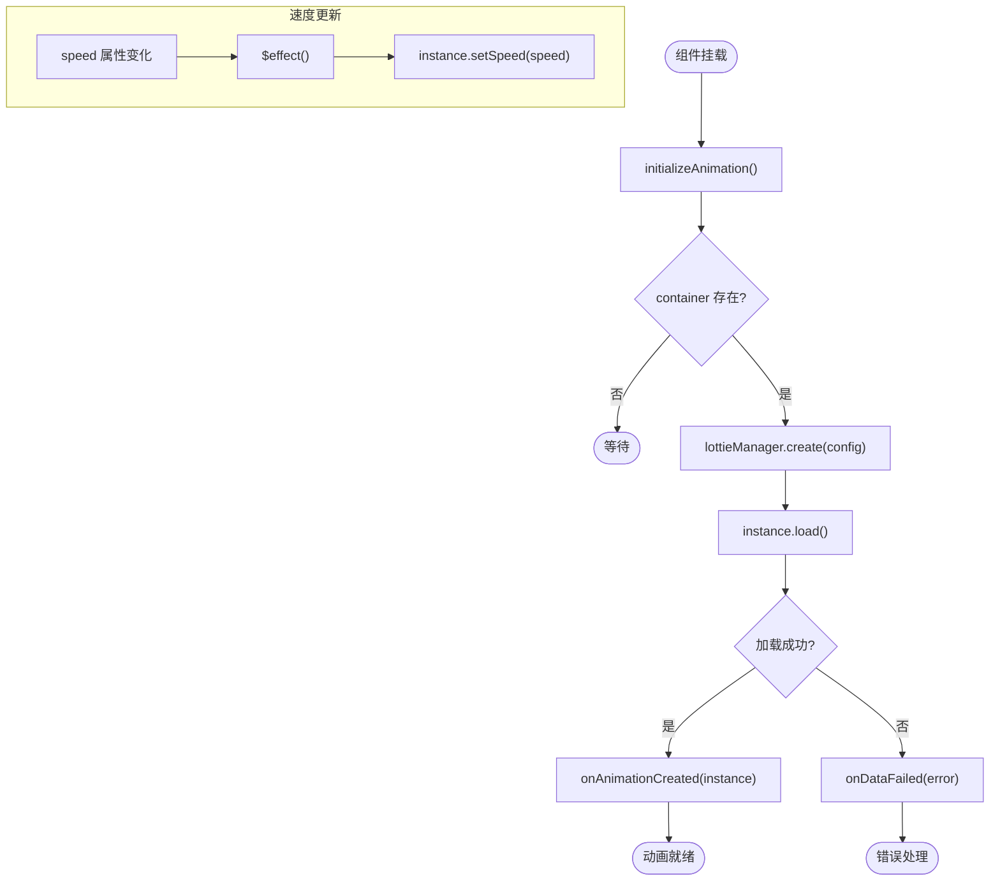

# Svelte 集成

<cite>
**本文档中引用的文件**  
- [Lottie.svelte](file://packages/svelte/src/Lottie.svelte#L1-L165)
- [index.ts](file://packages/svelte/src/index.ts#L1-L21)
- [App.svelte](file://packages/svelte/example/src/App.svelte#L1-L493)
- [lottieManager](file://packages/core/src/core/LottieManager.ts)
- [LottieManager.ts](file://packages/core/src/core/LottieManager.ts)
</cite>

## 目录
1. [简介](#简介)
2. [项目结构](#项目结构)
3. [核心组件](#核心组件)
4. [架构概述](#架构概述)
5. [详细组件分析](#详细组件分析)
6. [依赖分析](#依赖分析)
7. [性能考虑](#性能考虑)
8. [故障排除指南](#故障排除指南)
9. [结论](#结论)

## 简介
`@ldesign/lottie-svelte` 是一个专为 Svelte 5 设计的高性能 Lottie 动画组件库，利用 Svelte 的编译时反应性和 Runes 系统实现最小的运行时开销。该集成通过 Svelte 组件模型和反应性系统，提供了简单而强大的 API 来控制 Lottie 动画。它支持 Svelte 5 的现代特性，如 `$state`、`$props` 和 `$effect`，同时保持与 Svelte 4 的兼容性。该组件封装了核心 Lottie 功能，提供了一种声明式的方式来加载、播放和控制动画，同时处理生命周期管理和性能优化。

## 项目结构
Svelte 集成位于 `packages/svelte` 目录中，遵循标准的 Svelte 库结构。`src` 目录包含主要的 `Lottie.svelte` 组件和 `index.ts` 入口文件，后者重新导出核心类型以方便使用。`example` 目录提供了一个全面的演示应用，展示了所有功能，包括受控动画、速度控制、方向控制、帧导航、渲染器选择和事件处理。该包使用 Vite 进行构建，Svelte 插件用于编译组件，并通过 Vitest 进行测试。



**Diagram sources**  
- [Lottie.svelte](file://packages/svelte/src/Lottie.svelte#L1-L165)
- [index.ts](file://packages/svelte/src/index.ts#L1-L21)
- [App.svelte](file://packages/svelte/example/src/App.svelte#L1-L493)

**Section sources**
- [Lottie.svelte](file://packages/svelte/src/Lottie.svelte#L1-L165)
- [index.ts](file://packages/svelte/src/index.ts#L1-L21)
- [App.svelte](file://packages/svelte/example/src/App.svelte#L1-L493)

## 核心组件
`@ldesign/lottie-svelte` 的核心是 `Lottie.svelte` 组件，它作为 Lottie 核心功能的 Svelte 封装。该组件通过 `lottieManager` 从 `@ldesign/lottie-core` 创建和管理 Lottie 实例。它利用 Svelte 的 `onMount` 和 `onDestroy` 生命周期函数来初始化和销毁动画实例，确保适当的资源管理。组件通过 `$props()` 宏接收所有配置选项，并使用 `$state` 声明反应性状态变量来跟踪动画实例和状态。`$effect` 用于在 `speed` 属性变化时自动更新动画速度，展示了 Svelte 编译时反应性的强大功能。

**Section sources**
- [Lottie.svelte](file://packages/svelte/src/Lottie.svelte#L1-L165)
- [index.ts](file://packages/svelte/src/index.ts#L1-L21)

## 架构概述
Svelte 集成的架构建立在 Svelte 的编译时反应性原则之上。`Lottie.svelte` 组件不包含运行时反应性系统，而是由 Svelte 编译器生成高效的、直接操作 DOM 的 JavaScript 代码。当组件的属性（如 `speed` 或 `direction`）发生变化时，编译器会生成仅更新必要部分的代码。该组件通过 `lottieManager` 与 `@ldesign/lottie-core` 交互，后者负责实际的动画渲染和管理。这种分离使得 Svelte 组件可以专注于声明性 UI 和反应性逻辑，而核心库处理复杂的动画逻辑和性能优化。



**Diagram sources**  
- [Lottie.svelte](file://packages/svelte/src/Lottie.svelte#L1-L165)
- [lottieManager](file://packages/core/src/core/LottieManager.ts)

## 详细组件分析

### Lottie 组件分析
`Lottie.svelte` 组件是整个集成的核心。它使用 Svelte 5 的 `lang="ts"` 脚本块来提供完整的 TypeScript 支持。组件定义了一个 `Props` 接口，明确列出了所有可用的属性，包括 `path`、`animationData`、`renderer`、`loop`、`autoplay`、`speed` 以及各种事件处理程序。`$props()` 宏用于解构这些属性，使它们在组件中可用。

#### 对象导向组件


**Diagram sources**  
- [Lottie.svelte](file://packages/svelte/src/Lottie.svelte#L1-L165)

#### API/服务组件


**Diagram sources**  
- [Lottie.svelte](file://packages/svelte/src/Lottie.svelte#L1-L165)
- [LottieManager.ts](file://packages/core/src/core/LottieManager.ts)

#### 复杂逻辑组件


**Diagram sources**  
- [Lottie.svelte](file://packages/svelte/src/Lottie.svelte#L1-L165)

**Section sources**
- [Lottie.svelte](file://packages/svelte/src/Lottie.svelte#L1-L165)
- [App.svelte](file://packages/svelte/example/src/App.svelte#L1-L493)

## 依赖分析
Svelte 集成的主要依赖是 `@ldesign/lottie-core`，它提供了所有底层的动画功能。该包通过 `peerDependencies` 声明了对 Svelte 4 或 5 的依赖，确保与应用程序中的 Svelte 版本兼容。开发依赖包括 `vite`、`@sveltejs/vite-plugin-svelte` 和 `typescript`，用于构建和编译组件，以及 `vitest` 和 `@testing-library/svelte` 用于测试。这种依赖结构确保了最终包的轻量化，因为它不包含 Svelte 运行时，而是依赖于应用程序提供的运行时。

```mermaid
graph TD
A[@ldesign/lottie-svelte] --> B[@ldesign/lottie-core]
A --> C[Svelte 4/5]
A --> D[Vite]
A --> E[TypeScript]
A --> F[Vitest]
A --> G[@testing-library/svelte]
```

**Diagram sources**  
- [package.json](file://packages/svelte/package.json#L34-L52)

**Section sources**
- [package.json](file://packages/svelte/package.json#L34-L52)

## 性能考虑
Svelte 集成通过利用 Svelte 的编译时反应性实现了卓越的性能。与在运行时跟踪依赖的框架不同，Svelte 在构建时分析代码并生成直接更新 DOM 的命令式 JavaScript。这消除了虚拟 DOM 的开销，并导致更小的包大小和更快的执行速度。`$effect` 的使用确保了 `speed` 更新等反应性逻辑是高效的，只在必要时执行。此外，通过 `lottieManager` 管理 Lottie 实例，可以实现潜在的实例池化和内存优化。组件在 `onDestroy` 钩子中正确销毁实例，防止内存泄漏。

## 故障排除指南
常见的问题包括动画不显示、生命周期错误和类型错误。如果动画不显示，请检查 `path` 属性是否正确，并确保服务器正确提供 JSON 文件。生命周期错误通常源于在组件销毁后尝试与 Lottie 实例交互；确保在 `onDestroy` 中正确清理。类型错误可能发生在使用 Svelte 4 时，因为 `Lottie.svelte` 使用了 Svelte 5 的 Runes；在这种情况下，应使用标准的 Svelte 4 反应性语法。CSS 作用域问题可以通过在组件的 `<style>` 块中使用 `:global()` 选择器来解决，以确保样式正确应用于 Lottie 容器。

**Section sources**
- [Lottie.svelte](file://packages/svelte/src/Lottie.svelte#L114-L126)
- [App.svelte](file://packages/svelte/example/src/App.svelte#L252-L492)

## 结论
`@ldesign/lottie-svelte` 提供了一个现代、高效且易于使用的 Lottie 动画集成，充分利用了 Svelte 5 的编译时反应性和 Runes 系统。通过将核心 Lottie 功能封装在 Svelte 组件中，它为开发者提供了一个声明式的 API，同时保持了高性能和小包体积。该集成展示了如何将复杂的第三方库与 Svelte 的反应性模型无缝集成，为其他库的集成提供了优秀的范例。