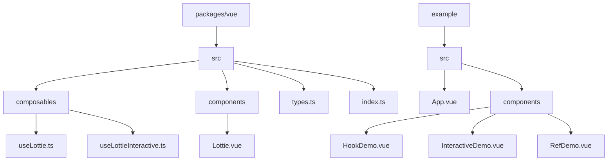
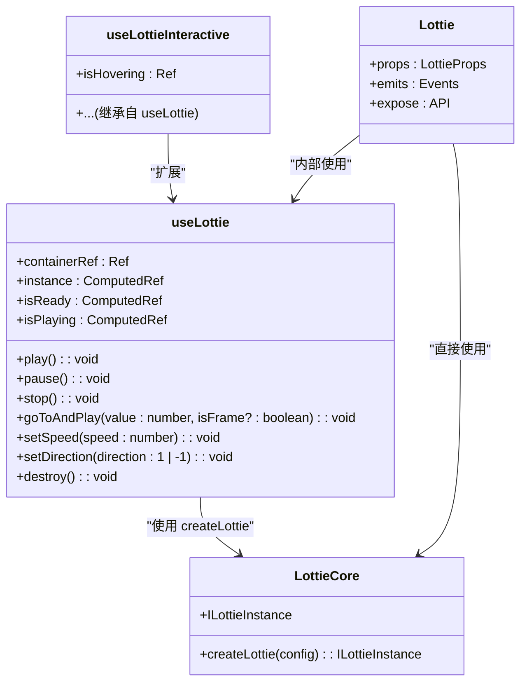
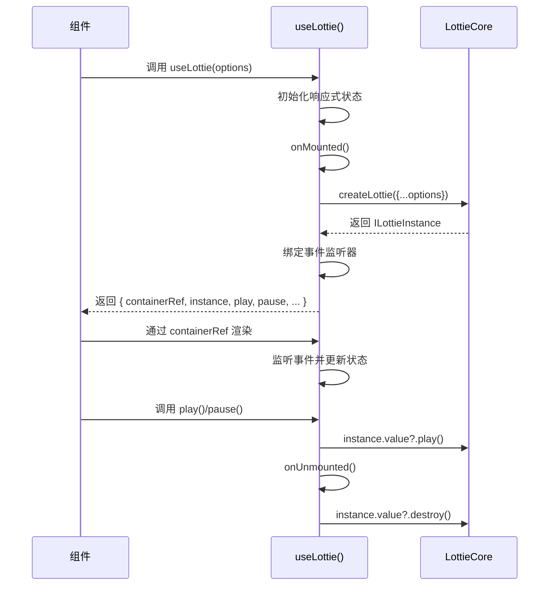
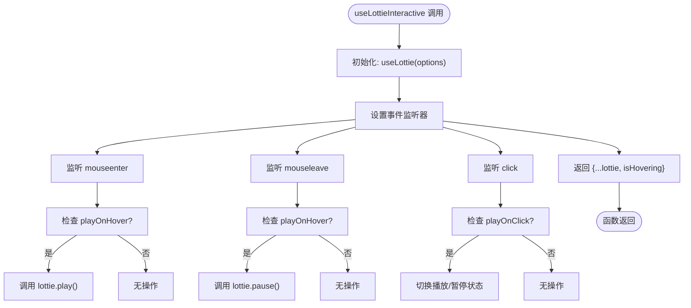
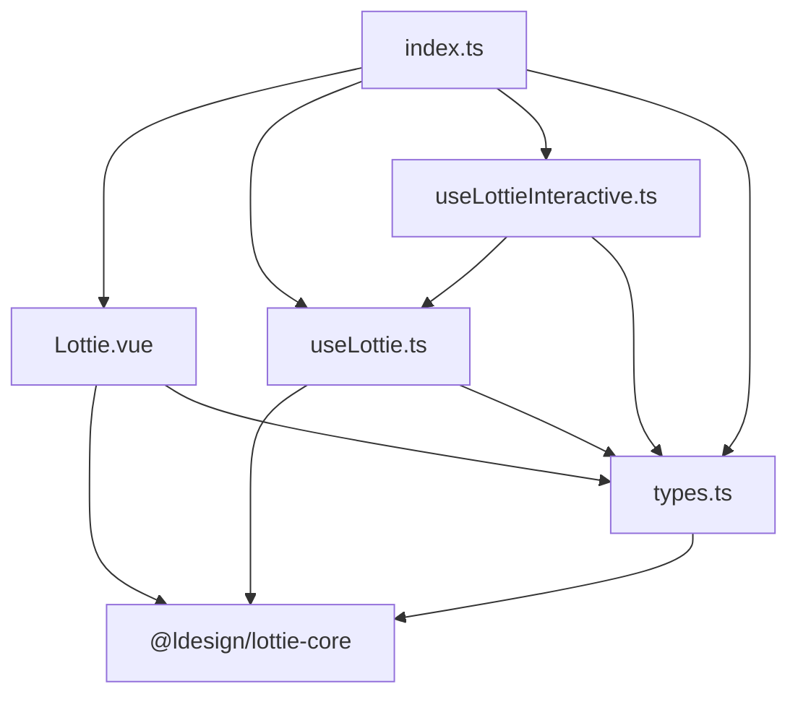

# Vue 集成

<cite>
**本文档中引用的文件**  
- [index.ts](file://packages/vue/src/index.ts)
- [useLottie.ts](file://packages/vue/src/composables/useLottie.ts)
- [useLottieInteractive.ts](file://packages/vue/src/composables/useLottieInteractive.ts)
- [Lottie.vue](file://packages/vue/src/components/Lottie.vue)
- [types.ts](file://packages/vue/src/types.ts)
- [App.vue](file://packages/vue/example/src/App.vue)
- [HookDemo.vue](file://examples/vue-demo/src/components/HookDemo.vue)
- [InteractiveDemo.vue](file://examples/vue-demo/src/components/InteractiveDemo.vue)
- [RefDemo.vue](file://examples/vue-demo/src/components/RefDemo.vue)
</cite>

## 目录
1. [简介](#简介)
2. [项目结构](#项目结构)
3. [核心组件](#核心组件)
4. [架构概览](#架构概览)
5. [详细组件分析](#详细组件分析)
6. [依赖关系分析](#依赖关系分析)
7. [性能考虑](#性能考虑)
8. [故障排除指南](#故障排除指南)
9. [结论](#结论)

## 简介
本文档详细介绍了 `@ldesign/lottie-vue` 包中 Vue 3 集成子功能的实现。重点涵盖 `useLottie`、`useLottieInteractive` 组合式函数、`Lottie` 组件以及相关的类型定义。文档解释了这些功能如何与 Vue 3 的响应式系统和生命周期集成，并提供了配置选项、参数和返回值的实际代码示例。同时，也探讨了常见的问题，如引用处理、SSR 兼容性和内存泄漏。

## 项目结构
Vue 集成功能位于 `packages/vue` 目录下，遵循典型的 Vue 库结构，包含组合式函数、组件和类型定义。

**图示来源**
- [packages/vue/src](file://packages/vue/src)
- [packages/vue/example](file://packages/vue/example)

**本节来源**
- [packages/vue/src](file://packages/vue/src)
- [packages/vue/example](file://packages/vue/example)

## 核心组件
本节分析 Vue 集成中的核心功能：`useLottie` 和 `useLottieInteractive` 组合式函数，以及 `Lottie` 组件。

**本节来源**
- [useLottie.ts](file://packages/vue/src/composables/useLottie.ts)
- [useLottieInteractive.ts](file://packages/vue/src/composables/useLottieInteractive.ts)
- [Lottie.vue](file://packages/vue/src/components/Lottie.vue)

## 架构概览
Vue 集成的核心是围绕 `@ldesign/lottie-core` 库构建的。`Lottie` 组件和 `useLottie` 组合式函数都使用 `createLottie` 工厂函数来创建和管理 Lottie 动画实例。`useLottieInteractive` 则是 `useLottie` 的增强版本，添加了交互性。

**图示来源**
- [useLottie.ts](file://packages/vue/src/composables/useLottie.ts)
- [useLottieInteractive.ts](file://packages/vue/src/composables/useLottieInteractive.ts)
- [Lottie.vue](file://packages/vue/src/components/Lottie.vue)
- [types.ts](file://packages/vue/src/types.ts)

## 详细组件分析
本节深入分析各个关键组件的实现细节。

### useLottie 组合式函数分析
`useLottie` 是一个 Vue 3 Composition API 函数，它封装了 Lottie 动画的创建、控制和状态管理。

#### 实现细节
- **响应式状态**：使用 `ref` 和 `shallowRef` 创建响应式变量来跟踪容器引用、实例、就绪状态、播放状态和错误。
- **生命周期**：在 `onMounted` 钩子中创建 Lottie 实例，并在 `onUnmounted` 钩子中调用 `destroy` 方法进行清理，防止内存泄漏。
- **事件监听**：为 Lottie 实例绑定各种事件（如 `ready`、`play`、`pause`、`error`），并更新相应的响应式状态。
- **返回值**：返回一个包含容器引用、实例、状态标志、控制方法和动画信息的 `UseLottieReturn` 对象。

**图示来源**
- [useLottie.ts](file://packages/vue/src/composables/useLottie.ts)

**本节来源**
- [useLottie.ts](file://packages/vue/src/composables/useLottie.ts)

### useLottieInteractive 组合式函数分析
`useLottieInteractive` 建立在 `useLottie` 之上，通过添加鼠标事件监听器来提供开箱即用的交互性。

#### 实现细节
- **继承与扩展**：通过调用 `useLottie(options)` 获取基础功能，然后扩展其功能。
- **交互逻辑**：根据 `playOnHover` 和 `playOnClick` 选项，为容器添加 `mouseenter`、`mouseleave` 和 `click` 事件监听器。
- **状态管理**：维护一个 `isHovering` 的响应式状态来跟踪悬停状态。
- **事件清理**：在 `onUnmounted` 钩子中正确移除所有事件监听器。

**图示来源**
- [useLottieInteractive.ts](file://packages/vue/src/composables/useLottieInteractive.ts)

**本节来源**
- [useLottieInteractive.ts](file://packages/vue/src/composables/useLottieInteractive.ts)

### Lottie 组件分析
`Lottie` 是一个基于 `<script setup>` 的 Vue 组件，为 Lottie 动画提供了声明式的使用方式。

#### 实现细节
- **Props**：定义了 `LottieProps` 类型，包含 `animationData`、`path`、`loop`、`autoplay`、`renderer` 等配置项，并设置了默认值。
- **模板**：使用 `ref="containerRef"` 的 `div` 作为 Lottie 动画的渲染容器。
- **实例化**：在 `onMounted` 中，使用 `createLottie` 创建实例，并将 `containerRef.value` 作为容器。
- **响应式更新**：使用 `watch` 监听 `loop`、`speed`、`direction` 和 `autoplay` 等 prop 的变化，并相应地调用实例方法进行更新。
- **事件发射**：将 Lottie 实例的事件（如 `ready`、`error`）通过 `emit` 转发为组件的事件。
- **API 暴露**：使用 `defineExpose` 将实例和控制方法暴露给父组件，以便通过 `ref` 进行访问。

**本节来源**
- [Lottie.vue](file://packages/vue/src/components/Lottie.vue)
- [types.ts](file://packages/vue/src/types.ts)

## 依赖关系分析
分析 Vue 集成模块内部的依赖关系。

**图示来源**
- [index.ts](file://packages/vue/src/index.ts)
- [useLottie.ts](file://packages/vue/src/composables/useLottie.ts)
- [useLottieInteractive.ts](file://packages/vue/src/composables/useLottieInteractive.ts)
- [Lottie.vue](file://packages/vue/src/components/Lottie.vue)
- [types.ts](file://packages/vue/src/types.ts)

**本节来源**
- [index.ts](file://packages/vue/src/index.ts)
- [useLottie.ts](file://packages/vue/src/composables/useLottie.ts)
- [useLottieInteractive.ts](file://packages/vue/src/composables/useLottieInteractive.ts)
- [Lottie.vue](file://packages/vue/src/components/Lottie.vue)
- [types.ts](file://packages/vue/src/types.ts)

## 性能考虑
虽然文档中没有直接的性能分析代码，但可以从实现中推断出一些性能相关的实践：
- **内存管理**：所有组件和组合式函数都在 `onUnmounted` 生命周期钩子中正确调用了 `destroy` 方法，这对于防止内存泄漏至关重要。
- **响应式优化**：`useLottie` 中使用了 `shallowRef` 来存储 `instance`，因为 `instance` 本身是一个复杂的对象，不需要深度响应式。
- **事件清理**：`useLottieInteractive` 在组件卸载时显式地移除了事件监听器，避免了潜在的内存泄漏。

## 故障排除指南
基于代码实现，可以总结出以下常见问题的解决方案：

**本节来源**
- [useLottie.ts](file://packages/vue/src/composables/useLottie.ts)
- [useLottieInteractive.ts](file://packages/vue/src/composables/useLottieInteractive.ts)
- [Lottie.vue](file://packages/vue/src/components/Lottie.vue)

### 引用处理 (Ref Handling)
- **问题**：在 `useLottie` 中，`containerRef` 必须在 `onMounted` 钩子中才可用。如果在 `onMounted` 之前访问它，会导致 `createLottie` 失败。
- **解决方案**：确保在 `onMounted` 内部或之后才使用 `containerRef`。代码中已经通过 `if (!containerRef.value) return` 进行了安全检查。

### SSR 兼容性
- **问题**：`createLottie` 需要 DOM 环境，因此在服务器端渲染 (SSR) 时会失败。
- **解决方案**：该库本身可能不直接处理 SSR。在 SSR 环境中，应使用 `<client-only>` 包装组件，或在 `onMounted` 钩子中延迟初始化，因为 `onMounted` 只在客户端执行。

### 内存泄漏
- **问题**：如果未正确销毁 Lottie 实例或移除事件监听器，会导致内存泄漏。
- **解决方案**：代码中已经通过 `onUnmounted` 钩子和 `destroy` 方法妥善处理了这个问题。开发者应确保组件能正常卸载。

## 结论
`@ldesign/lottie-vue` 提供了一套完整且现代化的 Vue 3 集成方案。它通过 `useLottie` 组合式函数和 `Lottie` 组件两种方式，让开发者可以灵活地在项目中使用 Lottie 动画。`useLottieInteractive` 进一步简化了常见交互模式的实现。整个实现充分利用了 Vue 3 Composition API 的优势，如响应式系统、生命周期钩子和 `ref`，代码结构清晰，易于维护。通过正确的清理机制，有效避免了内存泄漏等常见问题。