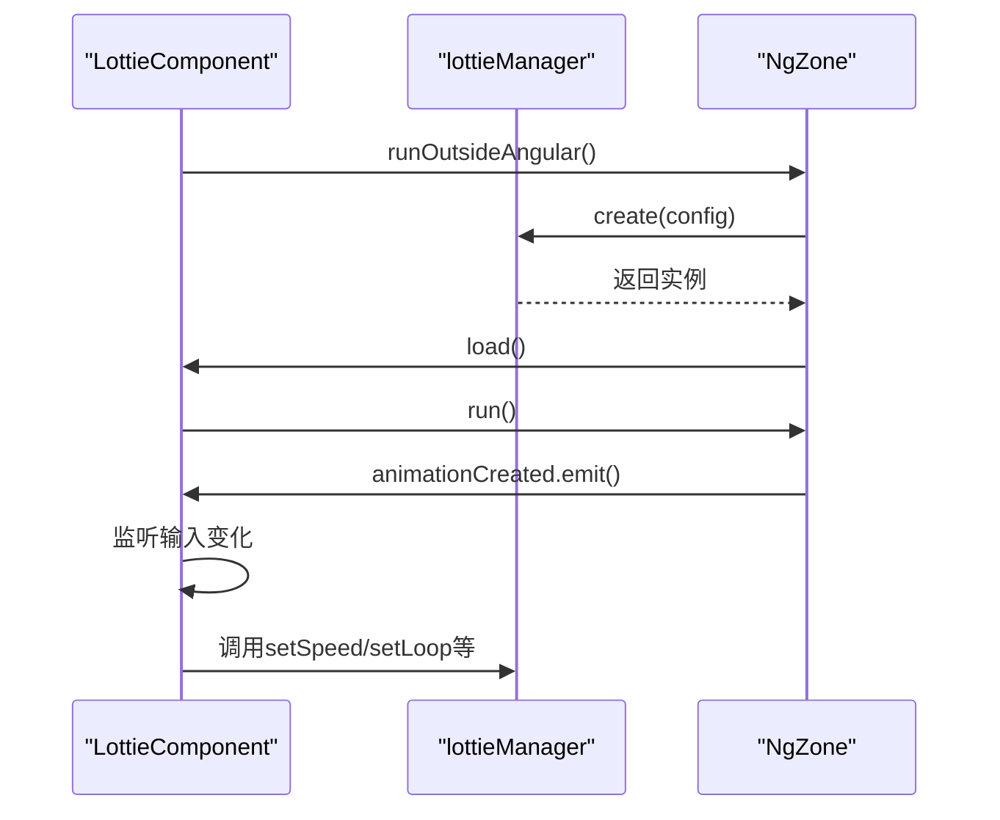
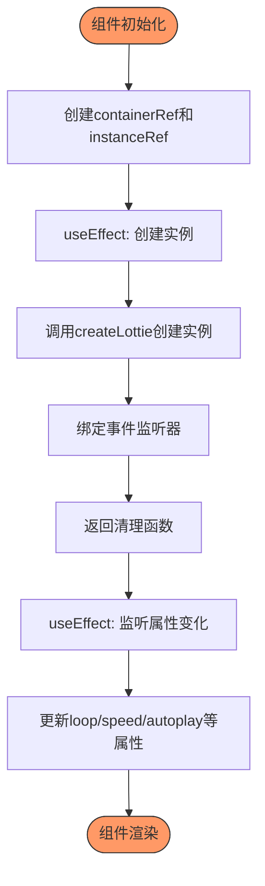
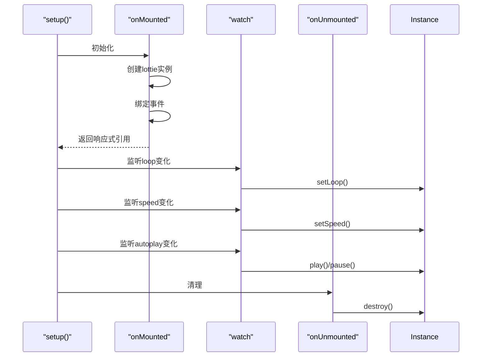
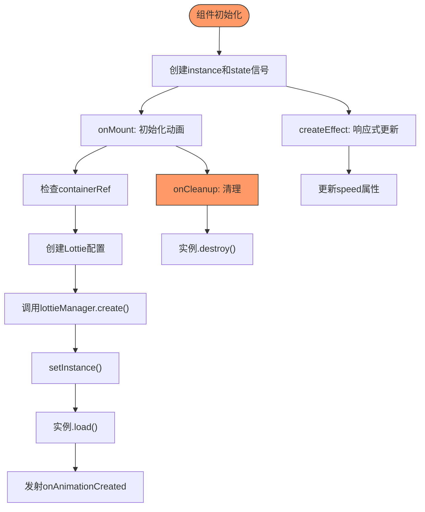
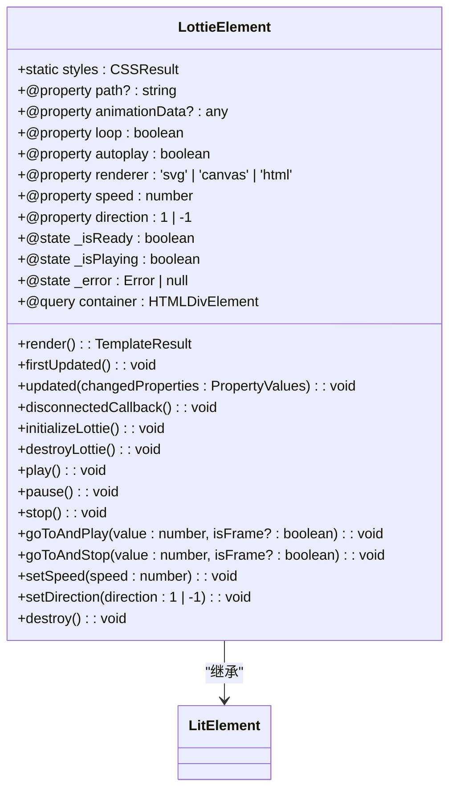
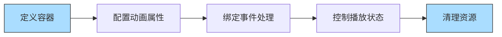
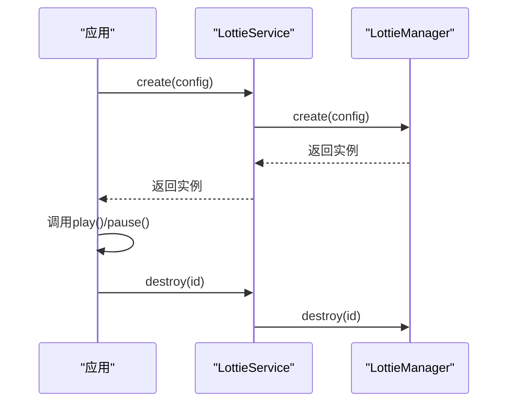

# 框架集成

<cite>
**本文档中引用的文件**  
- [lottie.component.ts](file://packages/angular/src/lottie.component.ts)
- [Lottie.tsx](file://packages/react/src/components/Lottie.tsx)
- [Lottie.vue](file://packages/vue/src/components/Lottie.vue)
- [Lottie.tsx](file://packages/solid/src/Lottie.tsx)
- [lottie-element.ts](file://packages/lit/src/lottie-element.ts)
- [LottiePlayer.tsx](file://packages/preact/src/LottiePlayer.tsx)
- [index.ts](file://packages/react/src/index.ts)
- [index.ts](file://packages/vue/src/index.ts)
- [index.ts](file://packages/solid/src/index.ts)
- [index.ts](file://packages/lit/src/index.ts)
- [index.ts](file://packages/angular/src/index.ts)
- [types.ts](file://packages/react/src/types.ts)
- [types.ts](file://packages/vue/src/types.ts)
- [useLottie.ts](file://packages/solid/src/useLottie.ts)
- [lottie.service.ts](file://packages/angular/src/lottie.service.ts)
- [index.ts](file://packages/core/src/types/index.ts)
</cite>

## 目录
1. [简介](#简介)
2. [架构概览](#架构概览)
3. [核心组件分析](#核心组件分析)
4. [框架适配器实现](#框架适配器实现)
5. [域模型与接口](#域模型与接口)
6. [配置选项与参数](#配置选项与参数)
7. [使用模式与示例](#使用模式与示例)
8. [常见问题与解决方案](#常见问题与解决方案)
9. [结论](#结论)

## 简介
本节详细介绍了Lottie动画库在多个前端框架中的集成实现。该库为Angular、React、Vue、Solid、Lit和Preact等主流框架提供了原生支持，通过统一的核心引擎`@ldesign/lottie-core`实现跨框架的一致性体验。每个框架适配器都遵循该框架的最佳实践，提供声明式API和响应式更新机制，同时保持核心功能的一致性。

## 架构概览

```mermaid
graph TD
subgraph "框架适配层"
A[Angular]
B[React]
C[Vue]
D[Solid]
E[Lit]
F[Preact]
end
subgraph "核心引擎"
G[@ldesign/lottie-core]
H[LottieManager]
I[ILottieInstance]
end
A --> G
B --> G
C --> G
D --> G
E --> G
F --> G
G --> H
G --> I
style G fill:#f9f,stroke:#333
style H fill:#bbf,stroke:#333
style I fill:#bbf,stroke:#333
```

**图示来源**  
- [lottie.component.ts](file://packages/angular/src/lottie.component.ts)
- [Lottie.tsx](file://packages/react/src/components/Lottie.tsx)
- [Lottie.vue](file://packages/vue/src/components/Lottie.vue)
- [Lottie.tsx](file://packages/solid/src/Lottie.tsx)
- [lottie-element.ts](file://packages/lit/src/lottie-element.ts)
- [LottiePlayer.tsx](file://packages/preact/src/LottiePlayer.tsx)

## 核心组件分析

### 统一的核心接口
所有框架适配器都基于`@ldesign/lottie-core`包中的统一接口进行构建。核心接口`ILottieInstance`定义了动画实例的标准行为，包括播放控制、状态管理和事件处理。

```mermaid
classDiagram
class ILottieInstance {
+readonly id : string
+readonly name : string
+readonly state : AnimationState
+readonly animation : AnimationItem | null
+readonly config : LottieConfig
+readonly container : HTMLElement | null
+load() : Promise~void~
+play() : void
+pause() : void
+stop() : void
+destroy() : void
+setSpeed(speed : number) : void
+setDirection(direction : 1 | -1) : void
+setLoop(loop : boolean | number) : void
+goToAndStop(frame : number, isFrame? : boolean) : void
+goToAndPlay(frame : number, isFrame? : boolean) : void
+playSegments(segments : [number, number] | [number, number][], forceFlag? : boolean) : void
+reset() : void
+resize() : void
+getMetrics() : PerformanceMetrics | null
+on~K~(event : K, callback : LottieEvents[K]) : void
+off~K~(event : K, callback? : LottieEvents[K]) : void
}
class LottieConfig {
+container? : HTMLElement | string
+renderer? : LottieRendererType
+loop? : boolean | number
+autoplay? : boolean
+animationData? : any
+path? : string
+name? : string
+speed? : number
+quality? : AnimationQuality
+loadStrategy? : LoadStrategy
+playMode? : PlayMode
+initialSegment? : [number, number]
+events? : LottieEvents
+advanced? : AdvancedOptions
+style? : Partial~CSSStyleDeclaration~
}
class LottieEvents {
+config_ready?() : void
+data_ready?() : void
+data_failed?(error : Error) : void
+DOMLoaded?() : void
+destroy?() : void
+enterFrame?(event : { currentTime : number; totalTime : number; direction : number }) : void
+segmentStart?() : void
+complete?() : void
+loopComplete?() : void
+stateChange?(state : AnimationState) : void
+performanceWarning?(metrics : PerformanceMetrics) : void
}
ILottieInstance --> LottieConfig : "使用"
ILottieInstance --> LottieEvents : "触发"
```

**图示来源**  
- [index.ts](file://packages/core/src/types/index.ts)

## 框架适配器实现

### Angular 适配器
Angular适配器实现了标准的Angular组件模式，使用`@Component`装饰器定义组件，通过`@Input()`和`@Output()`处理属性绑定和事件发射。



**图示来源**  
- [lottie.component.ts](file://packages/angular/src/lottie.component.ts)
- [lottie.service.ts](file://packages/angular/src/lottie.service.ts)

### React 适配器
React适配器使用函数组件和Hooks模式，通过`forwardRef`暴露实例方法，使用`useEffect`处理生命周期和属性更新。



**图示来源**  
- [Lottie.tsx](file://packages/react/src/components/Lottie.tsx)
- [useLottie.ts](file://packages/react/src/hooks/useLottie.ts)

### Vue 适配器
Vue适配器采用Composition API模式，使用`<script setup>`语法，通过`ref`和`watch`实现响应式更新，`defineExpose`暴露公共API。



**图示来源**  
- [Lottie.vue](file://packages/vue/src/components/Lottie.vue)
- [useLottie.ts](file://packages/vue/src/composables/useLottie.ts)

### Solid 适配器
Solid适配器利用Solid.js的响应式系统，使用`createSignal`和`createEffect`实现状态管理和副作用处理。



**图示来源**  
- [Lottie.tsx](file://packages/solid/src/Lottie.tsx)
- [useLottie.ts](file://packages/solid/src/useLottie.ts)

### Lit 适配器
Lit适配器作为Web Component实现，使用LitElement基类，通过`@property`装饰器定义可观察属性，`updated`方法处理属性变化。



**图示来源**  
- [lottie-element.ts](file://packages/lit/src/lottie-element.ts)
- [lottie-player.ts](file://packages/lit/src/lottie-player.ts)

## 域模型与接口

### 核心类型定义
库定义了统一的核心类型，确保跨框架的一致性：

```mermaid
erDiagram
LottieConfig {
string container PK
string renderer
boolean loop
boolean autoplay
any animationData
string path
string name
number speed
string quality
string loadStrategy
string playMode
array initialSegment
object events
object advanced
object style
}
LottieEvents {
function config_ready
function data_ready
function data_failed
function DOMLoaded
function destroy
function enterFrame
function segmentStart
function complete
function loopComplete
function stateChange
function performanceWarning
}
ILottieInstance {
string id PK
string name
string state
object animation
object config
object container
number currentFrame
number totalFrames
}
LottieConfig ||--o{ ILottieInstance : "创建"
LottieEvents }|-- ILottieInstance : "触发"
```

**图示来源**  
- [index.ts](file://packages/core/src/types/index.ts)

## 配置选项与参数

### 共享配置选项
所有框架适配器支持相同的配置选项，通过框架特定的属性传递：

| 配置项 | 类型 | 默认值 | 描述 |
|--------|------|--------|------|
| `path` | string | undefined | 动画JSON文件路径 |
| `animationData` | any | undefined | 内联动画数据 |
| `renderer` | 'svg' \| 'canvas' \| 'html' | 'svg' | 渲染器类型 |
| `loop` | boolean \| number | true | 是否循环播放 |
| `autoplay` | boolean | true | 是否自动播放 |
| `speed` | number | 1 | 播放速度 |
| `quality` | 'low' \| 'medium' \| 'high' | 'high' | 渲染质量 |
| `loadStrategy` | 'eager' \| 'lazy' \| 'intersection' | 'eager' | 加载策略 |

**表来源**  
- [index.ts](file://packages/core/src/types/index.ts)

### 框架特定扩展
各框架提供了特定的扩展属性：

| 框架 | 扩展属性 | 类型 | 描述 |
|------|---------|------|------|
| Angular | `animationCreated` | EventEmitter | 动画创建事件 |
| React | `onReady` | Function | 准备就绪回调 |
| Vue | `className` | string | CSS类名 |
| Solid | `onStateChange` | Function | 状态变化回调 |
| Lit | `background` | string | 背景颜色 |

**表来源**  
- [lottie.component.ts](file://packages/angular/src/lottie.component.ts)
- [Lottie.tsx](file://packages/react/src/components/Lottie.tsx)
- [Lottie.vue](file://packages/vue/src/components/Lottie.vue)
- [Lottie.tsx](file://packages/solid/src/Lottie.tsx)
- [lottie-element.ts](file://packages/lit/src/lottie-element.ts)

## 使用模式与示例

### 声明式使用模式
各框架提供相似的声明式API：



**图示来源**  
- [lottie.component.ts](file://packages/angular/src/lottie.component.ts)
- [Lottie.tsx](file://packages/react/src/components/Lottie.tsx)
- [Lottie.vue](file://packages/vue/src/components/Lottie.vue)

### 编程式控制模式
通过服务或Hook实现编程式控制：



**图示来源**  
- [lottie.service.ts](file://packages/angular/src/lottie.service.ts)
- [useLottie.ts](file://packages/solid/src/useLottie.ts)

## 常见问题与解决方案

### 性能问题
当页面包含大量Lottie动画时，可能会出现性能问题：

**问题**：动画卡顿、帧率下降
**解决方案**：
1. 使用`lazy`或`intersection`加载策略
2. 降低`quality`设置
3. 限制同时播放的动画数量
4. 使用`performanceMonitor`监控性能指标

### 内存泄漏
不当的资源清理可能导致内存泄漏：

**问题**：组件销毁后动画实例仍存在
**解决方案**：
1. 确保在组件销毁时调用`destroy()`方法
2. 使用框架提供的生命周期钩子进行清理
3. 检查事件监听器是否正确移除

### 跨框架兼容性
不同框架的响应式系统差异可能导致问题：

**问题**：属性更新不及时
**解决方案**：
1. 使用框架特定的响应式更新机制
2. 在Angular中使用`NgZone`
3. 在React中使用`useEffect`
4. 在Vue中使用`watch`

## 结论
Lottie动画库的框架集成设计体现了高度的模块化和一致性。通过将核心功能与框架适配器分离，实现了跨框架的代码复用和维护便利性。每个适配器都遵循相应框架的最佳实践，提供了自然的API体验。统一的核心接口确保了功能的一致性，而框架特定的扩展则满足了各框架的独特需求。这种设计模式为开发人员提供了灵活、高效且易于使用的动画解决方案。