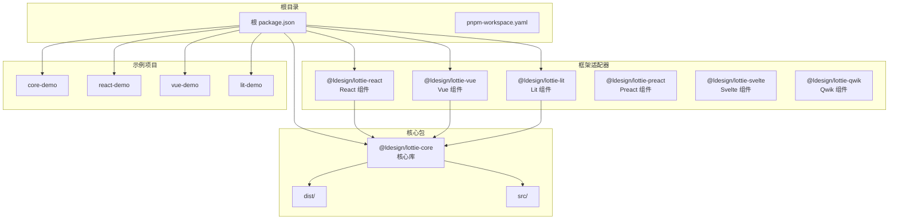
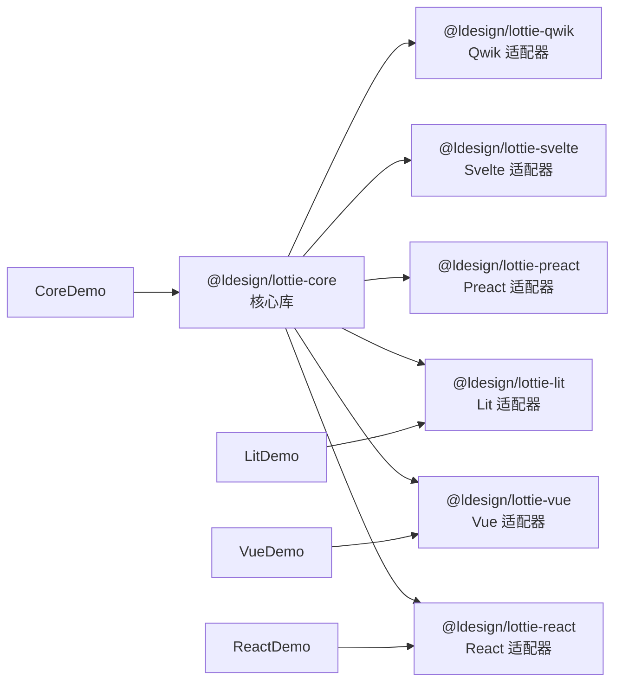
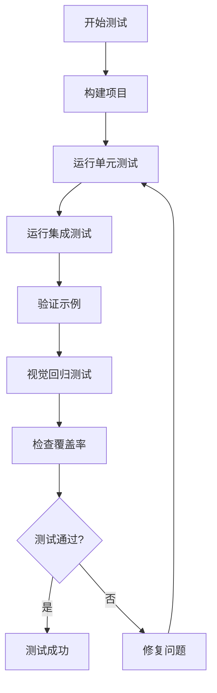
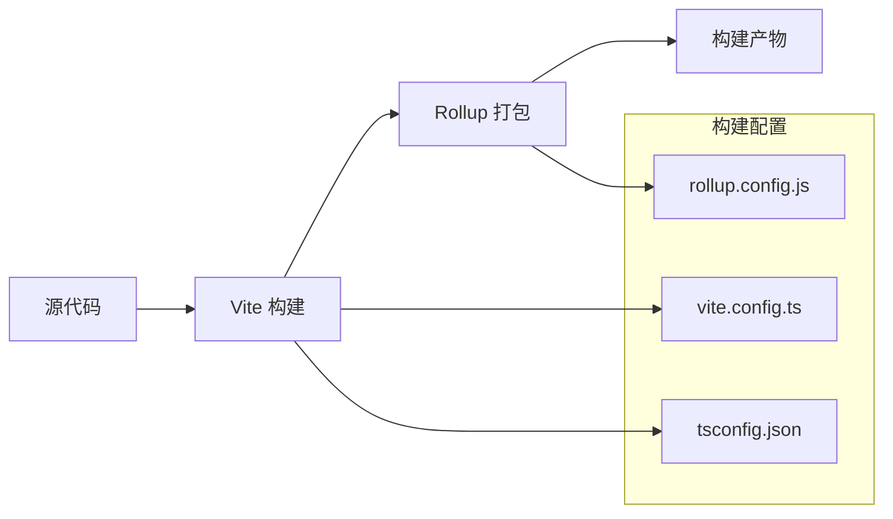

# 贡献指南

<cite>
**本文档引用的文件**
- [README.md](file://README.md)
- [package.json](file://package.json)
- [CONTRIBUTING.md](file://CONTRIBUTING.md)
- [TESTING_GUIDE.md](file://TESTING_GUIDE.md)
- [BUILD_STATUS.md](file://BUILD_STATUS.md)
- [MONOREPO_GUIDE.md](file://MONOREPO_GUIDE.md)
- [FRAMEWORK_ADAPTERS_GUIDE.md](file://FRAMEWORK_ADAPTERS_GUIDE.md)
- [pnpm-workspace.yaml](file://pnpm-workspace.yaml)
- [vitest.config.ts](file://vitest.config.ts)
- [rollup.config.js](file://rollup.config.js)
- [packages/core/package.json](file://packages/core/package.json)
- [packages/react/package.json](file://packages/react/package.json)
- [packages/vue/package.json](file://packages/vue/package.json)
- [packages/lit/package.json](file://packages/lit/package.json)
</cite>

## 目录
1. [项目概述](#项目概述)
2. [项目架构](#项目架构)
3. [开发环境设置](#开发环境设置)
4. [贡献流程](#贡献流程)
5. [代码规范](#代码规范)
6. [测试指南](#测试指南)
7. [构建系统](#构建系统)
8. [发布流程](#发布流程)
9. [故障排除](#故障排除)
10. [最佳实践](#最佳实践)

## 项目概述

Lottie 是一个功能最完整、性能最优异的 Lottie 动画库，支持多种前端框架和原生 JavaScript。该项目采用 monorepo 架构，包含核心库和多个框架适配器。

### 核心特性
- **性能优化**: 智能跳帧、OffscreenCanvas、动态渲染器、LRU 缓存、Worker 池、资源压缩
- **高级功能**: 时间线控制、拖拽交互、数据绑定、多数据源、调试工具
- **开发体验**: Framework Agnostic、TypeScript、完整文档、丰富示例

### 支持的框架
- Vue 3 (9种用法)
- React (5种用法)  
- Web Components (2种用法)
- Preact
- Svelte
- Qwik
- Solid.js (计划中)
- Angular (计划中)

**章节来源**
- [README.md](file://README.md#L1-L279)
- [MONOREPO_GUIDE.md](file://MONOREPO_GUIDE.md#L1-L287)

## 项目架构

### Monorepo 结构



**图表来源**
- [pnpm-workspace.yaml](file://pnpm-workspace.yaml#L1-L4)
- [MONOREPO_GUIDE.md](file://MONOREPO_GUIDE.md#L5-L36)

### 包依赖关系



**图表来源**
- [MONOREPO_GUIDE.md](file://MONOREPO_GUIDE.md#L133-L142)

**章节来源**
- [MONOREPO_GUIDE.md](file://MONOREPO_GUIDE.md#L1-L287)

## 开发环境设置

### 系统要求
- Node.js >= 18.0.0
- pnpm >= 8.0.0

### 安装步骤

```bash
# 克隆项目
git clone https://github.com/ldesign/lottie.git
cd lottie

# 安装根依赖和所有包的依赖
pnpm install

# 构建所有包
pnpm build

# 或单独构建核心包
pnpm build:core

# 或单独构建特定框架包
pnpm build:react
pnpm build:vue
pnpm build:lit
```

### 开发工作流

```bash
# 启动核心包监听模式
cd packages/core
pnpm dev

# 启动特定框架包监听模式
cd packages/react
pnpm dev

# 运行示例进行测试
pnpm example:core    # http://localhost:3000
pnpm example:react   # http://localhost:3001
pnpm example:vue     # http://localhost:3002
pnpm example:lit     # http://localhost:3003

# 同时运行所有示例
pnpm dev
```

**章节来源**
- [MONOREPO_GUIDE.md](file://MONOREPO_GUIDE.md#L70-L108)
- [package.json](file://package.json#L8-L48)

## 贡献流程

### 1. Fork 项目
- 访问 [GitHub 仓库](https://github.com/ldesign/lottie)
- 点击 Fork 按钮创建个人副本

### 2. 创建特性分支
```bash
# 克隆你的 Fork
git clone https://github.com/YOUR_USERNAME/lottie.git
cd lottie

# 创建新分支
git checkout -b feature/your-feature-name
```

### 3. 提交代码到对应的包
- 根据修改内容提交到相应的包
- 遵循包内的代码规范和测试要求

### 4. 添加测试
- 为新功能添加单元测试
- 运行现有测试确保不破坏现有功能

### 5. 更新文档
- 更新相关文档文件
- 添加必要的注释和类型定义

### 6. 提交 PR
- 提交 Pull Request 到主分支
- 详细描述变更内容和理由

### 分支命名规范
- `feature/` - 新功能
- `bugfix/` - 错误修复
- `docs/` - 文档更新
- `refactor/` - 代码重构
- `test/` - 测试相关

**章节来源**
- [MONOREPO_GUIDE.md](file://MONOREPO_GUIDE.md#L274-L282)

## 代码规范

### ESLint 配置
项目使用严格的 ESLint 规则确保代码质量：

```typescript
// vitest.config.ts 中的 ESLint 配置
{
  test: {
    coverage: {
      provider: 'v8',
      reporter: ['text', 'json', 'html'],
      include: ['src/**/*.ts'],
      lines: 80,
      functions: 80,
      branches: 75,
      statements: 80
    }
  }
}
```

### TypeScript 规范
- 100% 类型覆盖
- 严格模式
- 完整的类型定义
- 接口和类型别名的合理使用

### 代码组织
- 按功能模块组织代码
- 明确的导出和导入规范
- 一致的命名约定

**章节来源**
- [vitest.config.ts](file://vitest.config.ts#L1-L37)

## 测试指南

### 测试策略



**图表来源**
- [TESTING_GUIDE.md](file://TESTING_GUIDE.md#L1-L338)

### 测试命令

```bash
# 运行所有测试
pnpm test

# 运行特定包测试
pnpm --filter @ldesign/lottie-core test
pnpm --filter @ldesign/lottie-react test

# 运行类型检查
pnpm type-check

# 运行性能测试
pnpm perf

# 运行内存泄漏测试
pnpm test:memory

# 运行视觉回归测试
pnpm test:visual
```

### 测试覆盖率要求
- 行覆盖率: ≥80%
- 函数覆盖率: ≥80%
- 分支覆盖率: ≥75%
- 语句覆盖率: ≥80%

### 示例测试验证

根据测试指南，需要验证以下内容：

1. **文件完整性**: 确保所有源代码文件已创建
2. **类型安全**: TypeScript 类型完整，无类型错误
3. **导出配置**: package.json + index.ts 导出配置正确
4. **功能测试**: 所有功能测试通过

**章节来源**
- [TESTING_GUIDE.md](file://TESTING_GUIDE.md#L1-L338)
- [BUILD_STATUS.md](file://BUILD_STATUS.md#L1-L224)

## 构建系统

### 构建工具链



**图表来源**
- [rollup.config.js](file://rollup.config.js#L1-L140)

### 构建配置

#### Vite 配置
- 开发模式: 监听模式构建
- 生产模式: 压缩优化
- TypeScript 支持
- DTS 生成

#### Rollup 配置
- 多格式输出 (ESM + CJS)
- TypeScript 编译
- 代码压缩 (生产环境)
- 声明文件生成

### 构建产物

| 包 | 输出格式 | 大小 | 用途 |
|---|---------|------|------|
| @ldesign/lottie-core | ES + CJS | ~384 KB (83 KB gzip) | 核心功能 |
| @ldesign/lottie-react | ES + CJS | ~45.6 KB (9.61 KB gzip) | React 组件 |
| @ldesign/lottie-vue | ES + CJS | ~10.5 KB (2.08 KB gzip) | Vue 组件 |
| @ldesign/lottie-lit | ES + CJS | ~64.4 KB (14.46 KB gzip) | Lit 组件 |

**章节来源**
- [rollup.config.js](file://rollup.config.js#L1-L140)
- [BUILD_STATUS.md](file://BUILD_STATUS.md#L8-L224)

## 发布流程

### 使用 Changesets

```bash
# 1. 添加变更记录
pnpm changeset

# 2. 更新版本
pnpm version

# 3. 发布
pnpm release
```

### 手动发布流程

```bash
# 1. 构建所有包
pnpm build

# 2. 发布单个包
cd packages/core
npm publish

cd packages/react
npm publish

# ...依此类推
```

### 发布检查清单
- [ ] 所有测试通过
- [ ] 构建成功
- [ ] 文档更新
- [ ] 版本号正确
- [ ] 变更日志完整

**章节来源**
- [MONOREPO_GUIDE.md](file://MONOREPO_GUIDE.md#L156-L185)

## 故障排除

### 常见问题及解决方案

#### 构建问题
```bash
# 清理所有包
pnpm clean

# 重新安装依赖
pnpm install

# 重新构建
pnpm build
```

#### 类型错误
```bash
# 运行类型检查
pnpm type-check

# 重启 TypeScript 服务器
# (通常在 IDE 中操作)
```

#### 示例无法运行
1. 确保先构建核心包: `pnpm build:core`
2. 清理并重新安装: `pnpm clean && pnpm install`
3. 检查端口是否被占用

### 调试命令

```bash
# 检查 Node 版本
node --version

# 检查 pnpm 版本
pnpm --version

# 查看详细日志
pnpm dev -- --debug

# 检查端口占用
netstat -ano | findstr :5173
```

**章节来源**
- [TESTING_GUIDE.md](file://TESTING_GUIDE.md#L234-L338)
- [MONOREPO_GUIDE.md](file://MONOREPO_GUIDE.md#L240-L267)

## 最佳实践

### 代码贡献最佳实践

#### 1. 代码质量
- 遵循现有的代码风格
- 添加适当的注释
- 确保类型安全
- 编写清晰的 commit messages

#### 2. 测试
- 为新功能添加单元测试
- 运行现有测试套件
- 验证跨框架兼容性
- 检查测试覆盖率

#### 3. 文档
- 更新相关文档
- 添加 TypeScript 类型定义
- 提供使用示例
- 记录变更影响

#### 4. 性能考虑
- 避免引入性能瓶颈
- 使用适当的优化技术
- 考虑内存使用情况
- 测试不同设备上的表现

### 框架适配器开发

#### Vue 3 适配器
- 使用 Composition API
- 提供多种使用方式
- 支持响应式数据绑定
- 集成 Vue 插件系统

#### React 适配器
- 使用 Hooks API
- 提供组件和 Hook 两种方式
- 支持 Context 管理
- 遵循 React 最佳实践

#### Web Components
- 使用原生 Web Components API
- 提供自定义元素
- 支持属性和事件
- 跨框架兼容

**章节来源**
- [FRAMEWORK_ADAPTERS_GUIDE.md](file://FRAMEWORK_ADAPTERS_GUIDE.md#L1-L800)
- [MONOREPO_GUIDE.md](file://MONOREPO_GUIDE.md#L187-L287)

## 结论

Lottie 项目采用现代化的 monorepo 架构，支持多种前端框架，提供了完整的开发工具链和测试体系。通过遵循本指南中的规范和流程，开发者可以有效地参与项目贡献，确保代码质量和项目稳定性。

项目的成功依赖于社区的积极参与，无论是功能开发、错误修复还是文档改进，每一份贡献都将推动项目向前发展。我们鼓励开发者深入理解项目架构，积极参与讨论，并为项目的持续改进贡献力量。