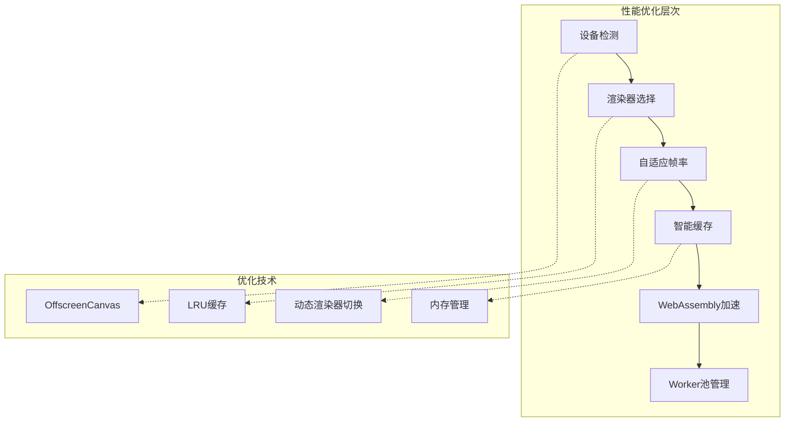
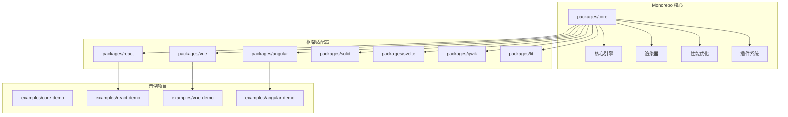
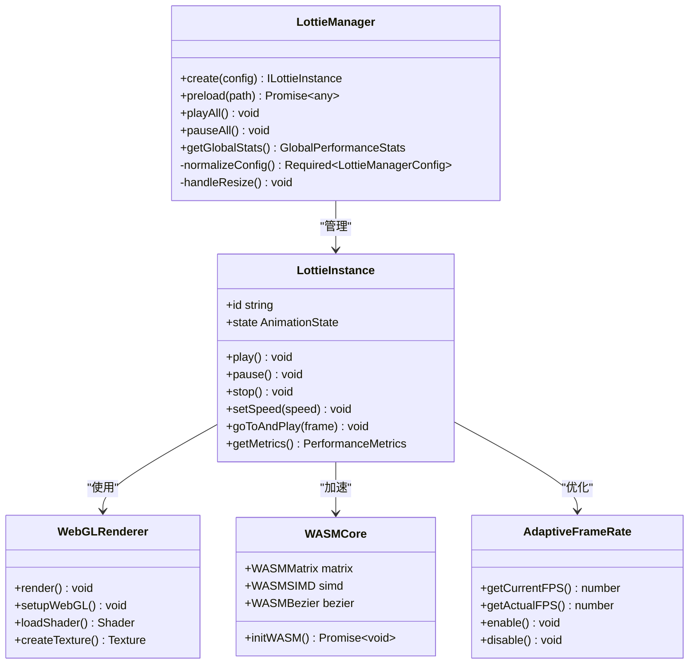
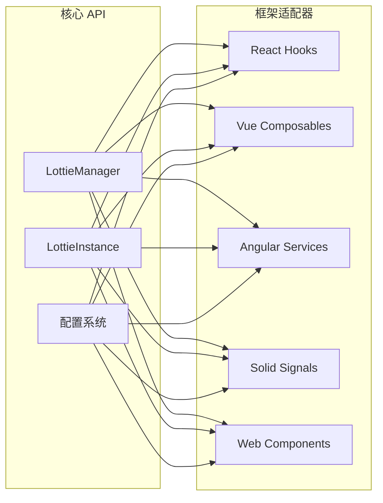
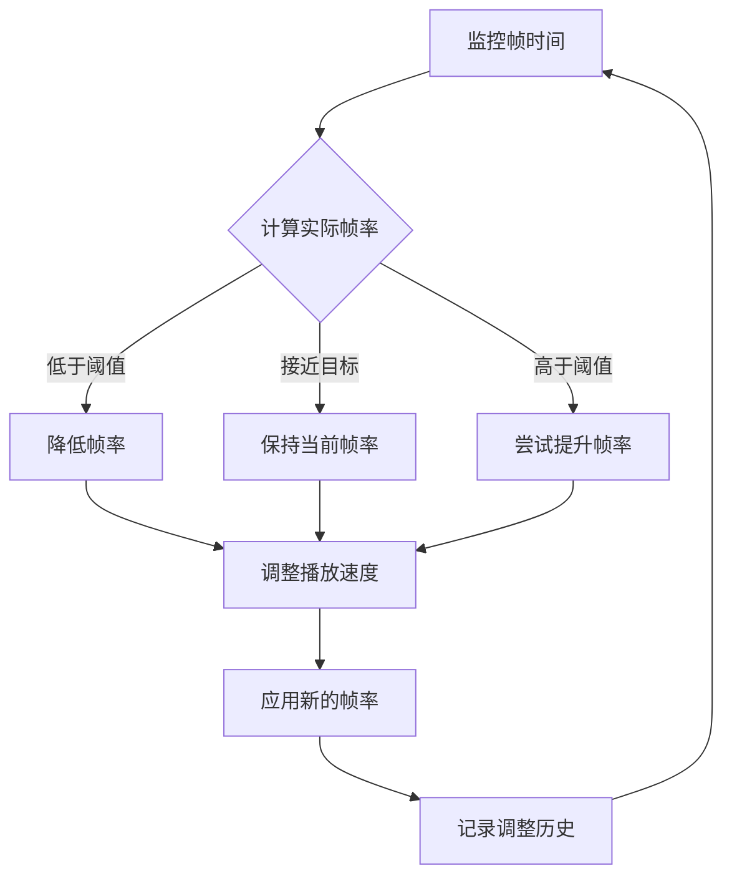
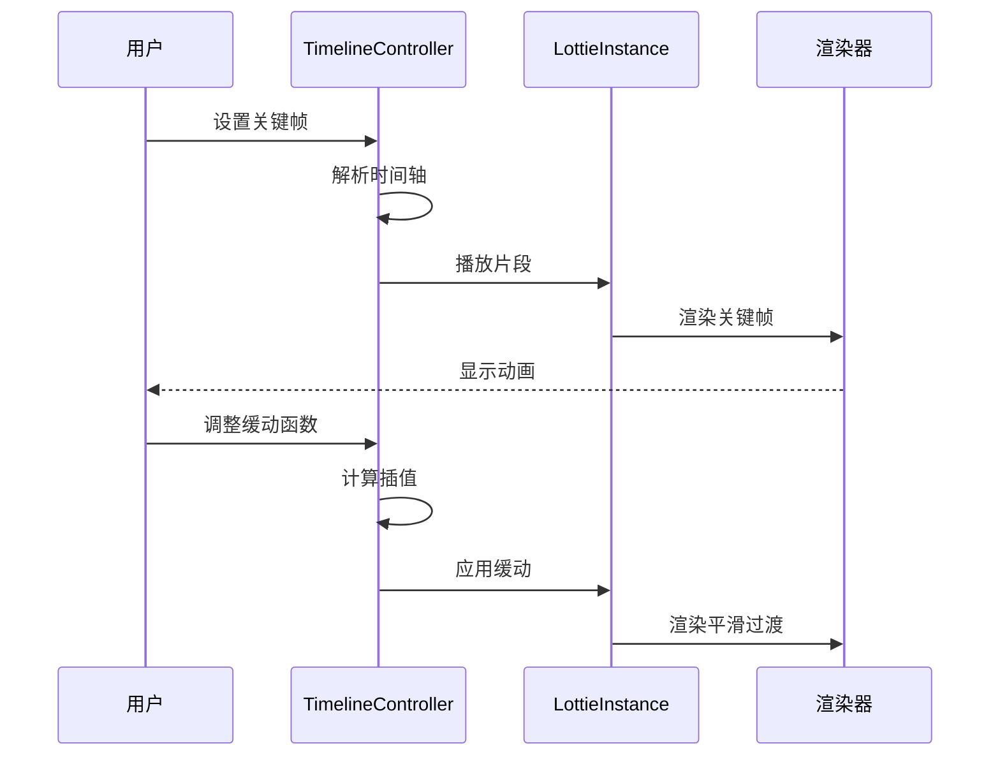
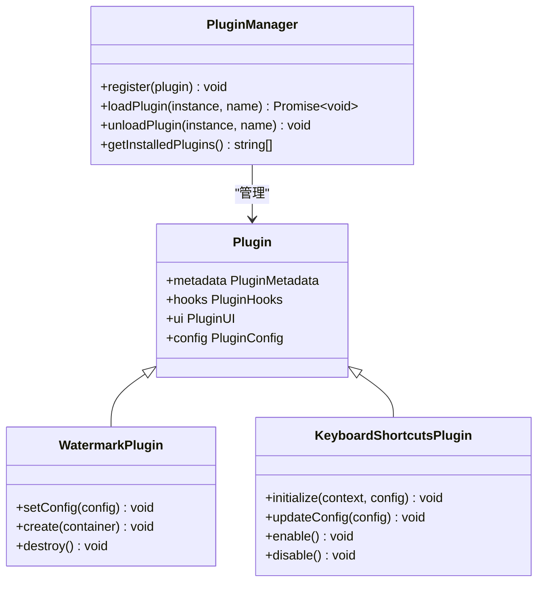

# 项目概述

<cite>
**本文档中引用的文件**
- [README.md](file://README.md)
- [package.json](file://package.json)
- [packages/core/src/index.ts](file://packages/core/src/index.ts)
- [packages/core/README.md](file://packages/core/README.md)
- [USAGE_GUIDE.md](file://USAGE_GUIDE.md)
- [packages/core/src/core/LottieManager.ts](file://packages/core/src/core/LottieManager.ts)
- [packages/react/src/index.ts](file://packages/react/src/index.ts)
- [packages/vue/src/index.ts](file://packages/vue/src/index.ts)
- [packages/angular/src/index.ts](file://packages/angular/src/index.ts)
- [packages/solid/src/index.ts](file://packages/solid/src/index.ts)
- [packages/core/src/types/index.ts](file://packages/core/src/types/index.ts)
- [packages/core/src/core/WebGLRenderer.ts](file://packages/core/src/core/WebGLRenderer.ts)
- [packages/core/src/core/WASMCore.ts](file://packages/core/src/core/WASMCore.ts)
- [packages/core/src/core/AdaptiveFrameRate.ts](file://packages/core/src/core/AdaptiveFrameRate.ts)
- [examples/react-demo/src/App.tsx](file://examples/react-demo/src/App.tsx)
- [examples/vue-demo/src/App.vue](file://examples/vue-demo/src/App.vue)
- [examples/core-demo/src/main.ts](file://examples/core-demo/src/main.ts)
- [packages/core/src/plugins/KeyboardShortcutsPlugin.ts](file://packages/core/src/plugins/KeyboardShortcutsPlugin.ts)
- [packages/core/src/plugins/WatermarkPlugin.ts](file://packages/core/src/plugins/WatermarkPlugin.ts)
</cite>

## 目录
1. [项目简介](#项目简介)
2. [核心特性](#核心特性)
3. [架构设计](#架构设计)
4. [框架适配器](#框架适配器)
5. [性能优化](#性能优化)
6. [高级功能](#高级功能)
7. [插件系统](#插件系统)
8. [使用示例](#使用示例)
9. [配置选项](#配置选项)
10. [最佳实践](#最佳实践)

## 项目简介

@ldesign/lottie 是一个功能最完整、性能最优异的 Lottie 动画库，专为现代 Web 应用程序设计。该项目是一个完整的 monorepo 架构，包含了核心引擎、多个框架适配器以及丰富的示例代码。

### 项目特点

- **全框架兼容**：支持 Vue 3、React、Angular、Solid、Svelte、Qwik 和 Lit 等主流前端框架
- **高性能渲染**：支持 SVG、Canvas、WebGL 多种渲染器，具备智能跳帧和自适应性能优化
- **AI 智能优化**：内置 AI 分析和自动优化功能，根据设备性能动态调整配置
- **企业级功能**：提供完整的生命周期管理、缓存机制、性能监控和调试工具

**章节来源**
- [README.md](file://README.md#L1-L279)
- [package.json](file://package.json#L1-L83)

## 核心特性

### 🚀 性能优化

项目实现了多层次的性能优化策略：



**图表来源**
- [packages/core/src/core/LottieManager.ts](file://packages/core/src/core/LottieManager.ts#L69-L85)
- [packages/core/src/core/AdaptiveFrameRate.ts](file://packages/core/src/core/AdaptiveFrameRate.ts#L49-L54)

### 🎨 高级功能

- **时间线控制**：多轨道、关键帧编辑、10+ 缓动函数
- **拖拽交互**：边界约束、网格吸附、惯性效果
- **数据绑定**：响应式更新、30+ 转换管道、10+ 验证器
- **多数据源**：API/WebSocket/SSE/轮询实时数据
- **调试工具**：可视化面板、性能分析、火焰图

### 🛠️ 开发体验

- **TypeScript 完整支持**：100% 类型覆盖，完整智能提示
- **框架无关**：支持原生 JavaScript 和所有主流框架
- **丰富示例**：实战案例、性能对比、最佳实践

**章节来源**
- [README.md](file://README.md#L11-L33)

## 架构设计

### Monorepo 结构



**图表来源**
- [package.json](file://package.json#L1-L83)
- [packages/core/src/index.ts](file://packages/core/src/index.ts#L1-L180)

### 核心架构组件



**图表来源**
- [packages/core/src/core/LottieManager.ts](file://packages/core/src/core/LottieManager.ts#L16-L504)
- [packages/core/src/core/WebGLRenderer.ts](file://packages/core/src/core/WebGLRenderer.ts#L67-L200)
- [packages/core/src/core/WASMCore.ts](file://packages/core/src/core/WASMCore.ts#L1-L200)

**章节来源**
- [packages/core/src/index.ts](file://packages/core/src/index.ts#L1-L180)
- [packages/core/README.md](file://packages/core/README.md#L1-L43)

## 框架适配器

### 适配器架构

每个框架适配器都提供了统一的 API 接口，确保开发者在不同框架间切换时具有相同的开发体验：



**图表来源**
- [packages/react/src/index.ts](file://packages/react/src/index.ts#L1-L8)
- [packages/vue/src/index.ts](file://packages/vue/src/index.ts#L1-L21)
- [packages/angular/src/index.ts](file://packages/angular/src/index.ts#L1-L27)
- [packages/solid/src/index.ts](file://packages/solid/src/index.ts#L1-L25)

### React 适配器

React 适配器提供了三种使用方式：
- **组件方式**：`<Lottie />` 和 `<LottiePlayer />`
- **Hook 方式**：`useLottie()` 和 `useLottieInteractive()`
- **上下文方式**：`LottieProvider` 和 `useLottieContext`

### Vue 适配器

Vue 适配器支持 Composition API 和指令语法：
- **Composable**：`useLottie()` 和 `useLottieInteractive()`
- **组件**：`<Lottie />` 组件
- **指令**：`v-lottie`、`v-lottie-hover`、`v-lottie-scroll`

**章节来源**
- [packages/react/src/index.ts](file://packages/react/src/index.ts#L1-L8)
- [packages/vue/src/index.ts](file://packages/vue/src/index.ts#L1-L21)
- [packages/angular/src/index.ts](file://packages/angular/src/index.ts#L1-L27)

## 性能优化

### 自适应帧率系统

项目实现了智能的自适应帧率控制系统，能够根据设备性能动态调整动画帧率：



**图表来源**
- [packages/core/src/core/AdaptiveFrameRate.ts](file://packages/core/src/core/AdaptiveFrameRate.ts#L49-L328)

### WebAssembly 加速

通过 WebAssembly 模块提供高性能的数学计算加速：

- **矩阵运算**：平移、旋转、缩放变换
- **贝塞尔曲线**：二次和三次贝塞尔曲线计算
- **SIMD 支持**：利用 SIMD 指令集加速计算
- **内存管理**：高效的内存分配和释放

### 缓存机制

实现了多层缓存策略：

1. **内存缓存**：LRU 算法管理的内存缓存
2. **持久化缓存**：IndexedDB 存储大型动画数据
3. **智能预加载**：基于用户行为的预测性加载

**章节来源**
- [packages/core/src/core/AdaptiveFrameRate.ts](file://packages/core/src/core/AdaptiveFrameRate.ts#L49-L328)
- [packages/core/src/core/WASMCore.ts](file://packages/core/src/core/WASMCore.ts#L1-L200)

## 高级功能

### 时间线控制器

提供精确的时间线控制功能：



**图表来源**
- [packages/core/src/types/index.ts](file://packages/core/src/types/index.ts#L1-L200)

### 交互控制器

支持多种交互方式：

- **鼠标交互**：点击、悬停、拖拽
- **触摸交互**：移动端手势识别
- **键盘控制**：快捷键操作
- **滚动触发**：视口检测和自动播放

### 数据绑定系统

提供强大的数据绑定能力：

- **响应式更新**：自动检测数据变化
- **转换管道**：30+ 内置转换器
- **验证器**：10+ 数据验证规则
- **实时同步**：WebSocket 和 SSE 支持

**章节来源**
- [packages/core/src/types/index.ts](file://packages/core/src/types/index.ts#L1-L200)

## 插件系统

### 插件架构



**图表来源**
- [packages/core/src/plugins/WatermarkPlugin.ts](file://packages/core/src/plugins/WatermarkPlugin.ts#L87-L178)
- [packages/core/src/plugins/KeyboardShortcutsPlugin.ts](file://packages/core/src/plugins/KeyboardShortcutsPlugin.ts#L1-L442)

### 内置插件

#### 水印插件 (WatermarkPlugin)
- **文本水印**：支持自定义文本和样式
- **图片水印**：支持 logo 和品牌标识
- **位置控制**：九宫格位置选择
- **透明度调节**：可调节水印透明度

#### 键盘快捷键插件 (KeyboardShortcutsPlugin)
- **播放控制**：播放/暂停、停止、循环切换
- **速度控制**：加速/减速、倍速播放
- **帧控制**：跳转到指定帧、首尾帧
- **音量控制**：静音切换
- **全屏控制**：全屏切换

### 自定义插件开发

开发者可以轻松创建自定义插件：

```typescript
// 插件示例结构
export const CustomPlugin = createPlugin({
  metadata: {
    name: 'custom-plugin',
    version: '1.0.0',
    description: 'Custom plugin description'
  },
  
  hooks: {
    onInstall(context: PluginContext): void {
      // 插件安装逻辑
    },
    
    afterLoad(context: PluginContext): void {
      // 动画加载后逻辑
    }
  }
})
```

**章节来源**
- [packages/core/src/plugins/WatermarkPlugin.ts](file://packages/core/src/plugins/WatermarkPlugin.ts#L87-L178)
- [packages/core/src/plugins/KeyboardShortcutsPlugin.ts](file://packages/core/src/plugins/KeyboardShortcutsPlugin.ts#L1-L442)

## 使用示例

### 基础使用

#### 原生 JavaScript
```typescript
import { createLottie } from '@ldesign/lottie'

const animation = createLottie({
  container: '#lottie',
  path: 'animation.json',
  loop: true,
  autoplay: true
})

animation.play()
```

#### React
```typescript
import { useLottie } from '@ldesign/lottie-react'

function App() {
  const { containerRef, play, pause } = useLottie({
    path: 'animation.json',
    loop: true
  })

  return (
    <div>
      <div ref={containerRef} />
      <button onClick={play}>播放</button>
      <button onClick={pause}>暂停</button>
    </div>
  )
}
```

#### Vue
```vue
<script setup>
import { useLottie } from '@ldesign/lottie-vue'

const { play, pause } = useLottie({
  path: 'animation.json',
  loop: true
})
</script>

<template>
  <div>
    <button @click="play">播放</button>
    <button @click="pause">暂停</button>
  </div>
</template>
```

### 高级用法

#### 性能监控
```typescript
const animation = createLottie({
  container: '#lottie',
  path: 'animation.json',
  advanced: {
    enablePerformanceMonitor: true,
    performanceMonitorInterval: 1000
  },
  events: {
    performanceWarning: (metrics) => {
      console.log('FPS:', metrics.fps)
      console.log('内存:', metrics.memory, 'MB')
    }
  }
})
```

#### 智能缓存
```typescript
import { lottieManager } from '@ldesign/lottie'

// 预加载动画
await lottieManager.preload('animation.json')

// 创建实例时自动使用缓存
const animation = createLottie({
  container: '#lottie',
  path: 'animation.json'
})
```

**章节来源**
- [examples/react-demo/src/App.tsx](file://examples/react-demo/src/App.tsx#L1-L196)
- [examples/vue-demo/src/App.vue](file://examples/vue-demo/src/App.vue#L1-L123)
- [examples/core-demo/src/main.ts](file://examples/core-demo/src/main.ts#L1-L390)

## 配置选项

### 核心配置

| 配置项 | 类型 | 默认值 | 描述 |
|--------|------|--------|------|
| `container` | `HTMLElement \| string` | - | 容器元素或选择器 |
| `path` | `string` | - | 动画文件路径 |
| `animationData` | `any` | - | 直接传入动画数据 |
| `renderer` | `'svg' \| 'canvas' \| 'html' \| 'webgl'` | 自动检测 | 渲染器类型 |
| `loop` | `boolean \| number` | `false` | 循环播放设置 |
| `autoplay` | `boolean` | `false` | 是否自动播放 |
| `speed` | `number` | `1` | 播放速度 |
| `quality` | `'low' \| 'medium' \| 'high' \| 'auto'` | `'auto'` | 动画质量 |

### 高级配置

| 配置项 | 类型 | 默认值 | 描述 |
|--------|------|--------|------|
| `enablePerformanceMonitor` | `boolean` | `false` | 启用性能监控 |
| `targetFPS` | `number` | `60` | 目标帧率 |
| `enableCache` | `boolean` | `true` | 启用缓存 |
| `useOffscreenCanvas` | `boolean` | `true` | 使用离屏画布 |
| `enableSmartFrameSkip` | `boolean` | `true` | 启用智能跳帧 |

### 事件配置

| 事件名 | 回调参数 | 描述 |
|--------|----------|------|
| `config_ready` | `() => void` | 配置完成事件 |
| `data_ready` | `() => void` | 数据加载完成事件 |
| `complete` | `() => void` | 动画完成事件 |
| `loopComplete` | `() => void` | 循环完成事件 |
| `performanceWarning` | `(metrics: PerformanceMetrics) => void` | 性能警告事件 |

**章节来源**
- [packages/core/src/types/index.ts](file://packages/core/src/types/index.ts#L1-L200)

## 最佳实践

### 性能优化建议

1. **选择合适的渲染器**
   - SVG：高质量，适合简单动画
   - Canvas：高性能，适合复杂动画
   - WebGL：GPU加速，适合大型动画

2. **合理使用缓存**
   ```typescript
   // 启用全局缓存
   const manager = LottieManager.getInstance({
     cache: {
       enabled: true,
       maxSize: 100, // MB
       ttl: 3600000 // 1小时
     }
   })
   ```

3. **智能预加载**
   ```typescript
   // 在空闲时间预加载
   lottieManager.preloadBatch([
     'animation1.json',
     'animation2.json',
     'animation3.json'
   ])
   ```

4. **监控性能**
   ```typescript
   const stats = lottieManager.getGlobalStats()
   console.log('总实例数:', stats.totalInstances)
   console.log('平均FPS:', stats.averageFps)
   console.log('缓存命中率:', stats.cacheHitRate)
   ```

### 开发建议

1. **使用 TypeScript**
   - 利用完整的类型系统
   - 获得智能提示和编译时检查
   - 提高代码质量和可维护性

2. **遵循命名规范**
   - 使用语义化的变量名
   - 合理组织组件结构
   - 添加适当的注释

3. **错误处理**
   ```typescript
   const animation = createLottie({
     container: '#lottie',
     path: 'animation.json',
     events: {
       data_failed: (error) => {
         console.error('动画加载失败:', error)
         // 显示错误提示
       }
     }
   })
   ```

### 生产环境部署

1. **资源优化**
   - 使用 CDN 加速
   - 启用 Gzip 压缩
   - 合理设置缓存策略

2. **监控和调试**
   - 启用性能监控
   - 收集用户反馈
   - 定期性能评估

3. **渐进增强**
   - 提供降级方案
   - 支持离线模式
   - 优化首屏加载

**章节来源**
- [USAGE_GUIDE.md](file://USAGE_GUIDE.md#L308-L346)

## 总结

@ldesign/lottie 是一个功能强大、性能优异的 Lottie 动画解决方案，通过其模块化的架构设计和丰富的功能特性，为开发者提供了完整的动画开发体验。无论是简单的静态动画还是复杂的交互式动画，都能在这个平台上找到合适的解决方案。

项目的核心优势包括：
- **全栈兼容**：支持所有主流前端框架
- **性能卓越**：多层次优化策略确保流畅体验
- **功能丰富**：从基础播放到高级交互应有尽有
- **易于使用**：简洁的 API 设计和完善的文档

通过合理的架构设计和持续的性能优化，@ldesign/lottie 为现代 Web 应用程序的动画需求提供了可靠的技术保障。