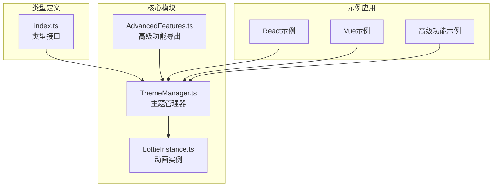
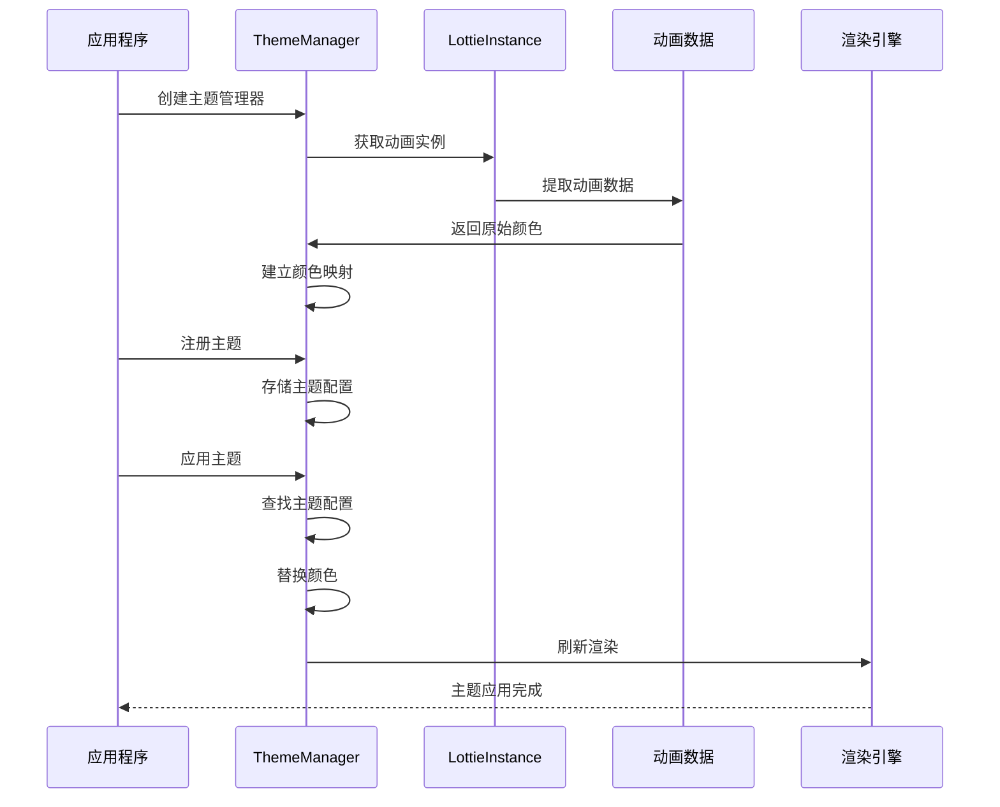
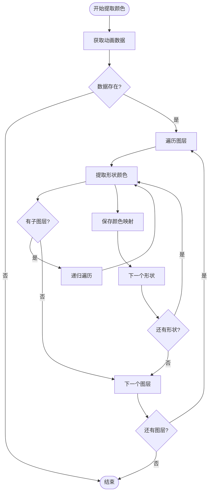
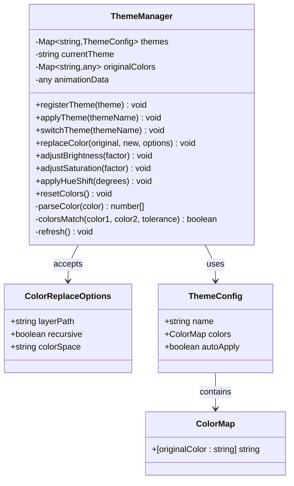
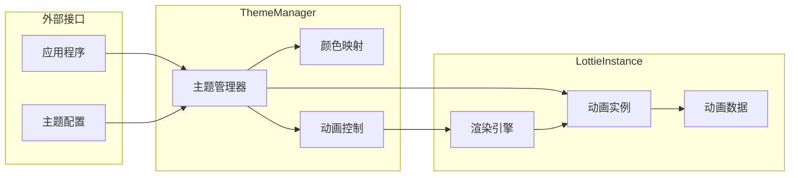
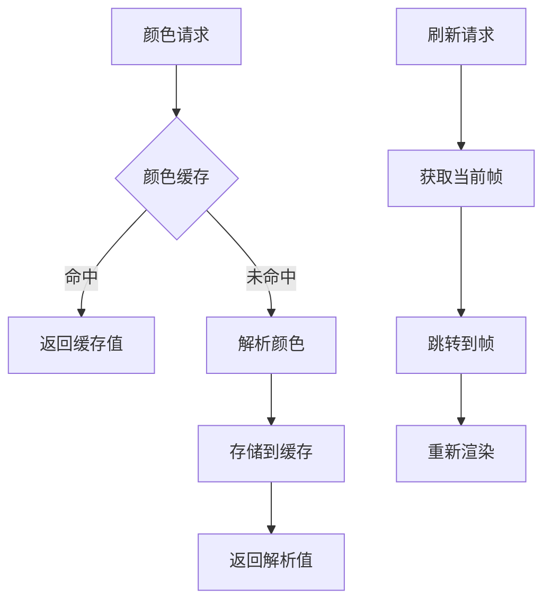

# 主题管理

<cite>
**本文档引用的文件**
- [ThemeManager.ts](file://packages/core/src/core/ThemeManager.ts)
- [LottieInstance.ts](file://packages/core/src/core/LottieInstance.ts)
- [index.ts](file://packages/core/src/types/index.ts)
- [AdvancedFeatures.ts](file://packages/core/src/core/AdvancedFeatures.ts)
- [App.tsx](file://examples/react-demo/src/App.tsx)
- [App.vue](file://examples/vue-demo/src/App.vue)
- [ADVANCED_FEATURES_EXAMPLES.md](file://examples/ADVANCED_FEATURES_EXAMPLES.md)
</cite>

## 目录
1. [简介](#简介)
2. [项目结构](#项目结构)
3. [核心组件](#核心组件)
4. [架构概览](#架构概览)
5. [详细组件分析](#详细组件分析)
6. [主题配置与使用](#主题配置与使用)
7. [与LottieInstance的集成](#与lottieinstance的集成)
8. [性能优化与缓存策略](#性能优化与缓存策略)
9. [常见问题与解决方案](#常见问题与解决方案)
10. [最佳实践](#最佳实践)
11. [总结](#总结)

## 简介

Lottie主题管理系统是一个强大的动态外观切换解决方案，允许开发者在运行时实时修改动画的颜色、样式和视觉表现。该系统通过精确的颜色映射和智能的动画数据处理，为复杂的主题切换需求提供了优雅的解决方案。

主题管理器支持多种颜色操作，包括基础的颜色替换、亮度调整、饱和度变化和色调偏移，同时提供了完整的主题注册、应用和切换机制。它与LottieInstance紧密集成，确保在主题切换过程中保持动画的流畅性和一致性。

## 项目结构

主题管理功能的核心文件组织如下：



**图表来源**
- [ThemeManager.ts](file://packages/core/src/core/ThemeManager.ts#L1-L523)
- [LottieInstance.ts](file://packages/core/src/core/LottieInstance.ts#L1-L667)
- [AdvancedFeatures.ts](file://packages/core/src/core/AdvancedFeatures.ts#L15-L16)

**章节来源**
- [ThemeManager.ts](file://packages/core/src/core/ThemeManager.ts#L1-L523)
- [LottieInstance.ts](file://packages/core/src/core/LottieInstance.ts#L1-L667)

## 核心组件

### ThemeManager类

ThemeManager是主题管理系统的核心类，负责处理所有主题相关的操作：

- **颜色提取与管理**：自动扫描动画中的所有颜色并建立原始颜色映射
- **主题注册与存储**：维护主题配置的注册表和当前激活的主题
- **动态颜色替换**：提供多种颜色操作方法，支持精确的颜色匹配和替换
- **主题切换机制**：实现平滑的主题切换，包括重置和应用流程

### 颜色映射系统

系统支持灵活的颜色配置：

- **ColorMap接口**：定义原始颜色到目标颜色的映射关系
- **多格式支持**：兼容十六进制、RGB、RGBA等多种颜色格式
- **精确匹配**：内置容差机制确保颜色匹配的准确性

**章节来源**
- [ThemeManager.ts](file://packages/core/src/core/ThemeManager.ts#L37-L523)

## 架构概览

主题管理系统采用分层架构设计，确保良好的可扩展性和维护性：



**图表来源**
- [ThemeManager.ts](file://packages/core/src/core/ThemeManager.ts#L45-L49)
- [LottieInstance.ts](file://packages/core/src/core/LottieInstance.ts#L54-L57)

## 详细组件分析

### 颜色提取机制

ThemeManager通过深度遍历动画数据结构来提取所有可用的颜色：



**图表来源**
- [ThemeManager.ts](file://packages/core/src/core/ThemeManager.ts#L62-L95)

### 颜色替换算法

系统实现了多种颜色替换策略：



**图表来源**
- [ThemeManager.ts](file://packages/core/src/core/ThemeManager.ts#L6-L32)
- [ThemeManager.ts](file://packages/core/src/core/ThemeManager.ts#L37-L523)

**章节来源**
- [ThemeManager.ts](file://packages/core/src/core/ThemeManager.ts#L62-L95)
- [ThemeManager.ts](file://packages/core/src/core/ThemeManager.ts#L147-L202)

### 颜色操作方法

系统提供了丰富的颜色操作功能：

#### 基础颜色替换
- **replaceColor()**：精确替换指定颜色
- **replaceColors()**：批量替换多个颜色
- **replaceColorByLayer()**：按图层名称替换颜色

#### 颜色调整功能
- **adjustBrightness()**：调整整体亮度
- **adjustSaturation()**：调整颜色饱和度
- **applyHueShift()**：应用色调偏移

#### 高级操作
- **颜色空间转换**：支持RGB、HSL、HSV色彩空间
- **递归处理**：可选择是否递归应用到子图层
- **精确匹配**：内置容差机制确保匹配精度

**章节来源**
- [ThemeManager.ts](file://packages/core/src/core/ThemeManager.ts#L147-L367)

## 主题配置与使用

### 主题配置结构

主题配置采用简洁而强大的接口设计：

| 属性 | 类型 | 描述 | 必需 |
|------|------|------|------|
| name | string | 主题唯一标识符 | 是 |
| colors | ColorMap | 颜色映射配置 | 是 |
| autoApply | boolean | 是否自动应用 | 否 |

### 颜色映射配置

ColorMap支持灵活的颜色替换规则：

| 配置方式 | 示例 | 说明 |
|----------|------|------|
| 基础替换 | `{'#ff0000': '#0000ff'}` | 红色替换为蓝色 |
| 多色替换 | `{'#ff0000': '#0000ff', '#00ff00': '#ffff00'}` | 同时替换多种颜色 |
| 透明度处理 | `{'#ffffff': '#ffffff80'}` | 保留原有透明度 |

### 使用示例

#### 基础主题应用

```typescript
// 创建主题管理器
const themeManager = new ThemeManager(animationInstance);

// 注册主题
themeManager.registerTheme({
  name: 'dark-mode',
  colors: {
    '#ffffff': '#1a1a1a',  // 白色背景变深色
    '#000000': '#ffffff',  // 黑色文字变白色
    '#ff0000': '#ff6b6b'   // 红色强调色
  },
  autoApply: true
});

// 应用主题
themeManager.applyTheme('dark-mode');
```

#### 高级颜色调整

```typescript
// 调整亮度
themeManager.adjustBrightness(1.2);  // 增加20%亮度

// 调整饱和度
themeManager.adjustSaturation(0.8);  // 减少20%饱和度

// 应用色调偏移
themeManager.applyHueShift(30);      // 向右旋转30度色调
```

**章节来源**
- [ThemeManager.ts](file://packages/core/src/core/ThemeManager.ts#L13-L20)
- [ADVANCED_FEATURES_EXAMPLES.md](file://examples/ADVANCED_FEATURES_EXAMPLES.md#L175-L193)

## 与LottieInstance的集成

### 集成架构

ThemeManager与LottieInstance通过紧密协作实现主题功能：



**图表来源**
- [ThemeManager.ts](file://packages/core/src/core/ThemeManager.ts#L45-L49)
- [LottieInstance.ts](file://packages/core/src/core/LottieInstance.ts#L54-L57)

### 数据流处理

主题管理器通过以下流程与LottieInstance交互：

1. **初始化阶段**：ThemeManager获取LottieInstance的动画数据
2. **颜色提取**：扫描动画数据中的所有颜色并建立映射
3. **主题应用**：修改动画数据中的颜色值
4. **渲染刷新**：通知渲染引擎重新绘制动画

### API集成点

| 方法 | 功能 | 集成点 |
|------|------|--------|
| `constructor(animation)` | 初始化主题管理器 | LottieInstance创建时 |
| `getAnimationData()` | 获取动画数据 | 颜色提取和主题应用 |
| `refresh()` | 刷新渲染 | 颜色修改后 |
| `resetColors()` | 重置颜色 | 主题切换时 |

**章节来源**
- [ThemeManager.ts](file://packages/core/src/core/ThemeManager.ts#L45-L49)
- [LottieInstance.ts](file://packages/core/src/core/LottieInstance.ts#L54-L57)

## 性能优化与缓存策略

### 性能考虑因素

主题管理系统在设计时充分考虑了性能优化：

#### 颜色匹配优化
- **容差机制**：内置0.01的默认容差，平衡精度与性能
- **早期退出**：颜色不匹配时立即停止处理
- **批量操作**：支持一次性替换多个颜色

#### 渲染优化
- **增量更新**：只修改被影响的颜色，避免全量重绘
- **帧同步**：在正确的动画帧进行刷新
- **智能缓存**：缓存解析后的颜色值和计算结果

### 缓存策略

系统采用多层次的缓存机制：



**图表来源**
- [ThemeManager.ts](file://packages/core/src/core/ThemeManager.ts#L413-L438)
- [ThemeManager.ts](file://packages/core/src/core/ThemeManager.ts#L518-L521)

### 内存管理

- **弱引用**：使用Map而非强引用避免内存泄漏
- **及时清理**：在主题切换时清理不必要的数据
- **懒加载**：延迟加载非必要的颜色数据

**章节来源**
- [ThemeManager.ts](file://packages/core/src/core/ThemeManager.ts#L443-L454)
- [ThemeManager.ts](file://packages/core/src/core/ThemeManager.ts#L518-L521)

## 常见问题与解决方案

### 主题加载失败

**问题描述**：主题无法正确应用或出现错误

**可能原因**：
1. 动画数据为空或格式不正确
2. 颜色格式不被支持
3. 主题名称不存在

**解决方案**：
```typescript
// 检查动画数据
if (!themeManager.getAnimationData()) {
  console.error('动画数据无效');
  return;
}

// 验证颜色格式
try {
  themeManager.parseColor('#invalid-color');
} catch (error) {
  console.error('颜色格式错误');
}

// 检查主题是否存在
if (!themeManager.getTheme('theme-name')) {
  console.warn('主题不存在');
}
```

### 样式冲突

**问题描述**：主题应用后出现意外的样式变化

**解决方案**：
1. **精确匹配**：使用更具体的选择器避免误匹配
2. **递归控制**：通过`recursive: false`避免影响子图层
3. **颜色容差**：调整匹配容差参数

### 性能问题

**问题描述**：大量颜色替换导致性能下降

**优化方案**：
1. **批量操作**：使用`replaceColors()`替代多次`replaceColor()`
2. **选择性应用**：只对必要的图层应用主题
3. **缓存利用**：充分利用颜色解析缓存

### 兼容性问题

**问题描述**：某些颜色格式或动画类型不支持

**解决策略**：
1. **格式标准化**：统一使用支持的颜色格式
2. **渐进增强**：提供降级方案
3. **错误处理**：完善的错误捕获和日志记录

**章节来源**
- [ThemeManager.ts](file://packages/core/src/core/ThemeManager.ts#L121-L124)
- [ThemeManager.ts](file://packages/core/src/core/ThemeManager.ts#L435-L438)

## 最佳实践

### 主题设计原则

1. **语义化命名**：使用有意义的主题名称
2. **渐进式增强**：提供基础和高级主题选项
3. **一致性保证**：确保颜色映射的一致性

### 开发建议

1. **预加载检查**：在应用主题前验证动画数据
2. **错误边界**：妥善处理主题应用过程中的异常
3. **用户体验**：提供平滑的主题切换体验

### 性能优化

1. **合理缓存**：充分利用系统的缓存机制
2. **批量操作**：减少重复的颜色解析
3. **适时清理**：及时释放不需要的资源

### 测试策略

1. **单元测试**：测试各种颜色格式和边界情况
2. **集成测试**：验证与LottieInstance的集成
3. **性能测试**：评估大量颜色替换的性能影响

## 总结

Lottie主题管理系统提供了一个强大而灵活的解决方案，用于在运行时动态修改动画的外观。通过精心设计的架构和丰富的功能集，它能够满足从简单颜色替换到复杂主题切换的各种需求。

系统的主要优势包括：
- **灵活性**：支持多种颜色操作和主题配置
- **性能**：优化的算法和缓存机制确保流畅体验
- **易用性**：简洁的API设计降低使用门槛
- **可扩展性**：模块化设计便于功能扩展

通过合理的使用和优化，主题管理系统能够在各种应用场景中发挥重要作用，为用户提供出色的视觉体验。