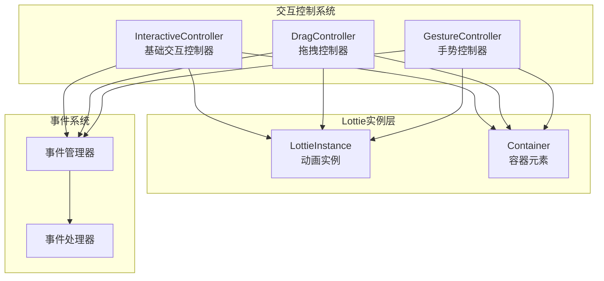
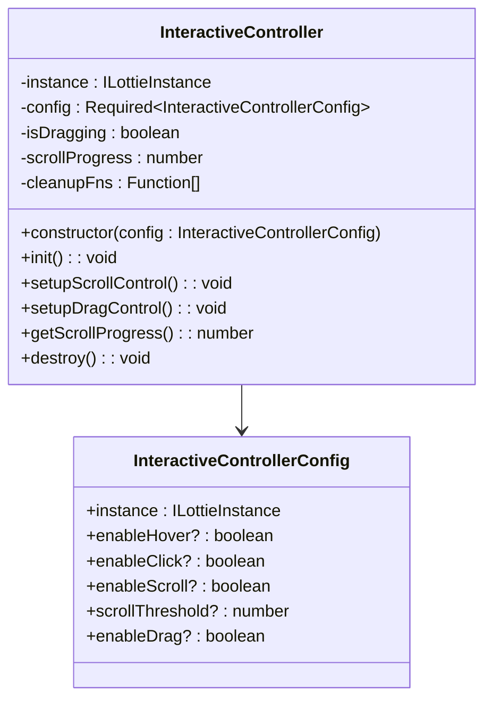
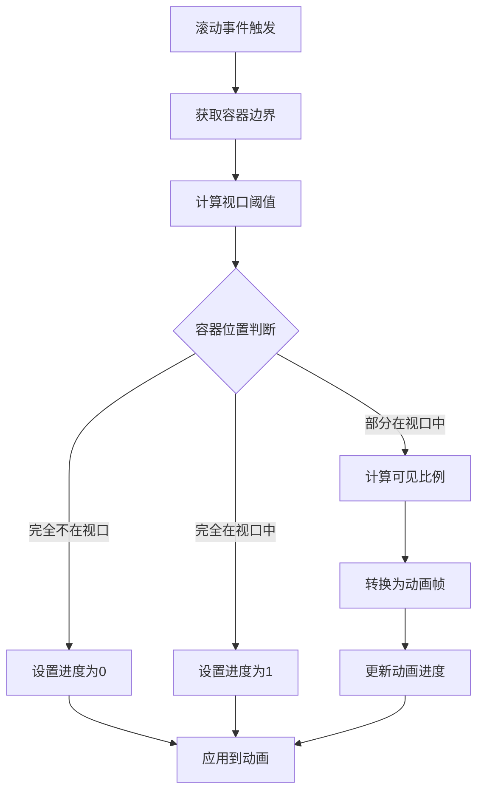
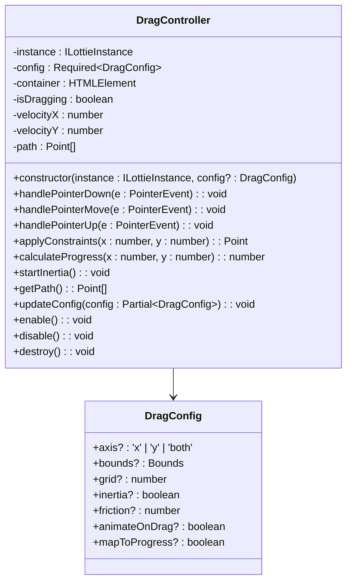
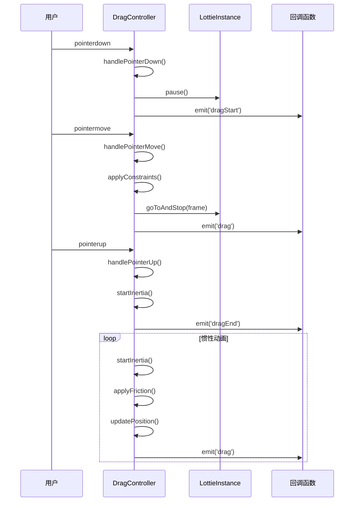
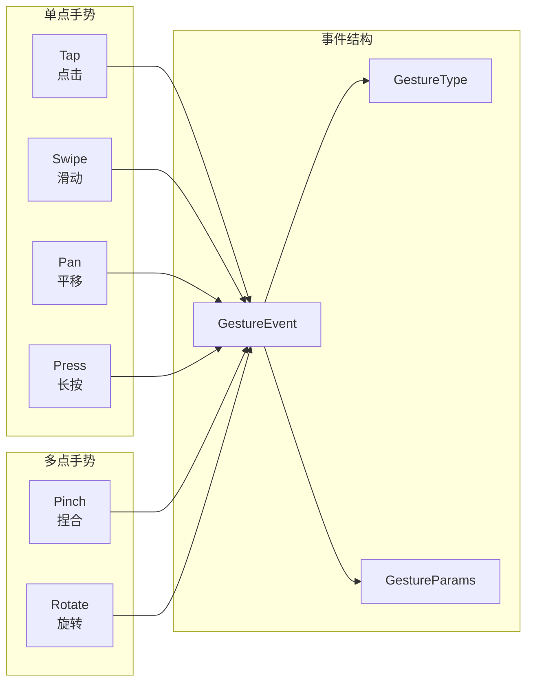
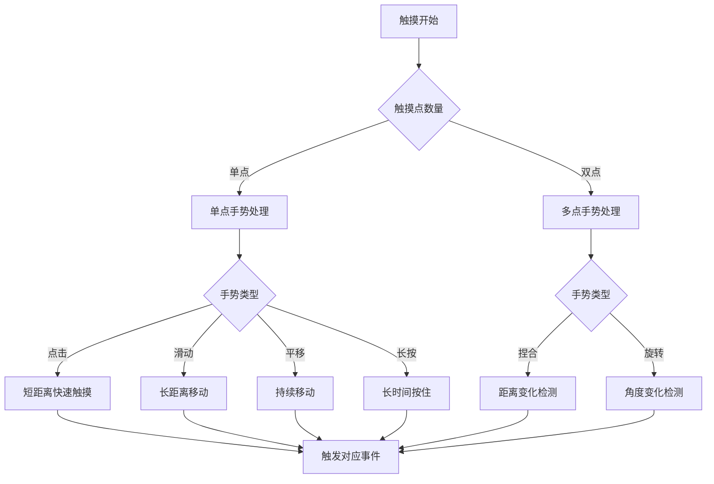
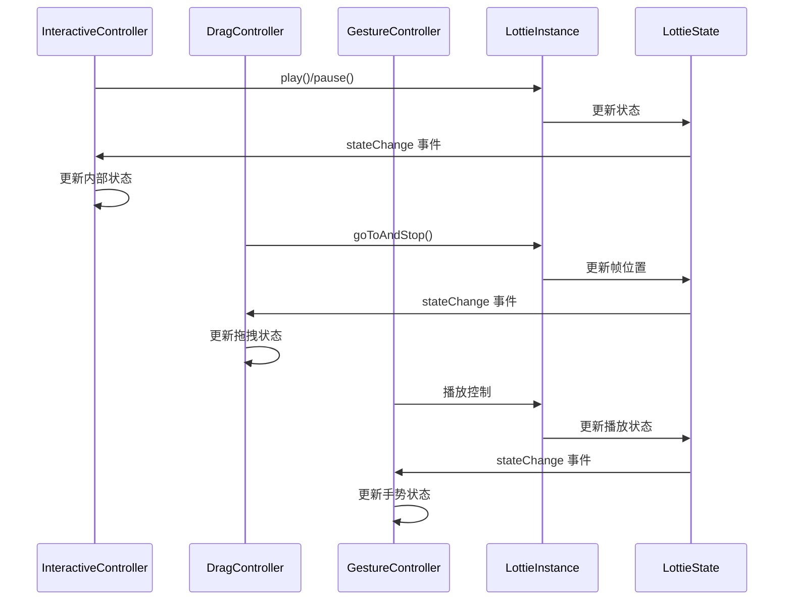
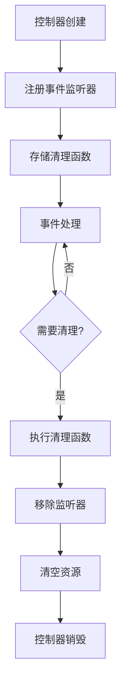
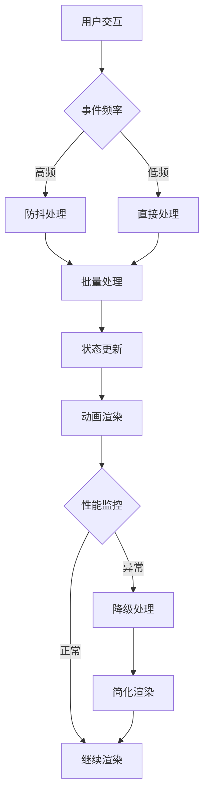

# 交互控制

<cite>
**本文档中引用的文件**
- [InteractiveController.ts](file://packages/core/src/core/InteractiveController.ts)
- [DragController.ts](file://packages/core/src/core/DragController.ts)
- [GestureController.ts](file://packages/core/src/core/GestureController.ts)
- [useLottieInteractive.ts (React)](file://packages/react/src/hooks/useLottieInteractive.ts)
- [useLottieInteractive.ts (Vue)](file://packages/vue/src/composables/useLottieInteractive.ts)
- [InteractiveDemo.vue](file://examples/vue-demo/src/components/InteractiveDemo.vue)
- [App.tsx (React)](file://examples/react-demo/src/App.tsx)
- [index.ts](file://packages/core/src/types/index.ts)
- [LottieInstance.ts](file://packages/core/src/core/LottieInstance.ts)
</cite>

## 目录
1. [简介](#简介)
2. [核心架构](#核心架构)
3. [InteractiveController详解](#interactivecontroller详解)
4. [DragController详解](#dragcontroller详解)
5. [GestureController详解](#gesturecontroller详解)
6. [状态同步机制](#状态同步机制)
7. [事件绑定与处理](#事件绑定与处理)
8. [配置参数详解](#配置参数详解)
9. [集成示例](#集成示例)
10. [性能优化](#性能优化)
11. [故障排除](#故障排除)
12. [高级扩展](#高级扩展)

## 简介

Lottie 的交互控制功能提供了丰富的用户交互能力，通过三个核心控制器：InteractiveController、DragController 和 GestureController，为动画添加了鼠标悬停、点击播放、拖拽控制、手势识别等多种交互行为。这些控制器协同工作，实现了流畅的用户体验和高性能的交互响应。

## 核心架构



**图表来源**
- [InteractiveController.ts](file://packages/core/src/core/InteractiveController.ts#L25-L44)
- [DragController.ts](file://packages/core/src/core/DragController.ts#L41-L90)
- [GestureController.ts](file://packages/core/src/core/GestureController.ts#L38-L71)

## InteractiveController详解

InteractiveController 是最基础的交互控制器，负责处理鼠标悬停、点击播放、滚动控制和拖拽等基本交互。

### 核心功能



**图表来源**
- [InteractiveController.ts](file://packages/core/src/core/InteractiveController.ts#L6-L19)
- [InteractiveController.ts](file://packages/core/src/core/InteractiveController.ts#L25-L44)

### 初始化流程

InteractiveController 的初始化过程包含以下步骤：

1. **配置验证**：确保实例容器存在
2. **功能模块化**：根据配置启用相应功能
3. **事件绑定**：为每个功能绑定相应的事件监听器
4. **清理函数注册**：存储事件监听器以便后续清理

### 滚动控制机制

滚动控制通过计算容器在视口中的可见比例来控制动画进度：



**图表来源**
- [InteractiveController.ts](file://packages/core/src/core/InteractiveController.ts#L104-L138)

**章节来源**
- [InteractiveController.ts](file://packages/core/src/core/InteractiveController.ts#L25-L211)

## DragController详解

DragController 提供了更复杂的拖拽交互功能，支持轴向约束、边界限制、惯性效果和进度映射。

### 核心特性



**图表来源**
- [DragController.ts](file://packages/core/src/core/DragController.ts#L8-L28)
- [DragController.ts](file://packages/core/src/core/DragController.ts#L41-L90)

### 惯性算法实现

DragController 实现了物理惯性效果，通过以下步骤计算：

1. **速度计算**：基于触摸移动轨迹计算实时速度
2. **摩擦应用**：每帧应用摩擦系数减少速度
3. **位置更新**：根据当前速度更新位置
4. **约束检查**：确保位置在允许范围内
5. **进度映射**：可选地将位置映射到动画进度

### 事件系统



**图表来源**
- [DragController.ts](file://packages/core/src/core/DragController.ts#L112-L210)

**章节来源**
- [DragController.ts](file://packages/core/src/core/DragController.ts#L1-L453)

## GestureController详解

GestureController 支持多种手势交互，包括点击、滑动、捏合、旋转和长按等复杂手势。

### 手势类型



**图表来源**
- [GestureController.ts](file://packages/core/src/core/GestureController.ts#L8-L31)

### 手势识别算法



**图表来源**
- [GestureController.ts](file://packages/core/src/core/GestureController.ts#L149-L289)

### 配置参数

| 参数 | 类型 | 默认值 | 描述 |
|------|------|--------|------|
| enableTap | boolean | true | 启用点击手势 |
| enableSwipe | boolean | true | 启用滑动手势 |
| enablePinch | boolean | true | 启用捏合手势 |
| enableRotate | boolean | true | 启用旋转手势 |
| enablePan | boolean | true | 启用平移手势 |
| enablePress | boolean | true | 启用长按手势 |
| swipeThreshold | number | 50 | 滑动阈值（像素） |
| pinchThreshold | number | 0.1 | 捏合阈值 |
| pressDelay | number | 500 | 长按延迟（毫秒） |

**章节来源**
- [GestureController.ts](file://packages/core/src/core/GestureController.ts#L1-L428)

## 状态同步机制

交互控制器与 LottieInstance 之间通过事件系统保持状态同步：



**图表来源**
- [LottieInstance.ts](file://packages/core/src/core/LottieInstance.ts#L658-L666)

### 状态一致性保证

1. **事件驱动**：所有状态变更都通过事件系统通知
2. **原子操作**：状态变更在单个事件周期内完成
3. **错误恢复**：异常情况下自动恢复到一致状态
4. **竞态避免**：通过事件队列避免并发修改

**章节来源**
- [LottieInstance.ts](file://packages/core/src/core/LottieInstance.ts#L627-L666)

## 事件绑定与处理

### 事件生命周期管理



### 内存泄漏防护

所有控制器都实现了完整的清理机制：

1. **事件监听器清理**：移除所有绑定的事件处理器
2. **定时器清理**：取消所有 setTimeout/setInterval
3. **动画帧清理**：停止 requestAnimationFrame 循环
4. **DOM 引用清理**：断开与 DOM 元素的引用

**章节来源**
- [InteractiveController.ts](file://packages/core/src/core/InteractiveController.ts#L205-L209)
- [DragController.ts](file://packages/core/src/core/DragController.ts#L438-L450)

## 配置参数详解

### InteractiveControllerConfig

| 参数 | 类型 | 默认值 | 作用域 | 描述 |
|------|------|--------|--------|------|
| instance | ILottieInstance | 必需 | 全局 | 关联的 Lottie 实例 |
| enableHover | boolean | false | 鼠标交互 | 鼠标悬停时自动播放 |
| enableClick | boolean | false | 鼠标交互 | 点击切换播放状态 |
| enableScroll | boolean | false | 滚动交互 | 滚动时控制动画进度 |
| scrollThreshold | number | 0.1 | 滚动交互 | 滚动触发阈值（0-1） |
| enableDrag | boolean | false | 拖拽交互 | 启用拖拽控制进度 |

### DragConfig

| 参数 | 类型 | 默认值 | 描述 |
|------|------|--------|------|
| axis | 'x' \| 'y' \| 'both' | 'both' | 拖拽轴向限制 |
| bounds | Bounds | {} | 边界约束区域 |
| grid | number | 0 | 网格吸附大小 |
| inertia | boolean | false | 启用惯性效果 |
| friction | number | 0.95 | 惯性摩擦系数 |
| animateOnDrag | boolean | false | 拖拽时暂停动画 |
| mapToProgress | boolean | false | 拖拽映射到进度 |

### GestureConfig

| 参数 | 类型 | 默认值 | 描述 |
|------|------|--------|------|
| enableTap | boolean | true | 启用点击手势 |
| enableSwipe | boolean | true | 启用滑动手势 |
| enablePinch | boolean | true | 启用捏合手势 |
| enableRotate | boolean | true | 启用旋转手势 |
| enablePan | boolean | true | 启用平移手势 |
| enablePress | boolean | true | 启用长按手势 |
| swipeThreshold | number | 50 | 滑动检测阈值（px） |
| pinchThreshold | number | 0.1 | 捏合检测阈值 |
| pressDelay | number | 500 | 长按延迟（ms） |

## 集成示例

### 基础交互控制器集成

```typescript
// 创建基础交互控制器
const interactive = new InteractiveController({
  instance: lottieInstance,
  enableHover: true,
  enableClick: true,
  enableScroll: true,
  enableDrag: true
});

// 获取滚动进度
const progress = interactive.getScrollProgress();
console.log(`当前滚动进度: ${progress}`);

// 销毁控制器
interactive.destroy();
```

### 拖拽控制器集成

```typescript
// 创建拖拽控制器
const drag = new DragController(lottieInstance, {
  axis: 'x',
  bounds: { left: 0, right: 500 },
  grid: 10,
  inertia: true,
  mapToProgress: true
});

// 监听拖拽事件
drag.on('dragStart', (event) => {
  console.log('开始拖拽');
});

drag.on('drag', (event) => {
  console.log(`拖拽进度: ${(event.progress || 0) * 100}%`);
});

drag.on('dragEnd', (event) => {
  console.log('拖拽结束');
});
```

### 手势控制器集成

```typescript
// 创建手势控制器
const gesture = new GestureController(lottieInstance, {
  enableTap: true,
  enableSwipe: true,
  enablePinch: true,
  swipeThreshold: 100,
  pinchThreshold: 0.2
});

// 监听各种手势
gesture.on('tap', (event) => {
  console.log('点击手势');
});

gesture.on('swipe', (event) => {
  console.log(`滑动手势: ${event.deltaX}px, ${event.deltaY}px`);
});

gesture.on('pinch', (event) => {
  console.log(`捏合手势: 缩放倍数 ${event.scale}`);
});
```

### React Hook 集成

```typescript
// React 中使用交互钩子
const { instance, isHovering } = useLottieInteractive({
  animationData,
  playOnHover: true,
  playOnClick: true,
  onMouseEnter: () => console.log('鼠标进入'),
  onMouseLeave: () => console.log('鼠标离开'),
  onClick: () => console.log('点击动画')
});

// 在 JSX 中使用
<div 
  onMouseEnter={() => isHovering && instance.play()}
  onMouseLeave={() => isHovering && instance.pause()}
>
  <Lottie instance={instance} />
</div>
```

### Vue Composable 集成

```typescript
// Vue 中使用交互组合式函数
const { instance, isHovering } = useLottieInteractive({
  animationData,
  playOnHover: true,
  playOnClick: true
});

// 在模板中使用
<div 
  @mouseenter="isHovering && instance.play()"
  @mouseleave="isHovering && instance.pause()"
>
  <Lottie :instance="instance" />
</div>
```

**章节来源**
- [InteractiveDemo.vue](file://examples/vue-demo/src/components/InteractiveDemo.vue#L24-L73)
- [App.tsx (React)](file://examples/react-demo/src/App.tsx#L100-L142)

## 性能优化

### 事件处理优化

1. **事件委托**：在可能的情况下使用事件委托减少监听器数量
2. **防抖节流**：对高频事件进行防抖处理
3. **RAF 优化**：使用 requestAnimationFrame 优化动画帧更新
4. **内存池**：复用事件对象减少垃圾回收

### 渲染性能优化



### 内存管理策略

1. **及时清理**：组件销毁时立即清理所有资源
2. **弱引用**：对 DOM 元素使用弱引用
3. **对象池**：复用频繁创建的对象
4. **懒加载**：按需加载控制器功能

## 故障排除

### 常见问题及解决方案

#### 触摸延迟问题

**症状**：用户触摸后动画响应延迟

**原因分析**：
- 浏览器默认的触摸延迟（300ms）
- 事件处理函数执行时间过长
- 多个控制器同时处理相同事件

**解决方案**：
```typescript
// 禁用浏览器默认触摸延迟
document.addEventListener('touchstart', (e) => {
  if (e.target.tagName.toLowerCase() === 'lottie-player') {
    e.preventDefault();
  }
}, { passive: false });

// 优化事件处理
const optimizedHandler = throttle((event) => {
  // 事件处理逻辑
}, 16); // 16ms ≈ 60fps
```

#### 事件冲突问题

**症状**：多个控制器同时响应同一事件

**解决方案**：
```typescript
// 使用事件优先级
class EventManager {
  private handlers: Map<string, Function[]> = new Map();
  
  addHandler(type: string, handler: Function, priority: number = 0) {
    const handlers = this.handlers.get(type) || [];
    handlers.push({ handler, priority });
    handlers.sort((a, b) => b.priority - a.priority);
    this.handlers.set(type, handlers);
  }
  
  removeHandler(type: string, handler: Function) {
    const handlers = this.handlers.get(type);
    if (handlers) {
      this.handlers.set(type, handlers.filter(h => h.handler !== handler));
    }
  }
}
```

#### 拖拽不流畅问题

**症状**：拖拽过程中动画卡顿

**解决方案**：
```typescript
// 优化拖拽性能
const dragController = new DragController(instance, {
  mapToProgress: true,
  animateOnDrag: false, // 拖拽时不暂停动画
  inertia: true,
  friction: 0.98 // 增加摩擦力
});

// 使用 RAF 优化
let isAnimating = false;
dragController.on('drag', (event) => {
  if (!isAnimating) {
    isAnimating = true;
    requestAnimationFrame(() => {
      // 执行动画更新
      isAnimating = false;
    });
  }
});
```

### 调试工具

```typescript
// 交互控制器调试器
class InteractiveDebugger {
  static logInteraction(controller: any, eventType: string, data: any) {
    console.group(`[${eventType}]`);
    console.log('控制器:', controller.constructor.name);
    console.log('数据:', data);
    console.log('时间:', new Date().toISOString());
    console.groupEnd();
  }
  
  static measurePerformance(controller: any, methodName: string) {
    const originalMethod = controller[methodName];
    controller[methodName] = function(...args: any[]) {
      const start = performance.now();
      const result = originalMethod.apply(this, args);
      const end = performance.now();
      console.log(`${methodName} 耗时: ${end - start}ms`);
      return result;
    };
  }
}
```

## 高级扩展

### 自定义交互逻辑

```typescript
// 自定义交互控制器基类
abstract class BaseInteractiveController {
  protected instance: ILottieInstance;
  protected isActive: boolean = true;
  
  constructor(instance: ILottieInstance) {
    this.instance = instance;
  }
  
  abstract activate(): void;
  abstract deactivate(): void;
  
  protected emit(event: string, data: any) {
    this.instance.emit(`interactive.${event}`, data);
  }
}

// 自定义拖拽控制器
class CustomDragController extends BaseInteractiveController {
  private dragHandler: (event: DragEvent) => void;
  
  constructor(instance: ILottieInstance, handler: (event: DragEvent) => void) {
    super(instance);
    this.dragHandler = handler;
  }
  
  activate() {
    this.isActive = true;
    // 注册拖拽事件
  }
  
  deactivate() {
    this.isActive = false;
    // 清理拖拽事件
  }
}
```

### 多控制器协调

```typescript
// 控制器协调器
class ControllerCoordinator {
  private controllers: Map<string, any> = new Map();
  private priority: Map<string, number> = new Map();
  
  registerController(name: string, controller: any, priority: number = 0) {
    this.controllers.set(name, controller);
    this.priority.set(name, priority);
  }
  
  handleEvent(eventType: string, eventData: any) {
    // 按优先级排序控制器
    const sortedControllers = Array.from(this.controllers.entries())
      .sort(([nameA], [nameB]) => 
        this.priority.get(nameB)! - this.priority.get(nameA)!
      );
    
    // 依次处理事件，直到被阻止
    for (const [name, controller] of sortedControllers) {
      if (!this.isActive(name)) continue;
      
      try {
        const result = controller.handleEvent(eventType, eventData);
        if (result === false) break; // 阻止事件传播
      } catch (error) {
        console.error(`控制器 ${name} 处理事件失败:`, error);
      }
    }
  }
  
  private isActive(name: string): boolean {
    return this.controllers.get(name)?.isActive !== false;
  }
}
```

### 状态机集成

```typescript
// 交互状态机
enum InteractionState {
  IDLE,
  HOVERING,
  DRAGGING,
  PINCHING,
  ROTATING
}

class InteractionStateMachine {
  private currentState: InteractionState = InteractionState.IDLE;
  private transitions: Map<InteractionState, Set<InteractionState>> = new Map();
  
  constructor() {
    // 配置状态转换
    this.transitions.set(InteractionState.IDLE, new Set([
      InteractionState.HOVERING,
      InteractionState.DRAGGING
    ]));
    
    this.transitions.set(InteractionState.HOVERING, new Set([
      InteractionState.IDLE,
      InteractionState.DRAGGING
    ]));
  }
  
  transition(toState: InteractionState): boolean {
    if (this.transitions.get(this.currentState)?.has(toState)) {
      const fromState = this.currentState;
      this.currentState = toState;
      this.emitTransition(fromState, toState);
      return true;
    }
    return false;
  }
  
  private emitTransition(from: InteractionState, to: InteractionState) {
    this.instance.emit('interaction.transition', {
      from: InteractionState[from],
      to: InteractionState[to],
      timestamp: Date.now()
    });
  }
}
```

### 性能监控集成

```typescript
// 交互性能监控
class InteractionPerformanceMonitor {
  private metrics: Map<string, number[]> = new Map();
  
  recordInteraction(type: string, duration: number) {
    const times = this.metrics.get(type) || [];
    times.push(duration);
    if (times.length > 100) {
      times.shift(); // 保持最近100次记录
    }
    this.metrics.set(type, times);
  }
  
  getAverageDuration(type: string): number {
    const times = this.metrics.get(type);
    if (!times || times.length === 0) return 0;
    
    const sum = times.reduce((a, b) => a + b, 0);
    return sum / times.length;
  }
  
  getPerformanceReport(): Record<string, number> {
    const report: Record<string, number> = {};
    for (const [type] of this.metrics) {
      report[type] = this.getAverageDuration(type);
    }
    return report;
  }
}
```

通过这些高级扩展功能，开发者可以构建更加复杂和个性化的交互体验，同时保持良好的性能和可维护性。