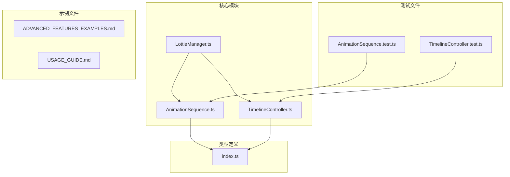
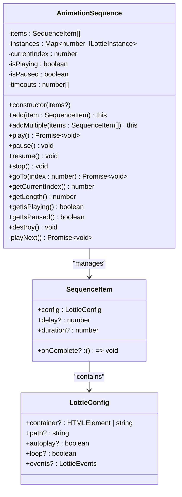
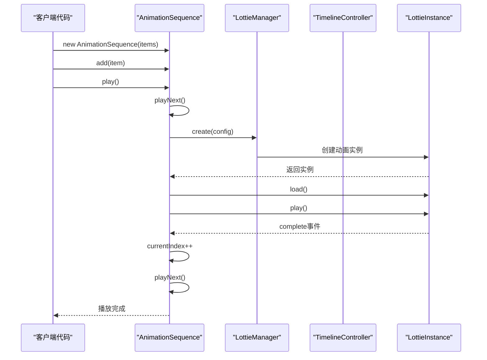
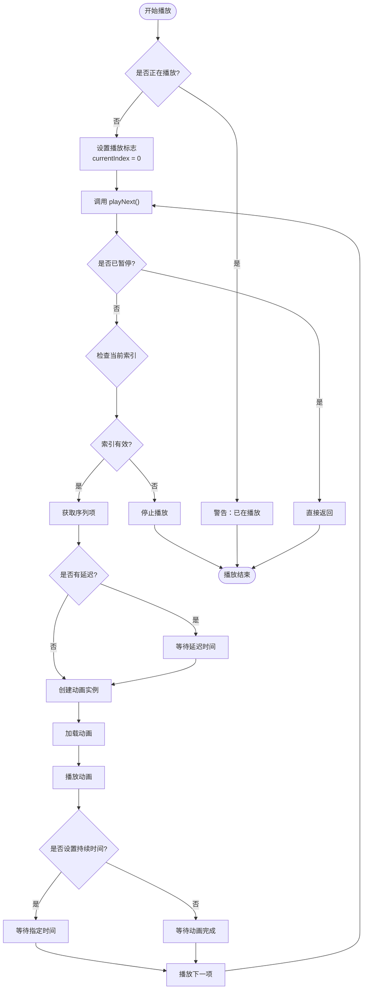
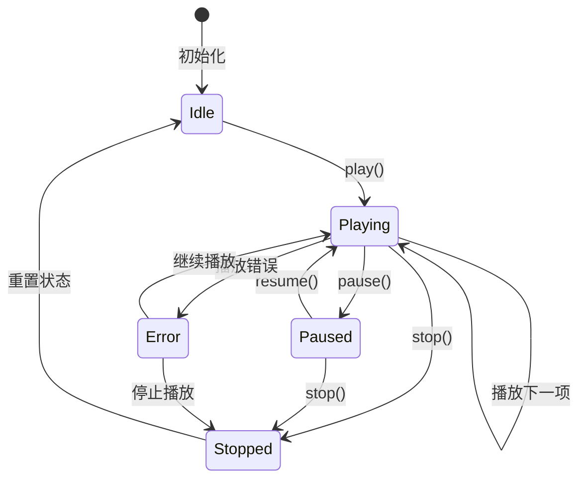
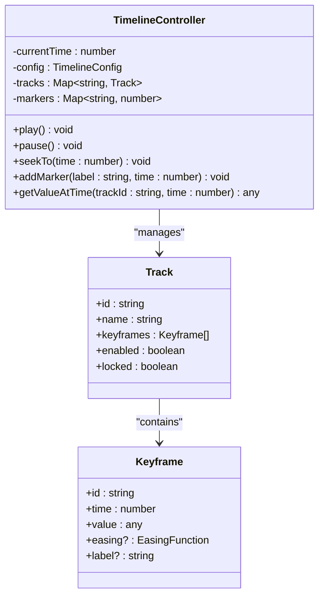
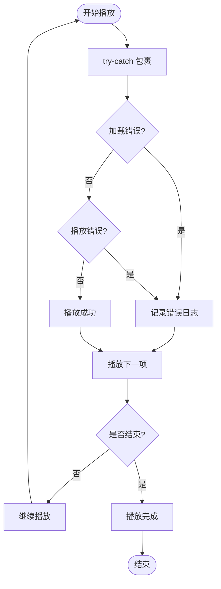
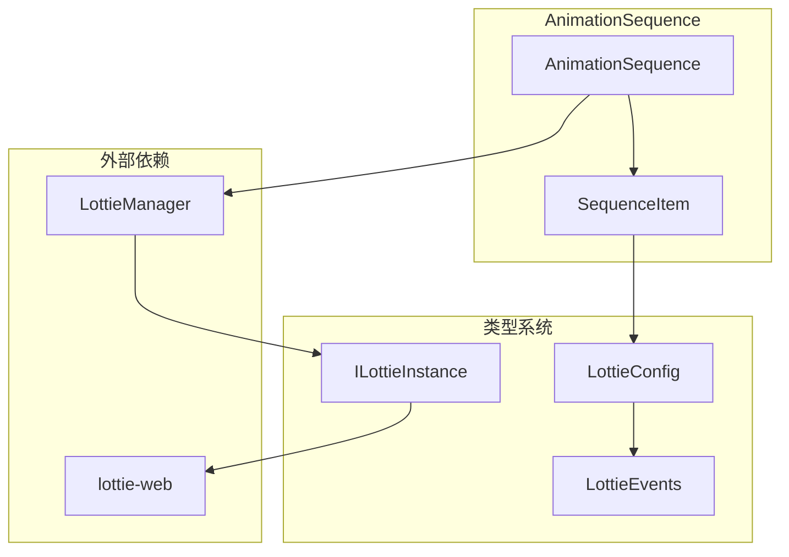

# 动画序列

<cite>
**本文档引用的文件**
- [AnimationSequence.ts](file://packages/core/src/core/AnimationSequence.ts)
- [TimelineController.ts](file://packages/core/src/core/TimelineController.ts)
- [LottieManager.ts](file://packages/core/src/core/LottieManager.ts)
- [types/index.ts](file://packages/core/src/types/index.ts)
- [API_REFERENCE.md](file://API_REFERENCE.md)
- [USAGE_GUIDE.md](file://USAGE_GUIDE.md)
- [ADVANCED_FEATURES_EXAMPLES.md](file://examples/ADVANCED_FEATURES_EXAMPLES.md)
</cite>

## 目录
1. [简介](#简介)
2. [项目结构](#项目结构)
3. [核心组件](#核心组件)
4. [架构概览](#架构概览)
5. [详细组件分析](#详细组件分析)
6. [依赖关系分析](#依赖关系分析)
7. [性能考虑](#性能考虑)
8. [故障排除指南](#故障排除指南)
9. [结论](#结论)

## 简介

AnimationSequence类是Lottie动画库中的核心组件，专门用于编排多个Lottie动画的播放顺序。它提供了强大的序列化播放功能，支持串行播放、延迟控制、持续时间管理、回调函数执行以及错误处理。该组件与TimelineController紧密协作，共同构建了完整的动画时间轴管理系统。

AnimationSequence的设计理念是简单而强大，通过链式调用和Promise-based异步处理，为开发者提供了流畅的动画编排体验。它不仅支持基本的顺序播放，还具备暂停、恢复、跳转等高级控制功能，是构建复杂动画叙事的理想工具。

## 项目结构

Lottie动画库采用模块化架构，AnimationSequence作为核心功能模块位于`packages/core/src/core/`目录下：



**图表来源**
- [AnimationSequence.ts](file://packages/core/src/core/AnimationSequence.ts#L1-L249)
- [TimelineController.ts](file://packages/core/src/core/TimelineController.ts#L1-L488)
- [LottieManager.ts](file://packages/core/src/core/LottieManager.ts#L1-L100)

**章节来源**
- [AnimationSequence.ts](file://packages/core/src/core/AnimationSequence.ts#L1-L249)
- [TimelineController.ts](file://packages/core/src/core/TimelineController.ts#L1-L488)

## 核心组件

### AnimationSequence类

AnimationSequence类是整个动画序列功能的核心，提供了完整的动画编排能力：



**图表来源**
- [AnimationSequence.ts](file://packages/core/src/core/AnimationSequence.ts#L7-L16)
- [AnimationSequence.ts](file://packages/core/src/core/AnimationSequence.ts#L21-L249)
- [types/index.ts](file://packages/core/src/types/index.ts#L115-L146)

### SequenceItem接口

SequenceItem定义了动画序列中每个项目的结构，支持灵活的配置选项：

| 属性 | 类型 | 描述 | 默认值 |
|------|------|------|--------|
| config | LottieConfig | 动画配置对象 | 必需 |
| delay | number | 延迟时间（毫秒） | 0 |
| duration | number | 持续时间（毫秒），不设置则播放完整动画 | undefined |
| onComplete | () => void | 完成回调函数 | undefined |

**章节来源**
- [AnimationSequence.ts](file://packages/core/src/core/AnimationSequence.ts#L7-L16)

## 架构概览

AnimationSequence与TimelineController协同工作，形成了完整的动画时间轴管理系统：



**图表来源**
- [AnimationSequence.ts](file://packages/core/src/core/AnimationSequence.ts#L55-L199)
- [LottieManager.ts](file://packages/core/src/core/LottieManager.ts#L1-L100)

## 详细组件分析

### 序列播放机制

AnimationSequence采用递归式的播放机制，确保动画按照预定顺序执行：



**图表来源**
- [AnimationSequence.ts](file://packages/core/src/core/AnimationSequence.ts#L137-L199)

### 状态管理

AnimationSequence维护了复杂的内部状态，确保播放过程的可控性：



**图表来源**
- [AnimationSequence.ts](file://packages/core/src/core/AnimationSequence.ts#L24-L30)

### 时间轴管理

AnimationSequence与TimelineController协作，提供精确的时间控制：



**图表来源**
- [TimelineController.ts](file://packages/core/src/core/TimelineController.ts#L8-L22)
- [TimelineController.ts](file://packages/core/src/core/TimelineController.ts#L51-L488)

**章节来源**
- [AnimationSequence.ts](file://packages/core/src/core/AnimationSequence.ts#L55-L199)
- [TimelineController.ts](file://packages/core/src/core/TimelineController.ts#L51-L488)

### 错误处理机制

AnimationSequence实现了完善的错误处理机制，确保播放过程的稳定性：



**图表来源**
- [AnimationSequence.ts](file://packages/core/src/core/AnimationSequence.ts#L195-L199)

**章节来源**
- [AnimationSequence.ts](file://packages/core/src/core/AnimationSequence.ts#L195-L199)

## 依赖关系分析

AnimationSequence与Lottie生态系统中的其他组件存在密切的依赖关系：



**图表来源**
- [AnimationSequence.ts](file://packages/core/src/core/AnimationSequence.ts#L1-L3)
- [types/index.ts](file://packages/core/src/types/index.ts#L151-L208)

**章节来源**
- [AnimationSequence.ts](file://packages/core/src/core/AnimationSequence.ts#L1-L3)
- [types/index.ts](file://packages/core/src/types/index.ts#L151-L208)

## 性能考虑

AnimationSequence在设计时充分考虑了性能优化，提供了多种性能提升策略：

### 内存管理

- **实例池化**：通过LottieManager管理动画实例的生命周期
- **及时清理**：stop()和destroy()方法确保资源释放
- **定时器管理**：自动清除未完成的setTimeout调用

### 播放优化

- **异步处理**：使用Promise避免阻塞主线程
- **错误隔离**：单个动画错误不影响序列整体
- **状态检查**：播放前验证状态，避免无效操作

### 并发控制

虽然AnimationSequence本身是串行的，但它与TimelineController的并行处理能力形成互补，可以在不同轨道上同时处理多个动画元素。

## 故障排除指南

### 常见问题及解决方案

#### 1. 动画序列无法启动

**症状**：调用play()后动画没有开始播放

**原因分析**：
- 动画配置错误
- 容器元素不存在
- 网络加载超时

**解决方案**：
```typescript
// 检查容器是否存在
const container = document.getElementById('animation-container');
if (!container) {
    console.error('容器元素不存在');
    return;
}

// 验证配置
console.log('动画配置:', animationConfig);
```

#### 2. 播放过程中出现错误

**症状**：播放过程中抛出异常

**原因分析**：
- 动画文件损坏
- 内存不足
- 浏览器兼容性问题

**解决方案**：
```typescript
// 添加错误处理
animationSequence.on('error', (error) => {
    console.error('动画播放错误:', error);
    // 尝试恢复或回退
});
```

#### 3. 内存泄漏问题

**症状**：长时间运行后内存占用持续增长

**原因分析**：
- 实例未正确销毁
- 事件监听器未移除
- 定时器未清理

**解决方案**：
```typescript
// 正确的销毁流程
animationSequence.destroy();
// 确保DOM元素也被清理
container.innerHTML = '';
```

**章节来源**
- [AnimationSequence.ts](file://packages/core/src/core/AnimationSequence.ts#L110-L112)
- [AnimationSequence.ts](file://packages/core/src/core/AnimationSequence.ts#L195-L199)

## 结论

AnimationSequence类为Lottie动画库提供了强大而灵活的动画序列编排能力。通过其精心设计的API和完善的错误处理机制，开发者可以轻松创建复杂的动画叙事效果。

该组件的主要优势包括：

1. **简单易用**：直观的API设计，支持链式调用
2. **功能完整**：支持延迟、持续时间、回调等多种控制选项
3. **稳定可靠**：完善的错误处理和状态管理
4. **性能优化**：合理的内存管理和异步处理
5. **扩展性强**：与TimelineController等其他组件良好集成

对于高级用户，建议充分利用其回调机制和错误处理功能，结合LottieManager的全局控制能力，构建更加复杂的动画应用。同时，在生产环境中要注意适当的内存管理和错误处理，确保应用的稳定性和性能。