# 数据绑定

<cite>
**本文档引用的文件**
- [DataBinding.ts](file://packages/core/src/core/DataBinding.ts)
- [DataSource.ts](file://packages/core/src/core/DataSource.ts)
- [ChartAdapter.ts](file://packages/core/src/core/ChartAdapter.ts)
- [ValidationPipes.ts](file://packages/core/src/core/ValidationPipes.ts)
- [App.tsx](file://examples/react-demo/src/App.tsx)
- [App.vue](file://examples/vue-demo/src/App.vue)
- [FEATURES_SHOWCASE.md](file://FEATURES_SHOWCASE.md)
</cite>

## 目录
1. [简介](#简介)
2. [核心架构](#核心架构)
3. [DataBinding系统详解](#databinding系统详解)
4. [DataSource多数据源支持](#datasource多数据源支持)
5. [ChartAdapter图表适配器](#chartadapter图表适配器)
6. [数据验证与转换管道](#数据验证与转换管道)
7. [响应式更新机制](#响应式更新机制)
8. [实际应用场景](#实际应用场景)
9. [自定义扩展指南](#自定义扩展指南)
10. [最佳实践与性能优化](#最佳实践与性能优化)

## 简介

Lottie数据绑定系统是一个强大的实时数据驱动框架，能够将动态数据源与Lottie动画元素无缝关联，实现真正的数据可视化和交互式动画效果。该系统支持多种数据源类型，提供完整的验证、转换和错误恢复机制，是构建现代仪表盘和实时状态显示应用的理想选择。

### 主要特性

- **实时数据绑定**：支持从多种数据源实时获取数据并更新动画
- **类型安全**：完整的TypeScript类型定义和运行时验证
- **灵活的转换管道**：支持数据预处理、格式化和验证
- **响应式更新**：自动检测数据变化并触发动画更新
- **错误恢复**：完善的错误处理和数据回退机制
- **多图表类型**：内置柱状图、折线图、饼图等多种图表类型

## 核心架构

数据绑定系统采用分层架构设计，主要包含以下核心组件：

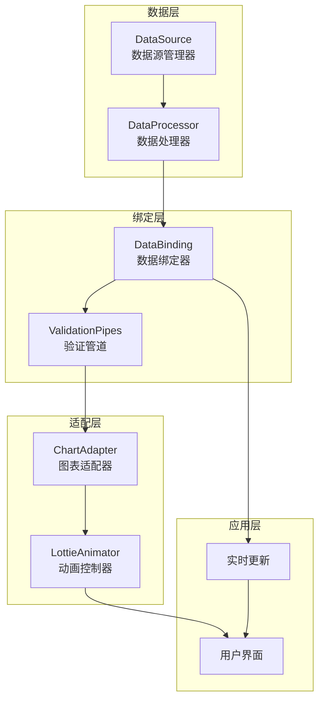

**架构图来源**
- [DataBinding.ts](file://packages/core/src/core/DataBinding.ts#L41-L50)
- [DataSource.ts](file://packages/core/src/core/DataSource.ts#L42-L60)
- [ChartAdapter.ts](file://packages/core/src/core/ChartAdapter.ts#L43-L56)

## DataBinding系统详解

DataBinding类是整个数据绑定系统的核心，负责建立数据与动画属性之间的桥梁。

### 数据绑定配置

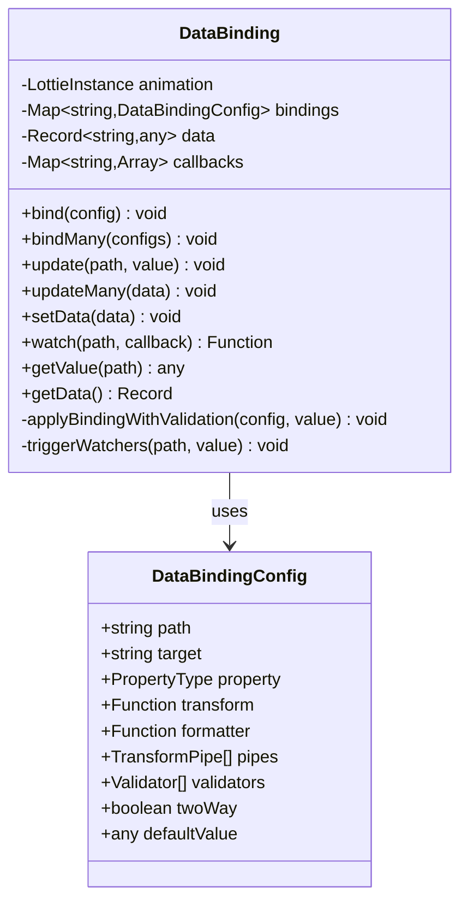

**类图来源**
- [DataBinding.ts](file://packages/core/src/core/DataBinding.ts#L16-L35)
- [DataBinding.ts](file://packages/core/src/core/DataBinding.ts#L41-L50)

### 核心API方法

| 方法名 | 参数 | 返回值 | 描述 |
|--------|------|--------|------|
| `bind()` | `DataBindingConfig` | `void` | 绑定单个数据到动画属性 |
| `bindMany()` | `DataBindingConfig[]` | `void` | 批量绑定多个数据 |
| `update()` | `string, any` | `void` | 更新指定路径的数据 |
| `updateMany()` | `Record<string,any>` | `void` | 批量更新多个数据 |
| `setData()` | `Record<string,any>` | `void` | 设置整个数据对象 |
| `watch()` | `string, Function` | `Function` | 监听数据变化，返回取消函数 |
| `getValue()` | `string` | `any` | 获取指定路径的值 |
| `getData()` | `void` | `Record<string,any>` | 获取完整数据对象 |

### 数据绑定流程

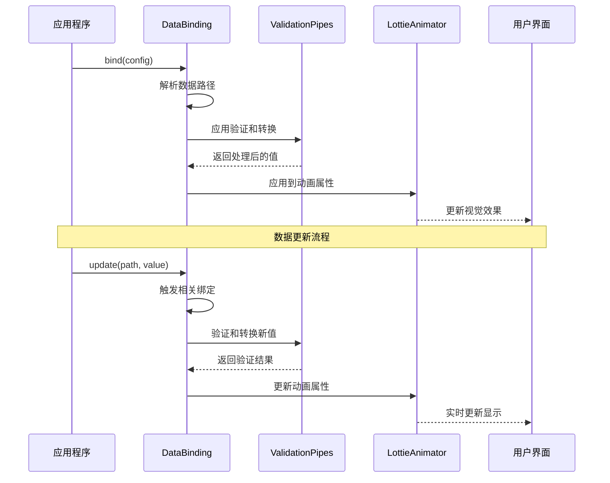

**序列图来源**
- [DataBinding.ts](file://packages/core/src/core/DataBinding.ts#L54-L125)

**节来源**
- [DataBinding.ts](file://packages/core/src/core/DataBinding.ts#L41-L541)

## DataSource多数据源支持

DataSource系统提供了统一的接口来处理各种类型的数据源，包括静态数据、API请求、WebSocket连接和Server-Sent Events。

### 数据源类型

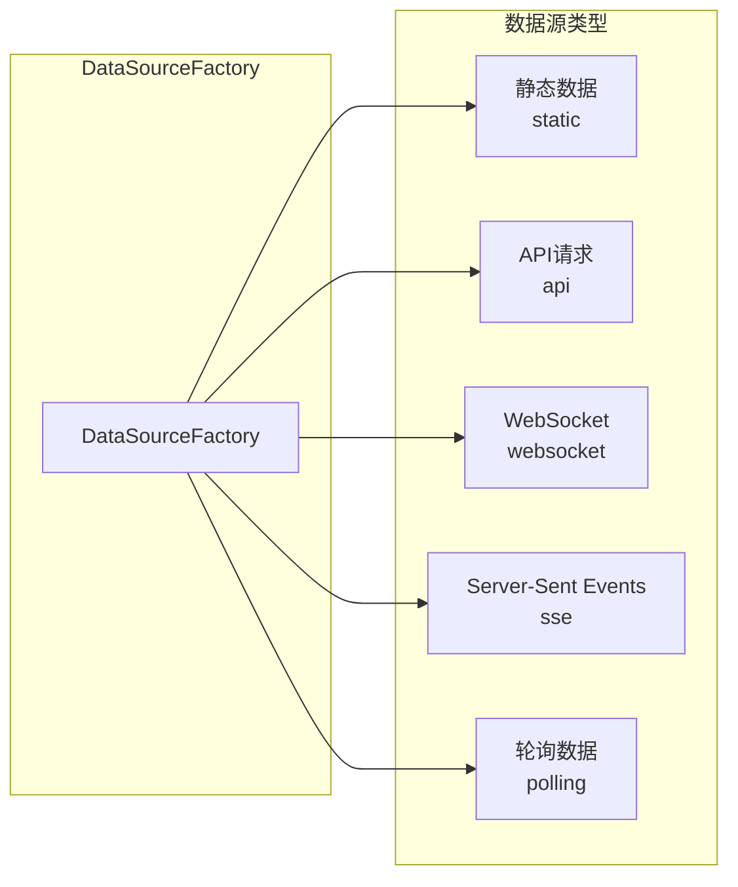

**图表来源**
- [DataSource.ts](file://packages/core/src/core/DataSource.ts#L387-L408)

### 数据源配置选项

| 配置项 | 类型 | 必需 | 描述 |
|--------|------|------|------|
| `type` | `DataSourceType` | 是 | 数据源类型 |
| `url` | `string` | API/SSE/WebSocket | 数据源地址 |
| `pollingInterval` | `number` | 轮询模式 | 轮询间隔（毫秒） |
| `headers` | `Record<string,string>` | 否 | 请求头 |
| `token` | `string` | 否 | 认证令牌 |
| `reconnect` | `Object` | 否 | 重连策略 |
| `transform` | `Function` | 否 | 数据转换函数 |
| `onError` | `Function` | 否 | 错误处理函数 |
| `enableCache` | `boolean` | 否 | 是否启用缓存 |

### 数据源生命周期

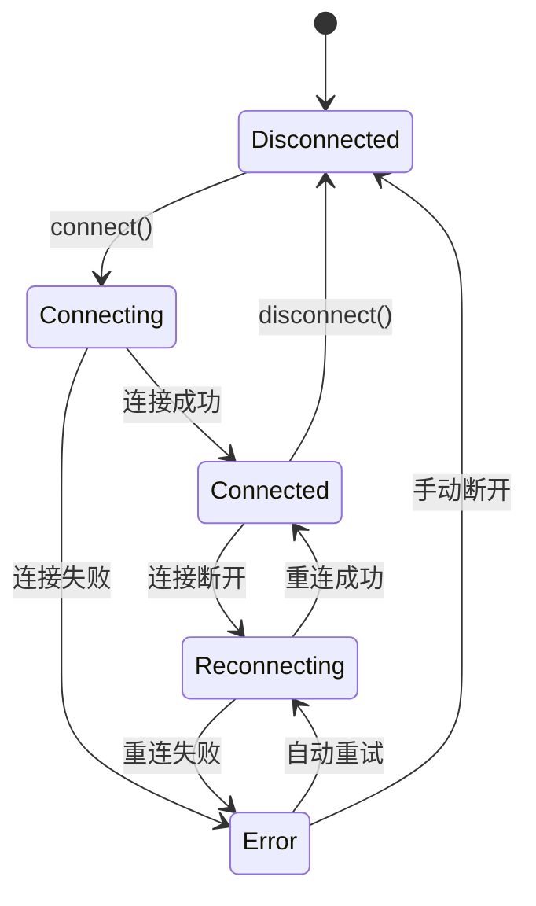

**状态图来源**
- [DataSource.ts](file://packages/core/src/core/DataSource.ts#L180-L264)

**节来源**
- [DataSource.ts](file://packages/core/src/core/DataSource.ts#L1-L411)

## ChartAdapter图表适配器

ChartAdapter专门用于将结构化数据转换为Lottie动画图表，支持多种图表类型和丰富的配置选项。

### 支持的图表类型

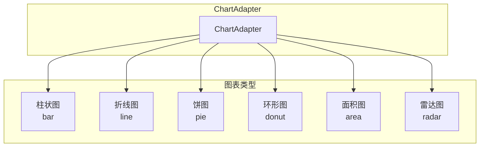

**图表来源**
- [ChartAdapter.ts](file://packages/core/src/core/ChartAdapter.ts#L10)

### 图表配置结构

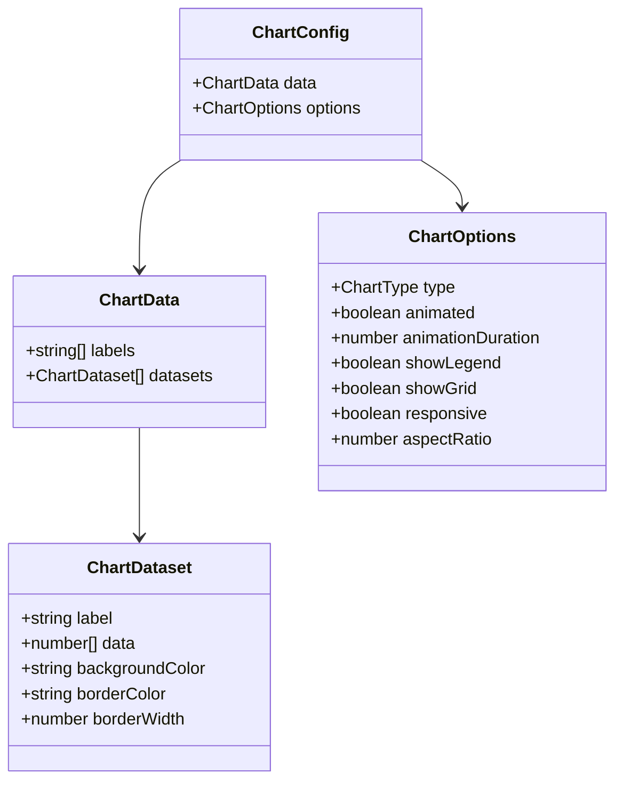

**类图来源**
- [ChartAdapter.ts](file://packages/core/src/core/ChartAdapter.ts#L12-L35)

### 图表更新机制

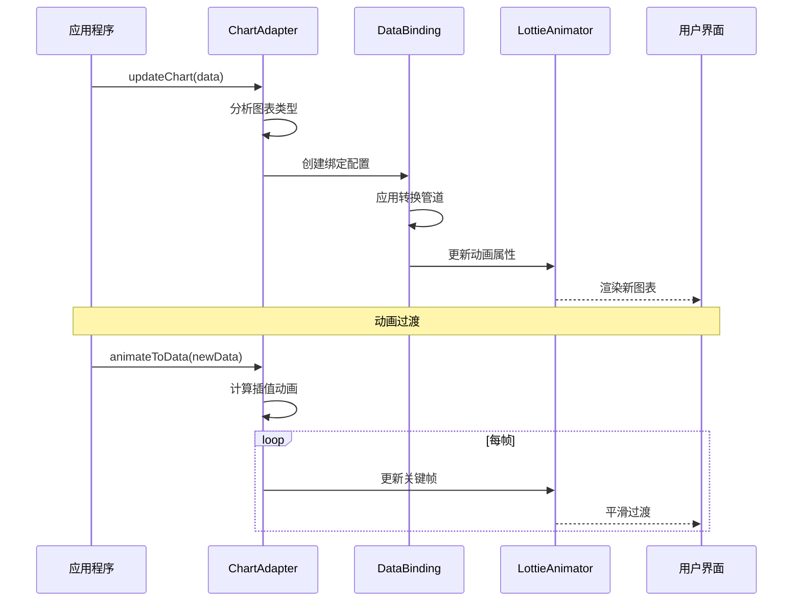

**序列图来源**
- [ChartAdapter.ts](file://packages/core/src/core/ChartAdapter.ts#L68-L128)

**节来源**
- [ChartAdapter.ts](file://packages/core/src/core/ChartAdapter.ts#L1-L405)

## 数据验证与转换管道

系统提供了完整的数据验证和转换机制，确保数据质量和一致性。

### 验证器系统

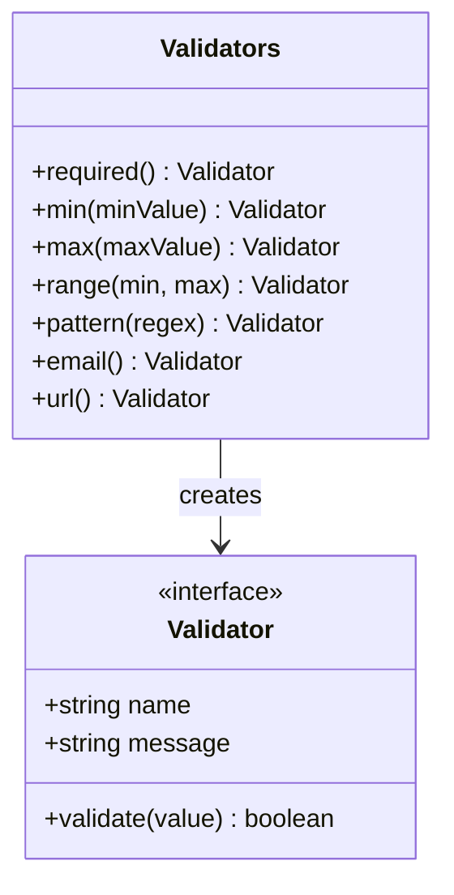

**类图来源**
- [ValidationPipes.ts](file://packages/core/src/core/ValidationPipes.ts#L6-L69)

### 内置验证器列表

| 验证器 | 参数 | 描述 | 示例 |
|--------|------|------|------|
| `required` | 无 | 检查值是否非空 | `{required: true}` |
| `min` | `number` | 检查最小值 | `{min: 0}` |
| `max` | `number` | 检查最大值 | `{max: 100}` |
| `range` | `number, number` | 检查数值范围 | `{range: [0, 100]}` |
| `pattern` | `RegExp` | 正则表达式匹配 | `{pattern: /^[A-Z]/}` |
| `email` | 无 | 邮箱格式验证 | `{email: true}` |
| `url` | 无 | URL格式验证 | `{url: true}` |

### 转换管道系统

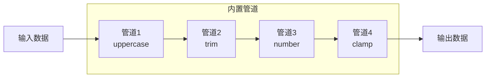

**流程图来源**
- [ValidationPipes.ts](file://packages/core/src/core/ValidationPipes.ts#L74-L107)

### 数据转换管道

| 管道 | 功能 | 参数 | 示例 |
|------|------|------|------|
| `uppercase` | 转大写 | 无 | `"hello" -> "HELLO"` |
| `lowercase` | 转小写 | 无 | `"HELLO" -> "hello"` |
| `trim` | 去除空白 | 无 | `"  hello  " -> "hello"` |
| `number` | 转数字 | 无 | `"42" -> 42` |
| `boolean` | 转布尔值 | 无 | `"true" -> true` |
| `round` | 四舍五入 | `decimals` | `3.14159 -> 3.14` |
| `clamp` | 数值限制 | `min, max` | `[0, 100]` |

**节来源**
- [ValidationPipes.ts](file://packages/core/src/core/ValidationPipes.ts#L1-L107)

## 响应式更新机制

数据绑定系统实现了高效的响应式更新机制，能够自动检测数据变化并触发相应的动画更新。

### 数据监听机制

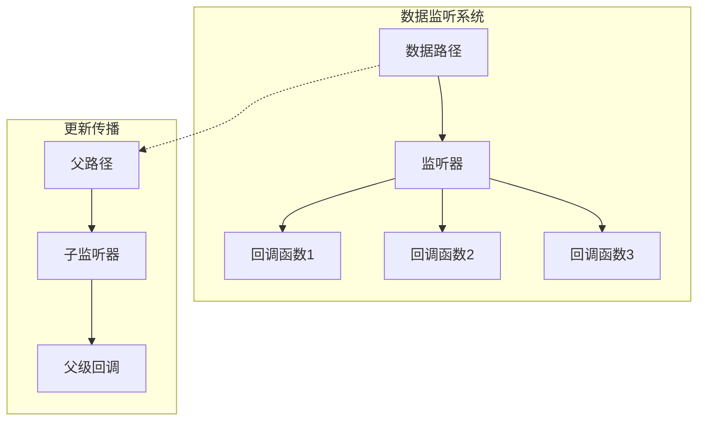

**图表来源**
- [DataBinding.ts](file://packages/core/src/core/DataBinding.ts#L54-L70)
- [DataBinding.ts](file://packages/core/src/core/DataBinding.ts#L515-L530)

### 更新传播规则

1. **精确匹配**：当更新特定路径时，只触发该路径的绑定
2. **父子传播**：更新子路径时，自动触发父路径的监听器
3. **批量更新**：支持一次性更新多个相关数据点
4. **去重处理**：避免重复触发相同的更新事件

### 错误恢复机制

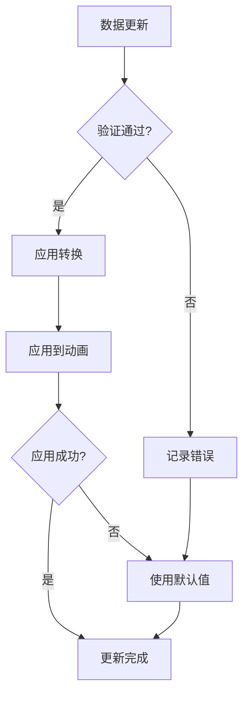

**流程图来源**
- [DataBinding.ts](file://packages/core/src/core/DataBinding.ts#L75-L101)

**节来源**
- [DataBinding.ts](file://packages/core/src/core/DataBinding.ts#L110-L126)

## 实际应用场景

### 仪表盘监控系统

```typescript
// 创建数据绑定实例
const binding = new DataBinding(lottieInstance);

// 绑定系统指标数据
binding.bind({
  path: 'system.cpu',
  target: 'cpuGauge',
  property: 'rotation',
  validators: [Validators.range(0, 100)],
  pipes: [Pipes.clamp(0, 100), (v) => v * 3.6], // 百分比转角度
  defaultValue: 0
});

binding.bind({
  path: 'system.memory',
  target: 'memoryBar',
  property: 'scale',
  pipes: [Pipes.clamp(0, 1), (v) => [1, v, 1]], // Y轴缩放
  defaultValue: 0
});
```

### 实时状态显示

```typescript
// WebSocket数据源连接
const ws = DataSourceFactory.create({
  type: 'websocket',
  url: 'wss://api.example.com/status',
  reconnect: { enabled: true, maxAttempts: 5 }
});

ws.on('data', (data) => {
  // 实时更新状态指示器
  binding.update('status.indicator', data.indicator);
  binding.update('status.message', data.message);
});

// 创建状态图表
const chart = new ChartAdapter(lottieInstance, {
  data: {
    labels: ['CPU', '内存', '磁盘', '网络'],
    datasets: [{
      data: [0, 0, 0, 0],
      backgroundColor: ['#FF6384', '#36A2EB', '#FFCE56', '#4BC0C0']
    }]
  },
  options: {
    type: 'pie',
    animated: true,
    animationDuration: 800
  }
});
```

### 电商销售面板

```typescript
// API数据源获取销售数据
const salesApi = DataSourceFactory.create({
  type: 'api',
  url: '/api/sales/dashboard',
  headers: { Authorization: 'Bearer token' },
  transform: (data) => ({
    revenue: data.totalRevenue,
    orders: data.orderCount,
    customers: data.newCustomers,
    conversion: data.conversionRate
  })
});

salesApi.on('data', (data) => {
  // 更新销售指标
  binding.update('sales.revenue', data.revenue);
  binding.update('sales.orders', data.orders);
  
  // 更新销售趋势图表
  chart.updateChart({
    labels: ['今日', '昨日', '本周', '本月'],
    datasets: [{
      data: [data.dailyTrend, data.weeklyTrend, data.monthlyTrend],
      backgroundColor: ['#4CAF50', '#2196F3', '#FF9800']
    }]
  });
});
```

**节来源**
- [FEATURES_SHOWCASE.md](file://FEATURES_SHOWCASE.md#L273-L324)

## 自定义扩展指南

### 创建自定义验证器

```typescript
// 自定义验证器示例
const customValidators = {
  // 百分比验证器
  percentage: {
    name: 'percentage',
    validate: (value: any) => {
      return typeof value === 'number' && value >= 0 && value <= 100;
    },
    message: '百分比必须在0-100之间'
  },
  
  // 字符串长度验证器
  minLength: (min: number) => ({
    name: 'minLength',
    validate: (value: any) => {
      return typeof value === 'string' && value.length >= min;
    },
    message: `字符串长度至少为${min}个字符`
  })
};

// 使用自定义验证器
binding.bind({
  path: 'user.age',
  target: 'ageText',
  property: 'text',
  validators: [
    Validators.required(),
    Validators.min(18),
    Validators.max(120),
    customValidators.percentage
  ]
});
```

### 开发自定义转换管道

```typescript
// 自定义转换管道
const customPipes = {
  // 货币格式化
  currency: (locale = 'zh-CN', currency = 'CNY') => ({
    name: 'currency',
    transform: (value: any) => {
      if (typeof value !== 'number') return value;
      return new Intl.NumberFormat(locale, {
        style: 'currency',
        currency: currency
      }).format(value);
    }
  }),
  
  // 时间格式化
  dateTime: (format = 'yyyy-MM-dd HH:mm:ss') => ({
    name: 'dateTime',
    transform: (value: any) => {
      if (!value) return '';
      const date = new Date(value);
      return format
        .replace('yyyy', date.getFullYear().toString())
        .replace('MM', String(date.getMonth() + 1).padStart(2, '0'))
        .replace('dd', String(date.getDate()).padStart(2, '0'))
        .replace('HH', String(date.getHours()).padStart(2, '0'))
        .replace('mm', String(date.getMinutes()).padStart(2, '0'))
        .replace('ss', String(date.getSeconds()).padStart(2, '0'));
    }
  })
};

// 在数据绑定中使用自定义管道
binding.bind({
  path: 'order.timestamp',
  target: 'timeText',
  property: 'text',
  pipes: [
    customPipes.dateTime('yyyy年MM月dd日 HH:mm'),
    (v) => `下单时间: ${v}`
  ]
});
```

### 扩展ChartAdapter

```typescript
// 自定义图表类型
class CustomChartAdapter extends ChartAdapter {
  constructor(instance: ILottieInstance, config: ChartConfig) {
    super(instance, config);
  }
  
  // 自定义雷达图实现
  private updateCustomRadarChart(data: ChartData): void {
    const maxValue = this.getMaxValue(data);
    const angleStep = 360 / data.labels.length;
    
    data.datasets.forEach((dataset, datasetIndex) => {
      dataset.data.forEach((value, index) => {
        const angle = index * angleStep;
        const radius = maxValue > 0 ? (value / maxValue) * 100 : 0;
        
        // 自定义雷达点样式
        this.binding.bind({
          path: `customRadar.${datasetIndex}.${index}`,
          target: `custom_point_${datasetIndex}_${index}`,
          property: 'scale',
          pipes: [
            (v) => [Math.max(0.5, v / 10), Math.max(0.5, v / 10), 1]
          ]
        });
      });
    });
  }
  
  // 重写图表类型判断
  protected override initialize(): void {
    switch (this.config.options.type) {
      case 'custom-radar':
        this.updateCustomRadarChart(this.currentData);
        break;
      default:
        super.initialize();
    }
  }
}

// 使用自定义图表
const customChart = new CustomChartAdapter(lottieInstance, {
  data: {
    labels: ['性能', '可用性', '安全性', '用户体验'],
    datasets: [{
      data: [85, 92, 78, 88],
      backgroundColor: ['#FF6384', '#36A2EB', '#FFCE56', '#4BC0C0']
    }]
  },
  options: {
    type: 'custom-radar',
    animated: true
  }
});
```

## 最佳实践与性能优化

### 数据绑定最佳实践

1. **合理使用数据路径**
   ```typescript
   // 推荐：使用层次化的数据路径
   binding.bind({
     path: 'user.profile.name',           // 明确的层级关系
     target: 'userNameText',
     property: 'text'
   });
   
   // 不推荐：过于宽泛的路径
   binding.bind({
     path: 'userData',                    // 可能包含大量无关数据
     target: 'userNameText',
     property: 'text'
   });
   ```

2. **适当的验证和转换**
   ```typescript
   binding.bind({
     path: 'temperature',
     target: 'tempGauge',
     property: 'rotation',
     validators: [Validators.range(-50, 100)], // 限制有效范围
     pipes: [Pipes.clamp(-50, 100), (v) => v * 3.6], // 防止异常值
     defaultValue: 20                        // 提供安全默认值
   });
   ```

3. **批量操作优化**
   ```typescript
   // 推荐：使用批量更新
   binding.updateMany({
     'metrics.cpu': cpuUsage,
     'metrics.memory': memoryUsage,
     'metrics.disk': diskUsage
   });
   
   // 效果相当于多次单独更新，但更高效
   ```

### 性能优化建议

1. **减少不必要的绑定**
   ```typescript
   // 只绑定真正需要更新的属性
   const essentialBindings = [
     { path: 'essential.data', target: 'essentialLayer', property: 'text' }
   ];
   
   // 避免绑定大量不常用的数据
   ```

2. **优化转换管道**
   ```typescript
   // 简化转换逻辑
   binding.bind({
     path: 'complex.data',
     target: 'visualElement',
     property: 'position',
     pipes: [
       // 避免复杂的嵌套计算
       (v) => [Math.round(v.x), Math.round(v.y)] 
     ]
   });
   ```

3. **合理使用缓存**
   ```typescript
   const dataSource = DataSourceFactory.create({
     type: 'api',
     url: '/api/data',
     enableCache: true,           // 启用缓存
     onError: (error) => {
       // 降级到缓存数据
       const cached = dataSource.getCache();
       if (cached) {
         binding.setData(cached);
       }
     }
   });
   ```

### 错误处理和调试

```typescript
// 完整的错误处理示例
const binding = new DataBinding(lottieInstance);

binding.bind({
  path: 'critical.data',
  target: 'criticalLayer',
  property: 'text',
  validators: [Validators.required()],
  pipes: [
    (v) => {
      if (v === undefined || v === null) {
        console.warn('数据缺失，使用默认值');
        return 'N/A';
      }
      return String(v);
    }
  ],
  defaultValue: '初始化中...'
});

// 监听绑定错误
binding.watch('critical.data', (value) => {
  if (value === undefined) {
    console.error('关键数据未加载');
  }
});
```

### 内存管理

```typescript
// 正确的资源清理
function cleanup() {
  // 清理数据绑定
  binding.clearBindings();
  binding.clearData();
  
  // 断开数据源连接
  dataSource.disconnect();
  
  // 销毁图表适配器
  chart.destroy();
  
  // 清理事件监听器
  listeners.forEach(unsubscribe => unsubscribe());
}
```

通过遵循这些最佳实践和优化建议，可以构建高性能、稳定可靠的数据绑定应用程序，充分发挥Lottie动画与动态数据结合的强大潜力。