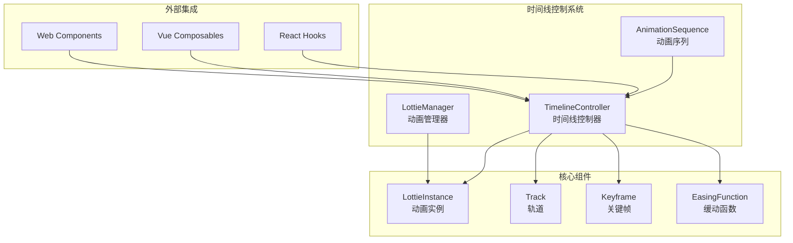
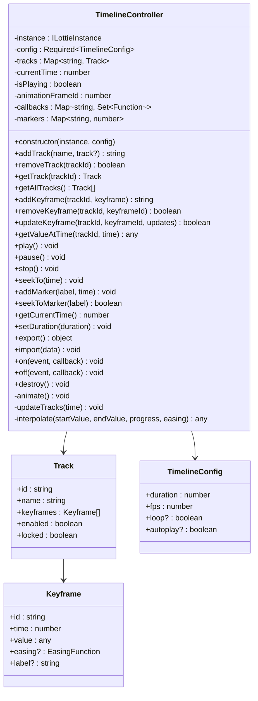
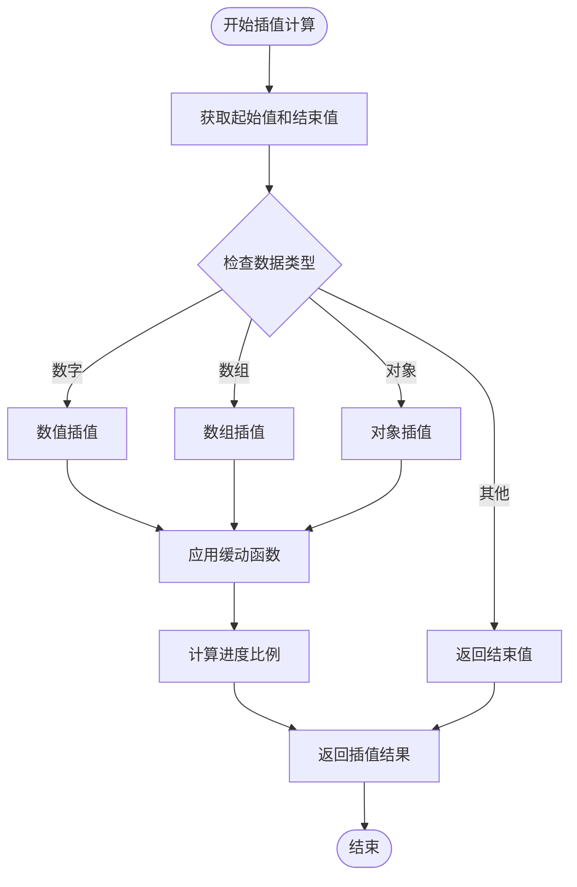
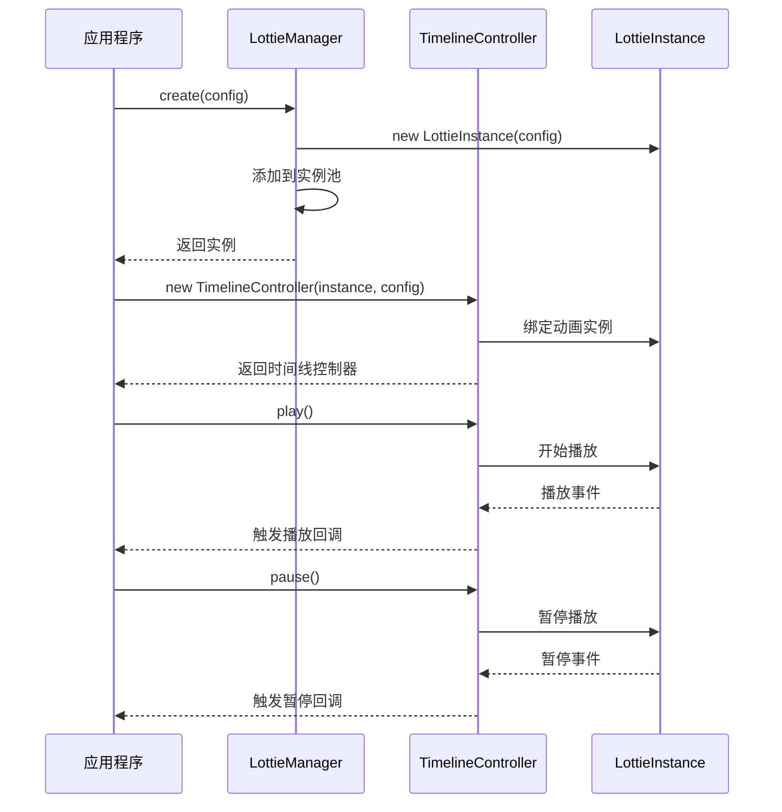
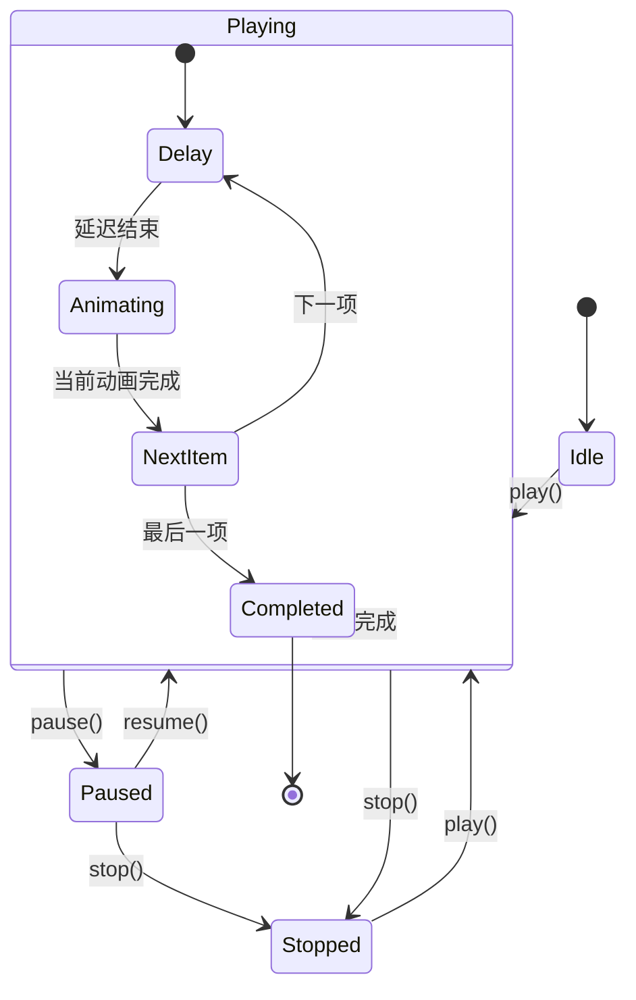

# 时间线控制

<cite>
**本文档引用的文件**
- [TimelineController.ts](file://packages/core/src/core/TimelineController.ts)
- [AnimationSequence.ts](file://packages/core/src/core/AnimationSequence.ts)
- [LottieManager.ts](file://packages/core/src/core/LottieManager.ts)
- [LottieInstance.ts](file://packages/core/src/core/LottieInstance.ts)
- [TimelineController.test.ts](file://packages/core/src/__tests__/TimelineController.test.ts)
- [App.tsx](file://packages/react/example/src/App.tsx)
- [App.vue](file://packages/vue/example/src/App.vue)
- [index.ts](file://packages/core/src/types/index.ts)
- [advanced-features.html](file://examples/advanced-features.html)
</cite>

## 目录
1. [简介](#简介)
2. [核心架构](#核心架构)
3. [TimelineController 核心功能](#timelinecontroller-核心功能)
4. [与 LottieManager 的集成](#与-lottiemanager-的集成)
5. [AnimationSequence 动画序列](#animationsequence-动画序列)
6. [实际使用示例](#实际使用示例)
7. [配置选项详解](#配置选项详解)
8. [性能优化建议](#性能优化建议)
9. [常见问题解决方案](#常见问题解决方案)
10. [最佳实践](#最佳实践)

## 简介

时间线控制是 Lottie 动画库中的核心功能模块，提供了高级的时间轴编辑、动画合成和精确控制能力。它允许开发者创建复杂的动画序列，实现精确的时间控制、关键帧管理和多轨道动画合成。

### 主要特性

- **精确时间控制**：支持毫秒级的时间精度控制
- **多轨道管理**：可同时管理多个动画轨道
- **关键帧系统**：强大的关键帧插值和缓动功能
- **实时预览**：即时查看动画效果
- **标记点系统**：方便的动画标记和跳转
- **事件驱动**：丰富的事件回调机制

## 核心架构



**图表来源**
- [TimelineController.ts](file://packages/core/src/core/TimelineController.ts#L51-L488)
- [AnimationSequence.ts](file://packages/core/src/core/AnimationSequence.ts#L22-L249)
- [LottieManager.ts](file://packages/core/src/core/LottieManager.ts#L16-L504)

## TimelineController 核心功能

### 类结构设计

TimelineController 是时间线控制的核心类，提供了完整的动画时间轴管理功能：



**图表来源**
- [TimelineController.ts](file://packages/core/src/core/TimelineController.ts#L51-L488)
- [index.ts](file://packages/core/src/types/index.ts#L151-L208)

### 关键帧插值算法

TimelineController 实现了强大的插值算法，支持多种数据类型的平滑过渡：



**图表来源**
- [TimelineController.ts](file://packages/core/src/core/TimelineController.ts#L195-L240)

**章节来源**
- [TimelineController.ts](file://packages/core/src/core/TimelineController.ts#L51-L488)

## 与 LottieManager 的集成

### 管理器模式

LottieManager 作为全局单例，负责管理所有的 Lottie 实例和时间线控制器：



**图表来源**
- [LottieManager.ts](file://packages/core/src/core/LottieManager.ts#L111-L183)
- [TimelineController.ts](file://packages/core/src/core/TimelineController.ts#L76-L87)

### 实例生命周期管理

LottieManager 提供了完整的实例生命周期管理功能：

| 方法 | 功能 | 参数 | 返回值 |
|------|------|------|--------|
| `create(config)` | 创建新的动画实例 | `LottieConfig` | `ILottieInstance` |
| `get(id)` | 获取指定ID的实例 | `string` | `ILottieInstance \| undefined` |
| `destroy(id)` | 销毁指定ID的实例 | `string` | `boolean` |
| `destroyAll()` | 销毁所有实例 | - | `void` |
| `playAll()` | 播放所有实例 | - | `void` |
| `pauseAll()` | 暂停所有实例 | - | `void` |
| `stopAll()` | 停止所有实例 | - | `void` |

**章节来源**
- [LottieManager.ts](file://packages/core/src/core/LottieManager.ts#L111-L282)

## AnimationSequence 动画序列

### 序列播放机制

AnimationSequence 提供了复杂的动画序列播放功能，支持延迟、持续时间和回调：



**图表来源**
- [AnimationSequence.ts](file://packages/core/src/core/AnimationSequence.ts#L55-L248)

### 序列配置选项

| 配置项 | 类型 | 默认值 | 描述 |
|--------|------|--------|------|
| `config` | `LottieConfig` | - | 动画配置对象 |
| `delay` | `number` | 0 | 延迟时间（毫秒） |
| `duration` | `number` | - | 持续时间（毫秒），不设置则播放完整动画 |
| `onComplete` | `Function` | - | 完成回调函数 |

**章节来源**
- [AnimationSequence.ts](file://packages/core/src/core/AnimationSequence.ts#L7-L16)

## 实际使用示例

### 基础时间线控制

以下展示了如何创建和控制基本的时间线：

```typescript
// 创建 Lottie 实例
const instance = lottieManager.create({
  container: document.getElementById('container'),
  path: 'animation.json',
  autoplay: false
})

// 创建时间线控制器
const timeline = new TimelineController(instance, {
  duration: 5,  // 5秒时长
  fps: 60,      // 60帧每秒
  loop: true,   // 循环播放
  autoplay: true // 自动播放
})

// 添加轨道
const trackId = timeline.addTrack('opacity')

// 添加关键帧
timeline.addKeyframe(trackId, {
  time: 0,
  value: 0,
  easing: 'easeInOut'
})
timeline.addKeyframe(trackId, {
  time: 2.5,
  value: 0.5,
  easing: 'easeInOut'
})
timeline.addKeyframe(trackId, {
  time: 5,
  value: 1,
  easing: 'easeInOut'
})

// 监听时间更新
timeline.on('timeUpdate', ({ time }) => {
  console.log(`当前时间: ${time}s`)
})
```

### React 集成示例

```typescript
import { useLottie } from '@ldesign/lottie-react'

function TimelineControlledAnimation() {
  const { containerRef, play, pause, stop, goToAndStop, setSpeed } = useLottie({
    path: 'animation.json',
    autoplay: false
  })

  // 控制时间线
  const handleSeek = (time: number) => {
    // 跳转到指定时间
    goToAndStop(time, true)
  }

  const handleSpeedChange = (speed: number) => {
    // 设置播放速度
    setSpeed(speed)
  }

  return (
    <div>
      <div ref={containerRef} className="lottie-player" />
      <div className="controls">
        <button onClick={play}>播放</button>
        <button onClick={pause}>暂停</button>
        <button onClick={stop}>停止</button>
        <input
          type="range"
          min="0.1"
          max="3"
          step="0.1"
          onChange={(e) => handleSpeedChange(parseFloat(e.target.value))}
        />
      </div>
    </div>
  )
}
```

### Vue 集成示例

```vue
<script setup>
import { ref } from 'vue'
import { useLottie } from '@ldesign/lottie-vue'

const speed = ref(1)
const currentFrame = ref(0)

const { containerRef, play, pause, stop, goToAndStop, goToAndPlay } = useLottie({
  path: 'animation.json',
  autoplay: false
})

const handleSeek = (frame: number) => {
  goToAndStop(frame, true)
}

const handlePlayFromFrame = (frame: number) => {
  goToAndPlay(frame, true)
}
</script>

<template>
  <div>
    <div ref="containerRef" class="lottie-player" />
    <div class="controls">
      <button @click="play">播放</button>
      <button @click="pause">暂停</button>
      <button @click="stop">停止</button>
      
      <label>
        速度: {{ speed }}
        <input
          type="range"
          v-model="speed"
          min="0.1"
          max="3"
          step="0.1"
        />
      </label>
      
      <label>
        帧: {{ currentFrame }}
        <input
          type="number"
          v-model="currentFrame"
          min="0"
          max="180"
        />
      </label>
      
      <button @click="handleSeek(currentFrame)">跳转到帧</button>
      <button @click="handlePlayFromFrame(currentFrame)">从帧播放</button>
    </div>
  </div>
</template>
```

**章节来源**
- [App.tsx](file://packages/react/example/src/App.tsx#L25-L323)
- [App.vue](file://packages/vue/example/src/App.vue#L16-L518)
- [advanced-features.html](file://examples/advanced-features.html#L295-L332)

## 配置选项详解

### TimelineConfig 配置

| 配置项 | 类型 | 必需 | 默认值 | 描述 |
|--------|------|------|--------|------|
| `duration` | `number` | 是 | - | 时间线总时长（秒） |
| `fps` | `number` | 是 | - | 帧率（每秒帧数） |
| `loop` | `boolean` | 否 | `false` | 是否循环播放 |
| `autoplay` | `boolean` | 否 | `false` | 是否自动播放 |

### Track 轨道配置

| 属性 | 类型 | 默认值 | 描述 |
|------|------|--------|------|
| `id` | `string` | 自动生成 | 轨道唯一标识符 |
| `name` | `string` | - | 轨道显示名称 |
| `keyframes` | `Keyframe[]` | `[]` | 关键帧列表 |
| `enabled` | `boolean` | `true` | 是否启用轨道 |
| `locked` | `boolean` | `false` | 是否锁定轨道（不可编辑） |

### Keyframe 关键帧配置

| 属性 | 类型 | 必需 | 描述 |
|------|------|------|------|
| `time` | `number` | 是 | 关键帧时间（秒） |
| `value` | `any` | 是 | 关键帧值 |
| `easing` | `EasingFunction` | 否 | 缓动函数 |
| `label` | `string` | 否 | 关键帧标签 |

### 缓动函数类型

| 函数名 | 描述 | 数学公式 |
|--------|------|----------|
| `'linear'` | 线性缓动 | `f(t) = t` |
| `'easeIn'` | 缓入 | `f(t) = t²` |
| `'easeOut'` | 缓出 | `f(t) = t × (2 - t)` |
| `'easeInOut'` | 缓入缓出 | `t < 0.5 ? 2t² : -1 + (4 - 2t)t` |
| `'easeInCubic'` | 三次缓入 | `f(t) = t³` |
| `'easeOutCubic'` | 三次缓出 | `f(t) = (t - 1)³ + 1` |
| `'easeInOutCubic'` | 三次缓入缓出 | `t < 0.5 ? 4t³ : (t - 1)(2t - 2)² + 1` |
| `'easeInQuart'` | 四次缓入 | `f(t) = t⁴` |
| `'easeOutQuart'` | 四次缓出 | `f(t) = 1 - (t - 1)⁴` |
| `'easeInOutQuart'` | 四次缓入缓出 | `t < 0.5 ? 8t⁴ : 1 - 8(t - 1)⁴` |

**章节来源**
- [TimelineController.ts](file://packages/core/src/core/TimelineController.ts#L24-L46)
- [index.ts](file://packages/core/src/types/index.ts#L115-L146)

## 性能优化建议

### 内存管理

1. **及时销毁实例**
```typescript
// 正确的做法
const timeline = new TimelineController(instance, config)
// 使用完毕后
timeline.destroy()

// 或者通过 LottieManager
lottieManager.destroy(instance.id)
```

2. **避免内存泄漏**
```typescript
// 使用事件监听时记得清理
timeline.on('play', callback)
// 组件卸载时
timeline.off('play', callback)
```

### 渲染优化

1. **合理设置帧率**
```typescript
// 根据设备性能调整帧率
const fps = isMobile ? 30 : 60
const timeline = new TimelineController(instance, { duration: 5, fps })
```

2. **使用合适的渲染器**
```typescript
// 移动设备推荐使用 Canvas
const instance = lottieManager.create({
  renderer: 'canvas',
  path: 'animation.json'
})
```

### 动画序列优化

1. **批量操作**
```typescript
// 使用 AnimationSequence 批量管理
const sequence = new AnimationSequence([
  { config: config1, delay: 1000 },
  { config: config2, delay: 500 },
  { config: config3 }
])
```

2. **预加载资源**
```typescript
// 预先加载动画资源
await lottieManager.preload('animation1.json')
await lottieManager.preload('animation2.json')
```

**章节来源**
- [LottieManager.ts](file://packages/core/src/core/LottieManager.ts#L312-L350)
- [TimelineController.ts](file://packages/core/src/core/TimelineController.ts#L480-L488)

## 常见问题解决方案

### 时间线同步异常

**问题描述**：多个时间线控制器之间出现时间不同步

**解决方案**：
```typescript
// 使用统一的时间源
class SharedTimeSource {
  private currentTime = 0
  private listeners = new Set<Function>()
  
  update(deltaTime: number) {
    this.currentTime += deltaTime
    this.notifyListeners()
  }
  
  subscribe(listener: Function) {
    this.listeners.add(listener)
  }
  
  unsubscribe(listener: Function) {
    this.listeners.delete(listener)
  }
  
  private notifyListeners() {
    this.listeners.forEach(listener => listener(this.currentTime))
  }
}

// 在时间线控制器中使用共享时间源
const sharedTime = new SharedTimeSource()
sharedTime.subscribe((time: number) => {
  timeline1.seekTo(time)
  timeline2.seekTo(time)
})
```

### 状态不一致问题

**问题描述**：动画状态与UI状态不一致

**解决方案**：
```typescript
// 使用状态管理模式
class AnimationStateManager {
  private state = {
    isPlaying: false,
    currentTime: 0,
    speed: 1
  }
  
  updateFromTimeline(timeline: TimelineController) {
    this.state = {
      isPlaying: timeline.isPlaying,
      currentTime: timeline.getCurrentTime(),
      speed: timeline.getSpeed()
    }
    this.notify()
  }
  
  updateFromUI(newState: Partial<typeof this.state>) {
    Object.assign(this.state, newState)
    this.notify()
  }
  
  private notify() {
    // 更新UI和其他组件
  }
}
```

### 性能问题诊断

**问题描述**：长时间运行后出现性能下降

**诊断步骤**：

1. **监控内存使用**
```typescript
// 使用性能监控
const stats = lottieManager.getGlobalStats()
console.log('内存使用:', stats.totalMemory, 'MB')
console.log('活跃实例:', stats.activeInstances)
console.log('平均FPS:', stats.averageFps)
```

2. **定期清理**
```typescript
// 定期执行垃圾回收
setInterval(() => {
  const { cleaned, cacheCleared } = lottieManager.optimize()
  if (cleaned > 0) {
    console.log(`清理了 ${cleaned} 个空闲实例`)
  }
  if (cacheCleared) {
    console.log('缓存已清理')
  }
}, 60000) // 每分钟执行一次
```

### 错误处理最佳实践

```typescript
class RobustTimelineController {
  private timeline: TimelineController
  
  constructor(instance: ILottieInstance, config: TimelineConfig) {
    try {
      this.timeline = new TimelineController(instance, config)
      this.setupErrorHandling()
    } catch (error) {
      console.error('时间线控制器初始化失败:', error)
      throw error
    }
  }
  
  private setupErrorHandling() {
    // 捕获插值过程中的错误
    this.timeline.on('trackUpdate', ({ trackId, value, time }) => {
      try {
        // 处理轨道更新
      } catch (error) {
        console.error(`轨道 ${trackId} 更新失败:`, error)
        // 可以在这里进行错误恢复
      }
    })
    
    // 捕获播放过程中的错误
    this.timeline.on('play', () => {
      try {
        // 播放逻辑
      } catch (error) {
        console.error('播放过程中发生错误:', error)
        this.timeline.pause()
      }
    })
  }
  
  destroy() {
    try {
      this.timeline.destroy()
    } catch (error) {
      console.error('销毁时间线控制器时发生错误:', error)
    }
  }
}
```

**章节来源**
- [TimelineController.ts](file://packages/core/src/core/TimelineController.ts#L467-L474)
- [LottieManager.ts](file://packages/core/src/core/LottieManager.ts#L410-L432)

## 最佳实践

### 1. 架构设计原则

**单一职责原则**：每个时间线控制器只负责一个特定的动画序列

```typescript
// 不好的做法
class BadAnimationManager {
  timeline1: TimelineController
  timeline2: TimelineController
  timeline3: TimelineController
  // 包含太多职责
}

// 好的做法
class AnimationManager {
  private timelines = new Map<string, TimelineController>()
  
  createTimeline(id: string, config: TimelineConfig): TimelineController {
    const timeline = new TimelineController(instance, config)
    this.timelines.set(id, timeline)
    return timeline
  }
  
  destroyTimeline(id: string): void {
    const timeline = this.timelines.get(id)
    if (timeline) {
      timeline.destroy()
      this.timelines.delete(id)
    }
  }
}
```

### 2. 事件处理模式

**使用事件委托**：对于大量相似的事件处理

```typescript
class EventManager {
  private eventHandlers = new Map<string, Set<Function>>()
  
  registerHandler(event: string, handler: Function): void {
    if (!this.eventHandlers.has(event)) {
      this.eventHandlers.set(event, new Set())
    }
    this.eventHandlers.get(event)!.add(handler)
  }
  
  triggerEvent(event: string, data?: any): void {
    const handlers = this.eventHandlers.get(event)
    if (handlers) {
      handlers.forEach(handler => {
        try {
          handler(data)
        } catch (error) {
          console.error(`事件 ${event} 处理失败:`, error)
        }
      })
    }
  }
}
```

### 3. 状态管理

**使用状态机模式**：管理复杂的时间线状态

```typescript
enum TimelineState {
  IDLE,
  PLAYING,
  PAUSED,
  SEEKING,
  COMPLETED
}

class StateMachineTimeline {
  private state: TimelineState = TimelineState.IDLE
  private timeline: TimelineController
  
  play(): void {
    if (this.state === TimelineState.PAUSED) {
      this.state = TimelineState.PLAYING
      this.timeline.play()
    }
  }
  
  pause(): void {
    if (this.state === TimelineState.PLAYING) {
      this.state = TimelineState.PAUSED
      this.timeline.pause()
    }
  }
  
  seekTo(time: number): void {
    if (this.state !== TimelineState.COMPLETED) {
      this.state = TimelineState.SEEKING
      this.timeline.seekTo(time)
      this.state = TimelineState.PLAYING
    }
  }
}
```

### 4. 测试策略

**单元测试覆盖**：确保时间线功能的正确性

```typescript
describe('TimelineController', () => {
  let timeline: TimelineController
  let mockInstance: ILottieInstance
  
  beforeEach(() => {
    mockInstance = createMockInstance()
    timeline = new TimelineController(mockInstance, {
      duration: 5,
      fps: 60
    })
  })
  
  afterEach(() => {
    timeline.destroy()
  })
  
  test('应该能够正确添加轨道', () => {
    const trackId = timeline.addTrack('opacity')
    expect(trackId).toBeDefined()
    expect(timeline.getTrack(trackId)).toBeDefined()
  })
  
  test('应该能够正确插值关键帧', () => {
    const trackId = timeline.addTrack('position')
    timeline.addKeyframe(trackId, { time: 0, value: 0 })
    timeline.addKeyframe(trackId, { time: 2, value: 100 })
    
    const value = timeline.getValueAtTime(trackId, 1)
    expect(value).toBeCloseTo(50) // 应该是中间值
  })
  
  test('应该支持缓动函数', () => {
    const trackId = timeline.addTrack('position')
    timeline.addKeyframe(trackId, { time: 0, value: 0, easing: 'easeInOut' })
    timeline.addKeyframe(trackId, { time: 2, value: 100 })
    
    const value = timeline.getValueAtTime(trackId, 1)
    // 缓动函数应该产生非线性的值
    expect(value).not.toBe(50)
  })
})
```

### 5. 错误边界处理

**实现错误边界**：防止单个时间线错误影响整个应用

```typescript
class SafeTimelineController {
  private timeline: TimelineController
  private errorHandler: (error: Error) => void
  
  constructor(instance: ILottieInstance, config: TimelineConfig, errorHandler?: (error: Error) => void) {
    this.errorHandler = errorHandler || ((error) => console.error(error))
    
    try {
      this.timeline = new TimelineController(instance, config)
      this.setupSafeWrappers()
    } catch (error) {
      this.errorHandler(error instanceof Error ? error : new Error(String(error)))
      throw error
    }
  }
  
  private setupSafeWrappers(): void {
    const originalMethods = [
      'play', 'pause', 'stop', 'seekTo', 'addTrack', 'removeTrack',
      'addKeyframe', 'removeKeyframe', 'updateKeyframe'
    ]
    
    originalMethods.forEach(methodName => {
      const originalMethod = this.timeline[methodName as keyof TimelineController]
      if (typeof originalMethod === 'function') {
        (this.timeline as any)[methodName] = (...args: any[]) => {
          try {
            return originalMethod.apply(this.timeline, args)
          } catch (error) {
            this.errorHandler(error instanceof Error ? error : new Error(String(error)))
            return null
          }
        }
      }
    })
  }
  
  destroy(): void {
    try {
      this.timeline.destroy()
    } catch (error) {
      this.errorHandler(error instanceof Error ? error : new Error(String(error)))
    }
  }
}
```

这些最佳实践可以帮助开发者构建稳定、高效且易于维护的时间线控制系统，确保在各种复杂场景下都能提供良好的用户体验。