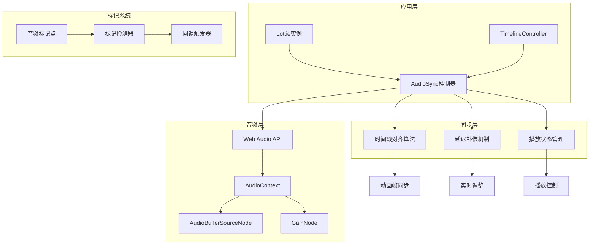
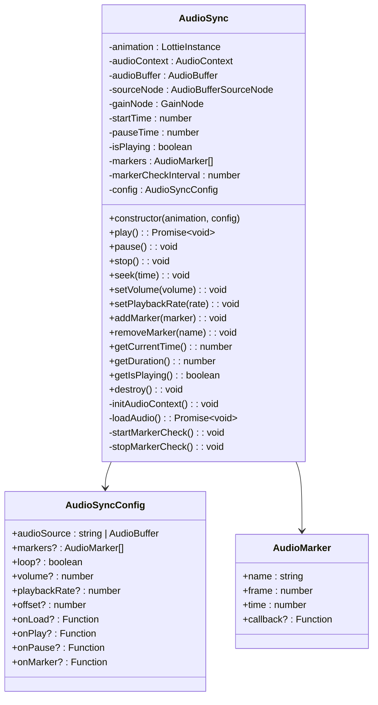
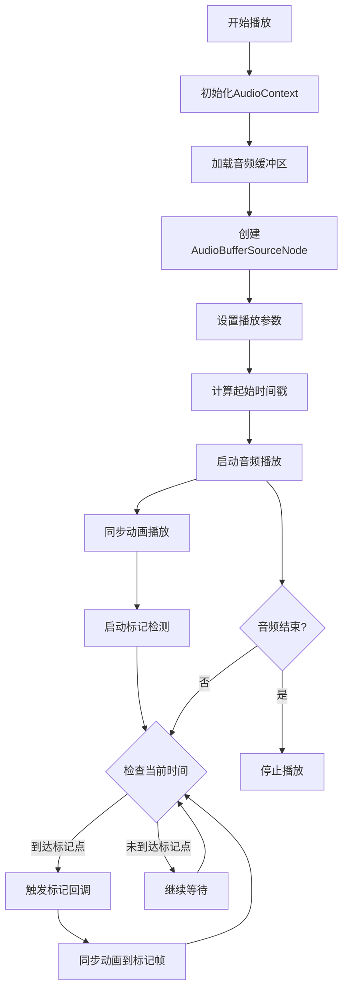
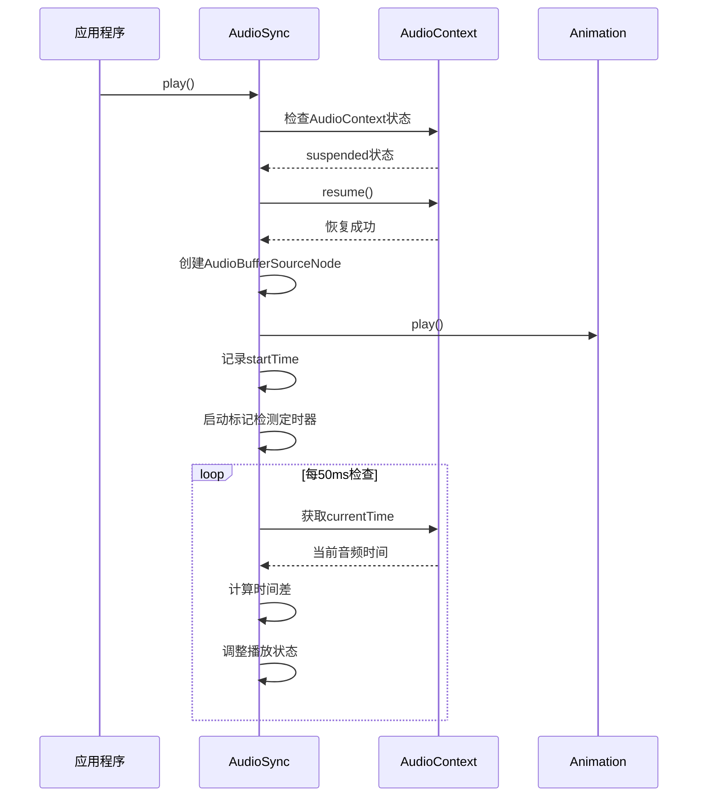
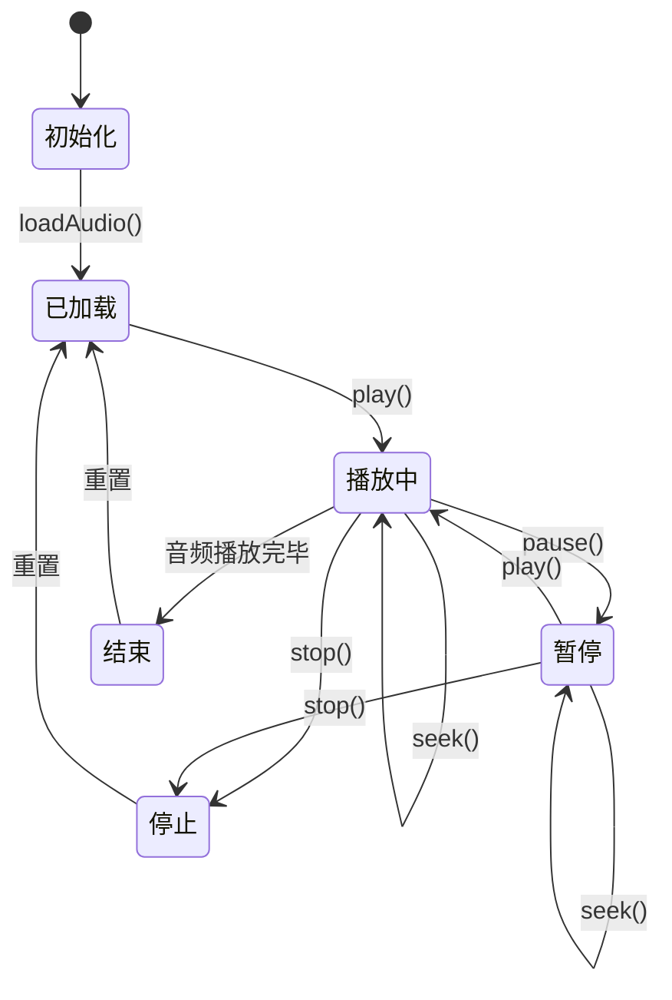
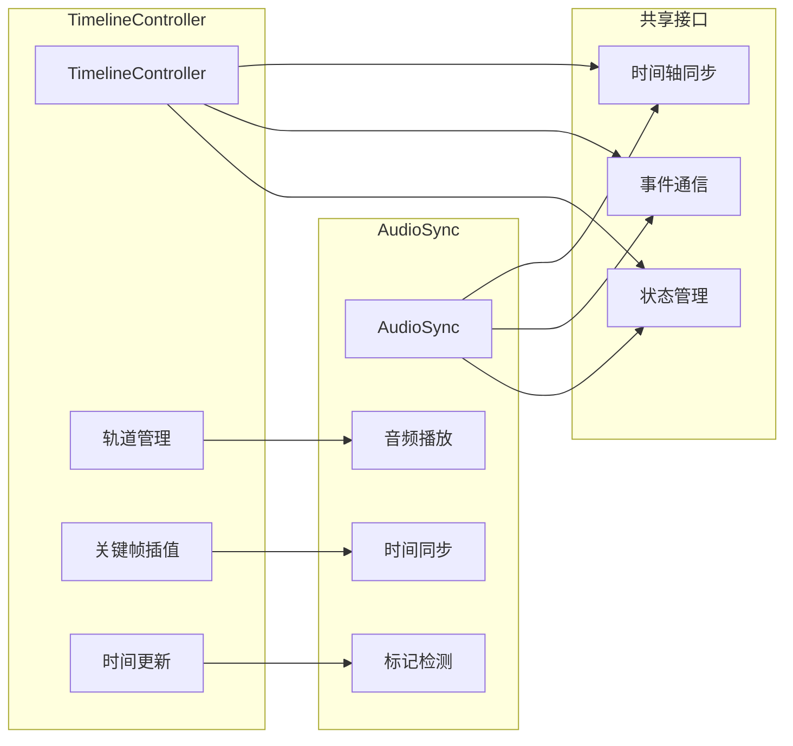
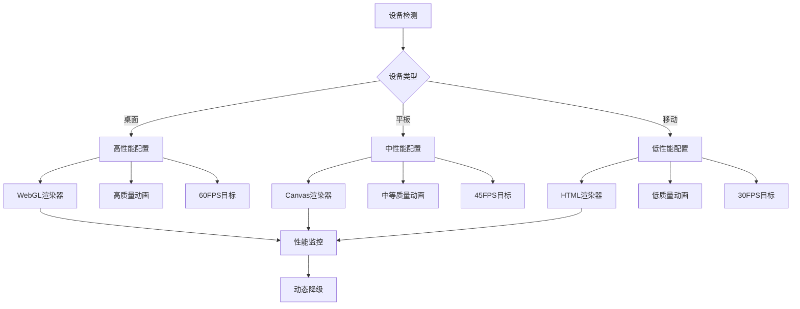
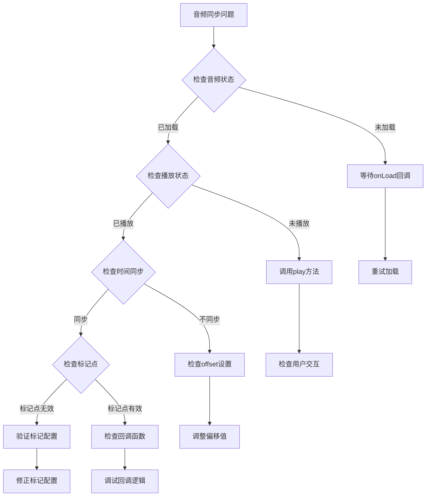
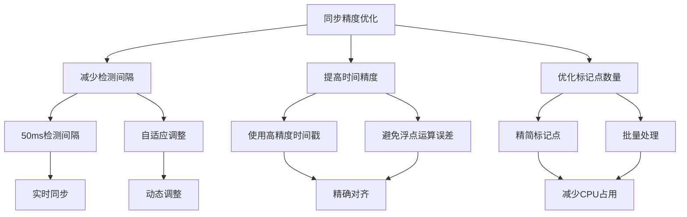

# 音频同步

<cite>
**本文档引用的文件**
- [AudioSync.ts](file://packages/core/src/core/AudioSync.ts)
- [TimelineController.ts](file://packages/core/src/core/TimelineController.ts)
- [index.ts](file://packages/core/src/types/index.ts)
- [device.ts](file://packages/core/src/utils/device.ts)
- [App.tsx](file://examples/react-demo/src/App.tsx)
- [advanced-features.html](file://examples/advanced-features.html)
</cite>

## 目录
1. [简介](#简介)
2. [系统架构](#系统架构)
3. [核心组件分析](#核心组件分析)
4. [时间戳对齐算法](#时间戳对齐算法)
5. [延迟补偿机制](#延迟补偿机制)
6. [播放状态联动逻辑](#播放状态联动逻辑)
7. [与TimelineController的集成](#与timelinecontroller的集成)
8. [配置参数详解](#配置参数详解)
9. [设备适配策略](#设备适配策略)
10. [错误处理与故障排除](#错误处理与故障排除)
11. [性能调优建议](#性能调优建议)
12. [使用示例](#使用示例)

## 简介

AudioSync模块是Lottie动画库中的核心音频同步系统，负责实现Lottie动画与音频流的精确同步。该模块通过Web Audio API提供高精度的时间戳对齐、动态延迟补偿和播放状态联动功能，确保动画与音频在视觉和听觉上完美匹配。

AudioSync模块的主要特性包括：
- 基于Web Audio API的高精度音频播放控制
- 时间戳对齐算法，确保动画帧与音频时间点的精确对应
- 动态延迟补偿机制，适应不同设备和网络条件
- 与TimelineController的深度集成，支持复杂的时间线控制
- 完善的错误处理和设备适配策略

## 系统架构

AudioSync模块采用分层架构设计，包含音频处理层、时间同步层和应用接口层：



**图表来源**
- [AudioSync.ts](file://packages/core/src/core/AudioSync.ts#L47-L326)
- [TimelineController.ts](file://packages/core/src/core/TimelineController.ts#L51-L488)

## 核心组件分析

### AudioSync类结构

AudioSync类是整个音频同步系统的核心，提供了完整的音频播放和同步控制功能：



**图表来源**
- [AudioSync.ts](file://packages/core/src/core/AudioSync.ts#L6-L41)
- [AudioSync.ts](file://packages/core/src/core/AudioSync.ts#L47-L326)

### 关键属性说明

| 属性 | 类型 | 描述 | 默认值 |
|------|------|------|--------|
| `audioContext` | `AudioContext \| null` | Web Audio API上下文 | `null` |
| `audioBuffer` | `AudioBuffer \| null` | 音频缓冲区 | `null` |
| `sourceNode` | `AudioBufferSourceNode \| null` | 音频源节点 | `null` |
| `gainNode` | `GainNode \| null` | 音量控制节点 | `null` |
| `startTime` | `number` | 播放开始时间戳 | `0` |
| `pauseTime` | `number` | 暂停时的时间戳 | `0` |
| `isPlaying` | `boolean` | 播放状态标志 | `false` |
| `markers` | `AudioMarker[]` | 音频标记点数组 | `[]` |

**章节来源**
- [AudioSync.ts](file://packages/core/src/core/AudioSync.ts#L48-L58)

## 时间戳对齐算法

AudioSync模块实现了精密的时间戳对齐算法，确保动画帧与音频时间点的精确对应：

### 核心对齐流程



**图表来源**
- [AudioSync.ts](file://packages/core/src/core/AudioSync.ts#L116-L155)
- [AudioSync.ts](file://packages/core/src/core/AudioSync.ts#L245-L275)

### 时间戳计算公式

AudioSync使用以下公式进行精确的时间戳计算：

- **起始时间计算**：`startTime = audioContext.currentTime - offset`
- **当前播放时间**：`currentTime = isPlaying ? audioContext.currentTime - startTime : pauseTime`
- **动画帧映射**：`targetFrame = (currentTime / duration) * totalFrames`

**章节来源**
- [AudioSync.ts](file://packages/core/src/core/AudioSync.ts#L134-L135)
- [AudioSync.ts](file://packages/core/src/core/AudioSync.ts#L217-L220)

## 延迟补偿机制

为了应对网络延迟、设备性能差异和浏览器自动播放策略，AudioSync实现了动态延迟补偿机制：

### 延迟检测与补偿



**图表来源**
- [AudioSync.ts](file://packages/core/src/core/AudioSync.ts#L122-L125)
- [AudioSync.ts](file://packages/core/src/core/AudioSync.ts#L245-L275)

### 补偿策略

1. **浏览器自动播放策略处理**：自动恢复被挂起的AudioContext
2. **网络延迟补偿**：通过定时器检测和调整播放时机
3. **设备性能适配**：根据设备性能动态调整检测频率

**章节来源**
- [AudioSync.ts](file://packages/core/src/core/AudioSync.ts#L122-L125)
- [AudioSync.ts](file://packages/core/src/core/AudioSync.ts#L275-L276)

## 播放状态联动逻辑

AudioSync模块实现了完整的播放状态联动机制，确保音频和动画的同步播放：

### 状态转换图



**图表来源**
- [AudioSync.ts](file://packages/core/src/core/AudioSync.ts#L116-L182)

### 状态同步机制

| 操作 | 音频状态 | 动画状态 | 回调触发 |
|------|----------|----------|----------|
| `play()` | 开始播放 | 开始播放 | `onPlay` |
| `pause()` | 暂停播放 | 暂停播放 | `onPause` |
| `stop()` | 停止播放 | 停止播放 | - |
| `seek(time)` | 跳转到指定时间 | 同步跳转到对应帧 | - |
| `setVolume()` | 调整音量 | - | - |
| `setPlaybackRate()` | 调整播放速率 | 同步调整 | - |

**章节来源**
- [AudioSync.ts](file://packages/core/src/core/AudioSync.ts#L116-L182)

## 与TimelineController的集成

AudioSync与TimelineController通过共享时间轴和事件系统实现深度集成：

### 集成架构



**图表来源**
- [TimelineController.ts](file://packages/core/src/core/TimelineController.ts#L51-L488)
- [AudioSync.ts](file://packages/core/src/core/AudioSync.ts#L47-L326)

### 集成特性

1. **时间轴同步**：TimelineController提供精确的时间信息，AudioSync基于此进行同步播放
2. **事件驱动**：两个模块通过事件系统进行通信，实现状态同步
3. **标记点联动**：TimelineController的标记点可以触发AudioSync的回调
4. **播放控制统一**：支持同时控制动画和音频的播放状态

**章节来源**
- [TimelineController.ts](file://packages/core/src/core/TimelineController.ts#L348-L361)

## 配置参数详解

AudioSync提供了丰富的配置参数，支持各种使用场景：

### 核心配置参数

| 参数名 | 类型 | 描述 | 默认值 |
|--------|------|------|--------|
| `audioSource` | `string \| AudioBuffer` | 音频源URL或AudioBuffer对象 | 必需 |
| `markers` | `AudioMarker[]` | 音频标记点数组 | `[]` |
| `loop` | `boolean` | 是否循环播放 | `false` |
| `volume` | `number` | 音量（0-1） | `1` |
| `playbackRate` | `number` | 播放速率 | `1` |
| `offset` | `number` | 同步偏移（毫秒） | `0` |

### 回调函数配置

| 回调函数 | 触发时机 | 参数类型 | 用途 |
|----------|----------|----------|------|
| `onLoad` | 音频加载完成 | `() => void` | 加载完成通知 |
| `onPlay` | 开始播放 | `() => void` | 播放开始通知 |
| `onPause` | 暂停播放 | `() => void` | 暂停通知 |
| `onMarker` | 到达标记点 | `(marker: AudioMarker) => void` | 标记点触发 |

### 音频标记点配置

```typescript
interface AudioMarker {
  name: string;           // 标记名称
  frame: number;          // 动画帧位置
  time: number;           // 音频时间（秒）
  callback?: () => void;  // 回调函数
}
```

**章节来源**
- [AudioSync.ts](file://packages/core/src/core/AudioSync.ts#L20-L41)

## 设备适配策略

AudioSync模块针对不同设备和网络条件实现了智能适配策略：

### 设备检测与性能评估



**图表来源**
- [device.ts](file://packages/core/src/utils/device.ts#L116-L142)

### 网络条件适配

1. **音频预加载策略**：根据网络状况决定是否预加载完整音频
2. **缓冲区管理**：动态调整音频缓冲区大小以适应网络带宽
3. **错误恢复机制**：网络中断时的自动重试和降级策略

### 浏览器兼容性

- **Web Audio API支持检测**：自动检测浏览器对Web Audio API的支持
- **AudioContext状态管理**：处理浏览器自动播放策略和用户交互要求
- **回退方案**：不支持Web Audio API时的替代方案

**章节来源**
- [AudioSync.ts](file://packages/core/src/core/AudioSync.ts#L78-L86)
- [device.ts](file://packages/core/src/utils/device.ts#L101-L111)

## 错误处理与故障排除

AudioSync模块实现了完善的错误处理机制，帮助开发者快速定位和解决问题：

### 常见错误类型

| 错误类型 | 错误信息 | 可能原因 | 解决方案 |
|----------|----------|----------|----------|
| `AudioContext初始化失败` | `[AudioSync] Failed to initialize AudioContext:` | 浏览器不支持Web Audio API | 检查浏览器兼容性 |
| `音频加载失败` | `[AudioSync] Failed to load audio:` | 网络问题或音频格式不支持 | 检查音频URL和格式 |
| `AudioContext被挂起` | `[AudioSync] AudioContext suspended` | 浏览器自动播放策略 | 用户交互后恢复 |
| `音频未准备好` | `[AudioSync] Audio not ready` | 音频加载未完成 | 等待onLoad回调 |

### 故障排除流程



### 调试工具和技巧

1. **启用详细日志**：通过控制台输出详细的调试信息
2. **性能监控**：使用内置的性能监控功能检测同步偏差
3. **时间戳对比**：比较音频时间和动画时间的差异
4. **标记点验证**：确认标记点的配置和触发时机

**章节来源**
- [AudioSync.ts](file://packages/core/src/core/AudioSync.ts#L85-L86)
- [AudioSync.ts](file://packages/core/src/core/AudioSync.ts#L109-L110)

## 性能调优建议

为了获得最佳的音频同步性能，建议遵循以下调优原则：

### 音频文件优化

1. **音频格式选择**：优先使用MP3或AAC格式，确保浏览器兼容性
2. **采样率优化**：根据内容需求选择合适的采样率（通常44.1kHz足够）
3. **编码质量**：平衡文件大小和音质，避免过高的比特率
4. **预处理**：使用音频编辑软件进行必要的预处理

### 同步精度优化



### 内存和CPU优化

1. **音频缓冲区管理**：合理设置缓冲区大小，避免内存泄漏
2. **定时器优化**：使用适当的检测频率，平衡精度和性能
3. **事件监听优化**：及时清理不需要的事件监听器
4. **垃圾回收友好**：避免创建不必要的临时对象

### 网络优化策略

1. **CDN加速**：使用CDN分发音频文件
2. **压缩传输**：启用gzip等压缩算法
3. **预加载策略**：根据用户行为预加载音频资源
4. **断点续传**：支持大文件的断点续传

## 使用示例

以下是AudioSync模块的各种使用示例：

### 基础音频同步

```typescript
// 创建Lottie实例
const lottieInstance = createLottie({
  container: '#animation-container',
  path: 'animation.json',
  autoplay: false
});

// 创建AudioSync实例
const audioSync = new AudioSync(lottieInstance, {
  audioSource: 'audio.mp3',
  loop: true,
  volume: 0.8,
  offset: 0,
  
  onLoad: () => {
    console.log('音频加载完成');
  },
  
  onPlay: () => {
    console.log('开始播放');
  },
  
  onPause: () => {
    console.log('暂停播放');
  }
});

// 同步播放
async function startSync() {
  await lottieInstance.load();
  await audioSync.play();
}
```

### 带标记点的音频同步

```typescript
const audioSync = new AudioSync(lottieInstance, {
  audioSource: 'music.mp3',
  markers: [
    {
      name: 'intro',
      frame: 30,
      time: 2.5,
      callback: () => {
        console.log('进入介绍部分');
      }
    },
    {
      name: 'verse',
      frame: 120,
      time: 15.0,
      callback: () => {
        console.log('进入主歌部分');
      }
    }
  ],
  
  onMarker: (marker) => {
    console.log(`到达标记点: ${marker.name}`);
  }
});
```

### 与TimelineController集成

```typescript
// 创建TimelineController
const timeline = new TimelineController(lottieInstance, {
  duration: 30,
  fps: 60
});

// 添加轨道和关键帧
const track = timeline.addTrack('audioSync');
timeline.addKeyframe(track, { time: 0, value: 0 });
timeline.addKeyframe(track, { time: 15, value: 1 });

// 在时间更新时同步音频
timeline.on('timeUpdate', ({ time }) => {
  const audioLevel = timeline.getValueAtTime(track, time);
  audioSync.setVolume(audioLevel);
});
```

### 高级配置示例

```typescript
const audioSync = new AudioSync(lottieInstance, {
  audioSource: audioBuffer, // 使用预加载的AudioBuffer
  loop: false,
  playbackRate: 1.2, // 120%播放速度
  offset: -50, // 提前50ms开始
  
  // 错误处理
  onLoad: () => {
    console.log('音频加载成功');
  },
  
  onPlay: () => {
    console.log('音频开始播放');
  },
  
  onPause: () => {
    console.log('音频暂停');
  },
  
  onMarker: (marker) => {
    // 根据标记点执行特定操作
    switch (marker.name) {
      case 'beat':
        // 节拍同步效果
        break;
      case 'transition':
        // 场景切换
        break;
    }
  }
});
```

**章节来源**
- [App.tsx](file://examples/react-demo/src/App.tsx#L56-L196)
- [advanced-features.html](file://examples/advanced-features.html#L295-L378)

## 总结

AudioSync模块为Lottie动画提供了专业级的音频同步解决方案。通过精密的时间戳对齐算法、智能的延迟补偿机制和完善的错误处理，确保了动画与音频的完美同步。模块的可配置性和扩展性使其能够适应各种复杂的使用场景，从简单的背景音乐到复杂的交互式音频动画。

开发者在使用AudioSync时应注意音频文件的选择、网络条件的考虑以及设备性能的适配。通过合理的配置和优化，可以获得最佳的用户体验和开发效率。