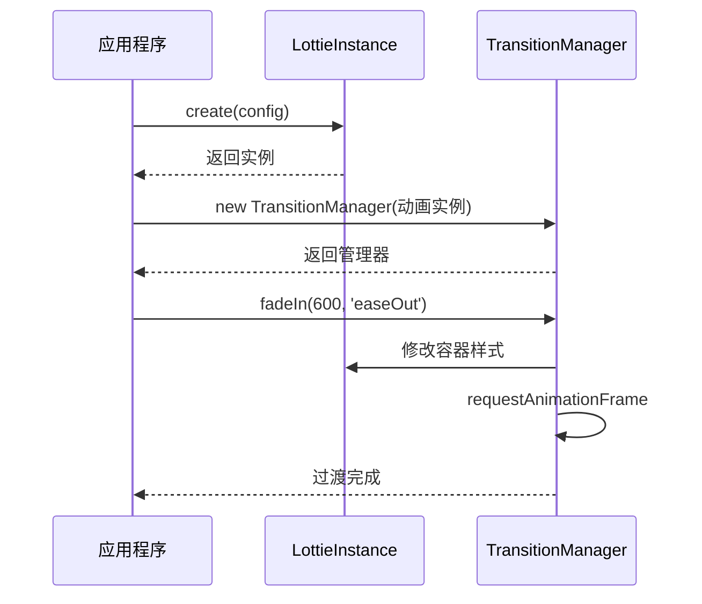
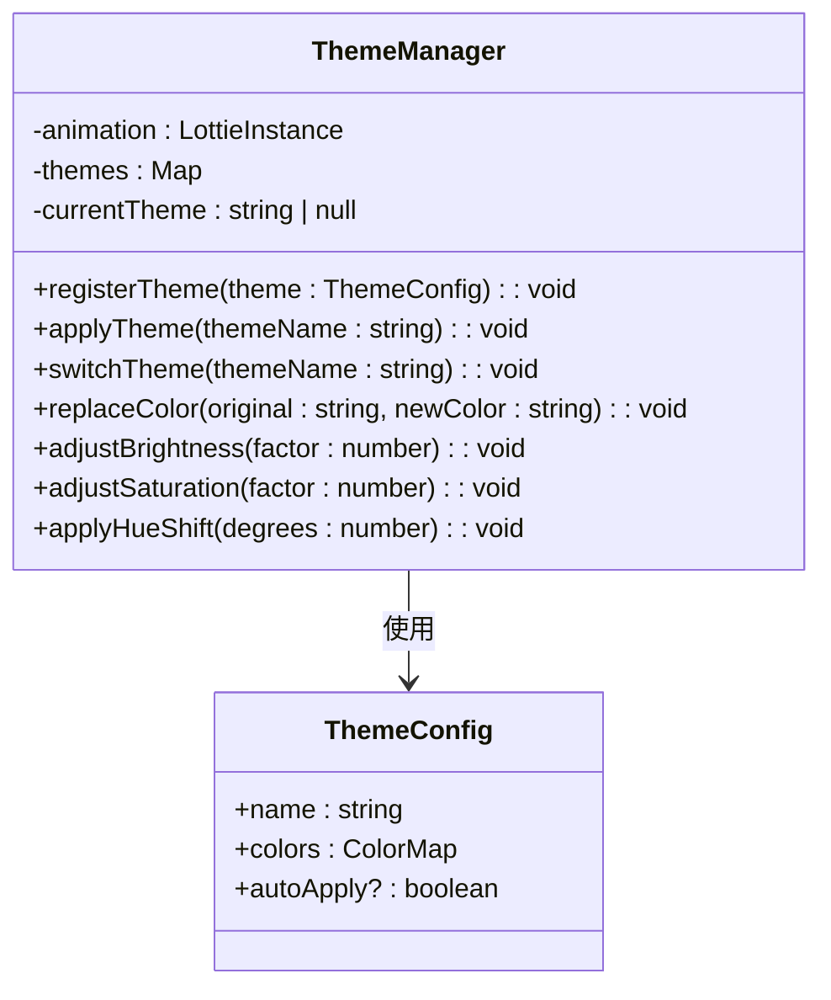
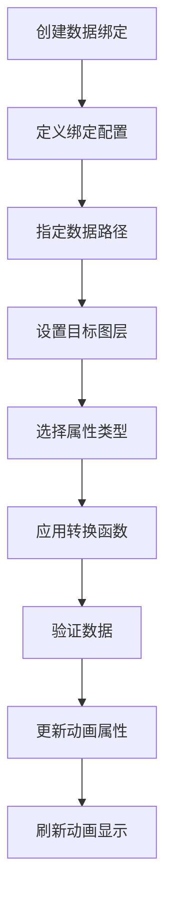
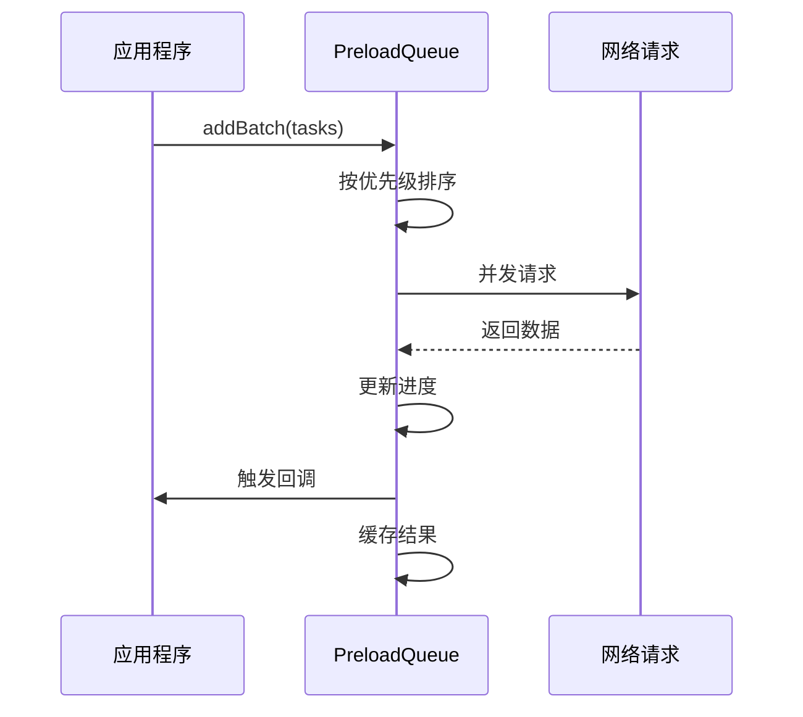
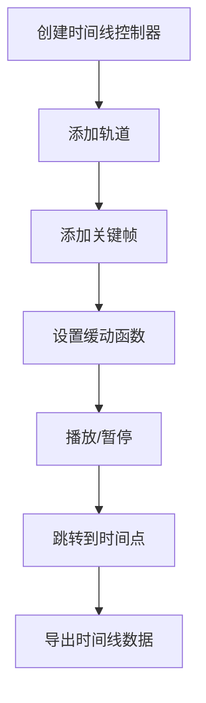
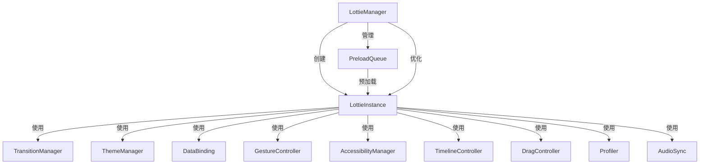

# 高级功能

<cite>
**本文档引用的文件**   
- [AdvancedFeatures.ts](file://packages/core/src/core/AdvancedFeatures.ts)
- [UtilityFeatures.ts](file://packages/core/src/core/UtilityFeatures.ts)
- [LottieManager.ts](file://packages/core/src/core/LottieManager.ts)
- [TransitionManager.ts](file://packages/core/src/core/TransitionManager.ts)
- [ThemeManager.ts](file://packages/core/src/core/ThemeManager.ts)
- [DataBinding.ts](file://packages/core/src/core/DataBinding.ts)
- [GestureController.ts](file://packages/core/src/core/GestureController.ts)
- [PreloadQueue.ts](file://packages/core/src/core/PreloadQueue.ts)
- [AudioSync.ts](file://packages/core/src/core/AudioSync.ts)
- [AccessibilityManager.ts](file://packages/core/src/core/AccessibilityManager.ts)
- [TimelineController.ts](file://packages/core/src/core/TimelineController.ts)
- [DragController.ts](file://packages/core/src/core/DragController.ts)
- [Profiler.ts](file://packages/core/src/core/Profiler.ts)
- [ADVANCED_FEATURES_EXAMPLES.md](file://examples/ADVANCED_FEATURES_EXAMPLES.md)
- [advanced-features.html](file://examples/advanced-features.html)
</cite>

## 目录
1. [高级功能概述](#高级功能概述)
2. [过渡效果管理器](#过渡效果管理器)
3. [主题管理系统](#主题管理系统)
4. [数据绑定系统](#数据绑定系统)
5. [手势控制器](#手势控制器)
6. [预加载队列](#预加载队列)
7. [音效同步系统](#音效同步系统)
8. [无障碍管理系统](#无障碍管理系统)
9. [时间线控制器](#时间线控制器)
10. [拖拽控制器](#拖拽控制器)
11. [性能分析器](#性能分析器)
12. [功能集成与调用关系](#功能集成与调用关系)
13. [常见问题与解决方案](#常见问题与解决方案)

## 高级功能概述

Lottie 动画库提供了丰富的高级功能，旨在增强动画的交互性、可访问性和性能表现。这些功能通过独立的管理器类实现，可以灵活地集成到动画实例中。核心高级功能包括过渡效果、主题切换、数据绑定、手势控制、预加载队列、音效同步、无障碍支持等。

这些功能的设计遵循模块化原则，每个功能都有独立的配置接口和方法，同时通过 LottieManager 进行全局协调和优化。高级功能的使用通常遵循"创建实例 -> 配置参数 -> 调用方法"的模式，支持链式调用和异步操作。

**Section sources**
- [AdvancedFeatures.ts](file://packages/core/src/core/AdvancedFeatures.ts#L1-L29)
- [ADVANCED_FEATURES_EXAMPLES.md](file://examples/ADVANCED_FEATURES_EXAMPLES.md#L1-L325)

## 过渡效果管理器

过渡效果管理器（TransitionManager）为 Lottie 动画提供各种平滑的视觉过渡效果。它支持淡入淡出、滑动、缩放、旋转、模糊、翻转等多种过渡类型，并内置了 12 种缓动函数。

### 接口定义

```typescript
interface TransitionConfig {
  type: TransitionType;
  direction?: TransitionDirection;
  duration?: number;
  delay?: number;
  easing?: EasingFunction;
  transform?: (progress: number, element: HTMLElement) => void;
  onComplete?: () => void;
}
```

### 使用方法



**Diagram sources**
- [TransitionManager.ts](file://packages/core/src/core/TransitionManager.ts#L1-L403)

**Section sources**
- [TransitionManager.ts](file://packages/core/src/core/TransitionManager.ts#L1-L403)
- [ADVANCED_FEATURES_EXAMPLES.md](file://examples/ADVANCED_FEATURES_EXAMPLES.md#L28-L33)

## 主题管理系统

主题管理系统（ThemeManager）支持动态颜色替换和主题切换功能，允许在运行时改变动画的视觉风格。系统通过颜色映射机制实现主题切换，支持亮度、饱和度和色调的调整。

### 域模型



**Diagram sources**
- [ThemeManager.ts](file://packages/core/src/core/ThemeManager.ts#L1-L523)

**Section sources**
- [ThemeManager.ts](file://packages/core/src/core/ThemeManager.ts#L1-L523)
- [ADVANCED_FEATURES_EXAMPLES.md](file://examples/ADVANCED_FEATURES_EXAMPLES.md#L35-L40)

## 数据绑定系统

数据绑定系统（DataBinding）实现了数据驱动的动画更新机制。它允许将外部数据源与动画属性进行绑定，当数据变化时自动更新相应的动画内容。

### 核心功能

- **属性绑定**：支持文本、位置、缩放、旋转、透明度、颜色等属性的绑定
- **数据验证**：提供验证器确保数据有效性
- **转换管道**：支持数据转换和格式化
- **响应式更新**：自动监听数据变化并更新动画

### 使用模式



**Diagram sources**
- [DataBinding.ts](file://packages/core/src/core/DataBinding.ts#L1-L541)

**Section sources**
- [DataBinding.ts](file://packages/core/src/core/DataBinding.ts#L1-L541)
- [ADVANCED_FEATURES_EXAMPLES.md](file://examples/ADVANCED_FEATURES_EXAMPLES.md#L42-L46)

## 手势控制器

手势控制器（GestureController）为 Lottie 动画添加了丰富的触摸交互功能，支持在移动设备上的各种手势操作。

### 支持的手势类型

- **轻触**：点击播放/暂停
- **滑动**：左右滑动跳转帧
- **捏合**：双指缩放
- **旋转**：双指旋转
- **长按**：触发特定动作
- **拖拽**：拖动改变动画进度

### 配置选项

```typescript
interface GestureConfig {
  enableTap?: boolean
  enableSwipe?: boolean
  enablePinch?: boolean
  enableRotate?: boolean
  enablePan?: boolean
  enablePress?: boolean
  swipeThreshold?: number
  pinchThreshold?: number
  pressDelay?: number
}
```

**Section sources**
- [GestureController.ts](file://packages/core/src/core/GestureController.ts#L1-L428)
- [ADVANCED_FEATURES_EXAMPLES.md](file://examples/ADVANCED_FEATURES_EXAMPLES.md#L48-L53)

## 预加载队列

预加载队列（PreloadQueue）管理系统用于优化动画资源的加载性能，支持优先级队列、并发控制和进度追踪。

### 核心特性

- **优先级调度**：按优先级顺序加载资源
- **并发控制**：限制同时加载的数量
- **进度追踪**：实时显示加载进度
- **错误处理**：自动重试失败的加载
- **智能缓存**：避免重复加载已缓存的资源

### 工作流程



**Diagram sources**
- [PreloadQueue.ts](file://packages/core/src/core/PreloadQueue.ts#L1-L375)

**Section sources**
- [PreloadQueue.ts](file://packages/core/src/core/PreloadQueue.ts#L1-L375)
- [ADVANCED_FEATURES_EXAMPLES.md](file://examples/ADVANCED_FEATURES_EXAMPLES.md#L55-L60)

## 音效同步系统

音效同步系统（AudioSync）实现了 Lottie 动画与音频的精确同步播放，支持标记点触发和播放控制。

### 主要功能

- **精确同步**：确保动画与音频的时间对齐
- **标记点**：在特定时间点触发事件
- **播放控制**：支持播放、暂停、停止、跳转
- **音量调节**：动态调整音量
- **播放速率**：调整播放速度

### 配置参数

```typescript
interface AudioSyncConfig {
  audioSource: string | AudioBuffer;
  markers?: AudioMarker[];
  loop?: boolean;
  volume?: number;
  playbackRate?: number;
  offset?: number;
  onLoad?: () => void;
  onPlay?: () => void;
  onPause?: () => void;
  onMarker?: (marker: AudioMarker) => void;
}
```

**Section sources**
- [AudioSync.ts](file://packages/core/src/core/AudioSync.ts#L1-L326)
- [ADVANCED_FEATURES_EXAMPLES.md](file://examples/ADVANCED_FEATURES_EXAMPLES.md#L24-L33)

## 无障碍管理系统

无障碍管理系统（AccessibilityManager）确保 Lottie 动画符合无障碍标准，支持键盘导航和屏幕阅读器。

### 核心功能

- **键盘导航**：完整的键盘快捷键支持
- **屏幕阅读器**：ARIA 标签和状态通知
- **减少动画偏好**：遵循 `prefers-reduced-motion` 设置
- **跳过动画选项**：提供快速跳转到动画结束的选项
- **符合 WCAG 2.1 标准**

### 键盘快捷键

- **空格/回车**：播放/暂停
- **左箭头**：后退 10 帧
- **右箭头**：前进 10 帧
- **Home**：跳转到开始
- **End**：跳转到结束

**Section sources**
- [AccessibilityManager.ts](file://packages/core/src/core/AccessibilityManager.ts#L1-L468)
- [ADVANCED_FEATURES_EXAMPLES.md](file://examples/ADVANCED_FEATURES_EXAMPLES.md#L62-L67)

## 时间线控制器

时间线控制器（TimelineController）提供高级时间线编辑和动画合成功能，支持关键帧动画和轨道管理。

### 核心概念

- **轨道（Track）**：包含关键帧的时间线轨道
- **关键帧（Keyframe）**：定义特定时间点的属性值
- **缓动函数**：控制动画的加速度和减速度
- **标记点**：在时间线上标记重要位置

### 方法调用关系



**Diagram sources**
- [TimelineController.ts](file://packages/core/src/core/TimelineController.ts#L1-L488)

**Section sources**
- [TimelineController.ts](file://packages/core/src/core/TimelineController.ts#L1-L488)
- [advanced-features.html](file://examples/advanced-features.html#L206-L221)

## 拖拽控制器

拖拽控制器（DragController）为 Lottie 动画添加拖拽交互功能，支持将拖拽动作映射到动画进度。

### 配置选项

```typescript
interface DragConfig {
  axis?: 'x' | 'y' | 'both'
  bounds?: { left?: number; right?: number; top?: number; bottom?: number }
  grid?: number
  inertia?: boolean
  friction?: number
  animateOnDrag?: boolean
  mapToProgress?: boolean
}
```

### 功能特性

- **轴向约束**：限制拖拽方向
- **边界约束**：限制拖拽范围
- **网格吸附**：将位置吸附到网格
- **惯性效果**：模拟物理惯性
- **进度映射**：将拖拽位置映射到动画进度

**Section sources**
- [DragController.ts](file://packages/core/src/core/DragController.ts#L1-L453)
- [advanced-features.html](file://examples/advanced-features.html#L223-L237)

## 性能分析器

性能分析器（Profiler）用于分析 Lottie 动画的性能表现，生成详细的性能报告和优化建议。

### 分析指标

- **FPS**：帧率统计
- **内存使用**：JavaScript 堆内存占用
- **CPU 使用**：估算的 CPU 占用率
- **渲染时间**：每帧的渲染耗时
- **性能瓶颈**：识别性能问题

### 报告内容

```typescript
interface PerformanceReport {
  duration: number
  samples: number
  avgFps: number
  minFps: number
  maxFps: number
  avgMemory: number
  peakMemory: number
  avgCpu: number
  avgRenderTime: number
  bottlenecks: Bottleneck[]
  suggestions: string[]
  score: number // 0-100
}
```

**Section sources**
- [Profiler.ts](file://packages/core/src/core/Profiler.ts#L1-L485)
- [advanced-features.html](file://examples/advanced-features.html#L239-L264)

## 功能集成与调用关系

高级功能之间存在复杂的集成关系，通过 LottieManager 进行统一协调和优化。

### 组件关系图



**Diagram sources**
- [LottieManager.ts](file://packages/core/src/core/LottieManager.ts#L1-L504)
- [AdvancedFeatures.ts](file://packages/core/src/core/AdvancedFeatures.ts#L1-L29)

**Section sources**
- [LottieManager.ts](file://packages/core/src/core/LottieManager.ts#L1-L504)
- [AdvancedFeatures.ts](file://packages/core/src/core/AdvancedFeatures.ts#L1-L29)

## 常见问题与解决方案

### Q: 过渡效果不平滑？

**A:** 检查缓动函数的选择，建议使用 'easeInOut' 或 'easeOutBack' 等平滑的缓动函数。同时确保动画容器的 CSS 过渡属性设置正确。

### Q: 主题切换没有效果？

**A:** 确认动画中包含可以被替换的颜色值。某些动画可能使用了纯色或图片，这些元素无法通过主题系统改变颜色。

### Q: 手势控制不工作？

**A:** 确保在支持触摸的设备上测试，或使用浏览器的设备模拟器。检查是否正确启用了相应的手势类型。

### Q: 键盘快捷键不响应？

**A:** 确保动画容器已经获得焦点（点击容器或按 Tab 键聚焦）。检查是否与其他键盘事件监听器冲突。

### Q: 预加载队列卡住？

**A:** 检查网络连接和资源路径是否正确。查看浏览器控制台是否有 404 错误。可以尝试增加重试次数。

### Q: 音效同步不同步？

**A:** 检查音频文件的加载时间，可能需要添加适当的偏移量。确保 Web Audio API 没有被浏览器策略阻止。

**Section sources**
- [ADVANCED_FEATURES_EXAMPLES.md](file://examples/ADVANCED_FEATURES_EXAMPLES.md#L289-L304)