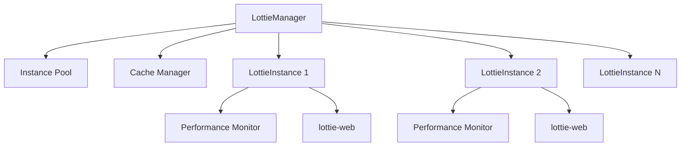

# Introduction

## What is @ldesign/lottie?

`@ldesign/lottie` is a powerful, feature-rich wrapper around [lottie-web](https://github.com/airbnb/lottie-web) that provides advanced features like instance management, performance monitoring, caching, and framework adapters for Vue and React.

## Features

### 🎯 Framework Agnostic Core

The core library works with vanilla JavaScript and can be integrated into any framework. We provide official adapters for Vue and React with hooks, components, and directives.

### ⚡️ Performance Optimized

- **Instance Pooling**: Efficiently manage multiple animation instances
- **Smart Caching**: Cache animation data to reduce network requests
- **Lazy Loading**: Load animations only when needed
- **Intersection Observer**: Load animations when they enter the viewport
- **Performance Monitoring**: Track FPS, memory usage, and render performance
- **Auto Degradation**: Automatically reduce quality when performance drops

### 🎨 Rich Configuration

- Multiple renderer types (SVG, Canvas, HTML)
- Playback control (play, pause, stop, reset)
- Speed and direction control
- Segment playback
- Loop and autoplay options
- Quality settings
- Custom event handlers
- Style customization

### 📦 Small & Tree-Shakeable

The library is designed to be tree-shakeable, so you only bundle what you use. The core is minimal and additional features can be imported on-demand.

### 🔧 Developer Experience

- Full TypeScript support
- Comprehensive documentation
- Rich examples for different frameworks
- Intuitive API design
- Extensive error handling

## How It Works

### Architecture

1. **LottieManager**: Singleton manager that handles all instances
2. **Instance Pool**: Manages instance lifecycle and reuse
3. **Cache Manager**: Stores and retrieves animation data
4. **LottieInstance**: Wraps lottie-web with additional features
5. **Performance Monitor**: Tracks and reports performance metrics

## When to Use

### ✅ Good Use Cases

- Multiple animations on a single page
- Dynamic animation loading
- Need for performance monitoring
- Complex animation state management
- Framework-specific integrations
- Production applications with performance requirements

### ❌ When You Might Not Need It

- Single, simple animation
- No performance concerns
- Direct lottie-web API preference
- Minimal bundle size is critical (though we're already pretty small!)

## Browser Support

- Chrome (latest)
- Firefox (latest)
- Safari (latest)
- Edge (latest)
- iOS Safari 12+
- Chrome Android (latest)

## Next Steps

Ready to get started? Check out the [Installation](/guide/installation) guide!
